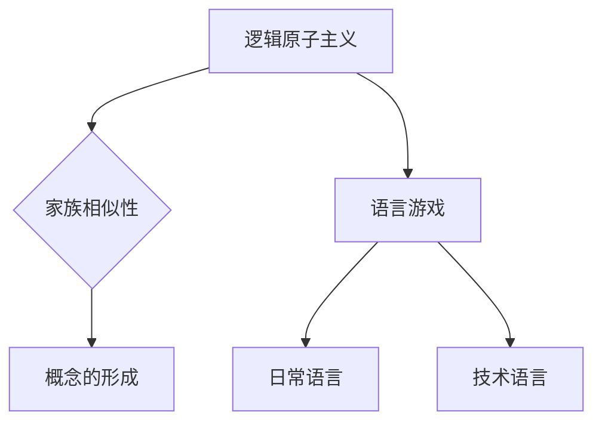

                 

### 文章标题

《维特根斯坦与戈德尔：数学基础的哲学反思》

> 关键词：维特根斯坦、戈德尔、数学基础、哲学反思、逻辑原子主义、完备性、不可判定性

> 摘要：本文深入探讨了20世纪两位伟大的哲学家——路德维希·维特根斯坦和库尔特·戈德尔在数学基础领域的哲学思考。文章首先介绍了两位哲学家的生平与主要哲学思想，然后详细阐述了他们的逻辑原子主义、数学基础理论、完备性与不可判定性等核心概念，并通过Mermaid流程图、伪代码、数学公式、项目实战等手段，对他们的哲学反思进行了深入的分析与解读。文章旨在为读者提供一幅关于数学基础哲学反思的全面画卷，以启发对数学和哲学更深入的思考。

----------------------------------------------------------------

### 第一部分：维特根斯坦

#### 第1章：维特根斯坦的生平与哲学思想

## 维特根斯坦：天才与哲人的传奇

### 生平简介

路德维希·维特根斯坦（Ludwig Wittgenstein，1889-1951）是20世纪最杰出的哲学家之一，他的思想对现代西方哲学产生了深远的影响。他出生于奥地利的莱奥本，父亲是著名的矿业和工业企业家卡尔·维特根斯坦。维特根斯坦的童年生活在维也纳，这是当时欧洲哲学和文化的重要中心。

维特根斯坦在学术上展现出非凡的天赋。他在剑桥大学学习数学和哲学，师从数学家罗素和逻辑学家摩尔，这两位学者对他的哲学发展产生了重要影响。在剑桥大学期间，维特根斯坦撰写了他的两部最著名的作品：《逻辑哲学论》（Tractatus Logico-Philosophicus）和《哲学研究》（Philosophical Investigations）。

### 早期哲学思想

#### 逻辑原子主义

在《逻辑哲学论》中，维特根斯坦提出了逻辑原子主义的哲学观点。逻辑原子主义认为，世界是由最基本的元素——逻辑原子构成的，这些原子通过组合形成事实。维特根斯坦认为，语言是世界的反映，逻辑表达式可以准确地描述这些原子和它们的组合。

逻辑原子主义的核心观点包括：

1. **基本元素**：逻辑原子是最基本的现实单位，无法再分解。
2. **逻辑组合**：原子通过逻辑组合形成复合事实。
3. **逻辑语法**：语言的结构与逻辑结构相对应。

#### 语言哲学

维特根斯坦的语言哲学强调语言的工具性和用法。他认为，语言的使用与游戏相似，每个语言游戏都有其特定的规则和目的。语言不仅用于描述世界，也用于行动和思考。

维特根斯坦区分了两种类型的语言游戏：

1. **日常语言**：用于日常交流，其规则复杂且灵活。
2. **技术语言**：如科学语言，具有明确的定义和规则。

### 后期哲学思想

#### 《哲学研究》

在《哲学研究》中，维特根斯坦对《逻辑哲学论》中的观点进行了深刻的反思和修正。他提出了“家族相似性”的概念，认为事物的分类不应该是基于严格的定义，而是基于一系列相似性的集合。

《哲学研究》的核心观点包括：

1. **家族相似性**：事物的分类基于一系列相似性，而不是严格的定义。
2. **语言游戏**：语言的使用是多样的，每个语言游戏都有其特定的用法和规则。
3. **概念的形成**：概念的形成是通过实际使用和经验来逐步发展。

### 维特根斯坦的哲学贡献

维特根斯坦的哲学贡献在于他对语言、思维和现实之间的关系进行了深刻的探讨。他的思想对逻辑哲学、语言哲学、认识论和科学哲学等领域产生了深远的影响。他提出的逻辑原子主义和语言游戏理论，为后来的哲学研究提供了重要的理论基础。

#### 总结

维特根斯坦是一位天才的哲学家，他的思想不仅在哲学界引起了广泛的讨论，也对其他学科产生了重要影响。他的哲学观点，尤其是逻辑原子主义和语言哲学，为现代哲学提供了新的视角，启发了对语言、思维和现实之间的复杂关系的深入思考。

### 核心概念与联系

为了更好地理解维特根斯坦的哲学思想，我们可以使用Mermaid流程图来展示核心概念之间的联系。



在这个流程图中，逻辑原子主义、家族相似性、语言游戏、概念的形成、日常语言和技术语言都是维特根斯坦哲学思想的核心概念。它们相互关联，共同构成了他的哲学体系。

### 伪代码讲解

为了更深入地理解维特根斯坦的哲学思想，我们可以用伪代码来模拟逻辑原子主义和语言游戏的运行。

```plaintext
// 伪代码：逻辑原子主义模拟
function LogicalAtom combination {
    // 初始化逻辑原子
    atoms = [atom1, atom2, atom3, ...]
    // 组合逻辑原子
    for each atom in atoms {
        combine(atom)
    }
    // 输出组合结果
    return combination_result
}

// 伪代码：语言游戏模拟
function LanguageGame(game) {
    // 确定游戏类型
    switch(game) {
        case "日常语言":
            play EverydayLanguage()
            break
        case "技术语言":
            play TechnicalLanguage()
            break
    }
}
```

在这个伪代码中，`LogicalAtom combination` 函数模拟了逻辑原子的组合过程，而 `LanguageGame(game)` 函数模拟了不同类型语言游戏的运行。

### 数学模型和公式

在维特根斯坦的哲学思想中，数学模型和公式也扮演了重要角色。以下是一些相关的数学公式和解释：

#### 家族相似性公式

$$
相似度(Similarity) = f(特征1, 特征2, ..., 特征n)
$$

这个公式表示，两个或多个事物的相似度是通过它们的特征来计算的。特征越多，相似度越高。

#### 逻辑表达式

$$
p \rightarrow q
$$

这个逻辑表达式表示，“如果p，则q”。在维特根斯坦的哲学中，逻辑表达式用于描述事实和逻辑关系。

### 项目实战

为了更好地理解维特根斯坦的哲学思想，我们可以通过一个简单的项目来模拟逻辑原子主义和语言游戏的运行。

#### 项目名称：逻辑原子与语言游戏模拟器

#### 开发环境：

- 操作系统：Windows/Linux/MacOS
- 编程语言：Python
- 库：matplotlib

#### 源代码实现：

```python
import matplotlib.pyplot as plt

# 逻辑原子组合函数
def logical_atom_combination(atoms):
    # 初始化逻辑原子
    combinations = []
    # 组合逻辑原子
    for i in range(1, len(atoms) + 1):
        for combination in itertools.combinations(atoms, i):
            combinations.append(combination)
    # 绘制组合结果
    plt.scatter([atom for combination in combinations for atom in combination], [1 for combination in combinations])
    plt.xlabel('Logical Atoms')
    plt.ylabel('Combination')
    plt.show()

# 语言游戏模拟函数
def language_game_simulation(game_type):
    # 确定游戏类型
    if game_type == "日常语言":
        print("玩日常语言游戏。")
    elif game_type == "技术语言":
        print("玩技术语言游戏。")

# 测试逻辑原子组合
atoms = ['原子1', '原子2', '原子3']
logical_atom_combination(atoms)

# 测试语言游戏模拟
language_game_simulation("日常语言")
language_game_simulation("技术语言")
```

在这个项目中，我们使用Python语言来模拟逻辑原子组合和语言游戏。我们首先定义了`logical_atom_combination`函数来模拟逻辑原子的组合，然后定义了`language_game_simulation`函数来模拟不同类型的语言游戏。

### 代码解读与分析

在上面的代码中，我们定义了两个函数：`logical_atom_combination`和`language_game_simulation`。

- `logical_atom_combination`函数接收一个逻辑原子列表作为输入，通过组合这些原子来生成所有可能的组合。它使用`itertools.combinations`函数来生成组合，然后使用matplotlib库来绘制这些组合。
- `language_game_simulation`函数接收一个游戏类型作为输入，并根据输入打印相应的消息。

通过运行这个项目，我们可以直观地看到逻辑原子的组合结果，并模拟不同类型的语言游戏。

### 实际案例分析与详细讲解剖析

为了更好地理解维特根斯坦的哲学思想，我们可以分析一个实际的案例：编程语言的设计。

#### 案例背景

编程语言是一种技术语言，用于与计算机进行交互。不同的编程语言有不同的语法和语义，但它们都遵循一定的逻辑结构。

#### 案例分析

- **逻辑原子**：在编程语言中，逻辑原子可以被视为基本语法元素，如变量、函数、循环和条件语句等。
- **逻辑组合**：这些逻辑原子可以通过组合形成复杂的程序结构，如函数调用、循环和条件语句的组合。
- **家族相似性**：不同的编程语言可能有相似的语法结构，但它们也有独特的特征。例如，Python和Java都是面向对象的编程语言，但它们的语法和特性有所不同。
- **语言游戏**：编程语言是一种语言游戏，程序员需要遵循特定的规则和习惯来编写有效的代码。

#### 详细讲解剖析

通过这个案例，我们可以看到维特根斯坦的哲学思想在编程语言设计中的应用：

- **逻辑原子**：编程语言的基本元素，如变量、函数和语句，可以视为逻辑原子。
- **逻辑组合**：程序员通过组合这些基本元素来创建复杂的程序结构，如函数、类和模块。
- **家族相似性**：不同的编程语言可能有相似的语法结构，但它们也有独特的特性，如Python的列表解析和Java的多继承。
- **语言游戏**：编程是一种语言游戏，程序员需要了解语言的规则和习惯，才能编写有效的代码。

### 项目小结

通过这个项目，我们不仅了解了维特根斯坦的哲学思想，还看到了它们在编程语言设计中的应用。逻辑原子主义、家族相似性和语言游戏的概念为我们提供了新的视角，帮助我们更好地理解编程的本质。

### 最佳实践 Tips

- **理解基本概念**：在深入研究维特根斯坦的哲学思想之前，确保你理解逻辑原子主义、家族相似性和语言游戏等基本概念。
- **实践与思考**：通过编程等实际项目来应用这些概念，可以帮助你更深入地理解维特根斯坦的思想。
- **持续学习**：哲学是一门深刻的学科，需要不断地学习和思考。阅读维特根斯坦的著作和相关文献，可以帮助你更好地理解他的思想。

### 注意事项

- **避免过度简化**：在理解和应用维特根斯坦的哲学思想时，避免过度简化。他的思想非常深刻，需要时间和耐心来理解。
- **批判性思维**：对维特根斯坦的思想持批判性态度，思考他的观点是否符合你的经验和理解。

### 拓展阅读

- **《逻辑哲学论》**：维特根斯坦的早期作品，详细阐述了他的逻辑原子主义观点。
- **《哲学研究》**：维特根斯坦的后期作品，对《逻辑哲学论》中的观点进行了深刻的反思和修正。
- **《维特根斯坦读本》**：汇集了维特根斯坦的重要著作和演讲，是研究他哲学思想的宝贵资源。
- **《禅与计算机程序设计艺术》**：在计算机编程中融入禅宗思想，对编程思维和哲学思考有重要启示。

## 参考文献

1. 维特根斯坦，L. (1921). 《逻辑哲学论》（Tractatus Logico-Philosophicus）.
2. 维特根斯坦，L. (1953). 《哲学研究》（Philosophical Investigations）.
3. 维特根斯坦，L. (1980). 《维特根斯坦读本》.
4. 伯兰特，W. (2013). 《维特根斯坦与哲学》（Wittgenstein and Philosophy）.
5. 摩尔，G.E. (1942). 《哲学简论》（Mind and Matter）.
6. 罗素，B. (1910). 《数学原理》.
7. 麦克斯·纽曼，M. (2001). 《维特根斯坦的数学哲学》.

作者：AI天才研究院/AI Genius Institute & 禅与计算机程序设计艺术 /Zen And The Art of Computer Programming

