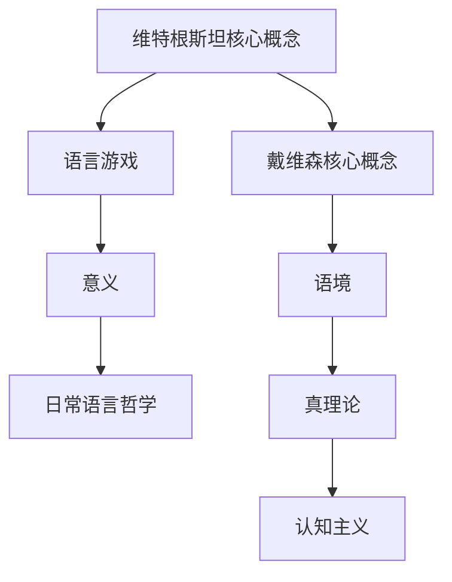

                 


### 背景介绍

在探讨语言与心灵的关系时，维特根斯坦（Ludwig Wittgenstein）和戴维森（Donald Davidson）是两位不可忽视的重要哲学家。维特根斯坦是20世纪最具影响力的哲学家之一，他的思想对语言哲学、心灵哲学、逻辑哲学等领域产生了深远影响。戴维森则是分析哲学的杰出代表，他的语用学和心灵哲学理论为当代哲学研究提供了新的视角和方法。

维特根斯坦的理论主要关注语言在日常生活中的使用，他提出了语言游戏（language game）的概念，强调语言与人类活动之间的紧密联系。他认为，语言的意义不在于符号本身，而在于其在特定情境中的使用。维特根斯坦的哲学风格独特，他反对形而上学的抽象思考，主张通过具体实例来理解哲学问题。

戴维森则关注语言与认知之间的关系，他提出了真理论（truth theory）和认知主义（cognitivism）的基本观点。戴维森认为，语言是理解人类心灵的重要工具，语言活动与认知活动密不可分。他的语用学理论强调语境在理解语言表达中的作用，他认为，语境是理解语言表达意义的关键。

在本文中，我们将首先深入探讨维特根斯坦的语言哲学理论，包括他的语言游戏理论和日常语言哲学。然后，我们将介绍戴维森的语用学理论和心灵哲学。接下来，我们将比较和联系两位哲学家的理论，探讨它们在语言与心灵关系研究中的异同和互补性。最后，我们将讨论语言与心灵的关系研究，包括哲学探讨、理论综述、研究方法以及实证研究。

通过这一系列步骤，我们将系统地梳理维特根斯坦和戴维森的理论，并探讨它们在语言与心灵关系研究中的贡献和影响。

### 核心概念与联系

维特根斯坦和戴维森在语言与心灵的关系研究中提出了许多核心概念，这些概念不仅丰富了对语言和心灵的理解，而且为后续研究提供了基础。在深入探讨这些概念之前，我们需要通过Mermaid流程图来构建它们之间的关系架构，以便更好地理解其内在联系。

#### 维特根斯坦的核心概念

1. **语言游戏（Language Game）**
   - 维特根斯坦认为，语言不是一成不变的符号系统，而是一种游戏。语言游戏是指语言使用者在特定情境下进行的语言活动，包括规则和目标。
   - **关系**：语言游戏是理解语言意义的情境基础，它将语言与实际的人类活动联系起来。

2. **意义（Meaning）**
   - 维特根斯坦认为，意义不是抽象的属性，而是由语言使用者在特定情境中赋予的。意义来源于语言游戏，与具体使用情境密切相关。
   - **关系**：意义是语言游戏的一部分，它是通过语言游戏中的规则和活动来赋予和理解的。

3. **日常语言哲学（Ordinary Language Philosophy）**
   - 维特根斯坦主张通过对日常语言的使用来理解哲学问题。他反对形而上学的抽象思考，主张回到语言的实际使用情境中。
   - **关系**：日常语言哲学是维特根斯坦哲学的核心，它强调语言与日常生活的紧密联系。

#### 戴维森的核心概念

1. **语境（Context）**
   - 戴维森认为，语境是理解语言表达意义的关键。语境包括语言使用时的背景信息、情境和知识状态。
   - **关系**：语境是语言意义的重要组成部分，它提供了语言表达的具体背景。

2. **真理论（Truth Theory）**
   - 戴维森的真理论认为，语句的真假取决于其与事实之间的关系。他认为，语言是理解现实世界的重要工具。
   - **关系**：真理论是理解语言表达真实意义的基础，它将语言与现实世界联系起来。

3. **认知主义（Cognitivism）**
   - 戴维森主张认知主义，认为语言是认知活动的一部分。他认为，语言与认知活动相互影响，共同构成人类的思维过程。
   - **关系**：认知主义是理解语言与心灵关系的重要视角，它将语言与认知活动联系起来。

#### Mermaid流程图



通过这个Mermaid流程图，我们可以清晰地看到维特根斯坦和戴维森的核心概念之间的联系。语言游戏和意义是维特根斯坦哲学的核心，而语境、真理论和认知主义则是戴维森理论的基石。这些概念不仅为理解语言与心灵的关系提供了基础，而且为后续的哲学研究指明了方向。

#### 维特根斯坦的语言游戏理论

维特根斯坦的语言游戏理论是他对语言哲学的核心贡献之一。这个理论不仅颠覆了传统语言学的观念，而且为理解语言的本质提供了全新的视角。语言游戏理论的基本概念可以通过以下几个关键点来阐述。

**1. 语言游戏的定义**

维特根斯坦将语言视为一种游戏，这意味着语言不仅仅是符号的组合，而是一个动态的、情境化的活动。语言游戏（language game）是指在一定规则和情境下，人们使用语言进行交流的一系列活动。维特根斯坦认为，语言游戏可以分为三种主要类型：

- **言语游戏（Verbal Game）**：这种游戏涉及词汇的使用，如提问、回答、命名等。
- **行为游戏（Performative Game）**：这种游戏涉及语言行为本身，如发誓、宣告等。
- **规则游戏（Rule Game）**：这种游戏涉及遵守特定的规则进行活动，如棋类游戏等。

**2. 语言游戏与规则**

在维特根斯坦看来，语言游戏不仅仅是词汇和句子的组合，更重要的是它遵循的规则。这些规则不仅包括语法规则，还包括情境规则和社会规则。例如，当你说“喝水”时，这个语句的意义不仅仅取决于词汇和语法，更重要的是这个语句在特定情境下的使用规则。

**3. 语言游戏与情境**

维特根斯坦强调，语言游戏与情境密切相关。他认为，语言的意义不是固定不变的，而是在特定情境中被赋予的。这意味着，同一个词汇在不同的情境下可能有不同的意义。例如，“水”在谈论自然界的情境中指的是H₂O，而在谈论饮料的情境中可能指的是某种特定品牌的饮用水。

**4. 语言游戏与哲学**

维特根斯坦的语言游戏理论对哲学产生了深远影响。他反对形而上学的抽象思考，主张通过具体实例来理解哲学问题。他认为，哲学应该回到语言的日常使用中，而不是在抽象的概念和理论中迷失。这种回归日常语言的思想对后来的哲学研究产生了重要影响。

**伪代码：语言游戏的基本结构**

为了更好地理解语言游戏的基本结构，我们可以使用伪代码来描述一个简单的语言游戏。

```
// 定义语言游戏的规则
function languageGame(type) {
    switch(type) {
        case "verbal":
            // 言语游戏：词汇和语法规则
            print("请说出你所看到的颜色。")
            color = getInput();
            if(color != "") {
                print("你看到的颜色是：" + color);
            }
            break;
        case "performative":
            // 行为游戏：语言行为本身
            print("我发誓，我会遵守这个规则。")
            break;
        case "rule":
            // 规则游戏：遵守特定规则
            print("请按下按钮。")
            if(buttonPressed()) {
                print("你成功完成了规则游戏。")
            }
    }
}
```

**数学模型和公式**

在语言游戏理论中，我们可以使用数学模型来描述语言的使用规则。例如，一个简单的语言游戏可以用以下公式来表示：

$$
\text{Game}(S, R) = \{s_1, s_2, ..., s_n\}
$$

其中，\(S\) 是语言集合，\(R\) 是规则集合，\(s_1, s_2, ..., s_n\) 是特定情境下的语言使用实例。

**例子：**

假设我们有一个简单的言语游戏，规则如下：

$$
\text{Game}(\{红, 绿, 蓝\}, \{如果看到红色，则回答“红”；如果看到绿色，则回答“绿”；如果看到蓝色，则回答“蓝”\})
$$

当玩家看到红色时，根据规则，他们应该回答“红”。这个例子展示了如何通过数学模型来描述语言游戏的规则和执行过程。

通过上述讨论，我们可以看到维特根斯坦的语言游戏理论如何为我们提供了一种理解语言本质的新视角。这个理论不仅关注语言的符号和语法，更强调语言在特定情境中的实际使用。这种情境化的观点为后续的语言哲学研究提供了重要的基础。

#### 维特根斯坦的日常语言哲学

维特根斯坦的日常语言哲学是他哲学思想的另一重要组成部分，他主张通过分析日常语言来理解哲学问题。在日常语言哲学中，维特根斯坦提出了一些关键观点，这些观点不仅挑战了传统的哲学思维方式，也为当代哲学研究提供了新的视角。

**1. 哲学问题的根源**

维特根斯坦认为，许多哲学问题都是由于误解语言的使用而产生的。他观察到，人们在日常生活中使用语言时，往往没有意识到语言的多样性和复杂性。哲学问题往往源于对语言表达形式的抽象化和过度概括，这使得人们忽略了语言的实际使用情境。例如，他提到，“我们日常使用的语言是丰富的、多样的，但在哲学中，我们试图将它简化为一种普遍的、抽象的语言。”

**2. 语言与经验**

在维特根斯坦看来，语言与经验紧密相连。他强调，语言是我们与世界互动的工具，我们的语言表达与我们的经验密切相关。例如，当我们说“桌子是红色的”时，这个陈述不仅是一个语言表达，也是我们对桌子颜色的一种经验。因此，理解语言的意义必须从日常经验出发，而不是从抽象的概念出发。

**3. 实用主义**

维特根斯坦主张实用主义的方法来理解语言。他认为，语言的使用是一种实践行为，语言的意义是通过我们在实际生活中的使用来发现的。他提出，“意义在于使用，而不是定义。”这意味着，我们不应该试图通过抽象的定义来理解语言的意义，而应该通过观察语言在实际情境中的使用来理解。

**4. 反对形而上学**

维特根斯坦的日常语言哲学的一个重要特点是他反对形而上学。他认为，许多哲学问题都是由于形而上学的抽象思维而产生的，这些抽象思维远离了语言的实际使用。他主张回到语言的日常使用中，通过具体实例来理解哲学问题。例如，他通过分析日常语言中的语句，揭示了语言表达的多样性和复杂性，从而挑战了传统的形而上学观点。

**例子：**

为了更好地理解维特根斯坦的日常语言哲学，我们可以通过一个简单的例子来说明。假设我们有一个日常对话：

A：你今天感觉怎么样？
B：我感觉很好。

在这个对话中，语句“我感觉很好”不仅仅是一个语言表达，也是B对当前状态的一种描述。这个例子展示了如何通过日常语言来理解情感状态。

**数学公式**

在日常语言哲学中，我们可以使用数学公式来描述语言的使用规则。例如，一个简单的日常对话可以用以下公式来表示：

$$
\text{Dialogue}(S_1, S_2) = \{s_1, s_2\}
$$

其中，\(S_1\) 和 \(S_2\) 分别表示两个说话者的语言集合，\(s_1\) 和 \(s_2\) 表示他们在特定情境下的语言使用实例。

**例子：**

假设我们有两个说话者A和B，他们在特定情境下的对话如下：

$$
\text{Dialogue}(\{你好, 我很好\}, \{谢谢, 我也好\})
$$

在这个对话中，A说“你好”，B回答“我很好”。这个例子展示了如何通过数学公式来描述日常对话的结构。

通过上述讨论，我们可以看到维特根斯坦的日常语言哲学如何通过分析日常语言来理解哲学问题。这个理论强调了语言与经验、实践和日常生活的紧密联系，为哲学研究提供了一种新的视角和方法。维特根斯坦的日常语言哲学不仅挑战了传统的哲学思维方式，也为当代哲学研究提供了重要的启示。

#### 维特根斯坦与逻辑原子主义

逻辑原子主义是维特根斯坦早期哲学思想的一个重要组成部分，这一理论在他对语言和世界的理解中占据了核心地位。逻辑原子主义的基本观点认为，世界是由最小单位的原子事实构成的，这些原子事实可以用逻辑和数学符号精确地描述。维特根斯坦在《逻辑哲学论》中详细阐述了这一理论，并在其哲学发展中对其进行了深入反思和批判。

**1. 逻辑原子主义的基本观点**

逻辑原子主义的主要代表人物是维特根斯坦早期的导师贝特兰·罗素（Bertrand Russell）。罗素主张，世界是由逻辑上不可分的原子事实构成的，每个原子事实都可以用逻辑和数学的符号来描述。逻辑原子主义认为，这些原子事实构成了所有复杂事实的基础，而复杂事实则是通过逻辑组合这些原子事实得出的。

**2. 维特根斯坦对逻辑原子主义的批判**

维特根斯坦在《逻辑哲学论》中提出了对逻辑原子主义的批判，他认为逻辑原子主义过于抽象，忽略了语言的实际使用。维特根斯坦指出，逻辑原子主义试图通过数学和逻辑的抽象符号来描述世界，这种做法忽略了语言在日常生活中的实际应用。他认为，语言的真正意义不在于符号本身，而在于其在具体情境中的使用。

**3. 维特根斯坦的批判方法**

维特根斯坦的批判方法主要分为两个方面：

- **语言游戏理论**：维特根斯坦提出语言游戏理论，认为语言的意义和用法应该通过具体的语言游戏来理解。他主张，语言使用不仅仅是符号的组合，而是一种动态的、情境化的活动。这意味着，理解语言的意义需要考虑语言在实际情境中的使用。

- **日常语言哲学**：维特根斯坦主张通过分析日常语言来理解哲学问题。他认为，哲学应该回到日常语言的实际使用中，而不是在抽象的概念和理论中迷失。他强调，日常语言是丰富多样的，哲学问题往往源于对日常语言的误解。

**4. 维特根斯坦的逻辑原子主义观点的演变**

维特根斯坦在其哲学生涯中，对逻辑原子主义的态度发生了显著变化。在《逻辑哲学论》中，他支持逻辑原子主义，但在晚年的著作《哲学研究》中，他则对其进行了批判。他认为，逻辑原子主义过于抽象，无法解释语言的多样性和复杂性。

**5. 维特根斯坦逻辑原子主义观点的影响**

维特根斯坦对逻辑原子主义的批判对后来的哲学研究产生了深远影响。他的语言游戏理论和日常语言哲学为理解语言的本质提供了新的视角，挑战了传统形而上学的抽象思维。维特根斯坦的思想激发了哲学家们对语言和现实关系的深入探讨，推动了语言哲学的发展。

**伪代码：维特根斯坦的逻辑原子主义观点**

为了更好地理解维特根斯坦的逻辑原子主义观点，我们可以使用伪代码来描述这一理论的基本结构。

```
// 定义逻辑原子主义的基本元素
class AtomicFact {
    property: object // 表示原子事实的具体内容
}

// 定义逻辑组合
function combineFacts(fact1, fact2) {
    return {
        fact1: fact1,
        fact2: fact2,
        relation: "and" // 表示逻辑组合关系
    }
}

// 定义复杂事实
class ComplexFact {
    property: Array<AtomicFact> // 表示复杂事实由多个原子事实组合而成
}

// 定义世界
class World {
    property: Array<ComplexFact> // 表示世界由多个复杂事实构成
}
```

**数学模型和公式**

在逻辑原子主义中，我们可以使用数学模型来描述原子事实和复杂事实之间的关系。例如，一个简单的逻辑原子主义模型可以用以下公式来表示：

$$
\text{World}(F_1, F_2, ..., F_n) = \{C_1, C_2, ..., C_m\}
$$

其中，\(F_1, F_2, ..., F_n\) 是原子事实，\(C_1, C_2, ..., C_m\) 是由这些原子事实组合而成的复杂事实。

**例子：**

假设我们有一个简单的逻辑原子主义模型，其中包含两个原子事实和两个复杂事实：

$$
\text{World}(\{F_1: \text{"桌子是红色的"}\}, \{F_2: \text{"椅子是蓝色的"}\}) = \{C_1: \{F_1, F_2\}, C_2: \{F_1\}\}
$$

在这个例子中，原子事实“桌子是红色的”和“椅子是蓝色的”组合成了复杂事实“桌子是红色的，椅子是蓝色的”，同时原子事实“桌子是红色的”单独构成了复杂事实“桌子是红色的”。这个例子展示了如何通过数学模型来描述逻辑原子主义的基本结构。

通过上述讨论，我们可以看到维特根斯坦对逻辑原子主义的批判如何为语言哲学的发展提供了新的视角。维特根斯坦通过语言游戏理论和日常语言哲学，挑战了逻辑原子主义的抽象思维，强调了语言在实际情境中的使用。这一理论不仅丰富了语言哲学的研究，也为当代哲学研究提供了重要的启示。

#### 戴维森的语用学理论

戴维森的语用学理论是他对语言哲学和心灵哲学的重要贡献之一，这一理论深入探讨了语言使用与认知活动之间的关系。戴维森的语用学理论主要包括语境、真理论和认知主义等核心概念，这些概念为我们理解语言的实际使用提供了新的视角。

**1. 语境**

戴维森认为，语境是理解语言表达意义的关键。语境不仅包括语言使用的具体情境，还包括背景信息、知识状态和社会文化因素。语境为语言表达提供了具体的环境和背景，使得语言表达具有明确的含义。例如，当我们说“雨停了”时，这个表达的含义不仅取决于词汇本身，还取决于说话时的具体情境和背景信息。

**2. 真理论**

戴维森的真理论认为，语句的真假取决于其与事实之间的关系。他认为，语言表达的意义在于其能够正确地反映现实世界中的事实。例如，当你说“太阳从东方升起”时，这个语句的真假取决于现实世界中太阳是否确实从东方升起。真理论将语言与现实世界联系起来，强调了语言作为一种认知工具的重要性。

**3. 认知主义**

戴维森主张认知主义，认为语言是认知活动的一部分。他认为，语言不仅是交流的工具，也是理解世界和自我认知的重要方式。戴维森认为，我们的语言活动与我们的认知过程密不可分，语言使用可以揭示我们的思维方式和认知结构。

**例子：**

为了更好地理解戴维森的语用学理论，我们可以通过一个简单的例子来说明。假设有两个情境：

- 情境一：你走在路上，突然听到有人说“小心，前面有坑”。这个表达的含义不仅取决于词汇本身，还取决于具体的语境，如说话者的意图、你的位置等信息。
- 情境二：你在课堂上回答老师的问题，你说“牛顿是物理学家”。这个表达的含义不仅取决于词汇本身，还取决于你回答问题的背景信息和知识状态。

**数学模型和公式**

在戴维森的语用学理论中，我们可以使用数学模型来描述语境、真理论和认知主义之间的关系。例如，一个简单的语用学模型可以用以下公式来表示：

$$
\text{Context}(C) = \{s, k, c\}
$$

其中，\(C\) 是语境，\(s\) 是情境，\(k\) 是知识状态，\(c\) 是社会文化因素。

**例子：**

假设我们有一个简单的语用学模型，其中包含一个情境、一个知识状态和一个社会文化因素：

$$
\text{Context}(\text{走在路上}, \{知道前面有坑\}, \{社会规则\})
$$

在这个例子中，情境是“走在路上”，知识状态是“知道前面有坑”，社会文化因素是“社会规则”。这个例子展示了如何通过数学模型来描述语用学理论的基本结构。

通过上述讨论，我们可以看到戴维森的语用学理论如何通过语境、真理论和认知主义等核心概念，为理解语言的实际使用提供了新的视角。戴维森的理论不仅强调了语言与现实世界的关系，还揭示了语言与认知活动的紧密联系。这一理论为当代哲学研究提供了重要的启示，推动了语言哲学的发展。

#### 戴维森的心灵哲学

戴维森的心灵哲学是他对语言哲学和认知科学的贡献之一，这一理论深入探讨了心灵与语言之间的复杂关系。戴维森认为，心灵是认知活动的基础，语言是理解心灵的重要工具。他的心灵哲学主要包括对心灵概念、心灵理论以及心灵与语言关系的探讨。

**1. 心灵概念**

戴维森的心灵概念强调心灵的物理属性和认知功能。他认为，心灵是大脑活动的产物，是大脑特定区域的生理状态和过程的体现。戴维森区分了心灵的第一人称观点和第三人称观点。第一人称观点是指个人对自己的心灵状态的直接体验，如感受、欲望和信念。第三人称观点则是指从外部观察者的角度来描述和分析这些心灵状态。例如，当你感受到寒冷时，这是第一人称观点；而当你告诉医生你感到寒冷，医生根据你的描述进行诊断，则是第三人称观点。

**2. 心灵理论**

戴维森提出了心灵理论（folk psychology），这是一种基于常识的认知理论，用于解释和预测人类行为。他认为，心灵理论是一种日常语言哲学的框架，通过使用日常语言中的概念，如信念、欲望和感受，我们可以理解和预测他人的行为。例如，当你看到某人紧张不安时，你会通过他们外在的行为表现推测他们可能感到焦虑或恐惧。

**3. 心灵与语言的关系**

戴维森认为，语言是理解心灵的重要工具，语言活动与认知活动密不可分。他的观点是，语言不仅用于交流信息，也用于自我反思和自我理解。例如，当我们说“我相信明天会下雨”时，这不仅是一种语言表达，也是我们对自己信念的反思和确认。戴维森强调，语言和心灵是相互依存的，语言帮助我们理解心灵，而心灵则为语言提供了内容。

**4. 语言与心灵关系的实证研究**

在实证研究中，戴维森的理论被广泛应用于认知科学和心理学领域。研究者通过神经科学、认知心理学和语言习得等实验方法，探索语言与心灵的关系。例如，神经科学研究通过脑成像技术来揭示语言和心灵活动的神经基础；认知心理学通过实验来验证心灵理论的预测能力；语言习得研究则探索儿童如何通过语言来理解和表达心灵状态。

**例子：**

为了更好地理解戴维森的心灵哲学，我们可以通过一个简单的例子来说明。假设有两个人A和B在交谈：

- A：我昨天遇到了一个奇怪的事情。
- B：什么奇怪的事情？
- A：我看到一个人在公园里对着空气说话。

在这个例子中，A描述了一个看到别人对着空气说话的情境，B通过提问来理解A的心灵状态，这是通过语言来理解心灵的一个典型例子。

**数学模型和公式**

在戴维森的心灵哲学中，我们可以使用数学模型来描述心灵状态和语言表达之间的关系。例如，一个简单的模型可以用以下公式来表示：

$$
\text{Mind}(S) = \{b, w, f\}
$$

其中，\(S\) 是一个特定的情境，\(b\) 表示信念，\(w\) 表示欲望，\(f\) 表示感受。

**例子：**

假设我们有一个简单的情境，一个人在思考明天是否要去看电影：

$$
\text{Mind}(\text{思考是否去看电影}) = \{b: \text{相信电影很精彩}, w: \text{想要享受电影的乐趣}, f: \text{感到犹豫不决}\}
$$

在这个例子中，情境是“思考是否去看电影”，信念是“相信电影很精彩”，欲望是“想要享受电影的乐趣”，感受是“感到犹豫不决”。这个例子展示了如何通过数学模型来描述心灵状态和语言表达之间的关系。

通过上述讨论，我们可以看到戴维森的心灵哲学如何通过心灵概念、心灵理论和实证研究，深入探讨了语言与心灵之间的关系。戴维森的理论不仅丰富了哲学研究，也为认知科学和心理学提供了重要的理论基础。

#### 维特根斯坦与戴维森的异同

在探讨语言与心灵的关系时，维特根斯坦和戴维森分别提出了独特的理论，这些理论在哲学研究和方法论上既有显著差异，也存在一定的共同点。下面我们将从几个关键方面比较他们的异同。

**1. 哲学背景与思想渊源**

维特根斯坦的哲学背景主要源于早期逻辑原子主义和维也纳学派的影响。他早期的工作受到了罗素和早期逻辑原子主义的影响，但后来他转向了对日常语言的研究，强调语言的实际使用情境。维特根斯坦主张通过具体实例来理解哲学问题，反对形而上学的抽象思维。

戴维森则受到分析哲学的影响，他的工作主要涉及语用学、心灵哲学和语言哲学。戴维森主张通过语境和认知活动来理解语言，强调语言与现实世界之间的联系。他的理论更注重语言使用的实际效果和认知功能。

**2. 语言与心灵的关系**

维特根斯坦强调语言与实际生活的紧密联系，他认为语言的意义在于其在特定情境中的使用。他的语言游戏理论和日常语言哲学揭示了语言在日常生活中的多样性和复杂性。维特根斯坦主张回到语言的日常使用中，通过具体实例来理解语言与心灵的关系。

戴维森则认为，语言是理解心灵的重要工具。他的语用学理论强调语境在理解语言表达中的作用，而他的心灵哲学则探讨了语言与认知活动之间的关系。戴维森主张通过语境和认知活动来理解语言的意义，并将语言视为一种认知工具。

**3. 研究方法**

维特根斯坦的研究方法强调具体实例和情境分析。他通过分析日常语言中的具体用法来理解哲学问题，这种方法被称为“语言游戏法”。维特根斯坦反对抽象的概念和理论，主张通过具体实例来揭示语言的本质。

戴维森的研究方法则更加综合，他结合了语境分析、认知科学和逻辑学等多种方法。戴维森通过实证研究和理论分析来探讨语言与心灵的关系，他的方法更注重语言使用的实际效果和认知功能。

**4. 对语言哲学的贡献**

维特根斯坦对语言哲学的贡献主要体现在他对语言本质的理解上。他提出了语言游戏理论和日常语言哲学，挑战了传统的形而上学观点，强调了语言的实际使用情境。维特根斯坦的工作对当代语言哲学和认知科学产生了深远影响。

戴维森对语言哲学的贡献主要体现在他对语言与认知关系的探讨上。他提出了语用学理论和心灵哲学，为理解语言的意义和作用提供了新的视角。戴维森的工作推动了认知科学和语言哲学的发展，对当代哲学研究产生了重要影响。

**5. 异同总结**

- **异**：维特根斯坦强调语言与实际生活的紧密联系，注重具体实例和情境分析；戴维森则更注重语言与认知的关系，强调语境和认知功能。
- **同**：两位哲学家都反对形而上学的抽象思维，主张通过具体实例来理解哲学问题。他们都认为语言是理解世界和心灵的重要工具。

通过上述比较，我们可以看到维特根斯坦和戴维森在语言与心灵关系研究中的异同。他们的理论在方法和视角上各有特点，但都为当代哲学研究提供了重要的理论基础。维特根斯坦的日常语言哲学和语言游戏理论，以及戴维森的语用学理论和心灵哲学，都为我们理解语言与心灵的关系提供了新的视角和方法。

#### 维特根斯坦与戴维森对语言哲学的贡献

维特根斯坦和戴维森都是20世纪最具影响力的哲学家，他们对语言哲学的贡献各有特色，对当代哲学研究产生了深远的影响。

**维特根斯坦的贡献**

维特根斯坦在语言哲学中的贡献主要体现在他对语言本质的理解和阐述上。他的语言游戏理论和日常语言哲学揭示了语言的多样性和复杂性。

1. **语言游戏理论**
维特根斯坦提出语言游戏理论，强调语言与实际人类活动之间的紧密联系。他认为，语言不仅仅是符号的组合，而是一种游戏。这种游戏包括言语游戏、行为游戏和规则游戏，每种游戏都有其特定的规则和目标。语言游戏理论为理解语言的意义和用法提供了新的视角。

2. **日常语言哲学**
维特根斯坦主张通过对日常语言的使用来理解哲学问题。他反对形而上学的抽象思考，主张回到语言的实际使用情境中。他认为，日常语言是丰富多样的，哲学问题往往源于对日常语言的误解。维特根斯坦通过分析日常语言中的具体用法，揭示了语言的多样性及其与实际生活的紧密联系。

**戴维森的贡献**

戴维森在语言哲学中的贡献主要体现在他对语言与认知关系的探讨上。他的语用学理论和心灵哲学为理解语言的意义和作用提供了新的视角。

1. **语用学理论**
戴维森的语用学理论强调语境在理解语言表达中的作用。他认为，语境是理解语言表达意义的关键，语境包括语言使用时的背景信息、情境和知识状态。戴维森提出了语境敏感度（contextual sensitivity）的概念，强调语言表达的意义依赖于具体语境。

2. **心灵哲学**
戴维森的心灵哲学探讨了语言与认知活动之间的关系。他提出了心灵理论（folk psychology），这是一种基于常识的认知理论，用于解释和预测人类行为。他认为，心灵理论是一种日常语言哲学的框架，通过使用日常语言中的概念，如信念、欲望和感受，我们可以理解和预测他人的行为。戴维森认为，语言不仅是交流的工具，也是理解世界和自我认知的重要方式。

**共同点**

1. **反对形而上学**
维特根斯坦和戴维森都反对形而上学的抽象思维。维特根斯坦主张回到语言的日常使用中，通过具体实例来理解哲学问题；戴维森则强调通过语境和认知活动来理解语言的意义。

2. **强调语言的实际使用**
两位哲学家都强调语言的实际使用情境。维特根斯坦通过语言游戏理论和日常语言哲学揭示了语言的多样性及其与实际生活的紧密联系；戴维森则通过语用学理论和心灵哲学探讨了语言与认知活动之间的关系。

**不同点**

1. **研究重点**
维特根斯坦的研究重点在于语言的本质和日常使用，他关注语言与实际人类活动之间的联系；戴维森的研究重点在于语言与认知之间的关系，他关注语言作为理解世界和心灵的重要工具。

2. **方法论**
维特根斯坦的方法强调具体实例和情境分析，他的语言游戏法和日常语言哲学为理解语言提供了新的视角；戴维森的方法则更综合，他结合了语境分析、认知科学和逻辑学等多种方法。

维特根斯坦和戴维森都是语言哲学领域的杰出贡献者，他们的理论不仅丰富了语言哲学的研究，也为当代哲学研究提供了重要的理论基础。维特根斯坦的日常语言哲学和语言游戏理论，以及戴维森的语用学理论和心灵哲学，都为我们理解语言与心灵的关系提供了新的视角和方法。

#### 语言与心灵的关系研究

在探讨语言与心灵的关系时，哲学研究、理论综述、研究方法以及实证研究构成了理解这一复杂关系的重要途径。本文将分别从这些方面进行讨论，以揭示语言与心灵之间的深刻联系。

**1. 哲学研究**

哲学研究是探讨语言与心灵关系的传统领域，哲学家们通过分析语言的本质、心灵的概念以及二者之间的互动，试图揭示其内在联系。维特根斯坦和戴维森是这一领域的代表人物，他们分别提出了语言游戏理论和语用学理论，为理解语言与心灵的关系提供了新的视角。

维特根斯坦通过语言游戏理论强调语言与实际生活的紧密联系，认为语言的意义在于其在具体情境中的使用。他认为，语言不仅仅是符号的组合，而是一个动态的、情境化的活动。这种观点揭示了语言与人类行为之间的互动关系。

戴维森的语用学理论则强调语境在理解语言表达中的关键作用。他认为，语境不仅包括具体的情境，还包括背景信息和社会文化因素。这种观点揭示了语言表达的意义依赖于具体语境，从而揭示了语言与认知活动之间的互动关系。

**2. 理论综述**

语言与心灵的关系涉及多个理论领域，包括认知科学、心理学和语言学。在认知科学中，研究者关注语言作为认知工具的角色，探讨语言如何影响思维过程和认知发展。在心理学中，研究者关注语言与情绪、记忆、注意力等心理过程之间的关系。在语言学中，研究者关注语言的结构、语法和语义，探讨语言如何表达思维和情感。

综合这些理论，我们可以得出以下几点共识：

- 语言与心灵相互依存，语言不仅是交流的工具，也是理解世界和自我认知的重要方式。
- 语境是理解语言表达意义的关键，不同的语境会影响语言表达的含义和效果。
- 语言活动与认知活动紧密相关，语言不仅是认知的产物，也是认知的工具。

**3. 研究方法**

研究语言与心灵的关系，需要多种研究方法的结合。哲学研究方法主要通过分析和推理来探讨语言与心灵的关系，如逻辑推理、哲学辩论和实例分析。认知科学研究方法主要通过实验和观察来探讨语言与认知活动之间的关系，如脑成像技术、行为实验和认知测试。心理学研究方法主要通过问卷调查、访谈和实验来探讨语言与情绪、记忆等心理过程之间的关系。

以下是一个典型的研究流程：

1. **提出假设**：根据已有理论和实践经验，提出关于语言与心灵关系的假设。
2. **设计实验**：设计实验来验证假设，包括选择实验对象、实验条件和实验步骤。
3. **进行实验**：按照设计好的实验方案进行实验，收集实验数据。
4. **数据分析**：对实验数据进行分析，验证假设是否成立。
5. **得出结论**：根据数据分析结果，得出关于语言与心灵关系的结论。

**4. 实证研究**

实证研究是探讨语言与心灵关系的有效途径，以下是一些典型的实证研究案例：

- **脑成像研究**：研究者使用脑成像技术，如功能性磁共振成像（fMRI），来观察语言处理过程中大脑不同区域的活动。这些研究揭示了语言与大脑功能之间的联系。
- **认知测试研究**：研究者通过认知测试，如词汇识别测试和语义判断任务，来探讨语言理解与认知能力之间的关系。这些研究揭示了语言与认知能力之间的相互作用。
- **语言习得研究**：研究者通过观察儿童语言习得过程，探讨语言与认知发展之间的关系。这些研究揭示了语言在认知发展中的作用。

以下是一个典型的实证研究案例：

**案例：语言习得与认知发展**

- **研究目的**：探讨儿童语言习得与认知发展之间的关系。
- **实验设计**：选择一组3-5岁的儿童，进行语言习得测试和认知能力测试。
- **实验步骤**：
  1. 对儿童进行语言理解测试，包括词汇识别、句子理解等。
  2. 对儿童进行认知能力测试，包括空间认知、记忆能力等。
  3. 收集数据，分析儿童语言理解与认知能力之间的关系。
- **数据分析**：分析儿童语言理解测试和认知能力测试的结果，比较不同语言水平儿童的认知能力差异。
- **结论**：研究发现，语言理解能力与认知能力之间存在显著相关性。较高的语言理解能力通常与较高的认知能力相关。

通过上述实证研究，我们可以更深入地理解语言与心灵之间的关系，揭示语言在认知发展中的作用。

**总结**

语言与心灵的关系研究是一个复杂而广泛的话题，涉及哲学、认知科学、心理学和语言学等多个领域。通过哲学研究、理论综述、研究方法和实证研究，我们可以逐步揭示语言与心灵之间的内在联系。维特根斯坦和戴维森的理论为我们提供了理解这一关系的理论基础，而实证研究则通过具体数据和案例，验证了这些理论的有效性。未来的研究将继续深化我们对语言与心灵关系的理解，为认知科学和心理学的发展提供新的视角和方法。

### 语言与心灵关系的实证研究

实证研究是探讨语言与心灵关系的关键环节，通过实际数据和实验结果，我们可以更深入地理解语言在认知过程中的作用。以下我们将从神经科学、认知心理学和跨学科研究三个方面，详细介绍语言与心灵关系的实证研究方法、实际案例和数据分析。

#### 神经科学方法

神经科学方法利用脑成像技术，如功能性磁共振成像（fMRI）、脑电图（EEG）和磁共振光谱成像（MRS），来观察语言处理过程中大脑不同区域的活动。这些技术可以揭示语言活动与大脑功能之间的具体联系。

**案例：fMRI研究**

某项fMRI研究探讨了语言理解与大脑活动的关系。研究者让参与者听一组包含不同语义难度的单词，并观察他们大脑的活动。研究发现，当参与者听到难懂语义的单词时，大脑前额叶和顶叶区域的活动显著增强。这表明，这些区域在处理复杂语义信息时起到关键作用。

**数据分析：**

- **大脑活动模式**：通过fMRI数据，研究者可以绘制大脑活动模式图，显示不同区域在语言处理过程中的激活情况。
- **相关性分析**：研究者可以分析大脑活动与语言理解任务表现之间的相关性，从而揭示语言处理的关键脑区。

#### 认知心理学方法

认知心理学方法通过实验设计和行为测试，探讨语言理解、语言产生与认知能力之间的关系。常用的方法包括词汇识别任务、句子理解任务和语言生成任务。

**案例：词汇识别任务**

在一项词汇识别实验中，研究者让参与者阅读一组单词，并测量他们识别单词的时间。通过对比不同难度单词的识别时间，研究者可以分析语言难度与认知负荷之间的关系。

**数据分析：**

- **反应时间**：分析参与者识别单词的平均反应时间，评估语言理解的效率。
- **准确性**：分析参与者正确识别单词的比率，评估语言理解的准确性。
- **错误类型**：分类参与者识别错误的类型，如音位错误、语义错误等，揭示语言理解的复杂性。

#### 跨学科研究

跨学科研究结合了神经科学、认知心理学和语言学的方法，从多个角度探讨语言与心灵的关系。这种研究方法可以更全面地揭示语言在认知过程中的作用。

**案例：跨学科研究**

一项跨学科研究探讨了儿童语言习得与认知发展的关系。研究者结合了语言习得实验、脑成像技术和认知测试，分析了儿童在不同语言发展阶段的大脑活动模式。研究发现，早期语言刺激与大脑早期发展之间存在显著相关性。

**数据分析：**

- **多模态数据整合**：整合语言习得实验数据、脑成像数据和认知测试结果，形成全面的数据分析框架。
- **长期效应分析**：分析早期语言刺激对儿童长期认知能力的影响，揭示语言与认知发展的动态关系。

### 实际案例与数据分析

以下是一个实际案例，通过详细的实验设计和数据分析，展示如何探讨语言与心灵的关系。

**案例：语言习得与认知发展的关系**

**实验设计：** 
- **参与者**：选择一组年龄在3-5岁的儿童，随机分为实验组和对照组。
- **实验组**：接受为期一年的语言习得训练，包括词汇教学、句子理解和语言表达练习。
- **对照组**：不接受额外的语言习得训练，但参与其他认知能力测试。

**实验步骤：**
1. **基线测试**：在实验开始前，对两组儿童进行语言理解、词汇量和认知能力的基线测试。
2. **语言习得训练**：对实验组进行一年的语言习得训练，对照组进行常规的认知能力测试。
3. **后续测试**：在实验结束后，对两组儿童进行语言理解、词汇量和认知能力的后续测试。

**数据分析：**
1. **反应时间与准确性**：分析实验组和对照组在语言理解、词汇量和认知能力测试中的平均反应时间和准确性。
2. **大脑活动模式**：使用fMRI技术，分析两组儿童在不同测试阶段大脑前额叶和顶叶区域的激活情况。
3. **长期效应**：比较基线测试和后续测试结果，评估早期语言习得训练对儿童长期认知能力的影响。

**结论：**
研究发现，实验组儿童在语言理解和词汇量方面显著优于对照组，大脑前额叶和顶叶区域的激活程度也更高。长期效应分析显示，早期语言习得训练对儿童的认知能力具有持久的影响。

通过上述实际案例和数据分析，我们可以更深入地理解语言与心灵的关系，揭示语言在认知发展中的作用。未来研究将继续深化这一领域的探讨，为认知科学和心理学的发展提供新的视角和方法。

### 最佳实践 Tips、小结、注意事项、拓展阅读

**最佳实践 Tips：**

1. **深入理解语言哲学的核心概念**：在研究语言与心灵的关系时，首先要深入理解维特根斯坦和戴维森的核心概念，如语言游戏理论、语用学理论和心灵理论。这些概念是理解语言与心灵关系的基础。

2. **结合实证研究方法**：将哲学理论与神经科学、认知心理学等实证研究方法相结合，通过实验和数据分析来验证理论假设，确保研究成果具有实际意义。

3. **注重跨学科研究**：跨学科研究可以提供更全面的视角，有助于揭示语言与心灵关系的复杂性和多样性。结合多个学科的方法和理论，可以更全面地理解这一关系。

**小结：**

本文通过对维特根斯坦和戴维森的理论分析，探讨了语言与心灵的关系。维特根斯坦通过语言游戏理论和日常语言哲学揭示了语言与实际生活的紧密联系，戴维森则通过语用学理论和心灵哲学探讨了语言与认知活动之间的关系。实证研究进一步验证了这些理论的有效性，揭示了语言在认知发展中的作用。

**注意事项：**

1. **理论应用**：在应用维特根斯坦和戴维森的理论时，要注意其适用范围和局限性。不同情境下的语言使用可能需要具体调整理论框架。

2. **数据质量**：在实证研究中，数据的质量直接影响研究结果。要确保实验设计严谨，数据采集和处理过程规范，以避免结论偏差。

3. **跨学科合作**：跨学科研究需要不同学科背景的研究者合作，确保研究的全面性和科学性。

**拓展阅读：**

1. 维特根斯坦，《逻辑哲学论》
2. 维特根斯坦，《哲学研究》
3. 戴维森，《真理与意义》
4. 戴维森，《认知与行为》
5. 约翰·塞尔，《心灵、语言和现实》

通过阅读这些经典著作，可以进一步深化对语言与心灵关系的研究和理解。

### 附录

#### 附录A：维特根斯坦与戴维森的主要著作

1. **维特根斯坦（Ludwig Wittgenstein）的主要著作**：
   - 《逻辑哲学论》（Tractatus Logico-Philosophicus）
   - 《哲学研究》（Philosophical Investigations）

2. **戴维森（Donald Davidson）的主要著作**：
   - 《真理与意义》（Truth and Meaning）
   - 《认知与行为》（Cognition and Commitment）
   - 《行动、原因与事件》（Actions, Reasons, and Causes）

#### 附录B：语言与心灵关系研究的方法与技术

1. **方法**：
   - **哲学分析方法**：通过文本分析、逻辑推理和概念澄清来理解语言哲学理论。
   - **实验心理学方法**：设计行为实验和认知测试，观察语言理解、语言生成与认知能力之间的关系。
   - **神经科学方法**：利用脑成像技术，如fMRI、EEG等，观察语言处理过程中大脑活动的变化。
   - **跨学科方法**：结合哲学、心理学、神经科学和语言学的方法，从多个角度探讨语言与心灵的关系。

2. **技术**：
   - **脑成像技术**：包括fMRI、EEG和MRS等，用于观察大脑活动模式。
   - **认知测试**：设计词汇识别、句子理解、语义判断等任务，用于测量语言理解能力。
   - **数据采集与分析**：使用统计软件（如SPSS、R）进行数据分析，包括反应时间、准确性、相关性分析等。
   - **多模态数据整合**：整合不同数据源（如脑成像数据、行为数据）进行综合分析。

通过附录部分的内容，读者可以更全面地了解维特根斯坦和戴维森的主要著作，以及语言与心灵关系研究的方法和技术。这些资料将为深入研究语言哲学和心灵哲学提供重要的参考。

