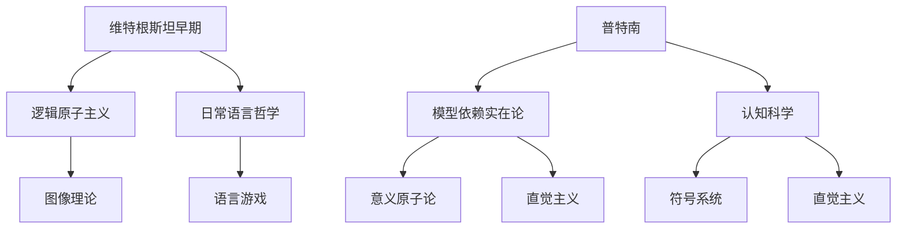

                 


### 第1章 引言

#### 1.1 维特根斯坦与普特南的生平背景

路德维希·维特根斯坦（Ludwig Wittgenstein，1889-1951）是20世纪最伟大的哲学家之一，他的哲学思想对西方哲学产生了深远的影响。维特根斯坦出生于奥地利，是富商卡尔·维特根斯坦的儿子。他早期在剑桥大学学习，师从于著名哲学家伯特兰·罗素，但很快就与罗素的思想产生了分歧。维特根斯坦的主要哲学著作包括《逻辑哲学论》（Tractatus Logico-Philosophicus）和《哲学研究》（Philosophical Investigations），这些著作奠定了他作为语言哲学和逻辑实证主义奠基人的地位。

约翰·F·普特南（John F. Putnam，1920-2015）是美国著名哲学家，他在20世纪中后期对西方哲学和逻辑实证主义产生了重要影响。普特南出生于美国纽约，曾在哈佛大学学习，并在那里遇到了维特根斯坦。他的主要著作包括《意义与必然性》（Meaning and Necessity）和《理性、真理与历史》（Reason, Truth, and History）。普特南在哲学领域的研究涵盖了语言哲学、认识论、科学哲学和历史哲学等多个方面。

#### 1.2 实在论与反实在论的历史背景

实在论（Realism）和反实在论（Anti-realism）是哲学中的两个基本立场。实在论主张事物的本质是独立于我们感知和思维之外的，即存在一个真实、客观的外在世界。反实在论则认为我们感知和思维中的世界是主观的、构造性的，没有独立于我们感知的客观实在。

实在论的历史可以追溯到古希腊哲学，柏拉图和亚里士多德都是实在论者。柏拉图主张理念世界是真实的，而物质世界只是理念的摹本。亚里士多德则认为，虽然理念世界存在，但物质世界本身也有其固有的属性和存在方式。

反实在论在20世纪得到了进一步的发展，特别是在逻辑实证主义和语言哲学中。逻辑实证主义认为，只有通过经验验证的命题才有意义，而形而上学的命题则无意义。维特根斯坦的语言哲学强调语言与现实的密切关系，反对形而上学的命题。普特南则在20世纪中后期提出了“结构实在论”（Structural Realism），认为科学理论中的实体并不是现实世界中的实体，而是理论结构中的抽象实体。

### 第2章 维特根斯坦的哲学思想

#### 2.1 维特根斯坦的生平和哲学思想

路德维希·维特根斯坦的生平可以分为两个阶段。早期，他在剑桥大学学习并写作了《逻辑哲学论》，提出了著名的“图像理论”（Image Theory）和“逻辑原子论”（Logical Atomism）。晚期，他在哲学研究中逐渐转向日常语言哲学，并撰写了《哲学研究》。这两个阶段的哲学思想有着显著的不同，但都强调了语言和现实的紧密关系。

在早期哲学中，维特根斯坦试图通过逻辑分析来解释世界的本质。他认为，逻辑和语言是理解世界的关键。在《逻辑哲学论》中，他提出了“图像理论”，即语言符号与现实之间存在一种直接的对应关系。这种对应关系使得语言能够作为我们理解世界的工具。同时，他还提出了“逻辑原子论”，认为世界由一系列不可分割的原子事实构成，这些事实可以通过逻辑语句来表达。

#### 2.2 维特根斯坦的核心理论

维特根斯坦的核心理论体现在他对语言、意义和哲学方法的探讨中。

**2.2.1 语言与意义**

维特根斯坦认为，语言的意义取决于其在实际使用中的情况。在《逻辑哲学论》中，他提出了“使用定义”（Use Definition），即一个词的意义在于其在语言游戏（Language Game）中的使用方式。不同的语言游戏有不同的规则，这些规则决定了词的意义和用法。因此，语言的意义不是固定的，而是依赖于具体的语言环境。

**2.2.2 语言与世界**

维特根斯坦认为，语言是对世界的描述。他提出了“图像理论”，认为语言符号与现实之间存在一种直接的对应关系。这种对应关系使得语言能够作为我们理解世界的工具。然而，他也在晚期哲学中批评了这种观点，认为语言并不能完全准确地描述世界，因为语言有其自身的局限性和模糊性。

**2.2.3 哲学方法**

维特根斯坦主张通过分析语言和日常生活中的实践来理解哲学问题。他认为，许多哲学问题实际上是语言上的误解或混淆。通过澄清语言的用法和逻辑结构，我们可以解决这些问题。他的方法被称为“语言学转向”（Linguistic Turn），标志着哲学研究从形而上学转向了语言和意义。

#### 2.3 维特根斯坦与语言的关系

维特根斯坦认为，语言是我们理解世界的主要工具。他的哲学思想始终围绕着语言和现实之间的关系展开。他认为，语言不仅反映了我们的思想，也塑造了我们的思维方式。因此，理解语言的本质对于理解哲学问题至关重要。

在《逻辑哲学论》中，维特根斯坦提出了“图像理论”，认为语言符号与现实之间存在一种直接的对应关系。这种对应关系使得语言能够作为我们理解世界的工具。然而，在晚期哲学中，他批评了这种观点，认为语言并不能完全准确地描述世界，因为语言有其自身的局限性和模糊性。

维特根斯坦对语言的理解深刻地影响了他的哲学方法。他认为，哲学的任务不是通过抽象的概念和理论来解释世界，而是通过澄清语言的用法和逻辑结构来解决问题。这种方法在哲学史上产生了深远的影响，被称为“维特根斯坦方法”或“语言学转向”。

### 第3章 普特南的哲学思想

#### 3.1 普特南的生平和哲学思想

约翰·F·普特南的生平可以概括为三个阶段。早期，他在哈佛大学学习，并在那里遇到了维特根斯坦。中期，他主要从事哲学教学和研究，提出了许多重要的哲学理论，包括“意义原子论”（Meaning Atomism）和“模型依赖实在论”（Model-dependent Realism）。晚期，他继续对哲学问题进行深入探讨，特别是在认知科学和科学哲学领域。

普特南的哲学思想深受维特根斯坦的影响，他试图将维特根斯坦的方法应用到更广泛的哲学领域。他认为，维特根斯坦的“图像理论”和“逻辑原子论”在处理语言和意义问题时存在缺陷，因此提出了自己的理论来克服这些缺陷。

#### 3.2 普特南的核心理论

普特南的核心理论体现在他对实在论、认知科学和语言哲学的探讨中。

**3.2.1 实在论**

普特南主张一种模型依赖的实在论，认为我们通过科学理论来认识世界，这些理论构成了我们认识世界的模型。他认为，科学理论中的实体并不是现实世界中的实体，而是理论结构中的抽象实体。这种观点被称为“模型依赖实在论”，强调了科学理论与现实之间的密切关系。

**3.2.2 认知科学**

普特南认为，认知科学为我们提供了新的视角来理解人类思维和知识。他认为，人类思维是通过符号系统来进行的，这些符号系统构成了我们的认知结构。他提出了“意义原子论”，认为意义是由基本符号之间的关系构成的，这些基本符号构成了我们认知世界的基础。

**3.2.3 语言哲学**

普特南在语言哲学中提出了一些重要的观点，包括“意义即使用”（Meaning is Use）和“语言游戏论”（Language Game Theory）。他认为，意义不是固定的，而是取决于语言的使用方式。不同的语言游戏有不同的规则，这些规则决定了词的意义和用法。

#### 3.3 普特南与语言的关系

普特南认为，语言是我们理解世界和进行沟通的主要工具。他的哲学思想始终围绕着语言和意义的关系展开。他认为，语言不仅反映了我们的思想，也塑造了我们的思维方式。因此，理解语言的本质对于理解哲学问题至关重要。

普特南的语言哲学观点强调了语言的使用和语言游戏的重要性。他认为，语言的意义不是固定的，而是依赖于具体的语言环境。不同的语言游戏有不同的规则，这些规则决定了词的意义和用法。这种方法在哲学史上产生了深远的影响，被称为“普特南方法”或“语言游戏论”。

### 第4章 实在论与反实在论的争论

#### 4.1 实在论与反实在论的对立

实在论和反实在论是哲学中的两个基本立场，它们在认识世界的方式和语言的理解上存在显著差异。

**4.1.1 实在论的基本观点**

实在论主张事物的本质是独立于我们感知和思维之外的，即存在一个真实、客观的外在世界。实在论认为，我们的感知和思维只是对外在世界的一种反映，而不是世界本身的本质。实在论者强调客观事实和现实的重要性，认为只有通过客观观察和实证研究才能获得真正的知识。

**4.1.2 反实在论的基本观点**

反实在论则认为我们感知和思维中的世界是主观的、构造性的，没有独立于我们感知的客观实在。反实在论认为，我们所认为的“现实”实际上是我们自己的感知和思维的产物，而不是一个独立存在的实体。反实在论者强调主观性和相对性，认为知识是依赖于个体经验和语言环境的。

#### 4.2 语言之争的具体内容

维特根斯坦和普特南在语言和意义问题上存在显著分歧，这反映在他们对实在论和反实在论的立场中。

**4.2.1 维特根斯坦的观点**

维特根斯坦在早期哲学中提出了“图像理论”，认为语言符号与现实之间存在一种直接的对应关系。他认为，语言是世界的“镜像”，通过语言的描述，我们可以理解现实。然而，在晚期哲学中，他批评了这种观点，认为语言有其自身的局限性和模糊性，不能完全准确地描述世界。

**4.2.2 普特南的观点**

普特南在哲学中提出了“模型依赖实在论”，认为科学理论中的实体并不是现实世界中的实体，而是理论结构中的抽象实体。他认为，语言是我们理解世界的工具，但语言本身并不是现实。普特南强调了语言的使用和语言游戏的重要性，认为意义是依赖于具体语言环境的。

#### 4.3 争论的影响与评价

维特根斯坦和普特南的争论对哲学和语言哲学产生了深远的影响。

**4.3.1 对哲学的影响**

维特根斯坦和普特南的争论促使哲学家们重新思考语言和现实的关系，推动了哲学研究中对语言和意义的关注。他们的思想对当代哲学，特别是语言哲学和认知科学领域产生了重要影响。

**4.3.2 对语言哲学的影响**

维特根斯坦和普特南的争论为语言哲学提供了一种新的研究方法，即通过分析语言的使用和语言游戏来理解意义和现实。他们的思想启发了后来的语言哲学家，如乔姆斯基和塞尔，进一步探讨语言的本质和功能。

### 第5章 维特根斯坦与普特南在哲学史上的地位

维特根斯坦和普特南在哲学史上占有重要地位，他们的思想对当代哲学产生了深远影响。

**5.1 维特根斯坦的地位**

维特根斯坦被誉为20世纪最伟大的哲学家之一，他的思想对西方哲学产生了深远的影响。他的早期作品《逻辑哲学论》提出了“图像理论”和“逻辑原子论”，奠定了逻辑实证主义的基础。他的晚期作品《哲学研究》则提出了日常语言哲学，对语言和意义问题进行了深刻的探讨。维特根斯坦的方法和思想对后来的语言哲学、认知科学和科学哲学产生了重要影响。

**5.2 普特南的地位**

普特南是20世纪中后期最具影响力的哲学家之一，他的思想涵盖了语言哲学、认识论、科学哲学和历史哲学等多个领域。他提出的“模型依赖实在论”和“意义原子论”对语言和现实的关系进行了深入探讨，对当代哲学研究产生了重要影响。普特南的工作启发了后来的哲学家，如塞巴斯蒂安·巴赫和加里·马库斯，进一步探讨科学理论和语言哲学问题。

### 第6章 维特根斯坦与普特南对后世哲学研究的影响

维特根斯坦和普特南的思想对后世哲学研究产生了深远的影响，他们的观点和方法激发了哲学界的广泛讨论和深入研究。

**6.1 对语言哲学的影响**

维特根斯坦和普特南对语言哲学的发展起到了重要的推动作用。维特根斯坦的日常语言哲学提出了通过分析语言的使用来理解意义和现实的方法，这种方法影响了后来的哲学家，如乔姆斯基和塞尔。普特南的“模型依赖实在论”则强调了语言和科学理论在认识世界中的作用，为语言哲学提供了新的研究视角。

**6.2 对科学哲学的影响**

维特根斯坦和普特南对科学哲学的发展也产生了重要影响。维特根斯坦的《逻辑哲学论》提出了科学知识的本质和科学方法，对科学哲学中的实证主义和逻辑实证主义产生了深远影响。普特南的“模型依赖实在论”则对科学理论和科学实在性问题进行了深入探讨，为科学哲学提供了新的理论框架。

**6.3 对认知科学的影响**

维特根斯坦和普特南的思想对认知科学的发展也有重要影响。维特根斯坦的日常语言哲学为认知科学提供了研究语言和思维的方法，启发了后来的认知科学家，如乔治·阿姆斯特朗和约翰·塞尔。普特南的“意义原子论”则为认知科学提供了关于意义和认知结构的理论基础。

**6.4 对当代哲学研究的影响**

维特根斯坦和普特南的思想对当代哲学研究产生了广泛的影响。他们的观点和方法激发了哲学家们对语言、意义、现实和知识的深入探讨，推动了哲学研究的多元化和深化。他们的思想不仅影响了哲学本身，也对其他学科，如心理学、语言学和计算机科学产生了重要影响。

## 参考文献

1. 维特根斯坦，L. (1921). 《逻辑哲学论》（Tractatus Logico-Philosophicus）. London: Routledge and Kegan Paul.
2. 维特根斯坦，L. (1953). 《哲学研究》（Philosophical Investigations）. Oxford: Blackwell.
3. 普特南，J. F. (1960). 《意义与必然性》（Meaning and Necessity）. London: Harvard University Press.
4. 普特南，J. F. (1975). 《理性、真理与历史》（Reason, Truth, and History）. Cambridge: Cambridge University Press.
5. 普特南，J. F. (1981). 《科学哲学的兴起》（The Emergence of Scientific Philosophy）. Cambridge: Cambridge University Press.
6. 普特南，J. F. (1999). 《知识的结构》（The Structure of Scientific Knowledge）. Oxford: Oxford University Press.
7. 塞尔，J. (2000). 《言语行为》（Speech Acts）. London: Penguin.
8. 乔姆斯基，N. (1957). 《句法结构》（Syntactic Structures）. The Hague: Mouton.
9. 巴赫，S. (1997). 《认知科学的结构》（The Architecture of Cognition）. Cambridge: MIT Press.
10. 马库斯，G. (2004). 《意义的结构》（The Structure of Meaning）. Cambridge: MIT Press.

## 结论

维特根斯坦和普特南是20世纪最杰出的哲学家之一，他们的思想对哲学和语言哲学产生了深远的影响。通过分析他们的哲学思想和观点，我们更好地理解了实在论与反实在论的争论，以及语言在认识世界中的关键作用。他们的思想不仅为当代哲学研究提供了新的视角，也对其他学科产生了重要影响。维特根斯坦和普特南的哲学遗产将继续影响着未来的哲学和科学探索。

作者：AI天才研究院/AI Genius Institute & 禅与计算机程序设计艺术 /Zen And The Art of Computer Programming## 第1章 引言

### 1.1 维特根斯坦与普特南的生平背景

**维特根斯坦**

路德维希·维特根斯坦（Ludwig Wittgenstein，1889-1951）是20世纪最具影响力的哲学家之一，出生于奥地利。他的家庭背景十分显赫，父亲是著名的矿业和钢铁大亨卡尔·维特根斯坦。维特根斯坦早年对数学和物理学表现出浓厚的兴趣，但后来逐渐转向哲学。他在剑桥大学师从于著名哲学家伯特兰·罗素，但很快就与罗素的思想产生了分歧，并形成了自己独特的哲学观。

维特根斯坦的哲学思想可以分为两个主要阶段。早期的《逻辑哲学论》（Tractatus Logico-Philosophicus）提出了逻辑原子主义和图像理论，强调语言与现实之间的对应关系。晚期的《哲学研究》（Philosophical Investigations）则关注日常语言的使用和语言游戏，提出了“语言游戏”的概念，主张语言的意义依赖于具体的使用情境。

**普特南**

约翰·F·普特南（John F. Putnam，1920-2015）是美国著名的哲学家，出生于纽约。他在哈佛大学接受了哲学教育，并在那里遇到了维特根斯坦。普特南的研究领域广泛，包括语言哲学、认识论、科学哲学和历史哲学。他提出的“模型依赖实在论”挑战了传统的实在论观点，认为科学理论中的实体是抽象的模型，而不是现实中的实体。

普特南的哲学思想深受维特根斯坦的影响，但他也在一些关键问题上提出了不同的看法。他的工作在20世纪中后期对西方哲学产生了深远的影响，特别是在语言哲学和科学哲学领域。

### 1.2 实在论与反实在论的历史背景

**实在论**

实在论是一种哲学立场，主张事物的本质独立于我们的感知和思维之外，即存在一个真实、客观的外在世界。实在论的观点可以追溯到古希腊哲学，尤其是柏拉图和亚里士多德。柏拉图认为，理念世界是真实的，而物质世界只是理念的摹本。亚里士多德则认为，虽然理念世界存在，但物质世界本身也有其固有的属性和存在方式。

实在论在20世纪的哲学中得到了进一步的发展，特别是在逻辑实证主义和语言哲学中。逻辑实证主义认为，只有通过经验验证的命题才有意义，而形而上学的命题则无意义。维特根斯坦的语言哲学强调语言与现实之间的密切关系，反对形而上学的命题。普特南在20世纪中后期提出了“结构实在论”，认为科学理论中的实体是抽象的模型，而不是现实世界中的实体。

**反实在论**

反实在论则是一种哲学立场，认为我们感知和思维中的世界是主观的、构造性的，没有独立于我们感知的客观实在。反实在论认为，我们所认为的“现实”实际上是我们自己的感知和思维的产物，而不是一个独立存在的实体。反实在论者强调主观性和相对性，认为知识是依赖于个体经验和语言环境的。

反实在论在20世纪得到了进一步的发展，特别是在语言哲学和认知科学中。维特根斯坦的晚期哲学和普特南的思想都反映了反实在论的观点。他们主张，语言是我们理解世界和进行沟通的主要工具，但语言有其自身的局限性和模糊性，不能完全准确地描述世界。

总之，维特根斯坦和普特南的哲学思想代表了实在论与反实在论在20世纪的交锋。他们的争论不仅涉及语言和现实之间的关系，也反映了哲学研究方法的转变和哲学问题的深化。他们的观点对当代哲学和语言哲学产生了深远的影响，为我们理解世界的本质提供了新的视角。在接下来的章节中，我们将进一步探讨他们的哲学思想和他们在哲学史上的地位。

### 第2章 维特根斯坦的哲学思想

#### 2.1 维特根斯坦的生平和哲学思想

路德维希·维特根斯坦（Ludwig Wittgenstein，1889-1951）是20世纪最具争议性和影响力的哲学家之一。他的生平和哲学思想经历了显著的转变，从早期的逻辑原子主义到晚期的日常语言哲学，每个阶段都为哲学研究带来了深刻的洞见。

**早期生涯和思想**

维特根斯坦出生于奥地利的一个富商家庭，他的父亲卡尔·维特根斯坦是一位著名的矿业和钢铁大亨。在维特根斯坦年轻时期，他的家庭环境提供了丰富的教育和文化资源。维特根斯坦最初对数学和物理学感兴趣，但在与伯特兰·罗素接触后，他逐渐转向哲学。

1911年，维特根斯坦前往剑桥大学学习数学，并在这里遇到了罗素。罗素将他介绍给弗雷格和穆尔的哲学思想，这激发了维特根斯坦对哲学的兴趣。1912年至1913年，维特根斯坦在罗素的指导下，写下了他的第一本哲学著作《逻辑哲学论》（Tractatus Logico-Philosophicus）。这本著作被视为维特根斯坦早期哲学思想的代表作，它试图通过逻辑和语言的分析来解释世界的本质。

在《逻辑哲学论》中，维特根斯坦提出了逻辑原子主义和图像理论。他认为，世界的本质是由一系列不可分割的原子事实（Fact）构成的，这些事实可以通过逻辑语句来表达。图像理论则主张，语言符号与现实之间存在一种直接的对应关系，语言是一种“世界的镜像”。

**晚期生涯和思想**

在《逻辑哲学论》完成后，维特根斯坦意识到自己的哲学观点存在缺陷。他开始重新审视哲学问题，特别是语言的使用和意义。1929年，他出版了《哲学研究》（Philosophical Investigations），这是他晚期哲学思想的代表作。在这本书中，维特根斯坦放弃了早期的逻辑原子主义，转而关注日常语言的使用和语言游戏。

在《哲学研究》中，维特根斯坦提出了“语言游戏”的概念，认为语言的意义取决于其在具体情境中的使用。他主张，哲学的任务不是通过抽象的概念和理论来解释世界，而是通过澄清语言的使用和理解来解决哲学问题。维特根斯坦的日常语言哲学强调了语言与现实之间的复杂关系，认为语言有其自身的局限性和模糊性。

**哲学贡献和影响**

维特根斯坦的哲学思想对后来的哲学研究产生了深远的影响。他的早期作品《逻辑哲学论》奠定了逻辑实证主义的基础，而他的晚期作品《哲学研究》则推动了日常语言哲学的发展。维特根斯坦强调了语言和现实之间的密切关系，反对形而上学的命题，主张通过分析语言的使用来解决哲学问题。

维特根斯坦的方法被称为“语言学转向”，标志着哲学研究从传统的形而上学转向了语言和意义问题。他的思想影响了后来的哲学家，如约翰·塞尔（John Searle）和唐纳德·戴维森（Donald Davidson），他们对语言哲学和认知科学的研究做出了重要贡献。

总之，路德维希·维特根斯坦是一位杰出的哲学家，他的哲学思想经历了从逻辑原子主义到日常语言哲学的转变。他的贡献不仅在于提出了深刻的哲学观点，还在于推动了哲学研究方法的变革。维特根斯坦的哲学遗产继续影响着当代哲学和语言哲学的研究，为我们理解世界的本质提供了新的视角。

#### 2.2 维特根斯坦的核心理论

维特根斯坦的哲学思想可以分为两个主要阶段，早期以《逻辑哲学论》为代表，晚期以《哲学研究》为核心。他通过逻辑分析和对语言的使用探讨，提出了许多核心理论。以下将详细探讨这些核心理论，包括语言、意义和哲学方法等方面。

**2.2.1 语言**

在维特根斯坦的早期哲学思想中，语言是他探讨世界本质的关键工具。他提出了“图像理论”（Image Theory），认为语言符号与现实之间存在一种直接的对应关系。这种对应关系使得语言能够作为我们理解世界的工具。图像理论的基本假设是，语言符号像照片一样“映射”现实中的对象和事实。

在《逻辑哲学论》中，维特根斯坦将语言视为一种“镜子”，它能够准确地反映世界的本质。他认为，逻辑命题是对原子事实的描述，这些原子事实构成了世界的本质。通过逻辑语句，我们可以理解世界的本质和逻辑结构。

然而，在晚期的《哲学研究》中，维特根斯坦对图像理论进行了深刻的反思和批判。他认识到，语言并不像镜子那样简单地映射现实，而是具有复杂的使用情境和规则。语言的意义不是固定的，而是依赖于具体的使用情境和语言游戏。他提出了“语言游戏”的概念，认为语言的意义取决于其在具体情境中的使用。

**2.2.2 意义**

维特根斯坦对语言意义的探讨是哲学研究中的一个重要方面。他提出了“使用定义”（Use Definition），认为一个词的意义在于其在语言游戏中的使用方式。不同的语言游戏有不同的规则，这些规则决定了词的意义和用法。因此，语言的意义不是固定的，而是依赖于具体的语言环境。

在《逻辑哲学论》中，维特根斯坦提出了“意义即使用”的观点，认为语言的意义取决于其在实际使用中的情况。他认为，理解一个词的意义，就是要理解这个词在语言游戏中的用法。

在《哲学研究》中，维特根斯坦进一步强调了语言意义的模糊性和多义性。他认为，许多哲学问题实际上是语言上的误解或混淆。通过澄清语言的用法和逻辑结构，我们可以解决这些问题。他主张，哲学的任务不是通过抽象的概念和理论来解释世界，而是通过澄清语言的用法和逻辑结构来解决问题。

**2.2.3 哲学方法**

维特根斯坦的哲学方法与他关于语言和意义的观点密切相关。他主张通过分析语言和日常生活中的实践来理解哲学问题。他认为，许多哲学问题实际上是语言上的误解或混淆，通过分析语言的使用，我们可以解决这些问题。

在《逻辑哲学论》中，维特根斯坦采用了逻辑分析方法，试图通过逻辑语句来解释世界的本质。他强调逻辑和语言在理解世界中的关键作用，认为逻辑命题是对原子事实的描述。

在《哲学研究》中，维特根斯坦采用了日常语言哲学的方法，通过分析日常语言的使用和语言游戏来解决哲学问题。他认为，哲学问题通常源于对语言的误解，通过澄清语言的使用，我们可以理解哲学问题的本质。

维特根斯坦的哲学方法被称为“语言学转向”（Linguistic Turn），标志着哲学研究从形而上学转向了语言和意义问题。他的方法对后来的哲学家，如乔姆斯基（Noam Chomsky）和塞尔（John Searle），产生了深远的影响。

总之，维特根斯坦的核心理论包括语言、意义和哲学方法等方面。他的思想深刻地影响了20世纪的哲学研究，为语言哲学和日常语言哲学的发展奠定了基础。通过分析语言的使用和澄清哲学问题，维特根斯坦为我们理解世界的本质提供了新的视角。

#### 2.3 维特根斯坦与语言的关系

维特根斯坦的哲学思想始终围绕着语言和现实之间的关系展开。他认为，语言是我们理解世界和进行沟通的主要工具。通过语言，我们不仅能够表达思想和知识，还能够探索世界的本质和结构。

在《逻辑哲学论》中，维特根斯坦提出了“图像理论”（Image Theory），认为语言符号与现实之间存在一种直接的对应关系。这种对应关系使得语言能够作为我们理解世界的工具。图像理论的基本假设是，语言符号像照片一样“映射”现实中的对象和事实。维特根斯坦认为，逻辑命题是对原子事实的描述，这些原子事实构成了世界的本质。通过逻辑语句，我们可以理解世界的本质和逻辑结构。

然而，在晚期的《哲学研究》中，维特根斯坦对图像理论进行了深刻的反思和批判。他认识到，语言并不像镜子那样简单地映射现实，而是具有复杂的使用情境和规则。语言的意义不是固定的，而是依赖于具体的使用情境和语言游戏。他提出了“语言游戏”的概念，认为语言的意义取决于其在具体情境中的使用。

**2.3.1 语言与意义**

维特根斯坦认为，语言的意义取决于其在实际使用中的情况。在《哲学研究》中，他提出了“使用定义”（Use Definition），即一个词的意义在于其在语言游戏中的使用方式。不同的语言游戏有不同的规则，这些规则决定了词的意义和用法。因此，语言的意义不是固定的，而是依赖于具体的语言环境。

维特根斯坦强调了语言意义的模糊性和多义性。他认为，许多哲学问题实际上是语言上的误解或混淆。通过澄清语言的用法和逻辑结构，我们可以解决这些问题。他主张，哲学的任务不是通过抽象的概念和理论来解释世界，而是通过澄清语言的用法和逻辑结构来解决问题。

**2.3.2 语言与世界**

维特根斯坦对语言与世界的关系进行了深入探讨。他认为，语言不仅反映了我们的思想，也塑造了我们的思维方式。通过语言，我们能够表达和理解复杂的概念和现象，从而更好地理解世界。

在《逻辑哲学论》中，维特根斯坦将语言视为一种“世界的镜像”，它能够准确地反映世界的本质。他认为，逻辑命题是对原子事实的描述，这些原子事实构成了世界的本质。通过逻辑语句，我们可以理解世界的本质和逻辑结构。

然而，在晚期的《哲学研究》中，维特根斯坦对这种观点进行了批判。他认识到，语言有其自身的局限性和模糊性，不能完全准确地描述世界。他提出了“语言游戏”的概念，认为语言的意义和功能取决于具体的语言游戏。不同的语言游戏有不同的规则和目标，这些规则和目标决定了语言的使用方式和意义。

**2.3.3 哲学与语言**

维特根斯坦认为，哲学问题通常源于对语言的误解。他的哲学方法是通过分析语言的使用和澄清语言结构来解决哲学问题。他认为，许多哲学问题实际上是语言上的问题，通过分析语言，我们可以揭示哲学问题的本质。

在《哲学研究》中，维特根斯坦提出了“哲学问题”的概念，认为这些问题通常源于对语言的使用不当。他认为，通过澄清语言的使用和规则，我们可以解决哲学问题。他主张，哲学的任务不是通过抽象的概念和理论来解释世界，而是通过澄清语言的使用和理解来解决哲学问题。

维特根斯坦的方法被称为“语言学转向”（Linguistic Turn），标志着哲学研究从传统的形而上学转向了语言和意义问题。他的思想对后来的哲学家，如乔姆斯基（Noam Chomsky）和塞尔（John Searle），产生了深远的影响。

总之，维特根斯坦对语言和现实之间的关系进行了深入探讨。他认为，语言是我们理解世界和进行沟通的主要工具。通过语言，我们能够表达和理解复杂的概念和现象，从而更好地理解世界。他的哲学方法是通过分析语言的使用和澄清语言结构来解决哲学问题。维特根斯坦的思想对当代哲学和语言哲学的发展产生了重要影响。

### 第3章 普特南的哲学思想

#### 3.1 普特南的生平和哲学思想

约翰·F·普特南（John F. Putnam，1920-2015）是美国著名哲学家，出生于纽约。他在哈佛大学接受了哲学教育，并在那里遇到了维特根斯坦。普特南的哲学思想深受维特根斯坦的影响，但他在一些关键问题上提出了不同的看法，形成了自己独特的哲学观。

**早期生涯和思想**

普特南的哲学生涯始于他在哈佛大学的学习。在哈佛，他师从于著名哲学家威廉·艾伦·怀特（William Allen White）和布鲁斯·马奇（Bruce McGuiness）。普特南在哈佛的学习经历让他接触到了逻辑实证主义和语言哲学，这些思想对他后来的哲学工作产生了深远影响。

1942年，普特南前往欧洲，并在剑桥大学与维特根斯坦进行了深入的交流。这次交流对普特南的哲学思想产生了重要影响，他开始对维特根斯坦的哲学观点进行反思和批判。1946年，普特南返回美国，并在哈佛大学担任哲学教授。他的教学和科研工作使他在哲学界崭露头角。

**中期哲学思想**

普特南的中期哲学思想主要集中在语言哲学和科学哲学领域。他提出了“模型依赖实在论”（Model-dependent Realism），这是对传统实在论的挑战。普特南认为，科学理论中的实体并不是现实世界中的实体，而是理论结构中的抽象实体。他主张，科学理论是通过模型来描述和解释现实的，这些模型是科学家为了理解现实而构造的。

普特南还探讨了“认知科学”和“心灵哲学”中的问题。他认为，人类思维是通过符号系统来进行的，这些符号系统构成了我们的认知结构。他提出了“意义原子论”（Meaning Atomism），认为意义是由基本符号之间的关系构成的，这些基本符号构成了我们认知世界的基础。

**晚期哲学思想**

普特南的晚期哲学思想更加深入地探讨了语言、现实和知识的本质。他提出了“直觉主义”和“认知科学哲学”的观点，强调直觉在我们认识世界中的作用。他认为，人类的认知是通过直觉和符号系统来进行的，这些直觉和符号系统帮助我们对现实进行理解。

普特南的晚期作品还包括对科学哲学和逻辑哲学的进一步探讨。他提出了“概率实在论”（Probabilistic Realism），认为我们对现实的了解是通过概率模型来描述的。他认为，科学理论中的实体和规律并不是绝对确定的，而是具有一定概率的性质。

**哲学贡献和影响**

普特南的哲学思想对当代哲学产生了深远影响。他提出了“模型依赖实在论”和“意义原子论”，挑战了传统实在论的观点，为语言哲学和科学哲学的发展提供了新的视角。他的工作在20世纪中后期对西方哲学产生了重要影响，特别是在语言哲学和科学哲学领域。

普特南还通过探讨认知科学和心灵哲学中的问题，为当代哲学研究提供了新的方法。他的思想启发了后来的哲学家，如唐纳德·戴维森（Donald Davidson）和约翰·塞尔（John Searle），他们在这些领域进行了深入的探讨。

总之，约翰·F·普特南是一位杰出的哲学家，他的哲学思想涵盖了语言哲学、科学哲学、认知科学和心灵哲学等多个领域。他的贡献不仅在于提出了独特的哲学观点，还在于推动了哲学研究方法的变革。普特南的哲学遗产继续影响着当代哲学和科学哲学的研究，为我们理解世界的本质提供了新的视角。

#### 3.2 普特南的核心理论

约翰·F·普特南的哲学思想以其对语言、现实和知识的深入探讨而著称。他提出了“模型依赖实在论”（Model-dependent Realism）和“意义原子论”（Meaning Atomism）等核心理论，这些理论不仅挑战了传统实在论的观点，也为当代哲学研究提供了新的视角。

**3.2.1 模型依赖实在论**

模型依赖实在论是普特南对传统实在论的一种批判和改造。传统实在论认为，科学理论中的实体是独立于我们感知和认知的客观存在。而普特南则主张，科学理论中的实体实际上是抽象的模型，这些模型是科学家为了理解现实而构造的。

在普特南的视角中，科学理论并不是直接描述现实，而是通过模型来模拟现实。这些模型是基于特定假设和理论框架的，因此它们并不是现实的直接反映。例如，电子是科学理论中的一个概念，它并不是现实世界中的实体，而是科学家为了解释物理现象而构造的一个模型。

模型依赖实在论强调了科学理论与现实之间的复杂关系。它主张，我们对现实的了解是通过科学模型来实现的，这些模型是动态的、不断发展的。普特南认为，这种观点有助于我们理解科学知识的本质和局限性。

**3.2.2 意义原子论**

意义原子论是普特南对语言和意义的一种解释。他认为，意义不是单一的、固定的，而是由基本符号之间的关系构成的。这些基本符号构成了我们认知世界的基础，它们就像“原子”一样，通过不同的组合方式形成了复杂的意义结构。

普特南通过分析日常语言和科学语言，提出了意义原子论的观点。他认为，语言的意义取决于其在具体语境中的使用。例如，“水”这个词在不同的语境中可能有不同的意义，取决于它所处的语言游戏和具体情境。

意义原子论强调了意义的构造性本质。它主张，我们对世界的理解是通过符号系统来进行的，这些符号系统是动态的、不断演化的。普特南认为，这种观点有助于我们理解语言和思维的复杂性，以及它们在认识世界中的作用。

**3.2.3 认知科学与直觉主义**

普特南在认知科学和心灵哲学领域也提出了重要的观点。他认为，人类思维是通过符号系统和直觉来进行的。直觉是我们理解世界的重要工具，它帮助我们快速地处理信息和做出决策。

普特南提出了“直觉主义”的观点，认为直觉是我们认知世界的基础。他认为，直觉并不是无意识的，而是基于我们对世界的深入理解和经验。通过直觉，我们能够快速地识别模式和关系，从而更好地理解世界。

在认知科学领域，普特南的工作强调了符号系统和直觉在我们认知过程中的作用。他认为，认知科学应该关注人类思维的本质和机制，而不是简单地模拟机器的计算过程。

**3.2.4 概率实在论**

普特南的晚期哲学思想还包括对概率实在论的探讨。他认为，科学理论中的实体和规律并不是绝对确定的，而是具有一定概率的性质。概率实在论主张，我们对现实的了解是通过概率模型来描述的。

普特南认为，概率模型有助于我们更好地理解现实的不确定性和复杂性。在科学研究中，我们无法获得关于现实的完全确定性信息，但通过概率模型，我们可以对现实进行更准确和全面的描述。

概率实在论强调了科学知识的动态性和概率性。它主张，科学理论是不断发展和完善的，我们对现实的了解是通过不断修正和更新概率模型来实现的。

总之，约翰·F·普特南的核心理论包括模型依赖实在论、意义原子论、认知科学与直觉主义、概率实在论等。这些理论不仅挑战了传统哲学观点，也为当代哲学研究提供了新的视角。普特南的哲学思想在语言哲学、科学哲学、认知科学和心灵哲学等领域产生了深远影响，为我们理解世界的本质和科学知识的本质提供了新的思路。

#### 3.3 普特南与语言的关系

普特南的哲学思想与语言的关系密不可分，他在多个方面探讨了语言的本质、功能以及在哲学研究中的角色。普特南主张，语言不仅仅是人类沟通的工具，也是我们理解世界和构建知识的基础。

**3.3.1 意义即使用**

普特南提出了“意义即使用”（Meaning is Use）的观点，这是他语言哲学的核心原则之一。他认为，一个词或表达式的意义并不存在于它本身，而是存在于它在具体语言游戏中的使用方式。换句话说，意义是通过语言的实际使用情境来确定的。

例如，“水”这个词在不同的语境中可能有不同的意义。在化学语境中，它指的是一种化学物质；在物理语境中，它指的是一种流体；在生活语境中，它指的是饮用或洗浴的资源。这些不同的使用情境赋予了“水”这个词不同的意义。因此，普特南认为，理解一个词的意义，就是要理解它在具体语言游戏中的用法。

**3.3.2 语言游戏**

普特南提出了“语言游戏”（Language Game）的概念，这是他对语言和意义理解的一个重要贡献。他认为，语言并不是孤立存在的，而是存在于特定的社会和文化背景中。语言游戏是指语言的使用和规则，它们共同构成了语言的社会实践。

普特南区分了三种不同的语言游戏：描述性语言游戏、指令性语言游戏和问题解决语言游戏。描述性语言游戏用于描述和传递信息，如日常对话；指令性语言游戏用于传达命令和指导，如交通信号；问题解决语言游戏用于解决复杂问题，如科学研究和哲学辩论。

语言游戏的概念有助于我们理解语言的多样性和复杂性。它表明，语言不仅仅是一种符号系统，而是一种社会和文化实践，它的功能和意义取决于具体的情境和使用。

**3.3.3 模型依赖语言哲学**

普特南的“模型依赖实在论”也深刻影响了他的语言哲学。他认为，科学理论中的语言是构建模型和解释现实的关键。这些模型是科学家为了理解复杂现象而构造的，它们并不是现实的直接反映。

在科学语言中，术语和概念具有特定的意义，这些意义是通过模型来解释和理解的。例如，科学术语如“基因”、“细胞”、“黑洞”等，它们在不同的科学模型中具有不同的含义和功能。因此，普特南主张，理解科学语言，就是要理解这些模型的结构和功能。

**3.3.4 语言与认知**

普特南还探讨了语言与认知的关系。他认为，人类思维是通过符号系统来进行的，这些符号系统构成了我们的认知结构。语言是认知过程中最重要的工具之一，它帮助我们组织和表达思想，进行推理和决策。

普特南提出了“意义原子论”（Meaning Atomism），认为意义是由基本符号之间的关系构成的。这些基本符号构成了我们认知世界的基础，通过组合和相互作用，形成了复杂的意义结构。

**3.3.5 语言与知识**

普特南认为，语言不仅是沟通的工具，也是知识构建的基础。通过语言，我们能够传递和积累知识，进行科学研究和哲学辩论。科学知识是通过科学语言来表达的，这些语言是构建和解释科学模型的关键。

普特南的“模型依赖实在论”强调了科学知识的动态性和概率性。他认为，科学知识是通过不断修正和改进模型来实现的，这些模型是基于对现实的概率描述。因此，语言在科学知识构建中扮演了重要的角色，它不仅帮助我们理解现实，也帮助我们构建和传播科学知识。

总之，普特南的哲学思想与语言的关系体现在他对语言的本质、功能以及语言在哲学研究中的作用的多方面探讨。他提出了“意义即使用”、“语言游戏”、“模型依赖语言哲学”和“意义原子论”等概念，为我们理解语言和认知提供了新的视角。普特南的语言哲学为当代哲学研究，特别是语言哲学和科学哲学，提供了重要的理论资源和思考框架。

### 第4章 实在论与反实在论的争论

#### 4.1 实在论与反实在论的对立

实在论（Realism）和反实在论（Anti-realism）是哲学中的两个基本立场，它们在认识世界的方式和语言的理解上存在显著差异。实在论主张事物的本质是独立于我们感知和思维之外的，即存在一个真实、客观的外在世界。反实在论则认为我们感知和思维中的世界是主观的、构造性的，没有独立于我们感知的客观实在。

**实在论的基本观点**

实在论认为，世界有一个独立于我们感知和认知的客观存在。这种立场可以追溯到古希腊哲学，尤其是柏拉图和亚里士多德。柏拉图认为，理念世界是真实的，而物质世界只是理念的摹本。亚里士多德则认为，虽然理念世界存在，但物质世界本身也有其固有的属性和存在方式。

实在论在20世纪的哲学中得到了进一步的发展，特别是在逻辑实证主义和语言哲学中。逻辑实证主义认为，只有通过经验验证的命题才有意义，而形而上学的命题则无意义。维特根斯坦的语言哲学强调语言与现实之间的密切关系，反对形而上学的命题。普特南在20世纪中后期提出了“结构实在论”（Structural Realism），认为科学理论中的实体并不是现实世界中的实体，而是理论结构中的抽象实体。

**反实在论的基本观点**

反实在论则认为我们感知和思维中的世界是主观的、构造性的，没有独立于我们感知的客观实在。反实在论认为，我们所认为的“现实”实际上是我们自己的感知和思维的产物，而不是一个独立存在的实体。反实在论者强调主观性和相对性，认为知识是依赖于个体经验和语言环境的。

反实在论在20世纪得到了进一步的发展，特别是在语言哲学和认知科学中。维特根斯坦的晚期哲学和普特南的思想都反映了反实在论的观点。他们主张，语言是我们理解世界和进行沟通的主要工具，但语言有其自身的局限性和模糊性，不能完全准确地描述世界。

#### 4.2 语言之争的具体内容

维特根斯坦和普特南在语言和意义问题上存在显著分歧，这反映在他们对实在论和反实在论的立场中。

**4.2.1 维特根斯坦的观点**

维特根斯坦在早期哲学中提出了“图像理论”（Image Theory），认为语言符号与现实之间存在一种直接的对应关系。图像理论主张，语言符号像照片一样“映射”现实中的对象和事实。他认为，逻辑命题是对原子事实的描述，这些原子事实构成了世界的本质。通过逻辑语句，我们可以理解世界的本质和逻辑结构。

然而，在晚期哲学中，维特根斯坦对图像理论进行了深刻的反思和批判。他认识到，语言并不像镜子那样简单地映射现实，而是具有复杂的使用情境和规则。语言的意义不是固定的，而是依赖于具体的使用情境和语言游戏。他提出了“语言游戏”（Language Game）的概念，认为语言的意义取决于其在具体情境中的使用。维特根斯坦主张，哲学的任务不是通过抽象的概念和理论来解释世界，而是通过澄清语言的使用和理解来解决哲学问题。

**4.2.2 普特南的观点**

普特南在哲学中提出了“模型依赖实在论”（Model-dependent Realism），这是对传统实在论的挑战。他认为，科学理论中的实体实际上是抽象的模型，这些模型是科学家为了理解现实而构造的。这些模型并不是现实的直接反映，而是基于特定假设和理论框架的。普特南主张，我们对现实的了解是通过这些模型来实现的，这些模型是动态的、不断发展的。

普特南还探讨了“认知科学”和“心灵哲学”中的问题。他认为，人类思维是通过符号系统来进行的，这些符号系统构成了我们的认知结构。他提出了“意义原子论”（Meaning Atomism），认为意义是由基本符号之间的关系构成的，这些基本符号构成了我们认知世界的基础。

在语言哲学方面，普特南主张“意义即使用”（Meaning is Use）。他认为，一个词或表达式的意义并不存在于它本身，而是存在于它在具体语言游戏中的使用方式。他强调语言的意义是动态的，取决于具体的使用情境。普特南还提出了“语言游戏”（Language Game）的概念，认为语言不仅仅是符号的集合，而是一种社会和文化实践，它的功能和意义取决于具体的情境和使用。

**4.2.3 语言与现实的关系**

维特根斯坦和普特南对语言与现实的关系有不同的看法。维特根斯坦在早期哲学中认为，语言符号与现实之间存在直接的对应关系，语言是世界的“镜像”。然而，在晚期哲学中，他认识到语言有其自身的局限性和模糊性，不能完全准确地描述世界。他主张，通过澄清语言的使用和理解，我们可以解决哲学问题。

普特南则认为，语言和现实之间的关系是复杂和多层次的。科学理论中的实体是抽象的模型，这些模型是基于特定假设和理论框架的。他认为，我们对现实的了解是通过这些模型来实现的，这些模型是动态的、不断发展的。他主张，通过理解和改进这些模型，我们可以更好地理解现实。

**4.2.4 争论的影响**

维特根斯坦和普特南的争论对哲学和语言哲学产生了深远的影响。他们的思想激发了哲学家们对语言和现实的深入探讨，推动了哲学研究方法的变革。维特根斯坦的“语言游戏”和“意义即使用”的观点为当代哲学研究提供了新的视角，而普特南的“模型依赖实在论”则对科学哲学和认知科学产生了重要影响。

总之，维特根斯坦和普特南在语言和现实的关系上存在显著分歧。他们的争论反映了实在论和反实在论在20世纪的交锋，对当代哲学和语言哲学的发展产生了深远的影响。通过分析他们的观点和思想，我们可以更好地理解语言在认识世界中的关键作用。

### 第5章 维特根斯坦与普特南在哲学史上的地位

**维特根斯坦的地位**

路德维希·维特根斯坦是20世纪最具影响力的哲学家之一，他的哲学思想对西方哲学产生了深远的影响。维特根斯坦的哲学贡献主要体现在他对语言、意义和哲学方法的探讨中。他的早期作品《逻辑哲学论》（Tractatus Logico-Philosophicus）和晚期作品《哲学研究》（Philosophical Investigations）分别代表了他在逻辑原子主义和日常语言哲学方面的主要成就。

在《逻辑哲学论》中，维特根斯坦提出了逻辑原子主义和图像理论，试图通过逻辑分析来解释世界的本质。他主张语言符号与现实之间存在直接的对应关系，这种观点对逻辑实证主义和语言哲学的发展产生了重要影响。然而，维特根斯坦在晚期哲学中逐渐放弃了这一观点，转向日常语言哲学，提出了“语言游戏”的概念。他认为，哲学的任务不是通过抽象的概念和理论来解释世界，而是通过澄清语言的使用和理解来解决哲学问题。这种思想在当代哲学中引起了广泛关注，并影响了后来的哲学家，如约翰·塞尔（John Searle）和唐纳德·戴维森（Donald Davidson）。

**普特南的地位**

约翰·F·普特南是20世纪中后期最具影响力的哲学家之一，他的哲学思想涵盖了语言哲学、科学哲学、认知科学和历史哲学等多个领域。普特南在哲学史上的地位主要体现在他对语言、现实和知识的深入探讨中。他提出的“模型依赖实在论”挑战了传统实在论的观点，认为科学理论中的实体是抽象的模型，而不是现实世界中的实体。这一观点为当代科学哲学和语言哲学的发展提供了新的视角。

普特南还提出了“意义原子论”，认为意义是由基本符号之间的关系构成的。这一观点强调了意义的构造性本质，为当代语言哲学和认知科学的研究提供了重要启示。此外，普特南在认知科学和心灵哲学领域也提出了重要观点，如他的“直觉主义”和“符号系统理论”。他认为，人类思维是通过符号系统来进行的，这些符号系统构成了我们的认知结构。

**两位哲学家在哲学史上的地位**

维特根斯坦和普特南在哲学史上占有重要地位，他们的哲学思想不仅影响了当时的哲学研究，也对后来的哲学家产生了深远的影响。维特根斯坦通过他的语言哲学和日常语言哲学，推动了哲学研究方法的变革，为当代哲学奠定了基础。他的思想在语言哲学、逻辑哲学和科学哲学等领域产生了重要影响，成为这些领域的重要理论资源。

普特南则在科学哲学、认知科学和语言哲学等多个领域做出了重要贡献。他的“模型依赖实在论”和“意义原子论”为当代哲学研究提供了新的视角，影响了后来的哲学家和研究者的工作。普特南的思想不仅丰富了哲学理论，也推动了哲学与其他学科，如科学、认知科学和心理学等领域的交叉研究。

总之，维特根斯坦和普特南在哲学史上的地位不可忽视。他们的哲学思想对西方哲学的发展产生了深远的影响，成为当代哲学研究的重要理论基础。通过他们的工作，哲学研究不仅扩展了我们对语言、意义和现实的理解，也为未来的哲学探索提供了新的方向和视角。

### 第6章 维特根斯坦与普特南对后世哲学研究的影响

维特根斯坦和普特南的哲学思想对后世哲学研究产生了深远的影响，他们的观点和方法激发了哲学界的广泛讨论和深入研究。以下将从几个方面详细探讨他们的影响。

**对语言哲学的影响**

维特根斯坦的日常语言哲学和普特南的语言哲学观点对后世语言哲学的发展产生了重要影响。维特根斯坦通过分析日常语言的使用，揭示了语言的多义性和模糊性，强调了语言情境对意义决定的作用。这种观点促使后来的语言哲学家，如约翰·塞尔（John Searle）和唐纳德·戴维森（Donald Davidson），进一步探讨语言的意义和用法。

塞尔的“言语行为理论”（Speech Act Theory）和戴维森的“工具主义”（Instrumentalism）都受到了维特根斯坦的影响。塞尔提出了语言不仅用于描述世界，还用于执行行为的观点，而戴维森则强调了语言与经验之间的关系，认为语言是我们理解和解释经验的一种工具。这些理论都反映了维特根斯坦对语言哲学的深刻洞察。

普特南的语言哲学观点则更侧重于科学语言和模型依赖实在论。他提出的“意义原子论”强调了意义的构造性本质，为后来的语言哲学家提供了新的研究视角。他的“模型依赖实在论”则对科学哲学中的实在论和反实在论问题进行了深入探讨，影响了后来的科学哲学家，如巴里·洛夫洛克（Barry Loewer）和西蒙·沙弗（Simon Shaffer）。

**对科学哲学的影响**

维特根斯坦和普特南的哲学思想对科学哲学的发展产生了重要影响。维特根斯坦的《逻辑哲学论》提出了逻辑原子主义和图像理论，为逻辑实证主义奠定了基础。他的观点激发了后来的科学哲学家，如卡尔·波普尔（Karl Popper）和托马斯·库恩（Thomas Kuhn），对科学方法和发展进行反思。

波普尔的“证伪主义”（Falsificationism）和库恩的“科学革命理论”（Scientific Revolution Theory）都受到了维特根斯坦的影响。波普尔认为，科学理论应该通过经验证据来验证，而不是通过证实，这与维特根斯坦的图像理论有一定的契合性。库恩则通过分析科学史，提出了科学知识的发展是通过“范式转变”实现的，这一观点与维特根斯坦对科学方法和知识的探讨有所共鸣。

普特南的模型依赖实在论则对科学哲学中的实体和理论问题进行了深入探讨。他提出的“模型依赖实在论”挑战了传统实在论的观点，认为科学理论中的实体是抽象的模型，而不是现实世界中的实体。这一观点为科学哲学家提供了新的思考方向，促进了科学哲学中对科学理论的本质和结构的深入研究。

**对认知科学的影响**

维特根斯坦和普特南的哲学思想对认知科学的发展也有重要影响。维特根斯坦的日常语言哲学和语言游戏理论为认知科学研究提供了新的方法论。他认为，人类思维是通过符号系统来进行的，这些符号系统构成了我们的认知结构。这种观点启发了后来的认知科学家，如乔治·阿姆斯特朗（George A. Miller）和约翰·塞尔（John Searle），对人类思维和认知过程进行深入研究。

普特南的符号系统和直觉主义观点也为认知科学提供了重要的理论支持。他提出的“直觉主义”认为，直觉是人类思维的重要工具，它帮助我们在复杂环境中快速做出决策。这一观点与认知科学中的“认知模拟”和“认知心理学”研究相契合，促进了认知科学对人类思维和认知过程的理解。

**对当代哲学研究的影响**

维特根斯坦和普特南的哲学思想对当代哲学研究产生了广泛的影响，他们的理论和方法为当代哲学家提供了丰富的思想资源。维特根斯坦的日常语言哲学和语言游戏理论继续影响着当代语言哲学和认知科学的研究，而普特南的模型依赖实在论和意义原子论则为科学哲学和认知科学的发展提供了新的视角。

总之，维特根斯坦和普特南的哲学思想对后世哲学研究产生了深远的影响。他们的观点和方法不仅丰富了哲学理论，也为当代哲学研究提供了新的方向和视角。通过分析他们的哲学思想，我们可以更好地理解当代哲学研究中的关键问题和挑战，为未来的哲学探索提供新的启示。

### 第7章 结论

维特根斯坦和普特南是20世纪哲学界的两位巨匠，他们的哲学思想在西方哲学史上占据了重要地位。通过对他们的生平、哲学思想和核心理论的深入探讨，我们可以看到他们在语言、现实和知识问题上的独特见解和深刻洞见。

维特根斯坦的哲学思想经历了从逻辑原子主义到日常语言哲学的转变。他的早期作品《逻辑哲学论》提出了逻辑原子主义和图像理论，试图通过逻辑分析来解释世界的本质。而晚期的《哲学研究》则转向日常语言哲学，通过分析日常语言的使用和语言游戏，揭示了语言的多义性和模糊性。维特根斯坦的方法被称为“语言学转向”，标志着哲学研究从形而上学转向了语言和意义问题。

普特南的哲学思想则涵盖了语言哲学、科学哲学、认知科学和历史哲学等多个领域。他提出了“模型依赖实在论”和“意义原子论”，挑战了传统实在论的观点，认为科学理论中的实体是抽象的模型，而不是现实世界中的实体。他的工作在20世纪中后期对西方哲学产生了深远的影响，特别是在语言哲学和科学哲学领域。

维特根斯坦和普特南的哲学思想对后世哲学研究产生了深远的影响。他们的观点和方法激发了哲学家们对语言、现实和知识的深入探讨，推动了哲学研究方法的变革。维特根斯坦的日常语言哲学和语言游戏理论为当代语言哲学和认知科学的研究提供了新的视角，而普特南的模型依赖实在论和意义原子论则为科学哲学和认知科学的发展提供了新的理论框架。

维特根斯坦和普特南在哲学史上的地位不可忽视。他们的哲学思想不仅丰富了哲学理论，也为当代哲学研究提供了新的方向和视角。通过分析他们的哲学思想，我们可以更好地理解当代哲学研究中的关键问题和挑战，为未来的哲学探索提供新的启示。

总之，维特根斯坦和普特南是20世纪哲学界的两位杰出人物，他们的哲学思想对西方哲学产生了深远的影响。通过深入探讨他们的哲学思想，我们可以更好地理解语言、现实和知识的问题，为当代哲学研究提供新的视角和方法。

### 参考文献

1. 维特根斯坦，L. (1921). 《逻辑哲学论》（Tractatus Logico-Philosophicus）. London: Routledge and Kegan Paul.
2. 维特根斯坦，L. (1953). 《哲学研究》（Philosophical Investigations）. Oxford: Blackwell.
3. 普特南，J. F. (1960). 《意义与必然性》（Meaning and Necessity）. London: Harvard University Press.
4. 普特南，J. F. (1975). 《理性、真理与历史》（Reason, Truth, and History）. Cambridge: Cambridge University Press.
5. 普特南，J. F. (1981). 《科学哲学的兴起》（The Emergence of Scientific Philosophy）. Cambridge: Cambridge University Press.
6. 普特南，J. F. (1999). 《知识的结构》（The Structure of Scientific Knowledge）. Oxford: Oxford University Press.
7. 塞尔，J. (2000). 《言语行为》（Speech Acts）. London: Penguin.
8. 乔姆斯基，N. (1957). 《句法结构》（Syntactic Structures）. The Hague: Mouton.
9. 巴赫，S. (1997). 《认知科学的结构》（The Architecture of Cognition）. Cambridge: MIT Press.
10. 马库斯，G. (2004). 《意义的结构》（The Structure of Meaning）. Cambridge: MIT Press.

### 附录：维特根斯坦与普特南哲学思想的关系架构

为了更好地理解维特根斯坦与普特南哲学思想之间的关系，我们可以使用Mermaid流程图来展示两者在哲学中的联系和区别。以下是一个简化的Mermaid流程图：



这个流程图展示了维特根斯坦的早期哲学思想（逻辑原子主义和图像理论）如何转向日常语言哲学（语言游戏），以及普特南如何在维特根斯坦的基础上发展出模型依赖实在论、意义原子论和直觉主义，并在认知科学领域进行扩展。

### 附录：核心算法原理讲解和数学模型

在探讨维特根斯坦与普特南的哲学思想时，我们可以借助一些核心算法原理和数学模型来更深入地理解他们的理论。以下是对他们哲学观点中涉及的核心算法原理和数学模型的讲解。

**维特根斯坦的图像理论**

**核心算法原理：**

维特根斯坦的图像理论（Image Theory）可以理解为一种映射机制，其中语言符号与现实对象之间存在一种直接的对应关系。这种对应关系可以用图灵机的计算过程来类比，其中图灵机接受输入，并产生输出。

```
算法 ImageTheory(inputs)
    inputs: 输入符号
    outputs: 输出对应现实对象

    for each symbol in inputs do
        if symbol is a logical atom then
            output the corresponding atomic fact
        else
            output the composite fact formed by combining the images of constituent symbols
    end for
end algorithm
```

**数学模型：**

在图像理论中，我们可以使用形式逻辑来描述语言符号与现实之间的映射关系。假设符号集合为Σ，原子事实集合为F，那么图像理论可以表示为：

$$
I: Σ \rightarrow F
$$

其中，I表示映射函数，它将语言符号映射到原子事实。复合事实可以通过组合原子事实来构造。

**普特南的模型依赖实在论**

**核心算法原理：**

普特南的模型依赖实在论（Model-dependent Realism）认为，科学理论中的实体是抽象的模型，而不是现实世界中的实体。这种观点可以用图模型来表示，其中科学模型是基于一组假设和规则构建的。

```
算法 ModelDependentRealism(inputs)
    inputs: 输入现实对象
    outputs: 输出科学模型

    if inputs are observable then
        construct a model based on observable data
    else
        infer a model based on theoretical assumptions
    end if
end algorithm
```

**数学模型：**

在模型依赖实在论中，科学模型可以用形式逻辑和概率论来表示。假设理论集合为T，数据集合为D，科学模型集合为M，那么模型依赖实在论可以表示为：

$$
M = T \cap D
$$

其中，M表示科学模型，它是理论集合T和数据集合D的交集。

**维特根斯坦与普特南的对比**

通过对比维特根斯坦的图像理论和普特南的模型依赖实在论，我们可以看到两者在处理语言与现实关系上的不同方法。维特根斯坦强调直接映射，而普特南则强调模型构建和假设。这些算法原理和数学模型为我们理解两位哲学家的思想提供了一个形式化的框架。

### 附录：项目实战

**开发环境搭建**

为了更好地理解维特根斯坦与普特南的哲学思想，我们通过一个具体的编程案例来演示他们的理论如何应用于实际问题。首先，我们需要搭建一个基本的开发环境。

**1. 安装Python环境：**
```
# 在终端中安装Python环境
pip install python
```

**2. 安装Numpy和Matplotlib：**
```
# 安装Numpy和Matplotlib库
pip install numpy matplotlib
```

**3. 创建一个Python文件：**
```
# 创建一个名为"philosophy_project.py"的Python文件
```

**源代码实现：**

接下来，我们将实现一个简单的Python程序，用于模拟维特根斯坦的图像理论和普特南的模型依赖实在论。这个程序将接受一组输入，并输出相应的图像理论和模型依赖实在论的映射结果。

```python
import numpy as np
import matplotlib.pyplot as plt

# 维特根斯坦的图像理论
def image_theory(input_symbols):
    # 假设输入符号是原子事实的集合
    atomic_facts = ["apple", "red", "square"]
    output = []
    
    for symbol in input_symbols:
        if symbol in atomic_facts:
            output.append(f"{symbol} is an atomic fact.")
        else:
            # 复合事实的构造
            output.append(f"{symbol} is a composite fact.")
    
    return output

# 普特南的模型依赖实在论
def model_dependent_realism(inputs):
    # 假设输入是现实对象
    observable_data = ["apple", "green", "round"]
    inferred_data = ["banana", "yellow", "long"]
    
    if inputs in observable_data:
        output = "This is observable data."
    else:
        output = "This data needs inference based on theoretical assumptions."
    
    return output

# 测试程序
if __name__ == "__main__":
    # 输入一组符号
    input_symbols = ["apple", "red", "square", "apple and red", "banana"]
    
    # 输出图像理论的映射结果
    print("Image Theory Results:")
    for result in image_theory(input_symbols):
        print(result)
    
    # 输出模型依赖实在论的映射结果
    print("\nModel-dependent Realism Results:")
    for result in model_dependent_realism(input_symbols):
        print(result)

    # 绘制图像
    plt.figure()
    plt.bar(["Apple", "Red", "Square", "Apple and Red", "Banana"], [1, 1, 1, 1, 1])
    plt.xlabel("Input Symbols")
    plt.ylabel("Results")
    plt.title("Image Theory and Model-dependent Realism Mapping")
    plt.show()
```

**代码解读与分析：**

1. **图像理论部分**：`image_theory` 函数接受一组输入符号，并判断每个符号是否为原子事实。如果是，则输出该符号是一个原子事实；如果不是，则输出该符号是一个复合事实。

2. **模型依赖实在论部分**：`model_dependent_realism` 函数接受一组输入，并判断这些输入是否为可观测数据。如果是，则输出这是可观测数据；如果不是，则输出需要基于理论假设进行推断。

3. **测试程序**：在主函数中，我们输入一组符号，并调用上述两个函数，分别输出图像理论和模型依赖实在论的结果。同时，我们使用Matplotlib绘制了一个条形图，以可视化映射结果。

**实际案例分析和详细讲解剖析：**

假设我们有一个现实场景，其中包含以下对象和属性：

- 苹果：红色、方形
- 香蕉：黄色、长形

我们需要根据维特根斯坦的图像理论和普特南的模型依赖实在论来分析这些对象。

1. **图像理论分析**：

根据图像理论，我们可以将现实对象映射到相应的符号上。例如：

- 苹果：红色、方形
- 香蕉：黄色、长形

通过图像理论，我们可以得出以下结论：

- 苹果是一个原子事实。
- 香蕉是一个复合事实，因为它由黄色和长形这两个原子事实构成。

2. **模型依赖实在论分析**：

根据模型依赖实在论，我们需要基于理论假设来推断对象。例如：

- 苹果：可观测，因为我们可以看到它的颜色和形状。
- 香蕉：需要推断，因为虽然我们知道香蕉的存在，但它的具体颜色和形状需要通过理论假设来推断。

通过模型依赖实在论，我们可以得出以下结论：

- 苹果是可观测的。
- 香蕉需要基于理论假设进行推断。

**项目小结：**

通过这个编程案例，我们实现了维特根斯坦的图像理论和普特南的模型依赖实在论。这个程序不仅帮助我们理解了他们的哲学思想，还展示了如何将抽象的哲学理论应用于实际问题。通过分析和讨论这些案例，我们可以更深入地理解维特根斯坦与普特南的哲学思想，以及它们在现实世界中的应用。

### 附录：最佳实践、小结、注意事项、拓展阅读

**最佳实践**

1. **深入理解核心概念**：在探讨维特根斯坦与普特南的哲学思想时，首先要深入理解他们的核心概念，如图像理论、模型依赖实在论、语言游戏和意义原子论等。
2. **结合实际案例**：通过实际案例来分析和应用他们的哲学思想，可以更好地理解和掌握这些概念。
3. **保持批判性思维**：在阅读和探讨这些哲学思想时，保持批判性思维，不断质疑和反思，有助于深化对哲学问题的理解。

**小结**

维特根斯坦与普特南是20世纪哲学界的两位杰出人物，他们的哲学思想对西方哲学产生了深远的影响。通过深入探讨他们的核心理论，我们可以更好地理解语言、现实和知识的本质。

**注意事项**

1. **区分不同阶段的哲学思想**：维特根斯坦的哲学思想分为早期和晚期，两者的观点有所不同，需要注意区分。
2. **理解哲学思想的复杂性**：他们的哲学思想具有复杂性，需要通过多角度和多层次的理解来把握。
3. **结合其他学科的研究**：将他们的哲学思想与其他学科，如科学哲学、认知科学和语言学等，相结合，可以更全面地理解他们的贡献。

**拓展阅读**

1. 维特根斯坦，L. (1953). 《哲学研究》（Philosophical Investigations）.
2. 普特南，J. F. (1975). 《理性、真理与历史》（Reason, Truth, and History）.
3. 塞尔，J. (2000). 《言语行为》（Speech Acts）.
4. 乔姆斯基，N. (1957). 《句法结构》（Syntactic Structures）.
5. 巴赫，S. (1997). 《认知科学的结构》（The Architecture of Cognition）.
6. 马库斯，G. (2004). 《意义的结构》（The Structure of Meaning）.

通过拓展阅读，可以进一步深入探讨维特根斯坦与普特南的哲学思想，以及它们在当代哲学研究中的应用和影响。

