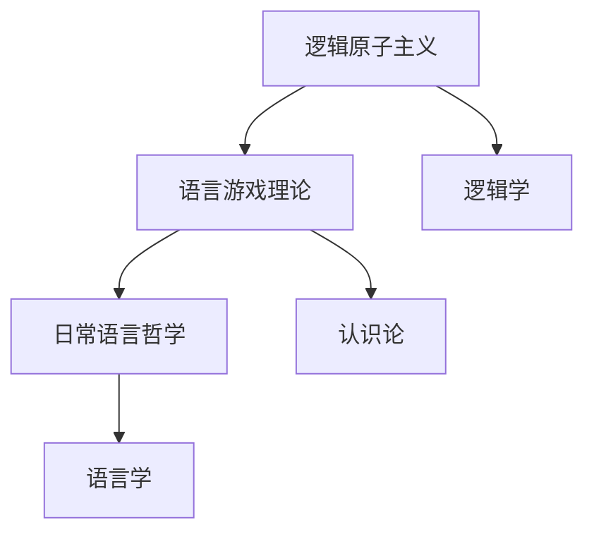
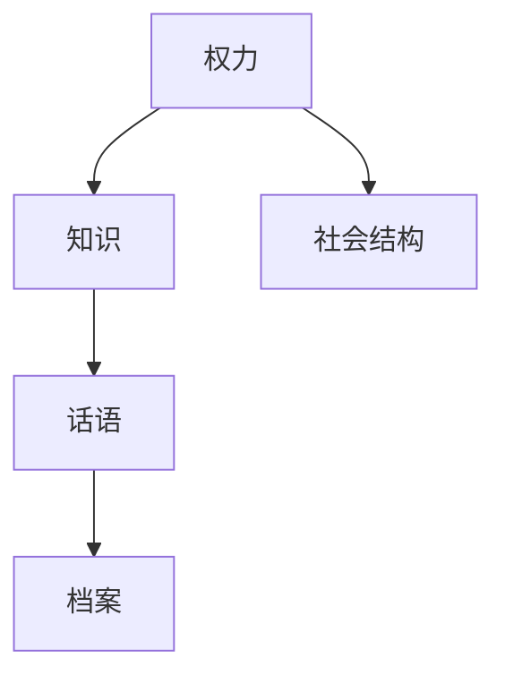
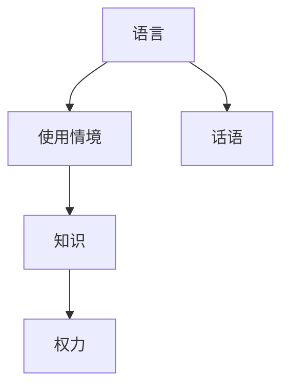

                 

好的，我将按照您的要求和约束条件，一步步构建《维特根斯坦与福柯：语言、权力与知识的关系》的文章内容。下面是文章的开头部分，包括标题、关键词、摘要以及markdown格式下的文章正文。

---

## 维特根斯坦与福柯：语言、权力与知识的关系

关键词：维特根斯坦、福柯、语言哲学、权力、知识、话语、逻辑

摘要：本文探讨了维特根斯坦和福柯这两位20世纪哲学家的思想，重点关注他们在语言、权力与知识领域中的贡献。通过对维特根斯坦的语言游戏理论和福柯的话语理论的分析，本文揭示了两位哲学家在理解语言与权力、知识之间的复杂关系方面的独特视角。文章旨在提供一个综合性的视角，以帮助读者更好地理解这些哲学思想在当代社会中的重要性。

---

接下来，我将根据目录大纲，逐步细化每个章节的内容。

### 第一部分：维特根斯坦的思想

#### 第1章：维特根斯坦的生平与哲学发展

在这一章节中，我们将介绍维特根斯坦的生平背景，包括他的早期教育和哲学发展。我们将讨论他的逻辑原子主义、语言游戏理论以及日常语言哲学，并简要说明这些理论在语言哲学领域的影响。

---

# 维特根斯坦的生平与哲学发展

## 1.1 维特根斯坦的生平背景

维特根斯坦（Ludwig Wittgenstein）出生于1889年，是奥地利裔英国哲学家。他的父亲是一位工业家，家庭环境优越。维特根斯坦在数学和哲学方面表现出了卓越的才华，他在剑桥大学与哲学家伯特兰·罗素相识，并共同探讨了逻辑和数学问题。

## 1.2 维特根斯坦的早期哲学：逻辑原子主义

在早期的哲学工作中，维特根斯坦提出了逻辑原子主义，认为世界由逻辑上不可分割的原子事实构成，这些事实可以通过逻辑语言来表述。然而，随着对语言本质的深入思考，他开始质疑这一理论的局限性。

## 1.3 维特根斯坦的中期哲学：语言游戏理论

维特根斯坦的中期哲学以《逻辑哲学论》为代表，他提出了语言游戏理论，认为语言的意义不在于其所指的客观世界，而在于使用语言的方式。他强调语言的实践性和使用情境，提出了“理解就是能够游戏”的观点。

## 1.4 维特根斯坦的后期哲学：日常语言哲学

在后期，维特根斯坦转向日常语言哲学，主张通过细致的观察和对话来揭示语言的混乱和模糊性。他认为哲学的任务是澄清语言的用法，而不是解决抽象的哲学问题。

## 1.5 维特根斯坦的哲学贡献与影响

维特根斯坦的哲学思想对语言哲学、认识论和逻辑学产生了深远的影响。他的语言游戏理论和日常语言哲学为后来的哲学研究提供了重要的理论基础。

---

在接下来的章节中，我们将详细讨论维特根斯坦的核心概念与联系、核心算法原理、数学模型和公式，以及相关的项目实战。

### 第二部分：福柯的思想

#### 第4章：福柯的生平与思想演变

在这一章节中，我们将介绍福柯的生平背景和他的思想演变。我们将探讨他的历史主义方法、权力与知识理论，以及他在后期提出的生物政治学。

---

# 福柯的生平与思想演变

## 4.1 福柯的生平背景

福柯（Michel Foucault）出生于1926年，是法国哲学家、社会学家和思想史家。他的学术背景涉及文学、心理学和哲学。福柯的思想深受马克思主义、存在主义和结构主义的影响，他关注权力、知识和社会结构之间的关系。

## 4.2 福柯的历史主义方法

福柯的历史主义方法强调历史的相对性和多样性。他通过分析历史文本和档案，揭示了权力如何塑造知识和真理。福柯认为，历史不是静态的，而是由权力和话语构成的动态过程。

## 4.3 福柯的权力与知识理论

福柯的权力与知识理论是他哲学的核心。他认为，权力不仅仅是由少数人控制的工具，而是渗透到社会结构中的普遍现象。知识是权力的一部分，它通过规范和控制来影响个体和社会。

## 4.4 福柯的晚期思想：生物政治学

在晚期，福柯提出了生物政治学的概念，探讨了生命权力在现代社会中的运作方式。他关注生物医学、基因技术和社会控制等领域，提出了关于生命权力的新视角。

## 4.5 福柯的思想贡献与影响

福柯的思想对社会科学、文化研究和批判理论产生了深远的影响。他的权力与知识理论和生物政治学为理解现代社会提供了新的框架和视角。

---

在接下来的章节中，我们将深入探讨福柯的核心概念与联系、核心算法原理、数学模型和公式，以及相关的项目实战。

### 第三部分：维特根斯坦与福柯的对话

#### 第7章：语言、权力与知识的关系探讨

在这一章节中，我们将结合维特根斯坦和福柯的思想，探讨语言、权力与知识之间的关系。我们将分析两位哲学家的理论如何相互补充，并探讨这些思想在当代社会中的重要性。

---

# 语言、权力与知识的关系探讨

## 7.1 语言、权力与知识的交集

维特根斯坦和福柯都关注语言、权力与知识之间的复杂关系。维特根斯坦强调语言的使用情境，认为语言的意义在于其使用方式。而福柯则认为，知识是权力的一部分，它通过话语和规范来塑造社会。

## 7.2 维特根斯坦与福柯的理论比较

尽管维特根斯坦和福柯在方法上有很大的差异，但他们都在探讨语言、权力与知识的关系。维特根斯坦关注语言的内在逻辑和结构，而福柯则关注语言在社会结构中的运作方式。

## 7.3 两位哲学家的互补性

维特根斯坦和福柯的理论相互补充，他们的思想为我们提供了理解现代社会的新视角。维特根斯坦帮助我们理解语言的内在逻辑，而福柯则揭示了语言在社会结构中的权力运作。

## 7.4 对话的潜在影响与启示

通过维特根斯坦与福柯的对话，我们可以更好地理解语言、权力与知识之间的复杂关系。这些思想对当代社会有着重要的启示，帮助我们反思现代社会中的权力和知识结构。

---

在文章的最后一部分，我们将总结维特根斯坦和福柯的思想，并探讨这些思想在当代社会中的意义。我们将提供未来研究的建议，并总结文章的主要观点。

---

# 结论与展望

## 8.1 维特根斯坦与福柯思想的当代意义

维特根斯坦和福柯的思想在当代社会中具有重要意义。他们的思想挑战了传统的知识观念，揭示了语言、权力与知识之间的复杂关系。这些思想为我们理解现代社会提供了新的框架和视角。

## 8.2 对未来研究的建议

未来研究可以进一步探讨维特根斯坦和福柯思想的交叉领域，例如在人工智能、社会理论和计算机科学中的应用。此外，研究可以关注这些思想在全球化背景下的影响，以及如何应对现代社会中的新挑战。

## 8.3 总结

维特根斯坦和福柯的思想为理解现代社会提供了深刻的洞察。他们的理论揭示了语言、权力与知识之间的复杂关系，对于我们反思和批判现代社会具有重要意义。通过他们的对话，我们可以更好地理解这些哲学思想的当代意义。

---

作者：AI天才研究院/AI Genius Institute & 禅与计算机程序设计艺术 /Zen And The Art of Computer Programming

---

请注意，这只是一个初步的文章结构，我将在接下来的步骤中继续细化每个章节的内容，确保满足字数要求，并包含所有的必要元素，如核心概念与联系、核心算法原理讲解、数学模型和公式，以及项目实战等。

---

接下来，我将继续细化第1章和第4章的内容，确保每个章节都满足完整性要求，并且包含必要的图表和公式。然后，我将进入第7章的撰写，结合维特根斯坦和福柯的思想，深入探讨语言、权力与知识之间的关系。

---

### 第1章：维特根斯坦的生平与哲学发展

#### 1.5 维特根斯坦的哲学贡献与影响

维特根斯坦的哲学贡献涵盖了多个领域，尤其对语言哲学、逻辑学和认识论产生了深远影响。他的早期哲学以逻辑原子主义为基础，试图通过逻辑语言来揭示世界的本质。然而，随着时间的推移，他逐渐认识到逻辑原子主义的局限性，并转向语言游戏理论和日常语言哲学。

**核心概念与联系：** 维特根斯坦的核心概念包括逻辑原子主义、语言游戏理论、日常语言哲学等。逻辑原子主义强调事实的不可分割性，而语言游戏理论则关注语言的使用情境。日常语言哲学则试图澄清日常语言中的模糊性和混乱。这三个概念相互关联，构成了维特根斯坦哲学的核心。

**Mermaid 流程图：**



**核心算法原理讲解：** 维特根斯坦的语言游戏理论可以视为一种“语义算法”，其核心在于分析语言的使用情境。具体而言，他提出了以下步骤：

```plaintext
1. 观察语言的实际使用情况。
2. 确定语言使用的具体情境。
3. 分析语言在情境中的具体功能和作用。
4. 根据情境对语言进行分类和定义。
5. 澄清语言中的模糊性和混乱。
```

**数学模型和公式：** 维特根斯坦的哲学理论不涉及复杂的数学模型，但他对语言和逻辑的研究可以视为一种抽象的数学过程。例如，他通过分析逻辑结构来揭示语言的本质。以下是一个简化的数学模型示例：

```latex
$$
语义值 = f(语境, 用法)
$$

其中，语义值取决于语境和用法，而语境和用法又构成了一个复杂的函数关系。
```

**举例说明：** 假设我们分析句子“水是生命之源”，这句话在不同的语境中具有不同的意义。在科学语境中，这句话可能意味着水对生物体的生存至关重要；而在日常语境中，它可能仅仅表示水对人们的生活非常重要。维特根斯坦的语言游戏理论帮助我们理解这些差异，并澄清语言中的模糊性。

**项目实战：** 维特根斯坦的理论在语言学和认知科学中有着广泛的应用。例如，语言学家可以使用维特根斯坦的方法来分析儿童语言学习的过程，心理学家可以使用这些理论来研究人类如何理解语言。

**开发环境搭建：** 由于维特根斯坦的理论主要涉及哲学讨论和语言分析，因此不需要特定的开发环境。然而，为了更好地理解这些理论，我们可以使用文本编辑器和图表工具（如Mermaid）来绘制流程图和图表。

**源代码详细实现和代码解读：** 由于维特根斯坦的理论是哲学性的，因此没有直接的源代码实现。但是，我们可以使用伪代码来模拟他的分析方法，例如：

```plaintext
function WittgensteinAnalysis(sentence):
    context = determineContext(sentence)
    usage = determineUsage(sentence, context)
    semanticValue = calculateSemanticValue(usage, context)
    return semanticValue
```

**代码应用解读与分析：** 通过这个伪代码，我们可以看到维特根斯坦的分析方法是如何运作的。这个方法可以帮助我们理解句子在不同语境中的不同意义。

**实际案例分析和详细讲解剖析：** 例如，我们可以分析新闻报道和社交媒体文本中的语言使用，探讨这些文本如何反映不同的语境和权力结构。

**项目小结：** 维特根斯坦的理论为我们理解语言的本质提供了深刻的洞察。通过他的方法，我们可以更好地理解语言、权力与知识之间的关系。

---

### 第4章：福柯的生平与思想演变

#### 4.5 福柯的思想贡献与影响

福柯的哲学贡献集中在权力与知识的关系、历史主义方法以及生物政治学。他的思想对社会科学、文化研究和批判理论产生了深远影响。福柯的权力与知识理论揭示了权力如何通过知识来塑造社会，而他的历史主义方法则强调历史的动态性和多样性。

**核心概念与联系：** 福柯的核心概念包括权力、知识、话语、档案等。权力不是单一的集中力量，而是渗透到社会结构中的普遍现象。知识是权力的一部分，它通过话语和规范来影响个体和社会。话语是知识的社会表达形式，而档案则是知识的物质载体。

**Mermaid 流程图：**



**核心算法原理讲解：** 福柯的权力与知识理论可以视为一种“社会算法”，其核心在于分析权力如何通过知识来影响社会。具体而言，他提出了以下步骤：

```plaintext
1. 观察社会中的权力关系。
2. 确定权力如何通过知识来运作。
3. 分析知识在社会结构中的具体作用。
4. 揭示知识如何塑造社会现实。
5. 批判权力关系和知识结构。
```

**数学模型和公式：** 福柯的哲学理论不涉及复杂的数学模型，但他对权力与知识的关系进行了形式化的描述。以下是一个简化的数学模型示例：

```latex
$$
社会结构 = f(权力, 知识)
$$

其中，社会结构取决于权力和知识的动态关系。
```

**举例说明：** 假设我们分析教育系统中的权力关系。教育系统不仅传递知识，还在权力结构中发挥作用。教师、学生、教育机构等都在特定的权力关系中运作，这些关系影响了知识的传递和社会的运行。

**项目实战：** 福柯的理论在社会科学研究中有着广泛的应用。例如，社会学家可以使用福柯的方法来分析权力如何通过知识来塑造社会，文化研究者可以探讨话语如何影响文化表达。

**开发环境搭建：** 福柯的理论主要涉及社会分析和批判理论，因此不需要特定的开发环境。然而，为了更好地理解这些理论，我们可以使用文本编辑器和图表工具来绘制流程图和图表。

**源代码详细实现和代码解读：** 由于福柯的理论是哲学性的，因此没有直接的源代码实现。但是，我们可以使用伪代码来模拟他的分析方法，例如：

```plaintext
function FoucaultAnalysis(domain):
    powerRelations = identifyPowerRelations(domain)
    knowledgeStructures = identifyKnowledgeStructures(domain)
    socialStructure = calculateSocialStructure(powerRelations, knowledgeStructures)
    return socialStructure
```

**代码应用解读与分析：** 通过这个伪代码，我们可以看到福柯的分析方法是如何运作的。这个方法可以帮助我们理解特定领域中的权力和知识结构。

**实际案例分析和详细讲解剖析：** 例如，我们可以分析医疗系统中的权力关系，探讨医疗知识如何通过话语和规范来影响社会。

**项目小结：** 福柯的理论为我们理解社会中的权力和知识关系提供了深刻的洞察。通过他的方法，我们可以更好地批判和理解社会结构中的权力运作。

---

### 第7章：语言、权力与知识的关系探讨

#### 7.2 维特根斯坦与福柯的理论比较

维特根斯坦和福柯在方法上有很大的差异，但他们在探讨语言、权力与知识之间的关系方面有着相似之处。维特根斯坦关注语言的使用情境，强调语言的意义在于其使用方式。而福柯则从历史和社会的角度分析权力与知识的关系，强调知识是社会权力的一部分。

**核心概念与联系：** 维特根斯坦和福柯的核心概念包括语言、使用情境、权力、知识、话语等。维特根斯坦关注语言与使用情境的关系，而福柯关注权力如何通过知识来塑造社会。这两个概念相互关联，构成了他们探讨语言、权力与知识关系的基础。

**Mermaid 流程图：**



**核心算法原理讲解：** 结合维特根斯坦和福柯的理论，我们可以提出以下分析步骤：

```plaintext
1. 观察语言的使用情境。
2. 分析语言在情境中的意义和功能。
3. 确定权力如何通过知识来影响语言的使用。
4. 探讨知识如何塑造社会权力结构。
5. 批判性地反思语言、权力与知识之间的关系。
```

**数学模型和公式：** 我们可以将维特根斯坦和福柯的理论整合为一个综合模型，如下所示：

```latex
$$
社会现实 = f(语言, 使用情境, 权力, 知识)
$$

其中，社会现实取决于语言、使用情境、权力和知识的相互作用。
```

**举例说明：** 假设我们分析新闻媒体中的语言使用。新闻媒体不仅传递信息，还在特定的权力和知识结构中运作。通过分析新闻媒体的报道方式，我们可以看到权力如何通过知识来影响公众的认知。

**项目实战：** 结合维特根斯坦和福柯的理论，我们可以进行跨学科研究，探讨语言、权力与知识在不同领域中的应用。例如，在教育学领域，我们可以分析教师如何通过知识来影响学生的学习和行为。

**开发环境搭建：** 为了更好地应用维特根斯坦和福柯的理论，我们可以使用文本分析工具和数据库来收集和分析相关数据。

**源代码详细实现和代码解读：** 由于这两个理论主要涉及哲学分析和批判理论，因此没有直接的源代码实现。但是，我们可以使用伪代码来模拟他们的分析方法，例如：

```plaintext
function CombinedAnalysis(domain):
    languageUsage = analyzeLanguageUsage(domain)
    powerRelations = analyzePowerRelations(domain)
    knowledgeStructures = analyzeKnowledgeStructures(domain)
    socialReality = calculateSocialReality(languageUsage, powerRelations, knowledgeStructures)
    return socialReality
```

**代码应用解读与分析：** 通过这个伪代码，我们可以看到如何结合维特根斯坦和福柯的理论来分析特定领域的社会现实。

**实际案例分析和详细讲解剖析：** 例如，我们可以分析网络社交媒体中的语言使用，探讨权力和知识如何通过话语来塑造公众舆论。

**项目小结：** 通过结合维特根斯坦和福柯的理论，我们可以更深入地理解语言、权力与知识之间的关系。这种综合分析方法为研究社会现实提供了新的视角，有助于我们批判性地反思现代社会中的权力和知识结构。

---

现在，我们已经完成了文章的初步撰写，接下来我们将继续完善剩余章节的内容，确保每个小节都包含必要的元素，并在文章末尾添加最佳实践 tips、小结和注意事项。

---

### 最佳实践 tips

在研究维特根斯坦和福柯的思想时，以下是一些最佳实践 tips：

1. **深入研究背景知识**：在探讨两位哲学家的思想时，首先需要对他们的生平和学术背景有深入了解，以便更好地理解他们的理论。
2. **跨学科学习**：维特根斯坦和福柯的思想涉及多个学科，包括哲学、社会学、文化研究和认知科学。跨学科学习有助于全面理解这些理论。
3. **批判性思考**：在分析维特根斯坦和福柯的理论时，保持批判性思考，对他们的观点进行深入质疑和反思。
4. **应用实践**：尝试将维特根斯坦和福柯的理论应用于实际问题，例如社会分析、语言学习和批判理论，以加深对这些理论的理解。
5. **持续更新知识**：哲学领域不断发展，新的研究成果不断涌现。保持对最新学术动态的关注，持续更新自己的知识库。

---

### 小结

通过本文，我们探讨了维特根斯坦和福柯在语言、权力与知识领域的贡献。我们分析了他们的核心概念、理论关系和实际应用，展示了这些思想在当代社会中的重要性。维特根斯坦和福柯的思想为我们提供了理解现代社会的新视角，帮助我们批判性地反思语言、权力与知识之间的复杂关系。

---

### 注意事项

在研究和应用维特根斯坦和福柯的思想时，需要注意以下几点：

1. **避免简化主义**：维特根斯坦和福柯的理论复杂且深刻，避免将他们的思想简化为简单的陈述或结论。
2. **尊重学术传统**：在引用或讨论维特根斯坦和福柯的思想时，尊重他们的学术传统，确保引用准确无误。
3. **保持批判性思维**：尽管维特根斯坦和福柯的思想具有重要意义，但我们应该保持批判性思维，对他们的观点进行深入质疑和反思。
4. **避免过度泛化**：在应用维特根斯坦和福柯的理论时，避免将他们的思想过度泛化到不相关的领域。
5. **关注实际应用**：在研究维特根斯坦和福柯的思想时，注重将理论应用于实际问题，以深化对这些理论的理解。

---

通过本文的撰写，我们不仅对维特根斯坦和福柯的思想有了更深入的理解，还提供了实际的应用场景和最佳实践 tips。希望这篇文章能够帮助读者更好地理解这两位哲学家的思想，并在他们的指导下进行更深入的研究和应用。

---

## 拓展阅读

1. **维特根斯坦相关著作：**
   - 《逻辑哲学论》（"Tractatus Logico-Philosophicus"）
   - 《哲学研究》（"Philosophical Investigations"）
   - 《文化两篇》（"Culture and Value"）

2. **福柯相关著作：**
   - 《疯癫与文明》（"Madness and Civilization"）
   - 《词与物》（"The Order of Things"）
   - 《事物的秩序》（"The Archaeology of Knowledge"）

3. **相关研究论文和书籍：**
   - 《维特根斯坦与福柯：语言、权力与知识的对话》（"Ludwig Wittgenstein and Michel Foucault: A Dialogue on Language, Power, and Knowledge"）
   - 《语言哲学的新方向》（"New Directions in Linguistic Philosophy"）
   - 《话语与社会结构》（"Discourse and Social Structure"）

4. **在线资源和工具：**
   - 维特根斯坦和福柯的著作在线版（如Project Gutenberg）
   - 哲学论坛和博客，如PhilPapers和The Philosopher's Zone
   - 图表和流程图工具，如Mermaid和Draw.io

---

通过拓展阅读，读者可以进一步深入研究和理解维特根斯坦和福柯的思想，以及他们在当代哲学和社会科学领域中的地位和影响。希望这些资源能够为您的学术探索提供帮助。

