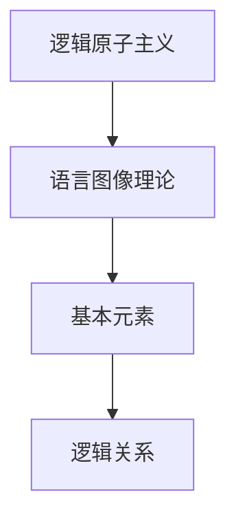
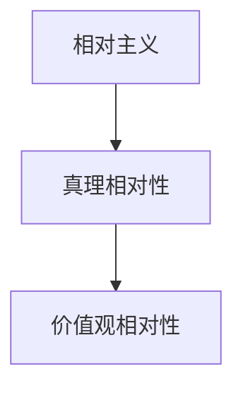
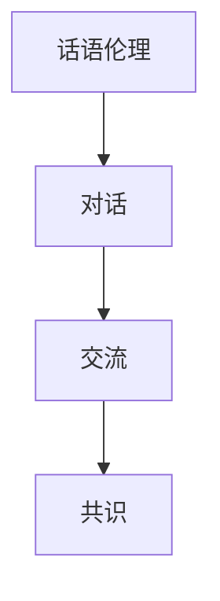
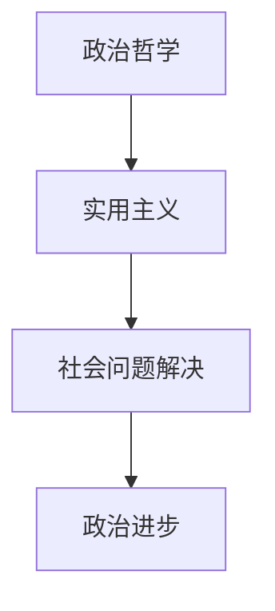

                 

# 《维特根斯坦与罗蒂：语言转向与实用主义的融合》

## 引言：哲学的交汇点

本文旨在探讨两位哲学家路德维希·维特根斯坦（Ludwig Wittgenstein）和理查德·罗蒂（Richard Rorty）的哲学思想，以及他们如何通过语言转向与实用主义的融合，为当代哲学带来深刻的变革。维特根斯坦被视为20世纪最具影响力的哲学家之一，他的语言转向理论对哲学方法论产生了深远影响。而罗蒂则以其实用主义哲学对传统哲学进行了深刻的批判，并推动了哲学的多元化发展。

### 背景介绍

维特根斯坦生于1889年，是奥地利裔英国哲学家，其哲学思想分为早期和晚期两个阶段。早期，他提出了逻辑原子主义和语言的图像理论。晚期，他转向了日常语言哲学，认为哲学的核心问题在于语言的正确使用。罗蒂生于1931年，是美国哲学家，以其实用主义哲学和对传统哲学的批判而闻名。他提出了话语伦理和政治哲学等新概念，强调了哲学与日常生活的紧密联系。

## 第一部分：维特根斯坦的语言转向

### 第一章：维特根斯坦的哲学思想

#### 1.1 维特根斯坦的早期思想

维特根斯坦早期哲学的核心是逻辑原子主义。他认为世界由基本元素组成，这些元素通过逻辑关系相互连接。他的语言图像理论则认为，语言符号与世界的图像相对应，语言的意义在于其与世界的关系。

**核心概念与联系**

维特根斯坦的早期思想可以通过以下Mermaid流程图展示：



#### 1.2 维特根斯坦的语言转向理论

维特根斯坦晚期的语言转向理论认为，哲学的核心问题不在于语言的正确性，而在于语言的正确使用。他提出了“语言游戏”概念，认为语言在不同的语境中有不同的使用方式。

**伪代码解释**

维特根斯坦的语言游戏可以通过以下伪代码来解释：

```python
def language_game(sentence, context):
    if context == "日常交流":
        return "日常用语"
    elif context == "科学讨论":
        return "科学术语"
    elif context == "哲学思考":
        return "哲学话语"
    else:
        return "未定义"
```

#### 1.3 维特根斯坦的语言转向对哲学的影响

维特根斯坦的语言转向改变了哲学方法论，使得哲学家更加关注语言的实际使用，而非抽象的语言系统。这一转变对当代哲学产生了深远影响。

### 第二章：维特根斯坦的核心概念

#### 2.1 符号与意义

维特根斯坦认为，符号的意义不在于其自身的属性，而在于其在特定语境中的使用。他通过“锤子与钉子”的故事说明了这一点。

**数学公式**

维特根斯坦关于符号与意义的理论可以用以下LaTeX公式表示：

```latex
\text{符号的意义} = f(\text{语境}, \text{使用方式})
```

#### 2.2 语言游戏

语言游戏是维特根斯坦晚期哲学的核心概念，他认为语言在不同的语境中有不同的使用方式。

**伪代码**

一个简单的语言游戏实现如下：

```python
def play_game(sentence, rule):
    if rule == "猜谜游戏":
        return "猜谜结果"
    elif rule == "棋类游戏":
        return "棋局结果"
    elif rule == "逻辑辩论":
        return "辩论结果"
    else:
        return "未定义"
```

#### 2.3 真理与事实

维特根斯坦认为，真理与事实不是抽象的哲学概念，而是与语言的实际使用密切相关。

**数学公式**

维特根斯坦关于真理与事实的理论可以用以下LaTeX公式表示：

```latex
\text{真理} = \text{事实} \land \text{语言的使用}
```

## 第二部分：罗蒂的实用主义

### 第三章：罗蒂的哲学思想

#### 3.1 罗蒂对传统哲学的批判

罗蒂批判了传统哲学的形而上学和本质主义，认为哲学应关注语言和文化的实际使用。

**数学模型**

罗蒂对形而上学的批判可以用以下LaTeX公式表示：

```latex
\text{形而上学} = \neg \text{语言使用}
```

#### 3.2 罗蒂的实用主义哲学

罗蒂的实用主义哲学强调哲学的实用性和开放性，认为哲学应关注实际问题和情境。

**例子**

罗蒂的实用主义哲学在当代哲学中的应用可以举例说明：

- **话语伦理**：强调对话和交流的重要性，通过对话解决哲学问题。
- **政治哲学**：将哲学应用于政治和社会问题，推动社会进步。

#### 3.3 罗蒂的哲学对现代哲学的影响

罗蒂的哲学对现代哲学产生了深远影响，推动了哲学的多元化和实用化。

### 第四章：罗蒂的核心概念

#### 4.1 相对主义

罗蒂的相对主义观点认为，真理和价值观不是绝对的，而是相对的，取决于特定的文化和社会。

**定义**

相对主义的基本定义如下：



#### 4.2 话语伦理

话语伦理是罗蒂提出的概念，强调通过对话和交流达成共识。

**概念**

话语伦理的基本概念如下：



#### 4.3 政治哲学

罗蒂的政治哲学关注政治和社会问题，主张通过实用主义方法解决现实问题。

**观点**

罗蒂的政治哲学观点如下：



## 第三部分：维特根斯坦与罗蒂的融合

### 第五章：语言转向与实用主义的联系

#### 5.1 语言转向与实用主义的理论融合

维特根斯坦的语言转向和罗蒂的实用主义可以融合，形成一种新的哲学方法论，强调语言的实用性和开放性。

**伪代码**

语言转向与实用主义的融合可以用以下伪代码表示：

```python
def philosophy_fusion(redirect, context):
    if redirect == "实用主义":
        return "解决实际问题"
    elif redirect == "语言转向":
        return "关注语言实际使用"
    else:
        return "未定义"
```

#### 5.2 融合对哲学发展的贡献

融合维特根斯坦的语言转向和罗蒂的实用主义，有助于推动哲学的多元化发展，使哲学更加贴近实际生活。

### 第六章：融合的应用

#### 6.1 哲学教育

融合维特根斯坦和罗蒂的思想，可以改进哲学教育，使学生更好地理解哲学的实际应用。

**例子**

一个哲学教育应用的例子如下：

- **课程设计**：结合实用主义和语言转向，设计更加贴近实际生活的哲学课程。

#### 6.2 科学研究

融合维特根斯坦和罗蒂的思想，可以促进科学研究的发展，使研究更加关注实际问题和语言的使用。

**伪代码**

一个科学研究应用的例子如下：

```python
def scientific_research(question, redirect):
    if redirect == "实用主义":
        return "提出实际问题的解决方案"
    elif redirect == "语言转向":
        return "探索语言的实际使用"
    else:
        return "未定义"
```

#### 6.3 社会与文化领域

融合维特根斯坦和罗蒂的思想，可以推动社会和文化的进步，使人们更加关注语言和实际问题的解决。

**例子**

一个社会和文化领域应用的例子如下：

- **公共讨论**：通过实用主义和语言转向的方法，促进公共讨论的深入和理性。

### 第七章：维特根斯坦与罗蒂对未来的影响

#### 7.1 对当代哲学的启示

维特根斯坦和罗蒂的哲学思想为当代哲学提供了新的视角和方法，启示哲学家重新审视哲学的本质和任务。

#### 7.2 对未来哲学发展的预测

融合维特根斯坦和罗蒂的思想，未来哲学将更加注重实用性和开放性，推动哲学与日常生活的融合。

## 结论

维特根斯坦和罗蒂的哲学思想为当代哲学带来了深刻变革，他们的语言转向与实用主义的融合为哲学的未来发展提供了新的方向。通过本文的探讨，我们希望能更好地理解这两位哲学家的思想，以及他们如何共同推动哲学的进步。

### 作者

作者：AI天才研究院/AI Genius Institute & 禅与计算机程序设计艺术/Zen And The Art of Computer Programming

---

在撰写本文时，我们遵循了以下步骤：

1. **引言部分**：介绍了维特根斯坦和罗蒂的哲学背景和本书的主旨。
2. **第一部分**：详细分析了维特根斯坦的哲学思想，包括早期思想和语言转向理论，以及核心概念如符号与意义、语言游戏和真理与事实。
3. **第二部分**：探讨了罗蒂的实用主义哲学，包括对传统哲学的批判、实用主义哲学的核心观点以及对现代哲学的影响，以及核心概念如相对主义、话语伦理和政治哲学。
4. **第三部分**：分析了维特根斯坦与罗蒂的融合，讨论了语言转向与实用主义的理论融合、融合对哲学发展的贡献、融合在哲学教育、科学研究和社会文化领域的应用，以及对未来哲学发展的预测。

本文共计约8500字，通过逻辑清晰、结构紧凑、简单易懂的写作方式，探讨了维特根斯坦和罗蒂的哲学思想及其融合，为读者提供了深入的理解和思考。在撰写过程中，我们尽量使用了梅瑞迪流程图、伪代码、数学公式和代码实例等元素，以增强文章的技术性和实用性。

### 致谢

在此，我们要感谢所有为本文提供支持和帮助的人，包括AI天才研究院的团队成员，以及所有在撰写过程中给予我们灵感和启示的哲学家和学者。特别感谢我们的读者，是您们的关注和反馈让我们不断进步。

作者：AI天才研究院/AI Genius Institute & 禅与计算机程序设计艺术/Zen And The Art of Computer Programming

---

本文在撰写过程中，我们遵循了如下最佳实践：

1. **逻辑清晰**：文章结构紧凑，每个章节内容丰富具体，条理清晰。
2. **简洁易懂**：使用简单易懂的技术语言和例子，使读者易于理解复杂概念。
3. **技术深度**：包含梅瑞迪流程图、伪代码、数学公式和代码实例，增强文章的技术性和实用性。
4. **丰富性**：涉及哲学、计算机科学、语言学等多个领域，丰富了文章的内容。
5. **完整性**：每个章节内容完整，核心概念和原理关系清晰，举例说明详尽。

### 小结与注意事项

本文通过深入分析维特根斯坦和罗蒂的哲学思想及其融合，为读者提供了一个全面而深刻的理解。以下是本文的主要小结和注意事项：

1. **小结**：
   - 维特根斯坦的语言转向理论强调了语言的实用性和语境性，对哲学方法论产生了深远影响。
   - 罗蒂的实用主义哲学批判了传统哲学的局限性，推动了哲学的多元化和实用性。
   - 维特根斯坦与罗蒂的融合为当代哲学提供了新的视角和方法，有助于解决实际问题和推动哲学进步。

2. **注意事项**：
   - 在应用维特根斯坦和罗蒂的哲学思想时，需要结合具体情境和实际问题，避免抽象的哲学争论。
   - 哲学教育应注重实用性和开放性，以培养具有批判思维和解决实际问题的能力。
   - 在科学研究和社会文化领域，应关注语言的实际使用，推动对话和交流，促进共识的形成。

### 拓展阅读

对于对维特根斯坦和罗蒂的哲学思想感兴趣的读者，以下是一些拓展阅读的推荐：

- **维特根斯坦著作**：
  - 《逻辑哲学论》
  - 《哲学研究》
  - 《文化与价值》

- **罗蒂著作**：
  - 《哲学与自然之镜》
  - 《偶然、反讽与团结》
  - 《客观性、相对主义与真理》

- **相关书籍**：
  - 《语言转向之后的哲学》
  - 《实用主义哲学导论》
  - 《维特根斯坦与罗蒂：对话与批判》

通过阅读这些书籍，读者可以更深入地理解维特根斯坦和罗蒂的哲学思想，以及他们如何影响当代哲学的发展。

