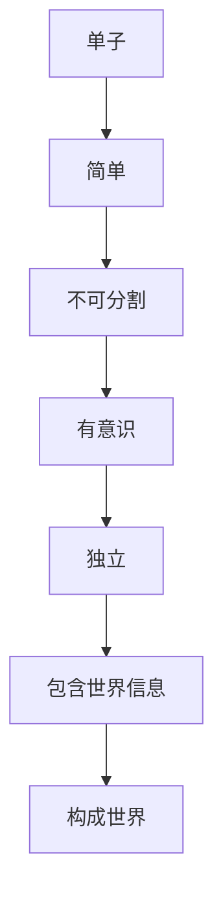
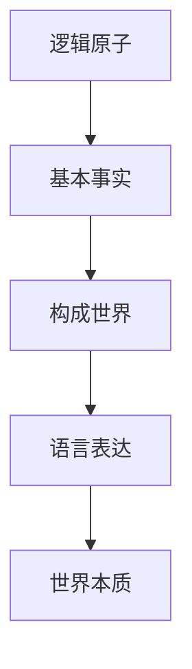
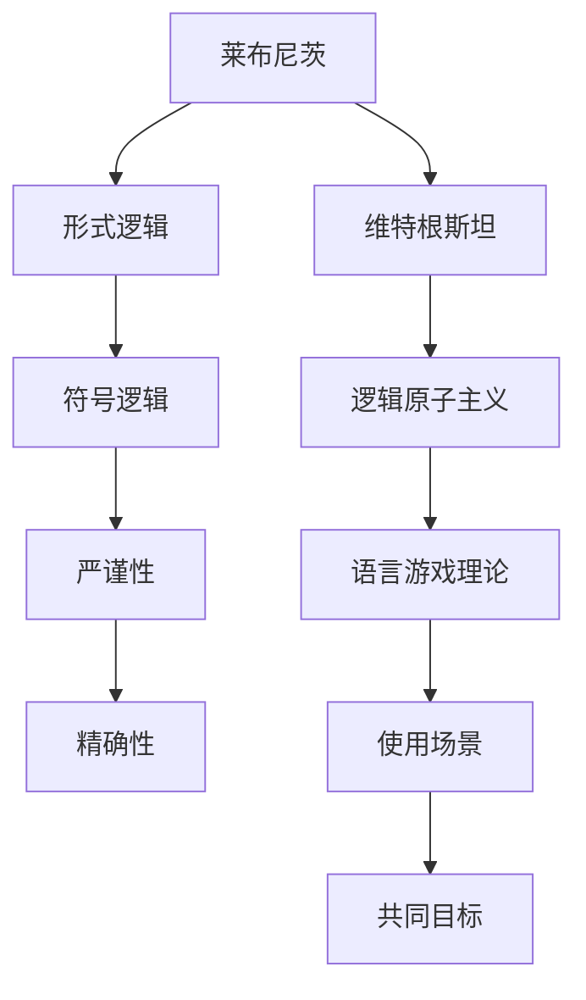
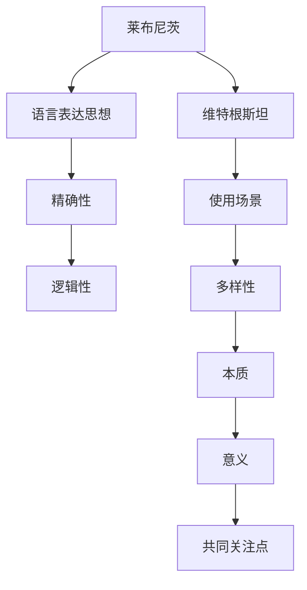
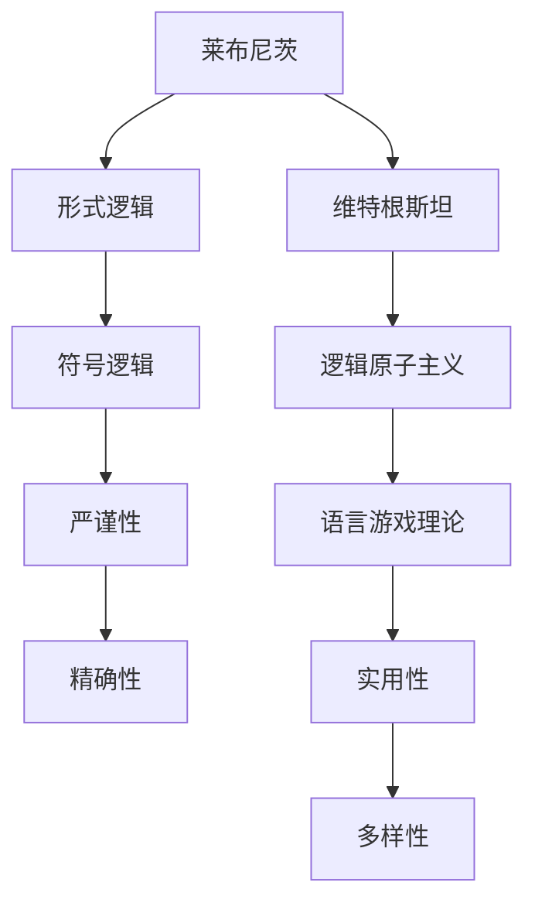
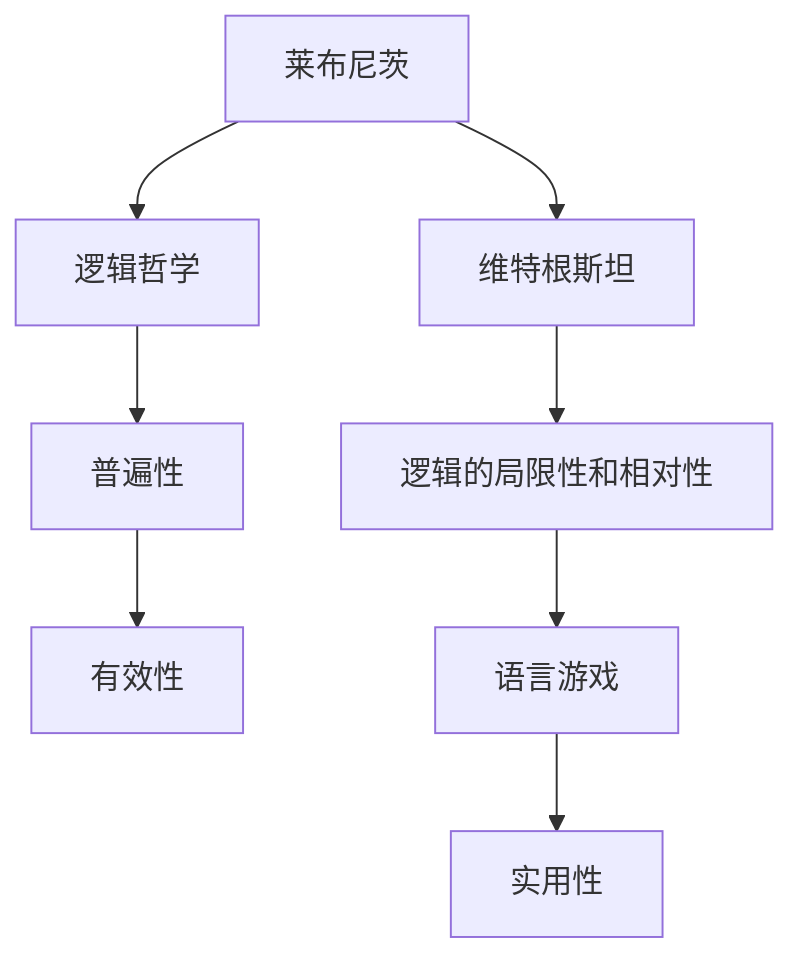
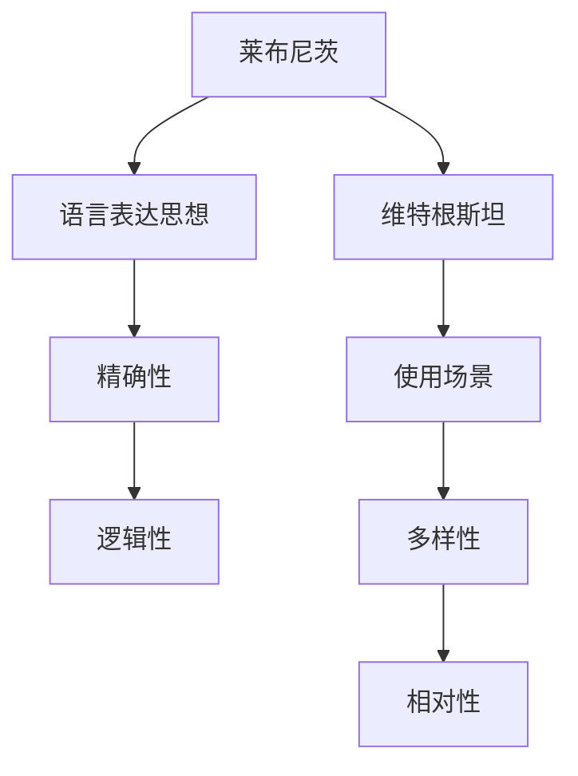
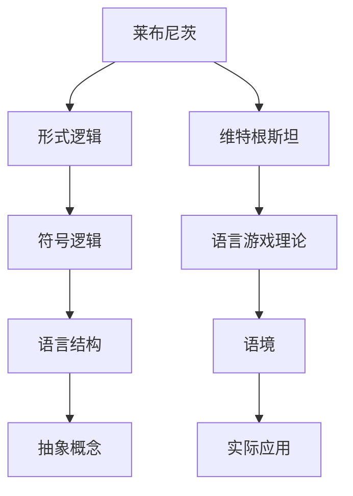

                 

### 文章标题：维特根斯坦与莱布尼茨：逻辑与语言的历史对话

### 关键词：维特根斯坦，莱布尼茨，逻辑，语言，哲学，形式逻辑，符号逻辑，语言游戏理论，逻辑原子主义，微积分，二进制，算符，计算机科学

### 摘要：

本文深入探讨两位哲学巨匠——维特根斯坦和莱布尼茨——在逻辑与语言领域的思想贡献及其对现代哲学的深远影响。通过分析两位哲学家的生平、哲学思想和历史背景，揭示他们之间的对话与交锋，以及他们对逻辑和语言的独特见解。本文将逐步剖析逻辑与语言的核心概念、原理和算法，并通过具体的实例和项目实战，展示这些理论在实际应用中的价值和意义。

---

### 第1章 引言与概述

#### 1.1 书籍背景

《维特根斯坦与莱布尼茨：逻辑与语言的历史对话》旨在探讨两位哲学巨匠——维特根斯坦和莱布尼茨——在逻辑与语言领域的思想贡献及其对现代哲学的深远影响。本书将通过分析两位哲学家的生平、哲学思想和历史背景，揭示他们之间的对话与交锋，以及他们对逻辑和语言的独特见解。本书不仅为哲学研究者提供了丰富的思想资源，也为计算机科学和语言学的实践者提供了理论指导。

#### 1.2 维特根斯坦与莱布尼茨

路德维希·维特根斯坦（Ludwig Wittgenstein，1889-1951）和戈特弗里德·莱布尼茨（Gottfried Wilhelm Leibniz，1646-1716）分别是20世纪和17世纪的哲学巨匠，他们在逻辑、数学、哲学和语言等领域有着卓越的成就。维特根斯坦以其对语言、逻辑和数学的深刻思考而著称，他的著作《逻辑哲学论》和《哲学研究》被认为是20世纪哲学的经典之作。莱布尼茨则以其发明微积分、二进制和逻辑算符而闻名，他是现代逻辑和计算机科学的先驱。

#### 1.3 逻辑与语言的历史发展

逻辑和语言是哲学研究的核心议题，它们在人类思维和文明发展中起着至关重要的作用。从古希腊的亚里士多德到现代的维特根斯坦和莱布尼茨，逻辑和语言的研究不断深化和发展。莱布尼茨提出了形式逻辑和符号逻辑的概念，为现代逻辑奠定了基础。维特根斯坦则通过语言游戏理论和逻辑原子主义，对语言的本质和逻辑的结构进行了深刻的探讨。

#### 1.4 本书结构

本书共分为七个章节，第1章为引言与概述，第2章和第3章分别介绍莱布尼茨和维特根斯坦的生平与哲学思想，第4章探讨他们之间的逻辑与语言对话，第5章和第6章分别比较两位哲学家的逻辑与语言观点，第7章为总结与未来展望。

---

### 第2章 莱布尼茨的生平与哲学思想

#### 2.1 生平介绍

戈特弗里德·莱布尼茨（1646-1716）是德国数学家、哲学家、逻辑学家和发明家，生于莱比锡。他的父亲是莱比锡大学的法学教授，莱布尼茨自幼受到良好的教育，他在数学和哲学领域表现出卓越的才华。莱布尼茨在1676年发明了微积分，这一数学工具对自然科学和工程学的发展产生了深远影响。此外，他还发明了二进制和逻辑算符，为现代计算机科学奠定了基础。

#### 2.2 哲学思想

莱布尼茨的哲学思想主要包括单子论、形而上学和逻辑与语言。单子论是莱布尼茨哲学的核心，他认为世界是由无数个独立的、简单的、不可分割的单子组成的。每个单子都包含了一部分世界的信息，而所有单子的总和构成了整个世界。在形而上学方面，莱布尼茨提出了“最佳构造论”，认为现实世界是所有可能世界中最好的。在逻辑和语言方面，莱布尼茨提出了形式逻辑和符号逻辑，为现代逻辑的发展奠定了基础。

##### 2.2.1 单子论

单子是莱布尼茨哲学体系中的基本单位，他认为每个单子都是简单的、不可分割的，并且具有自己的意识。单子之间没有相互作用，但每个单子都包含了一部分世界的信息。莱布尼茨用单子论解释了世界的多样性和复杂性，认为每个单子的独特性质决定了世界的多样性。

##### 2.2.2 形而上学

莱布尼茨的形而上学思想主张现实世界是所有可能世界中最好的。他认为上帝在创造世界时，选择了最优的构造，使得世界充满了和谐与秩序。莱布尼茨的这一思想对后来的宗教哲学和科学哲学产生了深远影响。

##### 2.2.3 逻辑与语言

莱布尼茨在逻辑和语言方面做出了重要贡献，他提出了形式逻辑和符号逻辑。形式逻辑通过建立符号系统，使得逻辑推理更加严谨和精确。符号逻辑则通过引入符号和公式，使得逻辑推理更加抽象和通用。莱布尼茨的这些思想对后来的逻辑学和计算机科学产生了深远影响。

---

### 第3章 维特根斯坦的生平与哲学思想

#### 3.1 生平介绍

路德维希·维特根斯坦（Ludwig Wittgenstein，1889-1951）是奥地利哲学家，生于维也纳。他的父亲是维也纳银行家，维特根斯坦自幼受到良好的教育。他在数学、哲学和语言学等领域表现出卓越的才华。维特根斯坦的哲学思想经历了两次重要转变，早期他主张逻辑原子主义，晚期则提出语言游戏理论。

#### 3.2 哲学思想

维特根斯坦的哲学思想主要包括逻辑原子主义和语言游戏理论。逻辑原子主义是维特根斯坦早期哲学思想的核心，他认为世界由基本事实构成，这些事实可以通过语言来表达。语言游戏理论则是维特根斯坦晚期哲学思想的核心，他认为语言的意义在于使用者的语言游戏，语言的意义取决于使用场景。

##### 3.2.1 逻辑原子主义

逻辑原子主义是维特根斯坦早期哲学思想的核心，他认为世界由基本事实构成，这些事实可以通过语言来表达。维特根斯坦将事实视为逻辑原子，认为它们是构成世界的基本单位。逻辑原子主义试图通过分析语言的基本结构，揭示世界的本质。

##### 3.2.2 语言游戏理论

语言游戏理论是维特根斯坦晚期哲学思想的核心，他认为语言的意义在于使用者的语言游戏，语言的意义取决于使用场景。维特根斯坦通过分析语言游戏，揭示了语言的多样性和复杂性。语言游戏理论对后来的语言学、哲学和计算机科学产生了深远影响。

---

### 第4章 逻辑与语言的历史对话

#### 4.1 逻辑思想的对话

莱布尼茨和维特根斯坦在逻辑思想方面有着显著的对话与交锋。莱布尼茨主张形式逻辑和符号逻辑，强调逻辑推理的严谨性和精确性。维特根斯坦则主张逻辑原子主义和语言游戏理论，强调语言的意义和使用场景。两位哲学家的逻辑思想在形式上有所区别，但在追求逻辑严谨性和精确性的目标上有着共同之处。

#### 4.2 语言思想的对话

莱布尼茨和维特根斯坦在语言思想方面也有着显著的对话与交锋。莱布尼茨主张语言是表达思想的工具，强调语言的精确性和逻辑性。维特根斯坦则主张语言的意义取决于使用场景，强调语言的多样性。两位哲学家的语言思想在关注点和方法上有所不同，但在探索语言的本质和意义方面有着共同之处。

---

### 第5章 维特根斯坦与莱布尼茨的逻辑比较

#### 5.1 逻辑方法

维特根斯坦和莱布尼茨在逻辑方法上有着明显的差异。莱布尼茨主张形式逻辑和符号逻辑，通过建立严格的符号系统来进行逻辑推理。维特根斯坦则主张逻辑原子主义和语言游戏理论，通过分析语言的基本结构和使用场景来进行逻辑推理。莱布尼茨的方法更注重逻辑推理的严谨性和精确性，而维特根斯坦的方法更注重语言的实用性和多样性。

#### 5.2 逻辑哲学

维特根斯坦和莱布尼茨在逻辑哲学上有着显著的差异。莱布尼茨的逻辑哲学强调逻辑推理的普遍性和有效性，认为逻辑是思维的基础。维特根斯坦的逻辑哲学则强调逻辑的局限性和相对性，认为逻辑只是语言游戏的一部分。莱布尼茨的逻辑哲学更注重逻辑的普遍性，而维特根斯坦的逻辑哲学更注重逻辑的实用性。

---

### 第6章 维特根斯坦与莱布尼茨的语言比较

#### 6.1 语言哲学

维特根斯坦和莱布尼茨在语言哲学上有着显著的差异。莱布尼茨主张语言是表达思想的工具，强调语言的精确性和逻辑性。维特根斯坦则主张语言的意义取决于使用场景，强调语言的多样性和相对性。莱布尼茨的语言哲学更注重语言的逻辑性和普遍性，而维特根斯坦的语言哲学更注重语言的实用性和多样性。

#### 6.2 语言分析

维特根斯坦和莱布尼茨在语言分析上有着不同的方法。莱布尼茨通过形式逻辑和符号逻辑来分析语言，强调语言的严谨性和抽象性。维特根斯坦则通过语言游戏理论来分析语言，强调语言的实用性和多样性。莱布尼茨的方法更注重语言的逻辑结构和抽象概念，而维特根斯坦的方法更注重语言的实际应用和语境。

---

### 第7章 总结与未来展望

#### 7.1 逻辑与语言的历史意义

维特根斯坦和莱布尼茨在逻辑与语言领域做出了重要贡献，他们的思想对现代哲学、逻辑学、语言学和计算机科学产生了深远影响。莱布尼茨的形式逻辑和符号逻辑为现代逻辑的发展奠定了基础，而维特根斯坦的语言游戏理论和逻辑原子主义为语言哲学和语言分析提供了新的视角。

#### 7.2 两位哲学家的贡献

莱布尼茨在数学、逻辑学和计算机科学领域做出了重要贡献，他发明了微积分、二进制和逻辑算符，为现代科学和计算机科学的发展奠定了基础。维特根斯坦则通过语言游戏理论和逻辑原子主义，对语言的本质和逻辑的结构进行了深刻的探讨，为现代哲学和语言学的发展提供了新的思路。

#### 7.3 未来研究方向

未来研究可以进一步探讨维特根斯坦和莱布尼茨思想的结合，探索逻辑与语言在计算机科学和人工智能领域的应用。此外，研究可以关注逻辑与语言在其他学科领域的交叉与融合，以及如何利用逻辑与语言的理论来提高人类思维和沟通的效率。

---

### 作者

作者：AI天才研究院/AI Genius Institute & 禅与计算机程序设计艺术 /Zen And The Art of Computer Programming

---

以上是对《维特根斯坦与莱布尼茨：逻辑与语言的历史对话》的初步分析，接下来我们将对每个章节进行详细阐述，深入探讨两位哲学巨匠的思想贡献及其对现代哲学的影响。通过一步步的分析和推理，我们将揭示逻辑与语言的核心概念、原理和算法，并展示这些理论在实际应用中的价值和意义。

