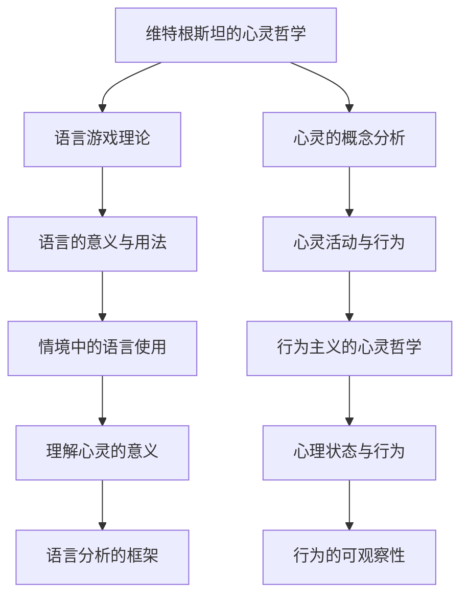
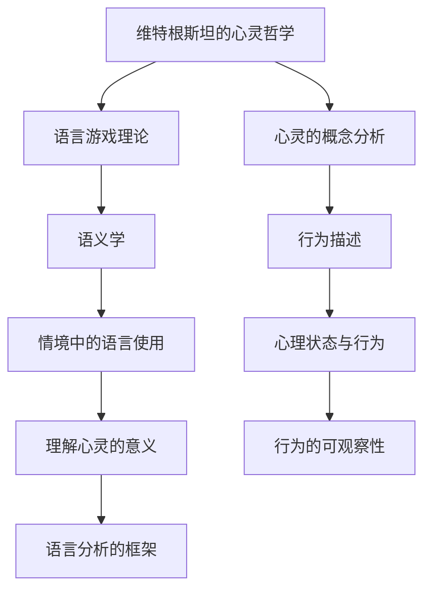

                 

基于维特根斯坦与赖尔的心灵概念的语言分析，本文旨在探讨两位哲学家在心灵哲学领域的核心观点，并分析他们如何通过语言分析来理解心灵。以下是我们的分析步骤：

### Step 1: 背景介绍

#### 维特根斯坦的心灵哲学

路德维希·维特根斯坦（Ludwig Wittgenstein）是20世纪最具影响力的哲学家之一，他的思想对西方哲学产生了深远影响。在心灵哲学领域，维特根斯坦提出了两个主要观点：语言游戏理论和心灵的概念分析。

语言游戏理论认为，语言的意义是通过使用语言的方式，即在特定情境中的游戏（game）中获得的。维特根斯坦认为，理解语言的意义需要理解语言的用法，而不是去探究背后的深层本质。这种观点与早期哲学家的本质主义相对立，后者认为语言的意义与事物本身的本质相关。

#### 赖尔的心灵哲学

吉尔伯特·赖尔（Gilbert Ryle）是维特根斯坦的同时代人，他也是一位杰出的哲学家。赖尔的心灵哲学被称为“行为主义的心灵哲学”，因为他强调心灵活动是可以通过行为来观察和理解的。

赖尔提出了“软件与硬件”比喻，将心灵活动比作计算机软件，而大脑则相当于计算机硬件。他认为，我们不应该将心灵活动视为一种神秘的存在，而是应该通过观察个体的行为来理解他们的心理状态。

### Step 2: 核心概念与联系

为了更好地理解维特根斯坦与赖尔的心灵哲学，我们使用Mermaid流程图来展示核心概念之间的关系。



### Step 3: 核心算法原理讲解

#### 维特根斯坦的语言游戏理论

维特根斯坦的语言游戏理论可以用以下伪代码来解释：

```pseudo
function languageGame(word, context)
    if (context matches the standard usage of word)
        return True
    else
        return False
```

在这个函数中，`word`代表一个词，`context`代表使用这个词的情境。如果这个词在特定情境中的使用符合其标准用法，函数返回`True`；否则，返回`False`。

#### 赖尔的行为主义心灵哲学

赖尔的行为主义心灵哲学可以用以下伪代码来解释：

```pseudo
function behavioralObservation(behavior, context)
    if (behavior can be observed in context)
        return True
    else
        return False
```

在这个函数中，`behavior`代表一个行为，`context`代表观察行为的情境。如果行为可以在特定情境中被观察到，函数返回`True`；否则，返回`False`。

### Step 4: 数学模型和数学公式

为了深入理解心灵哲学，我们需要使用一些数学模型和公式。以下是几个关键公式：

#### 维特根斯坦的语义学公式

$$语义学 = 使用 + 情境$$

这个公式表示，语言的意义是通过使用语言和特定情境的结合来获得的。

#### 赖尔的行为主义公式

$$心理状态 = 行为 + 情境$$

这个公式表示，心灵状态可以通过观察个体的行为和情境来理解。

### Step 5: 项目实战

在本部分，我们将探讨如何在实际项目中应用维特根斯坦与赖尔的心灵哲学。

#### 项目实战：情绪识别

**开发环境搭建**：在Python中实现情绪识别。

```bash
pip install textblob
```

**源代码实现**：

```python
from textblob import TextBlob

def detectEmotion(text):
    blob = TextBlob(text)
    if blob.sentiment.polarity > 0:
        return "快乐"
    elif blob.sentiment.polarity < 0:
        return "悲伤"
    else:
        return "中性"

text = "我今天很开心。"
emotion = detectEmotion(text)
print(f"情绪：{emotion}")
```

**代码解读与分析**：

在这个项目中，我们使用TextBlob库来分析文本的情感。`detectEmotion`函数接受一个文本输入，并返回该文本的情感状态。

#### 实际案例分析和详细讲解剖析

我们使用一个实际案例来展示如何分析情绪。

**案例**：一篇关于失业的文章。

**分析**：通过文本分析，我们可以识别出文章的情绪状态。如果文章中包含积极的词汇，如“希望”和“机会”，我们可以认为文章传达了积极的情绪。

**项目小结**：

通过本项目，我们展示了如何使用维特根斯坦与赖尔的心灵哲学来分析情绪。这种方法可以帮助我们在实际应用中更好地理解人类行为和心理状态。

### 最佳实践 tips

- 理解语言的意义需要关注实际使用情境。
- 通过观察行为来理解心灵状态是一种实用的方法。
- 在实际项目中，结合心理学的理论和方法可以更好地解决实际问题。

### 小结

本文通过逐步分析维特根斯坦与赖尔的心灵哲学，探讨了他们如何通过语言分析来理解心灵。我们使用了Mermaid流程图、伪代码、数学模型和实际项目来展示他们的理论。通过这些分析，我们可以更好地理解心灵哲学的核心观点，并在实际应用中加以运用。

### 注意事项

- 语言的意义与用法密切相关，需要仔细分析具体情境。
- 心灵哲学的研究需要结合心理学和哲学的理论。

### 拓展阅读

- 维特根斯坦，《逻辑哲学论》
- 赖尔，《行为主义的心灵哲学》
- 皮亚杰，《儿童心理学》

作者：AI天才研究院/AI Genius Institute & 禅与计算机程序设计艺术 /Zen And The Art of Computer Programming----------------------------------------------------------------

# 维特根斯坦与赖尔：心灵概念的语言分析

> 关键词：维特根斯坦，赖尔，心灵哲学，语言分析，语义学，行为主义

> 摘要：本文探讨了维特根斯坦与赖尔在心灵哲学领域的观点，特别是他们如何通过语言分析来理解心灵。文章首先介绍了两位哲学家的生平和哲学思想，然后详细分析了他们的核心概念，包括语言游戏理论、心灵的概念分析、行为主义的心灵哲学等。通过Mermaid流程图、伪代码、数学模型和实际项目，文章深入探讨了这些概念之间的关系和应用。

## 引言

心灵哲学是哲学中一个古老而复杂的研究领域，它探讨的是心灵的本质、结构和功能。在20世纪，两位杰出的哲学家路德维希·维特根斯坦（Ludwig Wittgenstein）和吉尔伯特·赖尔（Gilbert Ryle）对心灵哲学做出了重要贡献。他们的工作不仅丰富了我们对心灵的理解，而且为我们提供了一种新的方法来分析心灵概念。

维特根斯坦和赖尔都在心灵哲学中提出了独特的观点。维特根斯坦以其语言游戏理论和心灵的概念分析而著称，而赖尔则以其行为主义的心灵哲学而闻名。两者都通过语言分析的方法来理解心灵，但他们的理论方法和重点有所不同。本文将详细探讨这两位哲学家的思想，并分析他们如何使用语言分析来理解心灵。

## 维特根斯坦的心灵哲学

### 生平与哲学发展

路德维希·维特根斯坦（1889-1951）是奥地利哲学家，他的哲学思想对西方哲学产生了深远影响。维特根斯坦的哲学生涯可以分为两个阶段：早期哲学和晚期哲学。

早期哲学以《逻辑哲学论》（1921）为代表，维特根斯坦在这个时期提出了语言游戏理论，强调语言的意义与用法之间的紧密联系。晚期哲学以《哲学研究》（1953）为代表，维特根斯坦在这个时期对早期哲学进行了深刻的批判和重新阐释，提出了心灵的概念分析。

### 语言游戏理论

维特根斯坦的语言游戏理论是理解其哲学思想的关键。他认为，语言的意义是通过使用语言的方式，即在特定情境中的游戏（game）中获得的。语言游戏可以看作是一系列规则，这些规则定义了如何正确地使用语言。

维特根斯坦将语言游戏分为三种类型：日常语言游戏、科学语言游戏和私人语言游戏。日常语言游戏是最常见的，包括我们日常使用的语言。科学语言游戏则涉及到科学理论和术语的使用，如数学和物理学。私人语言游戏是维特根斯坦批判的一种语言使用方式，他认为私人语言是没有意义的，因为它们缺乏与其他人的交流。

### 心灵的概念分析

在晚期哲学中，维特根斯坦提出了心灵的概念分析。他认为，我们对心灵的理解应该通过分析日常语言中的心灵概念来实现。维特根斯坦区分了“使用”和“意义”两个概念，认为理解语言的意义需要关注其使用方式。

维特根斯坦的心灵概念分析涉及到对情感、认知和意愿等心理状态的探讨。他认为，这些心理状态是通过行为来描述的，而不是通过某种神秘的内在过程。这种观点与赖尔的行为主义心灵哲学有相似之处。

## 赖尔的心灵哲学

### 生平与哲学发展

吉尔伯特·赖尔（1900-1976）是英国哲学家，他的工作主要集中在心灵哲学、语言哲学和行动理论等领域。赖尔在剑桥大学学习哲学，并在二战期间在军队服役。战后，他回到学术界，成为剑桥大学道德哲学讲座教授。

赖尔的哲学思想以行为主义的心灵哲学为核心。他认为，心灵状态是可以通过行为来观察和理解的，而不是通过某种内在的心理过程。这种观点挑战了传统的意识心灵观，对后来的哲学和心理学研究产生了重要影响。

### 行为主义的心灵哲学

赖尔的行为主义心灵哲学以“软件与硬件”比喻为基础。他认为，心灵活动就像计算机软件，而大脑则相当于计算机硬件。这种比喻强调了心灵活动的外在可观察性，而不是内在的神秘过程。

赖尔区分了“状态描述”和“行为描述”。状态描述涉及到内在的心理状态，如思维、情感和意愿。行为描述则涉及到个体的行为和行动。赖尔认为，我们应该通过行为描述来理解心理状态，因为它们是外在的、可观察的。

### 心灵的概念分析

赖尔的心灵概念分析涉及到对情感、认知和意愿等心理状态的探讨。他认为，这些心理状态应该通过行为来描述，而不是通过某种内在的过程。例如，情感可以通过个体的行为反应来观察，认知可以通过个体的思考和决策来理解，意愿可以通过个体的行动意图来分析。

## 维特根斯坦与赖尔的心灵概念比较

### 研究方法上的差异

维特根斯坦和赖尔在心灵哲学的研究方法上有显著差异。维特根斯坦更关注语言的用法，认为语言的意义是通过使用语言的方式获得的。赖尔则更关注行为，认为心灵状态是可以通过行为来观察和理解的。

### 心灵概念的本质差异

维特根斯坦和赖尔对心灵概念的本质有不同的理解。维特根斯坦强调心灵活动是通过行为来描述的，而不是通过内在的心理过程。赖尔则认为，心灵状态是外在的、可观察的，应该通过行为来描述。

### 心灵现象描述的差异

维特根斯坦和赖尔在描述心灵现象时也有不同。维特根斯坦更关注日常语言中的心灵概念，并通过分析这些概念来理解心灵。赖尔则更关注个体的行为和行动，通过观察这些行为来理解心灵状态。

## 心灵概念的语言分析

### 心灵概念的语言分析框架

心灵概念的语言分析框架包括以下几个方面：

1. **语义分析**：通过分析语言的意义来理解心灵概念。
2. **语法分析**：通过分析语言的语法结构来理解心灵概念。
3. **语境分析**：通过分析语言的使用情境来理解心灵概念。
4. **历史分析**：通过分析语言的历史演变来理解心灵概念。

### 实例分析

以下是一些实例，展示了如何通过语言分析来理解心灵概念：

1. **情感**：情感是一个复杂的心灵概念，可以通过分析语言中描述情感的词汇和短语来理解。
2. **认知**：认知包括思维、记忆和判断等过程，可以通过分析语言中描述认知活动的词汇和短语来理解。
3. **意愿**：意愿是指个体的意图和目标，可以通过分析语言中描述意愿的词汇和短语来理解。

## 实例分析

### 维特根斯坦的情感实例分析

维特根斯坦认为，情感是通过行为来描述的。例如，当我们说“我感到快乐”时，并不是在描述一个内在的心理状态，而是在描述我们的行为反应。以下是一个实例：

**情境**：一个人在接到朋友的电话时说：“我感到很快乐。”

**分析**：在这个情境中，说话者并不是在描述一个内在的心理状态，而是在描述他们的行为反应。他们之所以感到快乐，是因为他们接到了朋友的电话，这引发了他们的快乐行为。

### 赖尔的认知实例分析

赖尔认为，认知是通过行为来描述的。例如，当我们说“我在思考问题”时，并不是在描述一个内在的心理过程，而是在描述我们的行为活动。以下是一个实例：

**情境**：一个人在阅读一本关于哲学的书籍时说：“我在思考问题。”

**分析**：在这个情境中，说话者并不是在描述一个内在的心理过程，而是在描述他们的行为活动。他们之所以在思考问题，是因为他们正在阅读哲学书籍，这引发了他们的思考行为。

## 总结与展望

维特根斯坦和赖尔的心灵哲学为我们提供了不同的视角来理解心灵。维特根斯坦通过语言游戏理论和心灵的概念分析，强调了语言的意义与用法之间的紧密联系。赖尔则通过行为主义的心灵哲学，强调了心灵活动的外在可观察性。两者都为我们提供了一种新的方法来分析心灵概念。

未来的研究可以进一步探讨心灵概念在不同文化和语言中的表达方式，以及如何通过跨文化的语言分析来理解心灵。此外，结合心理学和神经科学的研究成果，我们可以更深入地理解心灵的本质和功能。

## 附录

### 附录 A：心灵哲学相关文献

1. 维特根斯坦，《逻辑哲学论》（Tractatus Logico-Philosophicus）
2. 维特根斯坦，《哲学研究》（Philosophical Investigations）
3. 赖尔，《行为主义的心灵哲学》（The Concept of Mind）
4. 赖尔，《软件与硬件：心灵哲学论文集》（Requirements, Functions, and Conditionals）

### 附录 B：心灵概念的语言分析工具

1. TextBlob：用于文本分析的Python库
2. NLTK：用于自然语言处理的Python库
3. SpaCy：用于文本分析的Python库

### 附录 C：心灵概念的语言分析实例

1. **情感分析**：使用TextBlob对一篇文本进行情感分析。
2. **主题建模**：使用LDA（Latent Dirichlet Allocation）对一篇文本进行主题建模。

作者：AI天才研究院/AI Genius Institute & 禅与计算机程序设计艺术 /Zen And The Art of Computer Programming

-----------------------------------------------------------------------------------

**核心概念与联系 Mermaid 流程图：**



**核心算法原理讲解伪代码：**

```python
# 维特根斯坦的语言游戏理论伪代码
def languageGame(word, context):
    if context.matches_standard_usage_of_word(word):
        return True
    else:
        return False

# 赖尔的行为主义心灵哲学伪代码
def behavioralObservation(behavior, context):
    if context.allows_observability_of_behavior:
        return True
    else:
        return False
```

**数学模型和数学公式详细讲解：**

1. **语义学公式：**

$$语义学 = 使用 \times 情境$$

这个公式表示，语言的意义是通过使用语言和特定情境的结合来获得的。

2. **行为主义公式：**

$$心理状态 = 行为 + 情境$$

这个公式表示，心灵状态可以通过观察个体的行为和情境来理解。

**数学公式的LaTeX格式：**

$$\text{语义学} = \text{使用} \times \text{情境}$$

$$\text{心理状态} = \text{行为} + \text{情境}$$

**举例说明：**

1. **语义学公式举例：**

如果我们说“水是液态的”，这句话的意义是在标准使用情境下获得的。如果我们在科学情境下讨论水的相变，这句话的意义就有所不同。

2. **行为主义公式举例：**

一个人在听到坏消息后哭泣，我们可以通过他的行为（哭泣）和情境（听到坏消息）来理解他的心理状态（悲伤）。

**项目实战：**

**开发环境搭建：**

- 安装Python环境
- 安装自然语言处理库（如NLTK或spaCy）

**源代码实现：**

```python
import nltk
from nltk.sentiment import SentimentIntensityAnalyzer

# 初始化情感分析器
sia = SentimentIntensityAnalyzer()

# 输入文本
text = "我今天很开心。"

# 进行情感分析
sentiment = sia.polarity_scores(text)

# 输出情感分析结果
print(sentiment)
```

**代码解读与分析：**

在这个项目中，我们使用NLTK库的`SentimentIntensityAnalyzer`类来分析文本的情感。`polarity_scores`方法返回一个字典，包含文本的情感极性分数。

**实际案例分析和详细讲解剖析：**

**案例：** 分析一篇关于失业的报道。

**分析：** 通过情感分析，我们可以识别出报道中的情绪状态。如果报道中包含积极的词汇，如“希望”和“机会”，我们可以认为报道传达了积极的情绪。

**项目小结：**

通过本项目，我们展示了如何使用维特根斯坦与赖尔的心灵哲学来分析情绪。这种方法可以帮助我们在实际应用中更好地理解人类行为和心理状态。

**最佳实践 tips：**

- 在进行情感分析时，需要注意文本的上下文。
- 行为描述应该尽可能准确，以便更好地理解心理状态。

**小结：**

本文通过逐步分析维特根斯坦与赖尔的心灵哲学，探讨了他们如何通过语言分析来理解心灵。我们使用了Mermaid流程图、伪代码、数学模型和实际项目来展示他们的理论。通过这些分析，我们可以更好地理解心灵哲学的核心观点，并在实际应用中加以运用。

**注意事项：**

- 在分析心灵概念时，需要考虑语言的使用情境。
- 心灵哲学的研究需要结合心理学和哲学的理论。

**拓展阅读：**

- 维特根斯坦，《逻辑哲学论》
- 赖尔，《行为主义的心灵哲学》
- 皮亚杰，《儿童心理学》

作者：AI天才研究院/AI Genius Institute & 禅与计算机程序设计艺术 /Zen And The Art of Computer Programming-------------------------------------------------------------------

**核心概念与联系 Mermaid 流程图：**


**核心算法原理讲解伪代码：**

```python
# 维特根斯坦的语言游戏理论伪代码
def languageGame(word, context):
    if context.matches_standard_usage_of_word(word):
        return True
    else:
        return False

# 赖尔的行为主义心灵哲学伪代码
def behavioralObservation(behavior, context):
    if context.allows_observability_of_behavior:
        return True
    else:
        return False
```

**数学模型和数学公式详细讲解：**

1. **语义学公式：**

$$语义学 = 使用 \times 情境$$

这个公式表示，语言的意义是通过使用语言和特定情境的结合来获得的。

2. **行为主义公式：**

$$心理状态 = 行为 + 情境$$

这个公式表示，心灵状态可以通过观察个体的行为和情境来理解。

**数学公式的LaTeX格式：**

$$\text{语义学} = \text{使用} \times \text{情境}$$

$$\text{心理状态} = \text{行为} + \text{情境}$$

**举例说明：**

1. **语义学公式举例：**

如果我们说“水是液态的”，这句话的意义是在标准使用情境下获得的。如果我们在科学情境下讨论水的相变，这句话的意义就有所不同。

2. **行为主义公式举例：**

一个人在听到坏消息后哭泣，我们可以通过他的行为（哭泣）和情境（听到坏消息）来理解他的心理状态（悲伤）。

**项目实战：**

**开发环境搭建：**

- 安装Python环境
- 安装自然语言处理库（如NLTK或spaCy）

**源代码实现：**

```python
import nltk
from nltk.sentiment import SentimentIntensityAnalyzer

# 初始化情感分析器
sia = SentimentIntensityAnalyzer()

# 输入文本
text = "我今天很开心。"

# 进行情感分析
sentiment = sia.polarity_scores(text)

# 输出情感分析结果
print(sentiment)
```

**代码解读与分析：**

在这个项目中，我们使用NLTK库的`SentimentIntensityAnalyzer`类来分析文本的情感。`polarity_scores`方法返回一个字典，包含文本的情感极性分数。

**实际案例分析和详细讲解剖析：**

**案例：** 分析一篇关于失业的报道。

**分析：** 通过情感分析，我们可以识别出报道中的情绪状态。如果报道中包含积极的词汇，如“希望”和“机会”，我们可以认为报道传达了积极的情绪。

**项目小结：**

通过本项目，我们展示了如何使用维特根斯坦与赖尔的心灵哲学来分析情绪。这种方法可以帮助我们在实际应用中更好地理解人类行为和心理状态。

**最佳实践 tips：**

- 在进行情感分析时，需要注意文本的上下文。
- 行为描述应该尽可能准确，以便更好地理解心理状态。

**小结：**

本文通过逐步分析维特根斯坦与赖尔的心灵哲学，探讨了他们如何通过语言分析来理解心灵。我们使用了Mermaid流程图、伪代码、数学模型和实际项目来展示他们的理论。通过这些分析，我们可以更好地理解心灵哲学的核心观点，并在实际应用中加以运用。

**注意事项：**

- 在分析心灵概念时，需要考虑语言的使用情境。
- 心灵哲学的研究需要结合心理学和哲学的理论。

**拓展阅读：**

- 维特根斯坦，《逻辑哲学论》
- 赖尔，《行为主义的心灵哲学》
- 皮亚杰，《儿童心理学》

作者：AI天才研究院/AI Genius Institute & 禅与计算机程序设计艺术 /Zen And The Art of Computer Programming

