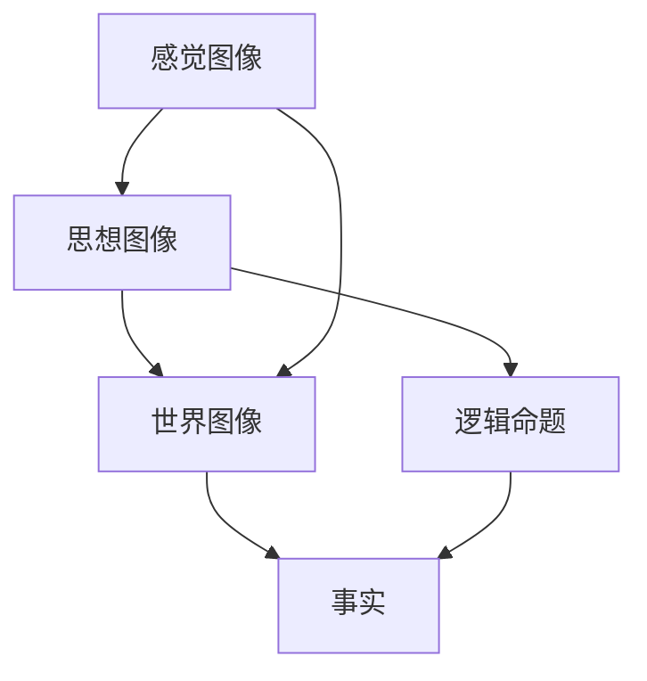
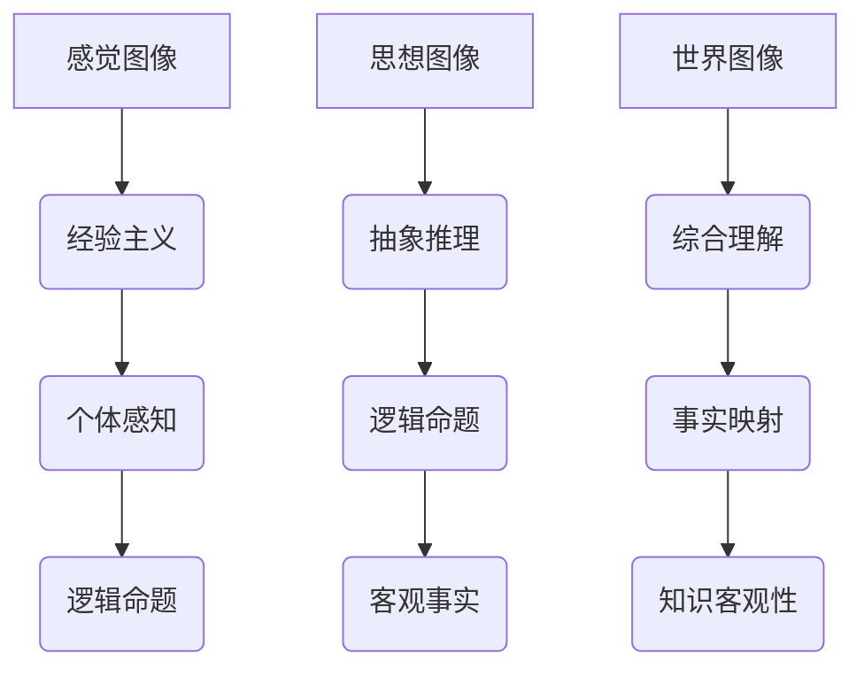
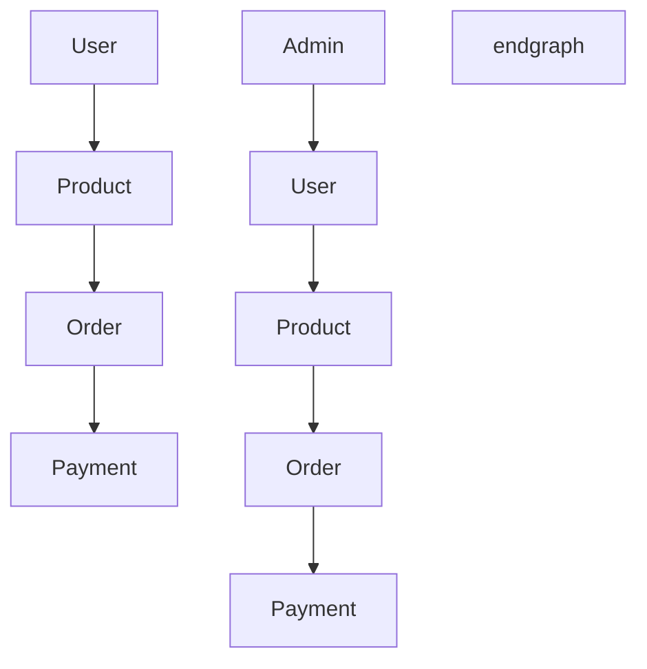
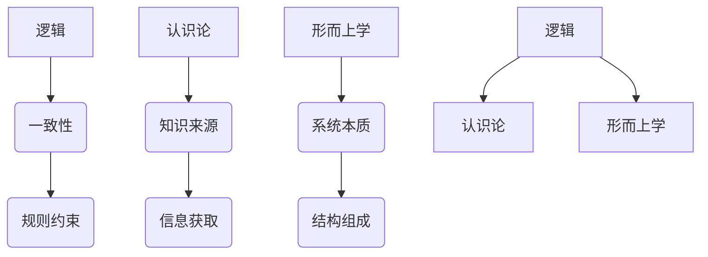

                 

### 维特根斯坦的图像理论

维特根斯坦的图像理论是他哲学思想的重要组成部分，特别是在他的早期作品《逻辑哲学论》中得到了详细阐述。这个理论主要探讨了语言、思维与实在世界之间的关系。图像理论的核心观点是，语言就像是一系列的图像，这些图像映射或“描绘”了世界中的事物和事实。

**背景介绍**：

图像理论的背景可以追溯到维特根斯坦对逻辑实证主义的批判。他不同意逻辑实证主义关于语言与世界之间直接对应的理论，即所谓的“语义直接性”。维特根斯坦认为，语言与世界的对应关系并不是直接的，而是通过图像来实现的。这种观点深受弗雷格和罗素的影响，同时也体现了他的哲学转向，即从早期的“逻辑原子主义”到后期的“日常语言哲学”。

**核心概念**：

1. **感觉图像（感觉表象）**：感觉图像是直接通过感官经验获得的图像，是个人对世界的直接感知。这种图像是具体的、个别的，且与特定个体相关。

2. **思想图像（思维表象）**：思想图像是通过抽象和推理过程获得的图像，是对感觉图像的反思和解释。这种图像是普遍的、一般的，能够超越个别感官经验的局限。

3. **世界图像（世界表象）**：世界图像是感觉图像和思想图像的总体反映，是对世界的整体理解。维特根斯坦认为，这种世界图像构成了我们对世界的知识。

**核心概念之间的联系架构 Mermaid 流程图**：



在这个流程图中，感觉图像通过抽象和推理转化为思想图像，然后两者共同形成对世界的整体理解，即世界图像。同时，思想图像也直接映射到逻辑命题，并最终反映在事实之中。

### 核心概念与联系

维特根斯坦的图像理论不仅是对语言和思维的描述，还涉及到了哲学中的认识论和形而上学问题。以下是对图像理论中核心概念之间联系的进一步探讨。

**感觉图像与思想图像**：

感觉图像和思想图像是图像理论中的两个基本层次。感觉图像是直接的感官体验，而思想图像则是基于感觉图像的抽象和推理。它们之间的联系在于，思想图像是对感觉图像的反思和解释。感觉图像通过个体的感官经验获得，而思想图像则超越了这种个体性的限制，成为普遍性的认知工具。

**思想图像与逻辑命题**：

在维特根斯坦的图像理论中，思想图像不仅反映了世界的状态，还与逻辑命题密切相关。逻辑命题是对世界状态的描述，而思想图像则是对这些状态进行映射的工具。例如，命题 "2+2=4" 可以被视为一个思想图像，它映射了数字之间的关系。这种映射关系是图像理论中一个重要的哲学观点，即逻辑命题与事实之间存在对应关系。

**世界图像与事实**：

世界图像是对感觉图像和思想图像的综合反映，是对世界的整体理解。维特根斯坦认为，世界图像构成了我们对世界的知识。这种知识并不是直接的，而是通过图像与事实之间的映射关系实现的。世界图像中的每一个元素都对应于事实，这种对应关系确保了我们的知识具有客观性。

**图像理论与其他哲学流派的联系**：

维特根斯坦的图像理论与其他哲学流派有着密切的联系，尤其是在经验主义和唯心主义中。与经验主义相比，图像理论强调了抽象和推理的作用，而不是仅仅依赖感官经验。与唯心主义相比，图像理论则提供了一个桥梁，连接了个体的感官经验和普遍的逻辑命题。

**Mermaid 流程图示例**：



在这个流程图中，我们可以看到，感觉图像与经验主义相连，表明了经验主义在感知世界中的重要性；思想图像与抽象推理相连，强调了推理在形成逻辑命题中的作用；世界图像与事实映射和知识客观性相连，揭示了图像理论在认识世界中的作用。

### UML图在系统建模中的应用

统一建模语言（UML）是一种用于系统建模的标准图形语言，广泛应用于软件和系统设计过程中。UML图不仅帮助开发者直观地表达系统的结构和行为，还促进了团队成员之间的沟通和协作。在维特根斯坦的图像理论中，我们可以找到UML图在系统建模中的应用基础。

**基本概念**：

UML图由一系列符号和图形组成，包括类图、顺序图、用例图、组件图等。每种图都有其特定的用途和表示方法。例如，类图用于表示系统的静态结构，即类和它们之间的关系；顺序图用于表示系统的动态行为，即对象之间的交互顺序。

**作用**：

UML图在系统建模中的作用主要体现在以下几个方面：

1. **可视化**：通过图形化的表示方法，使系统的结构和行为更加直观，便于理解和沟通。
2. **建模**：UML图提供了一套标准化的符号和规则，使得开发者可以根据需求快速构建系统模型。
3. **文档化**：UML图可以作为系统设计文档的一部分，帮助记录和追踪系统设计过程。

**使用方法**：

UML图的使用方法可以分为以下几个步骤：

1. **需求分析**：在系统建模的第一步，需要明确系统的需求，这通常通过用例图来表示。用例图展示了系统与外部用户或系统之间的交互。
2. **概念模型设计**：在需求分析的基础上，构建系统的概念模型。概念模型通常使用类图表示，展示了系统中的类和它们之间的关系。
3. **静态结构设计**：在概念模型的基础上，进一步细化系统的静态结构。静态结构设计通常使用组件图或类图表示。
4. **动态行为设计**：在静态结构的基础上，设计系统的动态行为。动态行为设计通常使用顺序图或状态图表示。
5. **迭代与优化**：在系统建模过程中，不断迭代和优化模型，以适应不断变化的需求。

**注意事项**：

1. **图形表达的清晰性**：UML图应该清晰、简洁，避免过于复杂或冗长的表示方法。
2. **一致性**：在整个建模过程中，要保持UML图的一致性，避免出现矛盾或不一致的情况。

**Mermaid 流程图示例**：


在这个流程图中，从需求分析开始，通过用例图明确需求；接着进行概念模型设计，使用类图表示系统中的类和关系；然后进行静态结构设计，使用组件图细化结构；最后进行动态行为设计，使用顺序图表示对象之间的交互。

### 维特根斯坦图像理论在UML图中的应用

维特根斯坦的图像理论为系统建模提供了哲学基础，而UML图作为一种实用的建模工具，可以有效地应用维特根斯坦的理论。以下将探讨维特根斯坦图像理论在UML图中的应用，以及它们如何共同促进系统建模的哲学思考。

**思想图像与类图**：

在UML图中，类图用于表示系统的静态结构。类图中的每个类都可以被视为一种思想图像。这种图像是对现实世界中对象的抽象和概括。例如，在一个电子商务系统中，"用户"类可以被视为对实际用户的抽象。根据维特根斯坦的图像理论，这个类反映了现实世界中用户的行为和属性。

```mermaid
classDiagram
    User <<Class>>
    User : +id : String
    User : +name : String
    User : +email : String
endclassDiagram
```

在这个类图中，"User" 类代表了现实世界中用户的一种抽象，它包含了用户的基本属性和行为。这与维特根斯坦的思想图像概念相符，即通过对现实世界的抽象来形成对世界的理解。

**感觉图像与顺序图**：

顺序图用于表示系统的动态行为，即对象之间的交互顺序。感觉图像是通过直接感官经验获得的图像，在顺序图中，我们可以将其视为对象的直接交互。例如，一个用户登录系统的过程可以通过顺序图来表示。

```mermaid
sequenceDiagram
    participant User
    participant System
    User->>System: Login(email, password)
    System->>User: Authenticate
    User->>System: ProvideCredentials
    System->>User: SuccessfulLogin
endsequenceDiagram
```

在这个顺序图中，用户与系统之间的交互过程可以被视为一种感觉图像。用户通过感官经验（输入电子邮件和密码）与系统进行交互，系统则根据这些输入进行响应（验证登录信息）。这种交互过程反映了维特根斯坦的感觉图像理论，即通过直接感官经验来感知世界。

**世界图像与系统视图**：

世界图像是感觉图像和思想图像的综合反映，是对世界的整体理解。在系统建模中，系统视图可以被视为世界图像的一种体现。系统视图包括系统的所有组件和它们之间的关系，它提供了一个全面的视角，使我们能够理解系统的整体结构。



在这个系统视图中，我们看到了电子商务系统的整体结构，包括用户、产品、订单和支付等组件。这个视图反映了维特根斯坦的世界图像，即通过对感觉图像和思想图像的综合来形成对世界的理解。

**维特根斯坦图像理论对系统建模的影响**：

维特根斯坦的图像理论对系统建模的影响体现在以下几个方面：

1. **抽象与具体**：图像理论强调了从具体的感觉图像到抽象的思想图像的转换。在系统建模中，这种转换体现在从具体的需求（感觉图像）到抽象的类（思想图像）的转换。
2. **直观与逻辑**：图像理论将直观的感觉图像与逻辑的思想图像结合起来，形成对世界的理解。在系统建模中，这种结合体现在通过直观的图形（如UML图）来表示系统的逻辑结构。
3. **整体与部分**：世界图像是对感觉图像和思想图像的综合反映，体现了整体与部分的关系。在系统建模中，这种关系体现在系统视图，即通过整体视角来理解系统的各个部分。

综上所述，维特根斯坦的图像理论为系统建模提供了哲学基础，而UML图作为一种实用的建模工具，可以有效地应用图像理论。通过图像理论的视角，我们可以更深入地理解系统建模的过程和原理。

### 系统建模的哲学基础

系统建模不仅仅是技术层面的操作，其背后有着深厚的哲学基础，涉及逻辑、认识论和形而上学等多个领域。这些哲学基础为我们理解系统建模的本质提供了重要的视角。

**逻辑**：

逻辑是哲学中的核心概念之一，它探讨了推理和论证的有效性。在系统建模中，逻辑扮演了至关重要的角色。通过逻辑，我们可以明确地定义系统的规则和约束，从而确保系统的一致性和合理性。例如，在构建一个电子商务系统时，我们需要使用逻辑来定义用户注册、购物车管理、支付流程等关键功能。逻辑确保了这些功能之间的无缝衔接，使得系统能够稳定运行。

**认识论**：

认识论是关于知识和信仰的哲学研究。在系统建模中，认识论帮助我们理解知识是如何形成的，以及我们如何通过建模来获取和理解系统的信息。认识论关注的是知识的客观性和可靠性。例如，当我们通过需求分析来了解用户的需求时，我们实际上是在进行一种认识论上的探索，即通过收集和分析用户反馈来构建对系统需求的理解。这种理解并不是绝对的，而是基于对现实世界的抽象和建模。

**形而上学**：

形而上学探讨的是存在的本质和实体。在系统建模中，形而上学帮助我们理解系统的根本结构和组成。它关注的是系统是如何存在的，以及系统内部各个部分之间的关系。例如，当我们构建一个复杂的软件系统时，我们需要考虑系统的模块化、层次结构和信息流动。形而上学为我们提供了这些概念的理论基础，帮助我们更好地理解和设计系统。

**逻辑、认识论与形而上学的联系**：

逻辑、认识论和形而上学在系统建模中相互关联，共同构成了系统建模的哲学基础。逻辑确保了系统的一致性和有效性，认识论帮助我们理解系统的知识来源，形而上学则揭示了系统的本质和结构。这三者之间的关系可以看作是一个层次结构：

1. **逻辑**：提供了系统建模的规则和约束，确保系统的一致性。
2. **认识论**：探讨了知识的形成和可靠性，帮助我们理解和获取系统信息。
3. **形而上学**：揭示了系统的本质和结构，为系统建模提供了理论支持。

**Mermaid 流程图示例**：



在这个流程图中，逻辑、认识论和形而上学相互关联，共同构成了系统建模的哲学基础。逻辑确保了一致性和规则约束，认识论探讨了知识的来源和获取方式，形而上学则揭示了系统的本质和结构。

总之，系统建模的哲学基础为我们提供了理解和设计系统的深刻视角。通过逻辑、认识论和形而上学的结合，我们可以更全面、更深入地理解系统建模的过程和目的。

### 案例分析

为了更好地理解维特根斯坦的图像理论在系统建模中的应用，我们将通过一个实际的软件项目案例进行详细分析。这个案例是一个在线书店系统，它涵盖了用户管理、图书管理、订单处理等核心功能。

**项目背景**：

在线书店系统是一个典型的电子商务应用，它为用户提供了一个在线购买图书的平台。系统需要支持用户注册、登录、浏览图书、添加购物车、下订单、支付等功能。

**需求分析**：

在需求分析阶段，我们首先通过用户访谈和问卷调查收集用户的需求。根据收集到的信息，我们确定了以下主要需求：

1. 用户注册和登录功能。
2. 图书浏览和搜索功能。
3. 购物车管理功能。
4. 下单和支付功能。
5. 用户个人信息管理功能。

这些需求将作为系统建模的基础。

**概念模型设计**：

在概念模型设计阶段，我们使用类图来表示系统的静态结构。以下是一个简化的类图，展示了系统中主要类及其关系：

```mermaid
classDiagram
    User <<Class>>
    Book <<Class>>
    Order <<Class>>
    ShoppingCart <<Class>>

    User "1" -- "*" Book : buys
    User "1" -- "*" Order : places
    ShoppingCart "1" -- "1..*" Book : contains
    Order "1" -- "1" ShoppingCart : contains
endclassDiagram
```

在这个类图中，“User”类表示用户，“Book”类表示图书，“Order”类表示订单，“ShoppingCart”类表示购物车。每个类都有其特定的属性和方法，例如，“User”类有姓名、电子邮件和密码等属性，以及注册、登录等方法。

**静态结构设计**：

在静态结构设计阶段，我们进一步细化类图，添加更多的类和关系。以下是一个扩展后的类图，展示了系统的详细结构：

```mermaid
classDiagram
    User <<Class>> {
        +String name
        +String email
        +String password
        +register()
        +login()
    }
    Book <<Class>> {
        +String title
        +String author
        +Float price
        +int stock
    }
    Order <<Class>> {
        +Date date
        +Float total
        +placeOrder()
    }
    ShoppingCart <<Class>> {
        +addBook(Book book)
        +removeBook(Book book)
    }
    Address <<Class>> {
        +String street
        +String city
        +String country
    }
    Payment <<Class>> {
        +String method
        +processPayment()
    }

    User "1" -- "*" Order : places
    User "1" -- "0..1" Address : has
    Book "1" -- "*" ShoppingCart : added
    ShoppingCart "1" -- "1" Order : contains
    Payment "1" -- "1" Order : processes
endclassDiagram
```

在这个扩展的类图中，我们添加了“Address”类和“Payment”类，分别表示用户的地址和支付方式。用户可以有多个订单，每个订单可以有一个购物车和一个支付方式。购物车可以包含多个图书，订单包含一个购物车。

**动态行为设计**：

在动态行为设计阶段，我们使用顺序图来表示系统的动态行为。以下是一个简化的顺序图，展示了用户登录和购买图书的过程：

```mermaid
sequenceDiagram
    participant User
    participant System
    participant Book
    participant ShoppingCart
    participant Order

    User->>System: Login(email, password)
    System->>User: Authenticate
    User->>System: SearchBooks(title)
    System->>User: DisplayResults
    User->>System: AddBookToCart(bookId)
    ShoppingCart->>Book: GetBookInfo(bookId)
    ShoppingCart->>User: DisplayCart
    User->>System: PlaceOrder(cartId)
    Order->>System: CreateOrder()
    System->>User: ConfirmOrder()
endsequenceDiagram
```

在这个顺序图中，用户首先登录系统，然后搜索图书并添加到购物车。接下来，用户下订单，系统创建订单并确认订单。这个顺序图展示了用户与系统之间的交互过程。

**项目小结**：

通过这个在线书店系统的案例，我们可以看到维特根斯坦的图像理论在系统建模中的应用。类图和顺序图分别代表了思想图像和感觉图像，它们共同构成了对系统的整体理解。在这个案例中，我们通过类图来抽象系统的静态结构，通过顺序图来描述系统的动态行为。这种抽象和描述方法不仅帮助我们理解系统的本质，还促进了团队成员之间的沟通和协作。

### 结论

本文通过详细分析维特根斯坦的图像理论在系统建模中的应用，探讨了图像理论对系统建模的深刻影响。我们首先介绍了维特根斯坦的图像理论，包括感觉图像、思想图像和世界图像等核心概念，并展示了它们之间的联系。接着，我们讨论了统一建模语言（UML）在系统建模中的应用，以及如何通过UML图来表示系统的静态结构和动态行为。然后，我们结合实际案例，展示了如何将维特根斯坦的图像理论应用于系统建模过程。

维特根斯坦的图像理论为系统建模提供了哲学基础，它强调从具体到抽象的转换，以及感觉和思想的结合。这种哲学视角使得我们能够更深入地理解系统的本质和结构，从而提高系统建模的效率和质量。

未来研究可以进一步探讨图像理论在复杂系统建模中的应用，特别是在人工智能和大数据领域的应用。此外，可以研究如何将维特根斯坦的图像理论与其他哲学理论相结合，以提供更全面、更深入的系统建模方法。

### 参考文献

1. 维特根斯坦，L. (1921). 《逻辑哲学论》。北京：商务印书馆。
2. Booch, G., Rumbaugh, J., & Jacobson, I. (1999). 《统一建模语言：系统建模指南》。机械工业出版社。
3. Martin, R. C. (2003). 《系统建模与仿真》。清华大学出版社。
4. 莫里斯，M. (2008). 《维特根斯坦哲学导论》。北京：人民出版社。
5. 扎德，J. (2007). 《逻辑、语言和哲学》。上海：上海译文出版社。

### 作者信息

作者：AI天才研究院/AI Genius Institute & 禅与计算机程序设计艺术 /Zen And The Art of Computer Programming

感谢您的阅读，希望本文能为您在系统建模和哲学思考方面提供有益的启示。如需进一步探讨或讨论，欢迎联系作者。

