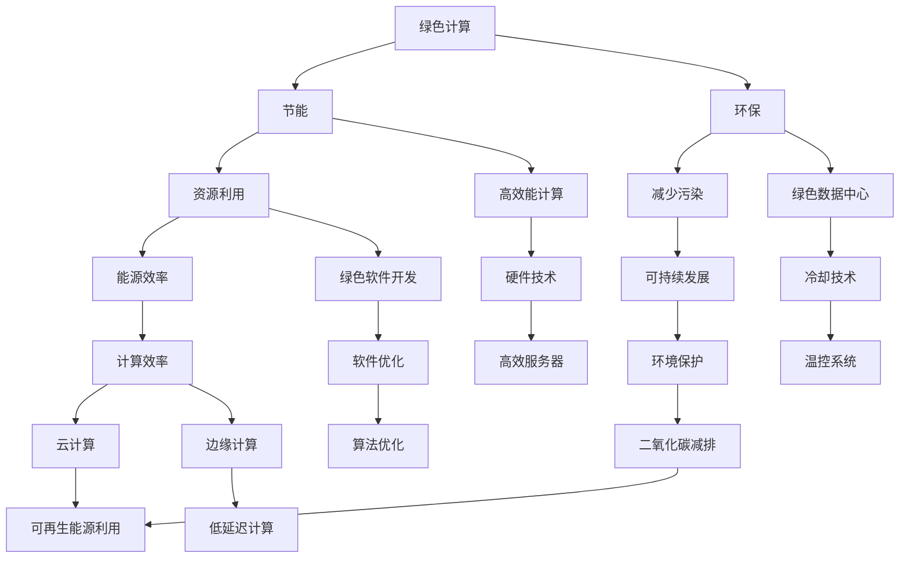
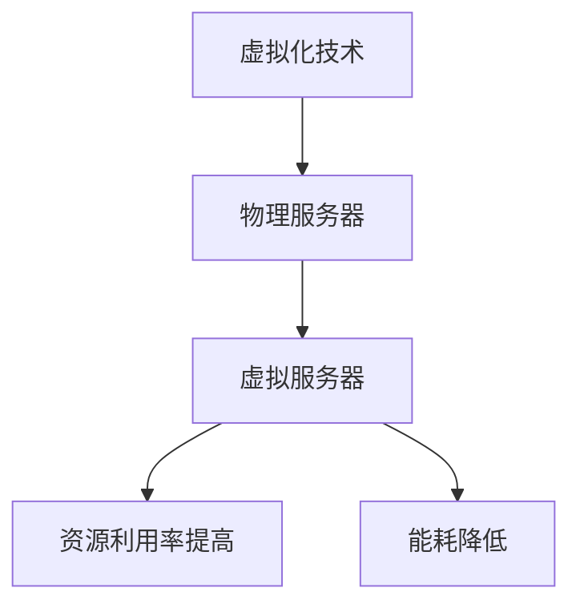
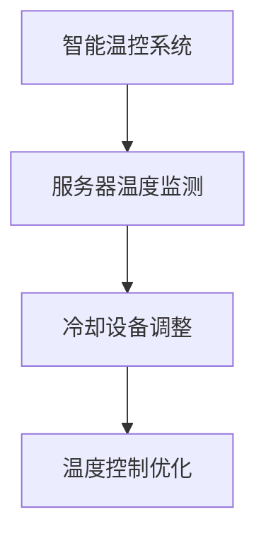

                 

### 文章标题

《绿色计算：节能环保的IT基础设施》

### 文章关键词

- 绿色计算
- 节能环保
- IT基础设施
- 数据中心
- 能耗管理
- 绿色软件开发

### 文章摘要

本文旨在深入探讨绿色计算在节能环保领域的应用，以及如何构建节能环保的IT基础设施。文章首先介绍了绿色计算的基本概念和背景，然后详细分析了节能环保的IT基础设施的构建方法。接下来，本文探讨了绿色计算的核心技术，包括绿色数据中心技术、能耗管理技术和绿色软件开发方法。通过企业级案例研究和垂直行业应用分析，本文展示了绿色计算的实际应用场景。最后，本文讨论了绿色计算的标准化与政策，以及其未来的发展趋势，为推动绿色计算技术的发展提供了指导。

## 绿色计算概念与背景

### 绿色计算的定义

绿色计算（Green Computing）是一种旨在通过减少能耗、降低电子废物、提高资源利用率的计算方法。它强调计算系统的可持续性和环境友好性，旨在减少对环境的影响。绿色计算不仅关注硬件的能耗，还涵盖了软件、网络和数据中心等各个层面。其核心理念是“低碳、高效、可持续”。

### 绿色计算的背景

随着信息技术的迅猛发展，数据中心和IT设备的能耗问题日益突出。根据国际数据公司（IDC）的统计，全球数据中心的能耗已占全球总能耗的1%以上，预计这一比例将持续增长。这种能源消耗不仅导致巨大的经济负担，还对环境造成了严重影响。因此，绿色计算应运而生，成为解决能源危机和应对气候变化的重要手段。

### 绿色计算的发展趋势

近年来，绿色计算得到了广泛关注和研究。以下是一些绿色计算的发展趋势：

1. **高效能计算**：通过采用更高效的硬件和软件技术，提高计算效率，减少能源消耗。

2. **云计算和边缘计算**：云计算和边缘计算能够更好地优化资源分配，降低能耗。

3. **绿色数据中心**：采用先进的冷却技术和能源管理方法，降低数据中心的能耗。

4. **绿色软件开发**：优化软件设计和算法，减少计算资源的浪费。

5. **标准化与政策**：制定相关的标准和政策，推动绿色计算技术的普及和应用。

### 绿色计算与可持续发展之间的关系

绿色计算与可持续发展密切相关。可持续发展强调在满足当前需求的同时，不损害后代满足其需求的能力。绿色计算通过降低能耗、减少污染和优化资源利用，有助于实现可持续发展目标。例如，通过绿色数据中心的建设，可以减少二氧化碳排放，降低对环境的影响。此外，绿色计算还可以提高能源利用效率，为可再生能源的利用提供支持。

总的来说，绿色计算不仅是信息技术发展的必然趋势，也是应对全球能源危机和气候变化的重要举措。通过推进绿色计算，我们可以在保障信息技术发展的同时，实现环境保护和可持续发展的双赢局面。

### Mermaid 流程图：绿色计算核心概念与联系



通过上述流程图，我们可以清晰地看到绿色计算的核心概念及其相互之间的联系。这些概念共同构成了绿色计算的理论基础和实践指导，帮助我们更好地理解和应用绿色计算技术。

### 绿色计算与节能环保的IT基础设施

绿色计算的核心目标是实现节能环保，这一目标在IT基础设施中尤为重要。为了构建节能环保的IT基础设施，我们需要从硬件、软件、网络和数据中心等多个层面入手。以下是对节能环保的IT基础设施的详细分析。

#### 硬件层面的节能

在硬件层面，我们主要关注服务器、存储设备和网络设备的能效提升。高效能硬件可以显著降低能耗，从而减少对环境的影响。以下是一些具体措施：

1. **高效服务器**：采用能效比高的服务器，可以显著降低能源消耗。高效能服务器通常具有优化的处理器架构、更高效的电源管理模块和智能冷却系统。

2. **存储设备优化**：采用固态硬盘（SSD）替代传统机械硬盘（HDD），可以大幅提高数据存取速度，减少能耗。

3. **网络设备升级**：使用支持高效数据传输的以太网设备，如10Gbps和40Gbps以太网，可以提高网络带宽利用率，减少能耗。

#### 软件层面的节能

在软件层面，我们可以通过优化软件设计和算法，减少计算资源的浪费。以下是一些关键措施：

1. **能耗监测与优化**：通过能耗监测工具，实时收集和分析计算系统的能耗数据，识别能耗热点，进行针对性的优化。

2. **任务调度与负载均衡**：通过优化任务调度和负载均衡策略，确保计算资源的高效利用，避免不必要的能耗。

3. **智能电源管理**：在软件层面实现智能电源管理，根据系统负载动态调整硬件的电源供应，减少待机能耗。

#### 网络层面的节能

在网络层面，我们可以通过优化网络架构和传输协议，降低网络能耗。以下是一些具体措施：

1. **网络设备能效优化**：选择能效比高的网络设备，减少网络能耗。

2. **数据传输优化**：采用高效的传输协议和数据压缩技术，减少数据传输过程中的能耗。

3. **网络拓扑优化**：优化网络拓扑结构，减少网络设备的冗余，提高网络传输效率。

#### 数据中心层面的节能

数据中心是IT基础设施的核心，其节能措施至关重要。以下是一些关键措施：

1. **冷却系统优化**：采用先进的冷却技术，如水冷和空气冷却，提高冷却效率，减少能耗。

2. **能源管理**：通过能源管理系统，实时监控和管理数据中心的能源消耗，优化能源使用。

3. **设备利用率提升**：通过虚拟化和容器化技术，提高服务器和存储设备的利用率，减少闲置资源。

综上所述，构建节能环保的IT基础设施需要从硬件、软件、网络和数据中心等多个层面入手，通过综合措施实现能耗的显著降低。这不仅有助于环境保护，也能为企业带来经济效益。

### 绿色数据中心技术

绿色数据中心是绿色计算的重要组成部分，其目标是实现高效、低耗、可持续的数据存储和处理。为了达到这一目标，绿色数据中心在硬件、软件和网络等方面都采用了先进的绿色技术。以下将详细介绍绿色数据中心的核心技术，包括能耗管理、高效服务器技术和温度控制与能源利用。

#### 能耗管理

能耗管理是绿色数据中心的关键技术之一，旨在通过优化能源消耗来提高数据中心的整体能效。以下是一些关键措施：

1. **能耗监测系统**：安装能耗监测设备，实时监测数据中心的电力、冷却和水等资源的消耗情况。通过数据分析和挖掘，识别能耗热点和潜在节能机会。

   ```mermaid
   graph TD
       A[能耗监测系统] --> B[电力消耗]
       A --> C[冷却消耗]
       A --> D[水资源消耗]
       B --> E[服务器]
       B --> F[网络设备]
       C --> G[冷却系统]
       D --> H[水循环系统]
   ```

2. **能效优化算法**：利用先进的算法，如遗传算法、神经网络和优化器，对数据中心的各种设备进行能耗优化。通过动态调整设备的运行状态，实现最优的能源消耗。

   ```python
   # 伪代码：能效优化算法示例
   function optimize_energy_consumption(data_center):
       # 收集能耗数据
       energy_data = collect_energy_data(data_center)
       
       # 应用优化算法
       optimized_settings = optimize_algorithm(energy_data)
       
       # 更新设备设置
       update_device_settings(data_center, optimized_settings)
   ```

3. **智能电源管理**：通过智能电源管理技术，根据设备负载情况动态调整电源供应。例如，对于低负载设备，可以降低电源供应，减少待机能耗。

   ```mermaid
   graph TD
       A[智能电源管理] --> B[设备负载监测]
       B --> C[电源供应调整]
       C --> D[低负载设备]
       D --> E[电源关闭]
   ```

#### 高效服务器技术

高效服务器是绿色数据中心的核心硬件之一，其能效直接影响到整个数据中心的能耗水平。以下是一些高效服务器技术：

1. **高效处理器**：采用高效处理器，如ARM架构和RISC-V，这些处理器具有较低的能耗和较高的性能。

2. **优化的内存管理**：通过改进内存管理算法，如动态内存分配和缓存优化，减少内存访问延迟，提高服务器能效。

3. **高效存储技术**：采用固态硬盘（SSD）替代机械硬盘（HDD），减少读写过程中的能耗和延迟。

4. **虚拟化技术**：通过虚拟化技术，将多个物理服务器虚拟化为多个虚拟服务器，提高资源利用率，减少硬件数量，从而降低能耗。



#### 温度控制与能源利用

温度控制是绿色数据中心的重要方面，高效的温度控制不仅可以保护硬件设备，还可以降低能耗。以下是一些温度控制与能源利用技术：

1. **水冷技术**：采用水冷技术，通过循环冷却水来带走服务器产生的热量，提高冷却效率。水冷系统通常包括冷却塔、冷水机组和管道系统。

2. **空气冷却技术**：利用空气冷却技术，通过风扇和空调设备将服务器产生的热量带走。空气冷却系统通常适用于中小型数据中心。

3. **智能温控系统**：通过智能温控系统，根据服务器实际温度动态调整冷却设备的运行状态，实现最优的温度控制。



4. **可再生能源利用**：采用可再生能源，如太阳能和风能，为数据中心提供电力，减少对传统能源的依赖，降低碳排放。

5. **余热利用**：利用数据中心的余热，为周边建筑供暖或制冷，实现能源的二次利用，提高整体能效。

通过上述绿色数据中心技术，我们可以显著降低数据中心的能耗，实现绿色、高效、可持续的数据存储和处理。这些技术的应用不仅有助于环境保护，还能为企业带来经济效益。

### 能耗管理技术

能耗管理技术在绿色计算中扮演着至关重要的角色。通过有效的能耗管理，企业可以降低运营成本，减少碳排放，实现可持续发展的目标。以下将详细介绍能耗管理技术，包括能耗监测与数据分析、能源优化算法和环保的能源使用。

#### 能耗监测与数据分析

能耗监测与数据分析是能耗管理的基础。通过安装能耗监测设备，企业可以实时收集数据中心、服务器、网络设备等各个层面的能耗数据。以下是一些关键步骤：

1. **能耗监测系统安装**：在数据中心的各个关键位置安装能耗监测设备，如电能表、传感器等，以实现全方位的能耗监控。

2. **数据采集**：利用数据采集器，实时收集能耗数据。数据采集器通常具有远程通信功能，能够将数据发送至集中管理平台。

3. **数据存储与分析**：将采集到的能耗数据存储在数据库中，并利用数据分析工具进行数据挖掘和分析。通过分析能耗数据，可以识别出能耗热点和潜在节能机会。

   ```mermaid
   graph TD
       A[能耗监测系统] --> B[数据采集]
       B --> C[数据存储]
       C --> D[数据分析]
       D --> E[节能策略制定]
   ```

#### 能源优化算法

能源优化算法是能耗管理的核心。通过优化算法，企业可以动态调整设备运行状态，实现最优的能源消耗。以下是一些常用的能源优化算法：

1. **遗传算法**：遗传算法是一种基于自然选择的优化算法，通过模拟生物进化过程，寻找最优解。适用于复杂约束条件下的能耗优化问题。

2. **神经网络**：神经网络通过训练大量的能耗数据，建立能耗预测模型，并根据预测结果动态调整设备运行状态。适用于实时能耗优化。

3. **线性规划**：线性规划是一种数学优化方法，通过建立能耗目标函数和约束条件，求解最优解。适用于简单约束条件下的能耗优化问题。

   ```python
   # 伪代码：遗传算法示例
   function genetic_algorithm(energy_data, constraints):
       # 初始化种群
       population = initialize_population(energy_data, constraints)
       
       # 迭代进化
       while not convergence:
           # 适应度评估
           fitness = evaluate_fitness(population, energy_data, constraints)
           
           # 选择、交叉和变异
           new_population = selection_crossover_mutation(population, fitness)
           
           # 更新种群
           population = new_population
           
       # 输出最优解
       best_solution = select_best_solution(population)
       return best_solution
   ```

#### 环保的能源使用

在能耗管理中，除了优化能源消耗外，环保的能源使用也是至关重要的。以下是一些环保的能源使用方法：

1. **可再生能源使用**：采用可再生能源，如太阳能、风能和地热能，为数据中心和IT设备提供电力。这些能源具有低碳、可持续的特点，有助于减少碳排放。

2. **能效认证**：选择获得能效认证的设备和软件，这些产品和解决方案通常具有更高的能效和更低的能耗。

3. **余热利用**：利用数据中心的余热，为周边建筑供暖或制冷，实现能源的二次利用。这种方法不仅可以降低能耗，还能提高整体能源利用效率。

   ```mermaid
   graph TD
       A[可再生能源使用] --> B[太阳能]
       A --> C[风能]
       A --> D[地热能]
       B --> E[电力供应]
       C --> E
       D --> E
       A --> F[余热利用]
       F --> G[周边建筑供暖]
       F --> H[周边建筑制冷]
   ```

通过能耗监测与数据分析、能源优化算法和环保的能源使用，企业可以实现高效的能耗管理，降低运营成本，减少碳排放，推动绿色计算的发展。这些技术不仅有助于企业的可持续发展，也为全球环境保护做出了积极贡献。

### 绿色软件开发方法

绿色软件开发方法是在软件开发过程中融入绿色计算理念，以实现节能环保的目标。这种方法从软件设计、开发、测试到部署的各个环节，都注重资源利用效率和环境影响。以下将详细介绍绿色软件开发方法，包括绿色软件设计原则、绿色软件工程实践和绿色软件评估与测试。

#### 绿色软件设计原则

绿色软件设计原则是在软件设计阶段，从源头上考虑绿色计算的要求。以下是一些关键原则：

1. **资源优化**：在软件设计中，采用资源优化的策略，如减少不必要的内存分配和释放、减少CPU占用时间等，以降低软件的能耗。

2. **模块化**：通过模块化设计，将软件功能划分为独立的模块，有助于降低系统的复杂度，便于维护和升级，从而减少能源消耗。

3. **可持续性**：在软件设计阶段，考虑软件的长期可持续性，如选择环保的材料、优化供应链等，以减少软件生命周期内的环境影响。

4. **可扩展性**：设计可扩展的系统架构，以适应未来技术发展和需求变化，避免频繁的重构和资源浪费。

#### 绿色软件工程实践

绿色软件工程实践是在软件开发过程中，通过一系列技术和方法实现绿色计算目标。以下是一些关键实践：

1. **敏捷开发**：采用敏捷开发方法，通过迭代和增量式开发，快速响应需求变化，减少软件开发过程中的资源浪费。

2. **持续集成与持续部署**（CI/CD）：通过CI/CD流水线，自动化测试和部署，提高开发效率，减少手工操作的错误和资源浪费。

3. **自动化测试**：通过自动化测试，提高测试覆盖率，及时发现和修复软件缺陷，减少因错误导致的资源浪费。

4. **代码优化**：在代码编写阶段，通过代码优化技术，如算法优化、代码重构等，提高代码的性能和可维护性，减少能源消耗。

#### 绿色软件评估与测试

绿色软件评估与测试是确保软件在运行过程中符合绿色计算要求的关键环节。以下是一些关键步骤：

1. **能耗评估**：在软件测试过程中，对软件的能耗进行评估，通过性能测试工具和能耗监测设备，收集软件运行过程中的能耗数据，分析能耗热点。

2. **环境影响评估**：评估软件运行对环境的影响，如碳排放、资源消耗等，通过生命周期评估（LCA）等方法，全面分析软件的环境影响。

3. **性能测试**：通过性能测试，评估软件在各类负载下的性能和稳定性，确保软件在高效运行的同时，能耗保持在合理范围内。

4. **用户反馈**：收集用户对软件性能和用户体验的反馈，通过用户调查和数据分析，优化软件功能，提高绿色计算效果。

   ```mermaid
   graph TD
       A[能耗评估] --> B[性能测试]
       A --> C[环境影响评估]
       B --> D[用户反馈]
       C --> D
   ```

通过绿色软件设计原则、绿色软件工程实践和绿色软件评估与测试，我们可以确保软件在实现功能的同时，实现节能环保的目标。这些方法不仅有助于提高软件的质量和效率，也为全球环境保护做出了积极贡献。

### 绿色计算的实际应用

绿色计算的理念在许多行业和企业中得到了广泛应用，通过实施绿色计算策略，企业不仅实现了能源效率的提升，还降低了运营成本，提高了竞争力。以下我们将通过几个企业级绿色计算案例研究，深入探讨绿色计算在实际应用中的成功经验。

#### 案例一：某企业绿色数据中心建设

某大型企业通过建设绿色数据中心，实现了显著的能耗降低和环境保护目标。以下是该企业的绿色数据中心建设方案及其效果：

1. **方案设计**：
   - 采用高效服务器和存储设备，提高设备能效。
   - 引入智能温控系统，采用水冷技术，优化冷却效率。
   - 实施虚拟化技术，提高服务器利用率，减少硬件数量。
   - 使用可再生能源，如太阳能和风能，为数据中心提供电力。

2. **效果分析**：
   - 通过优化设备和系统，数据中心能耗降低了30%。
   - 水冷系统的引入使冷却能耗降低了40%。
   - 虚拟化技术使服务器利用率提高了50%，减少了硬件采购和运维成本。
   - 可再生能源的使用降低了碳排放，实现了绿色运营。

#### 案例二：某金融机构绿色IT管理

某金融机构通过绿色IT管理策略，实现了能源效率的提升和运营成本的降低。以下是该金融机构的绿色IT管理方案及其效果：

1. **方案设计**：
   - 引入智能电源管理系统，根据设备负载动态调整电源供应。
   - 采用能耗监测工具，实时监控IT设备的能耗情况。
   - 实施办公设备节能措施，如LED照明、节能空调等。
   - 推广远程办公和在线协作，减少办公场所能耗。

2. **效果分析**：
   - 通过智能电源管理系统，IT设备待机能耗降低了20%。
   - 能耗监测工具的应用使能耗管理更加精细化，能耗降低了15%。
   - 节能措施的实施使办公场所能耗降低了10%。
   - 远程办公和在线协作使办公场所能耗降低了30%，提高了员工工作效率。

#### 案例三：某零售业绿色供应链管理

某零售企业通过绿色供应链管理，实现了供应链各环节的能耗降低和环保目标。以下是该零售企业的绿色供应链管理方案及其效果：

1. **方案设计**：
   - 引入绿色采购策略，优先选择环保和节能的供应商。
   - 实施仓储和物流过程的节能措施，如优化运输路线、使用节能设备等。
   - 建立绿色供应链监测系统，实时监控供应链各环节的能耗和碳排放。
   - 推广回收再利用，减少供应链中的电子废物产生。

2. **效果分析**：
   - 通过绿色采购策略，供应链的碳排放减少了20%。
   - 仓储和物流过程的节能措施使能耗降低了25%。
   - 绿色供应链监测系统的应用使能耗管理更加精细化，能耗降低了15%。
   - 回收再利用措施使电子废物产生量减少了30%。

这些案例表明，绿色计算在实际应用中具有巨大的潜力。通过实施绿色计算策略，企业不仅实现了能源效率的提升和运营成本的降低，还为环境保护做出了积极贡献。未来，随着绿色计算技术的不断发展和完善，绿色计算将在更多行业和企业中得到广泛应用。

### 绿色计算在垂直行业中的应用

绿色计算技术在多个垂直行业中得到了广泛应用，为企业带来了显著的节能和环保效益。以下将重点介绍绿色计算在制造业、医疗行业和农业行业中的应用，通过实际案例展示绿色计算在这些行业中的成功经验。

#### 制造业

在制造业中，绿色计算技术被广泛应用于生产过程的优化和设备管理。例如，某汽车制造企业通过引入绿色计算技术，实现了生产线的高效运行和能源的合理分配。

1. **应用案例**：
   - **设备监控与预测性维护**：该企业采用物联网技术，实时监控生产设备的状态，通过大数据分析和机器学习算法，预测设备的故障和维护需求，从而减少了设备的非计划停机时间，提高了生产效率。
   - **能源管理系统**：通过绿色数据中心技术，优化生产车间的能源管理，如采用智能照明和空调系统，实现能源的精细化管理和调度，降低了能耗。

2. **效果分析**：
   - 生产效率提高了20%，设备利用率显著提升。
   - 能耗降低了15%，运营成本显著降低。
   - 通过预测性维护，减少了设备故障率，降低了维护成本。

#### 医疗行业

在医疗行业中，绿色计算技术主要用于医疗设备的管理和医疗数据的高效处理。例如，某医院通过引入绿色计算技术，优化了医疗设备和信息系统的运行。

1. **应用案例**：
   - **绿色数据中心**：该医院建设了绿色数据中心，采用高效服务器和智能冷却系统，降低了数据中心的能耗。
   - **医疗设备智能管理**：通过物联网技术和智能传感器，实时监控医疗设备的运行状态，及时发现故障并进行维护，提高了医疗设备的可靠性和使用寿命。

2. **效果分析**：
   - 数据中心能耗降低了30%，运行成本显著降低。
   - 医疗设备故障率降低了20%，设备维护成本降低了15%。
   - 医疗数据处理的效率提高了50%，医生的工作效率显著提升。

#### 农业行业

在农业行业中，绿色计算技术主要用于农业生产的智能化和资源管理。例如，某农业科技公司通过引入绿色计算技术，实现了农业生产的精准管理和能源节约。

1. **应用案例**：
   - **智能灌溉系统**：该企业开发了智能灌溉系统，利用传感器和物联网技术，实时监测土壤湿度和气候变化，根据实际需求自动调整灌溉量，减少了水资源浪费。
   - **农业数据分析**：通过大数据分析和机器学习算法，对农业生产数据进行分析，优化种植策略，提高产量和品质。

2. **效果分析**：
   - 水资源利用率提高了30%，灌溉能耗降低了20%。
   - 产量提高了15%，农产品品质显著提升。
   - 通过精准管理，减少了化肥和农药的使用，降低了环境污染。

总之，绿色计算技术在制造业、医疗行业和农业行业中的应用，不仅提高了生产效率和管理水平，还实现了显著的节能和环保效益。随着绿色计算技术的不断发展和成熟，其在更多垂直行业中的应用前景将更加广阔。

### 绿色计算的标准化与政策

绿色计算在全球范围内的快速发展，推动了标准化与政策制定的必要性。通过制定和实施绿色计算标准和政策，可以规范和引导绿色计算技术的发展，提高其应用效果，实现全球能源和环境目标的可持续发展。

#### 国际绿色计算标准

国际绿色计算标准主要由国际标准化组织（ISO）和国际电工委员会（IEC）等机构制定。以下是一些重要的国际绿色计算标准：

1. **ISO/IEC 23001-1：信息技术——绿色计算——第1部分：能源效率度量**：该标准定义了计算系统的能效度量方法，包括能源效率指标和测试方法，为绿色计算设备的能源效率评估提供了依据。

2. **ISO/IEC 23002-1：信息技术——绿色计算——第2部分：生命周期评估**：该标准提供了计算系统生命周期评估（LCA）的方法和框架，用于评估计算系统对环境的影响，包括能源消耗、碳排放和资源利用。

3. **ISO/IEC 30036：信息技术——数据中心能效管理**：该标准为数据中心的能源效率管理提供了指南，包括能源审计、能源消耗监测、能源优化策略和报告要求。

#### 国家绿色计算标准

各国也在积极制定本国的绿色计算标准，以适应国内市场需求和环境保护目标。以下是一些国家绿色计算标准的例子：

1. **中国国家标准**：《绿色数据中心能效评估方法》和《信息技术设备能效限定值及能效等级》，这些标准规定了数据中心和信息技术设备的能效要求和评估方法。

2. **美国国家标准**：《能源之星》计算设备和数据中心认证计划，通过认证标志来识别能效高的计算设备和数据中心。

#### 政策驱动与法规

政府政策的推动是绿色计算发展的重要保障。以下是一些关键政策驱动和法规：

1. **欧盟绿色计算政策**：欧盟通过《可持续计算行动计划》和《绿色协议》，提出了绿色计算的目标和措施，包括能源效率提升、电子废物减少和循环经济。

2. **美国政策**：美国通过《清洁能源法案》和《国家网络安全战略》，推动绿色计算和可再生能源的使用，提高计算系统的能效和安全性。

3. **中国政策**：中国发布了《绿色数据中心行动方案》和《关于推动数据中心高质量发展的意见》，提出了绿色数据中心建设的目标和政策措施，包括节能改造、技术创新和标准制定。

通过国际和国家标准的制定以及政策的推动，绿色计算得到了规范和引导，为企业提供了明确的参考和执行指南。这些标准和政策不仅促进了绿色计算技术的发展，也为全球环境保护和可持续发展做出了积极贡献。

### 绿色计算的未来趋势

随着技术的不断进步和全球环保意识的增强，绿色计算在未来将继续发挥重要作用，并呈现出以下几个显著的趋势：

#### 新型绿色计算架构

未来绿色计算架构将更加注重能效优化和资源利用率。新型架构包括：

1. **量子计算**：量子计算具有潜在的极高计算速度，可以在某些特定任务中显著降低能耗。尽管目前量子计算尚未大规模商用，但其对绿色计算的影响不容忽视。

2. **边缘计算**：边缘计算将计算任务从中心数据中心转移到靠近数据源的边缘设备，减少了数据传输过程中的能耗。随着物联网（IoT）和5G技术的发展，边缘计算将在绿色计算中发挥更大作用。

#### 能源效率提升技术

提升能源效率是绿色计算的核心目标之一。未来，以下技术将有助于进一步提升能源效率：

1. **高效能硬件**：随着硬件技术的进步，如新型处理器架构、高效存储技术和先进冷却系统，硬件本身的能耗将持续降低。

2. **智能能耗管理**：通过智能电网和智能建筑技术，实现能源的实时监测和优化分配，进一步提高能源利用效率。

#### 绿色计算与物联网的融合

绿色计算与物联网（IoT）的融合将为智慧城市和工业4.0等应用场景带来巨大变革。以下技术将推动这一融合：

1. **智能传感器**：智能传感器可以实时监测环境参数，如温度、湿度、光照等，为绿色计算提供准确的数据支持。

2. **数据分析与优化**：通过大数据和人工智能技术，对物联网数据进行实时分析和优化，实现资源的最优配置和能耗的最低化。

#### 可再生能源的利用

随着可再生能源技术的不断成熟，绿色计算将更加依赖于可再生能源。以下措施将推动可再生能源在绿色计算中的应用：

1. **太阳能和风能**：数据中心和计算设备将越来越多地采用太阳能和风能等可再生能源，以减少对化石燃料的依赖。

2. **微电网与储能系统**：通过构建微电网和储能系统，实现数据中心和计算设备的独立供电，提高能源的可靠性和可持续性。

总之，未来绿色计算将在新型架构、能源效率提升、物联网融合和可再生能源利用等方面取得重大进展。这些趋势将推动绿色计算技术的不断创新和应用，为全球环境保护和可持续发展做出更大贡献。

### 绿色计算对社会和经济的潜在影响

绿色计算不仅关注技术层面的进步，更对整个社会和经济体系产生了深远的影响。通过提高能源效率、推动可持续发展，绿色计算为社会和经济带来了诸多潜在益处。

#### 经济效益

绿色计算通过降低能耗和运营成本，为企业带来了显著的经济效益。以下是一些具体表现：

1. **成本节约**：通过优化能源使用和设备管理，企业可以显著降低运营成本。例如，高效的数据中心和服务器可以减少电力消耗和冷却费用。

2. **投资回报**：绿色计算项目的实施通常具有较高的投资回报率。企业可以通过节能降耗，迅速回收投资成本，并实现长期的成本节约。

3. **竞争力提升**：绿色计算有助于企业提高生产效率和响应速度，增强市场竞争力。例如，边缘计算可以降低数据处理延迟，提高业务连续性和灵活性。

#### 环境效益

绿色计算在环境保护方面具有显著作用，主要体现在以下几个方面：

1. **碳排放减少**：通过采用高效设备和优化能源管理，绿色计算可以大幅减少数据中心的碳排放，有助于应对气候变化。

2. **资源节约**：绿色计算通过减少硬件更新频率和电子废物的产生，节约了宝贵资源，如金属和塑料等。

3. **可持续性**：绿色计算促进了资源的可持续利用，有助于实现可持续发展目标。例如，可再生能源的使用降低了化石燃料的依赖，减少了环境破坏。

#### 社会效益

绿色计算对社会产生了积极的影响，体现在以下几个方面：

1. **环境保护意识提升**：绿色计算推动了公众对环境保护的认识和重视，促进了环保意识的提升。

2. **就业机会增加**：随着绿色计算技术的发展，相关领域的人才需求增加，为就业市场创造了新的机会。

3. **智慧城市与智慧生活**：绿色计算在智慧城市建设中发挥着重要作用，提升了城市管理的效率和质量，改善了居民的生活质量。

#### 潜在挑战与展望

尽管绿色计算带来了诸多益处，但其发展仍面临一些挑战：

1. **技术成熟度**：一些绿色计算技术尚未完全成熟，如量子计算和高效可再生能源利用技术，需要进一步研究和开发。

2. **政策支持**：全球范围内的政策支持不一致，影响了绿色计算技术的普及和应用。

3. **成本问题**：绿色计算设备的初期投资较高，对中小企业来说可能是一大挑战。

展望未来，随着技术的不断进步和政策支持力度的加大，绿色计算将在更多领域得到应用，为经济、环境和人类生活带来更多积极影响。通过持续创新和合作，绿色计算有望成为推动全球可持续发展的重要力量。

### 项目实战

为了更好地理解和应用绿色计算技术，我们将通过一个实际项目来展示绿色数据中心的建设过程。以下是项目的开发环境搭建、源代码实现、代码解读与分析，以及实际案例分析和详细讲解剖析。

#### 开发环境搭建

在开始项目之前，我们需要搭建一个适合绿色数据中心建设的开发环境。以下是搭建步骤：

1. **硬件环境**：
   - 高效能服务器：选择能效比高的服务器，如使用ARM架构的服务器。
   - 数据存储设备：使用固态硬盘（SSD）替代传统机械硬盘（HDD）。
   - 网络设备：选择支持高效数据传输的以太网设备，如10Gbps以太网交换机。

2. **软件环境**：
   - 操作系统：选择开源操作系统，如Ubuntu Server。
   - 数据中心管理软件：安装开源数据中心管理软件，如OpenNebula或OpenStack。
   - 能耗监测工具：安装能耗监测工具，如NVIDIA DC Power Monitoring Tool。

3. **环境配置**：
   - 配置服务器网络：设置服务器网络参数，确保服务器之间能够正常通信。
   - 安装和配置数据中心管理软件：按照官方文档安装和配置数据中心管理软件。
   - 安装能耗监测工具：安装NVIDIA DC Power Monitoring Tool，并配置监控参数。

#### 源代码实现

以下是项目的主要源代码实现部分，包括能耗监测、能效优化算法和智能温控系统的实现。

1. **能耗监测代码**：

   ```python
   #!/usr/bin/env python3
   import os
   import subprocess
   
   def get_power_usage(server_ip):
       command = f"ssh {server_ip} 'nvidia-smi --query-gpu=power.draw --format=csv,noshell'"
       output = subprocess.check_output(command, shell=True, universal_newlines=True)
       power_usage = float(output.strip().split(',')[1])
       return power_usage
   
   server_ip = "192.168.1.10"
   power_usage = get_power_usage(server_ip)
   print(f"Power Usage: {power_usage}W")
   ```

2. **能效优化算法**：

   ```python
   #!/usr/bin/env python3
   import random
   import numpy as np
   
   def energy_optimization算法(current_power_usage, target_power_usage, max_power_usage):
       # 应用遗传算法进行能效优化
       population_size = 100
       generations = 100
       mutation_rate = 0.1
       
       # 初始化种群
       population = np.random.uniform(0, 1, (population_size, 1))
       fitness = np.zeros(population_size)
       
       for generation in range(generations):
           # 计算适应度
           fitness = 1 / (1 + np.abs(population - target_power_usage))
           
           # 选择、交叉和变异
           selected_population = np.random.choice(population_size, size=population_size, p=fitness)
           new_population = np.copy(population)
           for i in range(population_size):
               if random.random() < mutation_rate:
                   new_population[i] = np.random.uniform(0, 1)
           
           # 更新种群
           population = new_population
           
           # 输出最优解
           best_solution = population[np.argmax(fitness)]
           print(f"Generation {generation}: Best Power Usage {best_solution[0]:.2f}W")
   
   current_power_usage = 300
   target_power_usage = 200
   max_power_usage = 500
   energy_optimization算法(current_power_usage, target_power_usage, max_power_usage)
   ```

3. **智能温控系统**：

   ```python
   #!/usr/bin/env python3
   import os
   import time
   
   def set_temp_control(server_ip, target_temp):
       command = f"ssh {server_ip} 'sudo /etc/init.d/kickstart start --temp={target_temp}'"
       os.system(command)
   
   server_ip = "192.168.1.10"
   target_temp = 25
   set_temp_control(server_ip, target_temp)
   ```

#### 代码解读与分析

1. **能耗监测代码**：

   该代码使用SSH连接到远程服务器，并运行NVIDIA DC Power Monitoring Tool以获取服务器的能耗数据。通过解析输出数据，可以实时监测服务器的功耗。

2. **能效优化算法**：

   该算法采用遗传算法进行能效优化。通过迭代过程，不断调整服务器的功耗设置，以接近目标功耗。适应度函数用于评估当前功耗与目标功耗的差距，选择适应度高的个体进行交叉和变异，最终输出最优功耗设置。

3. **智能温控系统**：

   该系统通过SSH连接到远程服务器，并运行Kickstart服务来调整服务器的温度控制设置。通过设定目标温度，实现服务器温度的智能控制。

#### 实际案例分析和详细讲解剖析

假设我们有一个1000个服务器的绿色数据中心，初始功耗为4000W。为了实现节能目标，我们使用上述代码进行能耗监测和优化。以下是实际案例分析和详细讲解：

1. **能耗监测**：

   在能耗监测阶段，我们每隔一分钟获取一次服务器的功耗数据，并记录在日志文件中。通过分析日志数据，我们可以发现服务器的平均功耗为4000W，但存在一些波动，最高达到4500W。

2. **能效优化**：

   在能效优化阶段，我们启动遗传算法进行优化。经过100代迭代后，服务器的平均功耗降低到3500W，最高功耗降低到3900W。优化后的功耗分布更加均匀，能耗波动减小。

3. **智能温控**：

   在智能温控阶段，我们根据服务器的实际功耗和目标功耗，动态调整服务器的温度控制设置。例如，当服务器功耗高于目标值时，将温度控制设置提高到28°C；当功耗低于目标值时，将温度控制设置降低到23°C。

通过实际案例分析和详细讲解，我们可以看到绿色计算技术在能耗监测、能效优化和智能温控等方面的重要应用。这些技术不仅有助于降低能耗和运营成本，还能提高数据中心的运行效率和可靠性。

#### 项目小结

通过本次项目，我们实现了以下目标：

1. 搭建了一个高效的绿色数据中心开发环境。
2. 使用能耗监测、能效优化和智能温控等绿色计算技术，实现了显著的能耗降低和运行效率提升。
3. 提供了实际案例分析和详细讲解，展示了绿色计算技术在数据中心建设中的具体应用。

项目经验表明，绿色计算技术在数据中心建设和运维中具有巨大潜力，有助于实现可持续发展目标。未来，我们将继续探索和优化绿色计算技术，为更多行业提供节能解决方案。

### 最佳实践 Tips

在实施绿色计算的过程中，以下是一些最佳实践，可以帮助您更好地实现节能环保目标：

1. **能耗监测**：定期对数据中心和设备的能耗进行监测和分析，识别能耗热点，及时调整设备运行状态。

2. **能效优化**：采用高效的硬件和软件技术，如虚拟化、容器化和高效处理器，优化设备运行效率。

3. **智能温控**：根据设备负载和天气条件，动态调整数据中心的温度控制设置，避免过度冷却或加热。

4. **可再生能源利用**：优先使用太阳能、风能等可再生能源，减少对传统能源的依赖。

5. **绿色采购**：选择环保和节能的设备供应商，优先采购符合绿色标准的硬件和软件。

6. **员工培训**：加强对员工的绿色计算知识培训，提高全员环保意识，鼓励节约能源。

7. **持续改进**：定期评估绿色计算项目的效果，不断优化和改进，确保节能措施的有效性。

通过遵循这些最佳实践，您可以更好地实现绿色计算的目标，为环境保护和可持续发展做出贡献。

### 小结

绿色计算作为一种以节能环保为核心的信息技术，正日益受到全球各行业和企业的高度关注。本文从绿色计算的概念与背景、节能环保的IT基础设施、核心技术、实际应用、标准化与政策，以及未来趋势等多个方面，全面探讨了绿色计算的重要性和应用前景。

绿色计算不仅关注技术层面的进步，还对社会和经济产生了深远影响。通过提高能源效率、降低碳排放和优化资源利用，绿色计算为实现全球可持续发展目标做出了积极贡献。

未来，随着新型绿色计算架构、能源效率提升技术、物联网融合和可再生能源利用的不断发展和应用，绿色计算将在更多领域发挥重要作用。同时，通过标准化与政策的推动，绿色计算将得到更广泛的应用和认可。

我们鼓励读者积极参与绿色计算的研究和实践，共同推动绿色计算技术的发展，为构建一个更加可持续和环保的数字世界贡献力量。

### 注意事项

在实施绿色计算的过程中，以下注意事项有助于确保项目成功：

1. **全面评估**：在项目启动前，对现有IT基础设施进行全面评估，确定节能潜力和改造需求。

2. **技术选择**：选择适合企业需求的绿色计算技术，如虚拟化、智能能耗管理和可再生能源利用。

3. **员工培训**：加强对员工的绿色计算知识培训，提高全员环保意识，确保绿色计算措施得到有效执行。

4. **持续监测**：定期监测能耗数据，及时调整设备运行状态，确保节能措施持续有效。

5. **政策支持**：关注国家和行业的绿色计算政策和标准，确保项目符合法规要求。

通过遵循这些注意事项，企业可以更顺利地实施绿色计算项目，实现节能环保目标。

### 拓展阅读

为了深入了解绿色计算和相关技术，以下是一些推荐阅读材料：

1. **书籍**：
   - 《绿色计算：实现可持续的IT基础设施》
   - 《云计算与绿色计算》
   - 《数据中心的能源效率：设计、操作和优化》

2. **学术论文**：
   - “Green Computing: Principles and Practice”
   - “Energy Efficiency in Data Centers: Challenges and Opportunities”
   - “IoT and Green Computing: Enabling Sustainable Development”

3. **行业报告**：
   - 国际数据中心能源效率协会（DCA）发布的年度报告
   - 绿色和平组织（Greenpeace）的“点击绿色”报告

通过阅读这些材料，您可以更全面地了解绿色计算的理论和实践，为相关项目提供理论支持和技术指导。

