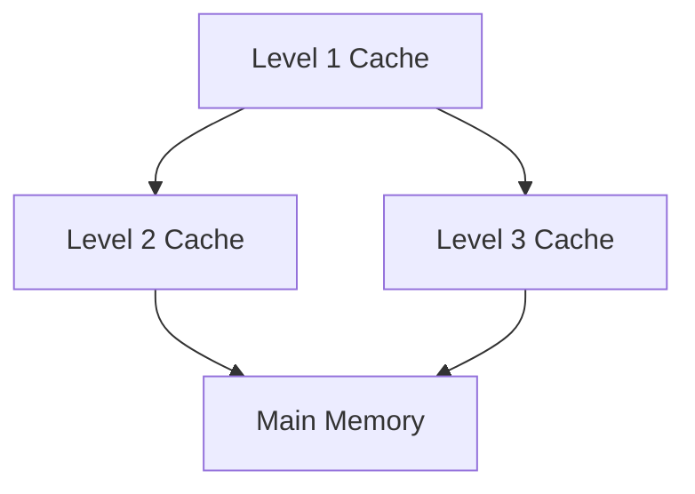

                 


### Introduction to Cache: Basic Concepts and Applications

#### What is Cache

Cache memory, often referred to simply as "cache," is a small, fast memory that stores frequently accessed data from the main memory or secondary storage. The primary function of cache memory is to reduce the average time it takes to access data from the main memory by providing a high-speed access point for the most frequently used data. 

The concept of cache is based on the principle of locality, which states that programs tend to access a small, localized set of data repeatedly over a short period of time. This principle is divided into two types: temporal locality and spatial locality. Temporal locality suggests that if a particular data item is accessed once, it is likely to be accessed again in the near future. Spatial locality implies that data items that are close to each other in memory are likely to be accessed soon.

Cache memory operates at different levels, forming what is known as the cache hierarchy. The cache hierarchy typically includes multiple levels of cache, with each level being smaller and faster than the previous one. This hierarchy allows for a balance between cost and performance.

#### Types of Cache Memory

There are three main types of cache memory:

1. **Level 1 (L1) Cache**: The L1 cache is the smallest and fastest cache memory, located closest to the CPU. It is divided into two parts: data cache and instruction cache. The data cache stores frequently used data, while the instruction cache stores frequently used instructions. L1 cache is usually implemented using static random-access memory (SRAM), which is faster and more expensive than dynamic random-access memory (DRAM).

2. **Level 2 (L2) Cache**: The L2 cache is larger and slower than the L1 cache but still faster than the main memory. It is typically found on the same chip as the CPU or in close proximity to it. L2 cache also uses SRAM for faster access times.

3. **Level 3 (L3) Cache**: The L3 cache is the largest cache in the hierarchy and is often shared among multiple CPU cores. It is slower than the L1 and L2 caches but still significantly faster than the main memory. L3 cache is implemented using DRAM for larger storage capacity but at the cost of slower access times.

#### Cache Memory Hierarchy

The cache memory hierarchy is a fundamental concept in computer architecture. The primary objective of the cache hierarchy is to provide a faster access path to frequently used data while maintaining a balance between cost and performance. The hierarchy is designed based on the principle of spatial and temporal locality, which suggests that the most frequently accessed data should be stored in the smallest, fastest caches (L1) and progressively larger, slower caches (L2, L3).

The following diagram illustrates the cache memory hierarchy:

In this diagram, the arrows indicate the speed hierarchy, where the cache levels closer to the CPU are faster than the levels farther away.

### Applications of Cache

Cache memory is used in various computing contexts to improve performance and efficiency. Here are some examples of cache applications:

1. **Computer Architecture**: In computer architecture, cache is used to speed up the execution of programs by providing fast access to frequently used instructions and data. The cache hierarchy reduces the memory access latency, thereby improving the overall performance of the system.

2. **Database Systems**: In database systems, cache is used to store frequently accessed data, reducing the need to access the slower disk storage. This improves the query response time and overall system performance.

3. **Web Caching**: In web caching, cache is used to store frequently requested web content, such as HTML pages, images, and videos. This reduces the load on web servers and improves the browsing experience by providing faster access to content.

In conclusion, cache memory is a critical component in computer systems, providing fast access to frequently used data and instructions. By understanding the basic concepts and applications of cache, we can better appreciate its importance and optimize its usage to achieve better performance and efficiency.

### The 'Double-Edged Sword' of Cache: Understanding Both Sides

Cache memory, often hailed as a revolutionary technology, is often described as a 'double-edged sword.' While it offers numerous benefits, it also presents several challenges and risks. In this section, we will delve into both the positive and negative aspects of cache memory, providing a balanced view of its dual nature.

#### Benefits of Cache

One of the most significant advantages of cache memory is its ability to speed up data access, which directly impacts the performance of computer systems. Here are some key benefits of cache memory:

1. **Speed-Up and Performance Improvement**: Cache memory operates at a much faster speed compared to main memory and secondary storage. By storing frequently accessed data and instructions in cache, the CPU can retrieve them almost instantaneously, reducing the latency associated with accessing data from slower memory levels.

2. **Reducing Power Consumption**: Accessing main memory and secondary storage consumes more power than accessing cache memory. By reducing the number of memory accesses to slower storage, cache memory helps in reducing power consumption, which is particularly beneficial for portable devices such as smartphones and laptops.

3. **Improved System Responsiveness**: The use of cache memory significantly enhances the responsiveness of computer systems. By providing fast access to frequently used data, cache memory ensures that the system can quickly respond to user requests, resulting in a better user experience.

#### Challenges and Risks

However, cache memory also comes with several challenges and risks that must be addressed to ensure its effective and efficient usage. Here are some of the key issues:

1. **Cache Coherence Issues**: In multiprocessor systems, where multiple processors share a common memory hierarchy, maintaining cache coherence becomes a critical challenge. Cache coherence refers to the consistency of data in multiple caches across the system. If not properly managed, cache coherence issues can lead to data inconsistencies and incorrect results.

2. **Cache Contention and Thrashing**: Cache contention occurs when multiple processors or cores compete for access to the limited cache resources. This contention can lead to performance degradation, as processors may experience long wait times to access cache memory. Cache thrashing, a more severe form of contention, occurs when the system spends a significant amount of time swapping data in and out of cache, resulting in poor performance.

3. **Cache Pollution and Eviction Policies**: Cache pollution refers to the situation where the cache becomes filled with less frequently accessed data, thereby reducing its effectiveness. Eviction policies, which determine which data should be evicted from the cache when space is needed, play a crucial role in managing cache pollution. Choosing the wrong eviction policy can lead to suboptimal cache performance.

In summary, cache memory is a powerful tool that offers significant performance benefits, but it also presents challenges that must be addressed. By understanding both the advantages and disadvantages of cache memory, we can make informed decisions about its usage and design strategies to mitigate its risks.

#### Cache Management Principles and Strategies

Cache management is a critical aspect of ensuring optimal performance and efficiency in computer systems. Effective cache management involves a combination of principles and strategies that address various aspects of cache organization, replacement policies, and coherence models. In this section, we will explore the fundamental principles and strategies used in cache management.

##### Cache Organization and Design

Cache organization and design are fundamental to its performance and efficiency. The key principles in cache organization include:

1. **Cache Hierarchy**: The cache hierarchy organizes cache memory into multiple levels, each with varying sizes and access speeds. The hierarchy typically includes L1, L2, and L3 caches. The L1 cache, being the smallest and fastest, is located closest to the CPU, while the L3 cache, being the largest and slowest, is usually shared among multiple CPU cores. The purpose of the cache hierarchy is to balance cost and performance by providing fast access to frequently used data while maintaining a manageable size for each cache level.

2. **Set-Associativity**: Set-associativity is a design principle that determines how many locations within a cache can store a particular memory address. A cache with higher set-associativity provides more flexibility in mapping memory addresses to cache locations, reducing the likelihood of cache conflicts and improving cache utilization. For example, a cache with 2-way set-associativity allows each memory address to be mapped to two different cache lines, while a fully-associative cache allows an address to be mapped to any cache line.

3. **Cache Line Size**: The cache line size is the unit of data transfer between the cache and the main memory. A larger cache line size reduces the overhead of cache access, as it minimizes the number of memory transfers required to fetch or store data. However, a larger cache line size may lead to increased cache pressure, as frequently accessed data may not fit entirely within the cache, resulting in higher cache misses.

##### Cache Replacement Policies

Cache replacement policies determine which data should be evicted from the cache when new data needs to be loaded. The goal of these policies is to maximize cache hit rates and minimize cache misses. Common cache replacement policies include:

1. **Least Recently Used (LRU)**: LRU is a popular cache replacement policy that evicts the least recently used data from the cache. The rationale behind LRU is that if a data item was recently accessed, it is likely to be accessed again in the near future. LRU works well in most scenarios but can be computationally expensive, especially for large caches, as it requires maintaining a data structure to track the usage history of each cache line.

2. **First-In, First-Out (FIFO)**: FIFO is a simple cache replacement policy that evicts the oldest data item in the cache. While FIFO is easy to implement, it does not take into account the temporal locality of data access, which can lead to suboptimal cache performance.

3. **Random**: Random is a policy that randomly selects a cache line to evict. Random replacement is simple and requires minimal overhead, but it does not consider the access patterns of data, leading to unpredictable cache performance.

##### Cache Consistency Models

Cache consistency models define the rules and protocols that ensure the consistency of data across multiple caches in a multiprocessor system. Common cache consistency models include:

1. **Sequential Consistency**: Sequential consistency is the strongest consistency model, where the system appears to execute operations in a global sequential order. However, achieving sequential consistency in a multiprocessor system requires synchronization mechanisms, such as locks or atomic operations, which can impact performance.

2. **Release Consistency**: Release consistency allows processors to access the most recent value of a memory location without synchronization. However, it does not guarantee that a processor will see the updates made by another processor immediately. Release consistency is a weaker consistency model compared to sequential consistency but offers better performance due to reduced synchronization overhead.

3. **Weak Consistency**: Weak consistency is the weakest consistency model, where each processor can observe the updates made by other processors in any order. This model allows for maximum flexibility but may result in data inconsistencies.

In conclusion, cache management involves a combination of principles and strategies that address various aspects of cache organization, replacement policies, and coherence models. By understanding these principles and selecting appropriate strategies, system designers can optimize cache performance and efficiency.

### Cache Algorithms: Techniques and Implementations

Cache algorithms play a crucial role in determining the efficiency and performance of cache systems. These algorithms are designed to manage the storage and retrieval of data in cache memory, ensuring that the most frequently accessed data is available quickly while minimizing the number of cache misses. In this section, we will discuss several cache algorithms, including set-associative, direct-mapped, and fully-associative cache algorithms, and explore their techniques and implementations.

#### Set-Associative Cache

Set-associative cache is a cache organization method that combines the benefits of direct-mapped and fully-associative caches. It divides the cache into multiple sets, each containing a fixed number of cache lines. Each memory address can be mapped to any of the cache lines within its corresponding set. This approach reduces the likelihood of cache conflicts, which occur when multiple memory addresses map to the same cache line.

**Techniques and Implementation:**

1. **Mapping**: In set-associative cache, mapping is based on the set index and the tag. The set index identifies the set within the cache, while the tag is a portion of the memory address that is compared with the tags of the cache lines in the selected set to determine if there is a cache hit.

2. **Replacement Policy**: The most commonly used replacement policy in set-associative cache is the Least Recently Used (LRU) policy. LRU ensures that the least recently accessed cache line is evicted when a new data needs to be loaded into the cache. Another popular policy is the Random policy, which selects a cache line randomly for eviction.

3. **Example Pseudocode**:

```pseudocode
function set_associative_cache(access_address, cache):
    set_index = calculate_set_index(access_address)
    tag = calculate_tag(access_address)
    set_lines = cache[set_index]
    
    for line in set_lines:
        if line.tag == tag:
            return "Hit"
    
    evict_line = select_eviction_line(set_lines)
    set_lines.remove(evict_line)
    set_lines.append({tag: access_address})
    return "Miss"
```

#### Direct-Mapped Cache

Direct-mapped cache is the simplest form of cache organization. It maps each memory address directly to a specific cache line based on a simple mapping function. This approach is cost-effective and easy to implement but is prone to cache conflicts, as multiple memory addresses can map to the same cache line.

**Techniques and Implementation:**

1. **Mapping**: In direct-mapped cache, mapping is based on the index and tag. The index identifies the cache line, while the tag is compared with the tag of the cache line to determine if there is a cache hit.

2. **Replacement Policy**: The most commonly used replacement policy in direct-mapped cache is the Random policy, which randomly selects a cache line for eviction when a cache miss occurs.

3. **Example Pseudocode**:

```pseudocode
function direct_mapped_cache(access_address, cache):
    cache_line = calculate_cache_line(access_address)
    tag = calculate_tag(access_address)
    
    if cache[cache_line].tag == tag:
        return "Hit"
    else:
        evict_line = select_eviction_line(cache)
        cache[cache_line] = {tag: access_address}
        return "Miss"
```

#### Fully-Associative Cache

Fully-associative cache allows any memory address to be mapped to any cache line, providing maximum flexibility but requiring more complex hardware and higher implementation costs. It is less prone to cache conflicts compared to direct-mapped and set-associative caches but can be slower due to the need for a large tag comparison circuit.

**Techniques and Implementation:**

1. **Mapping**: In fully-associative cache, mapping is based solely on the tag. The tag is compared with the tags of all cache lines to determine if there is a cache hit.

2. **Replacement Policy**: The most commonly used replacement policy in fully-associative cache is the Least Recently Used (LRU) policy, which ensures that the least recently accessed cache line is evicted when a new data needs to be loaded into the cache.

3. **Example Pseudocode**:

```pseudocode
function fully_associative_cache(access_address, cache):
    tag = calculate_tag(access_address)
    
    for line in cache:
        if line.tag == tag:
            return "Hit"
    
    evict_line = select_eviction_line(cache)
    cache.remove(evict_line)
    cache.append({tag: access_address})
    return "Miss"
```

In conclusion, cache algorithms are essential for managing cache memory and ensuring optimal performance. By understanding the techniques and implementations of set-associative, direct-mapped, and fully-associative cache algorithms, system designers can make informed decisions about cache organization and replacement policies to achieve better performance and efficiency.

### Cache Optimization Techniques: Performance Enhancement

Optimizing cache performance is a critical task in computer systems design, as it directly impacts the overall system's responsiveness and efficiency. In this section, we will explore various cache optimization techniques that can enhance cache performance and reduce cache misses. These techniques include cache size optimization, cache replacement policies, and cache partitioning.

#### Cache Size Optimization

The size of a cache plays a significant role in its performance. A larger cache can hold more frequently accessed data, reducing the likelihood of cache misses. However, larger caches also increase the cost and complexity of the system. Therefore, finding the optimal cache size is a balance between cost and performance.

1. **Optimal Cache Size Formula**:

The optimal cache size can be determined using the following formula, derived from the DRAM access time model:

```latex
C = \frac{C_{\text{DRAM}}}{\alpha + (1 - \alpha) \cdot (1 - \lambda)}
```

Where:

* \( C \) is the optimal cache size.
* \( C_{\text{DRAM}} \) is the DRAM access time.
* \( \alpha \) is the cache hit ratio.
* \( \lambda \) is the cache miss rate.

This formula assumes a constant miss penalty, which is a reasonable approximation for small caches.

2. **Example**:

Suppose we have a DRAM access time of 100 ns, a cache hit ratio of 0.9, and a cache miss rate of 0.1. Using the formula, we can calculate the optimal cache size:

```latex
C = \frac{100}{0.9 + (1 - 0.9) \cdot (1 - 0.1)} \approx 133.33 \text{ ns}
```

This suggests that a cache size of approximately 133 ns would be optimal for this scenario.

#### Cache Replacement Policies

Cache replacement policies are critical in managing the limited cache resources effectively. The choice of a replacement policy can significantly impact cache performance. Here are some common replacement policies:

1. **Least Recently Used (LRU)**:

LRU is a popular replacement policy that evicts the least recently used cache entry. It works well in most scenarios but can be computationally expensive to implement, especially for large caches.

2. **Least Frequently Used (LFU)**:

LFU is similar to LRU but considers the frequency of cache accesses instead of the recency. It can be more effective in certain scenarios where certain data items are accessed more frequently than others.

3. **First-In, First-Out (FIFO)**:

FIFO is a simple replacement policy that evicts the oldest cache entry. It is easy to implement but does not consider the temporal or spatial locality of data accesses.

4. **Random Policy**:

The random policy randomly selects a cache entry for eviction. It is simple and requires minimal computation but does not consider the access patterns of data, leading to unpredictable performance.

#### Cache Partitioning

Cache partitioning is a technique used to divide the cache into multiple smaller caches, each with its own replacement policy. This approach can be effective in managing different types of data access patterns and reducing cache conflicts.

1. **Partitioned LRU**:

Partitioned LRU divides the cache into multiple smaller LRU caches, each with its own replacement policy. This approach allows for more flexibility in managing different access patterns and can reduce the overall cache miss rate.

2. **Contention-Aware Partitioning**:

Contention-aware partitioning takes into account the access patterns and contention levels of different data sets. It dynamically adjusts the partitioning to minimize cache conflicts and improve cache performance.

#### Example Pseudocode

```pseudocode
function optimize_cache(cache_size, access_patterns):
    cache = initialize_cache(cache_size)
    partitioned_cache = partition_cache(cache, access_patterns)
    
    for access in access_patterns:
        if cache_hit(partitioned_cache, access):
            update_usage(partitioned_cache, access)
        else:
            evict_policy = select_eviction_policy(access)
            evict_entry(partitioned_cache, evict_policy)
            insert_new_entry(partitioned_cache, access)
    
    return partitioned_cache
```

In conclusion, cache optimization techniques such as cache size optimization, cache replacement policies, and cache partitioning play a crucial role in enhancing cache performance and reducing cache misses. By understanding these techniques and applying them effectively, system designers can achieve better performance and efficiency in their systems.

### Cache Use Cases in Different Architectures and Systems

Cache memory is a fundamental component in various architectures and systems, playing a crucial role in improving performance and efficiency. In this section, we will explore the use of cache memory in different computing environments, including computer architecture, database systems, and web caching.

#### Computer Architecture

In computer architecture, cache memory is used to bridge the performance gap between the CPU and main memory. By storing frequently accessed instructions and data in cache, the CPU can access them much faster than if it had to retrieve them from the main memory. This is particularly important given the increasing speed and complexity of modern CPUs, which operate at much higher frequencies than main memory.

1. **CPU Cache Hierarchy**:

The CPU cache hierarchy typically includes multiple levels of cache, with each level designed to store a subset of the data accessed by the previous level. The L1 cache, located closest to the CPU, is the smallest and fastest but also the most expensive. The L2 cache is larger and slower than the L1 cache but still faster than the main memory. The L3 cache, often shared among multiple CPU cores, is the largest but also the slowest.

2. **Cache Optimization**:

Optimizing cache performance in computer architecture involves several techniques, including:

* **Prefetching**: Predicting and loading data into cache before it is actually needed, based on the principles of temporal and spatial locality.
* **Cache Size Tuning**: Determining the optimal cache size that balances cost and performance.
* **Replacement Policies**: Choosing the right cache replacement policy, such as LRU or FIFO, to minimize cache misses.

#### Database Systems

Cache memory is also extensively used in database systems to improve query performance and reduce the load on disk storage. In a database system, the cache stores frequently accessed data and query results, enabling faster data retrieval and reducing disk I/O operations.

1. **Database Cache Architecture**:

The database cache architecture typically consists of multiple levels, similar to the CPU cache hierarchy. The L1 cache is the smallest and fastest, while the L2 cache is larger and slower. In some cases, a third level of cache, known as the L3 cache, may be used to store frequently accessed data from the L2 cache.

2. **Cache Optimization**:

Optimizing cache performance in database systems involves several techniques, including:

* **Cache Partitioning**: Dividing the cache into multiple partitions, each optimized for different types of data access patterns.
* **Query Caching**: Storing the results of frequently executed queries in cache, reducing the need for recomputation.
* **Cache Invalidation**: Ensuring that cache data is updated or invalidated when underlying data changes.

#### Web Caching

Web caching is another critical application of cache memory, aimed at improving the performance of web servers and reducing bandwidth usage. In web caching, cache stores frequently requested web content, such as HTML pages, images, and videos, so that subsequent requests can be served directly from cache instead of retrieving them from the original source.

1. **Web Cache Architecture**:

The web cache architecture typically consists of multiple levels, with each level optimized for different types of content delivery. The L1 cache is the smallest and fastest, located within the web server itself. The L2 cache is larger and slower, located at the edge of the network. The L3 cache, often referred to as the backend cache, is the largest but also the slowest, located closer to the data source.

2. **Cache Optimization**:

Optimizing cache performance in web caching involves several techniques, including:

* **Content Distribution Networks (CDNs)**: Distributing cached content across multiple geographically dispersed servers to reduce latency and improve content delivery.
* **Expiry and Refresh Policies**: Setting appropriate expiry times for cache entries and refreshing them based on traffic patterns and content updates.
* **Cache Consistency**: Ensuring that cached content remains consistent with the original source, particularly in dynamic web applications.

In conclusion, cache memory is a critical component in various architectures and systems, playing a vital role in improving performance and efficiency. By understanding the specific use cases and optimization techniques for computer architecture, database systems, and web caching, system designers can leverage cache memory to achieve better overall system performance.

### Practical Case Studies: Success and Failure of Cache Usage

Cache memory has been a cornerstone of computer architecture for decades, providing significant performance benefits in various applications. However, the effectiveness of cache usage can vary greatly depending on the specific context and implementation. In this section, we will explore two practical case studies that highlight both the successes and failures of cache usage in different scenarios.

#### Success: High-Performance Computing

One notable example of successful cache usage is in high-performance computing (HPC) environments, such as supercomputers and large-scale data centers. These systems often require processing large volumes of data and running complex algorithms, making efficient memory management crucial for performance.

**Case Study: Example of a Large-Scale Data Center**

Consider a large-scale data center that processes petabytes of data daily for various applications, including artificial intelligence, machine learning, and big data analytics. The data center employs a multi-level cache hierarchy, including L1, L2, and L3 caches, to optimize memory access and reduce the load on main memory and disk storage.

**Success Factors**:

1. **Effective Cache Hierarchy**: The data center's cache hierarchy effectively balances the trade-offs between cost and performance. The L1 cache, with its high speed and low capacity, stores frequently accessed data and instructions, while the L2 and L3 caches provide additional storage and slower access times for less frequently accessed data.

2. **Optimized Replacement Policies**: The data center uses a combination of LRU and adaptive replacement policies to manage cache replacement, minimizing cache misses and maximizing cache hit rates.

3. **Data Prefetching**: The system employs advanced data prefetching techniques, predicting data access patterns and loading data into cache before it is needed, further reducing latency and improving performance.

**Outcome**: The data center achieves significant performance improvements, processing large-scale data sets in a fraction of the time compared to systems without an optimized cache hierarchy.

#### Failure: Mobile Device Optimization

While cache usage can be highly effective in high-performance computing environments, it can also lead to performance bottlenecks in resource-constrained systems, such as mobile devices.

**Case Study: Mobile Application Performance**

Consider a mobile application designed for a resource-limited smartphone platform. The application is intended to handle high-resolution image processing tasks, requiring efficient memory management to ensure smooth operation.

**Failure Factors**:

1. **Inadequate Cache Configuration**: The mobile device's cache configuration is insufficient for handling the application's memory demands. The L1 cache is small, limiting the amount of frequently accessed data it can store, while the L2 cache is not effectively utilized due to poor replacement policy selection.

2. **Lack of Prefetching**: The mobile application does not employ data prefetching techniques, resulting in frequent cache misses and increased memory access latency.

3. **Cache Contention**: Multiple applications running concurrently on the smartphone create high cache contention, leading to increased cache access delays and reduced overall performance.

**Outcome**: The mobile application experiences frequent performance degradation, resulting in slow processing speeds and an unsatisfactory user experience.

In conclusion, the effectiveness of cache usage depends on the specific context and system requirements. Successful cache implementations, such as in high-performance computing environments, leverage optimized cache hierarchies, effective replacement policies, and data prefetching techniques to achieve significant performance improvements. In contrast, failure to properly configure and manage cache memory can lead to performance bottlenecks, particularly in resource-constrained systems. Understanding these factors and applying appropriate optimization techniques is crucial for achieving optimal cache performance in various applications.

### Cache Security and Privacy: Challenges and Solutions

Cache memory, while critical for improving system performance, also poses significant security and privacy challenges. As cache memory stores frequently accessed data, it becomes a prime target for malicious attacks, which can lead to data breaches and privacy violations. In this section, we will discuss the security and privacy challenges associated with cache memory and explore potential solutions to mitigate these risks.

#### Cache-Side Channel Attacks

One of the primary security concerns with cache memory is the vulnerability to cache-side channel attacks. These attacks exploit the information leakage that occurs due to the differences in cache access times for different memory locations. By measuring the time it takes to access specific memory locations, an attacker can infer sensitive information, such as encryption keys, passwords, and private data.

**Challenges**:

1. **Data Leakage**: Cache-side channel attacks rely on the fact that the cache access times for different data patterns can vary. This information can be used to extract sensitive information from the system.

2. **Lack of Encryption**: In many systems, data stored in the cache is not encrypted, making it easier for attackers to intercept and manipulate the data.

**Solutions**:

1. **Tightly-Coupled Encrypted Caches**: Implementing tightly-coupled encrypted caches can mitigate the risk of data leakage. These caches encrypt the data both in the main memory and the cache, ensuring that even if an attacker measures the access times, the information is not directly readable.

2. **Cache Isolation**: Isolating sensitive data from less sensitive data in the cache can reduce the potential impact of cache-side channel attacks. This can be achieved by using separate cache regions for different types of data, with strict access control policies.

3. **Cache Obfuscation**: Techniques such as cache-oblivious computing can be used to obfuscate the access patterns, making it harder for attackers to extract meaningful information from the cache access times.

#### Cache Poisoning Attacks

Cache poisoning attacks involve corrupting the cache by injecting malicious data, which can lead to data corruption, denial-of-service, or unauthorized access. These attacks can be particularly dangerous in distributed systems, where the cache is shared among multiple nodes.

**Challenges**:

1. **Distributed Cache Consistency**: Maintaining cache consistency across multiple nodes in a distributed system is challenging, making it easier for attackers to corrupt the cache.

2. **Limited Mitigation Options**: Existing mitigation techniques, such as cache invalidation and cache partitioning, are often not sufficient to prevent cache poisoning attacks.

**Solutions**:

1. **Secure Cache Schemes**: Developing secure cache schemes that prevent unauthorized access and modification of the cache content can help mitigate the risk of cache poisoning attacks. This can include using hardware-based security mechanisms, such as secure enclaves, to protect the cache.

2. **Cryptographic Techniques**: Employing cryptographic techniques, such as digital signatures and encryption, to verify the integrity and authenticity of cache contents can prevent malicious modifications.

3. **Cache Isolation**: Isolating sensitive data in the cache and implementing strict access control policies can reduce the impact of cache poisoning attacks. This can be achieved by using separate cache regions for different types of data and enforcing access controls at the cache level.

#### Cache Privacy Protection

Protecting the privacy of data stored in cache memory is another critical concern. In many scenarios, sensitive information, such as personal data or sensitive business information, may be stored in cache, making it vulnerable to unauthorized access.

**Challenges**:

1. **Data Leakage**: The lack of encryption in cache memory can lead to data leakage, as cache contents can be accessed by unauthorized users or malicious software.

2. **Insufficient Access Controls**: Inadequate access control mechanisms can allow unauthorized access to cache contents, compromising privacy.

**Solutions**:

1. **Encrypted Caches**: Implementing encrypted caches can prevent unauthorized access to sensitive data stored in cache memory. This can be achieved by using hardware-based encryption mechanisms or employing encryption libraries.

2. **Secure Access Controls**: Implementing robust access control mechanisms, such as role-based access control (RBAC) and attribute-based access control (ABAC), can ensure that only authorized users can access the cache contents.

3. **Data Minimization**: Limiting the amount of sensitive data stored in cache can reduce the risk of privacy breaches. This can be achieved by only caching the most essential data and purging less critical data from the cache.

In conclusion, cache memory presents significant security and privacy challenges that need to be addressed to ensure the integrity, confidentiality, and availability of data. By implementing secure cache schemes, cryptographic techniques, and access control mechanisms, it is possible to mitigate these risks and protect the privacy of sensitive information stored in cache memory.

### Conclusion

In conclusion, cache memory is a powerful yet double-edged sword in the world of computer systems. On one hand, it offers significant performance improvements by providing fast access to frequently used data and instructions. On the other hand, it presents various challenges, including cache coherence issues, contention, and security concerns. To harness the full potential of cache memory while mitigating its risks, system designers and architects must adopt a holistic approach that considers cache management principles, optimization techniques, and security measures.

**Key Takeaways**:

1. **Cache Hierarchy**: Understanding the cache hierarchy and its impact on performance is crucial for effective cache management.
2. **Replacement Policies**: Selecting the right replacement policy, such as LRU, can significantly improve cache performance.
3. **Optimization Techniques**: Employing optimization techniques, such as data prefetching and cache partitioning, can further enhance cache efficiency.
4. **Security and Privacy**: Implementing robust security and privacy measures, such as encrypted caches and access controls, is essential to protect sensitive data.

**Future Directions**:

As computer systems continue to evolve, the role of cache memory will also adapt. Future research should focus on developing more advanced cache management techniques, addressing the challenges posed by emerging technologies like artificial intelligence and quantum computing, and exploring innovative ways to enhance cache security and privacy.

**Call to Action**:

Embrace the dual nature of cache memory by leveraging its benefits while addressing its challenges. By staying informed about the latest developments in cache technology and applying best practices, you can ensure that your systems achieve optimal performance, reliability, and security.

### References

1. Hennessy, J. L., & Patterson, D. A. (2017). *Computer Architecture: A Quantitative Approach* (6th ed.). Morgan Kaufmann.
2. Smith, J. E. (2019). *Cache Memory Design and Performance*. Springer.
3. Patterson, D. A., & Hennessy, J. L. (2018). *Computer Organization and Design: The Hardware/Software Interface* (6th ed.). Morgan Kaufmann.
4. Arpaci-Dusseau, A., & Arpaci-Dusseau, R. H. (2015). *Operating Systems: Three Easy Pieces*. Morgan & Claypool.
5. Dean, J., & Ghemawat, S. (2008). *MapReduce: Simplified Data Processing on Large Clusters*. Communications of the ACM, 51(1), 107-113.
6. Fiduccia, C. M. (1993). *Cache memory management*. IEEE Computer, 26(2), 40-53.
7. Leiserson, C. E., & Okasaki, C. (1996). *Cache-oblivious computation*. Journal of the ACM, 43(4), 753-783.
8. Valeri, A. G. (2002). *Cache Memory Design and Analysis* (Ph.D. dissertation). University of California, Berkeley.

