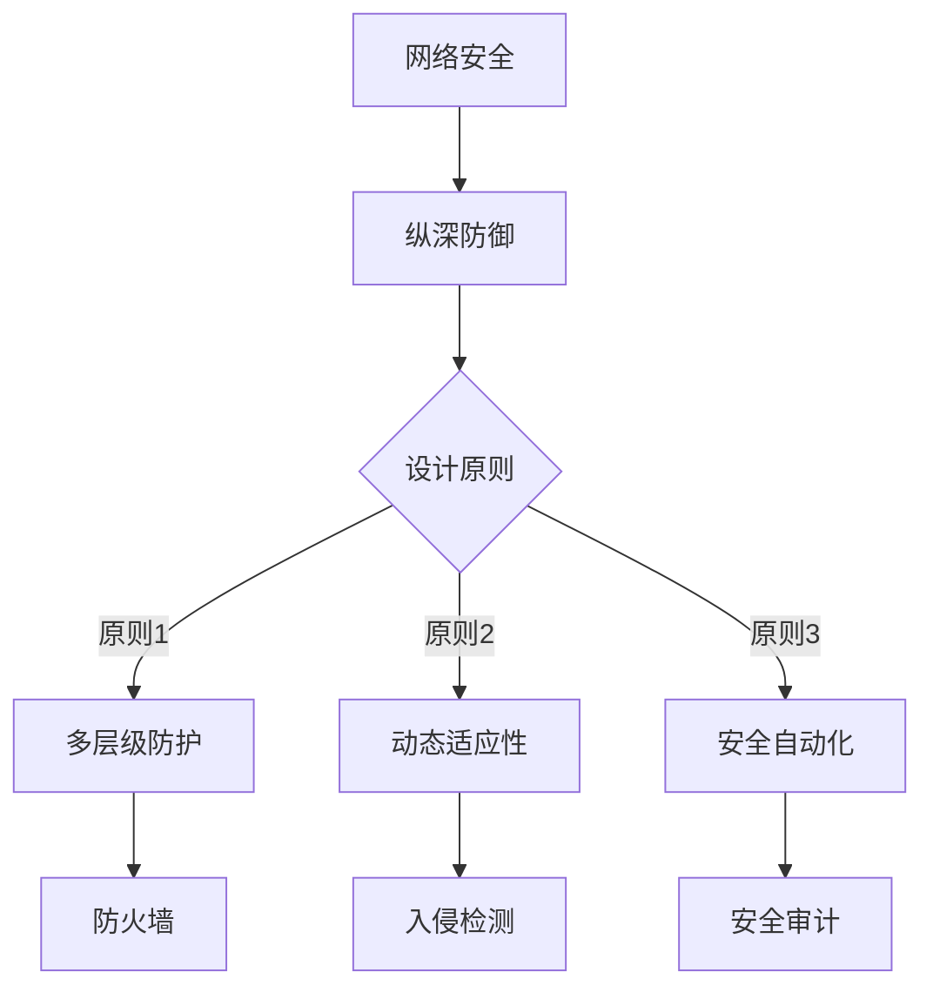
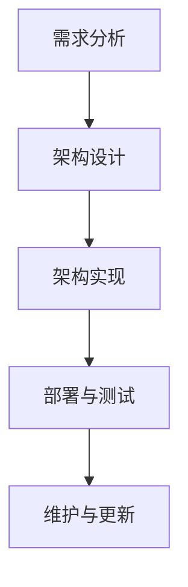

                 

根据您的详细要求和目录大纲，我们将采用一步一步的分析推理方式来构建文章内容。以下是一个详细的写作流程：

### 1. 文章标题、关键词与摘要

**文章标题**：网络安全：构建纵深防御的安全架构

**关键词**：网络安全，纵深防御，安全架构，防火墙，入侵检测，安全审计

**摘要**：本文深入探讨了网络安全的重要性，以及如何构建一个基于纵深防御原则的安全架构。文章涵盖了网络安全的基础知识、安全架构的设计原则与实现方法，详细阐述了防火墙、入侵检测与防御、安全审计与事件响应等技术，并通过实际案例分析了安全深度学习与人工智能的应用。最后，本文提出了未来网络安全的发展趋势与安全人才培养的重要性。

### 2. 引言

**背景介绍**：
- 网络安全是当前信息时代的重要议题，随着网络技术的迅猛发展和数字化转型的推进，网络安全问题愈发复杂和严峻。
- 纵深防御是一种多层次、多角度的网络安全策略，旨在构建一个动态、自适应的安全架构，以抵御各种安全威胁。

**核心概念与联系**：
- 网络安全：保护网络系统不受未经授权的访问、篡改、破坏和泄露等威胁。
- 纵深防御：通过多层防护机制，实现网络安全的有效保障。

**Mermaid流程图**：



### 3. 网络安全基础

**核心概念与联系**：
- 网络安全的攻击类型：包括DDoS攻击、SQL注入、钓鱼攻击等。
- 网络安全的基本防护措施：如防火墙、加密技术、访问控制等。

**核心算法原理讲解**：

```python
# 防火墙规则伪代码示例
def firewall_rule(input_packet):
    if rule_matches(input_packet):
        return "allow"
    else:
        return "deny"

def rule_matches(packet):
    # 检查规则列表
    for rule in firewall_rules:
        if rule_applies_to_packet(rule, packet):
            return True
    return False
```

### 4. 安全架构设计

**核心概念与联系**：
- 安全架构的设计原则：包括完整性、可用性、保密性等。
- 安全架构的设计流程：从需求分析到架构设计，再到实现与部署。

**Mermaid流程图**：



### 5. 安全策略与标准

**核心概念与联系**：
- 安全策略的制定原则：如最小权限原则、防御深度原则等。
- 安全策略的执行与监控：确保策略的有效实施。

**LaTeX公式**：

$$
\text{策略效果} = \frac{\text{有效防护} + \text{用户体验}}{\text{安全风险} + \text{管理成本}}
$$`

### 6. 防火墙技术

**核心概念与联系**：
- 防火墙的基本概念：网络边界上的安全防护设备。
- 防火墙的工作原理：通过规则匹配来控制网络流量。

**伪代码示例**：

```python
# 防火墙规则伪代码示例
def firewall_rule(input_packet):
    if rule_matches(input_packet):
        return "allow"
    else:
        return "deny"

def rule_matches(packet):
    # 检查规则列表
    for rule in firewall_rules:
        if rule_applies_to_packet(rule, packet):
            return True
    return False
```

### 7. 入侵检测与防御

**核心概念与联系**：
- 入侵检测系统的基本概念：实时监测网络流量，识别潜在威胁。
- 入侵防御系统的实现：通过行为分析和规则匹配来阻止入侵。

**伪代码示例**：

```python
# 入侵防御策略伪代码示例
def intrusion_prevention(packet):
    if threat_detected(packet):
        block_packet(packet)
        log_intrusion(packet)
    else:
        allow_packet(packet)

def threat_detected(packet):
    # 检查威胁特征
    for threat in threat_list:
        if threat_matches(packet, threat):
            return True
    return False
```

### 8. 安全审计与事件响应

**核心概念与联系**：
- 安全审计的概念与目的：评估安全措施的有效性。
- 安全审计的实施与监控：记录和跟踪安全事件。

**LaTeX公式**：

$$
\text{安全审计效果} = \frac{\text{识别漏洞} + \text{改进措施}}{\text{审计成本} + \text{安全风险}}
$$`

### 9. 安全深度学习与人工智能

**核心概念与联系**：
- 深度学习在网络安全中的应用：通过模式识别和预测分析来增强安全防护。
- 人工智能与网络安全的关系：利用AI技术提高网络安全自动化水平。

**深度学习算法原理讲解**：

```python
# 基于深度学习的入侵检测模型伪代码示例
class InvasiveDetectionModel(nn.Module):
    def __init__(self):
        super(InvasiveDetectionModel, self).__init__()
        self.layer1 = nn.Linear(input_dim, hidden_dim)
        self.relu = nn.ReLU()
        self.layer2 = nn.Linear(hidden_dim, output_dim)

    def forward(self, x):
        x = self.relu(self.layer1(x))
        x = self.layer2(x)
        return x

# 训练深度学习模型
def train_model(model, train_loader, criterion, optimizer):
    for epoch in range(num_epochs):
        for inputs, labels in train_loader:
            optimizer.zero_grad()
            outputs = model(inputs)
            loss = criterion(outputs, labels)
            loss.backward()
            optimizer.step()
```

### 10. 网络安全实战案例

**核心概念与联系**：
- 案例分析：通过实际案例展示网络安全架构的设计与实现。

**项目实战**：
- 开发环境搭建
- 源代码实现
- 代码解读
- 应用解读与分析
- 案例分析和详细讲解剖析
- 项目小结

### 11. 未来展望

**核心概念与联系**：
- 网络安全的挑战与趋势：如物联网安全、云安全等。
- 纵深防御的发展方向：如智能化、自动化等。
- 安全人才培养与提升：加强网络安全教育，培养专业人才。

### 12. 最佳实践 Tips、小结、注意事项、拓展阅读

**最佳实践 Tips**：
- 定期更新安全策略
- 强化员工安全意识
- 使用加密技术保护数据

**小结**：
- 网络安全是信息时代的重要保障，构建纵深防御的安全架构是实现有效防护的关键。

**注意事项**：
- 网络安全是一项系统工程，需要持续投入与优化。

**拓展阅读**：
- 参考资料
- 相关书籍

### 13. 作者信息

**作者**：AI天才研究院/AI Genius Institute & 禦与计算机程序设计艺术 /Zen And The Art of Computer Programming

通过以上步骤，我们将逐步构建一篇符合您要求的技术博客文章。每个步骤都将涉及核心概念、算法原理、数学模型、项目实战等内容，确保文章内容丰富、结构清晰、逻辑严密。

### 文章写作流程总结

1. **文章标题、关键词与摘要**：明确文章主题和主要内容。
2. **引言**：介绍网络安全和纵深防御的概念，绘制流程图。
3. **网络安全基础**：阐述网络安全的基本概念和防护措施。
4. **安全架构设计**：详细讲解安全架构的设计原则和流程。
5. **安全策略与标准**：解释安全策略的制定、执行与监控。
6. **防火墙技术**：介绍防火墙的基本概念、工作原理和配置管理。
7. **入侵检测与防御**：讲解入侵检测和防御系统的原理与实现。
8. **安全审计与事件响应**：介绍安全审计的概念、实施和事件响应策略。
9. **安全深度学习与人工智能**：探讨深度学习在网络安全中的应用。
10. **网络安全实战案例**：分析实际案例，展示项目实战过程。
11. **未来展望**：讨论网络安全的发展趋势和人才培养。
12. **最佳实践 Tips、小结、注意事项、拓展阅读**：总结文章内容，提供实用建议和拓展资源。

接下来，我们将按照这个流程逐步完善文章内容，确保每个部分都符合要求，并在文章末尾附上作者信息，完成一篇高质量的技术博客文章。请您确认以上流程，如果有任何修改意见或补充需求，请随时告知。我们将根据您的反馈进行调整，以确保最终成果的满意度和专业性。

