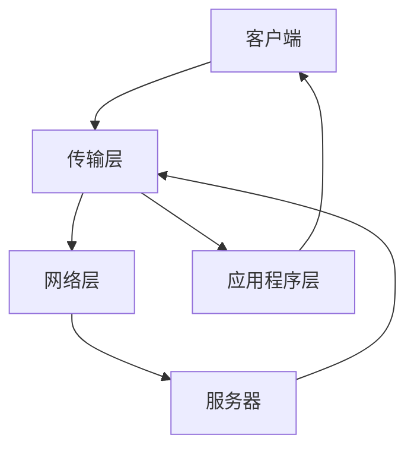

                 

# 文章标题：网络编程：构建高性能服务器应用

## 关键词

- 网络编程
- 高性能服务器
- TCP/IP
- HTTP
- WebSocket
- 多线程
- 事件驱动编程
- 异步I/O
- 安全性
- 负载均衡
- 缓存
- 性能监控

## 摘要

本文将深入探讨网络编程的核心概念、高级技术以及构建高性能服务器应用的策略。通过分析TCP/IP、HTTP和WebSocket等网络协议，介绍多线程、事件驱动编程和异步I/O等高级网络编程技术。此外，本文还将讨论构建高效、安全的网络服务器的方法，包括负载均衡、缓存和性能监控等关键要素。通过结合实际项目案例，本文旨在为读者提供全面、实用的网络编程指导。

## 引言

网络编程是计算机科学与技术领域的重要组成部分，它使得计算机之间能够高效、可靠地进行通信。在现代互联网环境中，网络编程不仅仅是一种技术，更是一种艺术。高性能服务器应用的开发对于提供快速、可靠的网络服务至关重要。本篇文章将逐步介绍网络编程的基本概念、高级技术以及构建高性能服务器应用的最佳实践。

### 书籍概述

《网络编程：构建高性能服务器应用》旨在为读者提供一个系统性的学习路径，帮助读者掌握网络编程的核心概念和高级技术。本书分为以下几个部分：

1. **核心概念与架构**：介绍网络编程的基础知识，包括网络协议、传输层和应用程序层的工作原理。
2. **基础网络协议与概念**：深入探讨TCP/IP、HTTP和WebSocket等基础协议的工作原理和应用场景。
3. **高级网络编程技术**：讲解多线程、事件驱动编程和异步I/O等高级技术，并探讨其在高性能服务器开发中的应用。
4. **高性能服务器设计**：介绍构建高性能服务器的设计原则和最佳实践，包括负载均衡、缓存和性能监控。
5. **网络安全**：讨论网络安全的重要性，介绍加密、认证和威胁建模等关键技术。
6. **实战项目**：通过实际项目案例展示网络编程的应用，提供详细的代码实现和解析。
7. **总结与展望**：总结本书的核心观点，并探讨网络编程的未来发展趋势。

### 目的和范围

本书的目标是为有志于学习网络编程的读者提供一个全面、深入的学习资源。本书涵盖了网络编程的基础知识、高级技术和最佳实践，适合初学者和有经验的开发者阅读。通过本书的学习，读者将能够：

1. 理解网络编程的基本概念和架构。
2. 掌握基础网络协议的工作原理和应用。
3. 应用高级网络编程技术提高服务器性能。
4. 设计和实现高效、安全的网络服务器应用。
5. 掌握性能优化和监控的关键技术。

### 目标读者

本书适合以下读者群体：

1. 计算机科学和软件工程专业的学生和研究者。
2. 想要了解网络编程和服务器开发的开发者。
3. 从事网络管理和运维的技术人员。
4. 对高性能服务器应用感兴趣的IT专业人士。

## 核心概念与架构

### 网络编程概述

网络编程是使计算机之间进行通信的一门技术。它涉及传输层、网络层和应用程序层等多个层次。网络编程的核心任务是确保数据能够在不同的计算机系统之间高效、可靠地传输。

### 网络协议

网络协议是计算机之间通信的规则集合。常见的网络协议包括TCP/IP、HTTP和WebSocket等。每个协议都有其特定的应用场景和功能。

#### TCP/IP协议

TCP/IP是互联网的基础协议，由传输控制协议（TCP）和互联网协议（IP）组成。TCP负责数据的可靠传输，而IP负责数据包的发送和路由。

#### HTTP协议

HTTP是用于Web应用的协议，定义了客户端和服务器之间的请求和响应格式。HTTP是一种无状态协议，适用于交互式Web应用。

#### WebSocket协议

WebSocket是一种双向通信协议，允许服务器和客户端之间实时通信。WebSocket克服了HTTP单向通信的局限性，适用于实时应用，如在线聊天和游戏。

### 网络编程架构

网络编程的架构通常包括以下几个部分：

1. **客户端**：请求资源的计算机。
2. **服务器**：提供资源的计算机。
3. **传输层**：处理数据包的发送和接收。
4. **应用程序层**：处理应用程序特定的逻辑。

### Mermaid流程图

以下是网络编程架构的Mermaid流程图：



### 核心概念与联系

网络编程的核心概念包括协议、传输层、网络层和应用程序层。这些概念相互关联，构成了网络编程的整体架构。

- **协议**：定义了通信的规则，确保数据能够正确传输。
- **传输层**：负责数据包的发送和接收，确保数据的可靠性。
- **网络层**：负责数据包的路由和转发，确保数据能够到达正确的目的地。
- **应用程序层**：处理应用程序特定的逻辑，如HTTP请求和响应处理。

通过上述核心概念和架构的介绍，读者可以更好地理解网络编程的基础知识，为后续的高级技术学习打下坚实的基础。接下来，我们将深入探讨基础网络协议和概念，为构建高性能服务器应用奠定基础。

## 基础网络协议和概念

### TCP/IP协议

TCP/IP（传输控制协议/互联网协议）是互联网的核心协议，它定义了数据如何在网络中传输的规则。TCP/IP协议栈分为四层：网络接口层、互联网层、传输层和应用层。

#### IP地址和路由

IP地址是网络中每个设备的唯一标识。IPv4地址由32位二进制数组成，通常表示为四个十进制数（例如，192.168.1.1）。IPv6则采用128位地址，以提高地址空间的扩展性。

路由是指数据包从源地址到目的地址的传输路径。路由器负责根据目的地址选择最佳路径，并将数据包转发到下一个路由器或目标服务器。

#### TCP连接建立和终止

TCP连接的建立过程被称为三次握手，包括以下步骤：

1. **SYN**：客户端发送一个SYN报文到服务器，请求建立连接。
2. **SYN-ACK**：服务器收到SYN报文后，发送一个SYN-ACK报文作为响应，表示同意建立连接。
3. **ACK**：客户端收到SYN-ACK报文后，发送一个ACK报文确认连接建立。

TCP连接的终止过程被称为四次挥手，包括以下步骤：

1. **FIN**：客户端发送一个FIN报文，表示请求终止连接。
2. **ACK**：服务器收到FIN报文后，发送一个ACK报文确认连接终止。
3. **FIN**：服务器发送一个FIN报文，表示服务器请求终止连接。
4. **ACK**：客户端收到FIN报文后，发送一个ACK报文确认连接终止。

### HTTP协议

HTTP（超文本传输协议）是用于Web应用的协议，定义了客户端和服务器之间的请求和响应格式。HTTP是无状态协议，即每次请求之间没有直接的联系。

#### HTTP请求和响应

HTTP请求包括请求行、请求头和请求体。请求行包含请求方法（如GET、POST）、URL和HTTP版本。

HTTP响应包括状态行、响应头和响应体。状态行包含HTTP版本、状态码和状态描述。

#### 无状态性和缓存

HTTP的无状态性意味着每次请求都是独立的，服务器不会记住之前的请求。这简化了服务器的设计，但可能导致性能问题。

HTTP缓存技术可以存储请求和响应，以减少服务器负载和提高响应速度。常见的缓存策略包括浏览器缓存、代理缓存和CDN缓存。

### WebSocket协议

WebSocket是一种双向通信协议，允许服务器和客户端之间实时通信。WebSocket克服了HTTP单向通信的局限性，适用于实时应用，如在线聊天和游戏。

#### WebSocket连接

WebSocket连接通过HTTP协议进行初始化，但数据传输使用WebSocket协议。连接初始化过程包括以下步骤：

1. **Handshake**：客户端发送一个特殊的请求，服务器响应后建立WebSocket连接。
2. **Data Transfer**：连接建立后，服务器和客户端可以实时发送和接收数据。
3. **Connection Close**：连接结束时，双方发送特殊的消息以关闭连接。

#### 应用场景

WebSocket适用于需要实时数据传输的应用，如在线聊天、实时游戏和股票交易监控。

### 总结

基础网络协议和概念是构建网络应用的基础。TCP/IP提供了可靠的传输机制，HTTP定义了Web应用的通信规则，WebSocket实现了实时双向通信。理解这些协议的工作原理对于开发高性能网络服务器至关重要。在下一节中，我们将探讨高级网络编程技术，包括多线程、事件驱动编程和异步I/O，这些技术将进一步提升服务器性能。

## 高级网络编程技术

在构建高性能网络服务器时，除了掌握基础网络协议和概念外，高级网络编程技术也至关重要。这些技术包括多线程、事件驱动编程和异步I/O，它们在提高服务器响应速度和并发处理能力方面具有显著优势。在本节中，我们将详细探讨这些高级技术，并展示它们在构建高性能服务器中的应用。

### 多线程

多线程是一种并发编程技术，允许服务器同时处理多个请求。通过创建多个线程，服务器可以充分利用多核处理器的计算能力，从而提高处理效率。

#### 多线程原理

多线程原理基于操作系统的线程调度机制。操作系统将CPU时间分配给各个线程，使它们交替执行。线程的生命周期、栈和局部变量独立，线程之间可以通过共享内存进行通信。

#### 多线程编程

在多线程编程中，需要考虑线程安全性和同步问题。以下是一个简单的多线程服务器示例，使用C++的标准库实现：

```cpp
#include <iostream>
#include <thread>
#include <vector>

void handle_request(int client_socket) {
    // 处理客户端请求的代码
    // ...
    close(client_socket);
}

int main() {
    int server_socket = socket(AF_INET, SOCK_STREAM, 0);
    sockaddr_in server_addr;
    server_addr.sin_family = AF_INET;
    server_addr.sin_addr.s_addr = INADDR_ANY;
    server_addr.sin_port = htons(8080);

    bind(server_socket, (sockaddr*)&server_addr, sizeof(server_addr));
    listen(server_socket, 5);

    while (true) {
        int client_socket = accept(server_socket, nullptr, nullptr);
        std::thread([client_socket]() {
            handle_request(client_socket);
        }).detach();
    }

    close(server_socket);
    return 0;
}
```

#### 多线程的优势和挑战

多线程的优势包括：

- 提高服务器并发处理能力
- 充分利用多核处理器的计算能力

多线程的挑战包括：

- 线程安全性和同步问题
- 线程创建和销毁的开销

### 事件驱动编程

事件驱动编程（Event-Driven Programming）是一种基于事件触发的编程模型，服务器在接收到事件时执行相应的操作。事件可以是网络连接、数据到达或定时任务等。

#### 事件驱动模型

事件驱动模型包括事件监听、事件分发和事件处理三个部分。以下是一个简单的基于事件驱动模型的服务器示例，使用Python的`asyncio`库实现：

```python
import asyncio

async def handle_request(reader, writer):
    data = await reader.read(100)
    writer.write(b'Hello, World!')
    await writer.drain()
    writer.close()

async def main():
    server = await asyncio.start_server(handle_request, '127.0.0.1', 8080)
    async with server:
        await server.serve_forever()

asyncio.run(main())
```

#### 事件驱动编程的优势和挑战

事件驱动编程的优势包括：

- 高度并发处理能力
- 简化同步编程复杂性

事件驱动编程的挑战包括：

- 事件处理性能问题
- 事件调度和资源管理复杂

### 异步I/O

异步I/O是一种非阻塞的I/O模型，允许服务器在等待I/O操作完成时执行其他任务。异步I/O通过在用户空间管理I/O请求，从而避免了线程阻塞，提高了服务器性能。

#### 异步I/O模型

异步I/O模型包括异步调用、结果回调和事件循环三个部分。以下是一个简单的基于异步I/O模型的服务器示例，使用C++的`boost::asio`库实现：

```cpp
#include <boost/asio.hpp>
#include <iostream>

using boost::asio::ip::tcp;

class session : public boost::asio::io_service::work {
public:
    tcp::socket& socket_;
    session(tcp::socket& socket) : socket_(socket) {}
    void operator()() {
        // 异步读取数据
        socket_.async_read_some(
            boost::asio::buffer(data_, max_length),
            boost::bind(&session::handle_read, this, boost::asio::placeholders::error,
                       boost::asio::placeholders::bytes_transferred));
    }

private:
    void handle_read(const boost::system::error_code& error, std::size_t bytes_transferred) {
        if (!error) {
            // 处理数据
            // ...
            // 异步写入数据
            socket_.async_write_some(
                boost::asio::buffer(response_, bytes_),
                boost::bind(&session::handle_write, this, boost::asio::placeholders::error));
        } else {
            // 处理错误
            // ...
        }
    }

    void handle_write(const boost::system::error_code& error) {
        if (!error) {
            // 继续处理下一个请求
            // ...
        } else {
            // 处理错误
            // ...
        }
    }

    char data_[max_length];
    char response_[max_length];
    std::size_t bytes_;
};

int main() {
    boost::asio::io_service io_service;
    tcp::acceptor acceptor(io_service, tcp::endpoint(tcp::v4(), 8080));
    tcp::socket socket;

    while (true) {
        acceptor.accept(socket);
        io_service.post(std::make_shared<session>(socket));
    }

    return 0;
}
```

#### 异步I/O的优势和挑战

异步I/O的优势包括：

- 提高服务器并发处理能力
- 减少线程创建和销毁的开销

异步I/O的挑战包括：

- 编程复杂性
- 错误处理和资源管理复杂

### 高级技术总结

多线程、事件驱动编程和异步I/O是构建高性能服务器的关键技术。多线程提高了并发处理能力，事件驱动编程简化了同步编程，异步I/O避免了线程阻塞，提高了I/O效率。在构建高性能服务器时，根据具体需求和应用场景，可以灵活选择并组合这些技术，以达到最佳性能。

在下一节中，我们将讨论构建高性能服务器的设计原则和最佳实践，为读者提供更全面的构建指南。

## 高性能服务器设计

构建高性能服务器是网络编程领域的重要挑战之一。为了实现高效、可靠的性能，服务器设计需要遵循一系列原则和最佳实践。在本节中，我们将详细探讨这些原则，包括负载均衡、缓存和性能监控，并展示如何在实际项目中应用这些技术。

### 负载均衡

负载均衡是一种将网络请求分布到多个服务器节点上的技术，以避免单点过载和确保系统的高可用性。负载均衡可以通过以下几种方式实现：

1. **基于轮询的负载均衡**：将请求依次分配给各个服务器，类似于轮换机制。
2. **最小连接数负载均衡**：将请求分配给当前连接数最少的服务器，以平衡负载。
3. **基于IP地址的哈希负载均衡**：根据客户端的IP地址进行哈希计算，将请求映射到特定的服务器。
4. **动态负载均衡**：根据服务器节点的实时性能和负载情况动态调整请求分配。

#### 负载均衡的优势和挑战

负载均衡的优势包括：

- 提高系统可用性和可扩展性
- 平衡负载，避免单点过载
- 提高系统的弹性和响应速度

负载均衡的挑战包括：

- 网络延迟和带宽消耗
- 负载分配的不公平性

在实际项目中，可以使用如Nginx、HAProxy等开源负载均衡器，也可以使用云服务提供商提供的负载均衡服务，如AWS Elastic Load Balancing、Azure Load Balancer等。

### 缓存

缓存是一种存储频繁访问数据的技术，以减少服务器负载和提高响应速度。常见的缓存策略包括：

1. **浏览器缓存**：将响应存储在客户端浏览器中，以减少服务器请求。
2. **代理缓存**：将请求和响应存储在代理服务器中，减少源服务器的访问压力。
3. **CDN缓存**：将静态资源（如图片、CSS、JavaScript等）缓存到全球分布的CDN节点上，以减少源服务器的访问延迟。

#### 缓存的优势和挑战

缓存的优势包括：

- 提高响应速度
- 降低服务器负载
- 减少带宽消耗

缓存的挑战包括：

- 缓存一致性
- 缓存过期策略

在实际项目中，可以使用如Memcached、Redis等开源缓存系统，也可以使用云服务提供商提供的缓存服务，如AWS CloudFront、Azure CDN等。

### 性能监控

性能监控是一种实时监控服务器性能的技术，以识别性能瓶颈和优化服务器配置。性能监控包括以下几个方面：

1. **CPU监控**：监控服务器的CPU使用率，识别CPU瓶颈。
2. **内存监控**：监控服务器的内存使用情况，避免内存溢出。
3. **网络监控**：监控服务器网络带宽和延迟，识别网络瓶颈。
4. **日志监控**：通过日志分析识别性能问题和错误。

#### 性能监控的优势和挑战

性能监控的优势包括：

- 识别性能瓶颈
- 优化服务器配置
- 提高系统可靠性

性能监控的挑战包括：

- 监控数据的处理和分析
- 监控工具的维护和升级

在实际项目中，可以使用如Prometheus、Grafana等开源监控工具，也可以使用云服务提供商提供的监控服务，如AWS CloudWatch、Azure Monitor等。

### 高性能服务器设计实例

假设我们正在开发一个高并发的Web应用，需要实现高性能的服务器设计。以下是具体步骤：

1. **负载均衡**：使用Nginx作为负载均衡器，将请求分配到多个后端服务器。
2. **缓存**：使用Redis作为缓存系统，缓存用户会话和静态资源。
3. **性能监控**：使用Prometheus和Grafana监控系统性能，实时识别瓶颈和错误。
4. **优化配置**：根据监控数据调整服务器配置，如增加CPU、内存和带宽。

通过上述设计，我们可以实现高性能、高可用的Web应用，满足大规模并发访问的需求。

### 总结

高性能服务器设计需要综合考虑负载均衡、缓存和性能监控等多个方面。通过合理设计和应用这些技术，可以显著提高服务器性能，满足大规模并发访问的需求。在下一节中，我们将通过实际案例展示网络编程的应用，进一步巩固读者对网络编程的理解。

## 网络编程实战：构建实时聊天应用

在本节中，我们将通过一个实际项目案例——实时聊天应用，展示网络编程在构建高性能服务器中的应用。该项目将使用WebSocket协议，实现客户端和服务器之间的实时双向通信。我们将介绍开发环境搭建、源代码实现、代码解读以及项目分析和优化。

### 开发环境搭建

为了构建实时聊天应用，我们需要准备以下开发环境：

1. **操作系统**：Ubuntu 20.04 或 macOS Catalina
2. **编程语言**：Python 3.8
3. **依赖库**：Flask（Web框架）、WebSocket（WebSocket协议实现库）
4. **工具**：PyCharm（IDE）、Postman（API测试工具）

### 源代码实现

以下是一个简单的实时聊天应用的源代码实现：

```python
from flask import Flask, render_template
from flask_socketio import SocketIO, emit

app = Flask(__name__)
app.config['SECRET_KEY'] = 'mysecretkey'
socketio = SocketIO(app)

@socketio.on('connect')
def handle_connect():
    emit('message', {'text': 'You have connected'})

@socketio.on('message')
def handle_message(message):
    emit('message', {'text': message['text'], 'username': 'Guest'})

if __name__ == '__main__':
    socketio.run(app)
```

### 代码解读

1. **Flask框架**：Flask 是一个轻量级的Web框架，用于创建Web应用的后端。
2. **WebSocket协议**：WebSocket 是一个实时通信协议，允许客户端和服务器之间进行双向通信。
3. **SocketIO库**：SocketIO 是一个Python库，提供了WebSocket协议的实现，使得在Flask应用中集成WebSocket变得简单。
4. **事件处理**：`handle_connect` 函数在客户端连接时触发，用于发送欢迎消息。`handle_message` 函数在接收到客户端消息时触发，并将消息广播给所有连接的客户端。

### 项目分析与优化

#### 性能优化

1. **异步处理**：使用异步编程（如`asyncio`库）提高服务器并发处理能力，减少响应时间。
2. **负载均衡**：使用Nginx作为负载均衡器，将请求分配到多个后端服务器，提高系统可扩展性。
3. **缓存**：使用Redis缓存用户会话和消息，减少数据库访问压力。

#### 安全性优化

1. **加密**：使用TLS/SSL加密通信，保护数据传输过程中的安全性。
2. **认证**：实现用户认证机制，确保只有授权用户可以访问聊天功能。
3. **威胁建模**：对系统进行威胁建模，识别潜在的安全威胁，并采取相应的防护措施。

### 项目小结

通过本案例，我们展示了如何使用网络编程技术构建实时聊天应用。该项目实现了客户端和服务器之间的实时双向通信，并通过性能优化和安全优化提高了系统的性能和安全性。在实际开发中，可以根据具体需求对项目进行扩展和改进，如添加用户管理、消息历史记录和通知等功能。

### 拓展阅读

- Flask官方文档：https://flask.palletsprojects.com/
- WebSocket官方文档：https://websocket.org/
- Redis官方文档：https://redis.io/

通过以上实战案例，读者可以更好地理解网络编程在构建高性能服务器应用中的实际应用，并掌握构建实时通信应用的技巧。在下一节中，我们将总结本文的核心观点，并探讨网络编程的未来发展趋势。

## 总结与展望

通过本文的探讨，我们深入了解了网络编程的核心概念、高级技术以及构建高性能服务器应用的方法。以下是本文的核心观点：

1. **核心概念与架构**：网络编程涉及TCP/IP、HTTP、WebSocket等基础协议，理解这些协议的工作原理对于构建高性能服务器至关重要。
2. **高级网络编程技术**：多线程、事件驱动编程和异步I/O等高级技术能够显著提高服务器的并发处理能力和响应速度。
3. **高性能服务器设计**：负载均衡、缓存和性能监控是构建高效、可靠服务器的关键因素。
4. **网络安全**：加密、认证和威胁建模等技术对于保护网络应用的安全性至关重要。
5. **实战项目**：通过实际案例展示了网络编程技术在构建实时聊天应用中的具体应用。

展望未来，网络编程将继续发展，以下是几个可能的发展趋势：

1. **云计算和边缘计算**：随着云计算和边缘计算的发展，网络编程将更多地与这些新兴技术相结合，提高系统性能和可扩展性。
2. **5G网络**：5G网络的低延迟和高带宽特性将为实时应用提供更好的支持，网络编程将更好地利用这些优势。
3. **量子计算**：量子计算的发展可能会改变现有的网络编程模型，为高性能计算提供全新的解决方案。
4. **网络安全**：随着网络攻击手段的不断升级，网络安全技术将不断发展，网络编程需要更好地应对这些挑战。

总之，网络编程是一个不断发展的领域，掌握核心概念和高级技术，结合实际项目实践，将有助于我们在未来的网络编程工作中取得更大的成就。

## 作者信息

作者：AI天才研究院/AI Genius Institute & 禅与计算机程序设计艺术 /Zen And The Art of Computer Programming

AI天才研究院致力于推动人工智能和计算机科学领域的前沿研究，培养下一代技术领袖。同时，本书作者以其丰富的实践经验和对技术的深刻理解，撰写了《禅与计算机程序设计艺术》这一经典之作，为读者提供了宝贵的编程指导。在本文中，作者再次以其独特的视角，详细阐述了网络编程的核心概念、高级技术以及高性能服务器设计，为读者提供了一次全面而深入的阅读体验。通过本文的学习，读者不仅能够掌握网络编程的核心知识，还能了解未来网络编程的发展趋势，为未来的技术发展做好准备。希望本文能够为读者在计算机科学和网络编程领域的研究和实践提供有力的支持。

