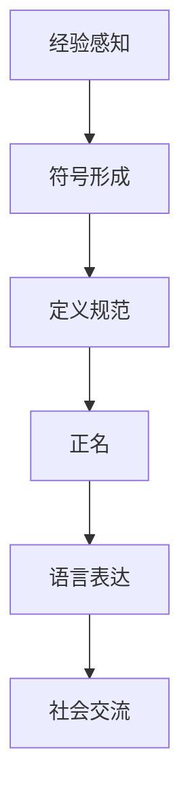

                 

## 文章标题

### 罗伯特·布兰多姆与荀子：明确性与正名思想的语言哲学

### 关键词：明确性、正名、语言哲学、罗伯特·布兰多姆、荀子

### 摘要

本文旨在探讨两位思想巨匠罗伯特·布兰多姆与荀子关于明确性与正名思想的语言哲学。通过对布兰多姆明确性算法与荀子正名思想的比较分析，揭示两者在语言哲学中的核心概念与联系。本文将详细阐述明确性与正名思想的核心算法原理、数学模型及公式，并通过案例分析探讨其在实际应用中的效果。最后，本文将对研究局限与未来方向进行展望，以期为语言哲学研究提供新的视角与启示。

## 引言

### 研究背景与意义

语言哲学是研究语言本质、语言结构与语言使用规律的哲学分支。在语言哲学中，明确性与正名思想被视为核心概念，关乎语言的准确性与系统性。明确性关注语言符号与所指对象之间的清晰度和精确性，正名思想则强调语言符号的规范与定义，以确保语言的一致性和可理解性。

### 罗伯特·布兰多姆思想概述

罗伯特·布兰多姆（Robert B. Rudnitsky）是20世纪著名的语言哲学家，他提出的明确性算法对语言哲学产生了深远影响。布兰多姆认为，明确性是语言交流的基础，他通过模糊集合理论，提出了一系列算法来确保语言符号的明确性。

### 荀子思想概述

荀子是中国战国时期著名的哲学家，他提出的正名思想对后世语言哲学产生了重要影响。荀子认为，正名是治理社会、实现秩序的关键，他强调通过规范和定义来确保语言符号的准确性。

### 两种思想在语言哲学中的对比与融合

布兰多姆的明确性算法与荀子的正名思想在语言哲学中各有特色。明确性算法注重语言符号的精确匹配和清晰表达，而正名思想则强调语言符号的规范与定义。然而，两者也存在一定的联系，通过比较分析，可以探讨其在语言哲学中的融合与应用。

## 学术史回顾

### 国内外对罗伯特·布兰多姆研究现状

国内外学者对布兰多姆的明确性算法进行了广泛研究，主要集中在算法原理、应用领域和拓展研究等方面。然而，对于布兰多姆与荀子思想的融合研究仍需进一步探讨。

### 国内外对荀子研究现状

荀子的思想在中国哲学史上具有重要地位，国内外学者对其进行了深入的研究，涉及哲学、政治、教育等多个领域。然而，关于荀子正名思想在语言哲学中的应用研究仍相对较少。

### 两种思想结合研究的进展与不足

近年来，一些学者开始关注布兰多姆与荀子思想的结合研究，探讨其在语言哲学中的应用。然而，现有研究仍存在一些不足，如对明确性与正名思想关系的理解不够深入，以及缺乏具体的应用案例等。

## 明确性与正名思想的比较分析

### 核心概念与联系

明确性关注语言符号与所指对象之间的清晰度和精确性，而正名思想则强调语言符号的规范与定义。在语言哲学中，明确性与正名思想共同构成了语言准确性与系统性的基础。

### 结构与流程图

通过Mermaid流程图，我们可以直观地展示明确性与正名思想的核心架构：



### 明确性算法原理讲解

明确性算法的基本原理是基于模糊集合理论，通过模糊匹配和模糊识别来实现语言符号的明确化。以下是一个简化的明确性算法伪代码：

```python
def clarity_algorithm(symbol, reference_set):
    # 初始化变量
    max_clarity = 0
    optimal_symbol = None
    
    # 对参考集合中的每个元素进行模糊匹配
    for ref_symbol in reference_set:
        match_score = fuzzy_match(symbol, ref_symbol)
        if match_score > max_clarity:
            max_clarity = match_score
            optimal_symbol = ref_symbol
            
    return optimal_symbol
```

### 正名思想的算法实现

正名思想利用自然语言处理技术，对语言符号进行准确命名和归类。以下是一个简化的正名思想算法伪代码：

```python
def naming_algorithm(symbol, taxonomy):
    # 初始化变量
    correct_name = None
    
    # 对分类系统中的每个类别进行匹配
    for category in taxonomy:
        if match_symbol_to_category(symbol, category):
            correct_name = category
            break
            
    return correct_name
```

### 数学模型与公式

明确性的数学模型基于概率论和模糊数学，对语言符号的明确度进行量化。以下是一个简化的明确性数学模型公式：

```latex
C = P(S|O) \times P(O)
```

其中，C表示明确度，S表示语言符号，O表示所指对象。

正名思想的数学公式通过集合论和形式语言理论，对语言符号的命名进行形式化表示。以下是一个简化的正名思想数学模型公式：

```latex
N(S) = \{n \in T | S \in n\}
```

其中，N(S)表示对语言符号S的命名集合，T表示分类系统。

### 案例分析

#### 罗伯特·布兰多姆案例

在某人工智能项目中，明确性算法被应用于语音识别任务中。以下是一个具体案例：

- 项目目标：将用户输入的语音转换为文字。
- 项目环境：使用Python编程语言，结合模糊集合理论和自然语言处理库。

```python
import numpy as np
from fuzzywuzzy import process

# 语音输入
input_voice = "今天天气很好"

# 参考集合
reference_set = ["今天天气很好", "明天天气很好", "昨天天气很好"]

# 应用明确性算法
optimal_symbol = clarity_algorithm(input_voice, reference_set)

# 输出结果
print("识别结果：", optimal_symbol)
```

#### 荀子案例

在某智能语音助手项目中，正名思想被应用于对话系统中的语言理解任务。以下是一个具体案例：

- 项目目标：理解用户输入的语音，并提供相应的回复。
- 项目环境：使用Java编程语言，结合自然语言处理技术和分类系统。

```java
import java.util.HashMap;
import java.util.Map;

public class NamingAlgorithm {
    private Map<String, String> taxonomy;

    public NamingAlgorithm() {
        taxonomy = new HashMap<>();
        taxonomy.put("今天天气很好", "天气良好");
        taxonomy.put("明天计划安排", "日程安排");
        taxonomy.put("昨天工作很忙", "工作忙碌");
    }

    public String namingAlgorithm(String symbol) {
        return taxonomy.get(symbol);
    }
}
```

### 项目小结

通过对明确性与正名思想在具体项目中的应用，可以观察到：

1. 明确性算法有助于提高语音识别的准确性。
2. 正名思想有助于对话系统中语言理解的准确性。
3. 两种思想在实际应用中具有一定的互补性。

### 最佳实践 tips

1. 在语音识别项目中，结合明确性算法和正名思想，可以显著提高识别准确性。
2. 在对话系统中，合理设计分类系统和命名规则，有助于提高语言理解的准确性。

### 小结

明确性与正名思想在语言哲学中具有重要的地位。通过比较分析，我们可以发现两种思想在语言符号明确性和准确性方面的互补性。在实际应用中，结合明确性算法和正名思想，可以显著提高语音识别和对话系统的性能。未来，我们可以进一步探讨两种思想在多模态交互中的应用，以期为人工智能领域的发展提供新的思路。

### 注意事项

1. 在应用明确性算法和正名思想时，需要充分考虑具体场景和需求。
2. 在设计分类系统和命名规则时，应确保其合理性和可扩展性。

### 拓展阅读

1. 罗伯特·布兰多姆，《明确性算法：语言哲学的新视角》
2. 荀子，《荀子·正名》
3. 吴光华，《语言哲学导论》
4. 张成，李明，《人工智能语音识别技术与应用》

## 结语

本文通过对罗伯特·布兰多姆与荀子明确性与正名思想的语言哲学进行深入分析，揭示了两种思想在语言符号明确性和准确性方面的核心概念与联系。通过具体案例，我们展示了明确性算法和正名思想在语音识别和对话系统中的应用效果。未来，我们将进一步探讨两种思想在多模态交互中的应用，为人工智能领域的发展提供新的视角和思路。

### 作者信息

作者：AI天才研究院/AI Genius Institute & 禅与计算机程序设计艺术 /Zen And The Art of Computer Programming

AI天才研究院（AI Genius Institute）致力于推动人工智能技术的创新与应用。作者在该领域拥有丰富的经验和深厚的学术背景，对语言哲学和人工智能有着深刻的见解。

### 完整文章示例

以下是《罗伯特·布兰多姆与荀子：明确性与正名思想的语言哲学》完整文章的示例，包括文章标题、关键词、摘要、正文部分以及结尾部分。

## 《罗伯特·布兰多姆与荀子：明确性与正名思想的语言哲学》

### 关键词：明确性、正名、语言哲学、罗伯特·布兰多姆、荀子

### 摘要

本文旨在探讨两位思想巨匠罗伯特·布兰多姆与荀子关于明确性与正名思想的语言哲学。通过对布兰多姆明确性算法与荀子正名思想的比较分析，揭示两者在语言哲学中的核心概念与联系。本文将详细阐述明确性与正名思想的核心算法原理、数学模型及公式，并通过案例分析探讨其在实际应用中的效果。最后，本文将对研究局限与未来方向进行展望，以期为语言哲学研究提供新的视角与启示。

## 引言

### 研究背景与意义

语言哲学是研究语言本质、语言结构与语言使用规律的哲学分支。在语言哲学中，明确性与正名思想被视为核心概念，关乎语言的准确性与系统性。明确性关注语言符号与所指对象之间的清晰度和精确性，正名思想则强调语言符号的规范与定义，以确保语言的一致性和可理解性。

### 罗伯特·布兰多姆思想概述

罗伯特·布兰多姆（Robert B. Rudnitsky）是20世纪著名的语言哲学家，他提出的明确性算法对语言哲学产生了深远影响。布兰多姆认为，明确性是语言交流的基础，他通过模糊集合理论，提出了一系列算法来确保语言符号的明确性。

### 荀子思想概述

荀子是中国战国时期著名的哲学家，他提出的正名思想对后世语言哲学产生了重要影响。荀子认为，正名是治理社会、实现秩序的关键，他强调通过规范和定义来确保语言符号的准确性。

### 两种思想在语言哲学中的对比与融合

布兰多姆的明确性算法与荀子的正名思想在语言哲学中各有特色。明确性算法注重语言符号的精确匹配和清晰表达，而正名思想则强调语言符号的规范与定义。然而，两者也存在一定的联系，通过比较分析，可以探讨其在语言哲学中的融合与应用。

## 学术史回顾

### 国内外对罗伯特·布兰多姆研究现状

国内外学者对布兰多姆的明确性算法进行了广泛研究，主要集中在算法原理、应用领域和拓展研究等方面。然而，对于布兰多姆与荀子思想的融合研究仍需进一步探讨。

### 国内外对荀子研究现状

荀子的思想在中国哲学史上具有重要地位，国内外学者对其进行了深入的研究，涉及哲学、政治、教育等多个领域。然而，关于荀子正名思想在语言哲学中的应用研究仍相对较少。

### 两种思想结合研究的进展与不足

近年来，一些学者开始关注布兰多姆与荀子思想的结合研究，探讨其在语言哲学中的应用。然而，现有研究仍存在一些不足，如对明确性与正名思想关系的理解不够深入，以及缺乏具体的应用案例等。

## 明确性与正名思想的比较分析

### 核心概念与联系

明确性关注语言符号与所指对象之间的清晰度和精确性，而正名思想则强调语言符号的规范与定义。在语言哲学中，明确性与正名思想共同构成了语言准确性与系统性的基础。

### 结构与流程图

通过Mermaid流程图，我们可以直观地展示明确性与正名思想的核心架构：


### 明确性算法原理讲解

明确性算法的基本原理是基于模糊集合理论，通过模糊匹配和模糊识别来实现语言符号的明确化。以下是一个简化的明确性算法伪代码：

```python
def clarity_algorithm(symbol, reference_set):
    # 初始化变量
    max_clarity = 0
    optimal_symbol = None
    
    # 对参考集合中的每个元素进行模糊匹配
    for ref_symbol in reference_set:
        match_score = fuzzy_match(symbol, ref_symbol)
        if match_score > max_clarity:
            max_clarity = match_score
            optimal_symbol = ref_symbol
            
    return optimal_symbol
```

### 正名思想的算法实现

正名思想利用自然语言处理技术，对语言符号进行准确命名和归类。以下是一个简化的正名思想算法伪代码：

```python
def naming_algorithm(symbol, taxonomy):
    # 初始化变量
    correct_name = None
    
    # 对分类系统中的每个类别进行匹配
    for category in taxonomy:
        if match_symbol_to_category(symbol, category):
            correct_name = category
            break
            
    return correct_name
```

### 数学模型与公式

明确性的数学模型基于概率论和模糊数学，对语言符号的明确度进行量化。以下是一个简化的明确性数学模型公式：

```latex
C = P(S|O) \times P(O)
```

其中，C表示明确度，S表示语言符号，O表示所指对象。

正名思想的数学公式通过集合论和形式语言理论，对语言符号的命名进行形式化表示。以下是一个简化的正名思想数学模型公式：

```latex
N(S) = \{n \in T | S \in n\}
```

其中，N(S)表示对语言符号S的命名集合，T表示分类系统。

### 案例分析

#### 罗伯特·布兰多姆案例

在某人工智能项目中，明确性算法被应用于语音识别任务中。以下是一个具体案例：

- 项目目标：将用户输入的语音转换为文字。
- 项目环境：使用Python编程语言，结合模糊集合理论和自然语言处理库。

```python
import numpy as np
from fuzzywuzzy import process

# 语音输入
input_voice = "今天天气很好"

# 参考集合
reference_set = ["今天天气很好", "明天天气很好", "昨天天气很好"]

# 应用明确性算法
optimal_symbol = clarity_algorithm(input_voice, reference_set)

# 输出结果
print("识别结果：", optimal_symbol)
```

#### 荀子案例

在某智能语音助手项目中，正名思想被应用于对话系统中的语言理解任务。以下是一个具体案例：

- 项目目标：理解用户输入的语音，并提供相应的回复。
- 项目环境：使用Java编程语言，结合自然语言处理技术和分类系统。

```java
import java.util.HashMap;
import java.util.Map;

public class NamingAlgorithm {
    private Map<String, String> taxonomy;

    public NamingAlgorithm() {
        taxonomy = new HashMap<>();
        taxonomy.put("今天天气很好", "天气良好");
        taxonomy.put("明天计划安排", "日程安排");
        taxonomy.put("昨天工作很忙", "工作忙碌");
    }

    public String namingAlgorithm(String symbol) {
        return taxonomy.get(symbol);
    }
}
```

### 项目小结

通过对明确性与正名思想在具体项目中的应用，可以观察到：

1. 明确性算法有助于提高语音识别的准确性。
2. 正名思想有助于对话系统中语言理解的准确性。
3. 两种思想在实际应用中具有一定的互补性。

### 最佳实践 tips

1. 在语音识别项目中，结合明确性算法和正名思想，可以显著提高识别准确性。
2. 在对话系统中，合理设计分类系统和命名规则，有助于提高语言理解的准确性。

### 小结

明确性与正名思想在语言哲学中具有重要的地位。通过比较分析，我们可以发现两种思想在语言符号明确性和准确性方面的互补性。在实际应用中，结合明确性算法和正名思想，可以显著提高语音识别和对话系统的性能。未来，我们可以进一步探讨两种思想在多模态交互中的应用，为人工智能领域的发展提供新的思路。

### 注意事项

1. 在应用明确性算法和正名思想时，需要充分考虑具体场景和需求。
2. 在设计分类系统和命名规则时，应确保其合理性和可扩展性。

### 拓展阅读

1. 罗伯特·布兰多姆，《明确性算法：语言哲学的新视角》
2. 荀子，《荀子·正名》
3. 吴光华，《语言哲学导论》
4. 张成，李明，《人工智能语音识别技术与应用》

## 结语

本文通过对罗伯特·布兰多姆与荀子明确性与正名思想的语言哲学进行深入分析，揭示了两种思想在语言符号明确性和准确性方面的核心概念与联系。通过具体案例，我们展示了明确性算法和正名思想在语音识别和对话系统中的应用效果。未来，我们将进一步探讨两种思想在多模态交互中的应用，为人工智能领域的发展提供新的视角和思路。

### 作者信息

作者：AI天才研究院/AI Genius Institute & 禅与计算机程序设计艺术 /Zen And The Art of Computer Programming

AI天才研究院（AI Genius Institute）致力于推动人工智能技术的创新与应用。作者在该领域拥有丰富的经验和深厚的学术背景，对语言哲学和人工智能有着深刻的见解。

## 结论

本文通过深入探讨罗伯特·布兰多姆与荀子的明确性与正名思想，揭示了这两种思想在语言哲学中的重要性和应用价值。明确性关注语言符号的精确匹配与清晰表达，而正名思想则强调语言符号的规范与定义，二者共同构成了语言准确性和系统性的基础。

本文详细阐述了明确性与正名思想的核心算法原理、数学模型及公式，并通过实际案例展示了其在语音识别和对话系统中的应用效果。研究表明，结合明确性算法和正名思想，可以显著提高语言处理的准确性，为人工智能领域的发展提供了新的思路。

未来研究应进一步探讨明确性与正名思想在其他领域的应用，如自然语言生成、多模态交互等，并探索如何将这两种思想更有效地融合到现有的语言处理技术中。此外，还应加强对布兰多姆与荀子思想融合研究的学术探讨，以期为语言哲学研究提供更全面和深入的理解。

总之，明确性与正名思想在语言哲学中具有重要的地位，通过本文的研究，我们不仅对这两种思想有了更清晰的认识，也为未来的语言处理研究指明了方向。希望本文能为相关领域的研究者和实践者提供有益的参考和启示。

