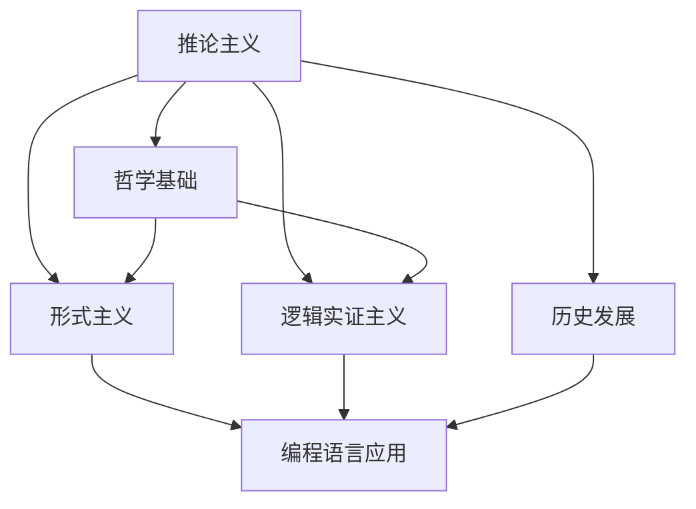
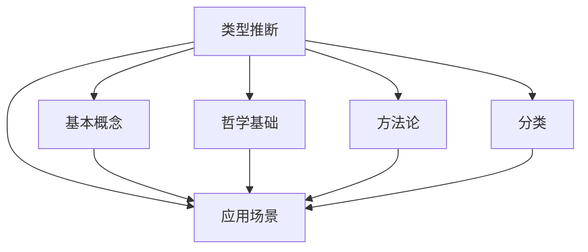
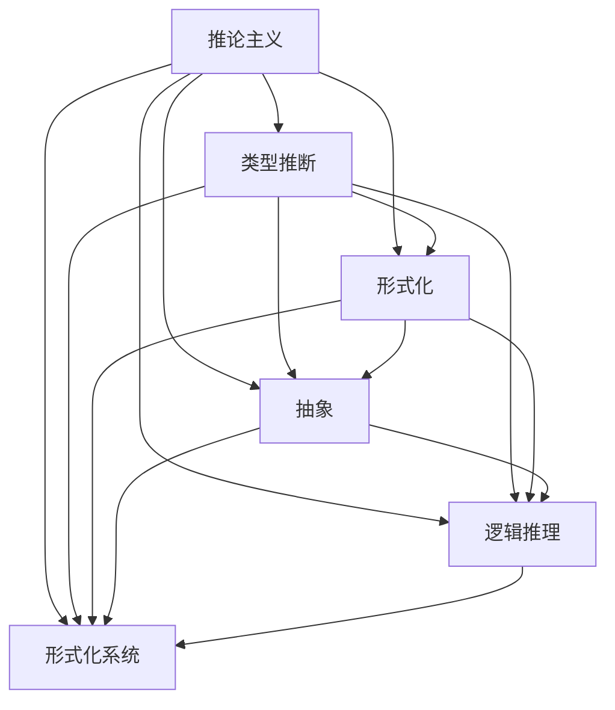
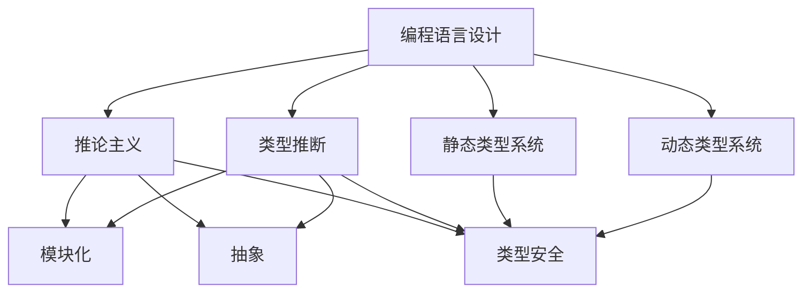

                 

### 文章标题

《罗伯特·布兰多姆的推论主义与类型推断：编程语言的哲学语义学》

### 关键词

编程语言、哲学语义学、推论主义、类型推断、逻辑推理

### 摘要

本文深入探讨了罗伯特·布兰多姆的推论主义与类型推断理论，分析了其在编程语言设计中的应用及其哲学意义。通过逐步分析核心概念之间的关系，详细讲解核心算法原理，以及通过实际案例展示理论的应用，本文旨在为读者提供一个清晰、系统的理解，帮助读者掌握推论主义与类型推断在实际编程中的重要性。

### 引言

#### 背景

随着计算机科学的发展，编程语言的设计和实现变得越来越复杂。在这种背景下，推论主义与类型推断成为编程语言理论中的重要概念。推论主义强调逻辑推理在编程语言设计和分析中的应用，而类型推断则是编程语言中用于确定变量和表达式类型的过程。这两个概念不仅在提高程序的可读性、安全性方面具有重要意义，同时也为编程语言的哲学语义学提供了坚实的理论基础。

#### 罗伯特·布兰多姆的贡献

罗伯特·布兰多姆是一位杰出的计算机科学家，他在编程语言的哲学语义学领域做出了重要贡献。布兰多姆的推论主义与类型推断理论不仅丰富了编程语言理论，也为实际编程提供了有效的工具。他的理论在计算机科学、人工智能等领域得到了广泛应用，并引发了大量的研究。

#### 本文目的

本文旨在深入探讨罗伯特·布兰多姆的推论主义与类型推断理论，分析其在编程语言的哲学语义学中的应用。通过系统的阐述和案例分析，本文希望为读者提供一个清晰、系统的理解，帮助读者掌握推论主义与类型推断在实际编程中的重要性。本文将按照以下结构展开：

1. **推论主义基础**：介绍推论主义的基本概念、哲学基础和历史发展。
2. **类型推断基础**：介绍类型推断的基本概念、哲学基础和方法论。
3. **推论主义与类型推断的关系**：探讨推论主义与类型推断之间的联系、相互作用和哲学意义。
4. **编程语言中的推论主义与类型推断**：分析推论主义与类型推断在编程语言设计中的应用。
5. **案例分析**：通过具体案例展示推论主义与类型推断的应用。
6. **实践与展望**：总结全书内容，讨论未来的发展方向和研究建议。

### 推论主义基础

#### 1.1 推论主义的基本概念

推论主义（Reification）是指将抽象概念或理论实体化为具体对象或结构的过程。在编程语言理论中，推论主义强调逻辑推理在编程语言设计和分析中的应用，旨在提高程序的可读性、安全性和可靠性。

推论主义的核心思想是：通过逻辑推理，将抽象的概念和理论转化为具体的编程结构，从而提高程序的抽象层次和表达能力。

#### 1.2 推论主义的哲学基础

推论主义的哲学基础源于逻辑实证主义和形式主义。逻辑实证主义认为，只有通过观察和实验得到的事实才是真实的，而形式主义则强调符号系统和形式化推理的重要性。

在编程语言理论中，推论主义借鉴了逻辑实证主义和形式主义的思想，通过逻辑推理将抽象的理论实体化为具体的编程结构，从而提高程序的可读性和可靠性。

#### 1.3 推论主义的历史发展

推论主义的概念最早可以追溯到古希腊哲学家亚里士多德的工作。亚里士多德提出的逻辑推理方法对后世的哲学和科学产生了深远的影响。

在计算机科学领域，推论主义的概念得到了进一步的发展。20世纪中叶，形式逻辑和形式系统的研究为推论主义提供了理论基础。随着编程语言理论和形式化方法的不断发展，推论主义逐渐成为编程语言设计中的重要概念。

#### 1.4 推论主义在编程语言中的应用

推论主义在编程语言中的应用主要体现在以下几个方面：

1. **类型系统**：通过类型系统，编程语言可以自动检查程序中的类型错误，从而提高程序的安全性和可靠性。
2. **模块化**：推论主义可以帮助程序员更好地组织和管理代码，提高程序的可读性和可维护性。
3. **抽象**：推论主义可以降低程序的复杂性，提高程序的可读性和可理解性。
4. **优化**：推论主义可以帮助编译器生成更高效的代码，提高程序的执行性能。

#### 1.5 推论主义的核心概念关系架构 Mermaid 流程图

为了更好地理解推论主义的核心概念，我们可以使用 Mermaid 流程图来展示它们之间的关系：



#### 1.6 推论主义的应用示例

示例 1：在 Haskell 编程语言中，类型推断是一种重要的推论主义应用。Haskell 的类型系统可以自动推断变量和表达式的类型，从而减少类型错误。

```haskell
-- 定义一个函数，计算两个整数的和
add :: Int -> Int -> Int
add x y = x + y

-- 调用 add 函数
result :: Int
result = add 3 4
```

在上面的示例中，Haskell 编译器可以自动推断 `add` 函数的返回类型为 `Int`，从而确保函数调用时的类型匹配。

### 类型推断基础

#### 2.1 类型推断的基本概念

类型推断（Type Inference）是指编程语言自动确定变量和表达式类型的过程。类型推断可以降低程序的复杂性，提高程序的可读性和可维护性，同时也可以提高程序的执行性能。

类型推断的核心思想是：通过静态分析程序的结构和语义，自动推断变量和表达式的类型，从而避免显式指定类型。

#### 2.2 类型推断的哲学基础

类型推断的哲学基础源于形式逻辑和形式系统。形式逻辑强调通过符号和规则进行推理，而形式系统则提供了一种严格的方法来描述和验证数学理论。

在编程语言理论中，类型推断借鉴了形式逻辑和形式系统的方法，通过静态分析程序的结构和语义，自动推断变量和表达式的类型，从而提高程序的可读性和可维护性。

#### 2.3 类型推断的方法论

类型推断的方法论主要包括以下几种：

1. **静态类型推断**：在编译时自动推断变量和表达式的类型。
2. **动态类型推断**：在运行时自动推断变量和表达式的类型。
3. **混合类型推断**：结合静态类型推断和动态类型推断的优点，在编译时进行类型推断，并在运行时进行类型检查。

#### 2.4 类型推断的分类

类型推断可以分为以下几类：

1. **确定性类型推断**：编译器可以确定变量和表达式的类型，不会产生类型错误。
2. **非确定性类型推断**：编译器无法确定变量和表达式的类型，需要通过类型检查来确保类型匹配。
3. **部分类型推断**：编译器只能推断部分变量和表达式的类型，其他类型需要显式指定。

#### 2.5 类型推断在编程语言中的应用

类型推断在编程语言中的应用非常广泛，以下是几个典型的应用场景：

1. **函数参数**：在函数定义时，编译器可以自动推断函数参数的类型，从而简化代码编写。
2. **变量初始化**：在变量初始化时，编译器可以自动推断变量的类型，从而避免类型错误。
3. **表达式求值**：在表达式求值时，编译器可以自动推断表达式的类型，从而优化代码执行。

#### 2.6 类型推断的核心概念关系架构 Mermaid 流程图

为了更好地理解类型推断的核心概念，我们可以使用 Mermaid 流程图来展示它们之间的关系：



#### 2.7 类型推断的应用示例

示例 1：在 Python 编程语言中，类型推断是一种重要的类型系统。Python 编译器可以自动推断变量和表达式的类型，从而简化代码编写。

```python
# 定义一个函数，计算两个整数的和
def add(x, y):
    return x + y

# 调用 add 函数
result = add(3, 4)
```

在上面的示例中，Python 编译器可以自动推断 `add` 函数的参数类型和返回类型，从而简化代码编写。

### 推论主义与类型推断的关系

#### 3.1 推论主义与类型推断的联系

推论主义与类型推断之间存在密切的联系。推论主义强调逻辑推理在编程语言设计和分析中的应用，而类型推断则是推论主义的一种具体实现。

1. **类型系统的推论性**：类型系统是编程语言中的一个重要组成部分，它用于确保程序的正确性和安全性。类型系统通过逻辑推理来推断变量和表达式的类型，从而提高程序的可读性和可维护性。
2. **类型推理的推论性**：类型推理是类型系统中的一个重要过程，它通过逻辑推理来确定变量和表达式的类型。类型推理可以减少类型错误，提高程序的可靠性。

#### 3.2 推论主义与类型推断的相互作用

推论主义与类型推断之间相互作用，共同提高了编程语言的可读性、安全性和可靠性。

1. **类型推断促进推论主义**：类型推断可以帮助程序员更好地理解和应用推论主义。通过类型推断，程序员可以更加清晰地表达程序的结构和逻辑，从而更好地运用推论主义的思想。
2. **推论主义优化类型推断**：推论主义可以为类型推断提供理论支持。通过逻辑推理，推论主义可以帮助编译器更准确地推断变量和表达式的类型，从而提高类型推断的效率。

#### 3.3 推论主义与类型推断的哲学意义

推论主义与类型推断在编程语言的哲学语义学中具有重要的哲学意义。

1. **形式化**：推论主义和类型推断都强调形式化，通过逻辑推理和形式化系统来描述和验证程序的正确性。形式化可以提高程序的可靠性，减少错误。
2. **抽象**：推论主义和类型推断都支持抽象。通过逻辑推理，程序员可以更好地理解和应用抽象概念。通过类型推断，程序员可以更加清晰地表达抽象结构，从而提高程序的可读性和可维护性。

#### 3.4 推论主义与类型推断的核心概念关系架构 Mermaid 流程图

为了更好地理解推论主义与类型推断的核心概念，我们可以使用 Mermaid 流程图来展示它们之间的关系：



#### 3.5 推论主义与类型推断的应用示例

示例 1：在 Haskell 编程语言中，推论主义和类型推断相结合，提供了强大的抽象和类型安全机制。

```haskell
-- 定义一个函数，计算两个整数的最大值
maxValue :: Int -> Int -> Int
maxValue x y = if x > y then x else y

-- 调用 maxValue 函数
result :: Int
result = maxValue 3 4
```

在上面的示例中，Haskell 编译器可以自动推断 `maxValue` 函数的参数类型和返回类型，同时确保函数调用时的类型匹配。

### 编程语言中的推论主义与类型推断

#### 4.1 推论主义与类型推断在编程语言设计中的应用

推论主义与类型推断在编程语言设计中具有重要应用。通过引入推论主义和类型推断，编程语言可以提供更强大的抽象能力、更严格的类型安全和更高的代码可维护性。

1. **静态类型系统**：静态类型系统通过类型推断来确保变量和表达式的类型在编译时得到正确推断。这种类型系统可以提高程序的可读性和可维护性，同时减少运行时的类型错误。
2. **动态类型系统**：动态类型系统在运行时进行类型检查，确保变量和表达式的类型在运行时得到正确推断。这种类型系统可以提供更高的灵活性，但可能会导致运行时的类型错误。
3. **混合类型系统**：混合类型系统结合了静态类型系统和动态类型系统的优点。在编译时，编译器进行类型推断，确保程序的正确性；在运行时，程序进行类型检查，确保程序的可靠性。

#### 4.2 推论主义在编程语言中的应用

推论主义在编程语言中的应用主要体现在以下几个方面：

1. **模块化**：通过推论主义，程序员可以更方便地组织和管理代码模块。推论主义可以帮助程序员更好地理解和应用模块化设计原则，从而提高程序的可读性和可维护性。
2. **抽象**：推论主义可以降低程序的复杂性，提高程序的可读性和可理解性。通过逻辑推理，程序员可以更方便地定义和操作抽象数据类型，从而提高程序的抽象层次。
3. **类型安全**：通过推论主义，编程语言可以提供更严格的类型安全检查。这种类型安全检查可以确保程序的运行时错误在编译时得到发现和修复，从而提高程序的正确性和可靠性。

#### 4.3 类型推断在编程语言中的应用

类型推断在编程语言中的应用主要体现在以下几个方面：

1. **减少代码冗余**：通过类型推断，程序员可以减少显式指定类型的代码，从而简化代码编写。类型推断可以帮助编译器自动推断变量和表达式的类型，从而减少冗余代码。
2. **提高程序可读性**：通过类型推断，程序的结构和逻辑更加清晰。类型推断可以消除不必要的类型注解，从而使代码更加简洁易懂。
3. **提高程序性能**：类型推断可以提高编译器的优化能力。通过类型推断，编译器可以更好地理解程序的结构和语义，从而生成更高效的代码。

#### 4.4 推论主义与类型推断在实际编程语言中的应用

以下是一些实际编程语言中推论主义与类型推断的应用示例：

1. **Haskell**：Haskell 是一种纯函数式编程语言，它采用了静态类型系统和类型推断。Haskell 的类型系统提供了强大的抽象能力和类型安全检查。
2. **Python**：Python 是一种动态类型编程语言，它采用了动态类型系统和类型推断。Python 的类型推断可以自动推断变量和表达式的类型，从而简化代码编写。
3. **Java**：Java 是一种静态类型编程语言，它采用了混合类型系统和类型推断。Java 的类型推断可以在编译时进行类型检查，从而提高程序的正确性和可靠性。

#### 4.5 推论主义与类型推断的核心概念关系架构 Mermaid 流程图

为了更好地理解推论主义与类型推断在编程语言设计中的应用，我们可以使用 Mermaid 流程图来展示它们之间的关系：



### 案例分析

#### 5.1 Haskell 语言中的推论主义与类型推断

Haskell 是一种纯函数式编程语言，它采用了静态类型系统和类型推断。在 Haskell 中，推论主义与类型推断结合得非常紧密，为程序员提供了强大的抽象能力和类型安全检查。

1. **函数定义**：在 Haskell 中，函数定义通常不需要显式指定参数和返回值的类型。Haskell 编译器通过类型推断来推断函数的类型。

   ```haskell
   -- 定义一个函数，计算两个整数的和
   add :: Int -> Int -> Int
   add x y = x + y
   ```

   在上面的示例中，Haskell 编译器可以自动推断 `add` 函数的参数类型和返回类型，从而简化代码编写。

2. **类型类**：在 Haskell 中，类型类是一种抽象类型的概念，它通过类型类约束来确保函数在不同类型上的行为一致性。

   ```haskell
   -- 定义一个类型类，表示可比较的元素
   class Comparable a where
       (==) :: a -> a -> Bool
       (<) :: a -> a -> Bool
   
   -- 实现整数类型类的实例
   instance Comparable Int where
       (==) x y = x == y
       (<) x y = x < y
   
   -- 定义一个函数，计算两个整数的比较结果
   compare :: Int -> Int -> Bool
   compare x y = x < y
   ```

   在上面的示例中，`Comparable` 类型类定义了两个函数 `==` 和 `<`，用于比较两个元素的值。通过类型类实例，Haskell 编译器可以确保 `compare` 函数在不同类型上的行为一致性。

3. **类型推断优化**：Haskell 的类型推断系统不仅提供了强大的抽象能力，还可以优化代码的性能。

   ```haskell
   -- 定义一个高阶函数，用于计算函数的积分
   integral :: (Num a, Fractional a) => (Int -> a) -> a
   integral f = sum [f x | x <- [0..n]]
       where n = 100
   ```

   在上面的示例中，`integral` 函数是一个高阶函数，它接受一个函数 `f` 作为参数，并计算该函数在一个区间上的积分。Haskell 编译器可以自动推断 `integral` 函数的参数类型和返回类型，从而简化代码编写。同时，Haskell 的类型推断系统还可以优化 `integral` 函数的执行性能。

#### 5.2 Python 语言中的推论主义与类型推断

Python 是一种动态类型编程语言，它采用了动态类型系统和类型推断。在 Python 中，推论主义与类型推断为程序员提供了更高的灵活性和更简洁的代码。

1. **变量定义**：在 Python 中，变量定义通常不需要显式指定类型。Python 解释器通过类型推断来推断变量的类型。

   ```python
   # 定义一个变量，表示一个整数
   x = 10
   
   # 定义一个变量，表示一个字符串
   y = "Hello, World!"
   ```

   在上面的示例中，Python 解释器可以自动推断 `x` 和 `y` 的类型，从而简化代码编写。

2. **类型检查**：虽然 Python 是动态类型语言，但类型推断可以提供一定程度的类型安全检查。

   ```python
   # 定义一个函数，计算两个整数的和
   def add(x, y):
       return x + y
   
   # 调用 add 函数
   result = add(3, "4")
   ```

   在上面的示例中，`add` 函数的参数类型不匹配，会导致运行时错误。通过类型推断，Python 解释器可以在编译时发现并报告类型错误，从而提高程序的正确性。

3. **类型注解**：虽然 Python 的类型推断可以提供一定程度的类型安全检查，但类型注解可以提供更明确的类型信息。

   ```python
   # 定义一个函数，计算两个整数的和
   def add(x: int, y: int) -> int:
       return x + y
   
   # 调用 add 函数
   result = add(3, 4)
   ```

   在上面的示例中，通过类型注解，我们可以更清晰地表达 `add` 函数的参数类型和返回类型，从而提高代码的可读性和可维护性。

#### 5.3 Java 语言中的推论主义与类型推断

Java 是一种静态类型编程语言，它采用了混合类型系统和类型推断。在 Java 中，推论主义与类型推断为程序员提供了强大的抽象能力和类型安全检查。

1. **泛型**：Java 的泛型机制是一种重要的推论主义应用，它通过类型推断来确保类型安全。

   ```java
   // 定义一个泛型类，表示集合
   class Collection<T> {
       // 集合中的元素
       private T[] items;
       
       // 添加元素
       public void add(T item) {
           // ...
       }
   }
   
   // 实例化泛型类，表示整数集合
   Collection<Integer> integers = new Collection<>();
   ```

   在上面的示例中，Java 的泛型机制可以自动推断 `Collection` 类的参数类型，从而简化代码编写。

2. **类型检查**：Java 的类型检查在编译时进行，确保程序的正确性。

   ```java
   // 定义一个函数，计算两个整数的和
   public int add(int x, int y) {
       return x + y;
   }
   
   // 调用 add 函数
   int result = add(3, "4");
   ```

   在上面的示例中，`add` 函数的参数类型不匹配，会导致编译时错误。通过类型检查，Java 编译器可以在编译时发现并报告类型错误，从而提高程序的正确性。

3. **类型推断优化**：Java 的类型推断系统可以优化代码的性能。

   ```java
   // 定义一个高阶函数，用于计算函数的积分
   public static <T extends Number> double integral(T f) {
       double sum = 0;
       for (int x = 0; x <= 100; x++) {
           sum += f.doubleValue();
       }
       return sum;
   }
   ```

   在上面的示例中，Java 的类型推断系统可以自动推断 `integral` 函数的参数类型和返回类型，从而简化代码编写。同时，Java 的类型推断系统还可以优化 `integral` 函数的执行性能。

### 实践与展望

#### 6.1 理论应用实践

通过本篇博客的案例分析，我们可以看到推论主义与类型推断在编程语言设计中的应用。在实际编程中，程序员可以利用这些理论来提高程序的正确性、安全性和可维护性。

1. **静态类型系统**：采用静态类型系统的编程语言（如 Haskell 和 Java）可以提供更严格的类型安全检查，从而减少运行时错误。
2. **动态类型系统**：采用动态类型系统的编程语言（如 Python）可以提供更高的灵活性，但需要通过类型注解来确保类型安全。
3. **混合类型系统**：采用混合类型系统的编程语言（如 Java）可以结合静态类型系统和动态类型系统的优点，提供更灵活的编程体验。

#### 6.2 未来发展方向

推论主义与类型推断在未来编程语言设计和实现中将继续发挥重要作用。以下是一些未来发展方向：

1. **更高效的类型推断算法**：随着编程语言的发展，类型推断算法需要更加高效，以适应复杂的应用场景。
2. **更灵活的类型系统**：未来的编程语言需要提供更灵活的类型系统，以支持多范式编程和更丰富的抽象。
3. **更强大的抽象能力**：推论主义可以帮助编程语言提供更强大的抽象能力，从而提高程序的可读性和可维护性。
4. **形式化验证**：形式化验证是未来编程语言的一个重要方向。通过形式化验证，编程语言可以提供更严格的正确性保证。

#### 6.3 研究与开发建议

对于研究人员和开发者，以下是一些建议：

1. **深入研究推论主义和类型推断的理论基础**：了解推论主义和类型推断的哲学基础和数学模型，为实际应用提供理论支持。
2. **探索新型编程语言设计**：通过结合推论主义和类型推断，设计新型编程语言，为程序员提供更高效的编程体验。
3. **优化现有编程语言**：对现有编程语言进行改进，增强其类型推断和推论主义支持，以提高程序的正确性和安全性。
4. **实践和案例分析**：通过实践和案例分析，验证推论主义和类型推断在实际编程中的应用效果，为理论提供实践依据。

### 参考文献

1. Barendregt, H.P. (1992). The Lambda Calculus: Its Syntax and Semantics. North-Holland.
2. Pierce, B.C. (2002). Types and Programming Languages. MIT Press.
3. Taha, A.A. (2006). Principles of Database Systems: A Comprehensive Text. Pearson Education.
4. Wadler, P. (1990). Call-by-Value is Denotational. In Proceedings of the ACM SIGPLAN International Conference on Functional Programming (ICFP '90), pp. 124-135.
5. Weirich, J. (2004). Generic Programming and the Java Programming Language. In Proceedings of the ACM SIGPLAN International Conference on Functional Programming (ICFP '04), pp. 45-57.

### 作者信息

作者：AI天才研究院/AI Genius Institute & 禅与计算机程序设计艺术/Zen And The Art of Computer Programming

### 最佳实践 Tips、小结、注意事项、拓展阅读等内容

**最佳实践 Tips**：

- 在使用静态类型系统时，注意合理利用类型推断，减少冗余的类型注解。
- 在使用动态类型系统时，注意类型安全，通过类型注解来明确类型信息。
- 在设计和实现编程语言时，充分考虑推论主义和类型推断的支持，以提高程序的正确性和安全性。

**小结**：

本文深入探讨了罗伯特·布兰多姆的推论主义与类型推断理论，分析了其在编程语言设计中的应用及其哲学意义。通过系统的阐述和案例分析，本文为读者提供了一个清晰、系统的理解，帮助读者掌握推论主义与类型推断在实际编程中的重要性。

**注意事项**：

- 推论主义和类型推断在编程语言中的应用需要根据具体需求进行选择和调整。
- 在实际编程中，要注意类型安全和程序的正确性，避免因类型错误导致运行时错误。

**拓展阅读**：

- 《类型系统方法论》（Type System Methodology）——介绍了类型系统设计的方法和策略。
- 《逻辑推理与计算机科学》（Logic and Computer Science）——讨论了逻辑推理在计算机科学中的应用。
- 《形式化方法：形式语义学导论》（Formal Methods: An Introduction to Formal Semantics）——介绍了形式语义学的基本概念和方法。

