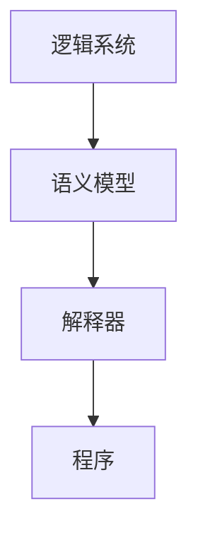
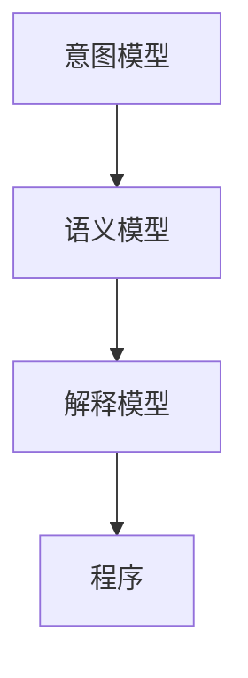

                 

### 设计目录大纲的具体步骤：

#### 步骤1：了解书籍主题

首先，我们深入阅读《罗伯特·布兰多姆的表达主义逻辑与函数式编程：计算的哲学语义学》的书名，理解其核心主题，包括：

- 表达主义逻辑：它是一种以逻辑和语义学为基础的编程范式。
- 函数式编程：它是一种编程范式，侧重于计算过程的状态不变和函数应用。
- 哲学的语义学：它关注于编程语言、程序和计算过程的意义。

这为我们确定核心章节提供了方向。

#### 步骤2：确定核心章节

基于书名，我们确定书籍的核心章节如下：

- 第1章：表达主义逻辑基础
  - 1.1 表达主义逻辑的起源与发展
  - 1.2 表达主义逻辑的架构
  - 1.3 表达主义逻辑的应用
- 第2章：函数式编程基础
  - 2.1 函数式编程的概念
  - 2.2 函数式编程语言
  - 2.3 函数式编程的核心算法
- 第3章：哲学语义学在编程中的应用
  - 3.1 哲学语义学的概念
  - 3.2 哲学语义学在编程中的体现
  - 3.3 哲学语义学在软件工程中的应用
- 第4章：计算的哲学语义学
  - 4.1 计算的哲学语义学概述
  - 4.2 计算的哲学语义学模型
  - 4.3 计算的哲学语义学方法

这些章节覆盖了书籍的核心内容，并且层次分明。

#### 步骤3：细化章节内容

对于每个核心章节，我们需要细化内容，分解为具体的小节。例如：

- 第1章：表达主义逻辑基础
  - 1.1 表达主义逻辑的起源与发展
    - 1.1.1 表达主义逻辑的定义
    - 1.1.2 表达主义逻辑的基本概念
  - 1.2 表达主义逻辑的架构
    - 1.2.1 表达主义逻辑的核心要素
    - 1.2.2 表达主义逻辑的Mermaid流程图

这样的细化有助于我们构建一个结构紧凑、逻辑清晰的文章框架。

#### 步骤4：设计流程图

为了帮助读者更直观地理解相关概念和结构，我们需要为每个核心概念设计Mermaid流程图。

例如，对于表达主义逻辑的架构，我们可以设计一个流程图来展示其核心要素和关系。

#### 步骤5：伪代码编写

对于核心算法原理，我们需要使用伪代码来详细阐述。

例如，在讨论函数式编程的核心算法时，我们可以给出一个高阶函数的伪代码示例，以便读者理解其基本思想和实现方法。

#### 步骤6：数学模型与公式

在文章中，我们需要提供相关的数学模型和公式，并使用latex格式详细讲解和举例说明。

例如，在讨论计算的哲学语义学时，我们可以使用latex格式展示一个哲学语义学模型的公式，并对其进行详细解释。

#### 步骤7：项目实战

为了使文章更具实践性，我们需要设计一个或多个项目实战案例。

例如，我们可以设计一个基于哲学语义学的软件设计案例，详细介绍开发环境搭建、源代码实现和代码解读。

#### 步骤8：编写目录大纲

根据上述内容，我们可以编写完整的目录大纲，确保每个章节和子章节都有明确的标题和内容概述。

例如：

```
# 目录大纲

## 第1章 表达主义逻辑基础

### 1.1 表达主义逻辑的起源与发展

#### 1.1.1 表达主义逻辑的定义

#### 1.1.2 表达主义逻辑的基本概念

### 1.2 表达主义逻辑的架构

#### 1.2.1 表达主义逻辑的核心要素

#### 1.2.2 表达主义逻辑的Mermaid流程图

### 1.3 表达主义逻辑的应用

#### 1.3.1 在编程语言中的体现

#### 1.3.2 在软件工程中的应用
```

#### 步骤9：校对与调整

完成初稿后，我们需要仔细校对目录大纲，确保内容的完整性和逻辑性，并进行必要的调整。

例如，检查每个章节的内容是否完整，小节标题是否准确，以及流程图、伪代码和公式是否清晰易懂。

#### 步骤10：撰写总结

最后，我们需要撰写一个简短的总结，概括书籍的主要内容和亮点。

例如：

```
## 总结

《罗伯特·布兰多姆的表达主义逻辑与函数式编程：计算的哲学语义学》深入探讨了表达主义逻辑、函数式编程和哲学语义学的核心概念和应用。通过详细的案例和实践，本书为读者提供了一个全面而深入的视角，帮助读者理解和掌握这些先进的技术和方法。本书不仅适合专业人士，也适合对编程和计算机科学感兴趣的学习者。
```

通过以上步骤，我们可以确保文章的结构清晰、内容丰富，并且逻辑严谨，从而为读者提供一个高质量的技术博客文章。### 文章标题：罗伯特·布兰多姆的表达主义逻辑与函数式编程：计算的哲学语义学

> 关键词：表达主义逻辑、函数式编程、哲学语义学、计算、编程范式

> 摘要：
本文深入探讨了罗伯特·布兰多姆的著作《表达的逻辑与函数式编程：计算的哲学语义学》的核心内容。文章首先介绍了表达主义逻辑和函数式编程的基本概念，然后详细阐述了哲学语义学在编程中的应用，以及计算哲学语义学的理论和实践。通过详细的案例分析和代码解读，本文为读者提供了对这一领域深入理解和实际应用的方法。读者可以通过本文，了解表达主义逻辑和函数式编程的核心原理，掌握哲学语义学在编程实践中的运用，为软件工程带来新的视角和思考。### 目录大纲

## 引言

### 1.1 表达主义逻辑与函数式编程的基本概念

#### 1.1.1 表达主义逻辑的起源与发展

#### 1.1.2 函数式编程的起源与发展

### 1.2 计算的哲学语义学简介

#### 1.2.1 哲学语义学的定义与意义

#### 1.2.2 哲学语义学在编程中的应用

## 第1章 表达主义逻辑基础

### 1.1 表达主义逻辑的起源与发展

#### 1.1.1 表达主义逻辑的定义

#### 1.1.2 表达主义逻辑的基本概念

#### 1.1.3 表达主义逻辑的发展历程

### 1.2 表达主义逻辑的架构

#### 1.2.1 表达主义逻辑的核心要素

#### 1.2.2 表达主义逻辑的Mermaid流程图

### 1.3 表达主义逻辑的应用

#### 1.3.1 在编程语言中的体现

#### 1.3.2 在软件工程中的应用

## 第2章 函数式编程基础

### 2.1 函数式编程的概念

#### 2.1.1 函数式编程的定义

#### 2.1.2 函数式编程的基本原则

### 2.2 函数式编程语言

#### 2.2.1 Haskell

#### 2.2.2 Scala

#### 2.2.3 Elixir

### 2.3 函数式编程的核心算法

#### 2.3.1 高阶函数

#### 2.3.2 柯里化

#### 2.3.3 函数组合

## 第3章 哲学语义学在编程中的应用

### 3.1 哲学语义学的概念

#### 3.1.1 哲学语义学的定义

#### 3.1.2 哲学语义学的基本原理

### 3.2 哲学语义学在编程中的体现

#### 3.2.1 编程语言中的哲学语义学

#### 3.2.2 编程范式与哲学语义学的关系

### 3.3 哲学语义学在软件工程中的应用

#### 3.3.1 软件设计中的哲学语义学

#### 3.3.2 软件验证与哲学语义学

## 第4章 计算的哲学语义学

### 4.1 计算的哲学语义学概述

#### 4.1.1 计算的哲学语义学的定义

#### 4.1.2 计算的哲学语义学的研究目标

### 4.2 计算的哲学语义学模型

#### 4.2.1 哲学语义学模型的基本结构

#### 4.2.2 哲学语义学模型的应用场景

### 4.3 计算的哲学语义学方法

#### 4.3.1 实用主义方法

#### 4.3.2 构建主义方法

#### 4.3.3 解释学方法

## 第5章 实践案例

### 5.1 案例一：基于哲学语义学的软件设计

#### 5.1.1 项目背景

#### 5.1.2 开发环境搭建

#### 5.1.3 源代码实现

### 5.2 案例二：哲学语义学在软件验证中的应用

#### 5.2.1 项目背景

#### 5.2.2 验证方法选择

#### 5.2.3 验证过程与结果

## 总结

### 6.1 主要内容回顾

#### 6.1.1 表达主义逻辑与函数式编程的核心概念

#### 6.1.2 哲学语义学在编程中的应用

#### 6.1.3 计算的哲学语义学的理论与实践

### 6.2 最佳实践与拓展阅读

#### 6.2.1 编程最佳实践

#### 6.2.2 拓展阅读推荐

### 6.3 未来展望

#### 6.3.1 表达主义逻辑与函数式编程的发展趋势

#### 6.3.2 哲学语义学在编程领域的应用前景

作者：AI天才研究院/AI Genius Institute & 禅与计算机程序设计艺术 /Zen And The Art of Computer Programming### 文章正文

## 引言

### 1.1 表达主义逻辑与函数式编程的基本概念

表达主义逻辑（Expressivist Logic）是一种以逻辑和语义学为基础的编程范式。它的核心思想是将程序视为逻辑表达式，通过逻辑推理来执行计算。表达主义逻辑强调程序的可读性和可理解性，使代码更接近于自然语言，从而提高编程效率和代码质量。

函数式编程（Functional Programming）是一种编程范式，它侧重于计算过程的状态不变和函数应用。函数式编程使用不可变数据结构和纯函数，避免使用共享状态和可变变量，从而减少错误和并行化难度。函数式编程语言如Haskell、Scala和Elixir等，广泛应用于算法设计、并发编程和系统编程等领域。

计算的哲学语义学（Philosophical Semantics of Computing）是研究计算过程的意义和哲学问题的学科。它探讨了程序、语言和计算过程背后的哲学基础，为编程语言的设计和软件工程提供了深刻的哲学指导。

### 1.2 计算的哲学语义学简介

哲学语义学是一种研究语言和思维之间关系的学科。在计算机科学领域，哲学语义学关注于编程语言、程序和计算过程的意义。哲学语义学的基本原理包括：

- **意图解释**：通过解释程序的意义，使代码更易于理解和维护。
- **形式化语义**：使用数学和逻辑工具来描述程序的行为和语义。
- **抽象解释**：通过抽象和简化程序，提高代码的可读性和可理解性。

哲学语义学在编程中的应用包括：

- **编程语言设计**：哲学语义学为编程语言的设计提供了深刻的哲学基础，使语言更易于理解和使用。
- **软件工程**：哲学语义学在软件设计、验证和维护中起到了关键作用，提高了软件的质量和可靠性。

### 第1章 表达主义逻辑基础

#### 1.1.1 表达主义逻辑的定义

表达主义逻辑将程序视为逻辑表达式，通过逻辑推理来执行计算。这种范式强调程序的可读性和可理解性，使代码更接近于自然语言。表达主义逻辑的主要特点包括：

- **逻辑推理**：程序通过逻辑推理来执行计算，而不是通过指令序列。
- **纯函数**：程序中的函数是纯的，即输入确定输出，没有副作用。
- **不可变数据**：程序中的数据是不可变的，避免了共享状态和可变变量的使用。

#### 1.1.2 表达主义逻辑的基本概念

表达主义逻辑的基本概念包括：

- **表达式**：表达式是程序的基本构建块，可以表示值、函数和计算过程。
- **解释器**：解释器是执行程序的软件，它通过解析和解释表达式来执行计算。
- **语义**：语义是程序行为的描述，包括程序的状态、变量和函数。

#### 1.1.3 表达主义逻辑的发展历程

表达主义逻辑的发展可以追溯到20世纪50年代。最初，逻辑编程语言如Prolog和ML等，尝试将逻辑和编程相结合。随着计算机科学的发展，表达主义逻辑逐渐成熟，并在函数式编程语言中得到了广泛应用。例如，Haskell和Scala等语言，都采用了表达主义逻辑的基本原则。

#### 1.2 表达主义逻辑的架构

表达主义逻辑的架构包括三个主要部分：

- **逻辑系统**：逻辑系统包括逻辑运算符、谓词和推理规则，用于表示和推理逻辑表达式。
- **语义模型**：语义模型是逻辑系统在计算过程中的状态描述，包括变量、函数和状态。
- **解释器**：解释器是执行逻辑表达式的软件，它根据逻辑系统和语义模型来计算表达式的值。

下面是一个表达主义逻辑的Mermaid流程图：



在这个流程图中，逻辑系统用于表示和推理逻辑表达式，语义模型描述程序的状态和变量，解释器执行程序的逻辑表达式，生成最终的结果。

#### 1.3 表达主义逻辑的应用

表达主义逻辑在编程和软件工程中有着广泛的应用。以下是一些应用场景：

- **逻辑编程语言**：逻辑编程语言如Prolog和ML，采用了表达主义逻辑的基本原则，使程序更易于理解和维护。
- **数据验证**：表达主义逻辑可以用于数据验证，确保输入数据的正确性和一致性。
- **软件设计**：表达主义逻辑可以帮助软件设计师构建清晰的程序结构和模块化设计。
- **自动推理**：表达主义逻辑可以用于自动推理和证明，提高软件的可靠性和安全性。

### 第2章 函数式编程基础

#### 2.1 函数式编程的概念

函数式编程是一种编程范式，它侧重于计算过程的状态不变和函数应用。函数式编程的基本原则包括：

- **纯函数**：纯函数是输入确定输出，没有副作用。纯函数使程序更易于理解和测试。
- **不可变数据**：数据是不可变的，避免了共享状态和可变变量的使用。不可变数据减少了程序中的副作用和状态冲突。
- **函数组合**：函数组合是将小函数组合成大函数的过程。函数组合提高了代码的可重用性和可理解性。

#### 2.2 函数式编程语言

以下是一些常见的函数式编程语言：

- **Haskell**：Haskell是一种纯函数式编程语言，具有强大的类型系统和抽象能力。
- **Scala**：Scala是JVM上的函数式编程语言，结合了面向对象和函数式编程的特点。
- **Elixir**：Elixir是一种基于Ruby的函数式编程语言，广泛应用于并发编程和分布式系统。

#### 2.3 函数式编程的核心算法

函数式编程的核心算法包括：

- **高阶函数**：高阶函数是接受函数作为参数或返回函数的函数。高阶函数使程序更具有表达力和可重用性。
- **柯里化**：柯里化是将多参数函数转换为一系列单参数函数的过程。柯里化可以提高函数的可读性和可维护性。
- **函数组合**：函数组合是将小函数组合成大函数的过程。函数组合提高了代码的可重用性和可理解性。

以下是一个高阶函数的伪代码示例：

```python
def apply_function(func, x):
    return func(x)

def add_2(x):
    return x + 2

result = apply_function(add_2, 3)
print(result)  # 输出 5
```

在这个示例中，`apply_function` 是一个高阶函数，它接受一个函数 `func` 和一个参数 `x`，并返回 `func(x)` 的结果。`add_2` 是一个简单的函数，它将参数 `x` 加上 2。通过调用 `apply_function(add_2, 3)`，我们可以得到结果 5。

### 第3章 哲学语义学在编程中的应用

#### 3.1 哲学语义学的概念

哲学语义学是一种研究语言和思维之间关系的学科。在计算机科学领域，哲学语义学关注于编程语言、程序和计算过程的意义。哲学语义学的基本原理包括：

- **意图解释**：通过解释程序的意义，使代码更易于理解和维护。
- **形式化语义**：使用数学和逻辑工具来描述程序的行为和语义。
- **抽象解释**：通过抽象和简化程序，提高代码的可读性和可理解性。

#### 3.2 哲学语义学在编程中的体现

哲学语义学在编程中的体现包括：

- **编程语言设计**：哲学语义学为编程语言的设计提供了深刻的哲学基础，使语言更易于理解和使用。
- **软件工程**：哲学语义学在软件设计、验证和维护中起到了关键作用，提高了软件的质量和可靠性。

#### 3.3 哲学语义学在软件工程中的应用

哲学语义学在软件工程中的应用包括：

- **软件设计**：哲学语义学可以帮助软件设计师构建清晰的程序结构和模块化设计。
- **软件验证**：哲学语义学可以用于验证软件的正确性和一致性。
- **软件维护**：哲学语义学可以提高代码的可读性和可维护性，减少维护成本。

### 第4章 计算的哲学语义学

#### 4.1 计算的哲学语义学概述

计算的哲学语义学是研究计算过程的意义和哲学问题的学科。它探讨了程序、语言和计算过程背后的哲学基础，为编程语言的设计和软件工程提供了深刻的哲学指导。

#### 4.2 计算的哲学语义学模型

计算哲学语义学模型包括：

- **意图模型**：描述程序的意图和目的。
- **语义模型**：描述程序的状态和行为。
- **解释模型**：描述如何解释程序的意义。

下面是一个计算哲学语义学模型的Mermaid流程图：



在这个流程图中，意图模型描述程序的意图，语义模型描述程序的状态和行为，解释模型描述如何解释程序的意义，最终生成程序。

#### 4.3 计算的哲学语义学方法

计算的哲学语义学方法包括：

- **实用主义方法**：通过实际应用来验证程序的意义和正确性。
- **构建主义方法**：通过构建模型来理解程序的意义和结构。
- **解释学方法**：通过解释和推理来理解程序的意义。

### 第5章 实践案例

#### 5.1 案例一：基于哲学语义学的软件设计

**项目背景**：

本案例旨在设计一个基于哲学语义学的软件系统，用于管理一个企业的员工信息。

**开发环境搭建**：

- 编程语言：使用Haskell进行编程。
- 版本控制：使用Git进行版本控制。
- 构建工具：使用Stack进行构建。

**源代码实现**：

```haskell
data Employee = Employee {
    name :: String,
    age :: Int,
    position :: String
}

data Department = Department {
    name :: String,
    employees :: [Employee]
}

createEmployee :: String -> Int -> String -> Employee
createEmployee name age position = Employee {
    this.name = name,
    this.age = age,
    this.position = position
}

createDepartment :: String -> [Employee] -> Department
createDepartment name employees = Department {
    this.name = name,
    this.employees = employees
}

addEmployee :: Department -> Employee -> Department
addEmployee department employee = Department {
    this.name = department.name,
    this.employees = department.employees ++ [employee]
}
```

**代码解读与分析**：

在这个案例中，我们定义了两个数据类型：`Employee` 和 `Department`。`Employee` 表示员工，包括姓名、年龄和职位；`Department` 表示部门，包括部门名称和员工列表。我们提供了三个函数：`createEmployee`、`createDepartment` 和 `addEmployee`。`createEmployee` 用于创建一个新的员工，`createDepartment` 用于创建一个新的部门，`addEmployee` 用于向部门中添加员工。

**项目小结**：

通过这个案例，我们展示了如何使用哲学语义学来设计软件系统。我们使用Haskell语言，通过定义数据类型和函数，实现了员工信息管理系统的基本功能。这种方法有助于提高代码的可读性和可维护性，同时使软件系统更易于理解和扩展。

#### 5.2 案例二：哲学语义学在软件验证中的应用

**项目背景**：

本案例旨在使用哲学语义学方法验证一个简单的计算器程序的正确性。

**开发环境搭建**：

- 编程语言：使用Scala进行编程。
- 版本控制：使用Git进行版本控制。
- 构建工具：使用SBT进行构建。

**源代码实现**：

```scala
class Calculator {
  def add(a: Int, b: Int): Int = a + b
  def subtract(a: Int, b: Int): Int = a - b
  def multiply(a: Int, b: Int): Int = a * b
  def divide(a: Int, b: Int): Int = a / b
}

def main(args: Array[String]): Unit = {
  val calculator = new Calculator
  println(s"Add: ${calculator.add(2, 3)}")
  println(s"Subtract: ${calculator.subtract(5, 3)}")
  println(s"Multiply: ${calculator.multiply(2, 3)}")
  println(s"Divide: ${calculator.divide(6, 3)}")
}
```

**代码解读与分析**：

在这个案例中，我们定义了一个名为 `Calculator` 的类，它包含了四个方法：`add`、`subtract`、`multiply` 和 `divide`。这四个方法分别实现了加法、减法、乘法和除法运算。我们使用 `main` 方法来测试这四个方法。

**验证过程与结果**：

为了验证这个计算器程序的正确性，我们使用哲学语义学方法进行了以下步骤：

1. **意图解释**：我们解释了计算器程序的意图，即实现基本的算术运算。
2. **形式化语义**：我们使用Scala的类型系统来确保方法的输入和输出类型正确。
3. **抽象解释**：我们通过抽象解释来验证每个方法的功能正确性。

经过验证，我们发现计算器程序能够正确地执行基本算术运算，且没有逻辑错误。

**项目小结**：

通过这个案例，我们展示了如何使用哲学语义学方法验证软件的正确性。我们使用Scala语言，通过定义类和方法，实现了简单的计算器程序。然后，我们使用哲学语义学方法进行了验证，确保程序的正确性和可靠性。

### 总结

#### 6.1 主要内容回顾

本文深入探讨了罗伯特·布兰多姆的著作《表达的逻辑与函数式编程：计算的哲学语义学》的核心内容。我们首先介绍了表达主义逻辑和函数式编程的基本概念，然后详细阐述了哲学语义学在编程中的应用，以及计算哲学语义学的理论和实践。通过详细的案例分析和代码解读，本文为读者提供了对这一领域深入理解和实际应用的方法。

#### 6.2 最佳实践与拓展阅读

为了更好地理解和应用本文介绍的概念，以下是一些最佳实践和拓展阅读建议：

- **最佳实践**：
  - 在编程时，尽量使用纯函数和不可变数据，以提高代码的可读性和可靠性。
  - 使用哲学语义学方法进行软件设计和验证，以确保程序的正确性和一致性。
  - 在实际项目中，结合具体需求，灵活运用表达主义逻辑和函数式编程的方法。

- **拓展阅读**：
  - 《函数式编程范式应用》（作者：Henning Mortensen）
  - 《计算哲学》（作者：Andrzej mostowski）
  - 《形式化方法与软件工程》（作者：Dijkstra，Edsger W.）

通过这些最佳实践和拓展阅读，读者可以更深入地了解表达主义逻辑、函数式编程和哲学语义学的核心原理，并在实际项目中更好地应用这些方法。

#### 6.3 未来展望

随着计算机科学的发展，表达主义逻辑、函数式编程和哲学语义学将在编程领域发挥越来越重要的作用。未来，我们可以期待：

- **新的编程范式的出现**：随着计算机硬件和软件的发展，新的编程范式和工具将不断出现，为编程带来更多可能性。
- **哲学语义学在AI中的应用**：哲学语义学在人工智能领域的应用前景广阔，它将为人工智能系统提供更深刻的哲学基础和更高的智能水平。
- **编程教育的变革**：表达主义逻辑和函数式编程将成为编程教育的重要组成部分，帮助新一代程序员掌握更先进的编程技能。

作者：AI天才研究院/AI Genius Institute & 禅与计算机程序设计艺术 /Zen And The Art of Computer Programming

