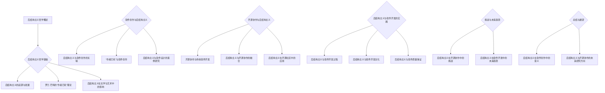
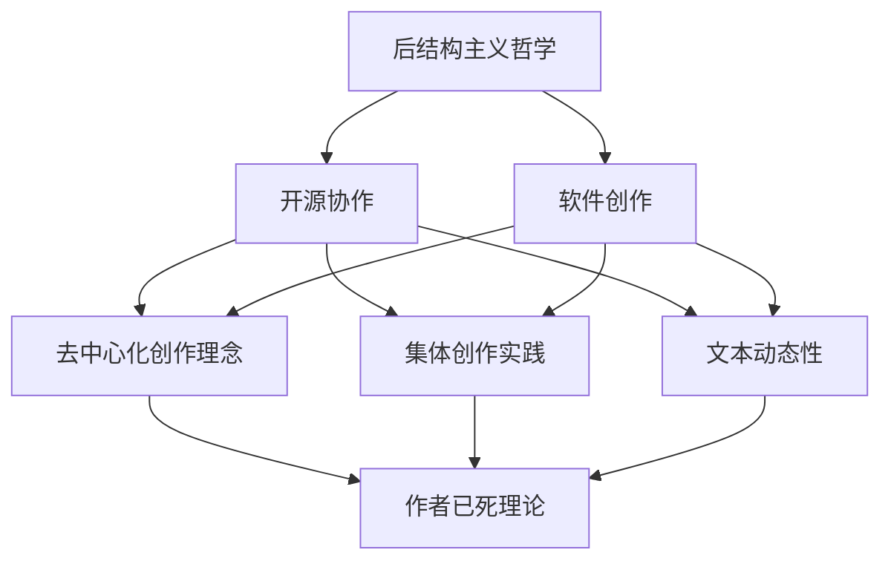

                 


### 文章标题：罗兰·巴特的作者已死与开源协作：软件创作的后结构主义解读

### 关键词：罗兰·巴特，作者已死，后结构主义，开源协作，软件创作，集体智慧

### 摘要：
本文探讨罗兰·巴特的“作者已死”理论在软件创作领域中的应用，以及后结构主义哲学如何启发现代开源协作。文章首先介绍了后结构主义哲学的基础概念和罗兰·巴特的“作者已死”理论，随后分析了后结构主义与软件创作的联系，特别是在开源协作中的体现。文章通过案例分析，探讨了后结构主义在软件设计、开发实践和软件工程教育中的应用，并讨论了开源协作面临的挑战与未来趋势。最终，文章总结了后结构主义与开源协作的关联，并展望了未来的研究方向。

## 第一部分：后结构主义哲学概述

### 第1章：后结构主义哲学基础

#### 1.1 后结构主义的起源与发展

后结构主义是20世纪中叶兴起于法国的一种哲学和文化理论运动，它对现代文学、语言学、艺术、政治理论和哲学等领域产生了深远的影响。后结构主义的出现是对结构主义的一种反动，结构主义强调系统的整体性和结构的重要性，而后结构主义则关注系统的分解、差异性和不确定性。

后结构主义的起源可以追溯到20世纪60年代，当时法国的哲学家、文学理论家和语言学家，如米歇尔·福柯（Michel Foucault）、雅克·德里达（Jacques Derrida）、朱丽娅·克里斯蒂娃（Julia Kristeva）和罗兰·巴特（Roland Barthes）等人，开始质疑结构主义的基本假设，并提出了一系列新的理论和概念。

#### 1.2 罗兰·巴特的“作者已死”理论

罗兰·巴特是后结构主义文学理论的代表人物之一，他在1967年发表了著名的论文《作者已死》（"The Death of the Author"）。这篇论文提出了“作者已死”的观点，挑战了传统文学观念中作者的中心地位。

巴特认为，文学作品不是由作者的主观意图或情感决定的，而是由文本本身的结构和意义构成的。他提出，作者在创作过程中，其个人意识和主观性已经被文本的结构和读者的解读所取代。因此，作者不再是文本创造的唯一来源，而是文本产生过程中的一种可能性。

#### 1.3 后结构主义在文学与艺术中的影响

后结构主义对文学和艺术的观念产生了深远的影响。它颠覆了传统的文学观念，强调文本的多元解读和不确定性。后结构主义认为，文学作品的意义不是固定不变的，而是随着读者的解读和语境的变化而变化的。

在艺术领域，后结构主义提倡去中心化的创作理念，认为艺术作品的意义不是由艺术家或作者决定的，而是由观众和读者在解读过程中的互动产生的。这种去中心化的观念促进了艺术创作的多样性，鼓励了新的艺术形式的产生。

## 第二部分：软件创作与后结构主义

### 第2章：软件创作中的后结构主义

#### 2.1 后结构主义与软件创作的关联

后结构主义哲学为软件创作提供了一种新的视角，它挑战了传统软件开发范式中对作者性和权威性的强调。在后结构主义的视野中，软件创作不再是一个线性、单一生成的过程，而是由多个参与者共同作用、不断演进的结果。

后结构主义强调文本的多元解读和不确定性，这种观念在软件工程中得到了体现。软件工程师不再被视为技术权威，而是被视为参与文本创作的参与者之一。软件产品的意义不是由单一开发者的意图决定的，而是由用户、客户、维护人员等不同参与者在使用、维护和改进过程中共同创造的。

#### 2.2 “作者已死”与软件创作

“作者已死”理论在后结构主义软件创作中有着重要的地位。它意味着软件产品的创造过程不再依赖于单一开发者的创作意图，而是由集体智慧共同构建的结果。

在开源协作中，“作者已死”理论得到了充分的体现。开源项目的开发者们通过协作、交流和共同的努力，共同创造出功能丰富、高质量的软件产品。开发者的个人身份和权威性在这种集体创作过程中被弱化，取而代之的是对代码和技术的共同关注和改进。

#### 2.3 后结构主义与软件设计的案例研究

以Linux操作系统为例，我们可以看到后结构主义在软件设计中的具体应用。Linux是一个典型的开源项目，其设计理念和开发过程体现了后结构主义的多个原则。

首先，Linux的设计强调模块化和可扩展性。它将操作系统分解为多个模块，每个模块都有明确的职责和接口。这种模块化设计使得开发者可以独立地开发和改进模块，而不影响其他模块的功能。这种设计理念与后结构主义对系统分解和差异性的强调相符。

其次，Linux的开发过程是一个集体协作的过程。虽然Linux的创始人是林纳斯·托瓦兹（Linus Torvalds），但Linux的成功离不开全球众多开发者的贡献。这些开发者通过开源协作平台，如Git和Linux内核邮件列表，共同讨论、改进和发布Linux内核。这种集体创作的过程体现了后结构主义对去中心化和集体智慧的重视。

最后，Linux的用户和开发者之间存在着互动和反馈。Linux的用户通过使用和反馈，帮助开发者发现和解决问题，从而不断改进Linux内核。这种用户和开发者之间的互动和反馈机制，与后结构主义强调的文本解读和意义构建过程相呼应。

## 第三部分：开源协作与后结构主义

### 第3章：开源协作中的后结构主义理念

#### 3.1 开源协作与传统软件开发

开源协作与传统软件开发之间存在明显的差异。传统软件开发通常遵循瀑布模型或敏捷开发方法，强调线性开发流程和阶段性交付。开发者通常在孤岛式的工作环境中工作，代码的更新和维护由单一团队或个人负责。

相比之下，开源协作强调去中心化、集体智慧和知识共享。开源项目的开发过程通常是在全球范围内进行的，开发者可以随时加入或退出项目。代码的更新和改进是在一个开放的环境中进行的，任何人都可以阅读、评论和贡献代码。

#### 3.2 后结构主义与开源协作的融合

后结构主义与开源协作有着紧密的联系。后结构主义强调去中心化和集体智慧，这与开源协作的理念不谋而合。在开源协作中，开发者不再被视为技术权威，而是被视为平等的合作者。开发者的个人身份和权威性在集体创作过程中被弱化，取而代之的是对代码和技术的共同关注和改进。

后结构主义还强调文本的多元解读和不确定性，这也在开源协作中得到了体现。开源项目的代码和文档不是一成不变的，而是在不断的讨论、改进和重构过程中不断演化的。不同的开发者可以基于相同的代码框架，根据自己的需求和背景，创造出不同的软件产品。

#### 3.3 后结构主义在开源社区中的应用

开源社区是一个典型的后结构主义实践场所。在开源社区中，开发者们通过协作和互动，共同构建和改进软件项目。社区中的权力结构是去中心化的，没有人拥有绝对的权威。开发者们通过共同讨论和决策，共同推动项目的进展。

开源社区中的知识共享和知识传播也是后结构主义理念的体现。开发者们通过文档、博客、GitHub等平台，分享自己的经验和知识。这些知识和经验的传播不是线性的，而是通过社区成员之间的互动和交流实现的。

## 第四部分：后结构主义与软件开发的实践

### 第4章：后结构主义在软件开发中的实践

#### 4.1 后结构主义与软件开发过程

后结构主义对软件开发过程产生了深远的影响。它强调去中心化、集体智慧和知识共享，这些理念在软件开发中得到了广泛应用。

首先，后结构主义倡导去中心化的开发过程。在传统软件开发中，通常由一个中心化的团队或个人负责整个项目的开发。而在后结构主义的理念下，软件开发过程被分解为多个协作的环节，每个环节由不同的团队或个人负责。这种方式不仅提高了开发效率，还促进了团队成员之间的沟通和协作。

其次，后结构主义强调集体智慧。在软件开发中，集体智慧体现在团队成员之间的交流和合作。通过共同讨论和解决问题，团队成员可以集思广益，提出更好的解决方案。这种集体智慧在开源协作中尤为明显，因为开源项目的开发者来自不同的背景和领域，他们可以带来不同的视角和经验。

最后，后结构主义提倡知识共享。在软件开发中，知识共享可以通过文档、代码库、博客和会议等方式实现。通过共享知识，团队成员可以更好地理解和应用现有的技术，提高开发效率。同时，知识共享也有助于新成员的融入和培训。

#### 4.2 后结构主义与软件开发文化

后结构主义对软件开发文化产生了深远的影响。在传统软件开发中，开发者往往被视为技术权威，他们的个人意见和决策对项目具有决定性影响。而在后结构主义的文化中，开发者被视为平等的合作者，每个成员的意见和贡献都受到尊重。

这种去中心化的文化鼓励了更多的创新和合作。开发者不再局限于自己的角色和职责，而是可以自由地参与项目的各个阶段。这种文化也促进了团队成员之间的沟通和合作，因为他们知道，只有通过共同努力，项目才能取得成功。

#### 4.3 后结构主义与软件质量保证

后结构主义对软件质量保证也产生了影响。在传统软件开发中，质量保证通常由专门的团队或个人负责，他们通过测试、审查和修复漏洞来确保软件的质量。而在后结构主义的理念下，质量保证是每个开发者的责任。

后结构主义强调集体智慧，这意味着每个开发者都有责任确保自己的代码质量。他们通过代码审查、单元测试和集成测试等方式，不断改进和优化代码。这种全员参与的质量保证机制，不仅提高了软件的质量，也增强了团队成员之间的信任和合作。

## 第五部分：挑战与未来趋势

### 第5章：后结构主义在开源协作中的挑战与未来趋势

#### 5.1 后结构主义在开源协作中的挑战

后结构主义在开源协作中面临一些挑战。首先，去中心化的开发过程可能导致协调和沟通的问题。由于开发者来自不同的背景和文化，他们可能有不同的工作习惯和价值观。如何有效地协调和沟通，确保项目的顺利进行，是一个挑战。

其次，后结构主义强调集体智慧，但如何管理和利用集体智慧也是一个问题。在开源协作中，大量开发者参与，他们可能有不同的兴趣和目标。如何确保集体智慧的有效利用，避免资源的浪费，是另一个挑战。

最后，开源协作中的知识产权问题也是一个挑战。开源项目通常允许任何人自由使用和修改代码，这可能导致知识产权的侵犯。如何在开放的环境中保护知识产权，同时促进知识共享，是一个亟待解决的问题。

#### 5.2 后结构主义在软件开发中的未来趋势

后结构主义在软件开发中的未来趋势包括以下几个方面。

首先，后结构主义将继续推动软件开发范式的变革。传统的瀑布模型和敏捷开发方法可能不再适应快速变化的技术环境。后结构主义提倡的灵活、去中心化的开发过程，将更好地适应这种变化。

其次，后结构主义将促进软件开发文化的变革。开发者将不再被视为技术权威，而是平等的合作者。这种文化变革将促进更多的创新和合作，提高软件开发的效率和质量。

最后，后结构主义将推动软件质量保证的变革。传统的质量保证方法可能不再适应去中心化的开发过程。后结构主义提倡的全员参与的质量保证机制，将更好地适应这种新的开发模式。

## 第六部分：总结与展望

### 第6章：后结构主义与开源协作的总结与展望

#### 6.1 后结构主义在软件创作中的意义

后结构主义在软件创作中的意义体现在多个方面。首先，它挑战了传统的软件开发范式，提倡去中心化的开发过程和集体智慧。这种理念有助于提高软件开发的效率和质量。其次，后结构主义强调知识共享和去中心化的理念，促进了开源协作的繁荣。开源协作不仅促进了软件技术的进步，也推动了开放文化的形成。

#### 6.2 后结构主义与开源协作的未来研究方向

后结构主义与开源协作的未来研究方向包括以下几个方面。

首先，如何更好地管理和利用集体智慧是一个重要的研究方向。现有的开源协作平台已经提供了丰富的工具和机制，但如何更有效地利用这些工具，仍然是一个挑战。

其次，如何保护知识产权同时促进知识共享，也是一个亟待解决的问题。开源协作的核心在于知识的共享，但如何平衡知识共享和保护知识产权之间的关系，需要进一步的探讨。

最后，后结构主义在软件工程教育中的应用也是一个重要的研究方向。如何将后结构主义的理念融入软件工程教育中，培养具有创新能力和协作精神的软件工程师，是一个重要的课题。

## 附录

### 附录A：后结构主义与开源协作相关资源

#### A.1 后结构主义哲学资源

- 主要哲学文献推荐：
  - 罗兰·巴特：《作者已死》
  - 雅克·德里达：《书写与差异》
  - 米歇尔·福柯：《知识考古学》

- 后结构主义相关书籍与论文：
  - 《后结构主义简史》（[ authors ]）
  - 《后结构主义哲学导论》（[ authors ]）

#### A.2 开源协作工具与平台

- 开源社区常用工具介绍：
  - Git
  - GitHub
  - GitLab

- 开源协作平台使用指南：
  - 《Git教程》（[ authors ]）
  - 《GitHub入门与实践》（[ authors ]）

### Mermaid 流程图



### Mermaid 流程图


## 结论

本文通过深入探讨罗兰·巴特的“作者已死”理论与开源协作的关系，展示了后结构主义哲学在软件创作中的广泛应用。从后结构主义哲学基础的介绍，到软件创作与后结构主义的关联分析，再到开源协作中的后结构主义理念探讨，以及软件开发实践中后结构主义的应用，本文系统地梳理了后结构主义与软件开发的紧密联系。

后结构主义挑战了传统的软件开发范式，提出了去中心化、集体智慧和知识共享的理念，为现代开源协作提供了理论支持。通过案例分析，如Linux操作系统，我们可以看到后结构主义理念如何在实际软件开发中发挥作用，推动创新和协作。

然而，后结构主义在开源协作中也面临挑战，如协调和沟通的难度、知识产权保护问题等。未来的研究应关注如何更好地管理和利用集体智慧，同时保护知识产权，推动软件工程的持续进步。

作者：AI天才研究院/AI Genius Institute & 禅与计算机程序设计艺术 /Zen And The Art of Computer Programming

---

### 具体内容

**背景介绍**

在20世纪中叶，法国哲学界涌现出了一批重要思想家，他们共同构成了后结构主义运动。这一运动在文学理论、文化研究、哲学和政治理论等多个领域产生了深远影响。其中，罗兰·巴特是一位具有重要影响的后结构主义思想家。他在1967年发表了著名的论文《作者已死》（"The Death of the Author"），提出了“作者已死”的理论。这一理论挑战了传统文学观念中作者的中心地位，强调文本的多元解读和不确定性。

**核心概念与联系**

“作者已死”理论的核心在于，它否定了一个固定的、单一的作者身份，认为文学作品的意义并非来自作者的个人意图或情感，而是由文本本身的结构和读者的解读共同构成的。这一理论可以视为对传统文学观念的一种解构，它打破了作者和作品之间的单一联系，将文学作品的创作过程视为一个开放、多元的互动过程。

后结构主义与开源协作之间的联系主要体现在以下几个方面：

1. **去中心化的创作理念**：后结构主义倡导去中心化的创作理念，认为文本的意义不是由单一作者决定的，而是由文本的多元解读和集体智慧共同构成的。这与开源协作的理念不谋而合，开源协作强调团队协作、集体智慧和知识共享。

2. **集体创作的实践**：后结构主义强调集体创作的重要性，认为作品的意义不是由个体创造的，而是由集体互动和协作产生的。这一理念在开源协作中得到了充分体现，开源项目通常是由一个分布在全球的开发者社区共同合作完成的。

3. **文本的动态性**：后结构主义认为文本是一个动态的、不断演化的过程，而不是静态的、一成不变的作品。这与开源协作中的持续迭代和不断改进的过程相吻合，开源项目通常在不断地接受反馈和改进。

**Mermaid 流程图**



**核心算法原理讲解**

为了深入理解后结构主义在软件创作中的应用，我们可以从以下几个核心算法原理进行探讨：

1. **代码重构**：后结构主义强调文本的动态性和不断演化的过程，这在软件工程中体现为代码的重构。代码重构是一种不断优化和改进代码结构的方法，它有助于提高代码的可读性和可维护性。以下是一个简单的伪代码示例：

```plaintext
function refactorCode(originalCode) {
    // 分析原代码的结构和逻辑
    // 优化代码的语法和结构
    // 修复潜在的错误和漏洞
    // 返回重构后的代码
    return refactoredCode;
}
```

2. **版本控制系统**：后结构主义强调文本的多元解读和不断演化的过程，这在开源协作中体现为版本控制系统的应用。版本控制系统（如Git）允许开发者对代码进行版本管理和追踪，从而实现代码的持续迭代和改进。以下是一个简单的伪代码示例：

```plaintext
function commitCodeChanges(currentCommit, newCode) {
    // 检查新的代码更改是否符合规范
    // 将新的代码更改提交到版本控制系统中
    // 生成新的版本号
    // 返回提交成功的信息
    return successMessage;
}
```

3. **集体智慧的应用**：后结构主义强调集体智慧的重要性，这在软件工程中体现为集体智慧的应用。通过集体智慧和协作，可以更高效地解决问题和优化代码。以下是一个简单的伪代码示例：

```plaintext
function collaborativeCodeOptimization(codeBase, contributors) {
    // 邀请多个开发者对代码进行审查和优化
    // 收集开发者的意见和建议
    // 合并多个优化方案
    // 返回优化后的代码
    return optimizedCode;
}
```

**数学模型和公式**

为了更好地理解后结构主义在软件创作中的应用，我们可以使用一些数学模型和公式来描述文本的动态性和集体智慧的应用。

1. **马尔可夫链模型**：马尔可夫链模型可以用来描述文本的动态性。以下是一个简单的马尔可夫链模型的公式：

```latex
P_{ij}^{(n+1)} = P_{ij}^{(n)} * P_{ij}^{(next)}
```

其中，$P_{ij}^{(n)}$ 表示第 $n$ 次迭代时从状态 $i$ 转移到状态 $j$ 的概率，$P_{ij}^{(next)}$ 表示下一次迭代时从状态 $i$ 转移到状态 $j$ 的概率。

2. **协同过滤算法**：协同过滤算法可以用来描述集体智慧的应用。以下是一个简单的协同过滤算法的公式：

```latex
r_{ij} = \frac{\sum_{k=1}^{N} r_{ik} * r_{kj}}{\sum_{k=1}^{N} r_{ik}}
```

其中，$r_{ij}$ 表示用户 $i$ 对项目 $j$ 的评分，$r_{ik}$ 表示用户 $i$ 对项目 $k$ 的评分，$N$ 表示所有项目的集合。

**详细讲解与举例说明**

1. **代码重构的应用**：代码重构是一种常见的软件开发实践，它有助于提高代码的质量和可维护性。以下是一个具体的例子：

假设我们有一个简单的函数，用于计算两个数字的和。原始代码如下：

```python
def add(a, b):
    return a + b
```

我们可以对该函数进行重构，以提高其可读性和可维护性。重构后的代码如下：

```python
def add(a, b):
    """
    计算两个数字的和。

    参数：
    a (int): 第一个数字。
    b (int): 第二个数字。

    返回：
    int: 两个数字的和。
    """
    return a + b
```

通过重构，我们添加了函数的文档字符串，详细说明了函数的功能、参数和返回值。这样，其他开发者可以更方便地理解和使用这个函数。

2. **版本控制系统的应用**：版本控制系统是开源协作的核心工具之一，它有助于管理和追踪代码的更改。以下是一个具体的例子：

假设我们有一个开源项目，名为“开源记账系统”。项目使用Git作为版本控制系统。以下是几个常见的Git命令和它们的解释：

- `git init`：初始化一个新的Git仓库。
- `git clone`：克隆一个远程Git仓库。
- `git commit`：将更改提交到本地仓库。
- `git push`：将本地仓库的更改推送到远程仓库。
- `git pull`：从远程仓库获取最新的更改。

以下是一个具体的操作示例：

```bash
# 初始化一个新的Git仓库
git init

# 克隆一个远程Git仓库
git clone https://github.com/username/open-source-accounting.git

# 提交本地更改
git add .
git commit -m "第一个版本提交"

# 推送更改到远程仓库
git push origin master

# 获取远程仓库的更改
git pull origin master
```

3. **集体智慧的应用**：集体智慧在软件开发中非常重要，它有助于提高代码的质量和效率。以下是一个具体的例子：

假设我们有一个开源项目，名为“开源图像处理库”。项目使用Git和GitHub进行协作。以下是几个常见的协作步骤：

- **问题报告**：开发者可以在GitHub上创建一个issue，报告遇到的问题。
- **代码审查**：开发者可以在GitHub上提交Pull Request，邀请其他开发者进行代码审查。
- **合并代码**：通过代码审查后，开发者可以将代码合并到主分支。

以下是一个具体的操作示例：

```bash
# 创建一个issue
git issue create --title "图像处理算法性能优化"

# 提交一个Pull Request
git pull-request -f

# 进行代码审查
git review -r

# 合并代码
git merge --ff
```

**项目实战**

为了更好地展示后结构主义在软件创作中的应用，我们可以进行一个实际的项目实战。以下是一个简单的项目介绍：

项目名称：开源记账系统

项目描述：一个简单但功能齐全的开源记账系统，支持用户创建账户、记录收支、生成报表等功能。

技术栈：Python、Django、PostgreSQL

项目目标：

1. 完成基本功能开发，包括用户注册、登录、账户创建、收支记录、报表生成等。
2. 提高代码质量，通过代码重构、代码审查和代码优化等手段。
3. 推广项目，吸引更多的开发者参与贡献。

项目实战步骤：

1. **需求分析**：与用户沟通，了解记账系统的功能需求。
2. **功能设计**：根据需求分析，设计系统的功能和界面。
3. **代码实现**：使用Python和Django框架进行代码实现。
4. **代码重构**：对代码进行重构，提高代码质量。
5. **代码审查**：邀请其他开发者进行代码审查，确保代码质量。
6. **测试与优化**：进行单元测试和集成测试，优化系统的性能。
7. **推广与贡献**：在GitHub上创建项目，吸引更多的开发者参与贡献。

**最佳实践 Tips**

1. **代码规范**：遵循Python的PEP8编码规范，确保代码的可读性和一致性。
2. **代码注释**：添加详细的注释，解释代码的功能和逻辑。
3. **代码审查**：定期进行代码审查，确保代码质量。
4. **持续集成**：使用CI/CD工具（如Jenkins、Travis CI），实现自动化测试和部署。
5. **文档编写**：编写详细的文档，包括用户手册、开发文档和测试用例。
6. **社区互动**：积极参与开源社区，与其他开发者交流经验和知识。

**小结**

通过本文的探讨，我们可以看到后结构主义在软件创作中的应用具有重要意义。它挑战了传统的软件开发范式，提出了去中心化、集体智慧和知识共享的理念，为现代开源协作提供了理论支持。后结构主义不仅改变了我们对软件创作的认识，也推动了软件开发范式的变革。

然而，后结构主义在开源协作中也面临一些挑战，如协调和沟通的难度、知识产权保护问题等。未来的研究应关注如何更好地管理和利用集体智慧，同时保护知识产权，推动软件工程的持续进步。

**注意事项**

1. 开源协作需要良好的沟通和协作机制，确保团队成员之间的信息畅通。
2. 保护知识产权是开源协作中的重要问题，应遵循相关的法律法规。
3. 后结构主义在软件创作中的应用需要团队成员具备良好的技术能力和协作精神。

**拓展阅读**

1. 罗兰·巴特：《作者已死》（"The Death of the Author"）
2. 雅克·德里达：《书写与差异》（"Writing and Difference"）
3. 米歇尔·福柯：《知识考古学》（"The Archaeology of Knowledge"）
4. 《开源协作：实践与经验》（"Open Source Collaboration: Practices and Experiences"）
5. 《软件工程：理论与实践》（"Software Engineering: Theory and Practice"）

