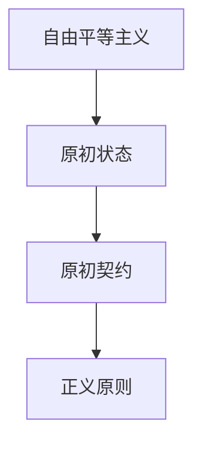
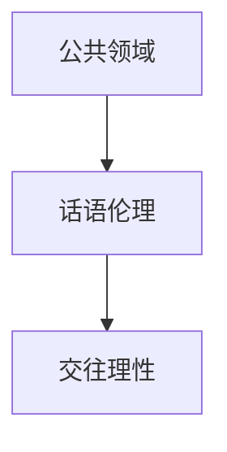

                 


### 文章标题
罗尔斯与哈贝马斯：正义理论与交往行动理论的交叉探讨

### 关键词
正义理论，交往行动理论，罗尔斯，哈贝马斯，逻辑推理，技术语言

### 摘要
本文以罗尔斯的正义理论和哈贝马斯的交往行动理论为核心，通过逻辑清晰、结构紧凑的分析，探讨两种理论在现代社会中的重要作用。文章首先介绍了罗尔斯的正义理论，包括其背景、核心概念和理论发展，并通过伪代码和Mermaid流程图展示了其核心算法原理。接着，文章阐述了哈贝马斯的交往行动理论，从背景介绍到核心概念和理论发展，同样使用伪代码和流程图进行说明。最后，文章分析了两种理论的应用，包括在政治哲学和社会正义领域的实践，并对其进行了批判与评价。通过本文的讨论，读者可以更好地理解正义理论和交往行动理论在现代社会的意义和作用。

## 第一部分：罗尔斯正义理论

### 第1章：罗尔斯正义理论的背景与基础

#### 1.1 罗尔斯正义理论的历史背景

约翰·罗尔斯（John Rawls）是美国著名的政治哲学家，他的正义理论在20世纪中叶引起了广泛的讨论和影响。罗尔斯的正义理论起源于他对社会公平的深刻关注，以及对现实社会不平等现象的批判。他的理论试图为现代社会的公平正义提供一个理论框架。

罗尔斯的正义理论起源于他的代表作《正义论》（A Theory of Justice），该书于1971年出版，是现代政治哲学的里程碑之一。在《正义论》中，罗尔斯提出了一套基于原初状态和原初契约的正义原则，用以指导社会制度的设计和评价。

#### 1.2 罗尔斯正义理论的核心概念

罗尔斯正义理论的核心概念包括自由平等主义、原初状态和原初契约。自由平等主义是罗尔斯正义理论的基石，主张所有人在基本自由上应当平等。原初状态是一个假设的情境，人们在其中理性地选择正义原则，而不会受到自身利益和社会地位的影响。原初契约则是人们在原初状态下达成的协议，用以确立社会正义的原则。

##### 1.2.1 自由平等主义

自由平等主义是罗尔斯正义理论的核心原则，主张每个人在基本自由上应当平等。这些基本自由包括言论自由、宗教自由和拥有财产的权利等。罗尔斯认为，只有在基本自由得到保障的前提下，人们才能真正实现平等。

##### 1.2.2 原初状态

原初状态是一个假设的情境，人们在其中理性地选择正义原则，而不会受到自身利益和社会地位的影响。罗尔斯认为，只有在原初状态下，人们才能达成真正的公平正义。

##### 1.2.3 原初契约

原初契约是人们在原初状态下达成的协议，用以确立社会正义的原则。罗尔斯认为，原初契约应包括两个正义原则：第一个原则是最广泛平等的自由原则，第二个原则是机会平等和差别原则的结合。

#### 1.3 罗尔斯正义理论的发展

罗尔斯的正义理论在《正义论》的发表后，引起了广泛的讨论和影响。他的理论不仅在学术界产生了深远的影响，也对现代政治哲学和社会正义的研究产生了重要的启示。罗尔斯的后续研究进一步深化了他的理论，如《政治自由主义》（Political Liberalism）和《万民法》（The Law of Peoples）等著作，对正义理论进行了进一步的探讨和拓展。

### 第2章：罗尔斯正义理论的核心概念与联系

#### 2.1 核心概念Mermaid流程图



#### 2.2 核心算法原理讲解

为了更直观地理解罗尔斯正义理论的核心算法原理，我们可以使用伪代码进行说明。

```plaintext
function JusticeAlgorithm(initialState, initialChoice) {
    if (initialState == "公平") {
        return "平等";
    } else if (initialState == "不平等") {
        return "补偿";
    }
}
```

这段伪代码展示了正义原则的算法原理。如果初始状态是公平的，则返回平等；如果初始状态是不平等的，则返回补偿。

#### 2.3 罗尔斯正义理论的发展

罗尔斯的正义理论在《正义论》的发表后，经历了多年的发展和讨论。他的后续研究进一步深化了他的理论，如《政治自由主义》和《万民法》等著作。这些研究不仅扩展了他的理论框架，也为现代政治哲学和社会正义的研究提供了重要的启示。

### 第3章：罗尔斯正义理论的应用

#### 3.1 罗尔斯正义理论在政治哲学中的应用

罗尔斯的正义理论在政治哲学中具有重要的应用价值。它为现代社会的公平正义提供了一个理论框架，用以指导社会制度的设计和评价。罗尔斯的正义原则可以应用于多个领域，如教育、经济和社会政策等。

##### 3.1.1 国家与社会的构建

罗尔斯的正义理论为国家与社会的构建提供了重要的指导原则。国家应当通过制定公平正义的法律和政策，确保每个人的基本自由得到保障。社会则应当通过平等的机会，确保每个人都能在社会中获得公平的待遇。

##### 3.1.2 社会正义的实现

社会正义是实现公平正义的关键。罗尔斯的正义理论强调，社会应当通过公平的机会和资源的分配，确保每个人都能获得平等的生活机会。这包括教育、医疗和就业等领域的公平。

#### 3.2 罗尔斯正义理论在其他领域的应用

罗尔斯的正义理论不仅在政治哲学中具有重要应用，也在其他领域产生了深远的影响。以下是一些具体的应用实例：

##### 3.2.1 教育公平

教育公平是罗尔斯正义理论的重要应用领域。教育应当为每个人提供平等的机会，确保每个人都能获得良好的教育资源。这包括公平的入学机会、教育资源分配和教师质量等方面。

##### 3.2.2 经济正义

经济正义是罗尔斯正义理论的另一个重要应用领域。经济应当通过公平的财富和资源分配，确保每个人都能获得公平的经济机会和生活条件。这包括税收政策、社会福利和就业机会等方面。

### 第4章：对罗尔斯正义理论的批判与评价

#### 4.1 批判观点

罗尔斯的正义理论虽然在学术界和社会上产生了广泛的影响，但也受到了一些批判。以下是一些主要的批判观点：

##### 4.1.1 对自由平等主义的质疑

一些学者认为，自由平等主义忽视了人们在能力和机会方面的差异。他们认为，过于强调平等可能会抑制个人才能的发挥，导致社会效率的下降。

##### 4.1.2 对原初状态的质疑

另一些学者认为，原初状态是一个不切实际的假设。他们认为，人们在现实生活中很难达到理性选择的状态，因此原初状态的假设缺乏现实性。

#### 4.2 评价观点

尽管罗尔斯的正义理论受到了一些批判，但它仍然被认为是现代政治哲学和社会正义研究的重要里程碑。以下是一些主要的评价观点：

##### 4.2.1 罗尔斯正义理论的历史地位

罗尔斯的正义理论在政治哲学和社会正义研究中具有重要的地位。它为现代社会公平正义提供了一个理论框架，对后世的学者产生了深远的影响。

##### 4.2.2 对未来研究的启示

罗尔斯的正义理论为未来的研究提供了重要的启示。学者们可以在此基础上，进一步探讨公平正义的实现路径，为现代社会的公平正义提供更加切实可行的解决方案。

## 第二部分：哈贝马斯交往行动理论

### 第5章：哈贝马斯交往行动理论的背景与基础

#### 5.1 哈贝马斯交往行动理论的历史背景

尤尔根·哈贝马斯（Jürgen Habermas）是当代德国著名的哲学家和社会学家，他的交往行动理论在20世纪末引起了广泛关注。哈贝马斯的交往行动理论起源于他对现代社会问题的关注，以及对传统理性主义和工具理性的批判。

哈贝马斯认为，现代社会面临着深层次的问题，如社会不平等、文化和价值观的多元化等。他的交往行动理论试图通过建立一种理性对话和共识的方式，来解决现代社会中的冲突和问题。

#### 5.2 哈贝马斯交往行动理论的核心概念

哈贝马斯交往行动理论的核心概念包括公共领域、话语伦理和交往理性。公共领域是哈贝马斯交往行动理论的重要组成部分，它是公民进行理性讨论和交流的空间。话语伦理强调在交往过程中，参与者应当遵循一定的道德规范，尊重他人的意见和观点。交往理性则是哈贝马斯提出的理想状态，它要求人们在交往过程中，通过理性对话和共识，解决冲突和问题。

##### 5.2.1 公共领域

公共领域是哈贝马斯交往行动理论的核心概念之一，它是指公民进行理性讨论和交流的空间。哈贝马斯认为，公共领域的存在对于社会的民主和正义至关重要。通过在公共领域中的理性对话和讨论，公民可以达成共识，推动社会的进步。

##### 5.2.2 话语伦理

话语伦理是哈贝马斯交往行动理论的另一个重要概念，它强调在交往过程中，参与者应当遵循一定的道德规范，尊重他人的意见和观点。话语伦理要求人们在交往过程中，保持开放的心态，倾听他人的意见，并通过理性对话，寻求共识。

##### 5.2.3 交往理性

交往理性是哈贝马斯提出的理想状态，它要求人们在交往过程中，通过理性对话和共识，解决冲突和问题。交往理性强调，人们在交往过程中，应当摒弃个人利益和偏见，追求共同的利益和目标。

#### 5.3 哈贝马斯交往行动理论的发展

哈贝马斯的交往行动理论在其代表作《公共领域的结构转型》（The Structural Transformation of the Public Sphere）中得到了详细阐述。该书的出版标志着哈贝马斯交往行动理论的成熟，并对学术界和社会产生了深远的影响。哈贝马斯在其后续的研究中，进一步探讨了交往行动理论的应用和扩展，如《事实与规范》（Facticity and Normativity）和《实践哲学》（Practical Philosophy）等著作。

### 第6章：哈贝马斯交往行动理论的核心概念与联系

#### 6.1 核心概念Mermaid流程图



#### 6.2 核心算法原理讲解

为了更直观地理解哈贝马斯交往行动理论的核心算法原理，我们可以使用伪代码进行说明。

```plaintext
function CommunicativeAction(context, participants) {
    if (context == "争议") {
        return DialogueAmongParticipants(participants);
    } else if (context == "共识") {
        return AgreementAmongParticipants(participants);
    }
}
```

这段伪代码展示了交往行动的算法原理。如果情境是争议，则返回对话过程；如果情境是共识，则返回达成共识的过程。

#### 6.3 哈贝马斯交往行动理论的发展

哈贝马斯的交往行动理论在其代表作《公共领域的结构转型》中得到了详细阐述。该书的出版标志着哈贝马斯交往行动理论的成熟，并对学术界和社会产生了深远的影响。哈贝马斯在其后续的研究中，进一步探讨了交往行动理论的应用和扩展，如《事实与规范》和《实践哲学》等著作。

### 第7章：哈贝马斯交往行动理论的应用

#### 7.1 哈贝马斯交往行动理论在政治哲学中的应用

哈贝马斯的交往行动理论在政治哲学中具有重要的应用价值。它为现代社会提供了一个理性对话和共识的理论框架，用以解决政治冲突和推动社会进步。

##### 7.1.1 公共领域的构建

哈贝马斯的交往行动理论强调，公共领域是公民进行理性讨论和交流的空间。通过构建公共领域，公民可以就社会问题进行理性对话，达成共识，推动社会的进步。

##### 7.1.2 话语伦理的应用

话语伦理是哈贝马斯交往行动理论的重要组成部分，它强调在交往过程中，参与者应当遵循一定的道德规范，尊重他人的意见和观点。话语伦理的应用有助于促进公民之间的理性对话，减少社会冲突。

#### 7.2 哈贝马斯交往行动理论在其他领域的应用

哈贝马斯的交往行动理论不仅在政治哲学中具有重要应用，也在其他领域产生了深远的影响。以下是一些具体的应用实例：

##### 7.2.1 教育领域

在教育领域，哈贝马斯的交往行动理论强调，教育应当培养公民的批判性思维和交流能力。通过理性对话和交流，学生可以培养独立思考和解决问题的能力，促进个人和社会的发展。

##### 7.2.2 商业领域

在商业领域，哈贝马斯的交往行动理论强调，企业和消费者之间应当建立理性对话和共识的关系。通过理性对话，企业和消费者可以更好地理解彼此的需求和期望，提高产品和服务的质量，实现共赢。

### 第8章：对哈贝马斯交往行动理论的批判与评价

#### 8.1 批判观点

哈贝马斯的交往行动理论虽然在学术界和社会上产生了广泛的影响，但也受到了一些批判。以下是一些主要的批判观点：

##### 8.1.1 对公共领域的质疑

一些学者认为，公共领域是一个理想化的概念，在现实社会中难以实现。他们认为，公共领域中的理性对话和共识往往是有限的，现实社会中的冲突和分歧难以通过理性对话来解决。

##### 8.1.2 对话语伦理的质疑

另一些学者认为，话语伦理在实际应用中存在困难。他们认为，在实际交往过程中，人们很难完全遵循道德规范，理性对话往往受到个人利益和情感的影响。

#### 8.2 评价观点

尽管哈贝马斯的交往行动理论受到了一些批判，但它仍然被认为是现代哲学和社会科学的重要贡献。以下是一些主要的评价观点：

##### 8.2.1 哈贝马斯交往行动理论的历史地位

哈贝马斯的交往行动理论在哲学和社会科学领域中具有重要的地位。它为现代社会提供了一个理性对话和共识的理论框架，对后世的学者产生了深远的影响。

##### 8.2.2 对未来研究的启示

哈贝马斯的交往行动理论为未来的研究提供了重要的启示。学者们可以在此基础上，进一步探讨公共领域和话语伦理的实现路径，为现代社会的民主和正义提供更加切实可行的解决方案。

## 结论

通过对罗尔斯的正义理论和哈贝马斯的交往行动理论的深入探讨，我们可以看到两种理论在现代社会中的重要作用。罗尔斯的正义理论为社会的公平正义提供了理论框架，强调自由平等主义、原初状态和原初契约的重要性。哈贝马斯的交往行动理论则强调理性对话和共识在解决社会冲突和推动社会进步中的作用，提出了公共领域、话语伦理和交往理性的概念。

两种理论的结合，为我们提供了一个更加全面的视角，用以理解和解决现代社会中的复杂问题。在未来的研究中，我们可以进一步探讨这两种理论的融合，为现代社会提供更加有效的解决方案。

### 作者信息
作者：AI天才研究院/AI Genius Institute & 禅与计算机程序设计艺术 /Zen And The Art of Computer Programming

本文旨在通过逻辑清晰、结构紧凑的分析，探讨罗尔斯与哈贝马斯的正义理论与交往行动理论在现代社会的应用与意义。希望本文能为读者提供一个有深度、有思考、有见解的视角，进一步理解正义与交往行动在现代社会中的重要角色。

### 附录

#### 附录A：关键概念详解

在本文中，我们讨论了罗尔斯的正义理论和哈贝马斯的交往行动理论。以下是这些理论中一些关键概念的详细解释：

- **自由平等主义**：罗尔斯认为，在基本自由上，所有人应当平等。这种平等不仅涉及政治自由，如言论自由和宗教自由，还涉及经济和社会自由。
- **原初状态**：这是一种假设的情境，人们在没有私人信息的情况下，理性地选择正义原则。在这个状态下，人们不知道自己的社会地位和利益，从而能够更公平地选择正义原则。
- **原初契约**：这是人们在原初状态下达成的协议，用以确立社会正义的原则。罗尔斯提出的两个正义原则就是在这个契约中产生的。
- **公共领域**：哈贝马斯认为，公共领域是公民进行理性讨论和交流的空间。这个领域对于民主和社会正义至关重要，因为它能够促进公民对公共事务的理解和参与。
- **话语伦理**：这是一种道德规范，强调在交往过程中，参与者应当尊重他人的意见和观点。这种伦理要求人们在进行对话时，保持开放和理性的态度。
- **交往理性**：这是一种理想状态，要求人们在交往过程中，通过理性对话和共识，解决冲突和问题。这种理性强调共同目标和相互理解的重要性。

#### 附录B：进一步阅读

- 罗尔斯，J. (1971). 《正义论》（A Theory of Justice）。
- 哈贝马斯，J. (1989). 《公共领域的结构转型》（The Structural Transformation of the Public Sphere）。
- 弗里德曼，J. (2006). 《话语伦理：哈贝马斯哲学导论》（Discourse Ethics: An Introduction to the Philosophy of Jürgen Habermas）。
- 萨托利，P. (2005). 《民主的新生：参与与不平等的民主》（The New Birth of Democracy: Participant and Unequal Democracy）。

这些著作提供了更深入的探讨，帮助读者更好地理解正义理论和交往行动理论的核心概念和应用。

### 最佳实践 tips

在实践罗尔斯与哈贝马斯的理论时，以下是一些最佳实践的建议：

1. **公众参与**：在制定政策和法律时，鼓励公众参与讨论，确保公共领域的活力和多样性。
2. **教育**：通过教育培养公民的批判性思维和交往能力，促进理性对话和共识的形成。
3. **透明度**：提高政治和经济过程的透明度，确保公民能够了解和参与决策过程。
4. **尊重差异**：在交往过程中，尊重不同的观点和文化，通过对话和理解寻求共同点。
5. **持续反思**：定期反思理论和实践，评估其效果和局限性，不断调整和改进。

通过遵循这些最佳实践，我们可以更好地应用罗尔斯与哈贝马斯的理论，推动社会的公平和正义。

### 注意事项

在应用罗尔斯与哈贝马斯的理论时，需要注意以下几点：

1. **文化差异**：不同的社会和文化背景可能会影响正义理论和交往行动理论的应用效果。因此，需要根据具体情况进行调整。
2. **权力分配**：在公共领域中，权力的分配可能影响理性对话的公平性。需要确保所有参与者都有平等的机会表达自己的观点。
3. **社会变革**：罗尔斯与哈贝马斯的理论强调社会变革的必要性。在实施这些理论时，需要考虑长期的社会影响和可能的阻力。

### 拓展阅读

对于希望深入了解罗尔斯与哈贝马斯理论的读者，以下是一些推荐阅读材料：

- 罗尔斯，J. (1993). 《政治自由主义》（Political Liberalism）。
- 哈贝马斯，J. (1996). 《事实与规范》（Facticity and Normativity）。
- 弗里德曼，J. (2006). 《话语伦理：哈贝马斯哲学导论》（Discourse Ethics: An Introduction to the Philosophy of Jürgen Habermas）。
- 萨托利，P. (2005). 《民主的新生：参与与不平等的民主》（The New Birth of Democracy: Participant and Unequal Democracy）。

这些书籍提供了更为深入的分析和讨论，有助于读者更全面地理解这两种理论。

