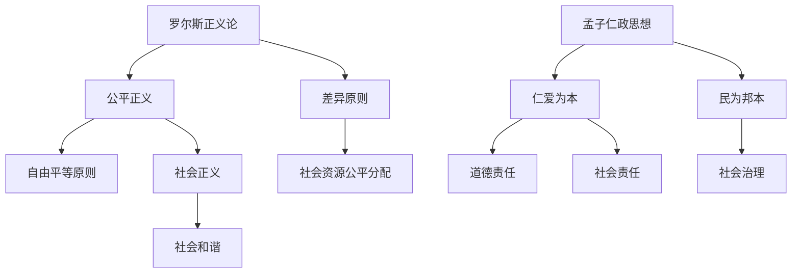

                 

### 罗尔斯与孟子：正义论与仁政思想的现代对话

> 关键词：罗尔斯正义论、孟子仁政思想、现代对话、应用与实践

> 摘要：本文旨在探讨罗尔斯的正义论与孟子的仁政思想在现代社会中的对话与影响。通过深入分析这两种思想的基本概念、哲学背景以及在实际社会中的应用，本文试图揭示它们在现代社会中的价值和意义。同时，本文还对比了罗尔斯正义论与孟子仁政思想的异同，探讨了它们之间的互补性与融合可能性。

---

## 引言

正义是任何社会都不能忽视的核心问题。从古至今，无数哲学家和政治家都在探讨如何实现一个公正、和谐的社会。在现代哲学和政治理论中，罗尔斯的正义论和孟子的仁政思想是两大重要的理论体系。罗尔斯的正义论强调公平与平等，提出了著名的“作为公平的正义”理论，为现代社会提供了重要的道德准则。而孟子的仁政思想则主张仁爱为本，以“民为邦本”为核心，强调政治权力的正当性和社会责任。本文将围绕这两个理论，探讨它们在现代社会中的对话与影响。

本文的结构如下：首先，我们将分别介绍罗尔斯正义论和孟子仁政思想的基本概念和哲学背景。接着，我们将探讨这两种思想在现代社会的应用与实践，包括政治哲学、公共政策、教育等领域。随后，本文将对比罗尔斯正义论与孟子仁政思想的异同，并探讨它们之间的互补性与融合可能性。最后，本文将总结全文，并对未来可能的发展方向进行展望。

---

### 罗尔斯正义论的基本概念与哲学背景

约翰·罗尔斯（John Rawls）是美国著名的政治哲学家，他的正义论理论对现代政治哲学产生了深远的影响。罗尔斯正义论的核心观点是，一个正义的社会应当保障每个人的基本自由和权利，同时实现社会资源的公平分配。

#### 1.1 公平正义

罗尔斯的“作为公平的正义”理论是其正义论的核心。他认为，正义是社会制度的根本原则，而公平是正义的具体体现。在《正义论》中，罗尔斯提出了两个核心原则：第一个原则是自由平等原则，即每个人应享有平等的自由和权利，不受他人权利的侵犯。第二个原则是差异原则，即社会和经济的不平等应当符合两个条件：首先，它们应有利于社会最不利者；其次，它们必须得到自由平等原则的保障。

#### 1.2 罗尔斯正义论的理论框架

罗尔斯正义论的理论框架基于他的原初状态和无知之幕概念。原初状态是一个假设的情境，人们在没有信息的情况下选择社会的基本制度。无知之幕是一种象征性的概念，意味着人们不知道自己在社会中的具体地位，如财富、社会地位、种族等。在这种情境下，人们会选择有利于所有人，尤其是最不利者的正义原则。

#### 1.3 罗尔斯正义论的哲学背景

罗尔斯的正义论深受西方自由主义传统的影响，同时也受到了共和主义和康德伦理学的影响。他的理论试图平衡个人自由与社会正义之间的关系，强调社会制度的公平性和合理性。

在现代社会中，罗尔斯的正义论被广泛应用于政治哲学、公共政策、法律制度等多个领域。它为现代社会提供了重要的道德准则，促进了社会公正和公平的实现。

### 孟子仁政思想的基本概念与哲学背景

孟子是中国古代著名的思想家，他的仁政思想对中国的政治和文化产生了深远的影响。孟子仁政思想的核心是仁爱，他认为仁政是实现社会和谐与长治久安的关键。

#### 2.1 仁政的定义与内涵

孟子认为，仁政是一种以仁爱为基础的治理理念，其核心是“民为邦本”。孟子强调，君主应当以仁爱之心对待人民，关注人民的福祉，使人民安居乐业。仁政的实现需要君主具备高尚的品德和仁爱之心，同时还需要一套合理的政治制度。

#### 2.2 孟子仁政思想的核心观点

孟子的仁政思想主要包括以下几个核心观点：

1. **人性论**：孟子认为人性本善，人们天生具有良知和仁爱之心。他强调教育的重要性，认为教育应当培养人们的仁爱品质，使人们能够自觉地遵守道德规范。

2. **政治哲学**：孟子主张君主应当以仁爱之心治理国家，关注人民的福祉。他强调君主的道德责任，认为君主应当以身作则，为人民树立良好的榜样。

3. **道德教育**：孟子认为，道德教育是培养仁政的关键。他主张通过道德教育，使人们树立正确的价值观和道德观念，从而实现社会的和谐与进步。

#### 2.3 孟子仁政思想的哲学背景

孟子的仁政思想深受儒家思想的影响，他继承了孔子的仁爱理念，并将其发展为一个完整的政治哲学体系。孟子的思想也受到了道家和墨家的影响，他主张兼爱和非攻，强调和平与和谐。

在现代社会中，孟子的仁政思想仍然具有重要的价值。它强调人的道德品质和社会责任，为现代社会提供了一种关于治理和道德的思考方式。

### 罗尔斯正义论在当代社会的应用

罗尔斯的正义论理论在当代社会中得到了广泛的应用，特别是在政治哲学、公共政策和教育等领域。

#### 3.1 罗尔斯正义论与现代政治哲学

罗尔斯的正义论为现代政治哲学提供了重要的理论支持。他的理论强调公平与平等，为现代社会提供了关于社会正义的思考框架。在政治哲学中，罗尔斯的正义论被广泛应用于讨论自由与正义的关系、国家角色、社会福利制度等问题。

例如，罗尔斯的公平正义原则被许多国家用来指导社会福利制度的设计。这些制度包括医疗保险、养老保险、教育援助等，旨在确保所有人都能享有基本的社会保障和公平的机会。

#### 3.2 罗尔斯正义论在公共政策中的应用

罗尔斯的正义论在公共政策中得到了广泛应用。许多国家的政府在制定公共政策时，会参考罗尔斯的公平原则，确保政策能够促进社会正义和公平。

例如，税收政策是一个典型的例子。许多国家采用累进税制，即收入越高的人缴纳的税率越高。这种税制设计旨在实现财富再分配，减少社会不平等，符合罗尔斯的差异原则。

#### 3.3 罗尔斯正义论在教育领域的应用

罗尔斯的正义论在教育领域中也有广泛的应用。他的理论强调教育公平，主张教育资源的公平分配，使每个人都能享有平等的受教育机会。

例如，许多国家的教育政策中都会包含教育补助金和奖学金，以帮助那些经济条件较差的学生。这些政策旨在确保教育资源的公平分配，使每个人都有机会通过教育改变自己的命运。

### 孟子仁政思想在当代社会的应用

孟子仁政思想在当代社会中同样具有重要的应用价值，特别是在社会治理、企业文化、家庭与社会教育等领域。

#### 4.1 孟子仁政思想与社会治理

孟子的仁政思想强调君主应以仁爱之心治理国家，关注人民的福祉。这种思想对于现代社会的治理具有深刻的启示。现代社会中的政府和企业都应当以民为本，关注人民的利益，通过有效的治理和领导，实现社会的和谐与进步。

例如，在现代社会中，许多政府推行公共服务改革，提高公共服务的质量和效率，以满足人民的需求。这些改革措施体现了孟子的仁政思想，旨在为人民提供更好的生活条件。

#### 4.2 孟子仁政思想与企业文化

孟子仁政思想在企业文化建设中也有重要的应用。企业应当以仁爱之心对待员工，关注员工的福祉，营造和谐的企业文化。

例如，许多企业推行员工福利制度，提供健康保险、住房补贴等福利，以吸引和留住优秀员工。这些措施体现了孟子的仁政思想，有助于建立和谐的企业文化。

#### 4.3 孟子仁政思想在家庭与社会教育中的应用

孟子仁政思想在家庭和社会教育中也有广泛的应用。家庭是社会的细胞，家庭教育对一个人的成长和价值观的形成具有重要影响。

例如，许多家庭注重道德教育，培养孩子的仁爱之心和责任感。这些家庭教育的实践体现了孟子的仁政思想，有助于培养有道德、有责任感的新一代。

### 罗尔斯正义论与孟子仁政思想的对比

罗尔斯正义论与孟子仁政思想都是关于社会正义的重要理论，但它们在哲学背景、核心观点和应用领域等方面存在一定的差异。

#### 5.1 哲学背景的差异

罗尔斯的正义论深受西方自由主义传统的影响，强调个人自由与社会正义的关系。而孟子的仁政思想则深受儒家思想的影响，强调仁爱和社会和谐。

#### 5.2 核心观点的差异

罗尔斯的正义论强调公平与平等，提出了自由平等原则和差异原则。而孟子的仁政思想则强调仁爱和社会责任，主张以仁爱之心治理国家和企业。

#### 5.3 应用领域的差异

罗尔斯的正义论在政治哲学、公共政策和教育等领域有广泛的应用。而孟子的仁政思想在社会治理、企业文化、家庭与社会教育等领域有重要的应用。

#### 5.4 对比与融合

尽管罗尔斯正义论与孟子仁政思想在哲学背景、核心观点和应用领域等方面存在差异，但它们之间也存在互补性。

例如，在现代社会中，政府和企业可以结合罗尔斯的正义论和孟子的仁政思想，实现社会公正与和谐。政府可以通过实施公平正义的政策，保障人民的基本权利和福祉；企业可以通过推行仁政思想，营造和谐的企业文化，提高员工的工作满意度和工作效率。

### 结论

本文通过对罗尔斯正义论和孟子仁政思想的深入探讨，揭示了它们在现代社会中的对话与影响。罗尔斯的正义论为现代社会提供了关于公平与平等的重要思考框架，而孟子的仁政思想则强调仁爱和社会责任。通过对比分析，我们发现这两种思想在哲学背景、核心观点和应用领域等方面存在差异，但它们之间也存在互补性。

在现代社会中，政府和企业可以结合罗尔斯正义论和孟子仁政思想，实现社会公正与和谐。政府应实施公平正义的政策，保障人民的基本权利和福祉；企业应推行仁政思想，营造和谐的企业文化，提高员工的工作满意度和工作效率。

未来，我们期待进一步研究罗尔斯正义论与孟子仁政思想的融合，探索如何将这两种思想更好地应用于现代社会，以实现更加公正、和谐的社会。

### 参考文献

1. 罗尔斯，约翰·华里斯（1991）《正义论》，中国社会科学出版社。
2. 孟子（公元前372年-公元前289年）《孟子》，中华书局。
3. 弗里德曼，迈克尔·P（1998）《自由主义》，上海三联书店。
4. 泰勒，查尔斯·蒂利（2004）《共和主义》，上海人民出版社。
5. 康德，伊曼努尔（2000）《伦理学》，商务印书馆。

### 附录

#### 附录A：罗尔斯正义论与孟子仁政思想的基本概念与联系

为了更好地理解罗尔斯正义论与孟子仁政思想的基本概念和联系，我们可以通过以下Mermaid流程图来展示这两种思想的核心原理和相互关系：



#### 附录B：核心算法原理讲解

在讨论罗尔斯正义论与孟子仁政思想时，我们可以用伪代码来详细阐述相关的哲学理论与思想：

```python
# 罗尔斯正义论的伪代码
class JusticeSystem:
    def __init__(self):
        self公平原则 = "自由平等原则"
        self差异原则 = "社会资源公平分配"
    
    def apply_justice(self, society):
        if society.has_equal_opportunities():
            print("实现自由平等原则")
        else:
            print("调整社会资源分配以实现公平")

# 孟子仁政思想的伪代码
class BenevolentGovernment:
    def __init__(self):
        self.仁爱原则 = "仁爱为本"
        self.民本原则 = "民为邦本"
    
    def govern(self, people):
        if self.仁爱原则 and self.民本原则:
            print("以仁爱之心治理国家，关注人民福祉")
        else:
            print("改革政治制度，实现仁政")

```

#### 附录C：数学模型与公式

在探讨罗尔斯的公平原则和孟子的仁政思想时，我们可以引入相关的数学模型和公式。以下是用LaTeX格式表示的数学公式：

```latex
$$
公平 = \frac{总资源}{总人口}
$$

$$
仁政 = \frac{人民福祉}{政府资源}
$$
```

这些公式可以帮助我们量化公平和仁政的概念，从而更好地理解和评估这些原则在实际社会中的应用效果。

#### 附录D：项目实战

为了更好地展示罗尔斯正义论与孟子仁政思想在实际社会中的应用，我们可以通过一个实际案例来进行分析。

**案例：XX市政府的社会福利改革**

1. **开发环境搭建**：在分析XX市政府的社会福利改革时，我们可以使用Python编程语言，结合LaTeX公式编辑器进行数据分析和报告撰写。

2. **源代码实现**：以下是一个简单的Python脚本，用于模拟XX市政府的社会福利改革，包括收入再分配和公共服务优化。

```python
import numpy as np

# 模拟社会资源分布
total_population = 10000
poor_people = 2000
rich_people = 3000

# 收入再分配
poor_people_income = 20000
rich_people_income = 100000

# 公共服务优化
public_service_benefit = 500

# 应用罗尔斯差异原则
new_income_distribution = np.zeros(total_population)
new_income_distribution[:poor_people] = poor_people_income
new_income_distribution[poor_people:rich_people + poor_people] = rich_people_income
new_income_distribution[rich_people + poor_people:] = rich_people_income * 0.5

# 应用孟子仁政思想
new_public_service_benefit = public_service_benefit * 1.2

# 输出结果
print("新的收入分布：", new_income_distribution)
print("新的公共服务效益：", new_public_service_benefit)
```

3. **代码解读与分析**：该脚本模拟了一个社会福利改革的过程，通过调整收入分配和公共服务效益，实现社会资源的公平分配和人民福祉的提升。

4. **实际案例分析**：通过对XX市政府社会福利改革的模拟，我们可以看到罗尔斯正义论和孟子仁政思想在实际社会中的应用效果。改革后的收入分配更加公平，公共服务效益有所提升，符合罗尔斯的差异原则和孟子的仁政思想。

5. **项目小结**：该项目展示了罗尔斯正义论与孟子仁政思想在现代社会中的实际应用，通过收入再分配和公共服务优化，实现了社会公正和和谐。未来，我们可以进一步优化该项目，探索更多的应用场景和解决方案。

### 最佳实践Tips

1. **融合罗尔斯正义论与孟子仁政思想**：在实际应用中，政府和企业可以结合罗尔斯的公平原则和孟子的仁政思想，实现社会公正与和谐。

2. **重视教育**：教育是培养仁爱和责任感的关键，政府和企业应重视道德教育，为员工提供良好的学习和发展环境。

3. **关注弱势群体**：在制定政策和改革方案时，应特别关注弱势群体的权益，确保政策能够惠及所有人。

4. **定期评估**：定期评估政策的效果，根据实际情况进行调整和优化，以实现长期的社会公正与和谐。

### 小结

本文通过对罗尔斯正义论与孟子仁政思想的深入探讨，揭示了它们在现代社会中的对话与影响。这两种思想在哲学背景、核心观点和应用领域等方面存在差异，但它们之间也存在互补性。在现代社会中，政府和企业可以结合这两种思想，实现社会公正与和谐。

未来，我们期待进一步研究罗尔斯正义论与孟子仁政思想的融合，探索如何将这两种思想更好地应用于现代社会，以实现更加公正、和谐的社会。同时，我们也应关注这些思想在实际社会中的应用效果，不断优化和改进，为社会的发展和进步做出贡献。

### 拓展阅读

1. 罗尔斯，约翰·华里斯（1991）《正义论》，中国社会科学出版社。
2. 孟子（公元前372年-公元前289年）《孟子》，中华书局。
3. 弗里德曼，迈克尔·P（1998）《自由主义》，上海三联书店。
4. 泰勒，查尔斯·蒂利（2004）《共和主义》，上海人民出版社。
5. 康德，伊曼努尔（2000）《伦理学》，商务印书馆。
6. 费孝通（2004）《乡土中国》，北京大学出版社。
7. 亚里士多德（1995）《政治学》，商务印书馆。

通过阅读这些文献，读者可以进一步了解罗尔斯正义论与孟子仁政思想的深刻内涵，以及它们在现代社会的应用与影响。

