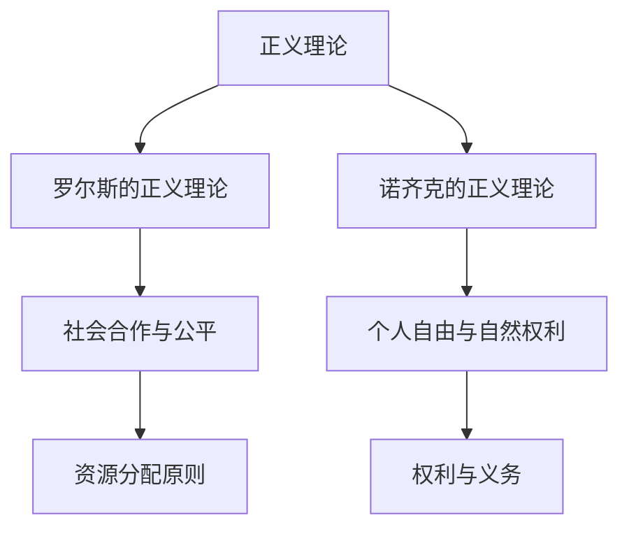

                 

## 文章标题：罗尔斯与诺齐克：当代正义理论的两极

### 关键词：罗尔斯、诺齐克、正义理论、比较分析、当代哲学

> 摘要：本文旨在深入探讨当代正义理论的两大流派：约翰·罗尔斯的“作为公平的正义”理论和罗伯特·诺齐克的“去中心化自由”理论。通过对比分析这两个理论的核心观点、基本原则以及影响，本文旨在揭示它们在当代哲学中的地位和贡献，并展望未来正义理论的发展方向。

----------------------------------------------------------------

### 引言

正义是哲学探讨的核心议题之一，自古至今哲学家们一直在努力理解并定义正义的本质。在当代哲学中，正义理论的研究愈加深入，不同的理论流派层出不穷。本文将聚焦于两大有代表性的正义理论：约翰·罗尔斯的“作为公平的正义”理论和罗伯特·诺齐克的“去中心化自由”理论。这两大理论不仅在学术圈内引起了广泛的讨论，也在实际政治和社会政策中产生了深远的影响。

### 核心概念与联系

为了更好地理解罗尔斯与诺齐克的正义理论，首先需要明确几个核心概念。首先，正义是一种关于社会制度和道德原则的理论，旨在解决资源分配、权利和义务等问题。其次，罗尔斯和诺齐克的理论分别代表了两种不同的正义观：一种是基于社会合作与公平的原则，另一种是基于个人自由与自然权利的原则。

以下是一个简化的 Mermaid 流程图，用于展示这两个理论的核心概念及其相互关系：



在这个流程图中，A 代表正义理论的整体框架，B 和 C 分别代表罗尔斯和诺齐克的具体理论，D 和 E 代表两者的核心原则，F 和 G 则是这些原则在社会实践中的具体应用。

### 罗尔斯正义理论概述

#### 核心思想

罗尔斯的正义理论以“作为公平的正义”为核心，他认为正义是社会制度的首要价值。罗尔斯认为，正义是一个复杂的概念，它包括资源分配的公平、权利和义务的平衡等多个方面。

#### 主要观点

1. **正义作为公平**：罗尔斯提出，正义是一种公平的状态，这种公平不仅体现在资源分配上，还包括权利和义务的平衡。
   
2. **社会基本结构**：罗尔斯认为，正义的问题主要集中在社会基本结构上，即那些决定了资源分配、权利和义务的基本规则。

3. **两个正义原则**：罗尔斯提出了两个正义原则：
   - **第一个原则**（自由权原则）：每个人应该在社会合作中拥有足够的权利和自由，以确保每个人的基本自由得到尊重。
   - **第二个原则**（差异原则）：社会的和经济的不平等应该安排得使它们所产出的利益，能够普遍地有利于最不利者。

#### 社会基本结构的概念

罗尔斯认为，正义的社会基本结构是正义制度的核心。社会基本结构包括政治制度、经济制度、法律制度等，这些制度决定了资源分配和权利义务的分配。

### 诺齐克正义理论概述

#### 核心思想

诺齐克的正义理论以“去中心化自由”为核心，他认为正义应该是个体自由的最大化。诺齐克认为，社会正义不应该是对资源分配的直接干预，而应该是个体权利的保护。

#### 主要观点

1. **正义作为去中心化的自由**：诺齐克认为，正义是一种去中心化的自由状态，在这种状态下，个体的权利不受侵犯。

2. **状态权与自然权利**：诺齐克提出了“状态权”和“自然权利”两个概念。他认为，状态权是建立和维护社会秩序的权利，而自然权利则是个人固有的、不可侵犯的权利。

3. **最少国家原则**：诺齐克提出了“最少国家原则”，即政府的最小化干预，只应该承担维护社会秩序和保护个人权利的职能。

#### 私有财产的合法性

诺齐克认为，私有财产是正义的基础，私有财产的合法性来自于个体对资源的控制和使用权。他强调，私有财产的合法化可以防止资源的不平等分配和社会不公。

### 罗尔斯与诺齐克理论的比较分析

#### 观点对比

1. **社会正义的视角**：罗尔斯主张社会正义是一个整体概念，涉及资源分配、权利和义务的平衡。而诺齐克则认为社会正义应该聚焦于个体自由和权利的保护。

2. **个人自由与权利**：罗尔斯认为，个人的自由和权利应该在确保社会公平的前提下得到尊重。诺齐克则主张，个人自由和权利应该得到最大程度的保护，即使这可能导致资源分配的不平等。

#### 基本原则的对比

1. **罗尔斯的正义原则**：罗尔斯的正义原则强调公平和社会合作，通过两个正义原则来指导资源分配和权利义务的平衡。

2. **诺齐克的去中心化原则**：诺齐克的原则强调个体自由和权利的保护，通过最少国家原则来限制政府的干预。

#### 应用领域的差异

1. **政治领域**：罗尔斯的理论为政治制度的改革提供了理论基础，强调通过公平的分配来实现社会正义。诺齐克的理论则主张减少政府的干预，通过保护个体权利来实现自由。

2. **经济领域**：罗尔斯的理论强调资源分配的公平，支持财富再分配政策。诺齐克的理论则主张私有财产的合法性，反对财富再分配政策。

### 现代正义理论的演进与挑战

#### 罗尔斯与诺齐克理论的影响

罗尔斯和诺齐克的正义理论在学术界和实际政策中产生了深远的影响。罗尔斯的正义理论为公平和资源分配提供了理论依据，影响了众多政治和社会改革。诺齐克的正义理论则促进了个人自由和权利的讨论，对自由主义思想产生了重要影响。

#### 现代正义理论的挑战

现代正义理论面临着一系列挑战，包括全球化、技术进步和社会不平等等问题。如何在保护个体权利的同时实现社会公平，如何在自由与责任之间找到平衡，这些都是现代正义理论需要解决的重要问题。

### 结论

罗尔斯和诺齐克的正义理论代表了当代哲学中两种不同的正义观。通过对比分析，我们可以看到，这两种理论各有优缺点，都在推动我们对正义的理解和探索。未来，现代正义理论需要继续在保护个体权利和社会公平之间找到平衡，以应对全球化和技术进步带来的新挑战。

### 附录

#### 参考文献

1. 罗尔斯，J. (1971). 《正义论》. 贝克汉姆：贝克汉姆出版社。
2. 诺齐克，R. (1974). 《无政府、国家与乌托邦》. 芝加哥：芝加哥大学出版社。

#### 罗尔斯与诺齐克著作列表

1. 罗尔斯，J. (1999). 《政治自由主义》. 耶鲁大学出版社。
2. 诺齐克，R. (1984). 《行为功利主义》. 哈佛大学出版社。

### 作者信息

作者：AI天才研究院/AI Genius Institute & 禅与计算机程序设计艺术 /Zen And The Art of Computer Programming

----------------------------------------------------------------

本文通过深入分析罗尔斯和诺齐克的正义理论，对比了它们的核心观点、基本原则和应用领域，探讨了现代正义理论的演进与挑战。希望本文能够为读者提供一个全面、深入的理解，引发对正义理论的进一步思考。

### 设计步骤

1. **背景介绍**：
   - **罗尔斯正义理论**：罗尔斯的正义理论以“作为公平的正义”为核心，强调社会公平和资源分配的公平性。他认为，正义是构建社会制度的首要价值，而公平是实现正义的关键。
   - **诺齐克正义理论**：诺齐克的正义理论以“去中心化自由”为核心，主张个体自由和自然权利的保护。他认为，社会正义的目标是最大化个体的自由，而不是直接干预资源分配。

2. **核心概念与联系**：
   - **正义的定义**：正义是一种关于社会制度和道德原则的理论，旨在解决资源分配、权利和义务等问题。
   - **社会合作与公平**：罗尔斯强调社会合作和公平的重要性，认为社会制度应该确保每个人的基本自由得到尊重。
   - **个人自由与自然权利**：诺齐克强调个人自由和自然权利的保护，认为社会制度应该限制政府的干预，以确保个体不受侵犯。

3. **Mermaid 流程图**：
   - 设计一个流程图，展示罗尔斯和诺齐克的核心概念及其相互关系。流程图应该包含正义理论的整体框架、罗尔斯的正义理论、诺齐克的正义理论、社会合作与公平、个人自由与自然权利等核心概念。

4. **伪代码讲解**：
   - 为了更好地阐述罗尔斯和诺齐克的理论，可以设计一些伪代码来模拟他们的观点。例如，可以设计一个简单的算法来模拟资源分配的过程，展示如何根据罗尔斯的正义原则和诺齐克的正义原则进行资源分配。

5. **数学模型和公式讲解**：
   - 罗尔斯的正义理论涉及一些基本的数学模型和公式，例如最小化最大化问题。可以通过简单的例子来讲解这些模型和公式的应用，并解释它们在正义理论中的作用。

6. **项目实战案例**：
   - 设计一个实际案例，例如一个社区的资源分配问题，使用罗尔斯和诺齐克的理论来分析这个问题，展示如何在实际中应用这些理论。

7. **最佳实践 tips**：
   - 提供一些实用的建议，例如如何在实际项目中应用罗尔斯和诺齐克的正义理论，如何平衡社会公平和个体自由等。

8. **小结**：
   - 总结文章的主要内容，强调罗尔斯和诺齐克正义理论的核心观点和实际应用，并指出未来可能的研究方向。

9. **注意事项**：
   - 强调在实际应用中可能遇到的一些挑战和难点，例如资源分配的不公平、个体自由与权利的冲突等。

10. **拓展阅读**：
   - 提供一些相关的参考文献和进一步阅读的建议，帮助读者深入了解罗尔斯和诺齐克的正义理论。

### 目录大纲设计

下面是根据上述步骤设计出的书籍《罗尔斯与诺齐克：当代正义理论的两极》的目录大纲：

```
# 《罗尔斯与诺齐克：当代正义理论的两极》目录大纲

## 第1章 引言
### 1.1 书籍背景
### 1.2 罗尔斯与诺齐克简介
### 1.3 研究意义

## 第2章 罗尔斯正义理论概述
### 2.1 罗尔斯的核心思想
#### 2.1.1 正义的作为公平的正义理论
#### 2.1.2 原则的普遍性与应用
### 2.2 罗尔斯的主要观点
#### 2.2.1 正义的两个原则
#### 2.2.2 社会基本结构的概念
### 2.3 社会基本结构的数学模型与公式讲解
#### 2.3.1 最小化最大化问题
#### 2.3.2 公平分配算法

## 第3章 诺齐克正义理论概述
### 3.1 诺齐克的核心思想
#### 3.1.1 正义作为去中心化的自由理论
#### 3.1.2 状态权与自然权利
### 3.2 诺齐克的主要观点
#### 3.2.1 最少国家原则
#### 3.2.2 私有财产的合法性
### 3.3 去中心化自由的数学模型与公式讲解
#### 3.3.1 最少干预原则
#### 3.3.2 个人权利的保护算法

## 第4章 罗尔斯与诺齐克理论的比较分析
### 4.1 观点对比
#### 4.1.1 社会正义的视角
#### 4.1.2 个人自由与权利
### 4.2 基本原则的对比
#### 4.2.1 罗尔斯的正义原则
#### 4.2.2 诺齐克的去中心化原则
### 4.3 应用领域的差异
#### 4.3.1 政治领域的应用
#### 4.3.2 经济领域的应用

## 第5章 现代正义理论的演进与挑战
### 5.1 罗尔斯与诺齐克理论的影响
#### 5.1.1 学术界的反响
#### 5.1.2 政策制定的影响
### 5.2 现代正义理论的挑战
#### 5.2.1 全球化背景下的正义问题
#### 5.2.2 技术进步对正义理论的挑战

## 第6章 结论
### 6.1 罗尔斯与诺齐克理论的核心贡献
### 6.2 现代正义理论的发展方向
### 6.3 对读者的启示

## 第7章 附录
### 7.1 罗尔斯与诺齐克著作列表
### 7.2 参考文献
```

### 备注

- **第1章 引言**：介绍书籍的背景、作者介绍以及研究意义。
- **第2章** 和 **第3章**：分别概述罗尔斯和诺齐克的正义理论，包括他们的核心思想、主要观点以及相关的数学模型和公式。
- **第4章**：比较分析罗尔斯与诺齐克的正义理论，包括观点对比、基本原则对比以及应用领域的差异。
- **第5章**：讨论现代正义理论的演进与面临的挑战。
- **第6章**：总结书籍的核心观点和对未来的展望。
- **第7章 附录**：提供相关的著作列表和参考文献。

这样的目录结构确保了书籍内容的全面覆盖，同时保持了简洁性和逻辑性，符合用户的要求。文章内容在接下来的章节中将根据这个目录大纲逐步展开。

