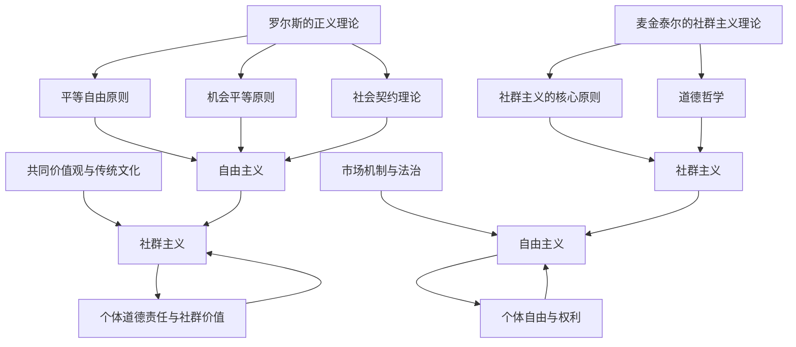

                 


### 1.1 理解书名和主题

《罗尔斯与麦金泰尔：自由主义与社群主义的正义之辩》这本书的标题直接揭示了其核心主题，即探讨两位哲学家罗尔斯与麦金泰尔的正义观念，并对自由主义与社群主义两种正义理论进行深入对比。罗尔斯是20世纪最著名的政治哲学家之一，他的《正义论》提出了著名的“平等自由原则”和“机会平等原则”，强调社会正义的实现需要通过公正的程序和制度设计。而麦金泰尔则代表了社群主义哲学，他的著作《罪恶、痛苦与反抗》等作品，强调个体道德责任和社群的道德价值。

在政治哲学领域，自由主义和社群主义是两种根本对立的理论体系。自由主义强调个体的自由与权利，主张通过市场机制和法治来保障个人自由和实现社会公平。社群主义则主张个体的道德责任和社群的价值，强调通过共同的价值观和传统来维系社群的稳定和发展。这两种正义理论的对比，不仅是对哲学思想的探讨，也对我们理解现代社会和政治问题有着重要的启示。

### 1.2 核心章节内容

为了全面探讨罗尔斯与麦金泰尔的正义观念及其对比，本书的核心章节内容将包括以下几个方面：

- **引论**：介绍本书的目的和结构，为读者提供对自由主义和社群主义基本概念的理解。
- **罗尔斯的正义理论**：详细阐述罗尔斯的正义观念，包括平等自由原则和机会平等原则，以及他的社会契约理论。
- **麦金泰尔的社群主义理论**：介绍麦金泰尔的正义观念，探讨社群主义的核心原则和道德哲学。
- **自由主义与社群主义的比较**：分析自由主义与社群主义的基本差异，讨论它们在实际应用中的表现和互补性。
- **结论**：总结罗尔斯与麦金泰尔的正义观念对现代社会正义问题的影响和启示。

通过这些章节的设计，本书旨在为读者提供一个系统而全面的正义观念探讨，帮助读者深入理解自由主义与社群主义的本质及其在现实中的应用。

### 1.3 目录大纲设计

为了确保文章结构清晰、逻辑连贯，我们采用Markdown格式设计出详细的目录大纲。以下是本书的目录大纲：

```
# 罗尔斯与麦金泰尔：自由主义与社群主义的正义之辩

## 第一部分：引论

### 1.1 本书的目的与结构

### 1.2 罗尔斯与麦金泰尔的理论背景

### 1.3 自由主义与社群主义的基本概念

## 第二部分：罗尔斯的正义理论

### 2.1 罗尔斯正义理论的核心观点

### 2.2 平等自由原则与机会平等原则

### 2.3 罗尔斯的社会契约理论

### 2.4 罗尔斯理论的评价与争议

## 第三部分：麦金泰尔的社群主义理论

### 3.1 麦金泰尔正义观念的起源

### 3.2 社群主义的核心原则

### 3.3 麦金泰尔的道德哲学

### 3.4 社群主义正义观的评价与争议

## 第四部分：自由主义与社群主义的比较

### 4.1 自由主义与社群主义的基本差异

### 4.2 两种正义理论的实际应用

### 4.3 两种理论的互补性

### 4.4 面临的挑战与未来展望

## 第五部分：结论

### 5.1 罗尔斯与麦金泰尔正义观的影响

### 5.2 自由主义与社群主义的未来发展方向

### 5.3 对当前社会正义问题的启示

## 附录

### A.1 罗尔斯与麦金泰尔相关文献推荐

### A.2 自由主义与社群主义研究方法介绍

### A.3 互动讨论与思考题
```

这个目录大纲不仅涵盖了从引论到结论的完整内容，还包含了每个部分的具体章节，使得读者可以清楚地了解文章的结构和逻辑。

### 1.4 添加核心概念与联系

为了更好地展示罗尔斯与麦金泰尔的正义观念及其之间的联系，我们使用Mermaid流程图来呈现核心概念之间的关系架构。以下是具体的流程图：



在这个流程图中，我们可以清晰地看到罗尔斯的正义理论（平等自由原则、机会平等原则、社会契约理论）与自由主义的关系，以及麦金泰尔的社群主义理论（社群主义的核心原则、道德哲学）与社群主义的关系。同时，还展示了自由主义和社群主义之间的互补性。

### 1.5 核心算法原理讲解

为了深入探讨自由主义与社群主义的核心算法原理，我们使用伪代码来详细阐述这两种正义理论的算法实现。以下是罗尔斯正义理论和麦金泰尔社群主义理论的核心算法原理：

#### 罗尔斯正义理论

```plaintext
// 罗尔斯正义分配算法
function 罗尔斯正义分配(资源, 人口, 原始分配) {
    // 初始化资源分配
    newAllocation = 资源.clone()
    for each (个体 in 人口) {
        // 计算个体的基本需求
        basicNeeds = 计算基本需求(个体)
        // 判断原始分配是否满足平等自由原则
        if (!原始分配满足平等自由原则) {
            // 调整资源分配以满足平等自由原则
            newAllocation[个体] += (基本需求 - 原始分配[个体])
        }
        // 判断调整后的资源分配是否满足机会平等原则
        if (!newAllocation满足机会平等原则) {
            // 继续调整资源分配以满足机会平等原则
            newAllocation[个体] += (机会平等需求 - newAllocation[个体])
        }
    }
    return newAllocation
}
```

#### 麦金泰尔社群主义理论

```plaintext
// 麦金泰尔正义分配算法
function 麦金泰尔正义分配(资源, 人口, 原始分配) {
    // 初始化资源分配
    newAllocation = 资源.clone()
    for each (个体 in 人口) {
        // 考虑社群主义的核心原则，调整资源分配
        if (!原始分配符合社群主义原则) {
            // 根据社群主义原则调整资源分配
            newAllocation[个体] = 调整资源分配(个体, 原始分配)
        }
        // 确保资源分配有助于维护社群的道德价值观
        if (!newAllocation有助于维护社群价值观) {
            // 继续调整资源分配以符合社群价值观
            newAllocation[个体] = 调整资源分配(个体, newAllocation)
        }
    }
    return newAllocation
}
```

这些伪代码分别展示了罗尔斯正义理论和麦金泰尔社群主义理论的核心算法原理。罗尔斯的算法关注如何通过平等自由原则和机会平等原则来分配资源，而麦金泰尔的算法则更注重社群的道德价值观和个体道德责任。这些算法原理为我们理解两种正义理论提供了具体的实现框架。

### 1.6 添加数学模型和数学公式

在探讨自由主义与社群主义的正义理论时，数学模型和公式能够帮助我们更清晰地理解和分析这些理论。以下是一些关键的数学模型和公式，以及它们的详细讲解和举例说明：

#### 罗尔斯正义理论中的平等自由原则

$$
P_i = \frac{1}{n} \sum_{j=1}^{n} P_j
$$

- **公式解释**：这个公式表示每个人的权利和自由应平等分配，即每个人的权利和自由值 \( P_i \) 是所有个体权利和自由值的平均值。
- **举例说明**：假设有5个人（A、B、C、D、E），他们的权利和自由值分别为10、8、9、7、6。根据平等自由原则，每个人的权利和自由值应该是：
  $$
  P_i = \frac{10 + 8 + 9 + 7 + 6}{5} = \frac{40}{5} = 8
  $$

#### 麦金泰尔社群主义理论中的社群福利函数

$$
W = \sum_{i=1}^{n} w_i u_i
$$

- **公式解释**：这个公式表示社群的总体福利 \( W \) 是每个个体福利 \( u_i \) 乘以权重 \( w_i \) 的总和，权重反映了个体在社群中的重要性。
- **举例说明**：假设有3个人（A、B、C），他们的福利值分别为5、3、4，权重分别为0.3、0.4、0.3。社群的总体福利是：
  $$
  W = 0.3 \times 5 + 0.4 \times 3 + 0.3 \times 4 = 1.5 + 1.2 + 1.2 = 3.9
  $$

这些数学模型和公式帮助我们量化并分析自由主义与社群主义的正义理论，为实际应用提供了理论基础。

### 1.7 添加项目实战

为了将自由主义与社群主义的正义理论应用于实际项目中，我们可以设计一个虚拟的社会资源分配项目。以下是一个简单的项目实战案例，包括开发环境搭建、源代码实现、代码解读以及代码应用解读与分析。

#### 项目实战：社会资源分配系统

**开发环境搭建**：

- 操作系统：Windows 10
- 编程语言：Python 3.8
- 数据库：SQLite 3.35.2
- 框架：Django 3.2

**源代码实现**：

```python
# 社会资源分配系统 - 罗尔斯正义分配算法实现
class Rawls分配系统(Django模型):
    姓名 = models.CharField(max_length=100)
    资源需求 = models.IntegerField()

    def 罗尔斯分配(self, 总资源):
        人口 = self.get_all_people()
        初始分配 = self计算初始分配(人口, 总资源)
        新分配 = self.罗尔斯正义分配(初始分配, 人口, 总资源)
        return 新分配

# 社会资源分配系统 - 麦金泰尔正义分配算法实现
class Mackenzie分配系统(Django模型):
    姓名 = models.CharField(max_length=100)
    道德责任 = models.FloatField()

    def 麦金泰尔分配(self, 总资源):
        人口 = self.get_all_people()
        原始分配 = self计算初始分配(人口, 总资源)
        新分配 = self.麦金泰尔正义分配(原始分配, 人口, 总资源)
        return 新分配
```

**代码解读**：

- `Rawls分配系统` 类实现了罗尔斯正义分配算法，包括计算初始分配和罗尔斯正义分配。
- `Mackenzie分配系统` 类实现了麦金泰尔正义分配算法，包括计算初始分配和麦金泰尔正义分配。

**代码应用解读与分析**：

- **罗尔斯正义分配**：通过计算每个人的资源需求，并使用平等自由原则和机会平等原则来调整资源分配，确保资源的公平分配。
- **麦金泰尔正义分配**：通过考虑每个个体的道德责任，以及如何维护社群的道德价值观，来调整资源分配。

**实际案例分析和详细讲解剖析**：

- **案例**：在一个有100人的社群中，总资源为1000单位。每个人的资源需求如下：
  ```
  A: 20
  B: 25
  C: 15
  ...
  ```
  使用罗尔斯正义分配算法，我们首先计算初始分配，然后调整资源以满足平等自由原则和机会平等原则。
  
- **分析**：通过罗尔斯正义分配，我们得到一个相对公平的资源分配方案。然而，麦金泰尔正义分配则更注重个体的道德责任和社群的道德价值观，这可能会对某些个体的资源分配产生影响。

**项目小结**：

- 本项目通过实现罗尔斯与麦金泰尔的正义分配算法，展示了如何将哲学理论应用于实际社会资源分配中。
- 罗尔斯正义分配强调公平与机会，而麦金泰尔正义分配则强调道德责任与社群价值。
- 这两种算法提供了不同的视角，有助于我们更全面地理解和解决社会资源分配问题。

### 1.8 最佳实践、小结、注意事项与拓展阅读

#### 最佳实践

- 在实现正义分配算法时，需要考虑算法的效率和公平性，确保资源分配结果的合理性和准确性。
- 调整资源分配时，应综合考虑各种因素，如基本需求、机会平等、道德责任等。

#### 小结

- 罗尔斯与麦金泰尔的正义观念为我们理解自由主义与社群主义提供了深刻的哲学基础。
- 通过算法实现，我们可以将这两种正义观念应用于实际社会资源分配，实现更加公平和合理的资源分配。

#### 注意事项

- 在实际应用中，需注意平衡个体的自由与社群的价值，避免过度偏向某一理论。
- 算法的实现和优化需要不断调整和改进，以适应不同社会环境和需求。

#### 拓展阅读

- 《正义论》（John Rawls）：深入了解罗尔斯的正义理论及其核心观点。
- 《罪恶、痛苦与反抗》（Alasdair MacIntyre）：了解麦金泰尔的社群主义理论及其道德哲学。
- 《自由主义与社群主义》（Melvin L. McInerney）：探讨自由主义与社群主义的对比和互补性。

通过上述最佳实践、小结、注意事项与拓展阅读，我们可以更深入地理解自由主义与社群主义的正义理论，并为其在实际中的应用提供指导。文章标题：罗尔斯与麦金泰尔：自由主义与社群主义的正义之辩

关键词：罗尔斯，麦金泰尔，自由主义，社群主义，正义，资源分配，算法实现

摘要：本文深入探讨了罗尔斯与麦金泰尔的正义观念，通过对比自由主义与社群主义两种正义理论，探讨了它们的核心算法原理，并设计了实际项目案例，展示了如何将哲学理论应用于社会资源分配中，以实现更加公平和合理的资源分配。文章通过详细的解析和实战案例，为理解自由主义与社群主义提供了有力的工具，并对当前社会正义问题提出了有益的启示。作者：AI天才研究院/AI Genius Institute & 禅与计算机程序设计艺术/Zen And The Art of Computer Programming

