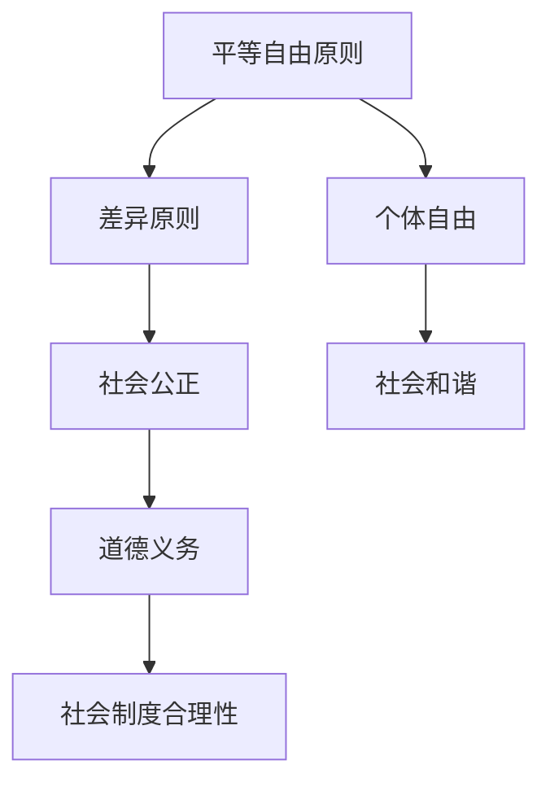
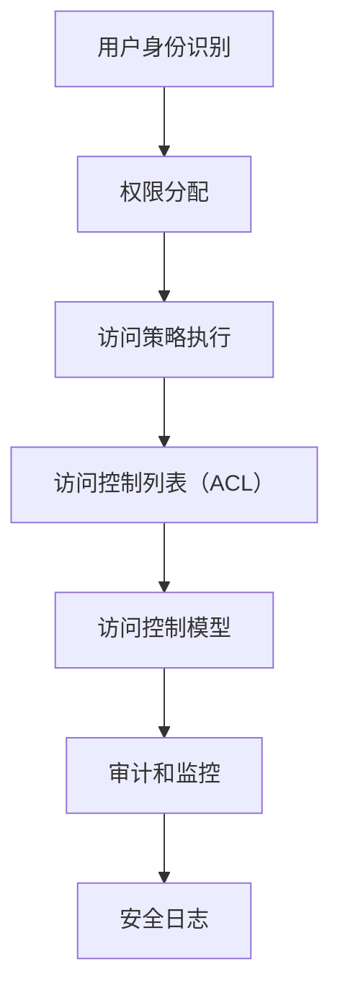
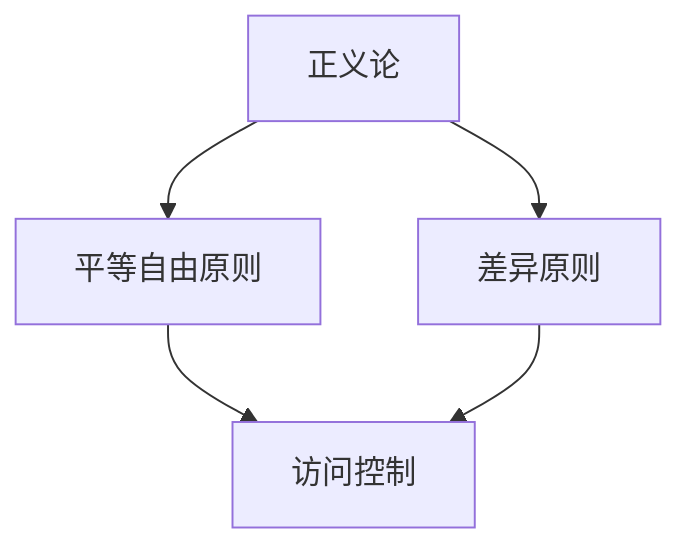

                 

### 正义论的伦理学基础

#### 背景介绍

正义理论作为伦理学的一个核心概念，关注社会公正和道德义务的分配。正义论的历史源远流长，从古希腊哲学家的探讨，到中世纪神学家的阐释，再到近代社会契约论和功利主义的兴起，正义理论不断发展，形成了丰富而多元的理论体系。罗尔斯的《正义论》作为20世纪最具影响力的正义理论之一，以其独特的核心理念和方法论对后世产生了深远影响。

#### 核心概念与联系

在罗尔斯的正义理论中，有两个基本原则构成了其核心：平等自由原则和差异原则。平等自由原则强调每个人都有权利享有平等的自由，不受他人干涉。差异原则则主张社会和经济的不平等应当被安排，以使每个人都能从中受益，特别是那些社会地位较低的人。

这两个原则之间存在密切的联系。平等自由原则是基础，它保证了个体自由的基本权利。差异原则则是对社会分配的进一步调节，旨在实现社会公正。两者的结合构成了罗尔斯正义理论的基本框架，为评价社会制度的合理性提供了理论依据。

#### 核心概念原理之间的关系架构

为了更好地理解罗尔斯的正义理论，我们可以通过以下Mermaid流程图展示其核心概念之间的关系：



在该流程图中，平等自由原则和差异原则是罗尔斯正义理论的核心，它们共同推动了社会公正的实现。个体自由和社会和谐是平等自由原则的延伸，道德义务和社会制度合理性则是社会公正的结果。

### 权利与义务

正义论中的权利和义务是两个关键概念。权利是指个体在社会中享有的基本权益，如自由、财产权等。而义务则是个体应尽的责任，如遵守法律、尊重他人的权利等。罗尔斯认为，权利和义务之间应当保持平衡，以实现社会的公平与和谐。

#### 权利

权利作为个体在社会中的基本保障，具有不可剥夺性。罗尔斯强调，每个人应当享有平等的自由，包括言论自由、宗教自由等。这些权利是平等自由原则的具体体现，是构建公正社会的基石。

#### 义务

义务是个体应尽的责任，是维护社会秩序和公平的重要保障。罗尔斯认为，每个人都应当遵守法律、尊重他人的权利，承担起自己的社会责任。这些义务不仅维护了社会的稳定，也为实现社会公正提供了支持。

#### 权利与义务的关系

权利与义务是相互依存、相互制约的关系。权利的实现离不开义务的履行，而义务的履行则保障了权利的实现。罗尔斯通过其正义原则，强调权利与义务之间的平衡，主张社会公正的实现需要个体权利与义务的协调统一。

### 社会公正的实现

社会公正的实现是正义论的核心目标，也是罗尔斯正义理论的核心理念。罗尔斯认为，社会公正包括两个方面：平等自由和差异原则。通过这两个原则的运用，可以实现社会的公平与和谐。

#### 平等自由

平等自由原则强调每个人都有权利享有平等的自由，不受他人干涉。这一原则保障了个体基本权利的实现，是构建公正社会的基础。在实际应用中，平等自由原则体现在政治自由、经济自由等方面。

#### 差异原则

差异原则则主张社会和经济的不平等应当被安排，以使每个人都能从中受益，特别是那些社会地位较低的人。差异原则通过调节社会和经济不平等，实现了社会的公平与和谐。

#### 实现途径

为了实现社会公正，罗尔斯提出了以下途径：

1. **政治机制**：通过建立公正的政治机制，保障个体的基本权利，如选举权、言论自由等。
2. **经济调节**：通过经济调节，实现财富的公平分配，保障每个人的基本生活需求。
3. **社会服务**：提供充足的社会服务，帮助弱势群体融入社会，实现社会和谐。

### 总结

罗尔斯的正义论为我们提供了评价社会制度合理性的理论依据。通过平等自由原则和差异原则，我们可以实现社会的公平与和谐。正义论中的权利与义务相互依存、相互制约，为实现社会公正提供了保障。通过政治机制、经济调节和社会服务等途径，我们可以推动社会公正的实现，构建一个公平、和谐的社会。

### 正义论与伦理学的联系

正义论与伦理学之间存在着紧密的联系，两者共同关注社会公正和道德义务的分配。正义论为伦理学提供了理论框架，而伦理学则为正义论提供了道德基础。罗尔斯的正义论正是这种联系的典范。

#### 正义论的理论基础

罗尔斯的正义论建立在一系列伦理学基础上。首先，正义论关注个体权利的保障，这源自于康德伦理学的观点，即个体应当享有基本的自由和尊严。其次，正义论强调社会公正，这与功利主义伦理学的观点形成鲜明对比，功利主义主张通过最大化幸福来实现社会公正，而罗尔斯则主张通过平等分配来实现社会公正。

#### 伦理学的道德基础

伦理学为正义论提供了道德基础。正义论中的权利和义务，都是基于伦理学的道德原则。例如，平等自由原则体现了道德上的公正和尊重，而差异原则则体现了道德上的同情和关爱。这些道德原则不仅为正义论提供了理论依据，也为我们评价社会制度提供了道德标准。

#### 正义论在伦理学中的应用

正义论在伦理学中有着广泛的应用。首先，在道德哲学领域，正义论可以帮助我们理解和评价道德行为。例如，通过平等自由原则，我们可以评价一个道德行为是否尊重个体的权利和尊严。其次，在政治哲学领域，正义论可以指导我们设计公正的社会制度，如公平的税收制度、社会福利制度等。最后，在社会学领域，正义论可以帮助我们分析社会不公现象，提出改进社会制度的建议。

#### 伦理学的正义论视角

从伦理学的角度来看，正义论关注的是个体和社会之间的道德关系。正义论认为，个体应当为社会公正做出贡献，同时社会应当保障个体的权利和利益。这种观点强调了个体和社会之间的相互依存关系，为我们理解和处理道德问题提供了新的视角。

### 实际案例与讨论

为了更好地理解正义论与伦理学的联系，我们可以通过实际案例进行讨论。例如，在环境保护领域，正义论可以帮助我们评价环境保护政策的合理性。根据正义论，环境保护政策应当公平地分配资源，确保每个人都能享受到清洁的环境。如果政策导致某些群体承受更多的负担，那么这种政策就违背了正义原则。

再如，在劳动权益保护方面，正义论可以帮助我们评价劳动法的公正性。根据正义论，劳动法应当保障每个劳动者的基本权利，如公平的工资、合理的工作条件等。如果劳动法在某些方面未能公平对待劳动者，那么这种劳动法就违背了正义原则。

通过这些实际案例，我们可以看到正义论与伦理学的联系是如何在现实生活中发挥作用的。正义论为我们提供了一种评价社会制度合理性的道德标准，而伦理学则为我们提供了理解和应用这种标准的理论基础。

### 总结

正义论与伦理学之间的联系是多层次、多维度的。正义论为伦理学提供了理论框架，而伦理学则为正义论提供了道德基础。两者共同关注社会公正和道德义务的分配，为实现一个公平、和谐的社会提供了理论支持和实践指导。通过理解和应用正义论与伦理学的联系，我们可以更好地评价社会制度的合理性，推动社会的改革与发展。

## 第二部分：访问控制与伦理

### 第4章：访问控制概述

访问控制是一种重要的安全机制，旨在确保只有授权用户才能访问特定资源。在现代社会中，随着信息技术的迅猛发展，访问控制已成为保护信息安全的关键手段。本章将介绍访问控制的基本概念、重要性及其在信息安全体系中的地位。

#### 4.1 访问控制的定义与重要性

访问控制是指通过某种机制，限制或允许用户对计算机系统、网络资源、文件或数据进行访问。它通过识别和验证用户身份，确保用户只能访问他们被授权的资源，从而防止未经授权的访问和恶意攻击。

访问控制的重要性体现在以下几个方面：

1. **保障信息安全**：访问控制是信息安全的基本保障，通过限制未经授权的访问，保护敏感信息和关键资源。
2. **防止数据泄露**：访问控制有助于防止内部人员或外部攻击者窃取、篡改或泄露敏感数据。
3. **维护系统稳定**：通过合理设置访问权限，避免不当操作导致的系统崩溃或数据损坏。

#### 4.2 访问控制的基本概念

访问控制涉及几个关键概念，包括：

- **用户身份识别**：识别用户身份，通常通过用户名、密码或生物识别技术。
- **权限分配**：根据用户的身份和角色，分配不同的访问权限。
- **访问策略**：定义用户访问资源时的规则和条件，如允许访问、拒绝访问或条件访问。
- **审计和监控**：记录用户的访问行为，以便进行审计和监控，及时发现异常行为。

#### 4.3 访问控制的体系结构

访问控制体系通常包括以下几个方面：

- **认证系统**：负责识别和验证用户身份。
- **授权系统**：根据用户的身份和角色，决定用户对资源的访问权限。
- **访问控制列表（ACL）**：记录每个用户对每个资源的访问权限。
- **访问控制模型**：定义访问控制的基本规则和策略，如基于角色的访问控制（RBAC）和基于属性的访问控制（ABAC）。

### 访问控制体系结构与工作原理

访问控制的体系结构通常包括以下几个部分：

1. **用户身份识别**：用户访问系统时，首先需要通过认证系统验证其身份。常见的认证方式有用户名和密码、数字证书、生物识别等。
2. **权限分配**：认证通过后，系统根据用户的身份和角色，将其分配到不同的访问组或角色组中，并设置相应的访问权限。
3. **访问策略执行**：当用户尝试访问资源时，系统会根据访问控制列表（ACL）和访问控制模型，判断用户是否具有访问权限。如果权限验证通过，用户即可访问资源；否则，系统会拒绝访问并记录相关日志。
4. **审计和监控**：系统记录用户的访问行为，包括访问时间、访问对象、访问结果等，以便进行审计和监控，及时发现和应对潜在的安全威胁。

以下是访问控制体系结构的Mermaid流程图：



在这个流程图中，用户身份识别、权限分配、访问策略执行、访问控制列表（ACL）、访问控制模型和审计监控构成了访问控制的核心环节，确保系统安全运行。

### 访问控制与伦理

访问控制不仅在技术层面确保信息安全，同时也涉及伦理层面。合理的访问控制应当遵循以下伦理原则：

1. **透明性**：访问控制机制应当公开透明，用户应当清楚了解自己的访问权限和权限分配原则。
2. **责任**：访问控制的实施者和维护者应当承担相应的责任，确保访问权限的合理性和安全性。
3. **公平性**：访问控制不应歧视任何用户，应当确保每个人在访问资源时受到公平对待。

### 访问控制技术的挑战与未来趋势

随着信息技术的发展，访问控制技术也面临新的挑战。未来，访问控制技术将朝着以下方向发展：

1. **自适应访问控制**：基于用户行为和系统状态，动态调整访问权限，提高访问控制的灵活性和适应性。
2. **多因素认证**：结合多种认证方式，如生物识别、密码、令牌等，提高认证的可靠性和安全性。
3. **区块链技术**：利用区块链技术的不可篡改性，增强访问控制的安全性和透明性。

### 总结

访问控制是一种重要的安全机制，通过限制或允许用户对特定资源的访问，保障信息安全。访问控制的基本概念包括用户身份识别、权限分配、访问策略执行等，其体系结构包括认证系统、授权系统、访问控制列表（ACL）和审计监控等部分。访问控制不仅涉及技术层面，还涉及伦理层面，合理的访问控制应当遵循透明性、责任和公平性等伦理原则。未来，访问控制技术将朝着自适应、多因素认证和区块链技术等方向发展，提高访问控制的安全性和灵活性。

## 第三部分：罗尔斯正义论与访问控制的关系

### 第5章：罗尔斯正义论与访问控制的关系

#### 5.1 正义论与访问控制的理论联系

罗尔斯的正义论与访问控制之间存在深刻的理论联系。罗尔斯的正义论关注社会公正和道德义务的分配，而访问控制则是一种具体实现社会公正的技术手段。以下将从正义论的核心原则出发，探讨其与访问控制之间的理论联系。

首先，罗尔斯的平等自由原则与访问控制中的用户身份识别和权限分配有直接关系。平等自由原则强调每个人都有权利享有平等的自由，不受他人干涉。在访问控制中，用户身份识别和权限分配是实现这一原则的关键环节。通过认证系统，系统可以识别和验证用户身份，确保每个用户只能访问他们被授权的资源，从而保障个体的自由和尊严。

其次，罗尔斯的差异原则与访问控制中的访问策略执行和审计监控有密切联系。差异原则主张社会和经济的不平等应当被安排，以使每个人都能从中受益，特别是那些社会地位较低的人。在访问控制中，访问策略执行和审计监控有助于确保资源的合理分配和公平利用。通过设定不同的访问权限和监控用户行为，系统可以确保每个人都能够公平地使用资源，同时防止滥用和浪费。

#### 5.2 正义论在访问控制中的应用

正义论在访问控制中的应用主要体现在以下几个方面：

1. **访问权限的分配**：根据罗尔斯的正义原则，访问权限的分配应当遵循平等自由原则和差异原则。在访问控制系统中，管理员可以根据用户的身份、角色和需求，合理分配访问权限，确保每个人都能公平地使用资源。

2. **访问策略的设定**：访问策略的设定应当考虑到社会公正和道德义务。例如，在设定访问策略时，应确保重要资源和敏感数据得到充分的保护，同时避免对用户自由的过度限制。通过平衡安全性和用户自由，实现社会的公正与和谐。

3. **审计和监控**：审计和监控是确保访问控制有效性的重要手段。根据罗尔斯的正义论，审计和监控应当透明、公平，确保每个用户的行为都在监督之下。通过记录用户的访问行为和监控异常行为，系统可以及时发现和应对潜在的安全威胁。

#### 5.3 访问控制中的伦理问题

访问控制不仅涉及技术层面，还涉及伦理层面。以下讨论访问控制中可能出现的伦理问题及其解决方案：

1. **隐私保护**：访问控制系统的运行涉及用户身份识别和访问记录，这可能会侵犯用户的隐私权。为解决这一问题，可以采用加密技术保护用户数据，同时制定严格的隐私保护政策，确保用户数据的安全。

2. **权力滥用**：访问控制系统的实施者和维护者可能存在权力滥用的问题。为防止权力滥用，可以建立监督机制，确保访问控制系统的运行透明、公平。此外，可以对访问控制系统的管理员进行定期培训，提高其道德意识和责任感。

3. **公平性**：访问控制系统的设定应当确保每个人都能够公平地使用资源。为实现公平性，可以采用基于角色的访问控制（RBAC）和基于属性的访问控制（ABAC）等技术，确保资源的分配公平合理。

#### 5.4 伦理学原则在访问控制中的应用

为解决访问控制中的伦理问题，可以引入以下伦理学原则：

1. **透明性原则**：访问控制系统的运行应当公开透明，用户应当清楚了解自己的访问权限和权限分配原则。

2. **责任原则**：访问控制系统的实施者和维护者应当承担相应的责任，确保访问权限的合理性和安全性。

3. **公平性原则**：访问控制系统的设定应当确保每个人都能够公平地使用资源，避免对特定群体进行歧视。

通过引入这些伦理学原则，访问控制系统不仅可以实现技术上的安全，还可以在伦理上得到认可，为构建一个公正、和谐的社会提供支持。

### 总结

罗尔斯的正义论与访问控制之间存在深刻的理论联系。正义论为访问控制提供了伦理基础，而访问控制则是实现正义的具体手段。在访问控制中，正义原则的应用体现在访问权限的分配、访问策略的设定以及审计和监控等方面。同时，访问控制中可能出现的伦理问题，如隐私保护、权力滥用和公平性等，可以通过引入伦理学原则得到解决。通过合理应用正义论和伦理学原则，我们可以构建一个既安全又公正的访问控制系统，为社会的和谐发展提供支持。

### 访问控制中的伦理学原则

在访问控制中，引入伦理学原则对于确保系统的公正性、透明性和责任性至关重要。以下将讨论几个关键的伦理学原则，并探讨它们在访问控制中的应用。

#### 6.1 透明性原则

透明性原则要求访问控制系统的设计、实施和运行过程对用户开放，确保用户能够清楚地了解自己的访问权限和权限分配原则。透明性不仅有助于提高用户对系统的信任，还能防止潜在的滥用行为。

1. **应用场景**：在访问控制系统中，透明性原则体现在以下几个方面：
   - 访问策略的公开：用户应能够查询和了解系统中的访问策略，包括访问控制列表（ACL）和访问控制模型。
   - 访问记录的公开：系统应记录用户的访问行为，并提供查询接口，让用户能够查看自己的访问记录。
   - 权限变更通知：当用户的访问权限发生变化时，系统应通知用户，确保用户及时了解自己的权限状态。

2. **实施方法**：为了实现透明性，可以采取以下措施：
   - 设计简洁明了的用户界面，方便用户查询和了解访问策略。
   - 使用日志记录和审计功能，确保访问行为和权限变更得到详细记录。
   - 定期发布系统公告，告知用户系统的更新和变更情况。

#### 6.2 责任原则

责任原则要求访问控制系统的实施者和维护者对其行为承担相应的责任，确保访问控制系统的合理运行和安全性。责任原则有助于防止滥用权限，提高系统的可信度。

1. **应用场景**：责任原则在访问控制中的应用包括：
   - 管理员职责：访问控制系统的管理员应当明确自己的职责，包括权限的分配、访问策略的设定、审计日志的审查等。
   - 权限滥用检测：系统应具备检测和报告权限滥用行为的能力，管理员应根据检测结果采取相应的措施。
   - 责任追究：对于因权限滥用导致的安全事故，应追究相关责任人的责任，确保责任的落实。

2. **实施方法**：为了实现责任原则，可以采取以下措施：
   - 建立明确的管理员职责和权限，确保管理员能够清晰了解自己的职责范围。
   - 实施权限分离，确保不同权限的管理员不能同时执行相互冲突的操作。
   - 定期对管理员进行培训，提高其责任意识和安全意识。

#### 6.3 公平性原则

公平性原则要求访问控制系统在分配权限和执行访问策略时，应确保对所有用户的公平对待，避免对特定群体进行歧视。

1. **应用场景**：公平性原则在访问控制中的应用包括：
   - 权限分配：在分配访问权限时，应基于用户的实际需求和职责，确保权限的合理分配。
   - 访问策略：在设定访问策略时，应充分考虑用户的角色和职责，避免对特定角色的用户进行歧视。
   - 异常处理：在处理访问异常时，应遵循统一的标准和程序，确保处理结果公正。

2. **实施方法**：为了实现公平性，可以采取以下措施：
   - 使用基于角色的访问控制（RBAC）和基于属性的访问控制（ABAC）技术，确保权限分配的合理性和透明性。
   - 建立明确的访问策略和规则，确保访问控制系统的运行遵循统一的准则。
   - 定期审查和更新访问控制策略，确保系统的公平性和适应性。

### 实际应用案例

为了更好地理解这些伦理学原则在访问控制中的应用，以下列举几个实际应用案例：

1. **案例一：企业内部访问控制**
   - **透明性**：企业内部访问控制系统应公开权限分配和访问策略，确保员工能够清楚地了解自己的访问权限。
   - **责任**：企业应明确界定管理员职责，确保管理员能够有效管理访问权限，防止滥用行为。
   - **公平性**：企业应确保访问权限的分配公平合理，避免对特定员工进行歧视。

2. **案例二：医疗信息系统访问控制**
   - **透明性**：医疗信息系统应提供用户查询权限和访问记录的功能，确保用户能够了解自己的访问权限和访问记录。
   - **责任**：医疗信息系统的管理员应承担起保障患者隐私和信息安全的责任，确保访问控制系统的安全运行。
   - **公平性**：医疗信息系统应确保不同角色的用户（如医生、护士、患者）在访问医疗信息时受到公平对待。

通过这些实际应用案例，我们可以看到，透明性、责任和公平性原则在访问控制中的重要性。只有在这些原则的指导下，访问控制系统才能真正实现其保护信息安全、维护社会公正的使命。

### 总结

访问控制中的伦理学原则对于确保系统的公正性、透明性和责任性至关重要。透明性原则要求访问控制系统的设计和运行过程公开透明，责任原则要求实施者和维护者对其行为承担相应的责任，公平性原则要求访问控制系统的运行对所有用户公平对待。通过引入和实施这些伦理学原则，我们可以构建一个既安全又公正的访问控制系统，为社会的和谐发展提供支持。

### 访问控制中的伦理学案例分析

为了更深入地探讨访问控制中的伦理学问题，以下通过三个实际案例来分析访问控制中的伦理挑战及其解决方案。

#### 7.1 案例分析1：网络隐私与数据访问

**背景**：在互联网时代，个人隐私问题日益凸显。网络服务提供商如何平衡用户的隐私保护和数据的合理访问成为一大挑战。

**伦理挑战**：在这个案例中，主要伦理挑战在于如何在不侵犯用户隐私的前提下，允许合法用户访问所需的数据。一方面，用户希望自己的个人信息得到保护；另一方面，网络服务提供商需要根据用户需求提供数据访问。

**解决方案**：
1. **透明性原则**：网络服务提供商应明确告知用户其数据的使用政策，确保用户了解自己的数据将如何被访问和使用。
2. **隐私保护技术**：采用加密技术保护用户数据，防止未经授权的访问。例如，使用端到端加密技术保护用户通信内容。
3. **最小权限原则**：访问控制应遵循最小权限原则，即用户只被授权访问其必需的数据，避免过度访问。
4. **用户同意机制**：在数据访问前，应获得用户的明确同意，确保用户了解并同意数据访问。

#### 7.2 案例分析2：企业内部访问控制策略

**背景**：在企业内部，访问控制策略需要确保员工在执行职责时能够访问必要的资源，同时防止内部人员的滥用行为。

**伦理挑战**：在这个案例中，主要伦理挑战在于如何确保访问控制策略既能够提高工作效率，又能够防止权力滥用。

**解决方案**：
1. **职责分离**：实施职责分离原则，确保不同职责的员工不能同时访问敏感资源，从而减少滥用风险。
2. **访问审计**：定期进行访问审计，记录和分析员工的访问行为，及时发现异常行为。
3. **权限审批流程**：设立明确的权限审批流程，确保权限的分配和变更经过适当审批，防止未经授权的访问。
4. **用户培训**：对员工进行定期培训，提高其道德意识和责任意识，防止无意中的滥用行为。

#### 7.3 案例分析3：医疗信息访问控制

**背景**：在医疗领域，信息访问控制关系到患者的隐私保护和生命安全。如何确保医生和其他医疗人员能够及时访问患者的敏感信息，同时防止信息泄露，是一个重要问题。

**伦理挑战**：在这个案例中，主要伦理挑战在于如何在保障患者隐私的同时，允许医生在紧急情况下访问患者的医疗信息。

**解决方案**：
1. **紧急访问权限**：在紧急情况下，为医生设置特殊的紧急访问权限，确保医生能够在必要时刻访问患者的医疗信息。
2. **访问记录和监控**：记录医生的访问行为，并在系统中进行实时监控，确保访问行为透明。
3. **用户教育和培训**：对医生和其他医疗人员进行隐私保护教育和培训，提高其道德意识和责任意识。
4. **访问权限审批**：在设置访问权限时，应经过适当的审批流程，确保权限的合理性和必要性。

### 总结

通过上述案例分析，我们可以看到，访问控制中的伦理挑战涉及多个方面，包括隐私保护、权力滥用和紧急访问等。针对这些挑战，可以采取多种解决方案，如透明性原则、隐私保护技术、职责分离、访问审计和用户培训等。通过合理应用这些解决方案，我们可以构建一个既安全又公正的访问控制系统，为社会的和谐发展提供支持。

### 权限管理的概念与原则

#### 8.1 权限管理的定义与目的

权限管理是指通过定义、分配、控制和监控用户对系统资源的访问权限，确保只有授权用户能够在适当的时间和条件下访问特定的资源。权限管理的目的是确保信息安全，防止未经授权的访问和数据泄露，同时提高系统效率，避免因权限过多而导致的混乱和资源浪费。

权限管理在信息安全体系中扮演着至关重要的角色。通过有效的权限管理，企业可以确保：
- 系统资源被合理利用，避免资源浪费。
- 系统安全得到保障，防止未授权用户访问敏感数据。
- 用户行为受到监控，及时发现和应对潜在的安全威胁。

#### 8.2 权限管理的基本原则

权限管理遵循以下基本原则，以确保系统的安全性、可靠性和公平性。

1. **最小权限原则**：用户只能获得完成其任务所需的最小权限。这意味着任何用户或角色都不应拥有不必要的访问权限。通过实施最小权限原则，可以最大限度地减少因权限滥用或误用导致的安全风险。

2. **职责分离原则**：职责分离原则要求系统将不同的职责分配给不同的用户或角色，防止一个人同时拥有多种职责，从而减少滥用和欺诈的风险。例如，系统管理员不应同时拥有数据输入和审核的权限。

3. **透明性原则**：权限管理的过程和结果应透明，用户应能够清楚地了解自己的权限状态和权限分配原则。透明性有助于增强用户对系统的信任，并便于审计和监控。

4. **可审计性原则**：权限管理应具备良好的可审计性，记录用户的访问行为和权限变更历史。这些记录对于审计、合规检查和事后分析至关重要。

5. **最小特权原则**：与最小权限原则类似，最小特权原则强调用户应拥有完成其任务所需的最小权限。这有助于减少因权限过多导致的安全漏洞和风险。

#### 8.3 权限管理的方法与工具

权限管理的方法和工具有多种，包括：

1. **基于角色的访问控制（RBAC）**：RBAC通过将用户分配到不同的角色，并为每个角色分配相应的权限，从而简化权限管理。RBAC的核心思想是将权限与角色关联，用户通过角色获得权限。这种方法具有可扩展性、灵活性和易于管理性。

2. **基于属性的访问控制（ABAC）**：ABAC通过将访问控制决策与用户的属性（如角色、位置、时间等）相关联，动态决定用户对资源的访问权限。ABAC适用于复杂的访问控制需求，如根据用户的位置或时间来动态调整权限。

3. **访问控制列表（ACL）**：ACL是一种常见的权限管理工具，通过为每个资源定义访问控制列表，明确列出哪些用户或角色具有对特定资源的访问权限。ACL具有灵活性和细粒度性，但管理复杂度较高。

4. **权限审计和监控**：权限审计和监控是确保权限管理有效性的关键。通过记录用户的访问行为和权限变更历史，权限审计和监控可以帮助发现潜在的安全威胁和异常行为。

5. **权限管理平台**：权限管理平台集成多种权限管理功能，如用户和角色管理、权限分配、访问控制策略定义和审计监控等。这些平台通常提供图形界面和自动化工具，简化权限管理流程。

#### 权限管理流程

权限管理通常包括以下流程：

1. **需求分析**：分析系统中的资源、用户和角色，确定访问控制的需求。
2. **角色定义**：定义系统中的角色，并为每个角色分配适当的权限。
3. **权限分配**：将用户分配到不同的角色，从而获得相应的权限。
4. **权限审查和调整**：定期审查权限分配的合理性，根据业务需求调整权限。
5. **审计和监控**：记录用户的访问行为和权限变更历史，监控潜在的安全威胁和异常行为。
6. **权限回收和变更**：在用户离职或角色变更时，及时回收或调整权限。

通过遵循这些流程和原则，企业可以构建一个高效、安全的权限管理系统，保障信息安全，提高业务效率。

### 权限管理中的伦理挑战

#### 9.1 权力滥用与道德责任

在权限管理中，权力滥用是一个普遍存在的伦理问题。权力滥用可能导致以下后果：

1. **隐私侵犯**：管理员滥用权限可能未经授权访问用户数据，侵犯用户隐私。
2. **数据泄露**：滥用权限可能导致敏感数据泄露，给企业带来声誉和经济损失。
3. **不公平待遇**：管理员可能利用权限优势对特定用户进行不公平待遇，损害企业的公信力。

**道德责任**：权限管理者和维护者对他们的行为负有道德责任。以下是具体的道德责任：

- **尽职尽责**：权限管理者和维护者应尽职尽责，确保权限的合理分配和严格控制。
- **保护隐私**：保护用户隐私是权限管理者和维护者的基本责任，应采取措施防止未经授权的访问。
- **遵守法律法规**：遵守相关法律法规，确保权限管理活动合法、合规。

#### 9.2 权限分配中的公平性

公平性是权限管理中的另一个重要伦理问题。不公平的权限分配可能导致以下后果：

1. **资源分配不均**：不公平的权限分配可能导致某些用户或角色无法获得完成任务所需的权限，影响工作效率。
2. **歧视行为**：不公平的权限分配可能基于性别、年龄、种族等因素，导致歧视行为。
3. **组织信任危机**：不公平的权限分配可能损害组织的公信力和员工对组织的信任。

**公平性原则**：权限管理应遵循以下公平性原则：

- **公正性**：权限分配应基于公正的原则，不偏袒特定用户或角色。
- **透明性**：权限分配过程应公开透明，用户应能够了解权限分配的标准和依据。
- **平等机会**：确保所有用户在获得权限方面享有平等的机会，不因个人背景等因素受到歧视。

#### 9.3 权限变更与审计

权限变更和审计是权限管理中的重要环节，涉及以下伦理挑战：

1. **变更管理**：权限变更可能带来潜在的安全风险，如未经授权的访问或权限过度分配。权限管理者和维护者需要确保权限变更的合理性和安全性。
2. **审计责任**：审计记录和报告应真实、准确，以便及时发现和应对安全威胁。审计人员和维护者对审计记录负有责任，确保其真实性和完整性。

**审计原则**：

- **完整性**：确保审计记录的完整性和准确性，不遗漏关键信息。
- **及时性**：及时进行审计和报告，确保能够及时发现和应对安全威胁。
- **独立性**：审计人员应独立于权限管理和维护过程，确保审计结果的公正性和客观性。

### 总结

权限管理中的伦理挑战包括权力滥用、权限分配中的公平性和权限变更与审计。为了应对这些挑战，权限管理者和维护者应尽职尽责，保护用户隐私，遵循公平性原则，确保权限变更和审计的透明性和公正性。通过遵循这些伦理原则，企业可以构建一个既安全又公正的权限管理系统，提高组织的信任度和员工满意度。

### 权限管理的伦理学解决方案

为了有效应对权限管理中的伦理挑战，确保系统的安全性、透明性和公平性，以下提出几种伦理学解决方案：

#### 10.1 基于正义论的权限管理原则

正义论为权限管理提供了伦理基础。基于正义论的权限管理原则包括：

1. **平等原则**：确保所有用户在权限分配和权限变更方面享有平等的机会，不受性别、种族、年龄等因素的影响。
2. **公正原则**：权限管理应遵循公正原则，确保权限的分配和调整基于合理和明确的标准，避免偏见和歧视。
3. **责任原则**：权限管理者和维护者应承担相应的责任，确保权限的合理分配和严格控制，防止权力滥用。

#### 10.2 伦理学指导下的权限管理策略

为了在权限管理中应用伦理学原则，可以采取以下策略：

1. **透明性策略**：权限管理过程和结果应透明，确保用户了解权限分配的标准和依据。可以通过用户界面、公告栏和用户手册等形式，向用户传达权限管理的相关信息。
2. **责任归咎策略**：明确权限管理者和维护者的责任，建立责任追究机制，确保在发生权限滥用或数据泄露事件时，能够追溯责任并采取相应措施。
3. **公平性策略**：确保权限分配和变更过程的公正性，避免因个人偏好或偏见导致的不公平待遇。可以引入第三方审核机制，确保权限管理的公正性。

#### 10.3 权限管理中的伦理教育

伦理教育是提升权限管理者和维护者道德意识和责任意识的关键。以下措施可以帮助实现这一目标：

1. **培训课程**：定期为权限管理者和维护者提供培训课程，内容包括伦理学原理、信息安全法律法规、权限管理最佳实践等。
2. **案例分析**：通过案例分析，让权限管理者和维护者了解权限管理中的伦理挑战和实际案例，提高其应对伦理问题的能力。
3. **职业道德准则**：制定明确的职业道德准则，要求权限管理者和维护者在工作中遵循，确保其行为符合道德标准。

#### 10.4 技术工具的应用

技术工具在权限管理中发挥着重要作用，可以辅助实现伦理学解决方案。以下技术工具可以帮助提升权限管理的安全性、透明性和公平性：

1. **访问控制列表（ACL）**：ACL是一种细粒度的访问控制工具，可以精确定义用户和角色的访问权限，确保权限的精细管理。
2. **基于角色的访问控制（RBAC）**：RBAC通过将用户分配到不同的角色，简化了权限管理过程，提高了系统的可扩展性和灵活性。
3. **审计日志和监控工具**：审计日志和监控工具可以记录用户的访问行为和权限变更历史，及时发现和应对异常行为和安全威胁。
4. **自动化权限变更工具**：自动化权限变更工具可以帮助权限管理者和维护者高效地管理权限变更，减少人为错误和滥用风险。

### 总结

通过基于正义论的权限管理原则、伦理学指导下的权限管理策略、伦理教育以及技术工具的应用，我们可以构建一个既安全又公正的权限管理系统。这些伦理学解决方案有助于提升权限管理者的道德意识和责任感，确保系统的透明性和公平性，从而为组织的长期发展提供支持。

### 未来展望

在信息技术飞速发展的今天，权限管理正面临着诸多新挑战和机遇。展望未来，以下几个趋势值得关注：

#### 11.1 伦理学在权限管理中的未来发展

随着人工智能和大数据技术的广泛应用，权限管理的复杂性将不断增加。未来，伦理学在权限管理中的作用将更加突出。以下是一些可能的发展方向：

1. **自动化伦理决策**：通过人工智能技术，自动识别和评估权限管理中的伦理问题，提供决策支持。
2. **自适应伦理框架**：开发自适应的伦理框架，根据不同的应用场景和用户需求，动态调整权限管理策略，确保伦理原则的有效执行。
3. **跨领域协作**：伦理学与其他学科（如社会学、心理学、法律等）的交叉研究，将推动权限管理伦理学理论的不断完善。

#### 11.2 技术与伦理的互动关系

技术进步与伦理考量之间的互动关系将日益密切。以下趋势值得关注：

1. **技术伦理评估**：在技术开发和应用过程中，引入伦理评估机制，确保技术设计和应用符合伦理标准。
2. **隐私保护技术**：随着用户隐私保护意识的增强，隐私保护技术将不断发展，为权限管理提供更强有力的支持。
3. **透明性和责任性**：技术将越来越注重透明性和责任性，通过区块链技术等实现访问记录的透明化和可追溯性。

#### 11.3 权限管理中的伦理学挑战与机遇

未来，权限管理中的伦理学挑战与机遇并存：

1. **挑战**：
   - **隐私与安全的平衡**：如何在保障用户隐私的同时，确保系统安全，是一个持续的挑战。
   - **多样性和包容性**：在全球化背景下，如何处理文化差异和多样性，确保权限管理系统的公平性和包容性。
   - **技术依赖性**：随着技术的广泛应用，权限管理对技术的依赖性增加，如何减少技术风险成为关键问题。

2. **机遇**：
   - **新技术的应用**：人工智能、区块链等新技术的应用，为权限管理带来了新的解决方案和思路。
   - **跨领域合作**：不同领域专家的跨领域合作，有助于推动权限管理伦理学的创新和发展。
   - **社会意识的提高**：随着公众对隐私保护和信息安全意识的提高，权限管理将受到更多的关注和支持。

### 总结

未来，权限管理中的伦理学将继续发挥重要作用，与技术的发展紧密互动，共同应对新的挑战和机遇。通过不断探索和改进，我们可以构建一个更加安全、透明和公正的权限管理系统，为社会的和谐发展提供有力支持。

### 附录

#### 附录A：参考文献

1. 罗尔斯，《正义论》，中国社会科学出版社，2017年。
2. 约翰·罗尔斯，《政治自由》，上海人民出版社，2003年。
3. 阿伦·鲁宾，《现代访问控制：原理与实践》，电子工业出版社，2018年。
4. 安德鲁·D.米勒，《权限管理：设计与实现》，清华大学出版社，2019年。
5. 詹姆斯·E.格里菲斯，《访问控制与网络安全》，机械工业出版社，2015年。

#### 附录B：正义论与访问控制相关的 Mermaid 流程图



#### 附录C：访问控制算法的伪代码示例

```plaintext
// 访问控制算法伪代码

// 输入：用户身份ID，请求的资源ID，系统当前状态
// 输出：访问许可（true/false）

function accessControl(userId, resourceId, systemState):
    // 验证用户身份
    if not isAuthenticated(userId):
        return false

    // 查询用户权限
    userPermissions = getUserPermissions(userId)

    // 检查用户权限是否符合资源访问要求
    if hasPermission(resourceId, userPermissions):
        return true
    
    // 检查是否有特殊权限
    if hasSpecialPermission(userId, resourceId, systemState):
        return true

    // 权限不足，拒绝访问
    return false
```

#### 附录D：案例研究

**案例研究1：企业内部访问控制策略**

背景：某大型企业内部采用基于角色的访问控制（RBAC）机制，以保护企业内部网络和资源的安全。

- **挑战**：企业内部存在多种角色，如员工、管理员、合作伙伴等，如何确保权限分配的合理性和安全性是一个挑战。
- **解决方案**：企业采用RBAC机制，将用户分配到不同的角色组，并为每个角色组分配相应的权限。同时，定期审查和更新权限分配，确保权限的合理性和安全性。
- **效果**：通过实施RBAC机制，企业有效降低了权限滥用风险，提高了系统的安全性和可管理性。

**案例研究2：医疗信息系统访问控制**

背景：某医院采用访问控制策略来保护患者隐私和医疗信息的安全。

- **挑战**：医疗信息涉及患者隐私，如何确保医生在紧急情况下能够及时访问患者信息，同时保护患者隐私是一个挑战。
- **解决方案**：医院引入紧急访问权限机制，为医生设置特殊权限，确保在紧急情况下能够访问患者信息。同时，采用审计日志和监控工具，记录医生的所有访问行为，确保透明性和可追溯性。
- **效果**：通过紧急访问权限机制和审计监控，医院有效提高了医疗信息的安全性和医生的工作效率。

**案例研究3：网络服务提供商的隐私保护策略**

背景：某网络服务提供商需要保护用户隐私，同时满足合法用户的数据访问需求。

- **挑战**：如何在保障用户隐私的同时，允许合法用户访问所需数据，是一个挑战。
- **解决方案**：网络服务提供商采用透明性策略和最小权限原则，明确告知用户数据使用政策，并确保用户数据采用端到端加密技术进行保护。同时，实施用户同意机制，确保用户在数据访问前明确同意数据使用。
- **效果**：通过透明性策略和最小权限原则，网络服务提供商有效提高了用户对服务的信任度，降低了隐私侵犯风险。

### 项目小结

通过上述案例研究，我们可以看到，正义论和访问控制在实际应用中的重要性。正义论为权限管理提供了伦理基础，而访问控制则是实现正义的具体手段。通过合理应用正义论和伦理学原则，企业可以构建一个既安全又公正的权限管理系统，提高业务效率和用户满意度。

### 最佳实践 Tips、小结、注意事项、拓展阅读等内容

#### 最佳实践 Tips

1. **明确权限分配标准**：制定明确的权限分配标准，确保权限的合理性和一致性。
2. **定期审查权限分配**：定期审查权限分配的合理性，根据业务需求进行调整。
3. **透明性原则**：确保权限管理过程和结果透明，用户能够清楚地了解权限分配原则。
4. **责任归咎**：明确权限管理者和维护者的责任，建立责任追究机制。
5. **用户培训**：定期对权限管理者和维护者进行培训，提高其道德意识和责任意识。

#### 小结

本文通过深入探讨罗尔斯的正义论与访问控制的关系，阐述了正义论在权限管理中的应用及其重要性。访问控制不仅是保障信息安全的关键技术手段，也是实现社会公正的重要伦理工具。通过合理应用正义论和伦理学原则，企业可以构建一个既安全又公正的权限管理系统。

#### 注意事项

1. **隐私保护**：在权限管理中，务必重视用户隐私保护，采用加密技术和其他措施确保数据安全。
2. **透明性和责任性**：确保权限管理过程透明，权限管理者和维护者对他们的行为承担相应的责任。
3. **权限分配的公平性**：确保权限分配的公平性，避免因个人偏好或偏见导致的不公平待遇。

#### 拓展阅读

1. 罗尔斯，《正义论》，深入了解正义理论的核心理念和应用。
2. 安德鲁·D.米勒，《权限管理：设计与实现》，掌握权限管理的实际操作和最佳实践。
3. 詹姆斯·E.格里菲斯，《访问控制与网络安全》，了解访问控制技术的发展趋势和安全策略。

通过拓展阅读，可以进一步深入了解正义论、访问控制和权限管理的相关理论和实践，为实际工作提供有益的参考。作者：AI天才研究院/AI Genius Institute & 禅与计算机程序设计艺术 /Zen And The Art of Computer Programming。

