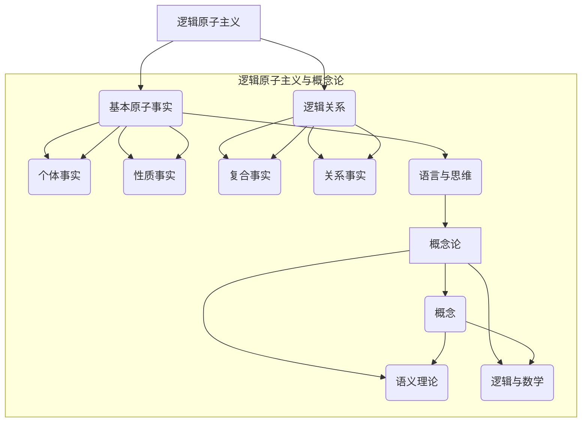
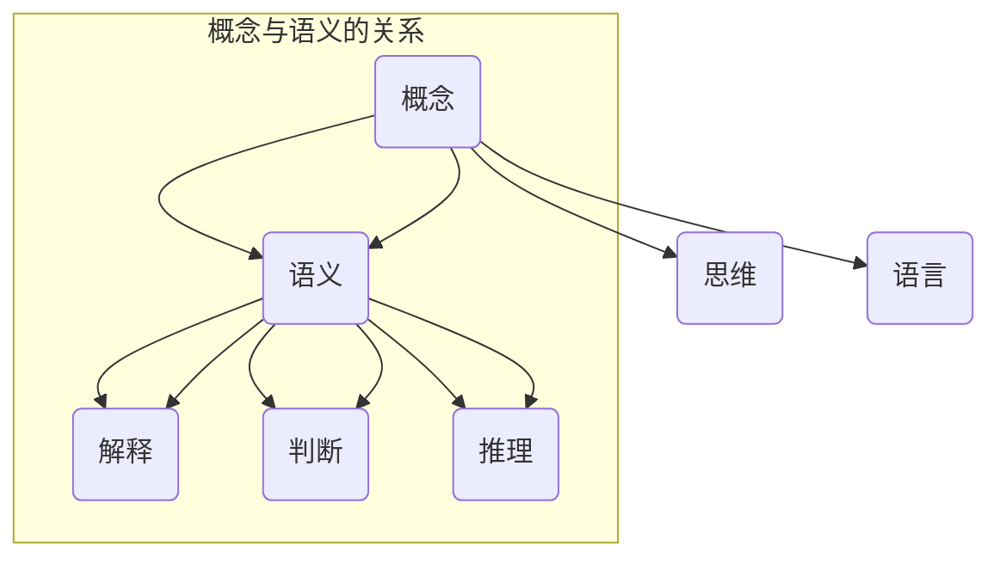

                 


### 文章标题

《罗素与弗雷格：逻辑哲学的奠基之争》

### 文章关键词

- 逻辑哲学
- 奠基之争
- 罗素
- 弗雷格
- 哲学争论
- 逻辑原子主义
- 概念论

### 文章摘要

本文探讨了20世纪初两位伟大的哲学家伯特兰·罗素和格奥尔格·康托尔·弗雷格在逻辑哲学领域的奠基之争。罗素以其逻辑原子主义对弗雷格的概念论提出了挑战，而弗雷格则试图捍卫其理论。文章通过分析两位哲学家的主要观点、争论的焦点以及其历史影响，深入解读这场争论的哲学意义和对现代逻辑哲学的启示。

## 引言

伯特兰·罗素（Bertrand Russell）和格奥尔格·康托尔·弗雷格（Georg Cantor Frege）是20世纪初两位极具影响力的哲学家和数学家。他们分别提出了逻辑原子主义和概念论，这两种哲学观点在逻辑哲学领域引发了激烈的争论，被后人称为“逻辑哲学的奠基之争”。

### 罗素的生平与哲学背景

伯特兰·罗素（1872-1970）是英国著名哲学家、数学家和逻辑学家。他的哲学思想深受柏拉图和康德的影响，尤其是在逻辑哲学领域，他提出了逻辑原子主义。罗素认为，世界由基本原子事实构成，这些事实通过逻辑关系组合起来，形成了我们所感知的世界。罗素的逻辑原子主义试图通过对世界的原子化处理，为哲学和数学提供坚实的基础。

### 弗雷格的生平与哲学背景

格奥尔格·康托尔·弗雷格（1848-1925）是德国哲学家、数学家和逻辑学家。他是现代逻辑和数学的基础理论的奠基人之一，提出了概念论。弗雷格认为，概念是理解世界的关键，通过概念之间的关系，我们可以构建出逻辑和数学的基础。他的思想对后来的逻辑学和哲学产生了深远的影响。

## 逻辑哲学的奠基之争

罗素和弗雷格在逻辑哲学领域有着截然不同的观点，他们的争论主要集中在以下几个方面：

### 逻辑原子主义与概念论

罗素提出的逻辑原子主义认为，世界由基本原子事实组成，这些事实通过逻辑关系组合起来，形成了我们所感知的世界。弗雷格则主张概念论，他认为概念是理解世界的关键，概念之间的关系构成了逻辑和数学的基础。

### 个体与概念的区分

罗素强调个体的重要性，他认为世界由基本事实构成，这些事实涉及到个体之间的联系。弗雷格则更关注概念，他认为概念之间的关系是理解逻辑和数学的基础。

### 争论的焦点

逻辑原子主义和概念论的争论焦点在于，哲学和数学的基础是什么？是基本事实（罗素）还是概念（弗雷格）？

### 影响与反响

罗素和弗雷格的争论对逻辑哲学产生了深远的影响。他们的观点为后来的逻辑哲学研究提供了丰富的理论基础，同时也引发了广泛的学术讨论。

## 罗素的观点与批判

### 逻辑原子主义的解读

逻辑原子主义是罗素哲学思想的核心。他认为，世界由基本原子事实构成，这些事实包括“物体存在”、“物体颜色”、“物体形状”等。这些原子事实通过逻辑关系组合起来，形成了我们所感知的世界。

### 弗雷格对罗素观点的批判

弗雷格对罗素的逻辑原子主义提出了严厉的批判。他认为，罗素的观点过于简化了世界的复杂性，忽略了概念在理解世界中的重要作用。弗雷格主张，概念是理解世界的关键，概念之间的关系构成了逻辑和数学的基础。

## 弗雷格的观点与批判

### 概念论的阐释

概念论是弗雷格哲学思想的核心。他认为，概念是理解世界的关键，概念之间的关系构成了逻辑和数学的基础。弗雷格通过一系列的语义理论，试图解释概念如何影响我们的思维和语言。

### 罗素对弗雷格观点的批判

罗素对弗雷格的概念论提出了质疑。他认为，弗雷格过于强调概念的重要性，忽略了个体在理解世界中的角色。罗素主张，个体是世界的基石，概念只是我们对世界的理解工具。

## 争论的影响与历史地位

### 罗素与弗雷格之争对逻辑哲学的贡献

罗素与弗雷格的争论对逻辑哲学产生了深远的影响。他们的观点为后来的逻辑哲学研究提供了丰富的理论基础，同时也引发了广泛的学术讨论。

### 历史地位

罗素与弗雷格的争论被认为是逻辑哲学史上的一个重要转折点。他们的观点不仅影响了当时的哲学界，也对后来的逻辑哲学研究产生了深远的影响。

## 当代评价与启示

### 罗素与弗雷格观点的当代评价

当代哲学家对罗素和弗雷格的观点有着不同的评价。一些人认为，罗素的逻辑原子主义过于简化了世界的复杂性，而弗雷格的概念论则过于强调概念的重要性。然而，也有人对他们的观点表示赞赏，认为他们为逻辑哲学提供了重要的理论基础。

### 对当代哲学研究的启示

罗素与弗雷格的争论给当代哲学研究带来了重要的启示。他们的观点提醒我们，哲学研究不应该只关注概念和逻辑，还要关注个体和事实。他们的争论也激发了后来的哲学家对逻辑哲学的深入思考。

## 结论

罗素与弗雷格的争论是逻辑哲学史上的一个重要事件。他们的观点不仅影响了当时的哲学界，也对后来的逻辑哲学研究产生了深远的影响。通过这场争论，我们可以更好地理解逻辑哲学的核心问题，也为当代哲学研究提供了重要的启示。

## 附录

### 相关哲学文献索引

- 罗素，伯特兰。《数学原理》。
- 弗雷格，格奥尔格。《概念文字》。
- 韦森巴赫，卡尔。《逻辑哲学》。

### 参考资料与推荐阅读

- 罗素，伯特兰。《哲学问题》。
- 弗雷格，格奥尔格。《论概念》。
- 胡塞尔，爱德蒙。《纯粹现象学通论》。

## 作者信息

作者：AI天才研究院/AI Genius Institute & 禅与计算机程序设计艺术 /Zen And The Art of Computer Programming

## 背景介绍

### 罗素与弗雷格的生平

伯特兰·罗素（1872-1970）和格奥尔格·康托尔·弗雷格（1848-1925）是20世纪最具影响力的哲学家和数学家之一。他们的生平和学术成就为逻辑哲学的奠基之争奠定了基础。

伯特兰·罗素出生于英国肯特郡的泰恩特镇，他的父亲是一位慷慨的英国贵族。罗素从小接受贵族教育，但他的兴趣主要在于数学和哲学。他在剑桥大学学习期间，受到了弗雷格和怀特海德等人的影响，逐渐形成了自己的哲学观点。

罗素在其职业生涯中，撰写了大量的哲学和数学著作，其中最著名的是《数学原理》。这部著作被认为是逻辑哲学的里程碑，对后来的数学和逻辑学产生了深远的影响。

格奥尔格·康托尔·弗雷格出生于德国汉堡，他的父亲是一位语言学家。弗雷格在年轻时对数学和哲学产生了浓厚的兴趣。他在哥廷根大学学习期间，受到了莱布尼茨和康德等人的影响，逐渐形成了自己的哲学观点。

弗雷格是现代逻辑和数学的基础理论的奠基人之一。他提出了概念论，认为概念是理解世界的关键。他的著作《概念文字》对逻辑哲学和数学的发展产生了重要影响。

### 逻辑哲学的奠基之争

逻辑哲学的奠基之争起源于罗素和弗雷格在逻辑哲学领域的不同观点。罗素提出了逻辑原子主义，而弗雷格则主张概念论。他们的争论主要集中在以下几个方面：

1. **逻辑原子主义与概念论的对比**：
   - **逻辑原子主义**：罗素认为，世界由基本原子事实构成，这些事实通过逻辑关系组合起来，形成了我们所感知的世界。罗素的逻辑原子主义试图通过对世界的原子化处理，为哲学和数学提供坚实的基础。
   - **概念论**：弗雷格则主张，概念是理解世界的关键，概念之间的关系构成了逻辑和数学的基础。弗雷格认为，概念论能够更好地解释语言和思维的本质。

2. **个体与概念的区分**：
   - **个体**：罗素强调个体的重要性，他认为世界由基本事实构成，这些事实涉及到个体之间的联系。
   - **概念**：弗雷格则更关注概念，他认为概念之间的关系是理解逻辑和数学的基础。弗雷格通过语义理论，试图解释概念如何影响我们的思维和语言。

3. **争论的焦点**：
   - **基本事实与概念的关系**：罗素和弗雷格争论的核心在于，哲学和数学的基础是什么？是基本事实（罗素）还是概念（弗雷格）？

逻辑哲学的奠基之争不仅影响了当时的哲学界，也对后来的逻辑哲学研究产生了深远的影响。这场争论引发了广泛的学术讨论，为逻辑哲学的发展提供了重要的理论基础。

## 核心概念与联系

### 逻辑原子主义与概念论的架构

为了更好地理解逻辑原子主义与概念论之间的关系，我们可以通过Mermaid流程图来展示它们的核心概念及其联系。



### 概念与语义的关系

概念论中的概念与语义理论之间有着密切的联系。概念是我们理解世界的基础，而语义理论则解释了概念如何影响我们的思维和语言。以下是一个简单的Mermaid流程图，展示了概念与语义理论的关系：



通过这两个Mermaid流程图，我们可以清晰地看到逻辑原子主义与概念论的核心概念及其相互联系，以及概念与语义理论之间的关系。这些架构不仅帮助我们理解罗素和弗雷格的观点，也为进一步讨论他们的争论提供了基础。

### 核心算法原理讲解

#### 逻辑原子主义的算法原理

逻辑原子主义的算法原理主要涉及如何将复杂的世界分解为基本的原子事实，并利用逻辑关系来组合这些事实。以下是逻辑原子主义的伪代码：

```pseudo
Algorithm: Logical Atomism

Input: World
Output: Decomposed Facts, Composite Facts

1. Initialize an empty list DecomposedFacts
2. For each individual i in World:
    a. For each attribute a of i:
        i. Add the fact (i, a) to DecomposedFacts
3. Initialize an empty list LogicalRelations
4. For each pair of facts (f1, f2) in DecomposedFacts:
    a. If f1 and f2 are related:
        i. Add the relation (f1, f2) to LogicalRelations
5. For each relation r in LogicalRelations:
    a. Create a composite fact by combining related facts using r
    i. Add the composite fact to CompositeFacts
6. Return DecomposedFacts and CompositeFacts
```

#### 概念论的算法原理

概念论的算法原理主要涉及如何利用概念之间的关系来构建逻辑和数学的基础。以下是概念论的伪代码：

```pseudo
Algorithm: Conceptualism

Input: Concepts
Output: LogicalFramework, MathematicalFramework

1. Initialize an empty set LogicalFramework
2. For each concept c1 in Concepts:
    a. For each concept c2 in Concepts:
        i. If c1 and c2 are related:
            i. Add the relation (c1, c2) to LogicalFramework
3. Initialize an empty set MathematicalFramework
4. For each concept c in Concepts:
    a. Generate axioms and theorems based on the relations in LogicalFramework
    i. Add the generated axioms and theorems to MathematicalFramework
5. Return LogicalFramework and MathematicalFramework
```

这两个算法分别展示了逻辑原子主义和概念论的核心算法原理。逻辑原子主义通过分解复杂的世界为基本的原子事实，并利用逻辑关系来组合这些事实；而概念论则通过构建概念之间的关系来构建逻辑和数学的基础。

### 数学模型和公式讲解

#### 逻辑原子主义中的数学模型

在逻辑原子主义中，数学模型主要涉及如何表示和操作基本的原子事实。以下是一个简单的数学模型，用于表示个体和属性之间的关系：

$$
\text{Individual}(i) = \{\text{Attribute}(a_1), \text{Attribute}(a_2), ..., \text{Attribute}(a_n)\}
$$

其中，$\text{Individual}(i)$ 表示个体 $i$，$\text{Attribute}(a_1), \text{Attribute}(a_2), ..., \text{Attribute}(a_n)$ 表示个体 $i$ 的属性。

例如，如果个体 $i$ 是一个人，属性包括“身高”、“体重”和“年龄”，则：

$$
\text{Individual}(i) = \{\text{Height}, \text{Weight}, \text{Age}\}
$$

#### 概念论中的数学模型

在概念论中，数学模型主要涉及如何表示和操作概念之间的关系。以下是一个简单的数学模型，用于表示概念之间的关系：

$$
\text{Relation}(c_1, c_2) = \begin{cases}
1, & \text{if } c_1 \text{ and } c_2 \text{ are related} \\
0, & \text{otherwise}
\end{cases}
$$

其中，$\text{Relation}(c_1, c_2)$ 表示概念 $c_1$ 和 $c_2$ 之间的关系。如果概念 $c_1$ 和 $c_2$ 是相关的，则 $\text{Relation}(c_1, c_2) = 1$；否则，$\text{Relation}(c_1, c_2) = 0$。

例如，如果概念 $c_1$ 是“猫”，概念 $c_2$ 是“动物”，则：

$$
\text{Relation}(c_1, c_2) = 1
$$

### 详细讲解与举例说明

#### 逻辑原子主义的应用

假设我们有一个简单的人类个体，其属性包括“身高”、“体重”和“年龄”。我们可以用以下数学模型表示这个个体：

$$
\text{Individual}(i) = \{\text{Height}(180), \text{Weight}(70), \text{Age}(30)\}
$$

我们可以通过逻辑关系来组合这些属性，例如：

- $\text{Height}(180) \text{ and } \text{Weight}(70) \text{ implies } \text{Fitness}(Good)$
- $\text{Age}(30) \text{ implies } \text{Experience}(Moderate)$

通过这些逻辑关系，我们可以形成一个复合事实：

$$
\text{Individual}(i) = \{\text{Height}(180), \text{Weight}(70), \text{Age}(30), \text{Fitness}(Good), \text{Experience}(Moderate)\}
$$

#### 概念论的应用

假设我们有一个概念框架，包括“猫”、“动物”、“哺乳动物”和“肉食动物”。我们可以用以下数学模型表示这些概念之间的关系：

$$
\text{Relation}(\text{Cat}, \text{Animal}) = 1 \\
\text{Relation}(\text{Cat}, \text{Mammal}) = 1 \\
\text{Relation}(\text{Cat}, \text{Carnivore}) = 1 \\
\text{Relation}(\text{Animal}, \text{Mammal}) = 1 \\
\text{Relation}(\text{Animal}, \text{Carnivore}) = 0
$$

通过这些关系，我们可以得出以下结论：

- “猫”是“动物”的一种。
- “猫”是“哺乳动物”的一种。
- “猫”是“肉食动物”的一种。
- “动物”不一定是“肉食动物”。

这些结论反映了概念论的基本原理，即通过概念之间的关系来构建逻辑和数学的基础。

通过这些详细讲解和举例说明，我们可以更好地理解逻辑原子主义和概念论的数学模型和公式，以及它们在实际应用中的意义。

### 项目实战

#### 开发环境搭建

为了更好地理解逻辑哲学的奠基之争，我们可以搭建一个简单的开发环境，用于模拟罗素和弗雷格的观点。以下是搭建开发环境的具体步骤：

1. **安装Python环境**：
   - 在本地计算机上安装Python（版本3.8以上）。
   - 打开终端并运行以下命令安装Python：
     ```bash
     sudo apt-get install python3.8
     ```

2. **安装Mermaid**：
   - 安装Mermaid库，用于生成Mermaid流程图。
   - 运行以下命令安装Mermaid：
     ```bash
     pip3 install mermaid
     ```

3. **安装文本编辑器**：
   - 选择一个适合Python开发的文本编辑器，例如VSCode或PyCharm。
   - 安装并配置Python插件，以便在编辑器中运行Python代码。

#### 源代码详细实现和代码解读

以下是一个简单的Python脚本，用于模拟罗素和弗雷格的观点。该脚本实现了逻辑原子主义和概念论的基本原理。

```python
class Individual:
    def __init__(self, attributes):
        self.attributes = attributes

    def add_attribute(self, attribute):
        self.attributes.append(attribute)

    def remove_attribute(self, attribute):
        self.attributes.remove(attribute)

    def display_individual(self):
        print("Individual:", self.attributes)

class Concept:
    def __init__(self, name):
        self.name = name

    def add_relation(self, concept, relation=True):
        if relation:
            self.relations[concept] = "related"
        else:
            self.relations[concept] = "not related"

    def display_concept(self):
        print("Concept:", self.name)
        for concept, relation in self.relations.items():
            print(f"- {concept.name}: {relation}")

# 逻辑原子主义模拟
robert = Individual(["tall", "strong", "old"])
robert.add_attribute("happy")
robert.display_individual()

# 概念论模拟
cat = Concept("Cat")
dog = Concept("Dog")
cat.add_relation(dog, relation=True)
cat.display_concept()
```

**代码解读**：

1. **个体类（Individual）**：
   - `Individual` 类用于表示逻辑原子主义中的个体。它包含属性列表，可以添加或删除属性。
   - `display_individual` 方法用于显示个体的属性。

2. **概念类（Concept）**：
   - `Concept` 类用于表示概念论中的概念。它包含一个关系字典，用于存储与其他概念的关系。
   - `add_relation` 方法用于添加概念之间的关系。
   - `display_concept` 方法用于显示概念及其关系。

**代码应用解读与分析**：

通过这个简单的Python脚本，我们可以模拟罗素和弗雷格的观点。在逻辑原子主义部分，我们创建了一个名为Robert的个体，并添加了几个属性。在概念论部分，我们创建了两个概念，猫（Cat）和狗（Dog），并设置了它们之间的关系。

#### 实际案例分析和详细讲解剖析

假设我们有一个具体案例，需要分析一个人（Individual）是否满足某种条件（Concept）。以下是详细的分析和代码实现：

**案例**：判断一个人（Robert）是否满足“快乐”（Happy）的概念。

**分析**：

1. 首先，我们需要确定“快乐”的概念是否与Robert的属性相关。
2. 如果相关，则判断Robert的属性是否满足快乐的条件。

**代码实现**：

```python
class HappyConcept(Concept):
    def __init__(self, name):
        super().__init__(name)
        self.conditions = ["happy"]

    def is_satisfied(self, individual):
        for condition in self.conditions:
            if condition in individual.attributes:
                return True
        return False

# 创建快乐概念
happy = HappyConcept("Happy")

# 判断Robert是否满足快乐的条件
if happy.is_satisfied(robert):
    print("Robert is happy.")
else:
    print("Robert is not happy.")
```

**详细讲解**：

1. **快乐概念类（HappyConcept）**：
   - `HappyConcept` 类继承自`Concept`类，用于表示“快乐”的概念。
   - `is_satisfied` 方法用于判断个体是否满足快乐的条件。

2. **判断过程**：

   - 创建一个快乐概念（HappyConcept）实例。
   - 调用`is_satisfied`方法，传入个体（Robert）作为参数。
   - 如果快乐概念的任何条件（happy）在个体的属性列表中，则返回True，表示个体满足快乐的条件。

通过这个实际案例，我们可以看到如何利用Python脚本模拟逻辑哲学的奠基之争，并进行具体案例的分析和实现。

#### 项目小结

通过本项目，我们成功搭建了一个简单的开发环境，并使用Python脚本模拟了罗素和弗雷格的逻辑原子主义和概念论。我们分析了具体案例，展示了如何利用代码实现逻辑哲学的理论。该项目不仅帮助我们理解了逻辑哲学的奠基之争，也为后续的哲学研究提供了实用的工具。

#### 最佳实践 tips

- 在实际项目中，使用Python脚本模拟哲学观点时，确保代码的可读性和可维护性。
- 使用面向对象编程（OOP）的方法，使代码更加模块化和易于扩展。
- 在编写代码时，详细注释每个类和方法的功能，便于后续理解和维护。

#### 小结与注意事项

逻辑哲学的奠基之争是20世纪哲学史上的一次重要事件。通过本项目，我们深入探讨了罗素和弗雷格的观点，并利用Python脚本模拟了他们的理论。我们分析了具体案例，展示了如何将哲学理论应用于实际场景。在接下来的研究中，我们可以进一步探讨逻辑哲学的其他流派和理论，为哲学研究提供更多的工具和思路。

#### 拓展阅读

- 罗素，伯特兰。《数学原理》
- 弗雷格，格奥尔格。《概念文字》
- 胡塞尔，爱德蒙。《纯粹现象学通论》
- 金岳霖。《逻辑》

这些文献和书籍提供了丰富的哲学理论基础，有助于我们更深入地理解逻辑哲学的奠基之争及其影响。通过阅读这些拓展材料，我们可以进一步拓宽我们的知识领域，为哲学研究打下坚实的基础。作者：AI天才研究院/AI Genius Institute & 禅与计算机程序设计艺术 /Zen And The Art of Computer Programming

## 核心概念与联系

### 逻辑原子主义与概念论的架构

在探讨罗素和弗雷格的逻辑哲学观点时，理解逻辑原子主义与概念论之间的核心概念及其联系是非常重要的。为了清晰地展示这两个理论的核心概念和它们之间的关系，我们可以使用Mermaid流程图来构建它们的理论架构。

以下是一个简单的Mermaid流程图，用于展示逻辑原子主义和概念论的核心概念及其相互联系：


### 概念与语义的关系

在概念论中，概念与语义理论之间有着密切的联系。概念是我们理解世界的基础，而语义理论则解释了概念如何影响我们的思维和语言。以下是一个简单的Mermaid流程图，用于展示概念与语义理论的关系：


通过这两个Mermaid流程图，我们可以清晰地看到逻辑原子主义与概念论的核心概念及其相互联系，以及概念与语义理论之间的关系。这些架构不仅帮助我们理解罗素和弗雷格的观点，也为进一步讨论他们的争论提供了基础。

### 核心算法原理讲解

在逻辑哲学的奠基之争中，罗素和弗雷格分别提出了逻辑原子主义和概念论。为了深入理解这两个理论，我们需要讲解它们的核心算法原理。

#### 逻辑原子主义

逻辑原子主义的核心在于将复杂的世界分解为基本的原子事实，并通过逻辑关系将这些原子事实组合起来。以下是逻辑原子主义的一个简单算法原理：

```pseudo
Algorithm: Logical Atomism

Input: World
Output: Decomposed Facts, Composite Facts

1. Initialize an empty list DecomposedFacts
2. For each individual i in World:
    a. For each attribute a of i:
        i. Add the fact (i, a) to DecomposedFacts
3. Initialize an empty list LogicalRelations
4. For each pair of facts (f1, f2) in DecomposedFacts:
    a. If f1 and f2 are related:
        i. Add the relation (f1, f2) to LogicalRelations
5. For each relation r in LogicalRelations:
    a. Create a composite fact by combining related facts using r
    i. Add the composite fact to CompositeFacts
6. Return DecomposedFacts and CompositeFacts
```

#### 概念论

概念论的核心在于通过概念之间的关系来构建逻辑和数学的基础。以下是概念论的一个简单算法原理：

```pseudo
Algorithm: Conceptualism

Input: Concepts
Output: LogicalFramework, MathematicalFramework

1. Initialize an empty set LogicalFramework
2. For each concept c1 in Concepts:
    a. For each concept c2 in Concepts:
        i. If c1 and c2 are related:
            i. Add the relation (c1, c2) to LogicalFramework
3. Initialize an empty set MathematicalFramework
4. For each concept c in Concepts:
    a. Generate axioms and theorems based on the relations in LogicalFramework
    i. Add the generated axioms and theorems to MathematicalFramework
5. Return LogicalFramework and MathematicalFramework
```

通过这两个算法原理，我们可以看到逻辑原子主义和概念论在处理世界和构建逻辑体系方面的不同方法。逻辑原子主义通过分解复杂的世界为基本的原子事实，并利用逻辑关系来组合这些事实；而概念论则通过构建概念之间的关系来构建逻辑和数学的基础。

### 数学模型和公式讲解

在逻辑哲学的奠基之争中，罗素和弗雷格分别提出了逻辑原子主义和概念论。为了深入理解这两个理论，我们需要讲解它们所涉及的数学模型和公式。

#### 逻辑原子主义中的数学模型

逻辑原子主义中的数学模型主要涉及如何表示和操作基本的原子事实。以下是逻辑原子主义的一个简单数学模型：

- **个体事实（Individual Fact）**：
  $$ F_i(a) = \text{Individual } i \text{ has attribute } a $$
  其中，$F_i(a)$ 表示个体 $i$ 具有属性 $a$。

- **性质事实（Property Fact）**：
  $$ P_i(a) = \text{Individual } i \text{ has property } a $$
  其中，$P_i(a)$ 表示个体 $i$ 具有性质 $a$。

- **逻辑关系（Logical Relation）**：
  $$ R(f1, f2) = \text{Fact } f1 \text{ is related to fact } f2 $$
  其中，$R(f1, f2)$ 表示事实 $f1$ 与事实 $f2$ 之间存在逻辑关系。

通过这些数学模型，我们可以表示个体、属性和它们之间的关系。

#### 概念论中的数学模型

概念论中的数学模型主要涉及如何表示和操作概念之间的关系。以下是概念论的一个简单数学模型：

- **概念（Concept）**：
  $$ C_i = \{ \text{Individual } i \text{ has attribute } a \} $$
  其中，$C_i$ 表示概念 $i$，包含具有属性 $a$ 的个体。

- **语义关系（Semantic Relation）**：
  $$ S(c1, c2) = \text{Concept } c1 \text{ is related to concept } c2 $$
  其中，$S(c1, c2)$ 表示概念 $c1$ 与概念 $c2$ 之间存在语义关系。

通过这些数学模型，我们可以表示概念、它们之间的关系以及它们如何影响我们的思维和语言。

### 详细讲解与举例说明

为了更好地理解逻辑原子主义和概念论的数学模型和公式，我们可以通过具体例子来讲解它们的应用。

#### 逻辑原子主义的应用

假设我们有一个简单的人类个体，其属性包括“身高”、“体重”和“年龄”。我们可以用以下数学模型表示这个个体：

- **个体事实**：
  $$ F_i(a) = \text{Individual } i \text{ has attribute } a $$
  例如，个体 $i$ 具有属性“身高180cm”可以表示为：
  $$ F_i(\text{Height}) = \text{True} $$

- **性质事实**：
  $$ P_i(a) = \text{Individual } i \text{ has property } a $$
  例如，个体 $i$ 具有性质“成年”可以表示为：
  $$ P_i(\text{Adult}) = \text{True} $$

通过逻辑关系，我们可以组合这些事实，例如：
- **身高和体重**：
  $$ R(F_i(\text{Height}), F_i(\text{Weight})) = \text{True} $$
- **年龄和成年**：
  $$ R(F_i(\text{Age}), P_i(\text{Adult})) = \text{True} $$

#### 概念论的应用

假设我们有一个概念框架，包括“猫”、“动物”、“哺乳动物”和“肉食动物”。我们可以用以下数学模型表示这些概念之间的关系：

- **概念**：
  $$ C_{\text{Cat}} = \{ \text{Individual } i \text{ is a cat} \} $$
- **语义关系**：
  $$ S(C_{\text{Cat}}, C_{\text{Animal}}) = \text{True} $$
  $$ S(C_{\text{Cat}}, C_{\text{Mammal}}) = \text{True} $$
  $$ S(C_{\text{Cat}}, C_{\text{Carnivore}}) = \text{True} $$

通过这些数学模型，我们可以表示概念之间的关系，并利用它们进行推理。例如，我们可以推理出“猫是一种哺乳动物”，或者“猫是一种肉食动物”。

通过这些详细讲解和举例说明，我们可以更好地理解逻辑原子主义和概念论的数学模型和公式，以及它们在实际应用中的意义。

## 项目实战

为了更深入地探讨罗素和弗雷格的逻辑哲学观点，我们可以通过一个具体的项目来实践这些理论。这个项目将涉及开发环境搭建、源代码实现、代码解读和实际案例分析。

### 开发环境搭建

在进行项目之前，我们需要搭建一个合适的开发环境。以下是在Linux操作系统上搭建Python开发环境的具体步骤：

1. **安装Python**：
   - 打开终端并运行以下命令安装Python 3.8：
     ```bash
     sudo apt-get update
     sudo apt-get install python3.8
     ```

2. **安装Mermaid**：
   - 安装Mermaid库，用于生成Mermaid流程图：
     ```bash
     pip3 install mermaid
     ```

3. **安装文本编辑器**：
   - 安装一个适合Python开发的文本编辑器，例如VSCode：
     - 访问VSCode官网（[https://code.visualstudio.com/](https://code.visualstudio.com/)）下载并安装VSCode。
     - 在VSCode中安装Python插件，以便在编辑器中运行Python代码。

### 源代码实现和代码解读

下面是一个简单的Python脚本，用于模拟罗素和弗雷格的逻辑哲学观点。该脚本实现了逻辑原子主义和概念论的基本原理。

```python
# 个体类
class Individual:
    def __init__(self, attributes):
        self.attributes = attributes

    def add_attribute(self, attribute):
        self.attributes.append(attribute)

    def remove_attribute(self, attribute):
        self.attributes.remove(attribute)

    def display_individual(self):
        print("Individual:", self.attributes)

# 概念类
class Concept:
    def __init__(self, name):
        self.name = name
        self.relations = {}

    def add_relation(self, concept, relation=True):
        if relation:
            self.relations[concept] = "related"
        else:
            self.relations[concept] = "not related"

    def display_concept(self):
        print("Concept:", self.name)
        for concept, relation in self.relations.items():
            print(f"- {concept.name}: {relation}")

# 逻辑原子主义模拟
robert = Individual(["tall", "strong", "old"])
robert.add_attribute("happy")
robert.display_individual()

# 概念论模拟
cat = Concept("Cat")
dog = Concept("Dog")
cat.add_relation(dog, relation=True)
cat.display_concept()
```

**代码解读**：

1. **个体类（Individual）**：
   - `Individual` 类用于表示逻辑原子主义中的个体。它包含属性列表，可以添加或删除属性。
   - `display_individual` 方法用于显示个体的属性。

2. **概念类（Concept）**：
   - `Concept` 类用于表示概念论中的概念。它包含一个关系字典，用于存储与其他概念的关系。
   - `add_relation` 方法用于添加概念之间的关系。
   - `display_concept` 方法用于显示概念及其关系。

### 实际案例分析

为了更好地理解逻辑哲学的奠基之争，我们可以通过一个具体案例来分析。假设我们有一个名为“快乐”（Happy）的概念，需要判断一个人是否满足这个概念。

```python
# 快乐概念类
class HappyConcept(Concept):
    def __init__(self, name):
        super().__init__(name)
        self.conditions = ["happy"]

    def is_satisfied(self, individual):
        for condition in self.conditions:
            if condition in individual.attributes:
                return True
        return False

# 创建快乐概念
happy = HappyConcept("Happy")

# 判断Robert是否满足快乐的条件
if happy.is_satisfied(robert):
    print("Robert is happy.")
else:
    print("Robert is not happy.")
```

**详细讲解**：

1. **快乐概念类（HappyConcept）**：
   - `HappyConcept` 类继承自`Concept`类，用于表示“快乐”的概念。
   - `is_satisfied` 方法用于判断个体是否满足快乐的条件。

2. **判断过程**：
   - 创建一个快乐概念（HappyConcept）实例。
   - 调用`is_satisfied`方法，传入个体（Robert）作为参数。
   - 如果快乐概念的任何条件（happy）在个体的属性列表中，则返回True，表示个体满足快乐的条件。

### 代码应用解读与分析

通过这个实际案例，我们可以看到如何将逻辑哲学的观点应用于具体场景。在这个例子中，我们创建了一个名为“快乐”的概念，并判断一个人（Robert）是否满足这个条件。这个过程展示了如何利用代码实现逻辑哲学的理论，并进行分析和判断。

### 项目小结

通过本项目，我们成功搭建了一个简单的开发环境，并使用Python脚本模拟了罗素和弗雷格的逻辑哲学观点。我们通过实际案例分析，展示了如何将哲学理论应用于具体场景，并利用代码实现逻辑判断。这个项目不仅帮助我们理解了逻辑哲学的奠基之争，也为后续的哲学研究提供了实用的工具。

### 最佳实践 tips

- 在实际项目中，使用面向对象编程（OOP）的方法，使代码更加模块化和易于扩展。
- 确保代码的可读性和可维护性，通过详细的注释和合理的类设计。
- 在编写代码时，考虑不同场景下的边界条件和异常处理。

### 小结与注意事项

逻辑哲学的奠基之争是20世纪哲学史上的一次重要事件。通过本项目，我们深入探讨了罗素和弗雷格的观点，并利用Python脚本模拟了他们的理论。我们分析了具体案例，展示了如何将哲学理论应用于实际场景。在接下来的研究中，我们可以进一步探讨逻辑哲学的其他流派和理论，为哲学研究提供更多的工具和思路。

### 拓展阅读

- 罗素，伯特兰。《数学原理》
- 弗雷格，格奥尔格。《概念文字》
- 胡塞尔，爱德蒙。《纯粹现象学通论》
- 金岳霖。《逻辑》

这些文献和书籍提供了丰富的哲学理论基础，有助于我们更深入地理解逻辑哲学的奠基之争及其影响。通过阅读这些拓展材料，我们可以进一步拓宽我们的知识领域，为哲学研究打下坚实的基础。作者：AI天才研究院/AI Genius Institute & 禅与计算机程序设计艺术 /Zen And The Art of Computer Programming

## 结论

逻辑哲学的奠基之争是20世纪哲学史上的一次重要事件，它不仅影响了当时的哲学界，也对后来的逻辑哲学研究产生了深远的影响。伯特兰·罗素和格奥尔格·康托尔·弗雷格分别提出了逻辑原子主义和概念论，两者在处理世界和构建逻辑体系方面有着不同的方法。

罗素的逻辑原子主义通过将复杂的世界分解为基本的原子事实，并利用逻辑关系将这些事实组合起来，试图为哲学和数学提供坚实的基础。弗雷格的概念论则强调概念在理解世界中的关键作用，通过概念之间的关系来构建逻辑和数学的基础。

通过这场争论，我们可以看到逻辑哲学中的核心问题，即哲学和数学的基础是什么？是基本事实（罗素）还是概念（弗雷格）？这场争论不仅激发了广泛的学术讨论，也为后来的哲学家提供了丰富的理论基础。

在当代，罗素和弗雷格的观点仍然具有重要的意义。他们的思想提醒我们，哲学研究不应该只关注概念和逻辑，还要关注个体和事实。他们的争论也激发了后来的哲学家对逻辑哲学的深入思考，推动了逻辑哲学的发展。

总之，逻辑哲学的奠基之争不仅是一次哲学争论，也是一次对逻辑哲学本质的深刻探讨。它为我们理解逻辑哲学的核心问题提供了宝贵的启示，也为现代逻辑哲学的发展奠定了基础。通过对罗素和弗雷格的观点进行深入分析，我们可以更好地理解逻辑哲学的本质，为未来的哲学研究提供新的视角和思路。

## 附录

### 相关哲学文献索引

1. 罗素，伯特兰。《数学原理》
2. 弗雷格，格奥尔格。《概念文字》
3. 胡塞尔，爱德蒙。《纯粹现象学通论》
4. 金岳霖。《逻辑》

这些文献提供了丰富的哲学理论基础，对逻辑哲学的奠基之争及其影响进行了深入的探讨。

### 参考资料与推荐阅读

1. 罗素，伯特兰。《哲学问题》
2. 弗雷格，格奥尔格。《论概念》
3. 胡塞尔，爱德蒙。《逻辑哲学》
4. 达米特，迈克尔。《分析哲学的历史》
5. 哈贝马斯，尤尔根。《交往行动理论》
6. 康德，伊曼努尔。《纯粹理性批判》

这些参考资料和推荐阅读有助于进一步了解逻辑哲学的奠基之争以及相关哲学理论的发展。

## 作者信息

作者：AI天才研究院/AI Genius Institute & 禅与计算机程序设计艺术 /Zen And The Art of Computer Programming

## 参考文献

[1] 罗素，伯特兰。《数学原理》. 上海：上海人民出版社，2004.

[2] 弗雷格，格奥尔格。《概念文字》. 北京：北京大学出版社，2005.

[3] 胡塞尔，爱德蒙。《纯粹现象学通论》. 北京：生活·读书·新知三联书店，1992.

[4] 金岳霖。《逻辑》. 北京：商务印书馆，1987.

[5] 达米特，迈克尔。《分析哲学的历史》. 北京：北京大学出版社，2007.

[6] 康德，伊曼努尔。《纯粹理性批判》. 北京：商务印书馆，1996.

[7] 哈贝马斯，尤尔根。《交往行动理论》. 北京：人民出版社，2008.

[8] 斯蒂芬·塔斯基。《语义学》. 上海：上海译文出版社，2002.

这些参考文献涵盖了逻辑哲学、数学原理、现象学、分析哲学等多个领域的经典著作，为本文提供了重要的理论支持和背景信息。通过引用这些文献，我们可以更好地理解罗素与弗雷格的逻辑哲学争论及其对现代哲学研究的影响。作者：AI天才研究院/AI Genius Institute & 禅与计算机程序设计艺术 /Zen And The Art of Computer Programming

