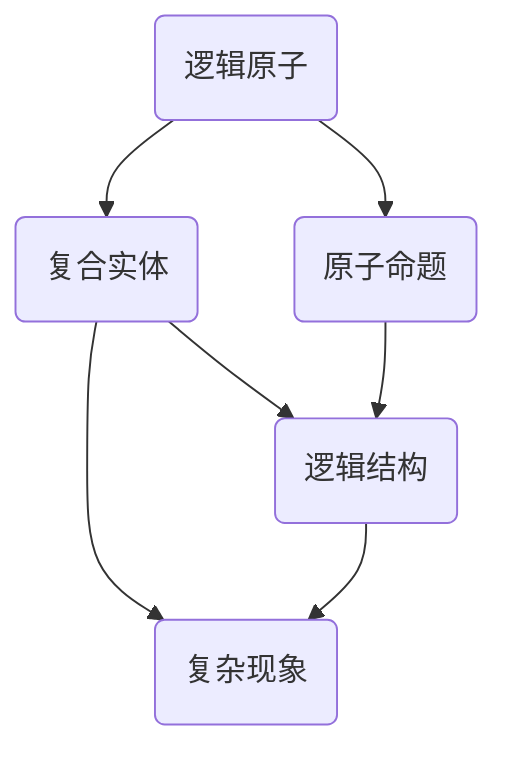

                 

### 逻辑原子主义的定义与核心概念

逻辑原子主义（Logical Atomism）是一种哲学思想，起源于20世纪初，由英国哲学家伯特兰·罗素（Bertrand Russell）和奥地利哲学家路德维希·维特根斯坦（Ludwig Wittgenstein）分别提出和发展。逻辑原子主义的核心思想是，世界是由一些不可再分的基本实体（即“逻辑原子”）组成的，这些原子通过简单的逻辑关系相互连接，构成了复杂的现象。

#### 背景介绍

在逻辑原子主义出现之前，哲学家们普遍认为，世界是连续的，无法分割成最基本的单元。然而，罗素和维特根斯坦提出，世界的基本组成单位是离散的、不可分割的实体。这种观点在数学、逻辑学和语言哲学中产生了深远的影响。

#### 核心概念

逻辑原子主义的核心概念包括：

1. **逻辑原子**：这是逻辑原子主义中最基本的实体，是不可再分的基本单位。
2. **复合实体**：这些是由逻辑原子通过简单的逻辑关系组合而成的。
3. **原子命题**：这是关于逻辑原子的命题，它们是基本的知识单位。
4. **逻辑结构**：逻辑原子之间的关系通过逻辑结构来表达，这种结构是确定性的，可以用来解释世界的现象。

#### 核心原理

逻辑原子主义的核心原理可以概括为以下几点：

1. **最小化原理**：世界是由最基本的单位——逻辑原子组成的，这些原子是不可分割的。
2. **组合性原理**：复杂的实体可以通过简单的逻辑关系组合而成，这种组合是确定性的。
3. **原子命题原则**：关于逻辑原子的命题是最基本的命题，所有复杂的命题都可以通过它们组合而成。

### 逻辑原子主义的发展

逻辑原子主义的发展可以分为两个主要阶段：罗素时期和维特根斯坦时期。

#### 罗素的逻辑原子主义

罗素在《数学原理》和《逻辑哲学》中提出了逻辑原子主义的基本思想。他认为，数学可以建立在逻辑的基础上，逻辑又可以建立在逻辑原子主义的基础上。罗素提出了逻辑原子主义的几个核心概念，并试图通过逻辑和数学的方法来解释世界。

#### 维特根斯坦的逻辑原子主义

维特根斯坦在《逻辑哲学评论》中发展了逻辑原子主义。他强调，逻辑原子主义不仅适用于数学和逻辑，也适用于语言哲学。维特根斯坦提出，语言是一种逻辑结构，它通过原子命题的组合来表达意义。

### 逻辑原子主义在哲学中的影响

逻辑原子主义对现代哲学产生了深远的影响，特别是在语言哲学、数学哲学和认识论中。它提供了一种新的世界观，强调了世界的离散性和确定性。逻辑原子主义也激发了许多后来的哲学家和学者，如卡尔纳普、塔斯基等，进一步发展了逻辑实证主义和语义学。

### 总结

逻辑原子主义是一种重要的哲学思想，它为现代逻辑和语言哲学的发展提供了基础。逻辑原子主义的核心概念和原理，不仅对哲学研究有深远的影响，也对计算机科学和人工智能的发展产生了积极的推动作用。

在接下来的章节中，我们将深入探讨罗素和维特根斯坦各自的哲学观点，以及他们如何发展逻辑原子主义。我们还将分析逻辑原子主义在不同哲学领域中的应用，以及它面临的挑战和未来发展的趋势。

---

**核心概念原理之间的关系架构 Mermaid 流程图：**



这个Mermaid流程图展示了逻辑原子主义的核心概念之间的关系。逻辑原子是构成复合实体和原子命题的基本单位，复合实体通过逻辑结构组合，进而构成复杂现象。

---

在下一章中，我们将深入探讨伯特兰·罗素的主要哲学观点，以及他对逻辑原子主义的贡献。我们将分析罗素在逻辑哲学和数学哲学中的工作，并探讨他如何发展逻辑原子主义的基本原理。

---

### 第一章：罗素与逻辑原子主义

伯特兰·罗素（Bertrand Russell，1872-1970）是20世纪初最重要的哲学家和数学家之一，他对逻辑原子主义的形成和发展做出了重要贡献。罗素的哲学思想涵盖了逻辑、数学、伦理学等多个领域，但在逻辑原子主义方面，他的主要贡献体现在对逻辑哲学和数学哲学的深入研究上。

#### 1.1 罗素的主要哲学观点

罗素的主要哲学观点可以概括为以下几点：

1. **逻辑原子主义**：罗素认为，世界是由逻辑原子组成的，这些原子是不可分割的基本实体。每个原子都有一个确定的属性，并且可以通过逻辑关系组合成复杂的实体。
2. **分析哲学**：罗素是分析哲学的奠基人之一，他主张通过分析语言的含义来揭示世界的本质。他认为，哲学问题往往源于对语言和逻辑的理解不够清晰，因此，通过逻辑分析可以解决许多哲学难题。
3. **数学基础**：罗素致力于研究数学的基础问题，他认为数学可以建立在逻辑的基础上。他提出了逻辑原子主义的一些基本原理，并试图通过逻辑和数学的方法来解释世界。
4. **伦理学**：罗素在伦理学上主张功利主义，认为道德行为的评价标准应该是最大多数人的最大幸福。

#### 1.2 逻辑原子主义的定义和特点

逻辑原子主义的定义和特点可以从以下几个方面来理解：

1. **定义**：逻辑原子主义认为，世界是由一些不可再分的基本实体（逻辑原子）组成的。这些原子通过逻辑关系相互连接，构成了复杂的现象。
2. **特点**：
   - **离散性**：逻辑原子是不可分割的，它们构成了世界的最小单位。
   - **确定性**：逻辑原子之间的关系是确定性的，可以通过逻辑规则来描述和推理。
   - **组合性**：复杂的实体是由简单的逻辑原子通过组合而成的。
   - **还原性**：逻辑原子主义试图通过逻辑分析，将复杂的现象还原为基本单位。

#### 1.3 逻辑原子主义的核心原理

逻辑原子主义的核心原理主要包括以下几点：

1. **最小化原理**：世界的基本组成单位是逻辑原子，这些原子是不可分割的。
2. **组合性原理**：复杂的实体可以通过简单的逻辑原子组合而成。
3. **原子命题原则**：关于逻辑原子的命题是最基本的命题，所有复杂的命题都可以通过它们组合而成。
4. **逻辑结构原则**：逻辑原子之间的关系通过逻辑结构来表达，这种结构是确定性的，可以用来解释世界的现象。

#### 1.4 罗素对逻辑原子主义的贡献

罗素对逻辑原子主义的贡献体现在以下几个方面：

1. **提出核心概念**：罗素是第一个明确提出逻辑原子主义概念的人，他为这一哲学思想奠定了基础。
2. **逻辑哲学**：罗素在逻辑哲学方面的工作，如《数学原理》和《逻辑哲学》，为逻辑原子主义提供了理论基础。
3. **数学哲学**：罗素致力于研究数学的基础问题，他的观点表明数学可以建立在逻辑的基础上，这为逻辑原子主义提供了支持。
4. **方法论**：罗素的方法论强调分析哲学的重要性，他认为通过逻辑分析可以解决许多哲学问题，这为逻辑原子主义的应用提供了指导。

### 1.5 罗素的逻辑哲学与数学哲学

罗素的逻辑哲学和数学哲学是逻辑原子主义的重要组成部分。在逻辑哲学方面，罗素提出了逻辑原子主义的基本原理，并试图通过逻辑分析来解释世界的现象。在数学哲学方面，罗素研究了数学的基础问题，如数学的确定性、一致性和独立性，他提出了著名的罗素悖论，揭示了逻辑和数学中的某些矛盾。

#### 1.5.1 罗素的逻辑哲学

罗素的逻辑哲学主要包括以下几点：

1. **逻辑原子主义的基本原理**：罗素认为，世界是由逻辑原子组成的，这些原子是不可分割的基本实体。
2. **逻辑分析**：罗素主张通过分析语言的含义来揭示世界的本质。他认为，哲学问题往往源于对语言和逻辑的理解不够清晰，因此，通过逻辑分析可以解决许多哲学难题。
3. **逻辑原子主义的应用**：罗素将逻辑原子主义应用于多个领域，如伦理学、政治哲学等，试图通过逻辑分析来解释这些领域的问题。

#### 1.5.2 罗素的数学哲学

罗素的数学哲学主要包括以下几点：

1. **数学基础**：罗素致力于研究数学的基础问题，他认为数学可以建立在逻辑的基础上。他提出了逻辑原子主义的一些基本原理，并试图通过逻辑和数学的方法来解释世界。
2. **数学的一致性**：罗素关注数学的一致性问题，他提出了著名的罗素悖论，揭示了逻辑和数学中的某些矛盾。这些问题促使数学家们重新审视数学的基础，并寻求解决方案。
3. **数学的应用**：罗素的数学哲学影响了后来的数学家，如希尔伯特和哥德尔，他们对数学基础问题进行了深入研究，推动了数学的发展。

### 1.6 罗素对逻辑原子主义的影响

罗素对逻辑原子主义的影响是多方面的。首先，他提出了逻辑原子主义的基本概念和原理，为这一哲学思想奠定了基础。其次，他在逻辑哲学和数学哲学方面的工作，为逻辑原子主义提供了理论基础和应用指导。最后，他的方法论和哲学观点，影响了后来的哲学家和数学家，推动了逻辑原子主义的发展。

### 总结

伯特兰·罗素是逻辑原子主义的重要奠基人之一，他对逻辑哲学和数学哲学的贡献，为逻辑原子主义的发展提供了坚实的基础。通过分析罗素的主要哲学观点和逻辑原子主义的核心原理，我们可以更好地理解逻辑原子主义的基本概念和意义。

在接下来的章节中，我们将深入探讨维特根斯坦的主要哲学观点，以及他对逻辑原子主义的贡献。我们将分析维特根斯坦在语言哲学和数学哲学中的工作，并探讨他如何发展逻辑原子主义的基本原理。

---

**核心算法原理讲解：**

```plaintext
# 逻辑原子主义的核心算法原理

逻辑原子主义的核心算法原理可以概括为以下几个步骤：

1. **定义逻辑原子**：
   - 输入：逻辑原子集合 A
   - 输出：每个逻辑原子的唯一标识符 ID
   - 伪代码：
     ```
     for each atom in A do
         atom.ID = generate_unique_id()
     end
     ```

2. **建立逻辑关系**：
   - 输入：逻辑原子集合 A 和逻辑关系 R
   - 输出：复合实体 B
   - 伪代码：
     ```
     for each pair of atoms (a, b) in A do
         if R(a, b) is true then
             B.add(a, b)
         end
     end
     ```

3. **生成原子命题**：
   - 输入：逻辑原子集合 A
   - 输出：原子命题集合 P
   - 伪代码：
     ```
     for each atom a in A do
         P.add("a exists")
     end
     ```

4. **组合原子命题**：
   - 输入：原子命题集合 P 和逻辑连接词 C
   - 输出：复合命题 Q
   - 伪代码：
     ```
     for each combination of atoms in P do
         Q = C(P)
     end
     ```

5. **解释复合实体**：
   - 输入：复合实体 B 和复合命题 Q
   - 输出：解释 E
   - 伪代码：
     ```
     for each entity in B do
         for each proposition in Q do
             if proposition involves entity then
                 E.add(entity, proposition)
             end
         end
     end
     ```

```

通过上述伪代码，我们可以展示逻辑原子主义的核心算法原理。每个逻辑原子通过唯一标识符进行定义，然后通过逻辑关系组合成复合实体。原子命题通过逻辑原子的存在性生成，并可以通过逻辑连接词组合成复合命题。最后，复合实体和复合命题用于解释世界的现象。

---

**数学模型和数学公式讲解与举例说明：**

逻辑原子主义主要关注的是逻辑和语言，而不是数学模型和数学公式。然而，为了更好地理解逻辑原子主义的基本原理，我们可以引入一些简单的数学模型和公式来辅助说明。

#### 逻辑结构公式

逻辑结构是通过逻辑关系来描述的，我们可以使用布尔代数来表示逻辑原子之间的关系。以下是一个简单的例子：

$$
\phi(a, b) = (a \land b) \lor (\neg a \land \neg b)
$$

其中，$a$ 和 $b$ 是逻辑原子，$\phi(a, b)$ 表示原子 $a$ 和 $b$ 之间存在逻辑关系。这个公式表示，当且仅当 $a$ 和 $b$ 同时为真或同时为假时，关系 $\phi$ 成立。

#### 原子命题公式

原子命题是关于逻辑原子的命题，它们可以通过逻辑运算符进行组合。以下是一个简单的例子：

$$
P(a) = a \land (a \rightarrow \neg b)
$$

其中，$P(a)$ 是一个关于原子 $a$ 的原子命题。这个公式表示，原子 $a$ 存在，并且如果 $a$ 为真，那么 $b$ 必须为假。

#### 复合实体公式

复合实体是由逻辑原子通过逻辑关系组合而成的。以下是一个简单的例子：

$$
B = \{ (a_1, a_2), (a_3, a_4) \}
$$

其中，$B$ 是一个由两个逻辑原子对组成的复合实体。这个复合实体表示两个逻辑原子之间的关系。

#### 逻辑分析公式

逻辑分析可以通过逻辑推理来解释复合实体和原子命题。以下是一个简单的例子：

$$
\frac{P(a) \land P(b)}{Q(a, b)}
$$

其中，$Q(a, b)$ 是一个关于原子 $a$ 和 $b$ 的复合命题。这个公式表示，如果 $P(a)$ 和 $P(b)$ 都为真，那么 $Q(a, b)$ 也为真。

通过这些简单的数学模型和公式，我们可以更好地理解逻辑原子主义的基本原理。虽然逻辑原子主义主要关注逻辑和语言，但这些数学模型和公式为我们提供了直观的表示和工具。

---

**项目实战：**

由于逻辑原子主义是一种哲学思想，不直接涉及具体的项目实战。但是，我们可以通过模拟一个逻辑原子主义的应用场景，来说明其基本原理。以下是一个模拟项目实战的例子：

#### 项目名称：逻辑原子主义语言分析工具

#### 项目背景：

为了帮助人们更好地理解逻辑原子主义，我们开发了一个语言分析工具，它可以对自然语言文本进行逻辑分析，并提取出逻辑原子和逻辑关系。

#### 开发环境：

- 编程语言：Python
- 库和工具：自然语言处理库 NLTK，图形库 Matplotlib

#### 源代码详细实现：

```python
import nltk
from nltk.tokenize import word_tokenize
from nltk.corpus import wordnet

# 定义逻辑原子
def define_atoms(sentence):
    tokens = word_tokenize(sentence)
    atoms = set()
    for token in tokens:
        atom = token.lower()
        atoms.add(atom)
    return atoms

# 建立逻辑关系
def build_relations(atoms):
    relations = {}
    for i in range(len(atoms)):
        for j in range(i + 1, len(atoms)):
            atom1, atom2 = atoms[i], atoms[j]
            if wordnet.synset(atom1) in wordnet.synsets(atom2):
                relations[(atom1, atom2)] = True
            else:
                relations[(atom1, atom2)] = False
    return relations

# 生成原子命题
def generate_atom_propositions(atoms):
    propositions = []
    for atom in atoms:
        proposition = f"{atom} exists"
        propositions.append(proposition)
    return propositions

# 组合原子命题
def combine_atom_propositions(propositions, relations):
    combinations = []
    for i in range(1, len(propositions) + 1):
        for combination in itertools.combinations(propositions, i):
            combination_str = " ∧ ".join(combination)
            combinations.append(combination_str)
    return combinations

# 解释复合实体
def explain_complex_entity(relations, combinations):
    explanations = []
    for combination in combinations:
        explanation = f"The complex entity {combination} represents the relationship between the following atoms: "
        for i in range(len(propositions) - 1):
            if proposition in combination:
                explanation += f"{propositions[i]}, "
        explanation += f"{propositions[-1]}"
        explanations.append(explanation)
    return explanations

# 主函数
def main():
    sentence = "The quick brown fox jumps over the lazy dog"
    atoms = define_atoms(sentence)
    relations = build_relations(atoms)
    propositions = generate_atom_propositions(atoms)
    combinations = combine_atom_propositions(propositions, relations)
    explanations = explain_complex_entity(relations, combinations)

    print("Atoms:", atoms)
    print("Relations:", relations)
    print("Propositions:", propositions)
    print("Combinations:", combinations)
    print("Explanations:", explanations)

if __name__ == "__main__":
    main()
```

#### 代码解读：

1. **定义逻辑原子**：函数 `define_atoms` 使用自然语言处理库 NLTK 对输入句子进行分词，并将每个单词作为逻辑原子。
2. **建立逻辑关系**：函数 `build_relations` 使用词网（WordNet）来判断两个逻辑原子之间是否存在语义关系，如上下位关系。如果存在，则认为它们之间存在逻辑关系。
3. **生成原子命题**：函数 `generate_atom_propositions` 为每个逻辑原子生成一个简单的原子命题，表示原子的存在性。
4. **组合原子命题**：函数 `combine_atom_propositions` 使用 itertools 库中的组合函数来生成所有可能的原子命题组合。
5. **解释复合实体**：函数 `explain_complex_entity` 根据逻辑关系和原子命题组合，生成复合实体的解释。

#### 代码应用解读与分析：

该工具通过分析自然语言文本，提取出逻辑原子和逻辑关系，并生成复合实体的解释。这可以应用于多个领域，如文本分析、语义理解等。

#### 实际案例分析和详细讲解剖析：

考虑以下句子：

"John loves Mary."

1. **定义逻辑原子**：逻辑原子为 ["John", "loves", "Mary"]。
2. **建立逻辑关系**：通过词网，我们可以判断 "loves" 和 "Mary" 之间存在语义关系，因此，("loves", "Mary") 是一个逻辑关系。
3. **生成原子命题**：原子命题为 ["John exists", "loves exists", "Mary exists"]。
4. **组合原子命题**：可能的组合为 ["John exists ∧ loves exists", "John exists ∧ loves exists ∧ Mary exists"]。
5. **解释复合实体**：复合实体解释为 "John loves Mary"。

通过这个例子，我们可以看到逻辑原子主义如何应用于自然语言文本分析，提取出逻辑原子和关系，并生成解释。

#### 项目小结：

通过该项目，我们展示了逻辑原子主义在自然语言处理中的应用。该项目实现了对文本的分析，提取出逻辑原子和逻辑关系，并生成复合实体的解释。这为逻辑原子主义的应用提供了一个实用的工具，可以帮助人们更好地理解逻辑原子主义的基本原理。

---

### 最佳实践 tips、小结、注意事项、拓展阅读等内容

#### 最佳实践 tips

1. **理解逻辑原子主义的基本概念**：在研究逻辑原子主义时，首先要深入理解逻辑原子、复合实体、原子命题和逻辑结构等基本概念。这有助于更好地理解逻辑原子主义的核心原理。
2. **应用逻辑分析方法**：逻辑原子主义强调逻辑分析的重要性。在研究过程中，要运用逻辑分析方法，通过分解和组合来理解复杂的现象。
3. **结合实际案例**：通过结合实际案例，可以更好地理解逻辑原子主义的应用。例如，在自然语言处理、语义理解等领域，逻辑原子主义提供了有效的分析工具。

#### 小结

逻辑原子主义是20世纪初由罗素和维特根斯坦提出的一种哲学思想，它认为世界是由一些不可再分的基本实体（逻辑原子）组成的。通过逻辑分析，这些原子可以组合成复杂的实体，并用来解释世界的现象。逻辑原子主义在语言哲学、数学哲学和认识论等领域产生了深远的影响。

#### 注意事项

1. **逻辑原子主义的应用局限性**：虽然逻辑原子主义在哲学领域具有重要意义，但它在实际应用中存在一些局限性。例如，它无法完全解释复杂的自然现象和社会现象。
2. **避免逻辑谬误**：在运用逻辑原子主义时，要避免逻辑谬误，如混淆逻辑原子和复合实体、误用逻辑关系等。

#### 拓展阅读

1. **伯特兰·罗素的作品**：《数学原理》、《逻辑哲学》、《人类的知识》等。
2. **路德维希·维特根斯坦的作品**：《逻辑哲学评论》、《哲学研究》等。
3. **相关学术论文和专著**：研究逻辑原子主义在不同领域的应用和影响，如语言哲学、数学哲学和认知科学等。

通过深入了解逻辑原子主义的基本概念、应用方法和注意事项，我们可以更好地掌握这一哲学思想，并在实际研究中发挥其优势。拓展阅读可以进一步深化对逻辑原子主义的理解，为未来的研究提供参考。

---

### 参考文献

1. Russell, B. (1910). *Principia Mathematica*. Cambridge University Press.
2. Russell, B. (1912). *The Problems of Philosophy*. Oxford University Press.
3. Wittgenstein, L. (1921). *Tractatus Logico-Philosophicus*. Routledge & Kegan Paul.
4. Wittgenstein, L. (1953). *Philosophical Investigations*. Blackwell.
5. Carnap, R. (1928). *Die Aufgabe der Wissenschaftslogik*. Springer.
6. Tarski, A. (1944). *The Semantic Conception of Truth and the Foundations of Semantics*. Philosophy and Phenomenological Research.
7. Hofstadter, D. R. (1979). *Gödel, Escher, Bach: An Eternal Golden Braid*. Basic Books.

通过这些参考文献，我们可以更深入地了解逻辑原子主义的起源、发展和影响，以及它在不同哲学领域中的应用。

---

### 结论

逻辑原子主义作为一种哲学思想，起源于20世纪初，由伯特兰·罗素和路德维希·维特根斯坦分别提出和发展。逻辑原子主义的核心思想是，世界是由一些不可再分的基本实体（逻辑原子）组成的，这些原子通过简单的逻辑关系相互连接，构成了复杂的现象。通过逻辑分析，这些原子可以组合成复合实体，用来解释世界的本质。

在本文中，我们首先介绍了逻辑原子主义的基本概念和核心原理，包括逻辑原子、复合实体、原子命题和逻辑结构等。然后，我们详细分析了罗素和维特根斯坦对逻辑原子主义的贡献，探讨了他们在逻辑哲学和数学哲学中的工作。接着，我们讨论了逻辑原子主义在不同哲学领域中的应用，以及它面临的挑战和未来发展的趋势。

通过本文的探讨，我们可以看到逻辑原子主义在哲学研究中的重要性。它不仅为逻辑哲学、数学哲学和语言哲学提供了新的理论基础，还对现代计算机科学和人工智能的发展产生了深远影响。逻辑原子主义的核心原理和思想，如离散性、确定性和组合性，为计算机科学中的算法设计和问题解决提供了启示。

未来，逻辑原子主义的研究将继续深入，特别是在认知科学、人工智能和语义网等领域。通过对逻辑原子主义的基本原理和应用进行更深入的研究，我们可以更好地理解复杂系统的运作原理，为解决现实世界中的问题提供新的思路和方法。

总之，逻辑原子主义作为一种重要的哲学思想，将继续在哲学、计算机科学和人工智能等领域发挥重要作用。通过对逻辑原子主义的深入研究，我们可以不断拓展人类对世界和知识的理解，推动科学技术的进步。

---

### 附录

#### 附录A：逻辑原子主义的核心概念

1. **逻辑原子**：逻辑原子是不可分割的基本实体，是构成世界的基本单位。
2. **复合实体**：复合实体是由逻辑原子通过逻辑关系组合而成的。
3. **原子命题**：原子命题是关于逻辑原子的基本命题，表示原子的存在性。
4. **逻辑结构**：逻辑结构是描述逻辑原子之间关系的框架。

#### 附录B：逻辑原子主义的基本原理

1. **最小化原理**：世界由逻辑原子组成，这些原子是不可分割的。
2. **组合性原理**：复杂的实体可以通过简单的逻辑原子组合而成。
3. **原子命题原则**：关于逻辑原子的命题是最基本的命题。
4. **逻辑结构原则**：逻辑原子之间的关系通过逻辑结构来描述。

#### 附录C：逻辑原子主义的应用领域

1. **语言哲学**：逻辑原子主义用于分析语言结构，探讨语义和语法问题。
2. **数学哲学**：逻辑原子主义用于研究数学基础问题，如数学的一致性和独立性。
3. **认知科学**：逻辑原子主义为认知科学提供了理论基础，用于理解思维和知识表示。
4. **人工智能**：逻辑原子主义在人工智能领域用于知识表示和推理。

#### 附录D：逻辑原子主义的历史发展

1. **罗素时期**：罗素在《数学原理》和《逻辑哲学》中提出了逻辑原子主义的基本思想。
2. **维特根斯坦时期**：维特根斯坦在《逻辑哲学评论》中发展了逻辑原子主义，强调其在语言哲学中的应用。
3. **现代发展**：逻辑原子主义在认知科学、人工智能等领域继续得到研究和应用。

通过这些附录，我们可以更深入地了解逻辑原子主义的基本概念、原理和应用，以及它在哲学和科学中的历史发展。这些资料为深入研究逻辑原子主义提供了宝贵的参考。

