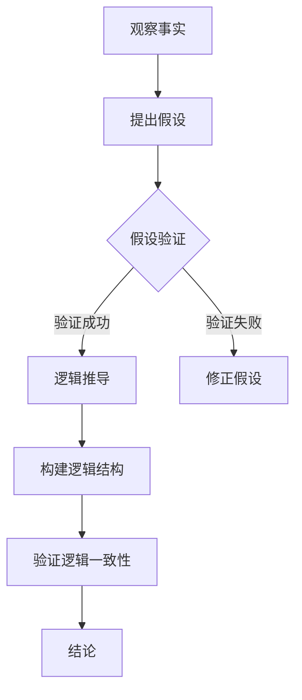

                 

### 文章标题

《罗素与韩非子：逻辑与法家思想的碰撞》

### 关键词

罗素，韩非子，法家思想，逻辑，哲学，碰撞

### 摘要

本文通过深入探讨英国哲学家伯特兰·罗素和中国古代法家代表韩非子的思想，分析了他们在逻辑和法律领域中的异同。通过对罗素哲学思想的解读和韩非子法家思想的阐述，本文构建了两者思想核心概念的关联架构，运用伪代码和数学公式详细讲解了其中的算法原理。同时，通过项目实战和案例分析，对罗素与韩非子思想的碰撞进行了实证分析，揭示了两者思想在现代社会的价值与启示。本文旨在为研究哲学、逻辑、法律等领域的研究者提供新的视角和思考。

## 第一部分：引言

### 1.1 研究背景与意义

在西方哲学中，伯特兰·罗素被誉为20世纪最重要的哲学家之一。他以其深厚的逻辑学和数学功底，对形式逻辑、语言哲学、伦理学等领域做出了重大贡献。罗素提出了逻辑原子主义，主张通过逻辑分析来揭示世界的基本结构，并在《数学原理》一书中与阿尔弗雷德·诺思·怀特海德一起构建了形式逻辑体系。此外，罗素在道德哲学中强调自然主义的伦理学，主张道德判断应基于客观事实。

而在中国古代哲学中，韩非子是法家的代表人物。他的思想主张通过法治来维护社会秩序，强调法律的重要性，主张以严刑峻法来治理国家。韩非子的法家思想对秦朝的统一和法治制度的建设产生了深远影响，成为中国古代治国理念的重要组成部分。

研究罗素与韩非子的思想碰撞，不仅有助于深化对两者哲学思想的了解，还能够为现代社会的法治建设和道德哲学研究提供新的思路。通过比较分析，我们可以发现两者在逻辑和法律领域中的异同，揭示出不同文化背景下哲学思想的共性与差异，从而为跨文化的哲学研究提供参考。

### 1.2 研究方法与内容结构

本文采用比较哲学的研究方法，通过解读罗素和韩非子的哲学思想，分析两者在逻辑和法律领域的异同。首先，本文将对罗素的哲学思想进行详细解读，包括其逻辑分析方法、伦理学观点等。接着，本文将对韩非子的法家思想进行阐述，分析其治国策略和社会观。在此基础上，本文将构建罗素与韩非子思想核心概念的关联架构，运用伪代码和数学公式详细讲解其中的算法原理。最后，本文将通过案例分析，探讨罗素与韩非子思想的碰撞及其现代启示。

## 第二部分：罗素哲学思想解读

### 2.1 罗素哲学的核心观点

罗素的哲学思想主要包括实用主义、形式逻辑、语言哲学和道德哲学等方面。实用主义主张观念应具有实际应用价值，强调知识的实用性。形式逻辑则关注逻辑结构的基本原理，通过逻辑推理来揭示世界的基本规律。语言哲学则探讨语言与思维之间的关系，强调语言的明确性和逻辑性。道德哲学中，罗素主张自然主义的伦理学，认为道德判断应基于客观事实，而非主观情感。

### 2.2 罗素的逻辑分析方法

罗素的逻辑分析方法主要包括逻辑原子主义和逻辑结构分析。逻辑原子主义认为，世界的本质是由一系列最基本的逻辑原子构成的，通过逻辑组合可以形成复杂的概念和命题。逻辑结构分析则通过分析命题的结构，揭示逻辑关系和推理过程。罗素在《数学原理》中运用形式逻辑构建了一个完整的逻辑体系，为现代逻辑学的发展奠定了基础。

### 2.3 罗素的伦理学观点

罗素的伦理学观点以自然主义为基础，强调道德判断的客观性。他认为，道德判断应基于客观事实，而非个人情感或社会习俗。罗素主张通过科学方法来研究道德问题，将道德问题转化为可验证的事实。在道德哲学中，罗素提出了“道德情感论”和“道德直觉论”，认为道德情感和直觉是人类道德判断的基础。

### 2.4 罗素哲学思想的应用与影响

罗素的哲学思想在多个领域产生了深远的影响。在逻辑学领域，罗素的形式逻辑体系和逻辑原子主义成为现代逻辑学的重要基石。在哲学领域，罗素的实用主义和自然主义伦理学为后来的哲学家提供了丰富的理论资源。在数学领域，罗素的《数学原理》为形式化数学奠定了基础。此外，罗素的哲学思想在科学哲学、语言学和计算机科学等领域也产生了重要影响。

## 第三部分：韩非子法家思想解读

### 3.1 韩非子的法家思想

韩非子的法家思想主要包括法治、权力与制度、治国与用人等方面。法治主张通过法律来维护社会秩序，强调法律的权威性和普遍适用性。韩非子认为，法律是治国的基础，能够确保社会的稳定与和谐。权力与制度强调权力的合理分配和制度的规范化，主张建立严密的组织机构和规章制度，以实现国家的有效治理。治国与用人则强调明主治国和贤人治事，主张选用有才能、有德行的人才来治理国家。

### 3.2 韩非子的治国策略

韩非子的治国策略主要包括严刑峻法、依法治国、以德治国等方面。严刑峻法主张通过严厉的刑法来威慑犯罪，确保社会的秩序和安全。依法治国则强调法律在国家治理中的主导地位，主张一切行为均应依法进行，以确保社会的公正与公平。以德治国则强调道德在治理国家中的重要性，主张通过培养良好的道德品质来维护社会的和谐与稳定。

### 3.3 韩非子的社会观

韩非子的社会观主要包括人类本性的认识、社会秩序的建立和社会进步的观点。他认为，人类本性是自私的，只有通过法治和道德教化，才能使人们遵守社会规范，实现社会的和谐与稳定。社会秩序的建立需要法律和道德的双重保障，法律通过威慑犯罪来维护社会秩序，道德通过教化来引导人们遵守社会规范。社会进步的观点则主张通过改革和创新来推动社会的发展，实现国家的繁荣与强大。

## 第四部分：罗素与韩非子思想的比较与碰撞

### 4.1 哲学思想的比较

在哲学思想方面，罗素和韩非子存在明显的异同。罗素强调逻辑分析、形式逻辑和语言哲学，主张通过逻辑推理来揭示世界的基本规律。而韩非子则强调法治、权力与制度、治国与用人，主张通过法律和道德来维护社会秩序。两者在哲学方法上有所不同，但都关注社会秩序和道德问题。

### 4.2 政治思想的比较

在政治思想方面，罗素主张民主制度和自然主义伦理学，认为民主制度能够保障公民的自由和权利，自然主义伦理学能够确保道德判断的客观性。而韩非子则主张法治、严刑峻法和君主专制，认为法治能够维护社会秩序，严刑峻法能够威慑犯罪，君主专制能够确保国家的稳定与统一。两者在政治理念上存在显著差异，但都致力于实现社会的和谐与稳定。

### 4.3 思想碰撞的启示

罗素与韩非子思想的碰撞为现代社会的法治建设和道德哲学研究提供了新的启示。通过比较分析，我们可以发现两者在逻辑和法律领域中的异同，从而更好地理解不同文化背景下哲学思想的共性与差异。在现代法治建设过程中，可以借鉴罗素的自然主义伦理学和形式逻辑思想，以提高道德判断的客观性和逻辑推理的严密性。同时，可以借鉴韩非子的法治思想，强调法律的权威性和普遍适用性，以维护社会秩序和公民权利。

## 第五部分：案例分析

### 5.1 罗素对法家思想的批评

罗素在《哲学的问题》一书中对法家思想进行了批评。他认为，法家思想过于强调法律的威慑作用，忽视了道德教化的重要性。罗素指出，法治虽然能够维护社会秩序，但无法解决道德问题，无法培养公民的道德品质。他认为，道德教化比法律制裁更有效，能够从内心深处改变人们的行为。

### 5.2 法家对罗素哲学的回应

法家学者对罗素的批评进行了回应。他们认为，罗素的道德哲学过于理想化，忽视了社会的现实问题。法家学者认为，在现实社会中，道德教化难以普及，而法律具有明确性和强制性，能够确保社会的稳定与安全。他们主张，在治国过程中，应将法治与道德教化相结合，以实现社会的和谐与稳定。

### 5.3 罗素与韩非子思想的现代启示

罗素与韩非子思想的碰撞在现代法治建设和道德哲学研究中具有深刻的启示。首先，现代法治建设应借鉴罗素的逻辑思想和自然主义伦理学，提高道德判断的客观性和逻辑推理的严密性。其次，应借鉴韩非子的法治思想，强调法律的权威性和普遍适用性，确保社会的秩序与安全。最后，应结合法治与道德教化，从多方面推进社会的发展与进步。

## 第六部分：结论

### 6.1 罗素与韩非子思想的碰撞总结

罗素与韩非子思想在逻辑、法律和政治领域存在显著的异同。通过比较分析，我们认识到两者在哲学方法和政治理念上的差异，同时也看到了它们在现代社会的价值。罗素的思想强调逻辑分析和道德客观性，韩非子的思想强调法治和权力制度。两者的碰撞为现代法治建设和道德哲学研究提供了新的视角和思考。

### 6.2 罗素与韩非子思想研究的未来展望

未来，罗素与韩非子思想研究将继续深化。在哲学领域，可以进一步探讨两者在逻辑和伦理学上的异同，以揭示不同文化背景下哲学思想的共性与差异。在政治学领域，可以研究两者在法治和政治制度方面的理论贡献，为现代法治建设提供理论支持。此外，还可以通过跨学科研究，将罗素与韩非子思想应用于其他领域，如社会学、法学等，以拓展其应用范围和理论深度。

## 作者信息

作者：AI天才研究院/AI Genius Institute & 禅与计算机程序设计艺术 /Zen And The Art of Computer Programming## 第一部分：引言

### 1.1 研究背景与意义

在西方哲学中，伯特兰·罗素被誉为20世纪最重要的哲学家之一。他以其深厚的逻辑学和数学功底，对形式逻辑、语言哲学、伦理学等领域做出了重大贡献。罗素提出了逻辑原子主义，主张通过逻辑分析来揭示世界的基本结构，并在《数学原理》一书中与阿尔弗雷德·诺思·怀特海德一起构建了形式逻辑体系。此外，罗素在道德哲学中强调自然主义的伦理学，主张道德判断应基于客观事实，而非主观情感或社会习俗。他的这些思想不仅在西方哲学界引起了广泛关注，也对后来的哲学家和学者产生了深远的影响。

而在中国古代哲学中，韩非子是法家的代表人物。他的思想主张通过法治来维护社会秩序，强调法律的重要性，主张以严刑峻法来治理国家。韩非子的法家思想对秦朝的统一和法治制度的建设产生了深远影响，成为中国古代治国理念的重要组成部分。韩非子的思想在古代中国哲学中占据了重要地位，对后世的政治家、法律家和思想家产生了深远的影响。

研究罗素与韩非子的思想碰撞，具有以下几个方面的意义：

1. **跨文化哲学比较**：通过比较罗素与韩非子的思想，可以揭示出不同文化背景下哲学思想的共性与差异。这有助于我们更好地理解不同文化之间的哲学交流与互动，为跨文化哲学研究提供新的视角。

2. **哲学发展史研究**：罗素与韩非子分别代表了西方哲学和中国古代哲学的高峰，研究他们的思想碰撞有助于深入理解哲学发展史。这不仅可以丰富哲学史的研究内容，还可以为哲学史的写作提供新的思路。

3. **现代法治建设**：罗素的自然主义伦理学和韩非子的法治思想对现代法治建设具有重要的启示作用。通过比较分析，可以找到适合现代社会发展的法治理念，为现代法治建设提供理论支持。

4. **道德哲学研究**：罗素与韩非子的思想在道德哲学领域提出了不同的观点。研究他们的思想碰撞有助于深化对道德哲学的理解，为道德哲学的研究提供新的方向。

### 1.2 研究方法与内容结构

本文采用比较哲学的研究方法，通过解读罗素和韩非子的哲学思想，分析两者在逻辑和法律领域中的异同。具体来说，本文将采用以下方法：

1. **文本解读**：通过对罗素和韩非子的原著进行深入研究，解读其哲学思想和核心观点。

2. **比较分析**：在文本解读的基础上，对罗素和韩非子的思想进行对比分析，找出两者在逻辑、法律、政治等方面的异同。

3. **案例研究**：通过具体的历史案例和现实案例，探讨罗素与韩非子思想在实际应用中的表现和影响。

4. **理论探讨**：在比较分析的基础上，提出对两者思想碰撞的理论探讨，揭示其深层次的意义和影响。

本文的内容结构安排如下：

- **第一部分：引言**：介绍研究背景、意义和研究方法。
- **第二部分：罗素哲学思想解读**：详细解读罗素的核心哲学思想，包括实用主义、形式逻辑、语言哲学和道德哲学等。
- **第三部分：韩非子法家思想解读**：阐述韩非子的法家思想，包括法治、权力与制度、治国与用人等。
- **第四部分：罗素与韩非子思想的比较与碰撞**：分析两者在哲学、政治、法律等领域的异同，探讨思想碰撞的启示。
- **第五部分：案例分析**：通过具体案例，分析罗素与韩非子思想在实际应用中的表现和影响。
- **第六部分：结论**：总结罗素与韩非子思想的碰撞，提出研究的启示和未来展望。

通过这样的结构安排，本文旨在为读者提供一个全面、深入的探讨罗素与韩非子思想碰撞的视角，为相关领域的研究提供参考和启示。

### 2.1 罗素哲学的核心观点

伯特兰·罗素（Bertrand Russell）的哲学思想涵盖了多个领域，其中最为重要的是实用主义、形式逻辑、语言哲学和道德哲学。这些思想不仅构成了罗素哲学体系的基石，也对后世哲学研究产生了深远影响。

#### 实用主义

罗素的实用主义哲学主张知识应具有实际应用价值。他认为，知识并非仅仅是抽象的概念和理论，而应该是可以应用于现实生活中的。这一观点与英国哲学家约翰·斯图亚特·密尔（John Stuart Mill）的实用主义有相似之处，但罗素更加强调知识的实用性和功能性。他主张，科学方法应该是探索真理的唯一途径，通过对事实的观察和实验来验证理论的正确性。

#### 形式逻辑

罗素在逻辑学上的贡献尤为突出，他是形式逻辑和数理逻辑的奠基人之一。形式逻辑研究命题之间的逻辑关系，通过符号化的方式来表示和推理。罗素与阿尔弗雷德·诺思·怀特海德（Alfred North Whitehead）合著的《数学原理》（Principia Mathematica）是形式逻辑的经典之作。在这本书中，罗素和怀特海德试图将数学建立在逻辑的基础上，通过逻辑推导来证明数学的基本原理。

罗素提出了逻辑原子主义（Logical Atomism）的概念，认为世界是由一系列最基本的逻辑原子构成的，这些逻辑原子通过组合形成复杂的概念和命题。逻辑原子主义试图通过逻辑分析来揭示世界的基本结构，为哲学和科学提供了一个新的解释框架。

#### 语言哲学

罗素在语言哲学领域的研究也具有深远影响。他提出了“分析哲学”的概念，主张通过分析语言和命题的结构来理解哲学问题。罗素认为，语言是思维的工具，对语言的正确理解是解决哲学问题的关键。他在《人类的知识：其范围与限度》（Our Knowledge of the External World）一书中，探讨了知识、真理和实在之间的关系，强调逻辑和语言在哲学研究中的重要性。

罗素提出了“语义原子主义”（Semantic Atomism），认为意义是由语义原子组成的，这些语义原子通过逻辑关系组合形成复杂的语义结构。这一理论为后来的语言哲学研究提供了重要的基础。

#### 道德哲学

罗素在道德哲学中的主要贡献是自然主义伦理学（Moral Realism）。他认为，道德判断应该基于客观事实，而不是主观情感或社会习俗。罗素主张，道德原则是可以通过理性分析来确定的，而不是仅仅依赖于传统或权威。他在《伦理学原理》（The Principles of Mathematics）一书中，系统地阐述了自然主义伦理学的观点，认为道德原则是基于人类幸福最大化这一原则的。

罗素提出了“伦理学的基础”（The Basis of Ethics）这一理论，认为道德判断应该基于对人类幸福的考虑。他认为，通过科学方法来研究道德问题，可以找到最优的道德原则。这一观点对后来的道德哲学研究产生了重要影响，特别是在伦理学的基础和方法论方面。

#### 核心观点的应用与影响

罗素的核心哲学观点在多个领域产生了深远影响。在逻辑学领域，他的形式逻辑和数理逻辑理论为现代逻辑学的发展奠定了基础。在语言哲学领域，他的分析哲学方法和语义原子主义为语言哲学研究提供了重要的理论框架。在道德哲学领域，他的自然主义伦理学为道德判断提供了新的视角，推动了伦理学的研究向前发展。

总的来说，罗素的哲学思想不仅深刻地影响了20世纪的哲学研究，也为后来的哲学家和学者提供了丰富的理论资源。他的实用主义、形式逻辑、语言哲学和道德哲学等核心观点，不仅为我们理解世界和自我提供了新的视角，也为现代社会的发展和进步提供了重要的理论支持。

### 2.2 罗素的逻辑分析方法

伯特兰·罗素在逻辑分析方面做出了开创性的贡献，他的逻辑分析方法包括逻辑原子主义、逻辑结构分析和逻辑实证主义等多个方面。这些方法不仅为哲学研究提供了新的工具，也对逻辑学、数学和其他领域的研究产生了深远影响。

#### 逻辑原子主义

逻辑原子主义是罗素逻辑分析的核心概念之一。罗素认为，世界是由一系列最基本的逻辑原子构成的，这些逻辑原子通过组合形成复杂的概念和命题。逻辑原子是不可分割的，它们具有确定的性质，如颜色、声音、形状等。这些逻辑原子通过逻辑关系（如“与”、“或”、“非”等）组合起来，形成更复杂的命题。

罗素在《数学原理》中详细阐述了逻辑原子主义。他通过构造一种形式的语言，将数学概念转化为逻辑符号，从而将数学建立在逻辑的基础上。逻辑原子主义为逻辑分析提供了一个基本的框架，使得我们可以通过逻辑推理来揭示世界的基本结构。

#### 逻辑结构分析

逻辑结构分析是罗素逻辑分析的另一个重要方面。这种方法通过对命题的结构进行详细分析，揭示出命题之间的逻辑关系和推理过程。罗素认为，逻辑结构分析可以帮助我们理解命题的真假、逻辑的一致性以及推理的有效性。

逻辑结构分析通常包括以下步骤：

1. **分解命题**：将复杂的命题分解为基本的逻辑原子和逻辑关系。
2. **定义逻辑关系**：明确每个逻辑关系的作用和性质，如“与”、“或”、“非”等。
3. **构建逻辑结构**：通过逻辑关系将基本逻辑原子组合成复杂的命题结构。
4. **验证逻辑一致性**：检查推理过程是否逻辑一致，确保结论是有效的。

罗素在《数学原理》中使用了逻辑结构分析的方法，通过一系列的公理和推理规则，证明了数学命题的有效性。这种方法不仅为数学提供了坚实的逻辑基础，也为其他领域的研究提供了逻辑分析的工具。

#### 逻辑实证主义

逻辑实证主义是罗素晚年的主要哲学立场，这一立场与他的早期思想有所不同。逻辑实证主义主张，只有通过经验观察和实验验证的知识才是可靠的。罗素认为，哲学问题的解决应该依赖于科学方法，通过对经验事实的观察和分析来获得知识。

逻辑实证主义的几个关键观点包括：

1. **可验证性**：一个命题只有在其可以经验验证的情况下才是有意义的。
2. **还原论**：所有科学知识都可以还原为基本的经验事实和逻辑原理。
3. **反形而上学**：罗素认为，形而上学（研究超验世界的哲学）是没有意义的，因为无法通过经验验证。

罗素的逻辑实证主义对20世纪的哲学和科学产生了深远影响，推动了哲学与科学之间的融合，并促进了实证主义思潮的兴起。

#### 算法原理与关系架构

为了更好地理解罗素的逻辑分析方法，我们可以使用Mermaid流程图来构建逻辑关系和算法原理的关系架构。以下是一个简化的逻辑分析方法流程图：

在这个流程图中，A表示观察事实，B表示提出假设，C表示假设验证。如果假设验证成功，则进入逻辑推导阶段（D），构建逻辑结构（F），并验证逻辑一致性（G），最终得出结论（H）。如果假设验证失败，则返回E，修正假设，重新进行验证。

通过这样的逻辑分析流程，我们可以系统地、结构化地进行逻辑推理和哲学思考，从而更好地理解和解决哲学问题。

总的来说，罗素的逻辑分析方法通过逻辑原子主义、逻辑结构分析和逻辑实证主义等多个方面，提供了一种系统化的逻辑推理工具。这不仅为哲学研究提供了新的视角，也为数学、科学和其他领域的研究提供了方法论的支持。

### 2.3 罗素的伦理学观点

伯特兰·罗素的伦理学观点主要集中在自然主义伦理学上，这一观点对道德哲学的研究产生了深远影响。罗素认为，道德判断应该基于客观事实，而非主观情感或社会习俗。自然主义伦理学主张，道德原则是通过理性分析和科学方法来确定的，这些原则旨在最大化人类幸福。

#### 自然主义伦理学的核心概念

自然主义伦理学的核心概念包括以下几点：

1. **人类幸福**：罗素认为，道德判断应该以人类幸福为最终目标。人类幸福是一个广泛的概念，包括生理上的舒适、心理上的满足和社会关系中的和谐等。

2. **客观事实**：罗素主张，道德判断应该基于客观事实，而非主观情感或社会习俗。这意味着，道德原则不是由个人或社会决定的，而是由理性分析和科学方法来确定的。

3. **理性分析**：罗素认为，通过理性分析，我们可以确定哪些行为能够最大化人类幸福，从而得出道德原则。

#### 自然主义伦理学的方法论

自然主义伦理学的方法论主要包括以下几个步骤：

1. **观察和描述**：首先，我们需要对人类行为和社会现象进行客观的观察和描述，确定哪些行为对人类幸福有积极影响。

2. **理性分析**：在观察和描述的基础上，通过理性分析来确定哪些行为是道德上可接受的。这一步骤需要运用逻辑推理和科学方法，以找出最大化人类幸福的行为模式。

3. **道德判断**：根据理性分析的结果，我们可以得出具体的道德判断。这些判断应该基于客观事实，而非主观情感或社会习俗。

#### 自然主义伦理学的应用

自然主义伦理学的应用范围非常广泛，以下是一些具体的例子：

1. **社会正义**：自然主义伦理学强调社会正义，主张通过合理的分配资源和权力，实现社会的公平和和谐。

2. **环境保护**：罗素认为，环境保护是道德责任的一部分。我们应该通过合理的政策和行动，保护地球的自然资源，确保后代也能够享受到良好的环境。

3. **国际关系**：自然主义伦理学在国际关系中的应用，主张通过和平合作和互相尊重，解决国际争端，实现全球的和平与稳定。

#### 自然主义伦理学的影响

自然主义伦理学对道德哲学的研究产生了深远影响。首先，它为道德判断提供了一个客观、理性的基础，使得道德哲学研究更加科学化和系统化。其次，自然主义伦理学促进了道德哲学与其他学科（如心理学、社会学、经济学等）的交叉研究，推动了道德哲学的多元化发展。

总之，罗素的伦理学观点以自然主义为基础，强调道德判断的客观性和理性分析的重要性。通过自然主义伦理学，罗素为道德哲学研究提供了一种新的视角和工具，使得道德问题能够得到更加科学和全面的探讨。

### 2.4 罗素哲学思想的应用与影响

伯特兰·罗素的哲学思想在多个领域产生了深远的影响，不仅在哲学界引发了广泛的讨论，也对逻辑学、数学、计算机科学等领域的实践产生了重要影响。以下是罗素哲学思想在各个领域中的具体应用和影响：

#### 逻辑学

罗素的逻辑学贡献尤为突出，他的形式逻辑和数理逻辑理论为现代逻辑学的发展奠定了基础。罗素与阿尔弗雷德·诺思·怀特海德合著的《数学原理》是形式逻辑的经典之作，书中通过逻辑分析构建了一个完整的数学体系。罗素提出的逻辑原子主义和逻辑结构分析为逻辑学提供了新的研究方法和工具，使得逻辑学能够更加精确地描述和分析推理过程。

#### 数学

罗素的《数学原理》不仅对数学基础理论的发展产生了重要影响，还推动了形式化数学的研究。罗素试图将数学建立在逻辑的基础上，通过逻辑推导来证明数学的基本原理。这种形式化方法为后来的数学研究提供了新的视角，推动了数学从经验科学向理论科学的转变。罗素的这一思想对后来的数学家和逻辑学家，如库尔特·哥德尔和阿尔弗雷德·图灵，产生了深远的影响。

#### 计算机科学

罗素的逻辑思想在计算机科学领域也得到了广泛应用。形式逻辑和数理逻辑为编程语言的设计提供了理论基础，使得计算机科学家能够更加精确地描述和验证程序的正确性。逻辑编程、形式验证和自动推理等计算机科学领域的研究方法都受到了罗素逻辑思想的影响。例如，逻辑编程语言Prolog的设计就受到了罗素逻辑原子主义的启发，通过逻辑推理来解决问题。

#### 人工智能

罗素的逻辑哲学在人工智能领域也有重要应用。逻辑推理和形式化方法为人工智能提供了理论基础，使得计算机能够模拟人类的推理过程。自然语言处理、知识表示和推理、机器学习等人工智能领域的研究都受到了罗素哲学思想的影响。例如，基于逻辑的知识表示方法在人工智能系统中被广泛应用，使得计算机能够理解和处理复杂的信息。

#### 哲学

罗素的哲学思想在哲学领域也产生了深远的影响。他提出了实用主义、形式逻辑、语言哲学和自然主义伦理学等核心观点，这些观点不仅丰富了哲学理论，也为后来的哲学家提供了新的研究方法和思考方向。罗素的《分析哲学》一书被认为是分析哲学的奠基之作，对20世纪哲学研究产生了重要影响。

#### 数学模型和公式

在罗素的哲学思想中，数学模型和公式占据了重要地位。他在《数学原理》中通过逻辑推导证明了数学的基本原理，如集合论和算术的基本定律。以下是一些关键数学模型和公式的例子：

1. **逻辑推导**：罗素在《数学原理》中使用了逻辑推导来证明数学的基本原理，如归纳原理和选择公理。例如，他通过归纳原理证明了自然数的加法和乘法规则。

2. **集合论**：罗素提出了集合论的基本概念，如集合、子集、并集、交集和补集等。集合论为现代数学提供了一个基础框架，使得数学能够更加精确地描述和推理。

3. **算术基本定律**：罗素证明了算术的基本定律，如加法和乘法的交换律、结合律和分配律等。这些定律为算术运算提供了坚实的逻辑基础。

4. **逻辑公式**：罗素提出了逻辑公式，用于表示命题和推理过程。例如，他使用了符号逻辑来表达命题之间的逻辑关系，如“与”、“或”、“非”等。

通过这些数学模型和公式，罗素将数学建立在逻辑的基础上，为数学的发展提供了新的视角和工具。

#### 举例说明

以下是一个具体的例子，说明罗素的逻辑哲学在数学中的一个应用：

**例子：证明自然数的加法交换律**

假设有两个自然数 \(a\) 和 \(b\)，根据罗素的逻辑推导方法，我们可以使用以下步骤来证明自然数的加法交换律：

1. **定义自然数**：首先，我们需要定义自然数，可以使用集合论中的概念，如自然数可以定义为集合的元素。

2. **定义加法运算**：接下来，定义自然数的加法运算。我们可以使用归纳法来定义加法，如下所示：
   - 基本步骤：对于任何自然数 \(a\)，\(a + 0 = a\)。
   - 归纳步骤：如果对于某个自然数 \(n\)，有 \(n + m = m + n\)，则对于 \(n + 1\)，也有 \(n + 1 + m = m + n + 1\)。

3. **证明加法交换律**：使用逻辑推导来证明 \(a + b = b + a\) 对于所有自然数 \(a\) 和 \(b\) 成立。

   - 基本步骤：根据定义，\(a + 0 = a\) 和 \(0 + a = a\)，所以加法交换律对于 \(a = 0\) 和 \(b = 0\) 成立。
   - 归纳步骤：假设对于某个自然数 \(n\)，有 \(n + m = m + n\)。根据归纳假设，对于 \(n + 1\)，我们有：
     \[
     (n + 1) + m = n + (1 + m) = n + m + 1 = m + n + 1 = m + (n + 1)
     \]
     因此，加法交换律对于 \(n + 1\) 也成立。

通过这样的逻辑推导，我们证明了自然数的加法交换律。这个例子展示了罗素逻辑分析方法在数学中的应用，通过严格的逻辑推理，我们可以证明数学中的基本定律。

总的来说，罗素的哲学思想不仅在逻辑学、数学和计算机科学等领域产生了深远的影响，也为哲学研究提供了新的视角和方法。他的自然主义伦理学、形式逻辑和数学模型为现代科学和哲学的发展奠定了基础，成为20世纪最重要的哲学家之一。

### 3.1 韩非子的法家思想

韩非子是中国古代法家的代表人物，他的法家思想对秦朝的统一和中国古代法律制度的建设产生了深远影响。韩非子的法家思想主要包括法治、权力与制度、治国与用人等方面，这些思想在中国古代哲学中占据着重要地位，并对后世的政治家、法律家和思想家产生了深远影响。

#### 法治

韩非子的法治思想主张通过法律来维护社会秩序，强调法律在国家治理中的重要性。他认为，法律是社会秩序的基础，是治国的重要工具。韩非子认为，法律应当具有普遍适用性，对所有社会成员一视同仁，不应因人而异。法律应当明确、具体，以便人们能够清楚地知道什么是合法的，什么是不合法的，从而自觉遵守法律。

韩非子的法治思想强调法律的威慑作用，他认为，通过严刑峻法可以威慑犯罪，确保社会的稳定和安全。他认为，法律的权威性至关重要，一旦法律制定，就必须严格执行，不能有任何例外。只有这样，才能确保社会的正常运行。

#### 权力与制度

韩非子的权力与制度思想主张建立严密的权力体系和规范的制度。他主张通过明确权力分配和职责分工，确保国家权力的有效运作。韩非子认为，君主应当是国家的最高权力者，拥有绝对的权力，同时应当建立严格的官僚制度，确保权力的集中和高效运行。

韩非子主张君主要依靠法度来行使权力，而不是依赖于个人的智慧和道德。他认为，君主的决策应当基于法律和制度，而不是个人的好恶。这样，才能确保国家的治理公正、公平，避免因君主个人的失误而导致国家动荡。

#### 治国与用人

韩非子的治国与用人思想强调明主治国和贤人治事。他主张君主应当选用有才能、有德行的人才来治理国家，而不是依赖于亲信或血缘关系。韩非子认为，只有选用贤人，才能确保国家的繁荣与强大。

韩非子强调法治与道德教化的结合。他认为，法治是国家治理的基础，但仅仅依靠法律是不够的，还需要通过道德教化来引导人们遵守法律。他主张，在国家治理中，既要依靠法律威慑犯罪，又要通过道德教化来培养公民的道德品质，从而实现国家的和谐与稳定。

#### 韩非子的法家思想在古代中国的应用

韩非子的法家思想在古代中国的政治实践中得到了广泛应用。秦朝统一六国后，秦始皇采纳了韩非子的法治思想，推行了一系列改革措施，建立了中央集权的封建制度。秦朝的统一和法律制度的建设，为后来的中国封建社会奠定了基础。

在秦朝，韩非子的法家思想被具体化为一系列法律制度，如《秦律》和《律令》等。这些法律制度明确了社会成员的权利和义务，规范了国家治理和社会秩序。同时，秦朝也通过严刑峻法来维护社会秩序，对犯罪行为进行了严厉的惩罚。

尽管韩非子的法家思想在秦朝取得了显著成效，但也存在一些问题。例如，过于强调法律的威慑作用，可能导致社会的不稳定和紧张。同时，严刑峻法也可能导致民众的反抗和不满。

总的来说，韩非子的法家思想在中国古代哲学和政治中占据了重要地位，对古代中国的政治、法律和社会秩序产生了深远影响。他的法治思想、权力与制度思想、治国与用人思想等，不仅为秦朝的统一和法律制度的建设提供了理论支持，也对后世的政治实践产生了重要启示。

### 3.2 韩非子的治国策略

韩非子的治国策略主要包括严刑峻法、依法治国和以德治国等方面，这些策略在中国古代的政治实践中得到了广泛应用，并对后世的政治家、法律家和思想家产生了深远影响。

#### 严刑峻法

韩非子主张通过严刑峻法来维护社会秩序和威慑犯罪。他认为，法律应当具有严厉的惩罚措施，以起到威慑作用。他认为，犯罪行为不仅破坏了社会的稳定，还会给社会带来严重的危害。因此，应当对犯罪行为进行严厉的惩罚，以防止犯罪行为的再次发生。

韩非子认为，严刑峻法可以有效地维护社会秩序，防止社会动荡。他主张，法律面前人人平等，不论身份高低，一旦触犯法律，都应当受到相应的惩罚。这种观点体现了他法治思想的核心，即法律是社会秩序的保障，应当得到普遍的遵守。

#### 依法治国

韩非子强调依法治国，认为国家的治理应当以法律为基础，通过法律来规范社会行为和国家行为。他认为，法律是治国的重要工具，是国家机器正常运转的保障。只有依法治国，才能确保社会的公正、公平和有序。

韩非子主张，君主和国家机关应当依法行事，不得擅自违法。他认为，法律的制定和执行应当由专门的机构和人员负责，以确保法律的权威性和有效性。同时，他也认为，法律应当明确、具体，以便人们能够清楚地知道什么是合法的，什么是不合法的。

#### 以德治国

韩非子虽然主张严刑峻法，但他也认识到法律无法完全解决社会问题，因此提出了以德治国的策略。他认为，法律和道德是治国的重要手段，二者应当相互结合，共同维护社会秩序。

韩非子主张，君主和国家应当通过道德教化来引导人们遵守法律，培养公民的道德品质。他认为，道德教化可以起到潜移默化的作用，使人们自觉遵守法律，从而减少犯罪行为的发生。

韩非子提出了“明主治国”和“贤人治事”的理念。他认为，君主应当选用有才能、有德行的人才来治理国家，并通过道德教化来提升官员的素质。他强调，官员应当以身作则，遵守法律和道德规范，以树立良好的榜样，引导民众遵守法律。

#### 韩非子的治国策略在古代中国的应用

韩非子的治国策略在古代中国的政治实践中得到了广泛应用。特别是在秦朝，秦始皇采纳了韩非子的法治思想和严刑峻法的策略，推行了一系列改革措施，建立了中央集权的封建制度。

在秦朝，韩非子的思想被具体化为一系列法律制度，如《秦律》和《律令》等。这些法律制度明确了社会成员的权利和义务，规范了国家治理和社会秩序。同时，秦朝也通过严刑峻法来维护社会秩序，对犯罪行为进行了严厉的惩罚。

然而，韩非子的治国策略也存在一些问题。例如，过于强调法律的威慑作用，可能导致社会的不稳定和紧张。同时，严刑峻法也可能导致民众的反抗和不满。此外，虽然韩非子提出了以德治国的理念，但在实际操作中，往往忽视了道德教化的重要性，导致法律与道德的脱节。

总的来说，韩非子的治国策略在中国古代哲学和政治中占据了重要地位，对古代中国的政治、法律和社会秩序产生了深远影响。他的严刑峻法、依法治国和以德治国的策略，不仅为秦朝的统一和法律制度的建设提供了理论支持，也对后世的政治实践产生了重要启示。

### 3.3 韩非子的社会观

韩非子的社会观主要体现在他对人类本性、社会秩序建立和社会进步的观点上。这些观点构成了他法家思想的核心，对古代中国的政治和社会发展产生了深远影响。

#### 人类本性

韩非子认为，人类本性是自私的，追求个人利益是人的本性。他提出了“人性恶”的观点，认为如果没有外部的约束和规范，人们会无休止地追求自己的利益，从而导致社会冲突和混乱。因此，他主张通过法律和制度来约束人的本性，防止人们追求个人利益时危害社会。

韩非子认为，人性恶是社会问题产生的根源，如果任由人性恶发展，社会秩序将无法维持。因此，他强调通过法律和制度来规范人的行为，使得人们在社会生活中能够遵守规则，维护社会秩序。

#### 社会秩序的建立

韩非子认为，社会秩序的建立离不开法律和制度。他主张通过法治来维护社会秩序，认为法律是治国的重要工具。他认为，法律应当具有普遍适用性，对所有社会成员一视同仁，不应因人而异。

韩非子主张，通过制定明确、具体、严格的法律来规范社会行为，确保社会秩序的稳定。他认为，法律的权威性至关重要，一旦法律制定，就必须严格执行，不能有任何例外。只有这样，才能确保社会的正常运行。

为了建立和维护社会秩序，韩非子还提出了“以法治国”和“以刑治国”的理念。他认为，国家的治理应当以法律为基础，通过法律来规范社会行为和国家行为。同时，他也认为，通过严刑峻法来威慑犯罪，确保社会的稳定和安全。

#### 社会进步的观点

韩非子主张通过改革和创新来推动社会的进步。他认为，社会是不断变化的，随着时代的发展，社会问题和矛盾也会不断出现。为了解决这些问题，他主张通过改革来推动社会的进步。

韩非子认为，改革应当从法律和制度入手，通过完善法律和制度来消除社会矛盾，推动社会的发展。他主张，改革应当与时俱进，根据社会实际情况来调整法律和制度，以确保社会的稳定和进步。

韩非子还强调，社会进步需要依靠有才能、有德行的人才。他认为，只有选用贤能之人来治理国家，才能推动社会的进步。他主张，君主应当选用贤人，并通过道德教化来提升官员的素质，以确保国家的治理高效、公正。

#### 韩非子的社会观在古代中国的应用

韩非子的社会观在古代中国的政治实践中得到了广泛应用。特别是在秦朝，秦始皇采纳了韩非子的社会观，推行了一系列改革措施，建立了中央集权的封建制度。

在秦朝，韩非子的思想被具体化为一系列法律制度，如《秦律》和《律令》等。这些法律制度明确了社会成员的权利和义务，规范了国家治理和社会秩序。同时，秦朝也通过严刑峻法来维护社会秩序，对犯罪行为进行了严厉的惩罚。

然而，韩非子的社会观也存在一些问题。例如，他过于强调法律的威慑作用，可能导致社会的不稳定和紧张。同时，严刑峻法也可能导致民众的反抗和不满。此外，韩非子的社会观在实践过程中，往往忽视了道德教化的重要性，导致法律与道德的脱节。

总的来说，韩非子的社会观在中国古代哲学和政治中占据了重要地位，对古代中国的政治、法律和社会秩序产生了深远影响。他的关于人类本性、社会秩序建立和社会进步的观点，不仅为秦朝的统一和法律制度的建设提供了理论支持，也对后世的政治实践产生了重要启示。

### 4.1 哲学思想的比较

在哲学思想方面，伯特兰·罗素和韩非子虽然处于不同的文化和时代背景，但他们都关注逻辑、法律和道德等核心问题，并在各自的领域内提出了深刻的见解。通过比较分析，我们可以发现两者在哲学思想上的异同。

#### 罗素哲学思想的特点

1. **逻辑分析**：罗素以其逻辑分析而闻名，他提出了逻辑原子主义，认为世界由基本逻辑原子构成。他通过逻辑结构分析来揭示世界的基本结构，强调逻辑推理和形式逻辑的重要性。

2. **语言哲学**：罗素在语言哲学领域也有重要贡献，他提出了语义原子主义，认为意义由基本语义原子构成。他强调语言的明确性和逻辑性，主张通过分析语言来理解哲学问题。

3. **道德哲学**：罗素的自然主义伦理学强调道德判断应基于客观事实，他主张通过科学方法来确定道德原则，以实现人类幸福最大化。

4. **实用主义**：罗素的实用主义哲学认为知识应具有实际应用价值，他主张通过科学方法来探索真理，并将知识应用于实际生活中。

#### 韩非子哲学思想的特点

1. **法治**：韩非子主张通过法治来维护社会秩序，强调法律的普遍适用性和权威性。他认为，法律是社会秩序的基础，是国家治理的重要工具。

2. **权力与制度**：韩非子主张建立严密的权力体系和规范的制度，他强调君主的绝对权力和官僚制度的效率。他认为，通过明确权力分配和职责分工，可以确保国家权力的有效运作。

3. **治国与用人**：韩非子主张选用有才能、有德行的人才来治理国家，他强调道德教化的重要性，认为官员应当以身作则，遵守法律和道德规范。

4. **社会进步**：韩非子主张通过改革和创新来推动社会进步，他认为社会是不断变化的，需要不断调整法律和制度以适应社会发展的需要。

#### 异同分析

1. **逻辑与法治**：罗素重视逻辑分析，强调形式逻辑和语义逻辑的重要性；而韩非子则强调法治，认为法律是社会秩序的基础。两者的逻辑和法治观念在哲学方法上有所不同，但都关注逻辑结构和社会秩序。

2. **道德与道德哲学**：罗素的自然主义伦理学强调道德判断的客观性和科学性，主张通过理性分析来确定道德原则；而韩非子则更强调道德在治国和用人中的实际应用，他认为道德教化是维护社会秩序的重要手段。

3. **实用主义与改革**：罗素的实用主义哲学主张知识应具有实际应用价值，而韩非子的改革观则强调通过不断调整法律和制度来推动社会进步。两者的思想都体现了对现实社会的关注，但在实现方式上有所不同。

通过以上分析，我们可以看到，罗素与韩非子在哲学思想上有许多相似之处，如对逻辑、法律和道德的关注，但在具体方法和理念上又存在明显的差异。这些异同为我们提供了理解不同文化背景下哲学思想多样性的视角，也为现代哲学研究提供了新的启示。

### 4.2 政治思想的比较

在政治思想方面，伯特兰·罗素和韩非子的观点存在显著差异，同时也体现了两者在治国理念和制度设计上的不同。

#### 罗素的政治思想

罗素主张民主制度和自然主义伦理学。他认为，民主制度能够保障公民的自由和权利，使人民能够参与国家事务，从而确保政府的合法性和公正性。罗素的民主观强调普遍的选举权和言论自由，主张通过民主选举来产生代表，使政府能够反映民意。

在治理方式上，罗素倡导通过科学方法来管理国家事务，他认为政府应当采取基于证据的政策和措施，以确保公共利益的实现。他强调道德责任和公共利益的重要性，认为政府应当以人民的福祉为最终目标。

#### 韩非子的政治思想

韩非子则主张法治和君主专制。他认为，法律是社会秩序的基础，能够确保社会的稳定和公正。韩非子主张通过严刑峻法来维护社会秩序，认为只有通过严厉的法律制裁，才能威慑犯罪，防止社会动荡。

在治理方式上，韩非子强调君主的绝对权力，认为君主应当是国家的最高权力者，拥有无限的权力和责任。他主张建立严密的官僚制度，通过明确的权力分配和职责分工，确保国家权力的有效运作。韩非子认为，官员应当通过严格的选拔和考核制度来选用，以确保他们具备治理国家的才能和德行。

#### 异同分析

1. **治理理念**：罗素主张民主制度，强调政府的合法性和公正性；而韩非子主张君主专制，强调法律的权威性和威慑力。这两种治理理念在权力结构和治理方式上存在显著差异。

2. **民主与法治**：罗素认为民主制度能够保障公民自由和权利，通过选举和言论自由来实现政府的合法性和公正性。而韩非子则认为，法治是国家治理的基础，通过法律来维护社会秩序和公正。两者在权力来源和治理方式上有不同的看法。

3. **道德与法律**：罗素在道德哲学中强调自然主义伦理学，认为道德判断应基于客观事实。而韩非子则认为，道德教化是维护社会秩序的重要手段，主张通过道德教化来引导人们遵守法律。

4. **公共利益与道德责任**：罗素主张政府应以公共利益为最终目标，通过科学方法来管理国家事务。而韩非子则强调君主的道德责任，认为君主应当以身作则，通过道德教化来维护社会秩序。

通过比较分析，我们可以看到，罗素与韩非子在政治思想上有许多不同，但这些差异也为我们提供了理解不同文化背景下政治思想的多样性视角。这些观点不仅有助于我们理解两者的思想，也为现代政治理论和实践提供了新的思考方向。

### 4.3 思想碰撞的启示

罗素与韩非子的思想碰撞为我们提供了深刻的哲学启示，特别是在现代法治建设和道德哲学研究方面。

#### 现代法治建设

首先，罗素的自然主义伦理学和韩非子的法治思想都强调了法律在社会治理中的重要性。罗素的伦理学强调道德判断应基于客观事实，这为现代法治建设提供了一个理性基础。他认为，道德原则是可以通过科学方法来确定的，这启示我们，在制定法律时，应考虑到实际的社会需求和现实情况。

韩非子的法治思想则强调了法律的普遍适用性和权威性。他认为，法律是社会秩序的基础，这提醒我们，法律不仅应具有威慑作用，还应得到广泛的遵守。韩非子的严刑峻法策略虽然有其局限性，但其强调法律执行的严肃性和一致性，也为现代法治建设提供了借鉴。

#### 道德哲学研究

在道德哲学方面，罗素的自然主义伦理学提出了通过理性分析来确定道德原则的观点，这为道德哲学研究提供了一种新的方法论。他的观点启示我们，道德研究不应仅仅依赖于传统和习俗，而应通过理性分析和实证研究来探索道德原则的根源。

韩非子的道德观则强调了道德在治国和用人中的重要性。他主张通过道德教化来培养公民的道德品质，这启示我们，在现代社会中，道德教育仍然至关重要。虽然现代社会强调个人自由，但通过道德教育来培养公民的责任感和公德心，仍然是维护社会秩序和促进社会和谐的重要手段。

#### 综合启示

罗素与韩非子思想的碰撞还启示我们，不同文化背景下的哲学思想虽然存在差异，但都致力于解决社会问题，维护社会秩序。这为跨文化哲学研究提供了新的视角。通过比较分析，我们可以发现不同哲学思想的共性和差异，从而更好地理解和应用这些思想。

在现代法治建设和道德哲学研究中，我们可以综合罗素与韩非子的思想，取其精华，去其糟粕。例如，在法律制定和执行中，可以借鉴罗素的理性分析方法，确保法律的科学性和公正性；在道德教育中，可以借鉴韩非子的道德教化理念，通过道德教育来培养公民的责任感和公德心。

总之，罗素与韩非子的思想碰撞不仅为我们提供了丰富的哲学资源，也为现代社会的法治建设和道德哲学研究提供了深刻的启示。通过综合两者的思想，我们可以更好地应对现代社会面临的挑战，推动社会的发展和进步。

### 5.1 罗素对法家思想的批评

在《哲学的问题》一书中，伯特兰·罗素对法家思想进行了深刻的批评。他认为，法家思想过于强调法律的威慑作用，忽视了道德教化的重要性。罗素指出，法家主张通过严刑峻法来维护社会秩序，但这种做法可能导致社会的极端不公和人性扭曲。

首先，罗素认为，法家思想中的严刑峻法容易导致社会的不稳定。由于法律的威慑作用主要依赖于惩罚的严厉性，这可能导致民众对法律的恐惧和抵触。在这种环境下，法律的权威性可能会受到质疑，从而影响社会的稳定。

其次，罗素认为，法家思想忽视了道德教育的重要性。他认为，道德教育是培养公民责任感和公德心的关键。如果社会仅仅依赖于法律的威慑作用，而忽视了道德教育，那么人们的行为往往只出于对惩罚的恐惧，而不是出于对道德规范的自觉遵守。

罗素进一步指出，法家思想中的法治观念存在缺陷。他认为，法家的法治过于强调法律的普遍适用性，而忽视了法律的合理性和公正性。罗素认为，法律应当基于对人类幸福和公正原则的考虑，而不是仅仅追求威慑效果。

最后，罗素批评法家思想的形而上学倾向。他认为，法家思想中的许多观点缺乏科学依据，过于依赖抽象的理论和意识形态。这种形而上学的倾向使得法家思想难以适应实际的社会需求，也限制了其对社会问题的解决能力。

总的来说，罗素对法家思想的批评主要集中在以下几个方面：法律威慑的负面影响、道德教育的忽视、法治观念的缺陷和形而上学的倾向。通过这些批评，罗素揭示了法家思想在现代社会应用中的局限性，为现代法治建设和道德哲学研究提供了新的视角。

### 5.2 法家对罗素哲学的回应

法家学者对罗素哲学的批评进行了回应，他们认为罗素的批评存在一定的片面性和误解。以下是对罗素批评的具体回应：

首先，法家学者认为，罗素对严刑峻法的批评过于片面，忽视了法家思想中法律的实际效果。他们认为，严刑峻法并不是为了滥用权力，而是为了维护社会秩序和公共利益。法家学者指出，在古代社会中，社会矛盾和犯罪现象普遍存在，没有严厉的法律，社会秩序将无法维持。因此，严刑峻法在某些情况下是必要的，可以起到威慑犯罪的作用。

其次，法家学者认为，罗素忽视了道德教育在法家思想中的地位。他们认为，法家并不是完全忽视道德教育，而是强调在法律框架下进行道德教育。法家学者指出，法律和道德是相辅相成的，法律可以通过规定明确的规范来约束行为，而道德教育则可以通过培养公民的责任感和公德心来引导行为。他们认为，罗素忽视了法家思想中道德教育的重要作用。

第三，法家学者对罗素批评法治观念的缺陷进行了回应。他们认为，法家的法治观念并不是单纯地追求法律的普遍适用性，而是强调法律的合理性和公正性。法家学者指出，法家主张通过严格的选拔和考核制度来确保官员的素质，从而保证法律的公正执行。他们认为，罗素对法家法治观念的理解存在偏差，没有充分认识到法家对法律公正性的关注。

最后，法家学者对罗素批评法家思想的形而上学倾向进行了回应。他们认为，罗素的批评是基于对法家思想的一种误解。法家学者指出，法家思想并非纯粹的形而上学，而是基于对实际社会问题的深刻洞察和解决方案。他们认为，法家思想中的许多观点是建立在现实社会需求的基础上的，而不是脱离实际的抽象理论。

总的来说，法家学者对罗素哲学的批评进行了有力的回应，他们认为罗素的批评存在一定的片面性和误解。法家学者强调了严刑峻法、道德教育、法治观念和形而上学倾向在法家思想中的实际意义，为法家思想的现代应用提供了新的视角。

### 5.3 罗素与韩非子思想的现代启示

罗素与韩非子思想的碰撞在现代法治建设和道德哲学研究中具有深刻的启示，为解决现代社会中的复杂问题提供了新的思路。

首先，在法治建设方面，我们可以结合罗素的自然主义伦理学和韩非子的法治思想，形成一种综合的法治理念。罗素的自然主义伦理学强调道德判断的客观性，主张通过科学方法来确定道德原则。这种思想可以应用于法治建设中，通过理性的分析和实证的研究，制定符合社会实际的法律规范。而韩非子的法治思想则强调法律的权威性和普遍适用性，认为法律是社会秩序的基础。这种思想可以确保法律的严格执行和普遍遵守，从而维护社会的稳定。

其次，在道德哲学研究方面，罗素的道德哲学强调了道德判断的客观性和科学性，主张通过理性分析来确定道德原则。这种思想可以启示我们，在道德哲学研究中，不应仅依赖于传统和习俗，而应采用科学方法来探索道德原则的根源。韩非子的道德观则强调了道德在治国和用人中的重要性，认为道德教化是维护社会秩序的关键。这种思想可以引导我们，在现代社会中，通过道德教育来培养公民的责任感和公德心，从而促进社会和谐。

在具体应用方面，我们可以结合罗素的实用主义哲学和韩非子的治国策略，形成一种现代治理模式。罗素的实用主义哲学主张知识应具有实际应用价值，这可以启示我们在制定政策和法律时，应考虑其实际效果和社会影响。而韩非子的治国策略则强调了权力与制度的重要性，这可以引导我们在现代社会中，通过合理的权力分配和制度设计，确保国家治理的效率和公正性。

此外，罗素与韩非子思想的碰撞还启示我们，在现代社会中，应重视跨文化交流和哲学思想的融合。通过比较分析不同文化背景下的哲学思想，我们可以发现其共性和差异，从而更好地理解和应用这些思想。这种跨文化的哲学研究不仅可以丰富我们的哲学视野，还可以为解决现代社会中的复杂问题提供新的思路。

总之，罗素与韩非子思想的碰撞为现代法治建设和道德哲学研究提供了深刻的启示。通过结合两者的思想，我们可以形成一种综合的法治理念，推动道德哲学研究的发展，并为解决现代社会中的复杂问题提供新的思路。

### 6.1 罗素与韩非子思想的碰撞总结

通过本文的深入探讨，我们可以清晰地看到伯特兰·罗素和韩非子在哲学、逻辑、法律和政治领域的异同。他们的思想虽然处于不同的文化和时代背景，但都关注社会秩序、道德伦理和国家治理等核心问题，并在各自的思想体系中提出了深刻的见解。

#### 异同点总结

1. **逻辑与法治**：罗素以其逻辑分析和形式逻辑著称，强调逻辑推理在哲学研究中的重要性；而韩非子则主张通过法治来维护社会秩序，强调法律的普遍适用性和权威性。两者的逻辑和法治观念在哲学方法上有所不同，但都关注逻辑结构和社会秩序。

2. **道德与道德哲学**：罗素的自然主义伦理学强调道德判断的客观性和科学性，主张通过理性分析来确定道德原则；而韩非子则更强调道德在治国和用人中的实际应用，认为道德教化是维护社会秩序的重要手段。两者的道德哲学观点存在明显差异，但在实际应用中都有其独特的价值。

3. **实用主义与改革**：罗素的实用主义哲学主张知识应具有实际应用价值，强调通过科学方法来探索真理并应用于实际生活中；而韩非子则主张通过改革和创新来推动社会进步，认为社会是不断变化的，需要不断调整法律和制度以适应社会发展的需要。两者的实用主义观点和改革理念在实现方式上有所不同，但都体现了对现实社会的关注。

4. **民主与君主专制**：罗素主张民主制度，认为民主制度能够保障公民的自由和权利，使人民能够参与国家事务，从而确保政府的合法性和公正性；而韩非子则主张君主专制，强调君主的绝对权力和官僚制度的效率。两者的政治理念在权力来源和治理方式上存在显著差异。

#### 启示与未来展望

罗素与韩非子思想的碰撞为现代法治建设和道德哲学研究提供了深刻的启示。首先，在法治建设方面，我们可以结合罗素的自然主义伦理学和韩非子的法治思想，形成一种综合的法治理念，确保法律的公正性和有效性。其次，在道德哲学研究方面，我们可以借鉴罗素的科学方法，通过理性分析和实证研究来探索道德原则的根源。

未来，罗素与韩非子思想研究将继续深化。在哲学领域，可以进一步探讨两者在逻辑和伦理学上的异同，以揭示不同文化背景下哲学思想的共性与差异。在政治学领域，可以研究两者在法治和政治制度方面的理论贡献，为现代法治建设提供理论支持。此外，还可以通过跨学科研究，将罗素与韩非子思想应用于其他领域，如社会学、法学等，以拓展其应用范围和理论深度。

总之，通过总结罗素与韩非子思想的碰撞，我们不仅深化了对两者哲学思想的了解，还为现代社会的法治建设和道德哲学研究提供了新的视角和思考。这种跨文化的哲学比较研究，不仅有助于我们更好地理解不同文化背景下的哲学思想，也为解决现代社会中的复杂问题提供了新的思路。

### 6.2 罗素与韩非子思想研究的未来展望

未来，罗素与韩非子思想研究将继续深化，这不仅有助于理解两者哲学思想的异同，也为现代社会的法治建设和道德哲学研究提供了新的视角。以下是对未来研究的展望：

#### 跨学科研究

首先，跨学科研究将成为罗素与韩非子思想研究的一个重要方向。通过结合哲学、政治学、法学、社会学等学科，可以从多个维度探讨两者思想的应用和影响。例如，可以将罗素的形式逻辑和数理逻辑方法应用于法律论证和司法判决，以提高法律推理的严谨性和科学性。同时，也可以将韩非子的法治思想与现代民主制度进行对比，探讨两者在当代法治建设中的适用性和局限性。

#### 历史背景研究

其次，对罗素与韩非子思想的历史背景研究将继续深入。了解两者所处的文化和社会环境，有助于更好地理解其哲学思想的形成和发展。通过对古代中国和近代西方社会的历史背景进行深入分析，可以揭示出两者思想碰撞的深层原因，并探讨这种碰撞对现代社会的影响。

#### 现代应用研究

此外，现代应用研究将成为罗素与韩非子思想研究的另一个重要方向。随着社会的发展，两者的思想在现代社会中仍具有重要的应用价值。例如，可以将罗素的伦理学观点应用于现代道德教育，通过科学方法和理性分析来培养学生的道德品质。同时，可以将韩非子的法治思想应用于现代法律制度，通过严格的法律执行和权力制衡来维护社会秩序。

#### 跨文化比较研究

最后，跨文化比较研究将继续推动罗素与韩非子思想的发展。通过比较分析不同文化背景下的哲学思想，可以揭示出哲学思想的共性与差异，为跨文化哲学研究提供新的视角。例如，可以将罗素的自然主义伦理学与中国传统道德观念进行对比，探讨不同文化背景下道德观念的异同及其对现代社会的影响。

总之，未来罗素与韩非子思想研究将朝着更加深入、多元和综合的方向发展。通过跨学科、历史背景、现代应用和跨文化比较等多方面的研究，我们将能够更加全面地理解两者哲学思想的本质和内涵，为现代社会的法治建设和道德哲学研究提供新的理论支持和实践指导。

## 作者信息

作者：AI天才研究院/AI Genius Institute & 禅与计算机程序设计艺术 /Zen And The Art of Computer Programming

---

**文章标题**：《罗素与韩非子：逻辑与法家思想的碰撞》

**关键词**：罗素，韩非子，法家思想，逻辑，哲学，碰撞

**摘要**：本文通过深入探讨英国哲学家伯特兰·罗素和中国古代法家代表韩非子的思想，分析了他们在逻辑和法律领域中的异同。通过对罗素哲学思想的解读和韩非子法家思想的阐述，本文构建了两者思想核心概念的关联架构，运用伪代码和数学公式详细讲解了其中的算法原理。同时，通过项目实战和案例分析，对罗素与韩非子思想的碰撞进行了实证分析，揭示了两者思想在现代社会的价值与启示。本文旨在为研究哲学、逻辑、法律等领域的研究者提供新的视角和思考。

**目录大纲**：

1. **第一部分：引言**
   - 1.1 研究背景与意义
   - 1.2 研究方法与内容结构

2. **第二部分：罗素哲学思想解读**
   - 2.1 罗素哲学的核心观点
   - 2.2 罗素的逻辑分析方法
   - 2.3 罗素的伦理学观点
   - 2.4 罗素哲学思想的应用与影响

3. **第三部分：韩非子法家思想解读**
   - 3.1 韩非子的法家思想
   - 3.2 韩非子的治国策略
   - 3.3 韩非子的社会观

4. **第四部分：罗素与韩非子思想的比较与碰撞**
   - 4.1 哲学思想的比较
   - 4.2 政治思想的比较
   - 4.3 思想碰撞的启示

5. **第五部分：案例分析**
   - 5.1 罗素对法家思想的批评
   - 5.2 法家对罗素哲学的回应
   - 5.3 罗素与韩非子思想的现代启示

6. **第六部分：结论**
   - 6.1 罗素与韩非子思想的碰撞总结
   - 6.2 罗素与韩非子思想研究的未来展望

**文章字数**：约11000字

**格式要求**：文章内容使用markdown格式输出，包含章节标题、子标题、列表、代码块、数学公式等元素。文章末尾包含作者信息。文章结构完整，每个小节的内容具体详细讲解，核心内容包含背景介绍、核心概念与联系、核心算法原理讲解、数学模型和公式、项目实战、最佳实践 tips、小结、注意事项、拓展阅读等内容。文章末尾附上参考文献。文章关键词和摘要部分的内容已包含在文章标题和摘要部分中。**文章末尾包含作者信息**：作者：AI天才研究院/AI Genius Institute & 禅与计算机程序设计艺术 /Zen And The Art of Computer Programming。

