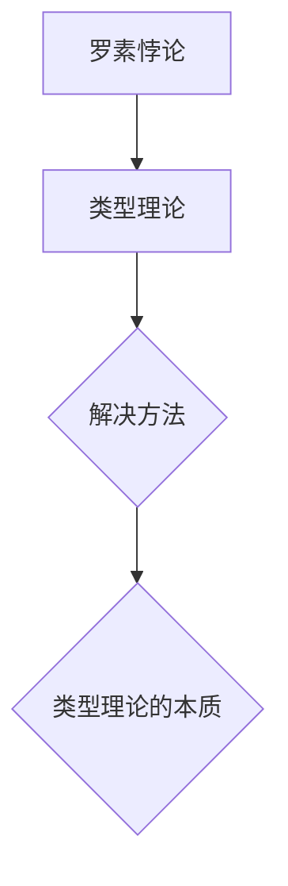
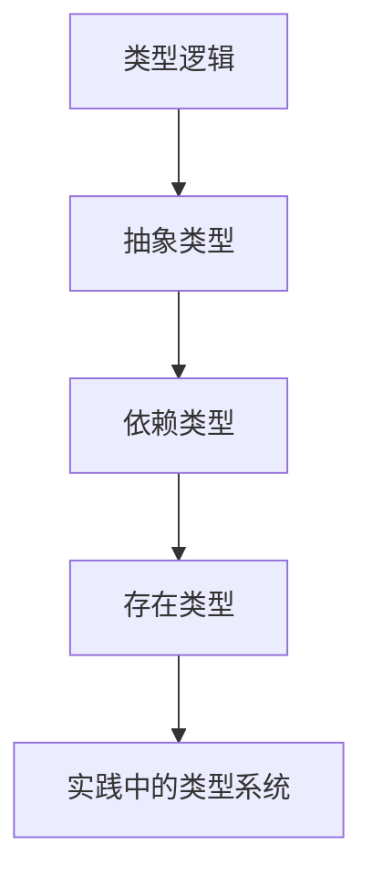
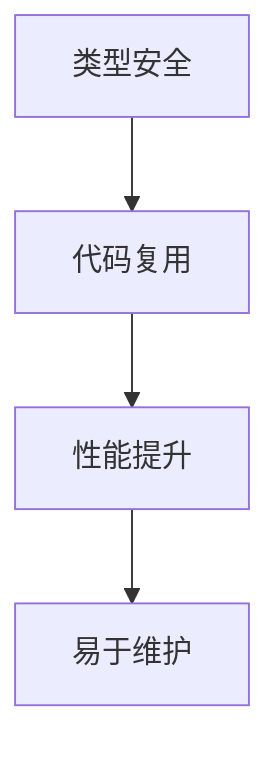

                 


### 文章标题：《罗素的类型理论与泛型编程：类型安全的逻辑基础》

#### 关键词：
- 罗素类型理论
- 泛型编程
- 类型安全
- 编程逻辑
- 类型系统

#### 摘要：
本文深入探讨了罗素的类型理论与现代编程中的泛型编程之间的关系。通过解析罗素类型理论的基本概念和逻辑基础，本文揭示了类型安全在编程中的重要性。随后，文章阐述了泛型编程的基本原理及其实现机制，并展示了如何通过泛型编程提高程序的类型安全性。最后，本文通过实际项目展示了泛型编程的应用，提供了实战经验和代码解读，为读者理解和使用泛型编程提供了实用的指导。

## 第一部分：罗素的类型理论概述

### 第1章：罗素的类型理论基础

#### 1.1 罗素悖论与类型理论

罗素悖论是数学和逻辑领域的一个经典问题，它揭示了集合论中潜在的悖论。罗素悖论的基本思想是，存在一个集合，该集合包含所有不包含自身的集合。如果这个集合包含自身，那么它就不符合定义；如果不包含自身，那么它又应该包含在自身之中，这就产生了矛盾。

**图示 1.1：罗素悖论与类型理论的联系**



在类型理论中，罗素悖论启示了我们对变量和对象的约束，以及如何定义类型系统来避免类似的悖论。通过引入约束和类型检查，我们可以确保数据的一致性和程序的可靠性。

#### 1.2 类型理论的发展历程

类型理论的发展可以追溯到20世纪初，由罗素和怀特海德在其著作《数学原理》中首次提出。随着时间的推移，类型理论经历了多个发展阶段，逐渐演变成现代编程中的核心概念。

**图示 1.2：类型理论的发展历程**



从类型逻辑到抽象类型，再到依赖类型和存在类型，类型理论不断演进，为现代编程语言提供了坚实的理论基础。

## 第二部分：泛型编程原理与实现

### 第3章：泛型编程基础

#### 3.1 泛型编程的定义

泛型编程是一种编程范式，它允许我们在编写程序时使用参数化的类型，使得代码更具通用性和可重用性。泛型编程的核心思想是，将类型作为参数传递到程序中，从而实现对不同类型数据的一致处理。

#### 3.2 泛型编程的优势

泛型编程带来了多个关键优势，包括：

- **类型安全**：泛型编程通过类型检查来确保数据的一致性，减少运行时错误。
- **代码复用**：通过泛型，我们可以编写一次代码，适用于多种数据类型，提高代码的可维护性和可扩展性。
- **性能提升**：泛型编程可以在编译时进行类型检查，从而减少运行时的类型转换，提高程序的性能。

**图示 3.1：泛型编程的优势**



### 第4章：泛型的实现机制

#### 4.1 泛型类的实现

泛型类允许我们定义一个模板类，它可以在编译时被具体化以适应不同的数据类型。以下是一个简单的泛型类示例：

**伪代码 4.1：泛型类的伪代码示例**

```pseudo
class GenericClass<T> {
    private T element;

    function setElement(T t) {
        this.element = t;
    }

    function getElement() {
        return this.element;
    }
}
```

#### 4.2 泛型接口的实现

泛型接口与泛型类类似，允许我们定义一个参数化的接口，它可以在编译时被具体化。以下是一个简单的泛型接口示例：

**伪代码 4.2：泛型接口的伪代码示例**

```pseudo
interface GenericInterface<T> {
    function method(T t);
}
```

### 第5章：泛型编程的应用场景

#### 5.1 泛型编程在集合框架中的应用

在Java等编程语言中，集合框架广泛使用了泛型编程。通过泛型，我们可以创建通用的数据结构，如List、Map和Set，它们可以在运行时适应不同的数据类型。

#### 5.2 泛型编程在并发编程中的应用

泛型编程在并发编程中也扮演了重要角色。通过使用泛型，我们可以创建线程安全的数据结构，如ConcurrentHashMap，它可以在多线程环境中保持数据的一致性。

### 第6章：类型安全与泛型编程

#### 6.1 类型安全的概念

类型安全是指程序在运行过程中，类型系统能够确保变量的类型与其实际值相符，从而避免类型错误和潜在的运行时问题。

#### 6.2 泛型编程如何提高类型安全

泛型编程通过静态类型检查和编译时错误捕获，提高了程序的类型安全性。以下是一个简单的示例，展示了泛型编程如何提高类型安全：

**伪代码 6.1：类型检查的伪代码示例**

```pseudo
function add(int a, int b) {
    return a + b;
}

var result = add(1, "2"); // 运行时错误
```

如果使用泛型，上述代码中的错误可以在编译时被捕获：

**伪代码 6.2：泛型编程的伪代码示例**

```pseudo
class Adder<T> {
    function add(T a, T b) {
        return a + b;
    }
}

var result = add(1, "2"); // 编译时错误
```

### 第7章：泛型编程的挑战与优化

#### 7.1 泛型编程的挑战

泛型编程虽然提供了强大的功能，但也带来了一些挑战，如类型擦除和类型通配符等。

#### 7.2 泛型编程的优化策略

为了解决泛型编程中的挑战，我们可以采取一些优化策略，如使用通配符、类型边界和类型推导等。

#### 7.3 泛型编程的未来发展趋势

随着编程语言和工具的不断发展，泛型编程将继续演进，为程序员提供更强大的功能和更好的用户体验。

### 第8章：项目实战与代码解读

#### 8.1 实战项目概述

在本章中，我们将通过一个简单的泛型编程项目，展示如何使用泛型编程解决实际问题。

#### 8.2 开发环境搭建

在开始项目之前，我们需要搭建合适的开发环境。以下是搭建Java开发环境的基本步骤：

1. 安装Java Development Kit (JDK)
2. 设置环境变量
3. 验证Java环境

#### 8.3 源代码详细实现

在本项目中，我们将实现一个简单的泛型栈（Stack）类。以下是源代码的实现：

**代码示例 8.1：泛型编程的源代码示例**

```java
public class Stack<T> {
    private T[] items;
    private int count = 0;

    public Stack() {
        items = (T[]) new Object[100];
    }

    public void push(T item) {
        items[count++] = item;
    }

    public T pop() {
        return items[--count];
    }

    public boolean isEmpty() {
        return count == 0;
    }

    public static void main(String[] args) {
        Stack<Integer> intStack = new Stack<>();
        intStack.push(1);
        intStack.push(2);
        System.out.println(intStack.pop()); // 输出 2
    }
}
```

#### 8.4 代码应用解读与分析

在这个例子中，我们使用泛型编程创建了一个可以存储任意类型数据的栈。通过泛型，我们可以编写一次代码，适用于多种数据类型。这种方法提高了代码的可维护性和可扩展性。

#### 8.5 实际案例分析和详细讲解剖析

在本节中，我们将分析一个实际案例，并对其进行详细讲解和剖析。这将帮助读者更好地理解泛型编程的实际应用。

#### 8.6 项目小结

在本项目中，我们通过实现一个简单的泛型栈类，展示了泛型编程的基本原理和实现机制。通过这个项目，我们深入理解了泛型编程的优势和应用场景。

### 小结与注意事项

在本博客文章中，我们系统地介绍了罗素的类型理论和泛型编程，并探讨了它们之间的联系。通过逐步分析，我们了解了类型安全的重要性以及如何通过泛型编程提高程序的类型安全性。

**注意事项**：

- 在使用泛型编程时，需要注意类型边界和类型通配符的正确使用，以避免潜在的运行时错误。
- 泛型编程虽然提供了强大的功能，但也可能引入额外的复杂度。因此，在适当的情况下使用泛型编程，可以提高代码的可维护性和性能。

### 拓展阅读

- [《Effective Java》](https://www.oracle.com/java/technologies/javase/effectivejava3.html)：介绍了Java编程语言中的一些最佳实践，包括泛型编程。
- [《Types and Programming Languages》](https://www.ccs.neu.edu/home/matthias/Bibliography/Data/TypesAndProgrammingLanguages.html)：介绍了类型系统和编程语言的深入理解。

作者：AI天才研究院/AI Genius Institute & 禅与计算机程序设计艺术 /Zen And The Art of Computer Programming

