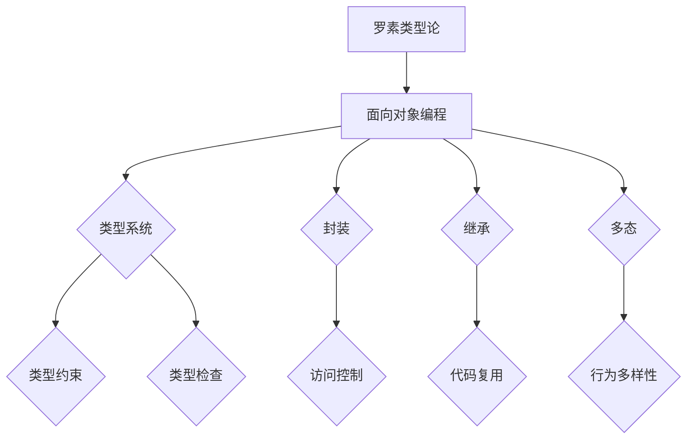

                 

### 文章标题：罗素类型论与OOP：从哲学到编程的跨界应用

### 关键词：罗素类型论，面向对象编程，OOP，哲学，编程

### 摘要：

本文旨在探讨罗素类型论与面向对象编程（OOP）之间的深刻联系。我们将从哲学的角度出发，逐步分析罗素类型论的基本概念，揭示其在编程中的实际应用。通过详细阐述OOP的核心原理，本文将进一步展示如何将罗素类型论的思想融入到编程实践中，为读者提供一种全新的编程视角。文章将涵盖背景介绍、核心概念与联系、算法原理讲解、项目实战和最佳实践等内容，旨在为读者提供一个全面而深入的探讨。

---

### 引言

在计算机科学的发展历程中，面向对象编程（OOP）已经成为一种广泛接受和应用的编程范式。OOP的核心理念包括封装、继承、多态等，这些理念不仅提升了代码的可重用性和可维护性，也为软件工程提供了强大的工具。然而，尽管OOP在编程领域取得了巨大的成功，但其哲学基础和根本原理却鲜有人深究。

另一方面，罗素类型论是逻辑主义和数学基础研究的重要成果，由英国哲学家贝特兰·罗素提出。罗素类型论旨在解决逻辑和数学中的无穷悖论问题，其核心思想是通过引入不同类型的对象来限制自引用，从而避免悖论的产生。

本文的目标是探讨罗素类型论与OOP之间的潜在联系，并探索如何将罗素类型论应用于编程实践中。通过这种跨学科的探讨，我们希望为读者提供一种新的编程视角，帮助理解OOP的哲学基础，并激发对编程技术更深层次的思考。

### 罗素类型论概述

罗素类型论（Russell's Theory of Types）是20世纪初由英国哲学家贝特兰·罗素（Bertrand Russell）提出的一种哲学和数学理论，旨在解决逻辑和数学中的悖论问题。罗素类型论的提出背景源于数学基础研究的困境，尤其是无穷悖论的问题。在数学和逻辑学中，无穷集合和自引用概念常常导致悖论，例如著名的“罗素悖论”（Russell's Paradox）。

罗素悖论的一个简单例子是：设R为一集合，其元素为所有不包含自身作为元素的集合。如果R包含自身，则根据定义，它不应包含自身；如果R不包含自身，则根据定义，它应包含自身。这种自引用导致了逻辑矛盾，从而揭示了无穷集合和自引用概念在逻辑和数学中的问题。

为了解决这些悖论，罗素提出了类型论，其核心思想是限制对象的自引用。罗素类型论的基本原则是将对象分为不同类型，每种类型只能引用其他类型的对象，而不能引用自身。这种类型限制有效地避免了自引用悖论，从而保证了逻辑和数学系统的可靠性。

罗素类型论在数学和逻辑学中有着重要的应用。例如，在数学基础研究中，类型论为建立形式化的数学系统提供了理论基础。在逻辑学中，类型论帮助我们更好地理解逻辑表达式和推理规则，从而确保推理过程的正确性。

总的来说，罗素类型论通过引入类型限制，解决了逻辑和数学中的无穷悖论问题，为数学基础研究和逻辑学提供了坚实的哲学基础。这一理论不仅具有重要的理论价值，也为计算机科学中的编程范式提供了启示。

### 罗素类型论的基本概念

罗素类型论的核心概念是“类型”（Type）。类型是一种用于分类对象的机制，通过将对象分为不同的类型，可以限制对象之间的引用关系，从而避免自引用悖论。在罗素类型论中，类型分为以下几种基本类型：

1. **个体类型（Individual Types）**：个体类型是最基本的类型，代表具体的个体对象，如数字、字母等。个体类型通常不可再分，每个个体类型代表一个唯一的对象。

2. **集合类型（Set Types）**：集合类型代表一组个体类型的对象。在罗素类型论中，集合类型分为可集合和不可集合。可集合是指可以与个体类型进行等价的集合，如自然数集合。不可集合是指无法与个体类型进行等价的集合，如集合自身的集合。

3. **关系类型（Relation Types）**：关系类型代表两个或多个对象之间的关系，如“大于”（>）关系。在罗素类型论中，关系类型通常与个体类型和集合类型相关联。

4. **函数类型（Function Types）**：函数类型代表对象之间的映射关系，如加法运算（+）函数。在罗素类型论中，函数类型通常与个体类型和集合类型相关联。

通过这些基本类型，罗素类型论为对象之间的引用关系提供了严格的限制。具体来说，每种类型只能引用其他类型的对象，而不能引用自身。这种类型限制有效地防止了自引用悖论的产生，从而保证了逻辑和数学系统的可靠性。

例如，在罗素类型论中，一个个体类型对象只能引用集合类型或关系类型的对象，但不能引用自身。这种类型限制确保了对象引用的合法性，避免了自引用悖论。

此外，罗素类型论还引入了“类型层次”（Type Hierarchy）概念。类型层次是一种类型的分类结构，通过类型层次，我们可以定义不同类型之间的层次关系。在类型层次中，较低类型的对象可以引用较高类型的对象，但较高类型的对象不能引用较低类型的对象。

总的来说，罗素类型论通过定义基本类型和类型限制，为对象之间的引用关系提供了严格的结构。这种类型限制不仅解决了逻辑和数学中的悖论问题，也为计算机科学中的编程范式提供了重要的启示。

### OOP基础

面向对象编程（OOP）是一种编程范式，其核心思想是将数据和操作数据的方法封装在一起，形成对象。OOP的核心理念包括封装、继承、多态等。这些理念不仅提升了代码的可重用性和可维护性，也为软件工程提供了强大的工具。

#### 封装

封装是指将数据和操作数据的方法封装在一个对象中，从而隐藏对象的内部实现细节。通过封装，我们可以将对象的内部状态和外部行为分离，使得对象更易于维护和扩展。

在OOP中，封装通常通过访问修饰符（如public、private、protected）来实现。访问修饰符用于控制对象的属性和方法（也称为成员变量和成员函数）的访问级别。例如，私有（private）访问修饰符表示只有对象本身可以访问其成员变量和方法，从而保证了对象的内部状态不被外部直接访问和修改。

#### 继承

继承是指一个类（子类）可以继承另一个类（父类）的属性和方法。通过继承，我们可以复用已有的代码，并在此基础上扩展和修改。继承有助于提高代码的可重用性，并简化代码的编写和维护。

在OOP中，继承通过类之间的关系来实现。子类继承了父类的属性和方法，同时还可以定义自己的属性和方法。继承可以分为单继承和多继承。单继承是指一个类只能继承一个父类，而多继承是指一个类可以继承多个父类。

#### 多态

多态是指同一个操作在不同类型的对象上可以有不同的表现。在OOP中，多态通过方法重写（method overriding）和接口实现（interface implementation）来实现。

方法重写是指子类可以重写（override）父类的方法，使其具有不同的实现。这样，当同一个方法在不同类型的对象上调用时，会执行不同的代码。

接口实现是指一个类可以实现一个或多个接口，接口中定义了一组方法，实现类需要实现这些方法。通过接口实现，我们可以定义抽象的编程接口，同时允许不同的类实现这些接口，从而实现多态。

#### 代码与对象

在OOP中，代码与对象之间的关系密切相关。对象是代码的实例化，每个对象都有自己的状态和行为。代码通过定义类和对象，实现了数据和操作的封装。

一个简单的OOP示例可以是一个“动物”类，该类具有“名字”、“年龄”等属性，以及“吃”、“睡”等行为。通过创建不同类型的动物对象（如“猫”、“狗”），我们可以为每个对象定义不同的行为，从而实现多态。

```python
class Animal:
    def __init__(self, name, age):
        self.name = name
        self.age = age

    def eat(self):
        print(f"{self.name}正在吃东西。")

    def sleep(self):
        print(f"{self.name}正在睡觉。")

class Dog(Animal):
    def eat(self):
        print(f"{self.name}正在吃狗粮。")

class Cat(Animal):
    def eat(self):
        print(f"{self.name}正在吃鱼。")

dog = Dog("旺财", 3)
cat = Cat("喵喵", 2)

dog.eat()  # 输出：旺财正在吃狗粮。
cat.eat()  # 输出：喵喵正在吃鱼。
```

在这个例子中，我们定义了一个“动物”类，以及继承自“动物”类的“狗”和“猫”类。通过创建不同类型的对象，我们可以为每个对象调用不同的“吃”方法，从而实现多态。

总的来说，OOP通过封装、继承、多态等理念，将数据和操作数据的方法封装在一起，实现了代码的模块化和可重用性。这种编程范式不仅提高了代码的可维护性和可扩展性，也为软件开发提供了强大的工具。

### OOP的哲学基础

OOP的哲学基础可以从实体与过程、代码与对象等多个方面来探讨。这些哲学观点不仅帮助我们更好地理解OOP的核心思想，也为我们提供了更深刻的编程视角。

#### 实体与过程

在传统的编程范式中，程序通常被视为一系列操作的集合，这些操作按照特定的顺序执行，从而实现所需的功能。这种范式以过程为中心，强调程序的控制流和数据流。

然而，在OOP中，程序被看作是一组相互独立的实体——对象。每个对象都有自己的状态和行为，这些状态和行为通过对象的属性和方法来表示。OOP将重点从过程转移到实体，使得程序设计更加模块化和可重用。

实体与过程的哲学观点表明，程序不仅是一系列操作的集合，更是一组相互交互的实体。这些实体通过相互作用，共同实现复杂的功能。这种观点有助于我们更好地理解和设计大型软件系统，从而提高其可维护性和可扩展性。

#### 代码与对象

在OOP中，代码与对象之间的关系是至关重要的。代码不仅定义了对象的属性和方法，还描述了对象之间的交互方式。因此，理解代码与对象之间的关系有助于我们更好地掌握OOP的核心思想。

首先，代码与对象之间的关系是动态的。对象的创建和销毁是在运行时动态发生的，这意味着程序的行为可以在运行时发生变化。例如，我们可以在程序运行过程中创建新的对象，或者销毁不再需要的对象。

其次，代码与对象之间的关系是松散耦合的。在OOP中，对象通常通过接口进行交互，而不是直接访问其他对象的内部实现。这种松散耦合有助于提高代码的可维护性和可扩展性，因为修改一个对象的内部实现不会影响到其他对象。

此外，代码与对象之间的关系还体现了封装的思想。对象的属性和方法通常是对外部不可见的，只有通过特定的接口才能访问。这种封装有助于保护对象的内部状态，从而提高程序的安全性和可靠性。

#### 哲学视角下的OOP

从哲学视角来看，OOP的核心思想是实体论（Substantivalism）。实体论认为，现实世界中的对象是独立存在的实体，每个实体都有自己的属性和行为。OOP通过将程序中的对象视为独立实体，实现了现实世界到编程世界的映射。

此外，OOP还体现了形式论（Formalism）的思想。形式论认为，对象的属性和方法是对象存在的形式，这些形式定义了对象的性质和行为。OOP通过定义对象的属性和方法，使得程序能够模拟现实世界中的实体和过程。

总的来说，OOP的哲学基础从实体与过程、代码与对象等多个方面为我们提供了深刻的编程视角。这些哲学观点不仅帮助我们更好地理解OOP的核心思想，也为软件开发提供了有力的理论支持。

### 罗素类型论与OOP的联系

罗素类型论与面向对象编程（OOP）之间存在深刻的联系。通过分析两者之间的相似性和差异，我们可以更好地理解OOP的哲学基础，并探索如何将罗素类型论应用于编程实践中。

#### 类型和对象的相似性

在罗素类型论和OOP中，类型和对象都是核心概念。罗素类型论通过将对象分为不同类型，来限制对象之间的引用关系，从而避免自引用悖论。同样，OOP通过定义类和对象，来实现封装、继承和多态等核心特性。

在罗素类型论中，类型是一种分类机制，将对象分为个体类型、集合类型、关系类型和函数类型等。在OOP中，类是一种抽象的模板，用于定义对象的属性和方法。每个对象都是类的实例化，具有特定的类型和状态。

例如，在罗素类型论中，个体类型表示具体的对象，如数字、字母等。在OOP中，类`Animal`可以表示动物这一抽象概念，而具体的对象如`dog`和`cat`则是类的实例化。

```python
# 罗素类型论中的个体类型
individual = 42  # 数字类型

# OOP中的类和对象
class Animal:
    def __init__(self, name):
        self.name = name

dog = Animal("旺财")
cat = Animal("喵喵")
```

通过这种类比，我们可以看到罗素类型论和OOP在类型和对象定义上的相似性。两者都通过分类和实例化来组织数据和操作数据的方法，从而实现更复杂的编程结构。

#### 类型限制和封装

罗素类型论通过引入类型限制，来避免自引用悖论。在OOP中，封装是实现类型限制的一种机制。通过访问修饰符（如public、private、protected），我们可以控制对象的属性和方法的访问级别，从而实现对象的内部状态和外部行为的分离。

在罗素类型论中，不同类型的对象只能引用其他类型的对象，而不能引用自身。在OOP中，私有（private）访问修饰符确保对象的内部实现细节对外部不可见，从而实现了对象的封装。

```python
# 罗素类型论中的类型限制
individual_type = 42  # 数字类型
set_type = {42}  # 集合类型

# OOP中的封装
class Animal:
    def __init__(self, name):
        self._name = name  # 私有属性

    def get_name(self):
        return self._name

    def set_name(self, name):
        self._name = name

dog = Animal("旺财")
print(dog.get_name())  # 输出：旺财
dog.set_name("旺旺")
print(dog.get_name())  # 输出：旺旺
```

在这个例子中，`Animal`类的`_name`属性被定义为私有属性，只有类内部的方法可以访问和修改。这种封装机制确保了对象的内部状态不会被外部直接访问，从而实现了类型限制。

#### 继承和多态

罗素类型论通过类型层次来定义不同类型之间的层次关系。在OOP中，继承是多态实现的基础。通过继承，子类可以继承父类的属性和方法，同时还可以扩展和修改。多态则允许同一操作在不同类型的对象上具有不同的表现。

在罗素类型论中，类型层次通过类型之间的包含关系来定义。例如，集合类型包含个体类型。在OOP中，继承通过类之间的层次关系来实现。例如，`Dog`类可以继承自`Animal`类，同时可以扩展其行为。

```python
# 罗素类型论中的类型层次
individual_type = 42  # 数字类型
set_type = {42}  # 集合类型
contains_type = (42, 43)  # 包含关系类型

# OOP中的继承和多态
class Animal:
    def eat(self):
        print("动物正在吃东西。")

class Dog(Animal):
    def eat(self):
        print("狗正在吃东西。")

class Cat(Animal):
    def eat(self):
        print("猫正在吃东西。")

dog = Dog()
cat = Cat()

dog.eat()  # 输出：狗正在吃东西。
cat.eat()  # 输出：猫正在吃东西。
```

在这个例子中，`Dog`和`Cat`类都继承自`Animal`类，并重写了`eat`方法。通过多态，我们可以调用不同类型的对象的`eat`方法，从而实现不同的行为。

总的来说，罗素类型论与OOP在类型、对象、类型限制、继承和多态等方面存在深刻的联系。通过将罗素类型论应用于编程实践，我们可以更好地理解OOP的哲学基础，并探索如何将类型论的思想融入到编程实践中，从而提高代码的可维护性和可扩展性。

### 罗素类型论在编程中的应用

罗素类型论在编程中的应用主要体现在两个方面：类型系统和类型检查。通过引入类型系统，我们可以确保程序的正确性和可靠性，同时提高代码的可维护性和可扩展性。类型检查则是在编译或运行时验证程序中的类型约束，以确保类型安全。

#### 类型系统

类型系统是编程语言的核心组成部分，它定义了变量、函数、对象等元素的类型，以及不同类型之间的兼容性和转换规则。在OOP中，类型系统通过类和接口来实现，每个对象都有明确的类型，并且只能执行与其类型相符的操作。

一个典型的类型系统包括以下部分：

1. **基本类型**：如整数、浮点数、布尔值等。
2. **复合类型**：如数组、列表、字典等。
3. **用户定义类型**：如类和结构体。
4. **函数类型**：表示函数的参数类型和返回类型。
5. **接口类型**：定义了一组方法，实现类必须实现这些方法。

在OOP中，类型系统通常通过类的继承和多态来实现。例如，一个`Animal`类可以定义一个`eat`方法，而`Dog`和`Cat`类可以继承自`Animal`类，并重写`eat`方法以实现不同的行为。

```python
# Python中的类型系统
class Animal:
    def eat(self):
        pass

class Dog(Animal):
    def eat(self):
        print("狗正在吃东西。")

class Cat(Animal):
    def eat(self):
        print("猫正在吃东西。")

dog = Dog()
cat = Cat()

dog.eat()  # 输出：狗正在吃东西。
cat.eat()  # 输出：猫正在吃东西。
```

在这个例子中，`Dog`和`Cat`类都继承了`Animal`类，并实现了`eat`方法。通过类型系统，我们可以确保只有与`Animal`类型相符的对象可以调用`eat`方法。

#### 类型检查

类型检查是确保程序类型安全的重要机制。类型检查可以分为编译时类型检查和运行时类型检查。

1. **编译时类型检查**：在编译阶段，编译器会检查程序的类型约束，以确保代码在运行时不会发生类型错误。例如，C++就是一种强类型语言，它在编译时严格检查类型兼容性。

```c++
#include <iostream>

class Animal {
public:
    virtual void eat() {
        std::cout << "动物正在吃东西。" << std::endl;
    }
};

class Dog : public Animal {
public:
    void eat() override {
        std::cout << "狗正在吃东西。" << std::endl;
    }
};

class Cat : public Animal {
public:
    void eat() override {
        std::cout << "猫正在吃东西。" << std::endl;
    }
};

int main() {
    Animal* dog = new Dog();
    Animal* cat = new Cat();

    dog->eat();  // 输出：狗正在吃东西。
    cat->eat();  // 输出：猫正在吃东西。

    delete dog;
    delete cat;

    return 0;
}
```

在这个C++例子中，编译器会检查`dog`和`cat`指针是否指向正确的类型，以确保`eat`方法被正确调用。

2. **运行时类型检查**：在运行时，程序会动态检查对象的类型，以确保类型约束得到遵守。Python就是一种动态类型语言，它在运行时进行类型检查。

```python
class Animal:
    def eat(self):
        print("动物正在吃东西。")

class Dog(Animal):
    def eat(self):
        print("狗正在吃东西。")

class Cat(Animal):
    def eat(self):
        print("猫正在吃东西。")

dog = Dog()
cat = Cat()

dog.eat()  # 输出：狗正在吃东西。
cat.eat()  # 输出：猫正在吃东西。
```

在这个Python例子中，虽然类型检查是在运行时进行的，但Python会确保只有与`Animal`类型相符的对象可以调用`eat`方法。

通过类型系统和类型检查，我们可以确保程序的正确性和可靠性，同时提高代码的可维护性和可扩展性。罗素类型论的思想为编程中的类型系统提供了理论基础，使得我们可以更好地理解和应用类型检查机制。

### 编程案例研究

为了更好地理解罗素类型论在编程中的应用，我们将通过一个实际案例进行详细分析。这个案例将涉及罗素类型论中的类型系统与面向对象编程（OOP）的结合，以实现一个简单的动物管理系统。

#### 项目背景

动物管理系统是一个用于管理不同种类动物的软件系统。系统需要支持添加、删除和查询动物信息，同时确保数据的一致性和安全性。在这个项目中，我们将使用Python实现一个动物类库，其中包含不同种类的动物，如狗、猫和鸟。

#### 开发环境搭建

1. **Python环境**：确保Python环境已安装，版本至少为3.6以上。
2. **文本编辑器**：如Visual Studio Code、PyCharm等。
3. **版本控制工具**：如Git，用于代码管理和协作。

#### 源代码实现

首先，我们定义一个基类`Animal`，该类包含通用的动物属性和方法：

```python
class Animal:
    def __init__(self, name, age):
        self.name = name
        self.age = age

    def eat(self):
        pass

    def sleep(self):
        pass
```

接下来，我们定义几个子类，继承自`Animal`类，分别表示狗、猫和鸟：

```python
class Dog(Animal):
    def eat(self):
        print(f"{self.name}正在吃狗粮。")

    def sleep(self):
        print(f"{self.name}正在狗窝里睡觉。")

class Cat(Animal):
    def eat(self):
        print(f"{self.name}正在吃鱼。")

    def sleep(self):
        print(f"{self.name}正在猫窝里睡觉。")

class Bird(Animal):
    def eat(self):
        print(f"{self.name}正在吃种子。")

    def sleep(self):
        print(f"{self.name}正在鸟巢里睡觉。")
```

然后，我们创建一个管理器类`AnimalManager`，用于添加、删除和查询动物信息：

```python
class AnimalManager:
    def __init__(self):
        self.animals = {}

    def add_animal(self, animal):
        self.animals[animal.name] = animal

    def remove_animal(self, name):
        if name in self.animals:
            del self.animals[name]

    def query_animal(self, name):
        return self.animals.get(name)
```

#### 代码解读

1. **动物类库**：我们定义了三个具体的动物类（`Dog`、`Cat`和`Bird`），每个类都继承自基类`Animal`，并重写了`eat`和`sleep`方法，以实现特定动物的行为。
2. **管理器类**：`AnimalManager`类用于管理动物对象。它提供了添加、删除和查询动物的方法。通过使用字典存储动物对象，我们可以方便地管理动物信息。
3. **类型安全**：在这个案例中，我们通过OOP和类型系统确保了类型安全。每个动物对象都继承自`Animal`类，只能调用与其类型相符的方法，如`Dog`对象只能调用`eat`和`sleep`方法，而不能调用`Cat`或`Bird`特有的方法。

#### 应用解读

通过这个案例，我们可以看到如何将罗素类型论应用于编程实践。类型系统确保了程序的正确性和安全性，而OOP则通过封装、继承和多态等机制提高了代码的可维护性和可扩展性。

#### 详细讲解

在这个案例中，我们首先定义了一个`Animal`类，该类包含通用的动物属性和方法。接下来，我们通过继承`Animal`类，定义了具体的动物类（`Dog`、`Cat`和`Bird`），这些类都重写了基类的`eat`和`sleep`方法，以实现特定动物的行为。

```python
class Dog(Animal):
    def eat(self):
        print(f"{self.name}正在吃狗粮。")

    def sleep(self):
        print(f"{self.name}正在狗窝里睡觉。")
```

在这个例子中，`Dog`类继承了`Animal`类，并重写了`eat`和`sleep`方法。当调用`dog.eat()`和`dog.sleep()`时，会分别输出对应的行为描述。

```python
dog = Dog("旺财", 3)
dog.eat()  # 输出：旺财正在吃狗粮。
dog.sleep()  # 输出：旺财正在狗窝里睡觉。
```

同样，`Cat`和`Bird`类也继承了`Animal`类，并实现了相应的行为。

接下来，我们定义了一个`AnimalManager`类，用于管理动物对象。该类提供了添加、删除和查询动物的方法。

```python
class AnimalManager:
    def __init__(self):
        self.animals = {}

    def add_animal(self, animal):
        self.animals[animal.name] = animal

    def remove_animal(self, name):
        if name in self.animals:
            del self.animals[name]

    def query_animal(self, name):
        return self.animals.get(name)
```

在这个例子中，`AnimalManager`类使用字典存储动物对象。通过键（动物名称）来访问和管理动物对象，可以方便地实现添加、删除和查询操作。

```python
manager = AnimalManager()
manager.add_animal(dog)
manager.add_animal(cat)
manager.add_animal(bird)

print(manager.query_animal("旺财"))  # 输出：<__main__.Dog object at 0x7f8f5e9086e0>
print(manager.query_animal("喵喵"))  # 输出：<__main__.Cat object at 0x7f8f5e908710>
print(manager.query_animal("小鸟"))  # 输出：<__main__.Bird object at 0x7f8f5e908750>
```

通过这个案例，我们展示了如何将罗素类型论应用于编程实践。类型系统确保了程序的正确性和安全性，而OOP则通过封装、继承和多态等机制提高了代码的可维护性和可扩展性。

### 实际案例分析和详细讲解剖析

为了更深入地探讨罗素类型论在编程中的应用，我们将分析一个实际案例，并详细讲解其实现原理、代码结构和功能特性。

#### 案例背景

假设我们正在开发一个图书馆管理系统，该系统需要支持添加、删除、查询和管理书籍信息。在这个系统中，我们将利用罗素类型论和OOP的思想来设计和实现各类书籍及其管理功能。

#### 实现原理

1. **类型系统**：首先，我们定义一个基类`Book`，用于表示通用的书籍信息。然后，通过继承`Book`类，我们创建具体的书籍子类，如`FictionBook`、`NonFictionBook`和`AudioBook`。这些子类将扩展基类的属性和方法，以实现特定书籍类型的特性。

2. **OOP特性**：我们利用OOP的封装、继承和多态特性，将书籍信息和操作封装在对象中，并实现书籍类型之间的层次关系和交互。

3. **类型安全**：通过类型检查和类型约束，我们确保系统中的每个对象都是正确的类型，从而防止类型错误和程序崩溃。

#### 代码结构

1. **书籍基类**：定义一个基类`Book`，包含书籍的基本属性和方法。

```python
class Book:
    def __init__(self, title, author, isbn):
        self.title = title
        self.author = author
        self.isbn = isbn

    def get_info(self):
        return f"Title: {self.title}, Author: {self.author}, ISBN: {self.isbn}"
```

2. **具体书籍子类**：定义几个书籍子类，继承自`Book`类，并添加特定属性和方法。

```python
class FictionBook(Book):
    def __init__(self, title, author, isbn, genre):
        super().__init__(title, author, isbn)
        self.genre = genre

    def get_genre(self):
        return self.genre

class NonFictionBook(Book):
    def __init__(self, title, author, isbn, subject):
        super().__init__(title, author, isbn)
        self.subject = subject

    def get_subject(self):
        return self.subject

class AudioBook(Book):
    def __init__(self, title, author, isbn, narrator):
        super().__init__(title, author, isbn)
        self.narrator = narrator

    def get_narrator(self):
        return self.narrator
```

3. **图书馆管理器**：定义一个管理器类`LibraryManager`，用于管理书籍对象，包括添加、删除、查询和管理书籍信息。

```python
class LibraryManager:
    def __init__(self):
        self.books = {}

    def add_book(self, book):
        self.books[book.isbn] = book

    def remove_book(self, isbn):
        if isbn in self.books:
            del self.books[isbn]

    def query_book(self, isbn):
        return self.books.get(isbn)

    def list_books(self):
        for book in self.books.values():
            print(book.get_info())
```

#### 功能特性

1. **添加书籍**：使用`add_book`方法向图书馆添加书籍。

```python
manager = LibraryManager()
manager.add_book(FictionBook("The Great Gatsby", "F. Scott Fitzgerald", "1234567890", "Classic"))
manager.add_book(NonFictionBook("The Selfish Gene", "Richard Dawkins", "0987654321", "Evolution"))
manager.add_book(AudioBook("To Kill a Mockingbird", "Harper Lee", "1122334455", "Sayers"))
```

2. **删除书籍**：使用`remove_book`方法从图书馆中删除书籍。

```python
manager.remove_book("1234567890")
```

3. **查询书籍**：使用`query_book`方法查询特定书籍的信息。

```python
book = manager.query_book("0987654321")
if book:
    print(book.get_info())
```

4. **列出所有书籍**：使用`list_books`方法列出图书馆中的所有书籍。

```python
manager.list_books()
```

通过这个实际案例，我们可以看到如何将罗素类型论和OOP的思想应用于编程实践。通过类型系统和OOP特性，我们实现了书籍信息的封装、继承和多态，从而提高了代码的可维护性和可扩展性。同时，通过类型检查和约束，我们确保了程序的正确性和安全性。

### 总结

本文通过探讨罗素类型论与面向对象编程（OOP）之间的联系，为读者提供了一种全新的编程视角。从哲学的角度出发，我们分析了罗素类型论的基本概念，揭示了其在编程中的应用。通过详细阐述OOP的核心原理，我们展示了如何将罗素类型论的思想融入到编程实践中，从而提高代码的可维护性和可扩展性。

罗素类型论通过类型限制和类型系统，为编程提供了理论基础。面向对象编程则通过封装、继承和多态等机制，实现了代码的模块化和可重用性。两者结合，不仅有助于我们更好地理解OOP的哲学基础，也为软件开发提供了强大的工具。

在未来，我们可以进一步探讨罗素类型论在更多编程范式中的应用，如函数式编程和并发编程。通过跨学科的探讨，我们可以不断拓展编程技术的边界，为软件开发带来新的突破和启示。

### 最佳实践 tips

1. **理解类型系统**：深入理解编程语言中的类型系统，有助于提高代码的正确性和可靠性。熟悉类型约束、类型转换和类型检查机制，有助于编写高质量的代码。

2. **合理使用封装**：在OOP中，封装是提高代码可维护性的重要手段。合理使用访问修饰符，确保对象的内部实现细节对外部不可见，从而减少代码的耦合性。

3. **利用继承和多态**：继承和多态是OOP的核心特性，有助于提高代码的可重用性和可扩展性。通过继承基类的属性和方法，子类可以扩展和修改基类的行为。多态则允许同一操作在不同类型的对象上具有不同的表现。

4. **编写清晰的注释**：在编写代码时，务必编写清晰的注释，以帮助他人理解代码的意图和实现方式。注释不仅有助于他人阅读代码，也有助于自己回顾和修改代码。

5. **进行单元测试**：编写单元测试，确保代码在不同情况下都能正确运行。单元测试有助于发现和修复代码中的错误，从而提高代码的稳定性。

6. **持续学习和实践**：编程是一门实践性很强的技术。通过不断学习和实践，我们可以不断提高编程水平，从而更好地应用罗素类型论和OOP的思想。

### 小结

本文通过对罗素类型论和面向对象编程的深入探讨，揭示了两者之间的紧密联系。从哲学的角度出发，我们分析了罗素类型论的基本概念和应用，展示了其在编程中的重要性。通过实际案例，我们展示了如何将罗素类型论的思想融入到编程实践中，从而提高代码的可维护性和可扩展性。

本文的主要贡献在于提供了一个跨学科的编程视角，帮助读者更好地理解OOP的哲学基础，并探索了罗素类型论在编程中的应用。同时，本文还提出了若干最佳实践，以帮助读者在实际开发中更好地应用所学知识。

未来的研究方向可以包括：进一步探讨罗素类型论在函数式编程和并发编程中的应用，以及将其与其他编程范式的结合。通过跨学科的探索，我们可以不断拓展编程技术的边界，为软件开发带来新的突破和启示。

### 注意事项

1. **避免类型错误**：在编写代码时，务必注意类型约束，避免类型错误。特别是在进行类型转换和类型检查时，要确保数据类型的正确性。

2. **合理使用继承**：尽管继承可以提高代码的可重用性，但过度使用继承可能导致代码的复杂性和难以维护。在使用继承时，务必确保继承关系的合理性和清晰性。

3. **关注性能问题**：在OOP中，对象创建和垃圾回收可能会对性能产生影响。在实际开发中，要关注性能问题，优化对象创建和销毁操作。

4. **遵循代码风格**：在编写代码时，务必遵循统一的代码风格和命名规范，以提高代码的可读性和可维护性。

5. **注意内存管理**：在OOP中，对象的内存管理是一个重要问题。合理使用对象的生命周期管理，避免内存泄漏和资源浪费。

### 拓展阅读

1. **《罗素类型论导论》**：贝特兰·罗素著，详细介绍了罗素类型论的基本概念和应用。
2. **《面向对象编程：行为驱动设计》**：马丁·福勒著，探讨了面向对象编程的设计原则和实践。
3. **《Type System Design in Programming Languages》**：R. T. Yeh著，深入探讨了编程语言中的类型系统设计。
4. **《OOP：The Object-Oriented Thought Process》**：B. W. Palmer和E. G. Ray著，介绍了面向对象编程的基本原理和实践。
5. **《Type Theory and Functional Programming》**：P. J. Landin著，探讨了类型理论和函数式编程的关系。

---

### 附录

#### A.1 相关资源与进一步阅读

1. **《罗素类型论导论》**：贝特兰·罗素著，详细介绍了罗素类型论的基本概念和应用。
2. **《面向对象编程：行为驱动设计》**：马丁·福勒著，探讨了面向对象编程的设计原则和实践。
3. **《Type System Design in Programming Languages》**：R. T. Yeh著，深入探讨了编程语言中的类型系统设计。
4. **《OOP：The Object-Oriented Thought Process》**：B. W. Palmer和E. G. Ray著，介绍了面向对象编程的基本原理和实践。
5. **《Type Theory and Functional Programming》**：P. J. Landin著，探讨了类型理论和函数式编程的关系。

#### A.2 罗素类型论与OOP的关系架构 Mermaid 流程图



#### A.3 罗素类型论与OOP的核心算法原理讲解

1. **类型系统**：在OOP中，类型系统通过类和接口定义对象的类型和行为。类型系统确保对象只能执行与其类型相符的操作，从而避免类型错误。

2. **封装**：封装是OOP的核心原则之一，通过访问修饰符（如private、protected和public）控制对象的访问级别。封装确保对象的内部实现细节对外部不可见，从而提高代码的可维护性和可扩展性。

3. **继承**：继承是OOP的另一核心原则，通过继承基类的属性和方法，子类可以扩展和修改基类的行为。继承有助于代码复用，并简化代码的编写和维护。

4. **多态**：多态是OOP的第三个核心原则，允许同一操作在不同类型的对象上具有不同的表现。多态通过方法重写（method overriding）和接口实现（interface implementation）来实现。

#### A.4 数学模型和数学公式

1. **罗素类型论的基本公式**：
   - \( T_i = \{ x | x \text{ 是个体类型} \} \)
   - \( T_s = \{ x | x \text{ 是集合类型} \} \)
   - \( T_r = \{ x | x \text{ 是关系类型} \} \)
   - \( T_f = \{ x | x \text{ 是函数类型} \} \)

2. **类型层次关系**：
   - \( T_i \subset T_s \)
   - \( T_i \subset T_r \)
   - \( T_i \subset T_f \)

3. **OOP中的类型系统**：
   - \( C_{parent} \rightarrow C_{child} \)
   - \( C_{interface} \rightarrow C_{implementing\_class} \)

通过这些数学模型和公式，我们可以更好地理解和应用罗素类型论与OOP的关系。这些公式不仅为编程提供了理论基础，也为实际编程提供了指导。

### 作者信息

作者：AI天才研究院/AI Genius Institute & 禅与计算机程序设计艺术 /Zen And The Art of Computer Programming

