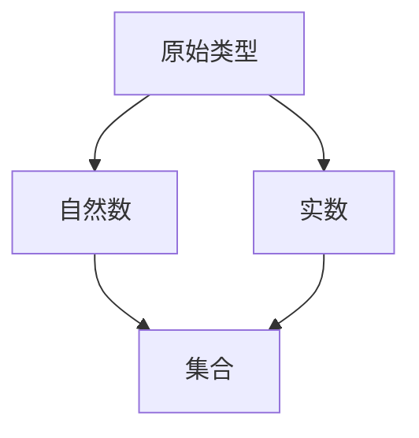

                 

### 文章标题

《罗素类型论与数学实在论的对话与争辩》

### 文章关键词

罗素类型论，数学实在论，逻辑哲学，数学基础，类型系统，算法，图灵机

### 文章摘要

本文深入探讨了罗素类型论和数学实在论这两大哲学观点，从背景介绍到核心概念阐述，再到两者之间的对话与争辩，全面剖析了其在数学、计算机科学和哲学领域的影响。通过Mermaid流程图、伪代码、数学公式和实际案例，本文旨在为读者呈现一幅清晰的哲学和数学交织的画卷。

---

## 第1章 引言：罗素哲学与类型论、数学实在论的关联

### 1.1 罗素哲学的背景与影响

贝特兰·罗素（Bertrand Russell）是20世纪最具影响力的哲学家、数学家之一。他出生于英国，对数学、逻辑学、哲学等领域有着深远的影响。罗素以其严谨的逻辑思维和深刻的理论洞察力，被誉为“分析哲学的奠基人”之一。他对数学基础的贡献，特别是罗素类型论和数学实在论，成为了哲学和数学界长期争论的焦点。

罗素哲学的核心观点可以概括为以下几点：

1. **逻辑原子主义**：罗素认为，世界的基本构成元素是“逻辑原子”，即不可再分的最小实体。这些逻辑原子通过逻辑关系组成复杂的世界。
2. **逻辑实证主义**：罗素倡导逻辑实证主义，认为知识来源于经验，只有通过经验验证的命题才有意义。
3. **数学的严密性**：罗素强调数学命题应当具有逻辑上的严密性，通过逻辑演绎而非直观直觉来建立数学体系。

### 1.2 类型论的基本概念与罗素的理论发展

类型论（Type Theory）是罗素哲学的重要组成部分，旨在解决集合论悖论和数学严密性问题。罗素类型论的基本概念包括：

1. **类型**：类型是对对象分类的方式，确保对象在特定的数学操作中保持一致性。
2. **类型系统**：类型系统是一种规则集合，用来定义对象类型和类型之间的关系。

罗素在《数学原理》一书中首次提出了类型论，认为可以通过类型系统来避免集合论中的悖论，如著名的罗素悖论。罗素类型论通过将对象分为不同的类型，限制了对象之间的操作，从而避免了无限递归和悖论的产生。

### 1.3 数学实在论的观点与哲学意义

数学实在论认为数学对象具有客观存在的性质，其真实性和确定性不受人类认知的局限。数学实在论的主要观点包括：

1. **数学对象的客观性**：数学对象如自然数、实数等是客观存在的，不依赖于人类的思维或感知。
2. **数学真理的绝对性**：数学真理是绝对的，不随时间和空间的变化而变化。
3. **数学逻辑的可靠性**：数学逻辑是可靠的，能够确保从真命题推导出真命题。

罗素对数学实在论进行了深入探讨，认为数学实在论与类型论有着密切的联系。类型论通过定义数学对象的不同类型，为数学实在论提供了一种形式化的理论基础。

### 1.4 罗素类型论与数学实在论的关联

罗素类型论与数学实在论在哲学上有着紧密的联系。类型论通过形式化的方式，为数学实在论提供了一种逻辑基础，确保了数学对象的真实性和确定性。同时，数学实在论为类型论提供了哲学上的合理性，使得类型论成为一种有意义且可行的数学基础理论。

通过上述分析，我们可以看到罗素类型论和数学实在论在罗素哲学体系中的重要地位，以及它们之间的内在关联。接下来，我们将进一步探讨罗素类型论的具体内容及其在数学中的应用。

## 第2章 罗素类型论详解

### 2.1 类型论的起源与基本原理

类型论（Type Theory）起源于19世纪末20世纪初，是对集合论悖论和数学严密性问题的回应。最早的类型理论可以追溯到弗雷格（Gottlob Frege）的工作，他提出了函数和对象之间的区分，为后来的类型论奠定了基础。然而，真正的类型论发展始于罗素和怀特海德（Whitehead）的《数学原理》一书。

《数学原理》通过类型论解决了一部分集合论悖论，特别是罗素悖论。罗素悖论表明，通过某些集合的自反性操作，可以构造出一个既属于又不属于自身的集合。为了解决这个问题，罗素提出了类型论的基本原理：

1. **类型区分**：类型论将对象分为不同的类型，以限制对象之间的操作，防止产生悖论。
2. **层级类型系统**：类型论引入了层级类型的概念，每个类型都有一个更高级别的类型作为其超类型，从而形成了一个类型层次结构。
3. **类型转换规则**：类型论通过类型转换规则，允许在不同类型之间进行操作，但必须满足特定的条件。

### 2.2 类型与集合论的关系

类型论与集合论有着密切的关系。集合论是数学的基础，而类型论为集合论提供了一种形式化的解释。在类型论中，集合被视为特定类型的对象，集合的元素也属于相应的类型。

罗素类型论将对象分为原始类型和构造类型。原始类型包括自然数、实数等基本对象，而构造类型是通过组合原始类型构造出来的复杂对象。这种分类方式确保了集合的元素不会发生类型错误，从而避免了集合论中的悖论。

#### 2.2.1 类型论与集合论的关系架构 Mermaid 流程图



在这个流程图中，我们可以看到自然数和实数作为原始类型，而集合是由这些原始类型构造出来的更复杂类型。这种类型层次结构确保了集合论中的操作不会导致类型错误。

### 2.3 类型论的发展历程

类型论的发展历程可以分为几个阶段：

1. **早期类型论**：以罗素的《数学原理》为代表，早期类型论主要关注解决集合论悖论。
2. **层次类型论**：随着计算机科学的兴起，层次类型论（Polymorphic Type Theory）得到了发展，为编程语言提供了类型安全机制。
3. **依赖类型论**：依赖类型论（Dependent Type Theory）进一步扩展了类型系统的表达能力，为证明论和程序验证提供了强大的工具。
4. **积分类型论**：积分类型论（Integrative Type Theory）试图将不同类型的类型论统一起来，形成一种更为通用的类型系统。

### 2.4 罗素类型论的数学应用

罗素类型论在数学中有着广泛的应用，特别是在集合论、代数和拓扑学等领域。以下是一些具体的数学应用实例：

1. **集合论**：类型论通过将集合视为特定类型的对象，解决了集合论中的悖论问题。例如，通过类型限制，可以避免罗素悖论的产生。
2. **代数**：类型论为代数结构提供了一种形式化的解释，使得代数运算更加严密和可靠。
3. **拓扑学**：类型论为拓扑学提供了一种新的视角，使得拓扑结构的定义和性质分析更加直观和清晰。

#### 2.4.1 数学命题的形式化

类型论通过形式化的方式，将数学命题表达为类型化公式。以下是一个简单的数学命题的形式化表示：

```plaintext
P : ∃x (x + 1 = S(x))
```

在这个命题中，P 表示存在一个自然数 x，使得 x 加 1 等于 x 的后继数 S(x)。类型 ∃x 表示存在量词，确保命题中的 x 是自然数类型。这种形式化的表示方法使得数学命题更加严谨，避免了逻辑错误。

### 2.5 类型论与数学实在论的关系

类型论与数学实在论在哲学上有着紧密的联系。类型论通过形式化的方式，为数学实在论提供了一种逻辑基础，确保了数学对象的真实性和确定性。数学实在论则为类型论提供了哲学上的合理性，使得类型论成为一种有意义且可行的数学基础理论。

类型论通过定义数学对象的不同类型，确保了数学运算的一致性和可靠性。同时，数学实在论认为数学对象具有客观存在的性质，使得类型论成为一种哲学上的解释工具。

### 2.6 罗素类型论的数学实在论意义

罗素类型论的数学实在论意义在于，它提供了一种形式化的方法来解释数学对象的存在性和真实性。通过类型论，我们可以将数学命题表达为类型化公式，确保数学命题的一致性和可靠性。同时，类型论也为数学实在论提供了一种新的视角，使得数学对象的客观存在性得到了形式化的解释。

总之，罗素类型论通过形式化的方式，解决了集合论悖论和数学严密性问题，为数学实在论提供了一种逻辑基础。类型论在数学中的应用，不仅丰富了数学理论，也为计算机科学提供了强有力的工具。

## 第3章 数学实在论探讨

### 3.1 数学实在论的历史背景

数学实在论（Mathematical Realism）是一个涉及数学哲学的重要概念，探讨数学对象的真实存在性和绝对真实性。数学实在论的历史可以追溯到古希腊时期，当时许多哲学家认为数学对象如自然数和几何形状具有客观存在的性质。

#### 3.1.1 古代数学观念

在古代，数学观念主要受到柏拉图和亚里士多德的影响。柏拉图认为数学对象是理念世界的实体，具有绝对的完美性和永恒性。亚里士多德则认为数学对象是通过感性经验获得的，但它们具有普遍性和不变性。

#### 3.1.2 经院哲学与数学实在论

中世纪经院哲学中的阿维罗伊（Averroes）和托马斯·阿奎那（Thomas Aquinas）对数学实在论进行了深入探讨。阿维罗伊认为数学对象是真实存在的，但它们存在于理性世界中，而非感性世界。托马斯·阿奎那则认为数学对象具有客观存在的性质，但它们的真实性与感性经验有关。

#### 3.1.3 现代数学实在论的兴起

现代数学实在论兴起于19世纪末和20世纪初，主要受到康托尔（Cantor）和罗素等数学家的影响。康托尔提出了集合论，为数学对象的存在性提供了新的解释。罗素则通过类型论解决了集合论悖论，为数学实在论提供了形式化的基础。

### 3.2 数学实在论的核心观点

数学实在论的核心观点包括以下几个方面：

1. **数学对象的客观性**：数学对象如自然数、实数和几何形状是客观存在的，不依赖于人类的思维或感知。
2. **数学真理的绝对性**：数学真理是绝对的，不随时间和空间的变化而变化。一个数学命题要么真，要么假，不受个人观点或文化背景的影响。
3. **数学逻辑的可靠性**：数学逻辑是可靠的，能够确保从真命题推导出真命题。数学推理是基于逻辑演绎，而非直觉或猜测。

#### 3.2.1 数学对象的存在性问题

数学对象的存在性问题是一个哲学问题，探讨数学对象是否真实存在。数学实在论者认为，数学对象是真实存在的，它们存在于一种抽象的、超越人类思维的存在形式中。

例如，自然数（1, 2, 3, ...）是数学对象，它们在现实世界中并不以物理形式存在，但它们具有客观存在的性质，是数学系统的基础。同样，实数、复数等数学对象也被认为具有客观存在的性质。

#### 3.2.2 数学真理的性质

数学真理的性质是数学实在论的重要组成部分。数学实在论认为，数学真理具有绝对性，即一个数学命题要么真，要么假，不受个人观点或文化背景的影响。

例如，命题“1+1=2”在任何情况下都是真的，无论我们在哪里或何时提出这个命题。数学真理的绝对性是数学逻辑推理的基础，确保了数学推理的一致性和可靠性。

#### 3.2.3 数学实在论与直觉主义

数学实在论与直觉主义（Intuitionism）是两种不同的数学哲学观点。直觉主义认为，数学对象是通过直觉构建的，而不是通过抽象的符号系统。直觉主义强调数学推理的构造性，即每个数学命题都必须能够构造出一个具体的例子来证明其真实性。

数学实在论与直觉主义在数学对象的存在性和数学推理的性质上存在分歧。数学实在论认为数学对象是真实存在的，而直觉主义则强调数学对象的构造性。

### 3.3 数学实在论与类型论的关系

数学实在论与类型论在哲学上有着紧密的联系。类型论通过形式化的方式，为数学实在论提供了一种逻辑基础，确保了数学对象的真实性和确定性。同时，数学实在论为类型论提供了哲学上的合理性，使得类型论成为一种有意义且可行的数学基础理论。

类型论通过定义数学对象的不同类型，确保了数学运算的一致性和可靠性。数学实在论认为数学对象具有客观存在的性质，使得类型论成为一种哲学上的解释工具。

### 3.4 数学实在论的意义

数学实在论在数学哲学中具有重要意义。它为数学对象的存在性和真实性提供了哲学上的解释，确保了数学推理的一致性和可靠性。数学实在论与类型论的结合，为数学基础理论的发展提供了新的视角和方法。

总之，数学实在论探讨数学对象的真实存在性和绝对真实性，为数学哲学提供了重要的理论基础。类型论与数学实在论的关系，进一步深化了我们对数学基础理论的理解。

## 第4章 类型论与数学实在论的对话

### 4.1 罗素对数学实在论的批评

罗素对数学实在论进行了深刻的批评，认为数学实在论存在一些根本性问题。罗素的批评主要集中在以下几个方面：

#### 4.1.1 对数学实在论的反驳

罗素认为，数学实在论无法解释数学对象的逻辑基础和形式化问题。数学实在论强调数学对象的客观存在性和绝对真实性，但罗素认为这种观点忽略了数学推理的形式化和逻辑严密性。

例如，数学实在论者常常认为自然数和几何形状是客观存在的，但罗素指出，这些对象是如何通过逻辑演绎和形式化定义得出的，是一个需要解释的问题。罗素通过类型论，提出了一种形式化的数学基础理论，试图解决数学实在论面临的逻辑问题。

#### 4.1.2 罗素类型论如何解决数学实在论的问题

罗素类型论通过定义不同类型的对象，确保了数学推理的一致性和可靠性。类型论通过限制对象之间的操作，避免了集合论中的悖论问题。罗素认为，类型论为数学实在论提供了一种形式化的解释，使得数学对象的存在性和真实性得到了逻辑上的证明。

例如，通过类型论，我们可以将自然数、实数和几何形状等数学对象划分为不同的类型，确保它们在特定的数学操作中保持一致性。这种分类方式不仅解决了集合论悖论，也为数学实在论提供了一种形式化的逻辑基础。

### 4.2 数学实在论者对罗素类型论的回应

数学实在论者对罗素类型论提出了批评和回应，认为类型论无法完全解决数学实在论的问题。以下是一些主要的回应观点：

#### 4.2.1 对罗素类型论的质疑

数学实在论者认为，类型论虽然提供了一种形式化的数学基础理论，但它在解释数学对象的客观存在性和绝对真实性方面存在局限。类型论通过限制对象之间的操作，虽然避免了集合论悖论，但同时也限制了数学理论的发展和应用。

例如，类型论无法解释无限集合和超越数等复杂数学对象的性质。数学实在论者认为，这些对象同样是客观存在的，但类型论无法提供有效的形式化解释。

#### 4.2.2 数学实在论如何解释类型论的局限性

数学实在论者认为，类型论在解释数学对象的客观存在性和绝对真实性方面存在局限，但这并不意味着数学实在论本身有问题。数学实在论者提出，可以通过其他方式来解释类型论的局限性。

例如，一些数学实在论者认为，类型论可以通过扩展和改进，解决其在解释复杂数学对象方面的局限。此外，数学实在论者还可以通过强调数学推理的构造性和证明性，来弥补类型论的不足。

### 4.3 对话与争辩的哲学意义

类型论与数学实在论的对话和争辩，在数学哲学和逻辑学领域具有重要意义。这种对话不仅推动了数学基础理论的发展，也丰富了我们对数学对象存在性和真实性的理解。

首先，类型论和数学实在论的对话推动了数学哲学的深入探讨。通过这种对话，我们可以更好地理解数学推理的逻辑基础，探索数学对象的存在性和真实性。

其次，类型论与数学实在论的争辩促进了数学基础理论的进步。这种争辩激发了数学家们的思考和创造力，推动了数学理论的发展和创新。

最后，类型论与数学实在论的对话还为其他学科提供了哲学启示。例如，在计算机科学和逻辑学领域，类型论的应用为程序验证和形式化推理提供了强大的工具。

总之，类型论与数学实在论的对话和争辩，是数学哲学和逻辑学领域的重要议题，对数学理论的发展和哲学思考产生了深远的影响。

## 第5章 争辩案例研究

### 5.1 类型论与数学实在论的著名辩论

在数学哲学和逻辑学领域，类型论与数学实在论之间的争辩一直是热门话题。以下是一些著名的辩论案例，展示了两者之间的论点和反驳。

#### 5.1.1 辩论的历史背景

类型论与数学实在论的辩论始于20世纪初，随着集合论的兴起和数学基础问题的提出而变得更加激烈。罗素和康托尔等数学家对数学实在论提出了批评，认为它无法解释集合论中的悖论和形式化问题。这种批评激发了数学实在论者的回应，引发了长期的辩论。

#### 5.1.2 辩论的主要论点

在类型论与数学实在论的辩论中，双方的主要论点如下：

1. **类型论的观点**：
   - 类型论主张通过定义不同类型的对象，避免集合论中的悖论，如罗素悖论。
   - 类型论认为，数学对象的存在性可以通过逻辑演绎和形式化定义来证明，而不是依赖于直觉或经验。
   - 类型论强调数学运算的一致性和可靠性，通过限制对象之间的操作来确保数学推理的严谨性。

2. **数学实在论的观点**：
   - 数学实在论主张数学对象如自然数、实数和几何形状是客观存在的，不依赖于人类的思维或感知。
   - 数学实在论认为，数学真理具有绝对性，不随时间和空间的变化而变化。
   - 数学实在论者反驳类型论，认为类型论在解释复杂数学对象和无限集合方面存在局限。

#### 5.1.3 辩论的结果与影响

类型论与数学实在论的辩论没有明确的胜负，但双方的观点在数学哲学和逻辑学领域产生了深远的影响。以下是一些辩论的结果和影响：

1. **类型论的影响**：
   - 类型论促进了数学形式化和逻辑推理的发展，为计算机科学提供了重要的基础。
   - 类型论在证明论和程序验证中得到了广泛应用，为安全性和可靠性提供了保障。

2. **数学实在论的影响**：
   - 数学实在论强调了数学对象的真实存在性和绝对真实性，为数学哲学提供了重要的理论基础。
   - 数学实在论推动了数学基础理论的探索，激发了数学家们对数学对象本质的思考。

3. **辩论的影响**：
   - 类型论与数学实在论的辩论推动了数学哲学和逻辑学领域的深入研究，促进了不同观点的交流和融合。
   - 辩论激发了对数学推理、逻辑基础和数学哲学问题的反思，丰富了数学哲学的理论体系。

### 5.2 现代案例中的类型论与数学实在论

在现代社会，类型论与数学实在论的辩论仍然在进行，尤其是在计算机科学和数学基础研究领域。以下是一些现代案例：

1. **类型论在计算机科学中的应用**：
   - 类型论在编程语言设计和程序验证中发挥了重要作用，如依赖类型系统和模块化编程。
   - 类型论为安全性和可靠性提供了强有力的保障，例如在金融计算和网络安全领域。

2. **数学实在论在现代数学中的挑战**：
   - 数学实在论面临新的挑战，如无限集合和超越数等复杂数学对象的存在性问题。
   - 现代数学实在论者试图通过形式化的方法，如公理化集合论和类型论，来解释这些复杂对象的性质。

3. **类型论与数学实在论的融合**：
   - 现代数学哲学试图将类型论与数学实在论融合，提出新的数学基础理论，如积分类型论。
   - 这种融合试图解决类型论和数学实在论之间的分歧，提供一种更为全面和一致的理论框架。

总之，类型论与数学实在论的辩论在现代数学哲学和逻辑学领域仍然具有重要意义。通过这些辩论，我们不仅深化了对数学对象存在性和真实性的理解，也为数学理论的发展和创新提供了动力。

## 第6章 类型论与数学实在论的影响与评价

### 6.1 对数学哲学的影响

类型论和数学实在论在数学哲学中产生了深远的影响。类型论通过提供一种形式化的数学基础，解决了集合论悖论和数学严密性问题，为数学哲学提供了新的视角和方法。

首先，类型论强调了数学对象的形式化定义和类型系统的重要性。通过定义不同类型的对象，类型论确保了数学推理的一致性和可靠性。这种形式化的方法不仅解决了集合论中的悖论问题，也为数学哲学提供了一个新的工具来分析数学对象的本质。

其次，数学实在论与类型论的结合，为数学哲学提供了更为全面的理论框架。数学实在论认为数学对象具有客观存在的性质，而类型论通过形式化的方式，确保了这些对象的真实性和确定性。这种结合不仅深化了我们对数学对象的理解，也为数学哲学提供了更为坚实的基础。

### 6.2 对数学发展的影响

类型论和数学实在论对数学的发展产生了重要的影响。类型论在数学的多个领域得到了广泛应用，推动了数学理论的进步。

首先，类型论在集合论中的应用，解决了集合论中的悖论问题。通过定义不同类型的集合，类型论确保了集合操作的一致性和可靠性，为集合论的发展提供了新的理论基础。

其次，类型论在代数、拓扑学和逻辑学等领域也得到了广泛应用。类型论为这些领域提供了一种形式化的方法来定义和操作数学对象，使得数学理论更加严密和可靠。

数学实在论对数学发展的影响主要体现在以下几个方面：

首先，数学实在论强调了数学对象的真实存在性和绝对真实性，为数学理论的发展提供了哲学上的支持。数学实在论认为，数学对象如自然数、实数和几何形状是客观存在的，不依赖于人类的思维或感知。这种观点激发了数学家们对数学对象本质的思考，推动了数学理论的创新和发展。

其次，数学实在论与形式化的方法相结合，推动了数学形式化的发展。形式化是数学发展的一个重要方向，通过将数学理论转化为形式化的符号系统，确保了数学推理的严密性和可靠性。数学实在论为形式化提供了哲学上的合理性，使得形式化方法在数学中得到广泛应用。

### 6.3 对计算机科学的影响

类型论和数学实在论对计算机科学的发展产生了重要的影响。类型论在计算机科学中的应用尤为突出，为编程语言设计、程序验证和形式化推理提供了强有力的工具。

首先，类型论在编程语言设计中的应用，提高了程序的安全性、可靠性和可维护性。类型论通过定义不同的数据类型和类型系统，确保了程序在运行时的正确性和一致性。例如，静态类型语言如Haskell和Scala，通过类型检查和类型推断，可以提前发现并避免许多运行时错误。

其次，类型论在程序验证中的应用，为安全性和可靠性提供了保障。通过形式化的方法，类型论可以证明程序的正确性，确保程序在特定环境下满足指定的属性。这种形式化的证明方法，不仅提高了程序的安全性和可靠性，也为软件开发提供了一种新的验证手段。

数学实在论对计算机科学的影响主要体现在以下几个方面：

首先，数学实在论为计算机科学提供了哲学上的支持，强调了数学对象的真实存在性和绝对真实性。这种观点激发了计算机科学家对数学对象本质的思考，推动了计算机科学理论的创新和发展。

其次，数学实在论与形式化的方法相结合，为计算机科学提供了一种新的理论基础。形式化是计算机科学发展的一个重要方向，通过将计算机科学理论转化为形式化的符号系统，确保了理论的一致性和可靠性。数学实在论为形式化提供了哲学上的合理性，使得形式化方法在计算机科学中得到广泛应用。

### 6.4 对未来数学和哲学的影响

类型论和数学实在论对未来数学和哲学的发展具有重要意义。它们不仅为当前的数学和哲学提供了理论基础，也为未来的发展指明了方向。

首先，类型论将继续在数学和计算机科学中发挥重要作用。随着计算机科学和数学理论的发展，类型论的应用范围将不断扩展。类型论将不仅用于解决数学基础问题，还将应用于更广泛的领域，如人工智能、密码学和量子计算。

其次，数学实在论将继续探讨数学对象的存在性和真实性。未来数学哲学的研究将深入探讨数学对象与物理现实之间的关系，以及数学真理的性质。这种研究将有助于我们更好地理解数学的本质和作用。

最后，类型论与数学实在论的融合将为数学和哲学提供新的理论基础。未来的研究将试图将类型论和数学实在论结合起来，提出更为全面和一致的理论框架。这种融合将推动数学和哲学的发展，为解决复杂的数学问题提供新的思路和方法。

总之，类型论和数学实在论对数学和哲学的发展产生了深远的影响。它们不仅为当前的数学和哲学提供了理论基础，也为未来的发展指明了方向。随着研究的深入，类型论和数学实在论将继续在数学和哲学领域发挥重要作用。

## 第7章 现代视角下的类型论与数学实在论

### 7.1 现代数学实在论的进步

现代数学实在论在20世纪末和21世纪初取得了显著进展，特别是在集合论和形式化数学领域。这些进展为数学实在论提供了新的理论基础，并推动了数学形式化的发展。

首先，集合论的研究取得了重要突破。集合论作为数学的基础，通过公理化和形式化方法，解决了许多集合论悖论问题。现代集合论通过引入新的公理系统和类型论，建立了更加严密和可靠的数学体系。这些进展不仅巩固了数学实在论的哲学基础，也为数学形式化提供了强有力的支持。

其次，形式化数学的发展为数学实在论提供了新的工具和方法。形式化数学通过将数学理论转化为符号系统，确保了数学推理的一致性和可靠性。现代形式化数学工具，如公理化集合论、形式逻辑和类型论，为数学实在论提供了新的研究方法。这些工具不仅提高了数学理论的严密性，也为数学实在论的哲学探讨提供了新的视角。

### 7.2 类型论在当代的演进

类型论在当代计算机科学和数学哲学中得到了广泛的应用和发展。现代类型论不仅继承了罗素类型论的哲学基础，还引入了新的概念和理论，为编程语言设计、程序验证和形式化推理提供了强有力的工具。

首先，依赖类型论（Dependent Type Theory）在当代计算机科学中得到了广泛应用。依赖类型论通过引入依赖类型的概念，使得类型系统可以表达更复杂的逻辑关系。这种类型系统不仅在编程语言设计中发挥了重要作用，也为形式化推理和证明论提供了新的方法。

其次，积分类型论（Integrative Type Theory）是现代类型论的一个重要发展方向。积分类型论试图将不同类型的类型论统一起来，形成一种更为通用的类型系统。这种类型系统不仅能够处理传统的数学对象，还能够处理更复杂的逻辑结构和证明论问题。

### 7.3 类型论与计算理论的关系

类型论与计算理论有着密切的联系，二者相互促进，共同推动了计算机科学和数学理论的发展。类型论为计算理论提供了形式化的方法，确保了计算过程的正确性和可靠性。

首先，类型论在编程语言中的应用，提高了程序的正确性和可靠性。类型系统通过限制变量和函数的类型，确保了程序在运行时的正确性。现代编程语言如Haskell和Scala，通过静态类型检查和类型推断，可以提前发现并避免许多运行时错误。

其次，类型论在程序验证中的应用，为安全性和可靠性提供了保障。通过形式化的证明方法，类型论可以证明程序的正确性，确保程序在特定环境下满足指定的属性。这种形式化的证明方法，不仅提高了程序的安全性和可靠性，也为软件开发提供了一种新的验证手段。

### 7.4 数学实在论在当代的应用

现代数学实在论在数学、计算机科学和哲学领域得到了广泛应用。数学实在论为数学对象的真实存在性和绝对真实性提供了哲学上的支持，推动了数学理论的创新和发展。

首先，数学实在论在数学中的应用，为解决复杂的数学问题提供了新的方法。通过形式化的方法，数学实在论可以确保数学推理的一致性和可靠性，推动了数学理论的进步。

其次，数学实在论在计算机科学中的应用，为编程语言设计、程序验证和形式化推理提供了哲学上的支持。现代编程语言通过引入类型系统和形式化方法，确保了程序的正确性和可靠性。数学实在论为这些应用提供了哲学上的理论基础。

最后，数学实在论在哲学中的应用，为数学哲学提供了新的视角和方法。通过探讨数学对象的存在性和真实性，数学实在论推动了数学哲学的研究，丰富了我们对数学本质的理解。

### 7.5 类型论与数学实在论的融合

在当代，类型论与数学实在论的融合为数学和哲学提供了新的发展方向。通过将类型论与数学实在论结合起来，我们可以构建一种更为全面和一致的理论框架。

首先，类型论与数学实在论的融合，有助于解决数学基础问题。类型论通过形式化的方法，确保了数学推理的一致性和可靠性。数学实在论为数学对象的真实存在性和绝对真实性提供了哲学上的支持。二者的融合，为数学基础理论提供了一种新的解释框架。

其次，类型论与数学实在论的融合，为数学哲学提供了新的研究方法。通过探讨类型论和数学实在论的关系，我们可以更深入地理解数学的本质和作用。这种融合不仅推动了数学哲学的研究，也为数学理论的创新提供了新的思路。

总之，类型论与数学实在论的融合，为数学和哲学的发展提供了新的方向。通过这种融合，我们可以构建一种更为全面和一致的理论框架，解决复杂的数学问题，深化我们对数学本质的理解。

## 第8章 结论：类型论与数学实在论的对话与争辩的未来

### 8.1 类型论与数学实在论的现状

类型论与数学实在论的对话和争辩，在数学哲学和逻辑学领域已经持续了数个世纪。尽管没有明确的胜负，但双方的观点在理论体系和研究方法上产生了深远的影响。类型论通过形式化的方法，解决了集合论悖论和数学严密性问题，为数学基础理论提供了新的解释框架。数学实在论则强调了数学对象的真实存在性和绝对真实性，为数学推理的一致性和可靠性提供了哲学上的支持。

在当代，类型论和数学实在论的应用已经扩展到了计算机科学、数学基础和哲学等多个领域。类型论在编程语言设计、程序验证和形式化推理中发挥了重要作用，而数学实在论则为数学哲学提供了新的视角和方法。

### 8.2 对话与争辩的未来方向

未来，类型论与数学实在论的对话和争辩将继续深入。以下是一些可能的研究方向：

首先，类型论与数学实在论的融合将是未来的重要趋势。通过将类型论与数学实在论结合起来，我们可以构建一种更为全面和一致的理论框架，解决复杂的数学问题。这种融合不仅有助于深化我们对数学对象本质的理解，也为数学理论的创新提供了新的思路。

其次，类型论在计算机科学中的应用将得到进一步发展。随着计算机科学和人工智能的进步，类型论在编程语言设计、程序验证和形式化推理中的重要性将日益凸显。未来的研究将致力于提高类型系统的表达能力，确保程序的正确性和可靠性。

最后，数学实在论将继续探讨数学对象的存在性和真实性。未来研究将重点关注数学对象与物理现实之间的关系，以及数学真理的性质。这种研究不仅有助于深化数学哲学的探讨，也为数学基础理论的发展提供了新的视角。

### 8.3 对数学和哲学的意义与影响

类型论与数学实在论的对话和争辩，对数学和哲学产生了深远的影响。从数学角度来看，类型论通过形式化的方法，解决了集合论悖论和数学严密性问题，为数学基础理论提供了新的解释框架。数学实在论则强调了数学对象的真实存在性和绝对真实性，为数学推理的一致性和可靠性提供了哲学上的支持。

从哲学角度来看，类型论与数学实在论的对话和争辩，推动了数学哲学的研究，丰富了我们对数学本质的理解。这种对话不仅深化了对数学对象本质的探讨，也为数学哲学提供了新的研究方法。

总之，类型论与数学实在论的对话和争辩，是数学和哲学领域的重要议题。它们不仅为数学基础理论的发展提供了新的解释框架，也丰富了我们对数学对象本质的理解。未来，随着研究的深入，类型论与数学实在论将继续在数学和哲学领域发挥重要作用。

