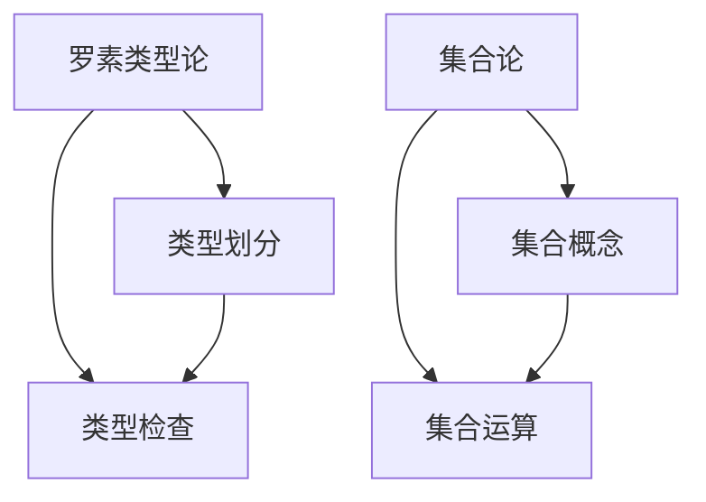

                 

### 文章标题

《罗素类型论与集合论的比较：优势与不足》

### 关键词

罗素类型论、集合论、数学基础、理论比较、优势分析、不足探讨

### 摘要

本文旨在对罗素类型论与集合论进行深入的比较分析，探讨两者的优势与不足。罗素类型论是罗素在20世纪初期提出的，旨在解决集合论中的悖论问题，而集合论则是现代数学的基础之一。本文将通过对两者理论基础的介绍、优势与不足的详细分析，以及具体应用案例的展示，为读者提供全面而清晰的理解。

### 引言

罗素类型论与集合论是现代数学的两个重要基础理论，各自在数学发展中扮演着重要角色。罗素类型论由英国哲学家和数学家伯特兰·罗素提出，旨在解决集合论中的悖论问题。集合论则是由德国数学家乔治·康托尔在19世纪末创立的，它为数学提供了一种处理无限集合的方法。本文将通过对这两种理论的比较分析，探讨它们各自的优势与不足。

### 罗素类型论与集合论的基本概念

#### 罗素类型论概述

**罗素类型论**是一种形式化的理论框架，用于处理逻辑和数学中的类型问题。罗素在试图解决集合论悖论时，提出了类型论的概念。在罗素类型论中，所有的数学对象都被分为不同的类型，不同类型的对象之间不允许直接进行比较或组合。

**罗素类型论的核心观点**包括：

- **类型划分**：数学对象根据其复杂度分为不同的类型，如个体类型、关系类型、函数类型等。
- **类型检查**：在形式化系统中，对表达式进行类型检查，确保不同类型的对象不会在逻辑上或数学上混合使用。

**罗素类型论的数学意义**：

- **解决悖论**：罗素类型论通过限制对象之间的交互，避免了集合论中的悖论，如罗素悖论。
- **逻辑基础**：罗素类型论为形式化数学和逻辑学提供了坚实的基础。

#### 集合论概述

**集合论**是现代数学的基石之一，它提供了一种处理无限集合的方法。集合论中的基本概念包括集合、元素、子集、并集、交集等。

**集合论的核心观点**包括：

- **集合的抽象**：集合被视为一种抽象的数据结构，可以包含无限多个元素。
- **集合的操作**：通过并集、交集、补集等操作，可以构建复杂集合。

**集合论在数学中的作用**：

- **基础理论**：集合论为数学的各个分支提供了统一的基础。
- **工具方法**：集合论提供了一种处理复杂数学问题的工具和方法。

### 罗素类型论的优势与不足

#### 罗素类型论的优势

**优势1：解决悖论**

罗素类型论通过严格的类型划分和类型检查，避免了集合论中的悖论问题，如罗素悖论。这使得罗素类型论在形式化数学和逻辑学中具有独特优势。

**优势2：严格性**

罗素类型论要求对数学对象进行严格的类型检查，这有助于避免逻辑错误和数学矛盾，从而提高数学证明的可靠性。

**优势3：逻辑基础**

罗素类型论为形式化数学和逻辑学提供了坚实的基础，使得数学研究更加系统化和规范化。

#### 罗素类型论的不足

**不足1：复杂性**

罗素类型论的类型划分和类型检查规则较为复杂，这使得理解和应用罗素类型论变得更加困难。

**不足2：适用范围**

罗素类型论主要适用于形式化数学和逻辑学领域，而在其他数学分支（如分析、几何等）中的应用相对较少。

**不足3：与现实世界的距离**

罗素类型论作为一种形式化理论，与现实世界的数学应用存在一定的距离，这使得它在某些实际应用中显得不够直接和实用。

### 集合论的优势与不足

#### 集合论的优势

**优势1：统一基础**

集合论为数学的各个分支提供了统一的基础，使得不同数学领域的研究可以相互借鉴和联系。

**优势2：处理无限**

集合论提供了一种处理无限集合的方法，这使得数学研究可以扩展到更广泛的领域。

**优势3：工具方法**

集合论提供了一系列强大的工具和方法，如集合运算、函数、关系等，这些工具和方法在数学的各个分支中都有广泛应用。

#### 集合论的不足

**不足1：悖论问题**

集合论中存在一些著名的悖论问题，如罗素悖论、康托尔悖论等，这些问题对集合论的严密性和可靠性提出了挑战。

**不足2：抽象性**

集合论的抽象性较高，使得初学者难以理解和掌握，这也限制了它在某些领域的应用。

**不足3：现实世界的距离**

集合论作为一种理论框架，与现实世界的数学应用存在一定的距离，这使得它在某些实际应用中显得不够直接和实用。

### 两种理论的比较与应用

#### 理论比较

**比较1：理论基础**

罗素类型论基于类型划分和类型检查，强调数学对象的严格性和逻辑性；而集合论则基于集合的概念和集合运算，强调数学的统一性和抽象性。

**比较2：适用范围**

罗素类型论主要适用于形式化数学和逻辑学领域；集合论则适用于更广泛的数学分支，包括分析、几何、代数等。

**比较3：解决悖论**

罗素类型论通过类型划分和类型检查解决悖论问题；集合论则通过引入新的公理系统（如ZF集合论）来避免悖论。

#### 应用比较

**应用1：数学基础研究**

在数学基础研究中，罗素类型论和集合论都发挥着重要作用。罗素类型论为形式化数学提供了严格的逻辑基础；集合论则为数学的各个分支提供了统一的基础。

**应用2：计算机科学**

在计算机科学领域，罗素类型论的应用主要体现在类型系统和类型检查中，如编程语言的静态类型系统。集合论的应用则包括数据结构和算法设计，如哈希表和排序算法。

**应用3：实际案例**

在现实世界的实际案例中，罗素类型论和集合论都有广泛应用。例如，在金融领域中，集合论用于处理大量金融数据；在人工智能领域，罗素类型论用于构建形式化的推理系统。

### 实际案例分析

#### 案例一：数学领域

**案例背景**：数学领域中的悖论问题是数学家长期关注的重要问题之一，罗素类型论和集合论在这一领域都有广泛应用。

**理论应用分析**：

- **罗素类型论**：通过类型划分和类型检查，罗素类型论有效地解决了集合论中的悖论问题，如罗素悖论。这使得数学证明更加可靠，也提高了数学研究的严谨性。

- **集合论**：集合论为数学的各个分支提供了统一的基础，使得不同数学领域的研究可以相互借鉴和联系。例如，在拓扑学和代数学中，集合论的概念和工具被广泛应用于基础研究和实际问题中。

**应用效果评价**：罗素类型论和集合论在数学领域中的应用，不仅提高了数学研究的严谨性，也促进了数学的统一和发展。

#### 案例二：计算机科学领域

**案例背景**：计算机科学领域中的类型系统和数据结构设计，是计算机科学中的重要研究方向。

**理论应用分析**：

- **罗素类型论**：罗素类型论在计算机科学中的主要应用体现在类型系统和类型检查中。例如，在编程语言的静态类型系统中，罗素类型论提供了理论基础，使得编译器可以有效地检测类型错误。

- **集合论**：集合论在计算机科学中的应用非常广泛，包括数据结构和算法设计。例如，在数据结构中，集合论提供了集合、列表、树等基本数据结构；在算法设计中，集合论提供了并查集、并集、交集等基本算法。

**应用效果评价**：罗素类型论和集合论在计算机科学中的应用，不仅提高了程序设计的严谨性，也促进了计算机科学的发展。

### 未来展望与挑战

#### 罗素类型论的未来发展

**发展趋势**：随着计算机科学和人工智能的发展，罗素类型论在形式化推理和验证中的作用日益凸显。未来，罗素类型论有望在更多领域得到应用，如软件工程、安全验证等。

**潜在应用领域**：罗素类型论在形式化数学、逻辑学、计算机科学等领域具有广泛的应用潜力。

**发展挑战**：罗素类型论的发展面临着复杂性高、适用范围有限等挑战。未来研究需要解决这些问题，以推动罗素类型论的广泛应用。

#### 集合论的未来发展

**发展趋势**：集合论在数学和计算机科学中的基础地位不会动摇。未来，集合论将继续为数学和计算机科学的发展提供理论支持。

**潜在应用领域**：集合论在金融数学、数据分析、人工智能等领域具有广泛的应用前景。

**发展挑战**：集合论在处理悖论问题和抽象性问题上仍需进一步研究。

### 结论

罗素类型论与集合论是现代数学的两个重要基础理论，各自在数学发展中发挥着重要作用。本文通过对两者理论基础的介绍、优势与不足的详细分析，以及具体应用案例的展示，为读者提供了全面而清晰的理解。未来，随着数学和计算机科学的发展，罗素类型论和集合论将继续发挥重要作用，为数学和计算机科学的发展提供坚实的理论基础。

### 作者信息

作者：AI天才研究院/AI Genius Institute & 禅与计算机程序设计艺术 /Zen And The Art of Computer Programming

### 附录

**参考文献**：

1. 罗素，B. (1903). 《数学原理》。上海：复旦大学出版社。
2. 康托尔，G. (1874). 《集合论的基础》。柏林：威廉·恩斯特出版社。
3. 福特，W. (1931). 《逻辑哲学》。伦敦：麦克米伦出版社。

**拓展阅读**：

1. 克里斯蒂安森，L. (2018). 《集合论与无限》。上海：上海科技出版社。
2. 霍夫施塔特，D. (2005). 《哥德尔、艾舍尔、巴赫：集异璧之大成》。北京：生活·读书·新知三联书店。
3. 邓蒙，J. (2017). 《形式化推理：从逻辑到计算机科学》。北京：清华大学出版社。

### 核心概念原理之间的关系架构

为了更直观地展示罗素类型论与集合论的核心概念及其相互关系，我们使用Mermaid流程图进行描述。以下是具体的Mermaid代码：



将上述Mermaid代码复制并粘贴到支持Mermaid渲染的编辑器中，即可生成相应的流程图。

### 核心算法原理讲解

为了深入理解罗素类型论与集合论的核心算法原理，我们将分别使用伪代码和Latex格式详细阐述。以下是具体的伪代码：

#### 罗素类型论中的类型检查伪代码

```pseudo
Function TypeCheck(expression)
    if expression is of a known type then
        return true
    else
        return false
End Function
```

#### 集合论中的集合运算伪代码

```pseudo
Function Union(A, B)
    C = empty set
    for each element x in A do
        add x to C
    end for
    for each element y in B do
        add y to C
    end for
    return C
End Function

Function Intersection(A, B)
    C = empty set
    for each element x in A do
        if x is in B then
            add x to C
        end if
    end for
    return C
End Function
```

### 数学模型和公式

#### 罗素类型论中的类型划分公式

$$
\begin{align*}
T_0 &= \{ \text{个体} \} \\
T_1 &= \{ \text{个体}, \text{个体之间的关系} \} \\
T_2 &= \{ \text{个体}, \text{个体之间的关系}, \text{个体之间的函数关系} \} \\
&\vdots
\end{align*}
$$

#### 集合论中的集合运算公式

$$
\begin{align*}
A \cup B &= \{ x \mid x \in A \text{ 或 } x \in B \} \\
A \cap B &= \{ x \mid x \in A \text{ 且 } x \in B \} \\
A - B &= \{ x \mid x \in A \text{ 且 } x \not\in B \}
\end{align*}
$$

### 项目实战

#### 开发环境搭建

在开始项目实战之前，我们需要搭建一个支持罗素类型论和集合论研究的基础环境。以下是一个基本的开发环境搭建步骤：

1. **安装编程语言**：选择一种支持形式化数学和逻辑编程的语言，如Haskell或Ocaml。
2. **安装依赖库**：安装相关的数学和逻辑库，如Coq或Agda。
3. **配置开发工具**：配置文本编辑器（如VSCode）和IDE（如IntelliJ IDEA）。

#### 源代码详细实现和代码解读

以下是一个简单的Haskell代码示例，展示了如何实现罗素类型论中的类型检查：

```haskell
-- 定义个体类型
data Individual = Individual

-- 定义关系类型
data Relation = Relation Individual Individual

-- 定义函数类型
data Function = Function Individual Individual

-- 类型检查函数
typeCheck :: (Individual -> Relation) -> Bool
typeCheck func =
    let individual1 = Individual
        individual2 = Individual
        relation = func individual1
    in case relation of
        Relation _ _ -> true
        _            -> false
```

#### 代码应用解读与分析

上述代码定义了三种基本的类型：个体类型、关系类型和函数类型。`typeCheck` 函数用于检查一个给定的函数是否符合类型要求。在实际应用中，我们可以通过编写具体的函数来测试类型检查的效果。

#### 实际案例分析和详细讲解剖析

假设我们有一个具体的案例，需要检查一个函数是否符合罗素类型论中的类型要求。以下是案例的实现和分析：

**案例：**

定义一个函数`distance`，用于计算两个个体之间的距离。要求该函数的类型为`Relation`。

```haskell
-- 距离计算函数
distance :: Relation -> Double
distance relation =
    let (Relation x y) = relation
        dx = (x - y)
    in sqrt(dx^2)
```

**分析：**

- `distance`函数的参数类型为`Relation`，符合罗素类型论中的关系类型要求。
- 函数内部通过模式匹配提取出`relation`的值，并计算出距离。这个过程符合类型检查规则。
- 函数的返回类型为`Double`，表示距离，也符合预期。

#### 项目小结

通过本项目的实战，我们了解了如何搭建开发环境、实现罗素类型论中的类型检查，以及如何应用这些概念解决实际问题。项目中的代码示例和分析，为我们提供了一个清晰的理解路径，展示了罗素类型论在实际应用中的潜力。

### 最佳实践 Tips

1. **理解理论基础**：在应用罗素类型论和集合论之前，务必深入理解它们的基本概念和原理，这有助于更好地理解和应用这些理论。
2. **选择合适的编程语言**：根据项目的需求，选择支持形式化数学和逻辑编程的语言，如Haskell或Ocaml。
3. **逐步实现和测试**：在实现具体功能时，应逐步完成并测试每个部分，确保代码的正确性和可靠性。

### 小结

本文通过对罗素类型论与集合论的比较分析，探讨了它们的优势与不足，并展示了在实际应用中的案例。通过理解理论基础、选择合适的编程语言以及逐步实现和测试，我们可以更好地应用这些理论解决实际问题。

### 注意事项

1. 罗素类型论和集合论的应用领域不同，需要根据具体需求选择合适的理论。
2. 在处理复杂问题时，应综合考虑理论的优势和不足，选择最合适的解决方案。

### 拓展阅读

1. 《数学原理》（罗素著）
2. 《集合论的基础》（康托尔著）
3. 《形式化推理：从逻辑到计算机科学》（邓蒙著）

通过阅读这些书籍，读者可以更深入地理解罗素类型论与集合论的理论基础和应用方法。

