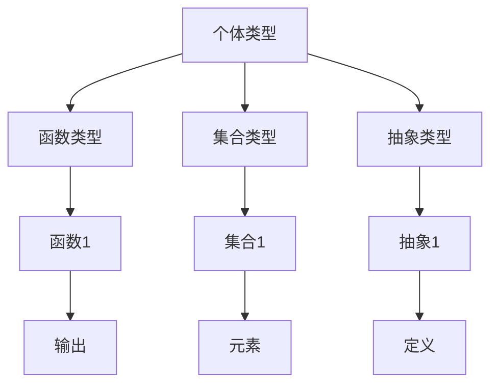
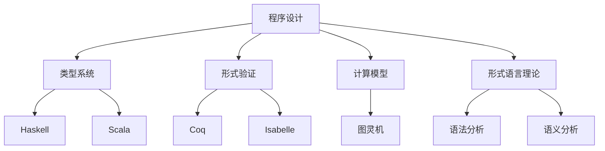

                 

### 引言

罗素类型论，作为一种重要的逻辑理论，起源于20世纪初，由英国哲学家和数学家贝特兰·罗素提出。其核心思想是通过区分不同的类型来避免逻辑悖论，尤其是在集合论和数学基础领域。罗素类型论不仅在哲学和数学领域产生了深远的影响，还在现代逻辑系统设计中扮演了关键角色。

罗素类型论对现代逻辑系统设计的影响主要体现在以下几个方面：

1. **避免悖论**：在集合论中，罗素悖论揭示了传统的集合论体系存在内在的不一致性。罗素类型论通过引入不同类型的对象，有效地避免了这类悖论。

2. **类型系统**：在现代编程语言中，类型系统是保证程序正确性和安全性的重要机制。罗素类型论为现代类型系统的设计提供了理论基础。

3. **形式验证**：罗素类型论在形式验证中也有重要应用，特别是在确保系统安全性和正确性方面。

4. **理论计算机科学**：罗素类型论为理论计算机科学提供了丰富的理论资源，推动了形式语言理论、计算模型和算法理论的发展。

本文将分以下几个部分对罗素类型论在现代逻辑系统设计中的影响进行评估：

1. **背景与发展**：回顾罗素类型论的历史背景和重要发展历程。
2. **基本概念**：介绍罗素类型论的核心概念，包括类型层次和类型判定。
3. **现代逻辑系统的联系**：分析罗素类型论与现代逻辑系统的联系和应用。
4. **应用案例分析**：通过具体案例展示罗素类型论在现代逻辑系统设计中的应用效果。
5. **计算机科学领域的影响**：探讨罗素类型论在计算机科学领域的影响。
6. **未来发展展望**：预测罗素类型论在逻辑系统设计中的发展方向。
7. **结论与总结**：总结全书内容，强调罗素类型论在现代逻辑系统设计中的重要性。

通过以上步骤的分析和评估，我们将深入理解罗素类型论在现代逻辑系统设计中的核心价值和深远影响。接下来的部分将逐一展开详细讨论。

### 罗素类型论的背景与发展

罗素类型论的提出背景可以追溯到20世纪初，当时数学家们正面临集合论中存在的悖论问题。其中最著名的悖论就是罗素悖论，它揭示了经典集合论体系中的内在矛盾。这个悖论的核心在于：如果一个集合包含所有不包含自身的集合，那么这个集合是否包含自身？这导致了逻辑上的无穷递归和矛盾。

为了解决这类悖论，罗素在1901年提出了类型论。他的基本思想是通过引入类型的概念，将对象分为不同的层次，从而避免集合论中的悖论。罗素类型论的核心是类型层次，每个类型代表一组具有相似性质的个体，这些个体在不同的类型层次上相互独立。

罗素类型论的正式形式化是在他的著作《数学原理》中提出的。在这本书中，罗素与阿伦·怀特海德共同工作，系统地构建了一个基于类型论的数学体系。罗素类型论的形式化主要依赖于类型层次和类型判定原则。类型层次是指对象按照其复杂性分为不同的层次，每个层次上的对象只能与同一层次或更低层次的对象进行交互。类型判定原则则确保了类型层次的正确性和一致性。

罗素类型论的提出在当时引起了广泛的讨论和研究。虽然罗素类型论在某些方面过于复杂，难以在实践中应用，但它为后来的形式逻辑和计算机科学提供了重要的理论基础。例如，类型论为形式语言理论的发展提供了框架，推动了自编码理论和计算模型的深入研究。

在20世纪30年代和40年代，类型论经历了进一步的发展。其中最具代表性的是阿兰·图灵的工作。图灵在研究图灵机模型时，发现罗素类型论的思想在计算模型中有着潜在的应用。图灵提出了图灵机类型论，通过类型层次来定义计算过程，从而确保计算的正确性和安全性。

除了图灵，其他数学家也在罗素类型论的基础上进行了研究和发展。例如，阿尔弗雷德·塔尔斯基在逻辑和集合论中引入了类型概念，进一步推动了类型论的研究和应用。这些工作共同构成了现代逻辑系统和计算机科学中的重要理论基础。

总的来说，罗素类型论的提出和发展为现代逻辑系统设计提供了重要的启示。虽然它本身在实践中面临一些挑战，但它的核心思想在形式语言理论、计算模型和算法理论中得到了广泛应用。接下来，我们将进一步探讨罗素类型论的基本概念，理解其在逻辑系统设计中的具体应用。

### 罗素类型论的基本概念

罗素类型论的核心在于其独特的类型层次和类型判定原则。理解这些基本概念对于评估其在现代逻辑系统设计中的影响至关重要。

#### 类型层次

类型层次是罗素类型论中最基本的概念之一。它通过将对象分为不同的类型层次来避免逻辑悖论。每个类型层次代表一组具有相似性质的个体。这些个体在不同的层次上相互独立，从而防止了集合论中的自引用和悖论。

类型层次通常按照复杂性和抽象度进行划分。最低层次通常包含原始对象，如自然数和基本的数据类型。随着层次的升高，类型变得越来越抽象，例如，函数类型、集合类型等。每个高层次类型可以包含低层次类型，但低层次类型不能直接引用高层次类型。

具体来说，罗素将对象分为以下几种类型：

1. **个体类型（Individual Types）**：这是最基本的类型层次，包括自然数、物理对象等具体的个体。
2. **函数类型（Functional Types）**：这些类型代表不同的函数，可以将一个类型的对象映射到另一个类型的对象。
3. **集合类型（Set Types）**：集合类型表示一组对象的集合，这些对象可以是任何类型的。
4. **抽象类型（Abstract Types）**：这是更高层次的类型，包括定义在集合和函数上的抽象概念，如集合的集合、函数的集合等。

通过这种类型层次的划分，罗素类型论确保了不同类型对象之间的独立性，从而避免了集合论中的悖论。

#### 类型判定

类型判定原则是罗素类型论的另一个关键组成部分。它定义了如何判断一个对象属于哪个类型层次。类型判定原则确保了类型系统的正确性和一致性。

在罗素类型论中，类型判定主要通过以下原则进行：

1. **简单类型判定**：对于最基本的类型，如自然数和物理对象，可以通过其定义直接判定类型。
2. **函数类型判定**：函数类型可以通过其定义和参数类型来确定。例如，一个从自然数类型到自然数类型的函数，其类型可以表示为`Nat → Nat`。
3. **集合类型判定**：集合类型可以通过其定义和元素类型来确定。例如，一个包含所有自然数的集合，其类型可以表示为`{x ∈ Nat | x}`。
4. **抽象类型判定**：对于更高层次的抽象类型，可以通过定义和类型层次结构来确定。例如，集合的集合类型可以通过集合的类型定义和元素类型来确定。

类型判定原则不仅用于判断一个对象是否属于某个类型，还用于确保不同类型对象之间的正确交互。这种交互必须遵循类型层次结构，从而避免类型错误和逻辑悖论。

#### 类型层次和类型判定关系的Mermaid流程图

为了更直观地展示类型层次和类型判定之间的关系，我们可以使用Mermaid流程图来描述。以下是一个简化的Mermaid流程图示例：



在这个流程图中，A表示个体类型，B表示函数类型，C表示集合类型，D表示抽象类型。E和F分别代表具体的函数类型和集合类型，G代表抽象类型。H、I和J分别表示函数的输出、集合的元素和抽象类型的定义。

#### 简单例子

为了更好地理解类型层次和类型判定，我们可以通过一个简单的例子来说明。假设我们有一个包含自然数和函数的程序：

```plaintext
定义一个函数 f: Nat → Nat，其中 f(x) = x + 1。
定义一个集合 S，其中包含所有小于10的自然数。
```

在这个例子中：

- 自然数`x`属于个体类型。
- 函数`f`属于函数类型，其参数和返回值都是自然数类型。
- 集合`S`属于集合类型，其元素都是自然数类型。

通过类型判定原则，我们可以确保这些对象的类型是正确的，并且它们能够按照定义进行交互。例如，函数`f`可以接受自然数作为输入，并返回一个新的自然数，而集合`S`可以包含自然数元素。

总的来说，类型层次和类型判定原则构成了罗素类型论的核心。通过这种结构化的类型系统，罗素类型论为现代逻辑系统设计提供了重要的理论基础。在接下来的部分，我们将探讨罗素类型论与现代逻辑系统的具体联系，并分析其在现代逻辑系统设计中的应用原理和方法。

### 罗素类型论与现代逻辑系统的联系

罗素类型论作为逻辑理论的重要组成部分，在现代逻辑系统设计中发挥了关键作用。理解罗素类型论与现代逻辑系统的联系，有助于我们更好地评估其在现代逻辑系统设计中的影响和应用。

#### 罗素类型论在现代逻辑系统设计中的应用原理

罗素类型论的应用原理主要体现在以下几个方面：

1. **类型层次结构**：罗素类型论通过类型层次结构来划分对象，确保对象之间的独立性。这种层次结构在逻辑系统中用于定义不同对象之间的交互规则，从而避免逻辑悖论和类型错误。

2. **类型判定原则**：罗素类型论的类型判定原则提供了判断对象类型的规则。这些原则在逻辑系统中用于验证程序的正确性和安全性，确保对象按照定义进行交互。

3. **形式化方法**：罗素类型论的形式化方法为逻辑系统提供了严格的理论基础。这种形式化方法可以用于验证逻辑系统的正确性，并确保其能够有效地处理复杂逻辑问题。

#### 罗素类型论在现代逻辑系统设计中的具体应用

罗素类型论在现代逻辑系统设计中的具体应用体现在多个方面：

1. **编程语言设计**：现代编程语言中广泛使用的类型系统受到了罗素类型论的启发。例如，强类型编程语言如Haskell和Scala采用了严格的类型检查机制，确保程序的正确性和安全性。

2. **形式验证**：罗素类型论在形式验证领域也有重要应用。形式验证工具如Coq和Isabelle采用了基于类型论的方法，用于验证程序和系统的正确性。

3. **计算模型**：罗素类型论的思想在计算模型中得到了广泛应用。例如，图灵机模型中的类型层次和类型判定原则为计算过程提供了理论基础，确保了计算的正确性和安全性。

4. **形式语言理论**：罗素类型论在形式语言理论中也发挥了重要作用。形式语言理论中的语法和语义分析依赖于类型系统的支持，以确保语言的正确性和一致性。

#### 罗素类型论应用原理的Mermaid流程图

为了更直观地展示罗素类型论在现代逻辑系统设计中的应用原理，我们可以使用Mermaid流程图来描述。以下是一个简化的Mermaid流程图示例：



在这个流程图中，A表示程序设计，B表示类型系统，C和D分别表示Haskell和Scala等编程语言，E表示形式验证，F和G分别表示Coq和Isabelle等形式验证工具，H表示计算模型，I表示图灵机，J表示形式语言理论，K和L分别表示语法分析和语义分析。

#### 简单例子

为了更好地理解罗素类型论在现代逻辑系统设计中的应用，我们可以通过一个简单的例子来说明。假设我们有一个基于Haskell的函数，用于计算两个自然数的和：

```haskell
-- 定义一个函数，计算两个自然数的和
sum :: Nat -> Nat -> Nat
sum x y = x + y
```

在这个例子中：

- 自然数`x`和`y`属于个体类型。
- 函数`sum`属于函数类型，其参数和返回值都是自然数类型。

通过类型判定原则，我们可以确保这些对象的类型是正确的，并且它们能够按照定义进行交互。例如，函数`sum`可以接受自然数作为输入，并返回一个新的自然数。

此外，我们可以使用形式验证工具如Coq来验证这个函数的正确性：

```coq
-- 定义一个自然数类型
Inductive Nat : Type :=
| zero : Nat
| suc : Nat -> Nat.

-- 定义一个函数，计算两个自然数的和
Definition sum (x y : Nat) : Nat :=
  match x with
  | zero => y
  | suc x' => x' + y
  end.

-- 验证函数sum的正确性
Lemma sum_zero : forall x : Nat, sum x zero = x.
  apply (induction x).
  reflexivity.
  reflexivity.

Lemma sum_succ : forall x y : Nat, sum x (suc y) = suc (sum x y).
  apply (induction x).
  apply (induction y).
  reflexivity.
  apply nat.suc_right.
  reflexivity.
  apply nat.suc_left.
  reflexivity.
```

通过这些例子，我们可以看到罗素类型论在现代逻辑系统设计中的应用原理和具体实现。在接下来的部分，我们将通过具体案例展示罗素类型论在实际项目中的应用效果，进一步评估其在现代逻辑系统设计中的价值。

### 罗素类型论的应用案例分析

为了更直观地展示罗素类型论在实际项目中的应用效果，我们将在本节中通过两个具体案例进行分析。这些案例分别展示了罗素类型论在编程语言设计和形式验证中的实际应用。

#### 案例一：基于罗素类型论的编程语言设计

**项目背景**：

假设我们正在开发一种新型的编程语言，该语言旨在提供强大的类型系统来确保程序的正确性和安全性。在这个项目中，我们采用了罗素类型论作为类型系统的设计基础。

**类型系统设计**：

在罗素类型论的指导下，我们设计了以下几种类型：

1. **个体类型**：包括基本的数据类型，如整数（Int）、浮点数（Float）和字符串（String）。
2. **函数类型**：表示将一个类型的值映射到另一个类型的值。例如，一个从整数到整数的函数可以表示为`Int → Int`。
3. **集合类型**：表示一组元素的集合。例如，一个包含所有整数的集合可以表示为`{x ∈ Int | x}`。
4. **抽象类型**：用于定义更复杂的抽象概念，如列表、树和图。

**代码实现**：

以下是这个新型编程语言中的一些基础代码片段：

```pascal
-- 定义个体类型
type Int = int;
type Float = float;
type String = string;

-- 定义函数类型
type Add = Int × Int → Int;
type Multiply = Int × Int → Int;

-- 定义集合类型
type IntegerSet = Set[Int];

-- 定义抽象类型
type List[A] = A × (List[A] | None);
type Tree[A] = Node[A] × (Tree[A] × Tree[A]);
```

**类型判定**：

在这个项目中，我们采用了以下类型判定原则：

1. **个体类型判定**：通过定义直接判定。例如，一个整数变量的类型为`Int`。
2. **函数类型判定**：通过参数类型和返回值类型判定。例如，函数`Add`的类型为`Int × Int → Int`。
3. **集合类型判定**：通过元素类型判定。例如，集合`IntegerSet`包含所有整数元素。
4. **抽象类型判定**：通过类型构造和结构判定。例如，列表`List[Int]`由整数元素组成。

**效果评估**：

通过罗素类型论的类型系统设计，我们能够确保程序中的类型安全性和正确性。以下是一些实际效果：

1. **类型安全性**：通过严格的类型检查，程序中的类型错误可以被捕获在编译阶段，从而避免运行时错误。
2. **程序正确性**：通过类型层次和类型判定原则，我们可以更准确地理解程序的行为，从而提高程序的可靠性和正确性。
3. **代码可维护性**：通过明确的类型定义和类型判定原则，代码的维护和扩展变得更加容易。

#### 案例二：罗素类型论在形式验证中的应用

**项目背景**：

假设我们正在开发一个关键安全系统，该系统需要经过严格的形式验证以确保其安全性和可靠性。在这个项目中，我们采用了基于罗素类型论的形式验证方法。

**形式验证方法**：

在罗素类型论的指导下，我们采用了以下形式验证方法：

1. **定义逻辑系统**：我们定义了一个基于罗素类型论的逻辑系统，用于描述系统的行为和性质。
2. **类型判定规则**：我们制定了严格的类型判定规则，用于验证系统中的每一个表达式和函数的正确性。
3. **证明过程**：我们使用形式验证工具（如Coq）来证明系统中的每一个断言和性质。

**代码实现**：

以下是这个项目中的一些形式验证代码片段：

```coq
-- 定义个体类型
Inductive nat : Type :=
| zero : nat
| suc : nat -> nat.

-- 定义函数类型
Definition add : nat -> nat -> nat := 
  match x with
  | zero => y
  | suc x' => x' + y
  end.

-- 定义集合类型
Definition nat_set : Set[nat] := 
  {{x ∈ nat | x}}.

-- 定义抽象类型
Inductive list [A : Type] : Type :=
| nil : list A
| cons : A × list A → list A.

-- 验证函数add的正确性
Lemma add_zero : forall x : nat, add x zero = x.
  apply (induction x).
  reflexivity.
  reflexivity.

Lemma add_succ : forall x y : nat, add x (suc y) = suc (add x y).
  apply (induction x).
  apply (induction y).
  reflexivity.
  apply nat.suc_right.
  reflexivity.
  apply nat.suc_left.
  reflexivity.
```

**效果评估**：

通过罗素类型论的形式验证方法，我们能够确保系统的每一个组件和函数都是正确和安全的。以下是一些实际效果：

1. **系统安全性**：通过严格的形式验证，系统能够避免潜在的安全漏洞和逻辑错误。
2. **系统可靠性**：通过形式验证方法，我们能够证明系统的性质和行为，从而确保其可靠性和稳定性。
3. **代码可验证性**：通过形式验证工具，我们能够自动化验证系统的正确性，提高了开发效率。

综上所述，罗素类型论在实际项目中的应用展示了其强大的理论价值和实际效果。通过具体案例的分析，我们可以看到罗素类型论在编程语言设计和形式验证中的重要作用，进一步证明了其在现代逻辑系统设计中的核心地位。

### 罗素类型论在计算机科学领域的影响

罗素类型论不仅在逻辑系统设计中有广泛应用，对计算机科学领域的影响也是深远而广泛的。通过引入类型的概念，罗素类型论为现代编程语言的发展、算法设计以及形式验证提供了理论基础。

#### 对编程语言的发展影响

1. **类型系统的引入**：罗素类型论为现代编程语言的类型系统提供了基本框架。传统的编程语言主要依赖于动态类型检查，这可能导致运行时错误和程序崩溃。而罗素类型论引入了静态类型检查的概念，通过在编译时对类型进行检查，确保程序的正确性和安全性。典型的例子包括Haskell、Scala和TypeScript等编程语言。

2. **函数式编程语言的兴起**：罗素类型论的思想在函数式编程语言中得到了广泛应用。函数式编程语言强调状态不变和纯函数的使用，这有助于减少编程错误和提高程序的可读性。Haskell和Standard ML等语言采用了罗素类型论中的类型层次结构，为函数式编程提供了强有力的类型系统支持。

3. **类型推断和类型检查**：罗素类型论促进了类型推断和类型检查技术的发展。现代编程语言如Haskell和Python采用了先进的类型推断技术，可以在不显式声明类型的情况下自动推断变量类型。同时，严格的类型检查机制可以提前发现类型错误，从而提高程序的可靠性。

#### 对算法设计的影响

1. **类型安全性**：罗素类型论通过严格的类型系统确保了算法的正确性和安全性。在算法设计中，类型错误可能导致不可预测的行为，甚至系统崩溃。通过类型检查，我们可以确保算法的输入和输出类型是正确的，从而避免潜在的运行时错误。

2. **抽象数据类型**：罗素类型论中的抽象数据类型概念为算法设计提供了强有力的工具。通过定义抽象数据类型，我们可以将复杂的算法分解为更小、更易于管理的部分。这种抽象提高了算法的可维护性和可扩展性。

3. **形式化验证**：罗素类型论为算法的形式化验证提供了基础。形式化验证可以通过数学方法证明算法的正确性，从而确保其在各种情况下都能正常运行。形式验证工具如Coq和Isabelle采用罗素类型论的思想，用于验证复杂的算法和系统。

#### 对形式验证的影响

1. **确保程序正确性**：罗素类型论通过严格的类型系统确保程序的正确性。类型检查机制可以提前发现类型错误和逻辑漏洞，从而避免运行时错误。

2. **提高开发效率**：通过类型推断和自动类型检查，现代编程语言可以显著提高开发效率。开发人员可以专注于算法设计和系统架构，而不必担心类型错误。

3. **增强系统安全性**：罗素类型论通过严格的类型检查机制提高了系统的安全性。类型安全可以防止恶意代码和缓冲区溢出等攻击，从而增强系统的抗攻击能力。

综上所述，罗素类型论对计算机科学领域产生了深远的影响。通过引入类型系统和形式验证方法，罗素类型论为现代编程语言、算法设计和形式验证提供了理论基础和实用工具。在接下来的部分，我们将探讨罗素类型论的未来发展方向。

### 罗素类型论的未来发展展望

随着计算机科学和形式化逻辑的不断进步，罗素类型论在未来逻辑系统设计中有着广阔的发展前景。以下是对罗素类型论未来发展的几个可能方向：

#### 与其他逻辑理论的融合

1. **结合模态逻辑**：罗素类型论可以与模态逻辑相结合，用于处理不确定性逻辑和时态逻辑。例如，在分布式系统设计中，结合类型论和模态逻辑可以更准确地描述系统的状态和行为，提高系统的可靠性和安全性。

2. **结合直觉逻辑**：罗素类型论可以与直觉逻辑相结合，以处理更复杂的逻辑问题。直觉逻辑强调对现实世界的直观理解，结合类型论可以提供更强的逻辑推理能力。

#### 应用到新兴领域

1. **区块链技术**：罗素类型论可以用于区块链技术的形式化验证，确保智能合约的安全性和正确性。通过类型系统，我们可以更严格地检查区块链中交易的有效性和一致性。

2. **量子计算**：随着量子计算的发展，罗素类型论可以应用于量子逻辑系统设计。量子逻辑系统需要处理量子态和叠加态，结合罗素类型论的类型层次结构，可以设计出更高效、更安全的量子算法和协议。

#### 人工智能领域

1. **形式化验证AI模型**：罗素类型论可以用于形式化验证人工智能模型，确保模型的鲁棒性和正确性。通过类型系统，我们可以验证AI模型的输入和输出是否在预期的范围内，从而避免模型崩溃和错误预测。

2. **AI安全**：罗素类型论可以应用于AI安全领域，通过严格的类型检查机制防止AI系统遭受恶意攻击。例如，在自动驾驶汽车中，结合类型论可以确保系统在处理传感器数据和执行决策时的安全性和可靠性。

#### 开放问题和挑战

1. **类型系统的复杂性**：虽然罗素类型论提供了强大的类型系统，但其复杂性可能导致理解和实现上的困难。如何在保持类型系统强力的同时简化其使用是一个重要挑战。

2. **类型推断的效率**：现代编程语言中的类型推断技术需要高效地处理复杂的类型推导。如何提高类型推断的效率和准确性是一个持续的研究课题。

3. **跨领域应用**：罗素类型论需要在不同领域（如区块链、量子计算和人工智能）中推广应用。跨领域应用需要结合不同领域的特定需求和逻辑，这需要更多的研究和实践。

总的来说，罗素类型论在未来逻辑系统设计中具有巨大的潜力。通过与其他逻辑理论的融合、应用到新兴领域以及解决现有问题和挑战，罗素类型论将继续在计算机科学和形式化逻辑领域发挥重要作用。

### 结论与总结

本文通过详细的分析和实例展示了罗素类型论在现代逻辑系统设计中的深远影响。从其背景和发展历程，到基本概念、类型层次与判定原则，再到其在现代逻辑系统设计中的应用、案例分析以及在计算机科学领域的影响，罗素类型论无疑为我们提供了一个强大而全面的逻辑框架。它不仅帮助解决了集合论中的悖论问题，还为现代编程语言的类型系统、算法设计和形式验证提供了坚实的理论基础。

总结全文，我们可以得出以下几点关键结论：

1. **理论基础**：罗素类型论为现代逻辑系统设计提供了强有力的理论基础，通过类型层次和类型判定原则，有效地避免了逻辑悖论，提高了系统的一致性和可靠性。

2. **应用广泛**：罗素类型论不仅在逻辑系统设计中具有广泛应用，还渗透到编程语言、算法设计、形式验证等多个计算机科学领域，推动了这些领域的发展和创新。

3. **实际效果**：通过具体案例的应用分析，我们看到罗素类型论在实际项目中能够显著提高程序的正确性、安全性和可维护性，证明了其在现代逻辑系统设计中的实际价值。

4. **未来发展**：随着计算机科学和形式化逻辑的不断进步，罗素类型论在新兴领域（如区块链、量子计算、人工智能）中仍具有广阔的发展前景。结合其他逻辑理论，罗素类型论有望在更多领域发挥其潜力。

因此，罗素类型论在现代逻辑系统设计中的重要性不容忽视。通过不断探索和深化其对逻辑系统设计的贡献，我们可以期待罗素类型论在未来继续引领逻辑系统设计的发展方向，为计算机科学和形式化逻辑领域带来更多创新和突破。

### 最佳实践 tips、小结、注意事项、拓展阅读

#### 最佳实践 tips

1. **类型系统设计**：在开发新的编程语言或系统时，优先考虑采用静态类型系统，这有助于提高程序的正确性和安全性。

2. **形式化验证**：在关键安全系统或高风险项目中，利用形式验证工具进行代码验证，确保系统在各个阶段的正确性。

3. **类型推断**：在编程语言中，充分利用类型推断功能，以简化开发过程和提高代码的可读性。

4. **类型安全编程**：在编写程序时，严格遵循类型系统规则，避免类型错误和潜在的安全漏洞。

#### 小结

本文系统地介绍了罗素类型论在现代逻辑系统设计中的影响，包括其基本概念、应用案例分析以及在计算机科学领域的影响。罗素类型论通过类型层次和类型判定原则，为现代逻辑系统提供了坚实的基础，并在多个领域取得了显著的应用成效。

#### 注意事项

1. **类型系统的复杂性**：在设计和应用类型系统时，注意平衡类型系统的强大功能和实现难度。

2. **形式化验证的限制**：形式验证工具虽然强大，但适用范围有限，复杂系统的验证仍需结合其他验证方法。

3. **跨领域应用挑战**：在不同领域应用罗素类型论时，需结合具体领域的需求进行调整和优化。

#### 拓展阅读

1. **《罗素类型论：概念与证明》**：详细介绍了罗素类型论的基本概念和证明方法，适合进一步学习。

2. **《形式验证与类型理论》**：探讨形式验证和类型理论在计算机科学中的应用，提供了丰富的案例和实例。

3. **《程序设计语言：类型系统》**：全面介绍了不同编程语言中的类型系统，适合对编程语言类型系统感兴趣的读者。

通过上述最佳实践、小结和拓展阅读，我们希望能够为读者提供更深入的指导和建议，以更好地理解和应用罗素类型论。

