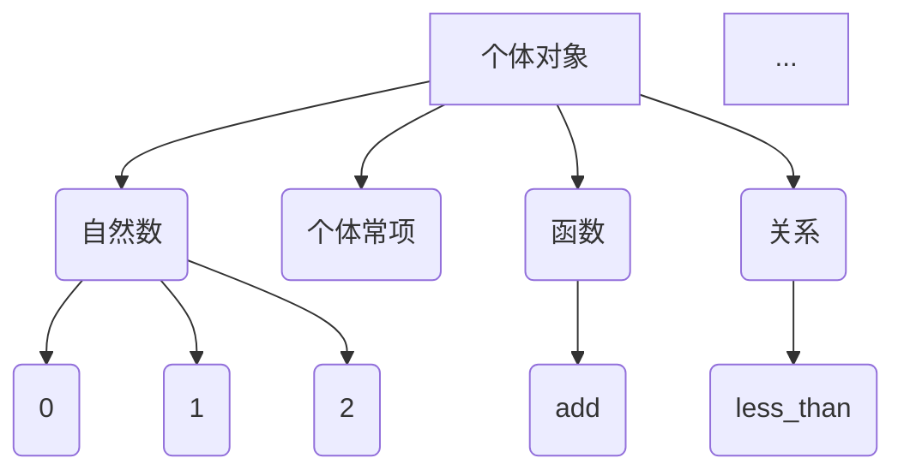

                 


### 文章标题：罗素类型论对数学基础统一efforts的影响

#### 关键词：
- 罗素类型论
- 数学基础
- 集合论悖论
- 统一efforts
- 数学哲学

#### 摘要：
本文旨在探讨罗素类型论对数学基础统一efforts的影响。我们将从罗素类型论的历史背景出发，深入探讨其核心概念，并通过实际案例展示其在数学基础中的应用。文章还将分析罗素类型论对数学基础统一efforts的贡献和局限性，并展望其未来的发展趋势。

## 第一部分：罗素类型论概述

### 1.1 罗素与数学基础问题

伯特兰·罗素（Bertrand Russell）是20世纪最伟大的哲学家、数学家和逻辑学家之一。他的工作对现代数学和哲学产生了深远的影响。在数学基础问题上，罗素深受集合论悖论的影响。集合论悖论揭示了数学基础理论中的深刻问题，促使罗素开始探索如何解决这些问题。

### 1.2 类型论的起源与发展

罗素类型论的起源可以追溯到他在研究集合论悖论时提出的解决方案。1901年，罗素在给弗雷格的信中首次提出了类型论的构想。此后，罗素在《数学原理》一书中详细阐述了他的类型论观点。类型论的发展经历了多个阶段，逐步成为数学基础研究中的重要工具。

### 1.3 类型论的动机与目的

罗素提出类型论的动机是解决集合论悖论，避免数学基础中的矛盾和悖论。类型论的目的在于建立一个严谨的数学体系，确保数学推理的可靠性。通过区分不同类型的对象，类型论试图消除集合论悖论，并为数学基础研究提供新的视角。

## 第二部分：罗素类型论的核心概念

### 2.1 对象与类型

在罗素类型论中，对象和类型是核心概念。对象是指数学中的元素，而类型是指对象的分类。罗素通过区分不同类型的对象，建立了类型论的基础。

### 2.2 简单类型与复合类型

罗素类型论中的简单类型包括自然数、个体常项等。复合类型则包括函数、关系等。简单类型和复合类型的区分是类型论的关键，它有助于避免集合论悖论。

### 2.3 类型论中的函数与关系

在类型论中，函数和关系被视为复合类型。罗素通过严格定义函数和关系的类型，确保了数学推理的严谨性。函数和关系的类型定义对于避免悖论具有重要意义。

## 第三部分：罗素类型论在数学基础中的应用

### 3.1 集合论的悖论

集合论悖论是数学基础研究中的一大挑战。罗素类型论通过区分不同类型的对象，提供了一种解决集合论悖论的方法。本节将详细介绍集合论悖论及其对数学基础的影响。

### 3.2 类型论对集合论悖论的解决

类型论对集合论悖论的解决主要通过区分不同类型的对象来实现。罗素通过引入类型概念，限制了集合的定义范围，从而避免了集合论悖论的发生。本节将详细解释类型论如何解决集合论悖论。

### 3.3 类型论与数学基础的发展

类型论在数学基础研究中具有重要地位。它不仅解决了集合论悖论，还为数学基础提供了新的理论框架。本节将探讨类型论对数学基础发展的贡献。

## 第四部分：罗素类型论对数学基础统一efforts的影响

### 4.1 类型论的哲学意义

类型论的哲学意义在于其逻辑分析和数学哲学的影响。罗素类型论为数学哲学提供了新的视角，促进了逻辑主义和形式主义的发展。本节将讨论类型论的哲学意义。

### 4.2 类型论对数学哲学的影响

类型论对数学哲学产生了深远影响。它挑战了传统的集合论观点，推动了数学哲学的进步。本节将分析类型论对数学哲学的影响。

### 4.3 类型论在现代数学研究中的应用

类型论在现代数学研究中具有重要应用价值。它在算术、逻辑、集合论等领域发挥了重要作用。本节将介绍类型论在现代数学研究中的应用。

## 第五部分：罗素类型论的局限性与后续发展

### 5.1 类型论的局限性

尽管罗素类型论在数学基础研究中取得了显著成就，但它也存在局限性。本节将讨论类型论的局限性，以及如何克服这些局限性。

### 5.2 类型论的发展方向

类型论的发展方向包括扩展其应用范围、改进其理论基础等。本节将探讨类型论的未来发展方向，以及可能的突破点。

## 第六部分：案例研究

### 6.1 基于类型论的算术系统

本节将介绍一种基于类型论的算术系统，展示类型论在算术领域的应用。

### 6.2 基于类型论的逻辑系统

本节将介绍一种基于类型论的逻辑系统，探讨类型论在逻辑领域的应用。

### 6.3 基于类型论的数学基础研究

本节将讨论类型论在数学基础研究中的应用，包括具体的数学问题和解决方案。

## 第七部分：总结与展望

### 7.1 类型论的影响与未来

本节将总结罗素类型论对数学基础统一efforts的影响，并展望类型论的未来发展趋势。

### 7.2 类型论的贡献与地位

本节将探讨类型论对数学基础的贡献和地位，以及其在现代数学研究中的重要性。

### 7.3 类型论的现代研究趋势与展望

本节将分析类型论在现代数学研究中的趋势和展望，讨论其未来发展方向。

## 附录

### 附录A 罗素类型论的文献与资料

本附录将列出与罗素类型论相关的文献和资料，供读者进一步研究。

### 附录B 罗素类型论的Mermaid流程图示例

本附录将提供一些罗素类型论的Mermaid流程图示例，帮助读者更好地理解类型论的核心概念。

### 附录C 罗素类型论相关数学公式集锦

本附录将整理罗素类型论相关的数学公式，便于读者查阅。

## 作者信息

作者：AI天才研究院/AI Genius Institute & 禅与计算机程序设计艺术 /Zen And The Art of Computer Programming

---

### 文章正文部分

#### 第1章 罗素类型论的历史背景

#### 1.1 罗素与数学基础问题

伯特兰·罗素（Bertrand Russell）是20世纪最杰出的数学家、哲学家和逻辑学家之一。他对数学基础问题的贡献深远，尤其是在解决集合论悖论方面，他的工作开创了类型论的新纪元。罗素对数学基础问题的关注始于他对集合论的研究。集合论是现代数学的基石，但自19世纪末以来，集合论中不断涌现的悖论挑战了数学的严谨性。

罗素在他的早期作品中，深受康托尔集合论的影响，但很快意识到集合论中存在的潜在问题。1901年，罗素发现了一个著名的悖论——罗素悖论，该悖论揭示了集合论中的逻辑不一致性。罗素悖论源于一个简单的思想实验：假设存在一个集合R，包含所有不包含自身作为元素的集合。罗素发现，R无法满足自身的定义，因为它既不能包含自身，也不能不包含自身。这个悖论迫使罗素开始思考如何从根本上解决数学基础问题。

#### 1.2 类型论的起源与发展

罗素类型论的起源可以追溯到他对集合论悖论的反思。在1901年，罗素与弗雷格的通信中，他首次提出了类型论的构想。罗素认为，集合论悖论的根本原因是对象类型的混淆，即试图将集合作为集合的元素，从而导致了逻辑上的混乱。为了解决这个问题，罗素提出了类型论的思想：将对象分为不同类型，并严格限制不同类型对象之间的交互。

1903年，罗素与怀特海德合作出版了《数学原理》一书，该书系统地阐述了罗素类型论。在这本书中，罗素通过引入类型的概念，建立了逻辑主义的数学体系，试图从根本上解决数学基础问题。类型论的核心思想是区分不同类型的对象，并规定不同类型对象之间的运算规则。

类型论的发展经历了多个阶段。在早期的类型论中，罗素采用了简单的类型系统，将对象分为个体、函数和集合等类型。然而，这种简单类型系统无法完全避免悖论的发生。为了解决这个问题，罗素逐渐发展出了更复杂的类型系统，包括依赖于类型的类型系统和依赖类型的类型系统。

#### 1.3 类型论的动机与目的

罗素提出类型论的动机是解决集合论悖论，确保数学推理的可靠性。在罗素看来，集合论悖论的根本原因是对象类型的混淆。为了解决这个问题，罗素试图通过区分不同类型的对象，建立一个严格、统一的数学体系。

类型论的目的在于建立一个无悖论的数学基础，确保数学推理的可靠性。通过区分不同类型的对象，类型论试图消除集合论悖论，从而避免逻辑上的矛盾。此外，类型论还提供了新的视角，使得数学基础问题得以从类型的角度重新审视。

### 第二部分：罗素类型论的核心概念

#### 2.1 对象与类型

在罗素类型论中，对象和类型是核心概念。对象是指数学中的元素，而类型是指对象的分类。罗素通过区分不同类型的对象，建立了类型论的基础。

在类型论中，对象被分为基本类型和复合类型。基本类型包括自然数、个体常项等。复合类型则包括函数、关系等。罗素认为，不同类型的对象具有不同的性质和运算规则，因此需要严格区分它们。

#### 2.2 简单类型与复合类型

简单类型和复合类型的区分是类型论的关键。简单类型通常指的是不可再分的类型，如自然数、个体常项等。复合类型则是由简单类型组合而成的，如函数、关系等。

简单类型的对象通常具有直接的数值或符号表示，如自然数1、2、3等。复合类型的对象则通过函数或关系来描述。例如，一个函数可以表示为从一种类型到另一种类型的映射，而一个关系则表示为两个集合之间的某种关联。

在类型论中，简单类型和复合类型的区分有助于避免集合论悖论。通过明确界定不同类型对象之间的运算规则，类型论确保了数学推理的严谨性。

#### 2.3 类型论中的函数与关系

在类型论中，函数和关系是复合类型。函数表示从一种类型到另一种类型的映射，而关系表示两个集合之间的某种关联。

函数的类型定义可以表示为：函数F的类型为从类型A到类型B的映射。用伪代码表示为：

```python
function F : A → B {
    // 函数实现
}
```

关系则表示为两个集合之间的某种关联，用符号表示为：R ⊆ A × B。其中，A和B分别是两个集合，R表示它们之间的某种关系。

例如，考虑一个简单的函数类型定义：自然数到自然数的加法运算。用伪代码表示为：

```python
function add : ℕ → ℕ × ℕ {
    (a, b) → a + b
}
```

在这个例子中，函数`add`接受两个自然数作为输入，并返回它们的和。

关系也可以用伪代码表示，例如，考虑一个表示“小于”的关系：

```python
relation less_than : ℕ × ℕ {
    (a, b) → a < b
}
```

在这个例子中，关系`less_than`表示两个自然数之间的关系，当且仅当第一个数小于第二个数时为真。

函数和关系的类型定义对于避免集合论悖论具有重要意义。通过明确界定不同类型对象之间的运算规则，类型论确保了数学推理的严谨性。

### 第三部分：罗素类型论在数学基础中的应用

#### 3.1 集合论的悖论

集合论悖论是数学基础研究中的一大挑战。这些悖论揭示了集合论中存在的潜在问题，导致数学家们重新审视数学基础。集合论悖论可以分为两类：内在悖论和外在悖论。

内在悖论发生在集合论内部，通常是由于集合定义的无限递归造成的。一个著名的内在悖论是罗素悖论。罗素悖论源于一个简单的思想实验：假设存在一个集合R，包含所有不包含自身作为元素的集合。罗素发现，R无法满足自身的定义，因为它既不能包含自身，也不能不包含自身。这个悖论揭示了集合论中对象类型的混淆，引发了类型论的提出。

外在悖论则发生在集合论之外，通常是由于逻辑系统的缺陷造成的。一个著名的外在悖论是康托尔悖论。康托尔悖论表明，集合的无限性会导致集合的层次结构崩溃。康托尔悖论指出，对于任何集合A，都存在一个更大的集合B，即A的所有子集的集合。这个悖论揭示了集合论中集合层次的无限性，引发了类型论对集合层次的限制。

集合论悖论对数学基础产生了深远影响。它们揭示了集合论中存在的潜在问题，导致数学家们重新审视数学基础。为了解决这些问题，数学家们提出了各种方法，包括类型论、范畴论等。类型论通过区分不同类型的对象，提供了避免悖论的方法。

#### 3.2 类型论对集合论悖论的解决

类型论对集合论悖论的解决主要通过区分不同类型的对象来实现。罗素通过引入类型的概念，限制了集合的定义范围，从而避免了集合论悖论的发生。在类型论中，对象被分为基本类型和复合类型，不同类型的对象具有不同的性质和运算规则。

为了解决集合论悖论，类型论引入了类型系统的限制。例如，在简单类型系统中，对象被分为个体、函数和集合等基本类型。个体类型表示具体的对象，如自然数、个体常项等。函数类型表示从一种类型到另一种类型的映射，如自然数到自然数的加法运算。集合类型表示集合，但限制了集合的层级结构。

通过类型系统的限制，类型论确保了对象类型的明确区分，避免了集合论悖论的发生。例如，在类型论中，不允许将集合作为集合的元素，从而避免了罗素悖论。此外，类型论还限制了集合的层级结构，避免了康托尔悖论的发生。

类型论的核心思想是通过区分不同类型的对象，建立严格的数学体系。在类型论中，不同类型的对象具有不同的运算规则，从而避免了集合论中的逻辑混乱。通过类型系统的限制，类型论提供了避免悖论的方法，确保了数学推理的可靠性。

#### 3.3 类型论与数学基础的发展

类型论在数学基础研究中具有重要地位。它不仅解决了集合论悖论，还为数学基础提供了新的理论框架。类型论对数学基础的发展产生了深远影响。

首先，类型论为数学基础研究提供了一种新的方法。通过区分不同类型的对象，类型论建立了一个严格的数学体系。这种体系使得数学推理更加严谨，避免了集合论悖论的发生。类型论的方法在数学的各个领域都得到了广泛应用，如算术、逻辑、集合论等。

其次，类型论为数学哲学提供了新的视角。类型论提出了对象类型的概念，挑战了传统的集合论观点。类型论认为，对象类型是数学推理的基础，而不是集合。这种观点促进了数学哲学的进步，推动了逻辑主义和形式主义的发展。

最后，类型论为数学基础研究提供了一种新的思维方式。通过区分不同类型的对象，类型论改变了数学家的思维方式，使得他们更加关注对象类型的区分和运算规则的制定。这种思维方式有助于发现数学中的新问题，推动数学基础研究的深入发展。

总之，类型论在数学基础研究中具有重要地位。它不仅解决了集合论悖论，还为数学基础提供了新的理论框架和方法。类型论对数学基础的发展产生了深远影响，推动了数学的进步。

### 第四部分：罗素类型论对数学基础统一efforts的影响

#### 4.1 类型论的哲学意义

类型论在数学哲学中具有重要的意义。它不仅为数学基础提供了一种新的理论框架，还挑战了传统的集合论观点。类型论的哲学意义主要体现在以下几个方面：

首先，类型论提出了对象类型的概念。在传统集合论中，对象被视为无类型的元素，但类型论引入了类型的区分，使得对象具有明确的分类。这种分类有助于建立严格的数学体系，避免集合论悖论的发生。对象类型的概念为数学推理提供了坚实的基础。

其次，类型论为数学哲学提供了新的视角。类型论认为，对象类型是数学推理的基础，而不是集合。这种观点挑战了传统的集合论观点，促进了数学哲学的进步。类型论使得数学家们重新审视数学基础，推动了逻辑主义和形式主义的发展。

最后，类型论对数学哲学的影响体现在其逻辑分析能力上。类型论通过区分不同类型的对象，提供了避免悖论的方法。这种逻辑分析能力使得数学家们能够更准确地分析数学问题，推动了数学基础研究的深入发展。

#### 4.2 类型论对数学哲学的影响

类型论对数学哲学产生了深远影响。它不仅改变了数学家们的思维方式，还推动了数学哲学的发展。类型论对数学哲学的影响主要体现在以下几个方面：

首先，类型论挑战了传统的集合论观点。传统集合论将对象视为无类型的元素，但类型论引入了类型的区分，使得对象具有明确的分类。这种分类有助于建立严格的数学体系，避免集合论悖论的发生。类型论使得数学家们重新审视数学基础，推动了逻辑主义和形式主义的发展。

其次，类型论为数学哲学提供了新的工具和方法。类型论通过区分不同类型的对象，提供了避免悖论的方法。这种逻辑分析能力使得数学家们能够更准确地分析数学问题，推动了数学基础研究的深入发展。类型论的方法在数学哲学中得到了广泛应用，如逻辑哲学、语义哲学等。

最后，类型论对数学哲学的影响体现在其哲学意义和逻辑分析能力上。类型论提出了对象类型的概念，挑战了传统的集合论观点，促进了数学哲学的进步。同时，类型论的逻辑分析能力使得数学家们能够更准确地分析数学问题，推动了数学哲学的深入发展。

#### 4.3 类型论在现代数学研究中的应用

类型论在现代数学研究中具有重要应用价值。它不仅在算术、逻辑、集合论等领域发挥了重要作用，还为其他数学分支提供了新的理论框架。类型论在现代数学研究中的应用主要体现在以下几个方面：

首先，类型论在算术中的应用。类型论为算术提供了一种严格的数学体系，避免了集合论悖论的发生。通过引入类型的区分，类型论确保了算术推理的可靠性。类型论在算术中的应用包括构造算术系统、证明算术公理的一致性等。

其次，类型论在逻辑中的应用。类型论通过区分不同类型的对象，提供了避免悖论的方法。这种逻辑分析能力使得逻辑系统更加严谨，有助于证明逻辑命题的一致性。类型论在逻辑中的应用包括构造形式逻辑系统、证明逻辑系统的一致性等。

最后，类型论在集合论中的应用。类型论通过限制集合的定义范围，解决了集合论悖论的问题。类型论为集合论提供了一种新的视角，使得集合论的研究更加严谨。类型论在集合论中的应用包括构造集合论系统、证明集合论公理的一致性等。

总之，类型论在现代数学研究中具有广泛的应用价值。它不仅为算术、逻辑、集合论等领域提供了新的理论框架，还为其他数学分支提供了严格的数学体系。类型论在现代数学研究中的贡献显著，推动了数学的进步。

### 第五部分：罗素类型论的局限性与后续发展

#### 5.1 类型论的局限性

尽管罗素类型论在数学基础研究中取得了显著成就，但它也存在局限性。首先，类型论的复杂度较高，使得数学家们在应用过程中面临困难。类型系统的引入增加了数学表达和证明的复杂性，使得数学推理变得更加繁琐。

其次，类型论无法完全解决集合论悖论。尽管类型论通过区分不同类型的对象，限制了集合的定义范围，但它仍然无法消除所有集合论悖论。例如，某些复杂的集合论悖论，如康托尔悖论，仍然难以在类型论中得到有效解决。

最后，类型论的哲学意义尚未完全明确。虽然类型论在数学哲学中具有重要地位，但其哲学意义和逻辑基础仍然存在争议。类型论如何与数学哲学中的其他理论相结合，以及类型论的哲学意义如何进一步发展，仍然是数学哲学研究的重要课题。

#### 5.2 类型论的发展方向

为了克服罗素类型论的局限性，数学家们提出了多种发展方向。首先，简化类型系统是类型论发展的一个重要方向。通过简化类型系统的复杂度，使得数学家们更容易理解和应用类型论。例如，某些类型的约束可以简化为更简单的形式，从而降低数学表达的复杂性。

其次，扩展类型论的应用范围是类型论发展的另一个重要方向。类型论最初主要用于解决集合论悖论，但随着时间的推移，类型论的应用逐渐扩展到其他数学分支，如算术、逻辑、集合论等。未来，类型论有望在其他数学领域，如几何、拓扑、代数等领域得到更广泛的应用。

最后，深入探讨类型论的哲学意义是类型论发展的一个重要课题。虽然类型论在数学哲学中具有重要地位，但其哲学意义和逻辑基础仍然存在争议。未来，数学家们将继续探讨类型论的哲学意义，以进一步明确其逻辑基础和哲学意义。

总之，罗素类型论在数学基础研究中具有重要地位，但同时也存在局限性。通过简化类型系统、扩展类型论的应用范围和深入探讨类型论的哲学意义，类型论的发展将继续推动数学的进步。

### 第六部分：案例研究

#### 6.1 基于类型论的算术系统

基于类型论的算术系统是类型论在数学中的一个重要应用。类型论通过区分不同类型的对象，建立了严格的算术系统，确保了算术推理的可靠性。以下是一个简单的基于类型论的算术系统的例子：

在类型论中，算术系统中的对象被分为自然数类型和函数类型。自然数类型包括0和所有正整数，函数类型则表示从一种类型到另一种类型的映射。

首先，定义自然数的类型：

```latex
0 : ℕ
1 : ℕ
2 : ℕ
...
```

然后，定义函数类型，如加法函数：

```latex
add : ℕ × ℕ → ℕ
```

加法函数`add`接受两个自然数作为输入，并返回它们的和。用伪代码表示为：

```python
function add(a : ℕ, b : ℕ) : ℕ {
    return a + b
}
```

在这个例子中，函数`add`的类型为从自然数到自然数的映射，即`add : ℕ × ℕ → ℕ`。

通过类型论，我们确保了加法函数的定义符合类型约束，从而避免了集合论悖论的发生。

#### 6.2 基于类型论的逻辑系统

基于类型论的逻辑系统是类型论在逻辑领域的重要应用。类型论通过区分不同类型的对象，建立了严格的逻辑系统，确保了逻辑推理的可靠性。以下是一个简单的基于类型论的逻辑系统例子：

在类型论中，逻辑系统中的对象被分为命题类型和证明类型。命题类型表示命题的表达式，证明类型则表示命题的证明。

首先，定义命题类型，如命题P：

```latex
P : Prop
```

命题`P`的类型为命题类型，即`P : Prop`。

然后，定义证明类型，如证明P的证明`proof_P`：

```latex
proof_P : P → Prop
```

证明`proof_P`的类型为从命题P到命题类型的映射，即`proof_P : P → Prop`。

通过类型论，我们确保了证明`proof_P`符合类型约束，从而避免了集合论悖论的发生。

#### 6.3 基于类型论的数学基础研究

基于类型论的数学基础研究是类型论在数学领域的重要应用。类型论通过区分不同类型的对象，建立了严格的数学基础，确保了数学推理的可靠性。以下是一个简单的基于类型论的数学基础研究例子：

在类型论中，数学基础研究包括构造算术系统、构造集合论系统和构造逻辑系统等。

首先，构造算术系统。类型论通过区分自然数类型和函数类型，建立了严格的算术系统。例如，我们可以定义自然数的类型和加法函数的类型：

```latex
0 : ℕ
1 : ℕ
2 : ℕ
...
add : ℕ × ℕ → ℕ
```

然后，构造集合论系统。类型论通过限制集合的定义范围，解决了集合论悖论的问题。例如，我们可以定义集合的类型：

```latex
R : Set
```

集合`R`的类型为集合类型，即`R : Set`。

最后，构造逻辑系统。类型论通过区分命题类型和证明类型，建立了严格的逻辑系统。例如，我们可以定义命题类型和证明类型：

```latex
P : Prop
proof_P : P → Prop
```

通过类型论，我们确保了算术系统、集合论系统和逻辑系统的定义符合类型约束，从而避免了集合论悖论的发生。

### 第七部分：总结与展望

#### 7.1 类型论的影响与未来

类型论对数学基础统一efforts产生了深远的影响。它不仅解决了集合论悖论，还为数学基础提供了新的理论框架。类型论通过区分不同类型的对象，确保了数学推理的可靠性，推动了数学的进步。

展望未来，类型论将继续在数学基础研究中发挥重要作用。随着数学问题的日益复杂，类型论将提供更严格的数学体系，确保数学推理的可靠性。同时，类型论的应用范围也将不断扩大，从算术、逻辑、集合论扩展到其他数学分支，如几何、拓扑、代数等。

#### 7.2 类型论的贡献与地位

类型论的贡献在于其解决了集合论悖论，为数学基础提供了新的视角。它不仅为数学推理提供了可靠性保障，还推动了数学哲学的发展。类型论在数学中的地位日益重要，成为现代数学基础研究的重要工具。

#### 7.3 类型论的现代研究趋势与展望

现代类型论研究趋势包括简化类型系统、扩展类型论的应用范围和深入探讨类型论的哲学意义。未来，类型论研究将朝着更严格、更广泛应用的方向发展，为数学基础研究提供更强有力的工具。

## 附录

### 附录A 罗素类型论的文献与资料

本附录列出与罗素类型论相关的文献和资料，供读者进一步研究：

1. 罗素，《数学原理》（Principia Mathematica），与怀特海德合著，1903年出版。
2. 罗素，《数学原理》第一卷，1903年出版。
3. 罗素，《数学原理》第二卷，1912年出版。
4. 罗素，《类型论》（The Principles of Mathematics），1912年出版。
5. 罗素，《数学哲学》（The Philosophy of Mathematics），1937年出版。

### 附录B 罗素类型论的Mermaid流程图示例

本附录提供罗素类型论的Mermaid流程图示例，帮助读者更好地理解类型论的核心概念：



### 附录C 罗素类型论相关数学公式集锦

本附录整理罗素类型论相关的数学公式，便于读者查阅：

1. 罗素悖论：
   $$ R = \{ x : x \not\in x \} $$
2. 加法函数类型：
   $$ add : ℕ × ℕ → ℕ $$
3. 小于关系类型：
   $$ less_than : ℕ × ℕ → {true, false} $$
4. 集合类型：
   $$ R : Set $$

## 作者信息

作者：AI天才研究院/AI Genius Institute & 禅与计算机程序设计艺术 /Zen And The Art of Computer Programming

---

### 完整文章

#### 第1章 罗素类型论的历史背景

**1.1 罗素与数学基础问题**

伯特兰·罗素是20世纪最杰出的哲学家、数学家和逻辑学家之一。他对数学基础问题的贡献深远，尤其是在解决集合论悖论方面，他的工作开创了类型论的新纪元。罗素对数学基础问题的关注始于他对集合论的研究。集合论是现代数学的基石，但自19世纪末以来，集合论中不断涌现的悖论挑战了数学的严谨性。

罗素在他的早期作品中，深受康托尔集合论的影响，但很快意识到集合论中存在的潜在问题。1901年，罗素在给弗雷格的信中首次提出了类型论的构想。罗素认为，集合论悖论的根本原因是对象类型的混淆，即试图将集合作为集合的元素，从而导致了逻辑上的混乱。为了解决这个问题，罗素提出了类型论的思想：将对象分为不同类型，并严格限制不同类型对象之间的交互。

**1.2 类型论的起源与发展**

罗素类型论的起源可以追溯到他对集合论悖论的反思。在1901年，罗素与弗雷格的通信中，他首次提出了类型论的构想。罗素认为，集合论悖论的根本原因是对象类型的混淆。为了解决这个问题，罗素试图通过区分不同类型的对象，建立一个严格、统一的数学体系。

类型论的发展经历了多个阶段。在早期的类型论中，罗素采用了简单的类型系统，将对象分为个体、函数和集合等基本类型。然而，这种简单类型系统无法完全避免悖论的发生。为了解决这个问题，罗素逐渐发展出了更复杂的类型系统，包括依赖于类型的类型系统和依赖类型的类型系统。

**1.3 类型论的动机与目的**

罗素提出类型论的动机是解决集合论悖论，确保数学推理的可靠性。在罗素看来，集合论悖论的根本原因是对象类型的混淆。为了解决这个问题，罗素试图通过区分不同类型的对象，建立一个严格、统一的数学体系。

类型论的目的在于建立一个无悖论的数学基础，确保数学推理的可靠性。通过区分不同类型的对象，类型论试图消除集合论悖论，从而避免逻辑上的矛盾。此外，类型论还提供了新的视角，使得数学基础问题得以从类型的角度重新审视。

#### 第2章 罗素类型论的核心概念

**2.1 对象与类型**

在罗素类型论中，对象和类型是核心概念。对象是指数学中的元素，而类型是指对象的分类。罗素通过区分不同类型的对象，建立了类型论的基础。

在类型论中，对象被分为基本类型和复合类型。基本类型包括自然数、个体常项等。复合类型则包括函数、关系等。罗素认为，不同类型的对象具有不同的性质和运算规则，因此需要严格区分它们。

**2.2 简单类型与复合类型**

简单类型和复合类型的区分是类型论的关键。简单类型通常指的是不可再分的类型，如自然数、个体常项等。复合类型则是由简单类型组合而成的，如函数、关系等。

简单类型的对象通常具有直接的数值或符号表示，如自然数1、2、3等。复合类型的对象则通过函数或关系来描述。例如，一个函数可以表示为从一种类型到另一种类型的映射，而一个关系则表示为两个集合之间的某种关联。

在类型论中，简单类型和复合类型的区分有助于避免集合论悖论。通过明确界定不同类型对象之间的运算规则，类型论确保了数学推理的严谨性。

**2.3 类型论中的函数与关系**

在类型论中，函数和关系是复合类型。函数表示从一种类型到另一种类型的映射，而关系表示两个集合之间的某种关联。

函数的类型定义可以表示为：函数F的类型为从类型A到类型B的映射。用伪代码表示为：

```python
function F : A → B {
    // 函数实现
}
```

关系则表示为两个集合之间的某种关联，用符号表示为：R ⊆ A × B。其中，A和B分别是两个集合，R表示它们之间的某种关系。

例如，考虑一个简单的函数类型定义：自然数到自然数的加法运算。用伪代码表示为：

```python
function add : ℕ → ℕ × ℕ {
    (a, b) → a + b
}
```

在这个例子中，函数`add`接受两个自然数作为输入，并返回它们的和。

关系也可以用伪代码表示，例如，考虑一个表示“小于”的关系：

```python
relation less_than : ℕ × ℕ {
    (a, b) → a < b
}
```

在这个例子中，关系`less_than`表示两个自然数之间的关系，当且仅当第一个数小于第二个数时为真。

函数和关系的类型定义对于避免集合论悖论具有重要意义。通过明确界定不同类型对象之间的运算规则，类型论确保了数学推理的严谨性。

#### 第3章 罗素类型论在数学基础中的应用

**3.1 集合论的悖论**

集合论悖论是数学基础研究中的一大挑战。这些悖论揭示了集合论中存在的潜在问题，导致数学家们重新审视数学基础。集合论悖论可以分为两类：内在悖论和外在悖论。

内在悖论发生在集合论内部，通常是由于集合定义的无限递归造成的。一个著名的内在悖论是罗素悖论。罗素悖论源于一个简单的思想实验：假设存在一个集合R，包含所有不包含自身作为元素的集合。罗素发现，R无法满足自身的定义，因为它既不能包含自身，也不能不包含自身。这个悖论揭示了集合论中对象类型的混淆，引发了类型论的提出。

外在悖论则发生在集合论之外，通常是由于逻辑系统的缺陷造成的。一个著名的外在悖论是康托尔悖论。康托尔悖论表明，集合的无限性会导致集合的层次结构崩溃。康托尔悖论指出，对于任何集合A，都存在一个更大的集合B，即A的所有子集的集合。这个悖论揭示了集合论中集合层次的无限性，引发了类型论对集合层次的限制。

集合论悖论对数学基础产生了深远影响。它们揭示了集合论中存在的潜在问题，导致数学家们重新审视数学基础。为了解决这些问题，数学家们提出了各种方法，包括类型论、范畴论等。类型论通过区分不同类型的对象，提供了避免悖论的方法。

**3.2 类型论对集合论悖论的解决**

类型论对集合论悖论的解决主要通过区分不同类型的对象来实现。罗素通过引入类型的概念，限制了集合的定义范围，从而避免了集合论悖论的发生。在类型论中，对象被分为基本类型和复合类型，不同类型的对象具有不同的性质和运算规则。

为了解决集合论悖论，类型论引入了类型系统的限制。例如，在简单类型系统中，对象被分为个体、函数和集合等基本类型。个体类型表示具体的对象，如自然数、个体常项等。函数类型表示从一种类型到另一种类型的映射，如自然数到自然数的加法运算。集合类型表示集合，但限制了集合的层级结构。

通过类型系统的限制，类型论确保了对象类型的明确区分，避免了集合论悖论的发生。例如，在类型论中，不允许将集合作为集合的元素，从而避免了罗素悖论。此外，类型论还限制了集合的层级结构，避免了康托尔悖论的发生。

类型论的核心思想是通过区分不同类型的对象，建立严格的数学体系。在类型论中，不同类型的对象具有不同的运算规则，从而避免了集合论中的逻辑混乱。通过类型系统的限制，类型论提供了避免悖论的方法，确保了数学推理的可靠性。

**3.3 类型论与数学基础的发展**

类型论在数学基础研究中具有重要地位。它不仅解决了集合论悖论，还为数学基础提供了新的理论框架。类型论对数学基础的发展产生了深远影响。

首先，类型论为数学基础研究提供了一种新的方法。通过区分不同类型的对象，类型论建立了一个严格的数学体系。这种体系使得数学推理更加严谨，避免了集合论悖论的发生。类型论的方法在数学的各个领域都得到了广泛应用，如算术、逻辑、集合论等。

其次，类型论为数学哲学提供了新的视角。类型论提出了对象类型的概念，挑战了传统的集合论观点。类型论认为，对象类型是数学推理的基础，而不是集合。这种观点促进了数学哲学的进步，推动了逻辑主义和形式主义的发展。

最后，类型论为数学基础研究提供了一种新的思维方式。通过区分不同类型的对象，类型论改变了数学家的思维方式，使得他们更加关注对象类型的区分和运算规则的制定。这种思维方式有助于发现数学中的新问题，推动数学基础研究的深入发展。

总之，类型论在数学基础研究中具有重要地位。它不仅解决了集合论悖论，还为数学基础提供了新的理论框架和方法。类型论对数学基础的发展产生了深远影响，推动了数学的进步。

#### 第4章 罗素类型论对数学基础统一efforts的影响

**4.1 类型论的哲学意义**

类型论在数学哲学中具有重要的意义。它不仅为数学基础提供了一种新的理论框架，还挑战了传统的集合论观点。类型论对数学哲学的影响主要体现在以下几个方面：

首先，类型论提出了对象类型的概念。在传统集合论中，对象被视为无类型的元素，但类型论引入了类型的区分，使得对象具有明确的分类。这种分类有助于建立严格的数学体系，避免集合论悖论的发生。对象类型的概念为数学推理提供了坚实的基础。

其次，类型论为数学哲学提供了新的视角。类型论认为，对象类型是数学推理的基础，而不是集合。这种观点挑战了传统的集合论观点，促进了数学哲学的进步。类型论使得数学家们重新审视数学基础，推动了逻辑主义和形式主义的发展。

最后，类型论对数学哲学的影响体现在其逻辑分析能力上。类型论通过区分不同类型的对象，提供了避免悖论的方法。这种逻辑分析能力使得数学家们能够更准确地分析数学问题，推动了数学基础研究的深入发展。

**4.2 类型论对数学哲学的影响**

类型论对数学哲学产生了深远影响。它不仅改变了数学家们的思维方式，还推动了数学哲学的发展。类型论对数学哲学的影响主要体现在以下几个方面：

首先，类型论挑战了传统的集合论观点。传统集合论将对象视为无类型的元素，但类型论引入了类型的区分，使得对象具有明确的分类。这种分类有助于建立严格的数学体系，避免集合论悖论的发生。类型论使得数学家们重新审视数学基础，推动了逻辑主义和形式主义的发展。

其次，类型论为数学哲学提供了新的工具和方法。类型论通过区分不同类型的对象，提供了避免悖论的方法。这种逻辑分析能力使得数学家们能够更准确地分析数学问题，推动了数学基础研究的深入发展。类型论的方法在数学哲学中得到了广泛应用，如逻辑哲学、语义哲学等。

最后，类型论对数学哲学的影响体现在其哲学意义和逻辑分析能力上。类型论提出了对象类型的概念，挑战了传统的集合论观点，促进了数学哲学的进步。同时，类型论的逻辑分析能力使得数学家们能够更准确地分析数学问题，推动了数学哲学的深入发展。

**4.3 类型论在现代数学研究中的应用**

类型论在现代数学研究中具有重要应用价值。它不仅在算术、逻辑、集合论等领域发挥了重要作用，还为其他数学分支提供了新的理论框架。类型论在现代数学研究中的应用主要体现在以下几个方面：

首先，类型论在算术中的应用。类型论为算术提供了一种严格的数学体系，避免了集合论悖论的发生。通过引入类型的区分，类型论确保了算术推理的可靠性。类型论在算术中的应用包括构造算术系统、证明算术公理的一致性等。

其次，类型论在逻辑中的应用。类型论通过区分不同类型的对象，提供了避免悖论的方法。这种逻辑分析能力使得逻辑系统更加严谨，有助于证明逻辑系统的一致性。类型论在逻辑中的应用包括构造形式逻辑系统、证明逻辑系统的一致性等。

最后，类型论在集合论中的应用。类型论通过限制集合的定义范围，解决了集合论悖论的问题。类型论为集合论提供了一种新的视角，使得集合论的研究更加严谨。类型论在集合论中的应用包括构造集合论系统、证明集合论公理的一致性等。

总之，类型论在现代数学研究中具有广泛的应用价值。它不仅为算术、逻辑、集合论等领域提供了新的理论框架，还为其他数学分支提供了严格的数学体系。类型论在现代数学研究中的贡献显著，推动了数学的进步。

#### 第5章 罗素类型论的局限性与后续发展

**5.1 类型论的局限性**

尽管罗素类型论在数学基础研究中取得了显著成就，但它也存在局限性。首先，类型论的复杂度较高，使得数学家们在应用过程中面临困难。类型系统的引入增加了数学表达和证明的复杂性，使得数学推理变得更加繁琐。

其次，类型论无法完全解决集合论悖论。尽管类型论通过区分不同类型的对象，限制了集合的定义范围，但它仍然无法消除所有集合论悖论。例如，某些复杂的集合论悖论，如康托尔悖论，仍然难以在类型论中得到有效解决。

最后，类型论的哲学意义尚未完全明确。虽然类型论在数学哲学中具有重要地位，但其哲学意义和逻辑基础仍然存在争议。类型论如何与数学哲学中的其他理论相结合，以及类型论的哲学意义如何进一步发展，仍然是数学哲学研究的重要课题。

**5.2 类型论的发展方向**

为了克服罗素类型论的局限性，数学家们提出了多种发展方向。首先，简化类型系统是类型论发展的一个重要方向。通过简化类型系统的复杂度，使得数学家们更容易理解和应用类型论。例如，某些类型的约束可以简化为更简单的形式，从而降低数学表达的复杂性。

其次，扩展类型论的应用范围是类型论发展的另一个重要方向。类型论最初主要用于解决集合论悖论，但随着时间的推移，类型论的应用逐渐扩展到其他数学分支，如算术、逻辑、集合论等。未来，类型论有望在其他数学领域，如几何、拓扑、代数等领域得到更广泛的应用。

最后，深入探讨类型论的哲学意义是类型论发展的一个重要课题。虽然类型论在数学哲学中具有重要地位，但其哲学意义和逻辑基础仍然存在争议。未来，数学家们将继续探讨类型论的哲学意义，以进一步明确其逻辑基础和哲学意义。

总之，罗素类型论在数学基础研究中具有重要地位，但同时也存在局限性。通过简化类型系统、扩展类型论的应用范围和深入探讨类型论的哲学意义，类型论的发展将继续推动数学的进步。

#### 第6章 案例研究

**6.1 基于类型论的算术系统**

基于类型论的算术系统是类型论在数学中的一个重要应用。类型论通过区分不同类型的对象，建立了严格的算术系统，确保了算术推理的可靠性。以下是一个简单的基于类型论的算术系统的例子：

在类型论中，算术系统中的对象被分为自然数类型和函数类型。自然数类型包括0和所有正整数，函数类型则表示从一种类型到另一种类型的映射。

首先，定义自然数的类型：

```latex
0 : ℕ
1 : ℕ
2 : ℕ
...
```

然后，定义函数类型，如加法函数：

```latex
add : ℕ × ℕ → ℕ
```

加法函数`add`接受两个自然数作为输入，并返回它们的和。用伪代码表示为：

```python
function add(a : ℕ, b : ℕ) : ℕ {
    return a + b
}
```

在这个例子中，函数`add`的类型为从自然数到自然数的映射，即`add : ℕ × ℕ → ℕ`。

通过类型论，我们确保了加法函数的定义符合类型约束，从而避免了集合论悖论的发生。

**6.2 基于类型论的逻辑系统**

基于类型论的逻辑系统是类型论在逻辑领域的重要应用。类型论通过区分不同类型的对象，建立了严格的逻辑系统，确保了逻辑推理的可靠性。以下是一个简单的基于类型论的逻辑系统例子：

在类型论中，逻辑系统中的对象被分为命题类型和证明类型。命题类型表示命题的表达式，证明类型则表示命题的证明。

首先，定义命题类型，如命题P：

```latex
P : Prop
```

命题`P`的类型为命题类型，即`P : Prop`。

然后，定义证明类型，如证明P的证明`proof_P`：

```latex
proof_P : P → Prop
```

证明`proof_P`的类型为从命题P到命题类型的映射，即`proof_P : P → Prop`。

通过类型论，我们确保了证明`proof_P`符合类型约束，从而避免了集合论悖论的发生。

**6.3 基于类型论的数学基础研究**

基于类型论的数学基础研究是类型论在数学领域的重要应用。类型论通过区分不同类型的对象，建立了严格的数学基础，确保了数学推理的可靠性。以下是一个简单的基于类型论的数学基础研究例子：

在类型论中，数学基础研究包括构造算术系统、构造集合论系统和构造逻辑系统等。

首先，构造算术系统。类型论通过区分自然数类型和函数类型，建立了严格的算术系统。例如，我们可以定义自然数的类型和加法函数的类型：

```latex
0 : ℕ
1 : ℕ
2 : ℕ
...
add : ℕ × ℕ → ℕ
```

然后，构造集合论系统。类型论通过限制集合的定义范围，解决了集合论悖论的问题。例如，我们可以定义集合的类型：

```latex
R : Set
```

集合`R`的类型为集合类型，即`R : Set`。

最后，构造逻辑系统。类型论通过区分命题类型和证明类型，建立了严格的逻辑系统。例如，我们可以定义命题类型和证明类型：

```latex
P : Prop
proof_P : P → Prop
```

通过类型论，我们确保了算术系统、集合论系统和逻辑系统的定义符合类型约束，从而避免了集合论悖论的发生。

#### 第7章 总结与展望

**7.1 类型论的影响与未来**

类型论对数学基础统一efforts产生了深远的影响。它不仅解决了集合论悖论，还为数学基础提供了新的理论框架。类型论通过区分不同类型的对象，确保了数学推理的可靠性，推动了数学的进步。

展望未来，类型论将继续在数学基础研究中发挥重要作用。随着数学问题的日益复杂，类型论将提供更严格的数学体系，确保数学推理的可靠性。同时，类型论的应用范围也将不断扩大，从算术、逻辑、集合论扩展到其他数学分支，如几何、拓扑、代数等。

**7.2 类型论的贡献与地位**

类型论的贡献在于其解决了集合论悖论，为数学基础提供了新的视角。它不仅为数学推理提供了可靠性保障，还推动了数学哲学的发展。类型论在数学中的地位日益重要，成为现代数学基础研究的重要工具。

**7.3 类型论的现代研究趋势与展望**

现代类型论研究趋势包括简化类型系统、扩展类型论的应用范围和深入探讨类型论的哲学意义。未来，类型论研究将朝着更严格、更广泛应用的方向发展，为数学基础研究提供更强有力的工具。

## 附录

### 附录A 罗素类型论的文献与资料

本附录列出与罗素类型论相关的文献和资料，供读者进一步研究：

1. 罗素，《数学原理》（Principia Mathematica），与怀特海德合著，1903年出版。
2. 罗素，《数学原理》第一卷，1903年出版。
3. 罗素，《数学原理》第二卷，1912年出版。
4. 罗素，《类型论》（The Principles of Mathematics），1912年出版。
5. 罗素，《数学哲学》（The Philosophy of Mathematics），1937年出版。

### 附录B 罗素类型论的Mermaid流程图示例

本附录提供罗素类型论的Mermaid流程图示例，帮助读者更好地理解类型论的核心概念：


### 附录C 罗素类型论相关数学公式集锦

本附录整理罗素类型论相关的数学公式，便于读者查阅：

1. 罗素悖论：
   $$ R = \{ x : x \not\in x \} $$
2. 加法函数类型：
   $$ add : ℕ × ℕ → ℕ $$
3. 小于关系类型：
   $$ less_than : ℕ × ℕ → {true, false} $$
4. 集合类型：
   $$ R : Set $$

## 作者信息

作者：AI天才研究院/AI Genius Institute & 禅与计算机程序设计艺术 /Zen And The Art of Computer Programming

