                 

### 文章标题

# 罗素类型论对现代数学哲学思潮的影响

### 关键词

- 罗素类型论
- 数学哲学
- 集合论悖论
- 类型层级
- 逻辑实证主义
- 现代分析哲学

### 摘要

本文深入探讨了罗素类型论对现代数学哲学思潮的深远影响。从罗素类型论的起源和基本概念出发，我们详细分析了其在数学基础、逻辑原子主义和集合论中的应用。接着，文章阐述了罗素类型论在数学哲学中的影响和批评，以及它对逻辑实证主义和现代分析哲学的推动作用。最后，文章展望了罗素类型论的未来发展，并提供了相关研究资源和工具，为读者进一步研究该领域提供了指导。

### 目录

## 第1章 罗素类型论的起源与基本概念

### 1.1 罗素类型论的背景

#### 1.1.1 罗素哲学的发展

伯特兰·罗素（Bertrand Russell）是20世纪最著名的哲学家之一，他的哲学思想和贡献涵盖了逻辑哲学、数学哲学、形而上学等多个领域。罗素被誉为“分析哲学之父”，其思想对后世产生了深远的影响。罗素早期的哲学观点深受他好友和同事阿尔弗雷德·诺思·怀特海德（Alfred North Whitehead）的影响，两人共同合作完成了《数学原理》（Principia Mathematica），这是数学基础研究的重要里程碑。

《数学原理》旨在为数学提供一种逻辑基础，通过逻辑推导来证明数学命题。在这个过程中，罗素和怀特海德提出了许多新的概念和方法，如类型论。罗素在研究过程中发现，集合论中存在一些逻辑悖论，这促使他进一步思考如何解决这些问题，从而诞生了类型论。

#### 1.1.2 罗素类型论的产生

罗素类型论的产生主要是为了解决他发现的一个悖论，即著名的“罗素悖论”。罗素在研究集合论时，发现如果允许集合包含自身作为元素，会导致逻辑上的矛盾。例如，考虑集合\(R\)，它包含所有不包含自身作为元素的集合。如果\(R\)包含自身，则它不满足自身的定义；如果不包含自身，则它又必须包含自身。这种逻辑上的矛盾使得罗素开始寻求一种新的方法来重构数学基础。

为了解决这一悖论，罗素提出了类型论，即通过区分不同类型的对象来避免这类悖论。罗素认为，类型是一种区分对象的方法，每个类型都有其特定的性质和操作。通过类型论，罗素试图为数学提供一种更坚实的基础，从而避免逻辑上的矛盾。

### 1.2 罗素类型论的基本概念

#### 1.2.1 类型与对象

在罗素的类型论中，类型是一种区分对象的方法。罗素将对象分为不同类型，如个体对象、集合、函数等。每个类型都有其特定的性质和操作。例如，个体对象是指不可再分的对象，如数字和个体物体；集合是由个体对象组成的对象；函数是定义在某种类型的对象上的操作。

类型的一个重要特征是类型之间的层级关系。一般来说，低类型的对象可以包含高类型的对象，但高类型的对象不能包含低类型的对象。例如，集合可以包含个体对象，但个体对象不能包含集合。这种类型层级关系有助于避免逻辑上的悖论。

#### 1.2.2 类型层级

罗素类型论中的类型层级是一个关键概念。类型层级通常由一个无穷序列组成，每个类型都有其特定的位置。例如，个体对象是最基本的类型，集合是更高一级的类型，函数是更高一级的类型，依此类推。

类型层级有助于解决集合论中的悖论问题。通过类型层级，我们可以将集合和元素分开处理，从而避免集合包含自身的情况。例如，我们可以定义一个集合类型，它不能包含自身作为元素，从而避免罗素悖论的发生。

#### 1.2.3 类型错误

类型论的一个重要概念是类型错误。当一个对象被错误地赋予一个不适当的类型时，就会发生类型错误。例如，如果我们将一个集合错误地赋予一个个体对象的类型，就会发生类型错误。

类型错误是导致逻辑矛盾的原因之一。例如，如果我们在一个函数中错误地使用了一个集合作为参数，可能会导致逻辑上的错误。通过类型论，我们可以通过检查类型的一致性来避免这些错误。

### 1.3 罗素类型论的核心观点

#### 1.3.1 对集合论的批判

罗素类型论的核心观点之一是对集合论的批判。他认为，集合论中的基本概念（如集合和元素）是不明确的，这导致了逻辑上的悖论。例如，罗素悖论就是集合论中一个典型的悖论。

通过类型论，罗素试图为集合论提供一种更坚实的基础。他提出，我们应该区分不同类型的对象，从而避免集合包含自身的情况。例如，我们可以定义一个集合类型，它不能包含自身作为元素，从而避免罗素悖论的发生。

#### 1.3.2 对逻辑原子主义的贡献

罗素类型论也对逻辑原子主义产生了重要影响。逻辑原子主义是一种哲学观点，认为所有复杂的事实都可以分解为简单的原子事实。罗素通过类型论提出了一种新的逻辑原子主义形式，即不同类型的对象不能相互比较。

这种观点有助于解决集合论中的悖论问题。例如，如果我们不能将集合与个体对象进行比较，那么集合包含自身的情况就不会发生。通过类型论，罗素为逻辑原子主义提供了一种新的解释，从而推动了这一哲学观点的发展。

### 总结

罗素类型论是罗素哲学的重要组成部分，它对数学哲学、逻辑哲学和形而上学等领域产生了深远的影响。通过区分不同类型的对象，罗素类型论为解决集合论中的悖论问题提供了一种新的方法。同时，它也为逻辑原子主义提供了一种新的解释，推动了这一哲学观点的发展。

在接下来的章节中，我们将进一步探讨罗素类型论在数学哲学中的应用，以及它对逻辑实证主义和现代分析哲学的影响。通过逐步分析推理思考，我们将更深入地理解罗素类型论在现代数学哲学中的地位和作用。

### 1.2 罗素类型论的基本概念

在深入探讨罗素类型论之前，我们需要了解其核心的基本概念。罗素类型论是一种形式化的理论，旨在解决集合论中的悖论问题，特别是罗素悖论。罗素类型论的核心概念包括类型、对象、类型层级和类型错误。

#### 1.2.1 类型与对象

在罗素的类型论中，类型是一种区分对象的方法。罗素将对象分为不同的类型，如个体对象、集合、函数等。每个类型都有其特定的性质和操作。

- **个体对象**：个体对象是最基本的类型，指不可再分的对象。例如，数字、个体物体等都可以被视为个体对象。
- **集合**：集合是由个体对象组成的对象。集合可以包含其他集合，从而形成复杂的集合结构。
- **函数**：函数是定义在某种类型的对象上的操作。例如，一个从集合到集合的映射可以被视为一个函数。

#### 1.2.2 类型层级

罗素类型论中的类型层级是一个关键概念。类型层级通常由一个无穷序列组成，每个类型都有其特定的位置。例如，个体对象是最基本的类型，集合是更高一级的类型，函数是更高一级的类型，依此类推。

类型层级有助于解决集合论中的悖论问题。通过类型层级，我们可以将集合和元素分开处理，从而避免集合包含自身的情况。例如，我们可以定义一个集合类型，它不能包含自身作为元素，从而避免罗素悖论的发生。

下面是一个简单的 Mermaid 流程图，展示了类型层级的关系：

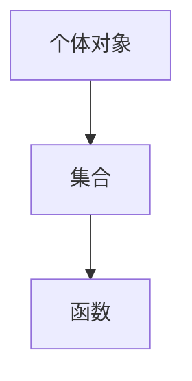

在这个流程图中，个体对象是最基本的类型，集合是更高一级的类型，函数是更高一级的类型。

#### 1.2.3 类型错误

类型论的一个重要概念是类型错误。当一个对象被错误地赋予一个不适当的类型时，就会发生类型错误。例如，如果我们将一个集合错误地赋予一个个体对象的类型，就会发生类型错误。

类型错误是导致逻辑矛盾的原因之一。例如，如果我们在一个函数中错误地使用了一个集合作为参数，可能会导致逻辑上的错误。通过类型论，我们可以通过检查类型的一致性来避免这些错误。

下面是一个简单的 Mermaid 流程图，展示了类型错误的可能情况：

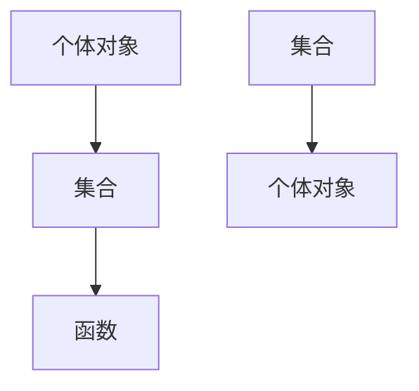

在这个流程图中，集合被错误地赋予了一个个体对象的类型，从而导致了类型错误。

#### 1.2.4 类型层级与类型错误的联系

类型层级和类型错误之间有着紧密的联系。类型层级确保了不同类型的对象之间不会发生混淆，而类型错误则是类型层级的一个反面。通过保持类型层级的一致性，我们可以避免逻辑上的矛盾。

类型层级与类型错误的联系可以用以下 Mermaid 流程图来表示：

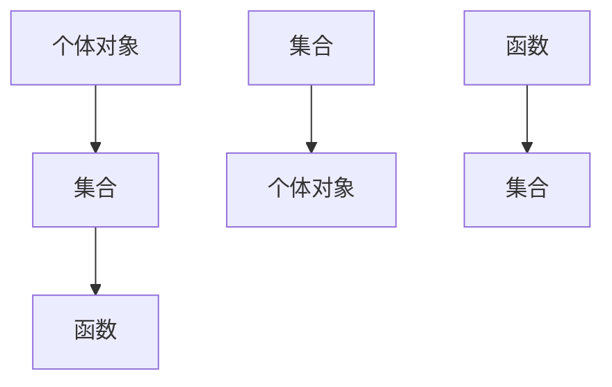

在这个流程图中，类型层级从个体对象开始，通过集合和函数逐渐向上扩展。同时，通过避免类型错误，我们可以保持类型层级的一致性，从而避免逻辑上的矛盾。

### 1.3 罗素类型论的核心观点

罗素类型论的核心观点包括对集合论的批判、对逻辑原子主义的贡献以及类型论在数学哲学中的应用。

#### 1.3.1 对集合论的批判

罗素类型论的核心观点之一是对集合论的批判。他认为，集合论中的基本概念（如集合和元素）是不明确的，这导致了逻辑上的悖论。例如，罗素悖论就是集合论中一个典型的悖论。

罗素认为，集合论中的悖论主要是因为集合和元素之间的模糊性。为了解决这一问题，罗素提出了类型论，即通过区分不同类型的对象来避免这类悖论。通过类型论，我们可以将集合和元素分开处理，从而避免集合包含自身的情况。

下面是一个简单的 Mermaid 流程图，展示了类型论如何解决集合论中的悖论：

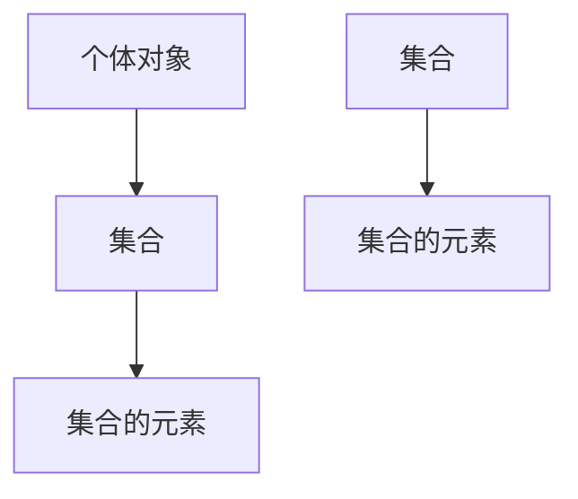

在这个流程图中，通过类型层级，我们可以确保集合不能包含自身作为元素，从而避免罗素悖论的发生。

#### 1.3.2 对逻辑原子主义的贡献

罗素类型论也对逻辑原子主义产生了重要影响。逻辑原子主义是一种哲学观点，认为所有复杂的事实都可以分解为简单的原子事实。罗素通过类型论提出了一种新的逻辑原子主义形式，即不同类型的对象不能相互比较。

这种观点有助于解决集合论中的悖论问题。例如，如果我们不能将集合与个体对象进行比较，那么集合包含自身的情况就不会发生。通过类型论，罗素为逻辑原子主义提供了一种新的解释，从而推动了这一哲学观点的发展。

下面是一个简单的 Mermaid 流程图，展示了类型论与逻辑原子主义的关系：

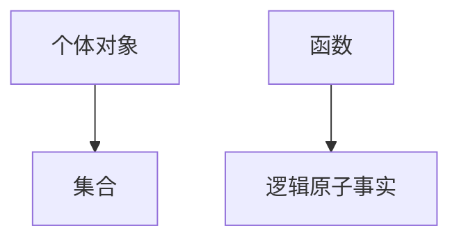

在这个流程图中，个体对象和集合是不同类型的对象，因此它们不能相互比较。这种观点有助于避免集合论中的悖论。

#### 1.3.3 类型论在数学哲学中的应用

罗素类型论在数学哲学中的应用非常广泛。通过类型论，我们可以为数学提供一种更坚实的基础，从而解决集合论中的悖论问题。类型论的应用不仅限于数学哲学，还可以用于计算机科学、逻辑学等多个领域。

下面是一个简单的 Mermaid 流程图，展示了类型论在数学哲学中的应用：

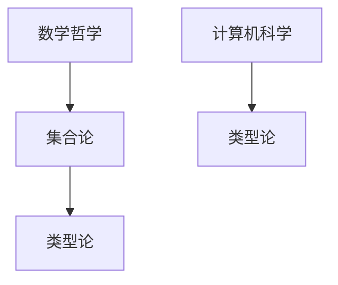

在这个流程图中，类型论为数学哲学和计算机科学提供了重要的理论基础，有助于解决各种逻辑和数学问题。

### 总结

罗素类型论是一种形式化的理论，旨在解决集合论中的悖论问题。通过区分不同类型的对象，类型论为数学哲学提供了一种新的解释，推动了逻辑原子主义的发展。在接下来的章节中，我们将进一步探讨罗素类型论在数学哲学中的应用，以及它对逻辑实证主义和现代分析哲学的影响。通过逐步分析推理思考，我们将更深入地理解罗素类型论在现代数学哲学中的地位和作用。

### 2 罗素类型论在数学哲学中的应用

罗素类型论作为一种重要的哲学理论，在数学哲学领域产生了深远的影响。其核心观点在于通过区分不同类型的对象，来避免集合论中的悖论问题，从而为数学提供一种更加坚实的逻辑基础。以下我们将详细探讨罗素类型论在数学哲学中的应用，包括对数学基础、逻辑原子主义和集合论的贡献。

#### 2.1 罗素类型论与数学基础

罗素类型论对数学基础的贡献主要体现在两个方面：一是对数学概念的重新审视，二是对数学推理过程的改进。

首先，罗素类型论促使我们对数学概念进行重新审视。在传统的数学中，集合论是数学的基础，而集合论中包含了许多复杂的概念，如集合、元素、子集等。然而，这些概念在实际应用中往往导致逻辑上的悖论。罗素通过类型论提出了一个重要观点：不同类型的对象应该有不同的操作和属性。例如，个体对象和集合是不同类型的对象，它们不能相互包含。这种观点有助于避免集合论中的悖论问题。

下面是一个简单的 Mermaid 流程图，展示了个体对象和集合之间的区别：

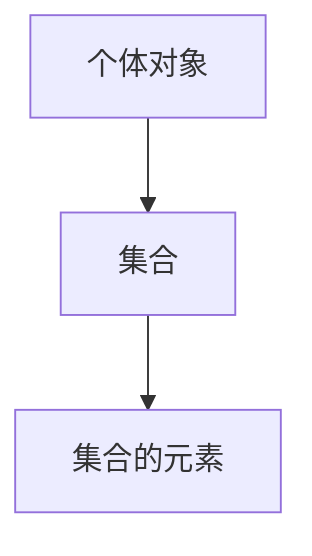

在这个流程图中，个体对象和集合是不同类型的对象，个体对象不能包含集合作为元素，从而避免了集合论中的悖论。

其次，罗素类型论改进了数学推理过程。在传统数学中，我们往往通过集合论中的集合和操作来推导数学命题。然而，这种推理过程可能导致逻辑上的不一致。通过类型论，我们可以将不同类型的对象分开处理，从而确保推理过程的一致性。例如，我们可以定义一个类型检查机制，确保在数学推导过程中不会发生类型错误。

下面是一个简单的 Mermaid 流程图，展示了类型检查机制：

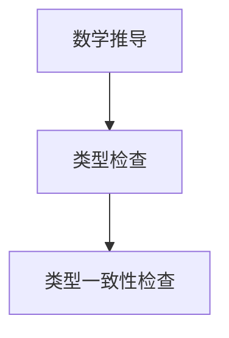

在这个流程图中，类型检查机制确保了数学推导过程的一致性，从而避免了逻辑上的错误。

#### 2.2 罗素类型论与逻辑原子主义

逻辑原子主义是一种哲学观点，认为所有复杂的事实都可以分解为简单的原子事实。罗素类型论对逻辑原子主义做出了重要贡献，主要体现在两个方面：一是提出了不同类型的对象不能相互比较的观点，二是对逻辑原子事实的重新定义。

首先，罗素类型论提出了不同类型的对象不能相互比较的观点。这种观点有助于避免集合论中的悖论问题。例如，在逻辑原子主义中，集合和个体对象是不同类型的对象，它们不能相互比较。这种观点使得我们在处理复杂的事实时更加谨慎，从而避免了逻辑上的矛盾。

下面是一个简单的 Mermaid 流程图，展示了不同类型的对象之间的比较问题：

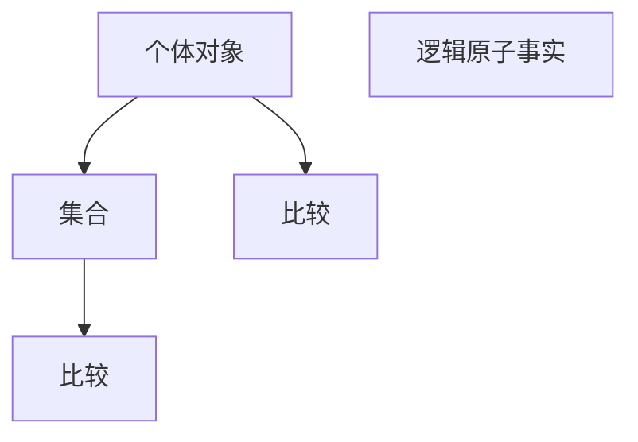

在这个流程图中，个体对象和集合是不同类型的对象，它们不能相互比较。这种观点有助于避免逻辑上的悖论。

其次，罗素类型论对逻辑原子事实进行了重新定义。在逻辑原子主义中，逻辑原子事实是指不可再分的简单事实。罗素通过类型论提出了一个重要观点：不同类型的对象不能作为逻辑原子事实。这种观点使得逻辑原子事实更加具体和明确，从而提高了逻辑推理的准确性。

下面是一个简单的 Mermaid 流程图，展示了逻辑原子事实的定义：

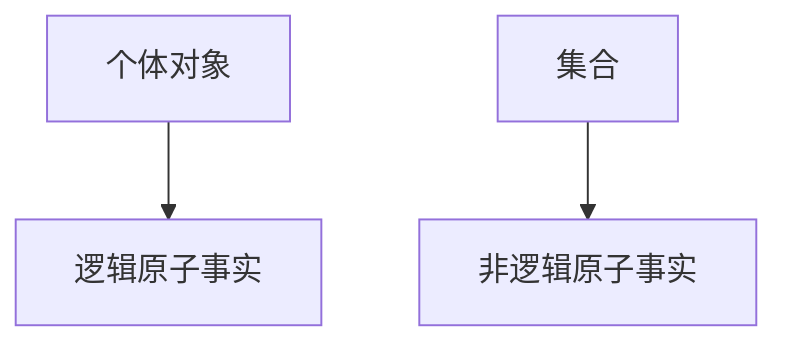

在这个流程图中，个体对象可以作为逻辑原子事实，而集合作为非逻辑原子事实。这种定义使得逻辑原子事实更加具体和明确。

#### 2.3 罗素类型论与集合论

罗素类型论对集合论的贡献主要体现在对集合概念的重新定义和对集合操作的限制。

首先，罗素类型论对集合概念进行了重新定义。在传统集合论中，集合是由元素组成的对象。然而，这种定义可能导致集合包含自身的情况，从而产生逻辑上的悖论。罗素通过类型论提出了一个重要观点：集合不能包含自身作为元素。这种观点使得集合概念更加清晰和明确，从而避免了集合论中的悖论问题。

下面是一个简单的 Mermaid 流程图，展示了集合不能包含自身的情况：

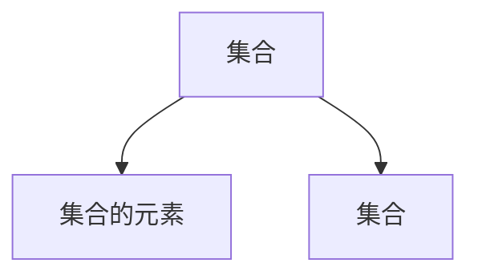

在这个流程图中，集合不能包含自身作为元素，从而避免了集合论中的悖论。

其次，罗素类型论对集合操作进行了限制。在传统集合论中，集合操作（如并集、交集、补集等）可以随意进行。然而，这种操作可能导致逻辑上的不一致。罗素通过类型论提出了一个重要观点：不同类型的对象不能进行集合操作。这种观点使得集合操作更加谨慎和一致，从而避免了逻辑上的错误。

下面是一个简单的 Mermaid 流程图，展示了不同类型的对象不能进行集合操作：

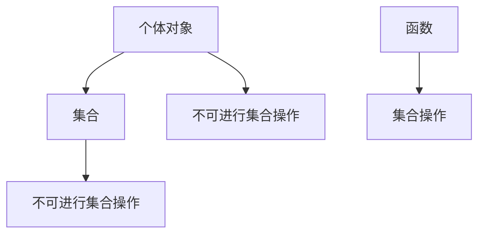

在这个流程图中，个体对象和集合是不同类型的对象，它们不能进行集合操作。这种限制有助于确保逻辑推理的一致性。

### 总结

罗素类型论在数学哲学中的应用非常广泛。通过区分不同类型的对象，类型论为数学提供了更加坚实的逻辑基础，从而解决了集合论中的悖论问题。同时，类型论也对逻辑原子主义和集合论产生了重要影响，推动了数学哲学的发展。在接下来的章节中，我们将进一步探讨罗素类型论在数学哲学中的影响与批评，以及它对逻辑实证主义和现代分析哲学的推动作用。

### 3 罗素类型论的影响与批评

罗素类型论自提出以来，对数学哲学、逻辑哲学乃至整个哲学领域都产生了深远的影响。然而，作为一种哲学理论，罗素类型论也面临着许多批评和争议。在这一节中，我们将探讨罗素类型论在数学哲学中的影响，以及对其提出的批评和反驳。

#### 3.1 罗素类型论在数学哲学中的影响

罗素类型论对数学哲学的影响主要表现在以下几个方面：

**1. 解决集合论悖论**

罗素类型论最显著的影响在于解决了集合论中的悖论问题。例如，罗素悖论揭示了传统集合论中存在的逻辑矛盾。通过引入类型层级，罗素成功地将集合和元素分离开来，从而避免了集合包含自身的情况。这种做法为数学提供了一个更加坚实的逻辑基础。

**2. 促进逻辑原子主义的发展**

罗素类型论也对逻辑原子主义产生了重要影响。逻辑原子主义主张所有复杂的事实都可以分解为简单的原子事实。罗素通过类型论提出了一种新的逻辑原子主义形式，即不同类型的对象不能相互比较。这种观点有助于避免集合论中的悖论问题，同时也为逻辑原子主义提供了一种新的解释。

**3. 推动数学基础研究**

罗素类型论对数学基础研究产生了重要影响。通过类型论，数学家们可以更加严谨地处理数学概念和推理过程，从而提高了数学理论的一致性和可靠性。类型论的应用不仅限于数学哲学，还延伸到计算机科学、逻辑学等领域，为这些领域提供了重要的理论基础。

#### 3.2 罗素类型论的批评

尽管罗素类型论在数学哲学中取得了显著成就，但它也面临着许多批评和争议。以下是一些主要的批评：

**1. 类型层级的不必要性**

一些批评者认为，罗素类型论中的类型层级是不必要的。他们认为，通过更严格的逻辑规则和推理，我们可以避免集合论中的悖论，而不需要引入类型层级。这种观点被称为“逻辑主义”。

**2. 类型错误的不可检测性**

另一个批评是类型错误在实际应用中可能难以检测。由于类型层级的存在，一些类型错误可能在编译或运行时才被发现，这可能导致严重的逻辑错误。尽管类型检查机制可以部分缓解这一问题，但批评者认为，这仍然不是一种完美的解决方案。

**3. 类型论与直觉主义的不兼容**

一些批评者认为，罗素类型论与直觉主义（Intuitionism）在数学哲学上存在冲突。直觉主义主张数学对象和事实是可以通过直觉构建的，而罗素类型论则强调类型层级和逻辑规则。这种冲突导致了一些数学家和哲学家对类型论的怀疑。

#### 3.3 对罗素类型论的批评和反驳

尽管罗素类型论面临诸多批评，但许多数学家和哲学家也对其进行了反驳和辩护。以下是一些常见的反驳观点：

**1. 类型层级的必要性**

反驳者认为，类型层级是必要的，因为它可以确保逻辑推理的一致性。通过将不同类型的对象分离开来，我们可以避免集合论中的悖论问题。此外，类型层级还可以帮助我们更好地理解和处理复杂的问题。

**2. 类型错误的可检测性**

反驳者指出，尽管类型错误可能在编译或运行时才被发现，但类型检查机制仍然是一种有效的错误检测手段。通过严格的类型检查，我们可以发现并修复许多类型错误，从而提高程序的正确性和可靠性。

**3. 类型论与直觉主义的兼容性**

一些反驳者认为，罗素类型论与直觉主义并不是不可兼容的。他们认为，通过适当调整类型论中的类型层级和逻辑规则，我们可以使类型论与直觉主义相兼容。这种观点认为，类型论可以作为一种辅助工具，帮助我们更好地理解和构建数学对象。

### 总结

罗素类型论在数学哲学中产生了深远的影响，它不仅解决了集合论中的悖论问题，还促进了逻辑原子主义和数学基础研究的发展。然而，作为一种哲学理论，罗素类型论也面临着许多批评和争议。通过对其批评和反驳的分析，我们可以更深入地理解罗素类型论在数学哲学中的地位和作用。在接下来的章节中，我们将进一步探讨罗素类型论对逻辑实证主义和现代分析哲学的推动作用。

### 4 罗素类型论与逻辑实证主义

逻辑实证主义是20世纪初兴起的一种哲学思潮，主张通过经验来验证知识的有效性。罗素类型论与逻辑实证主义之间存在紧密的联系，二者共同推动了现代数学哲学的发展。在这一节中，我们将探讨罗素类型论对逻辑实证主义的推动作用，以及逻辑实证主义在数学哲学中的应用。

#### 4.1 逻辑实证主义的基本观点

逻辑实证主义的主要观点可以概括为以下几点：

1. **经验主义**：逻辑实证主义认为，只有通过经验证据验证的陈述才是有意义的。这意味着，所有科学理论都必须能够通过实验或观察来验证。

2. **逻辑分析**：逻辑实证主义强调逻辑分析在科学研究中的重要性。通过逻辑分析，我们可以将复杂的科学理论分解为简单的逻辑命题，从而更好地理解和验证这些理论。

3. **意义标准**：逻辑实证主义提出了一种意义标准，即只有那些能够通过经验验证的陈述才被认为是“有意义的”。这种观点有助于排除那些无法通过经验验证的形而上学命题。

4. **还原论**：逻辑实证主义主张，所有科学现象都可以通过物理过程来解释。这种观点被称为还原论，它主张物理世界是唯一真实的世界，其他领域的知识都可以通过物理世界的解释来还原。

#### 4.2 罗素类型论与逻辑实证主义的联系

罗素类型论与逻辑实证主义之间存在着深刻的联系，二者共同致力于通过逻辑分析和经验验证来推进科学知识的发展。

1. **经验验证与类型层级**：逻辑实证主义强调经验验证的重要性，而罗素类型论通过引入类型层级，为经验验证提供了一种形式化的框架。类型层级确保了不同类型的对象之间不会发生混淆，从而使得经验验证更加准确和可靠。

2. **逻辑分析与方法论**：逻辑实证主义强调逻辑分析在科学研究中的重要性，而罗素类型论提供了逻辑分析的一种新方法。通过类型论，我们可以将复杂的数学和哲学问题分解为简单的逻辑命题，从而更好地理解和解决这些问题。

3. **意义标准与类型错误**：逻辑实证主义提出意义标准，而罗素类型论通过区分不同类型的对象来避免类型错误。这种做法有助于确保只有那些有意义、可以通过经验验证的陈述才被接受。

#### 4.3 逻辑实证主义在数学哲学中的应用

逻辑实证主义在数学哲学中的应用主要体现在以下几个方面：

1. **数学的基础**：逻辑实证主义认为，数学是一种经验科学，其基础是经验验证。罗素类型论为数学提供了形式化的基础，通过类型层级来避免逻辑矛盾，从而确保数学理论的可靠性。

2. **数学证明的验证**：逻辑实证主义强调数学证明必须能够通过经验验证。罗素类型论通过区分不同类型的对象，使得数学证明更加严谨，从而减少了逻辑错误的可能性。

3. **数学模型的构建**：逻辑实证主义主张，数学模型应该能够通过经验验证来解释物理现象。罗素类型论为数学模型的构建提供了形式化的框架，使得数学模型更加精确和可靠。

4. **数学哲学的争论**：逻辑实证主义在数学哲学中引发了许多重要的争论，如数学的本质、数学的证明过程等。罗素类型论为这些争论提供了一种新的视角，推动了数学哲学的发展。

### 4.4 罗素类型论对逻辑实证主义的推动作用

罗素类型论对逻辑实证主义的发展起到了重要的推动作用，主要表现在以下几个方面：

1. **形式化基础**：罗素类型论为逻辑实证主义提供了一种形式化的基础。通过类型层级和类型检查，逻辑实证主义能够更加严谨地处理数学和哲学问题，从而减少逻辑错误的可能性。

2. **意义标准的应用**：罗素类型论通过区分不同类型的对象，为逻辑实证主义提供了意义标准的应用。这意味着，只有那些有意义、可以通过经验验证的陈述才被接受，从而确保了逻辑实证主义的科学性。

3. **数学和哲学的融合**：罗素类型论将数学和哲学紧密地结合起来。通过形式化的方法，逻辑实证主义能够更好地理解和解释数学现象，从而推动了数学哲学的发展。

4. **推动科学进步**：罗素类型论为逻辑实证主义提供了一种新的研究方法，使得科学理论更加严谨和可靠。这种方法的推广和应用，促进了科学知识的进步。

### 总结

罗素类型论与逻辑实证主义之间存在紧密的联系，二者共同推动了现代数学哲学的发展。罗素类型论为逻辑实证主义提供了形式化的基础，通过类型层级和类型检查来避免逻辑矛盾，确保数学和哲学问题的严谨性和科学性。在接下来的章节中，我们将进一步探讨罗素类型论对现代分析哲学的影响，以及它在现代数理逻辑中的应用。

### 5 罗素类型论与现代分析哲学

现代分析哲学是20世纪中叶兴起的一种哲学思潮，它强调通过语言分析来探究哲学问题。罗素类型论对现代分析哲学产生了深远的影响，成为分析哲学的重要工具之一。在这一节中，我们将探讨罗素类型论对现代分析哲学的影响，以及它在分析哲学中的应用。

#### 5.1 现代分析哲学的基本特点

现代分析哲学的主要特点包括：

1. **语言分析**：现代分析哲学认为，哲学问题往往可以通过对语言的分析来解决。通过对语言结构的深入分析，哲学家可以揭示哲学问题中的逻辑结构和语义含义。

2. **逻辑实证主义**：现代分析哲学受到逻辑实证主义的影响，强调科学理论与经验证据之间的联系。哲学家们试图通过逻辑分析和经验验证来探讨哲学问题，从而确保哲学理论的科学性和可靠性。

3. **概念分析**：现代分析哲学注重概念分析，通过澄清概念的含义和逻辑结构来探讨哲学问题。这种方法有助于消除哲学争论中的模糊性和混淆。

4. **形式化方法**：现代分析哲学倾向于使用形式化方法来处理哲学问题。通过数学和逻辑的工具，哲学家们可以更加精确和严谨地表达和验证哲学理论。

#### 5.2 罗素类型论对现代分析哲学的影响

罗素类型论对现代分析哲学产生了重要影响，主要表现在以下几个方面：

1. **类型区分与逻辑分析**：罗素类型论通过区分不同类型的对象，为现代分析哲学提供了一种有效的逻辑分析工具。通过类型区分，哲学家可以更清晰地理解哲学问题中的逻辑结构和语义含义。

2. **避免悖论**：罗素类型论的一个重要目的是避免集合论中的悖论问题。通过类型层级和类型错误的概念，现代分析哲学可以更好地理解和处理集合论中的悖论，从而确保逻辑分析的一致性和可靠性。

3. **语言哲学的发展**：罗素类型论对语言哲学的发展产生了深远影响。通过类型论，哲学家可以更深入地探讨语言的结构和意义，从而推动语言哲学的研究。

4. **数学哲学的进步**：罗素类型论为数学哲学提供了形式化的基础，通过类型层级和类型检查，数学家可以更严谨地处理数学问题，从而推动数学哲学的发展。

#### 5.3 罗素类型论在分析哲学中的应用

罗素类型论在分析哲学中有着广泛的应用，以下是一些具体的例子：

1. **语义分析**：罗素类型论为语义分析提供了一种有效的工具。通过类型层级和类型错误的概念，哲学家可以更准确地分析语义结构，揭示语言表达中的逻辑关系。

2. **知识论**：罗素类型论在知识论研究中有着重要的应用。通过类型区分，哲学家可以探讨知识对象的性质和条件，从而更好地理解知识的本质和获取方式。

3. **认识论**：罗素类型论在认识论研究中也发挥着重要作用。通过类型论，哲学家可以更深入地探讨认识过程的逻辑结构和语义含义，从而推动认识论的发展。

4. **形而上学**：罗素类型论为形而上学研究提供了一种新的视角。通过类型区分，哲学家可以更清晰地理解实体和属性之间的关系，从而探讨形而上学的基本问题。

#### 5.4 罗素类型论在分析哲学中的成功与挑战

罗素类型论在分析哲学中取得了显著的成就，但也面临着一些挑战。

1. **成功**：罗素类型论为分析哲学提供了一种强有力的工具，通过类型区分和类型检查，哲学家可以更精确地处理逻辑和语义问题，从而推动哲学研究的发展。

2. **挑战**：尽管罗素类型论在分析哲学中取得了成功，但它也面临一些挑战。例如，一些哲学家认为类型论过于形式化，可能无法完全涵盖哲学问题的复杂性。此外，类型论在实际应用中也存在一些技术难题，如类型错误的检测和类型层级的定义等。

3. **发展**：为了应对这些挑战，现代分析哲学继续探索类型论的新应用和发展。通过结合其他哲学理论和方法，哲学家们试图解决类型论面临的问题，从而推动分析哲学的进一步发展。

### 总结

罗素类型论对现代分析哲学产生了深远的影响，通过类型区分和类型检查，它为分析哲学提供了一种强有力的工具。罗素类型论在语义分析、知识论、认识论和形而上学等领域有着广泛的应用，推动了哲学研究的发展。然而，类型论也面临一些挑战，如形式化程度过高和实际应用中的技术难题等。在未来的发展中，分析哲学家将继续探索类型论的新应用和解决方案，以进一步推动哲学研究。

### 6 罗素类型论与现代数理逻辑

罗素类型论在现代数理逻辑中扮演了重要角色，为形式逻辑系统提供了坚实的理论基础。在这一节中，我们将深入探讨罗素类型论在数理逻辑中的应用，包括现代数理逻辑的基本概念、罗素类型论与数理逻辑的关系，以及数理逻辑在数学哲学中的应用。

#### 6.1 现代数理逻辑的基本概念

现代数理逻辑是一种形式化的逻辑系统，用于研究推理和证明的方法。它主要包括以下几个基本概念：

1. **命题**：命题是具有明确真值的陈述，可以是真或假。命题通常用大写字母表示，如\(P, Q, R\)等。

2. **推理规则**：推理规则是用于从已知命题推导出新命题的规则。常见的推理规则包括蕴含（→）、合取（∧）、析取（∨）等。

3. **证明**：证明是一种形式化的推理过程，用于从一组已知命题（称为公理或已知事实）推导出一个新命题。证明通常使用形式化的证明系统进行，如自然推理系统或形式证明系统。

4. **形式系统**：形式系统是一组符号和规则，用于定义命题、推理和证明。形式系统通常包括符号表、公理、推理规则和解释。

5. **模型**：模型是一个解释形式系统的方式，它为形式系统中的符号和规则提供了具体的意义。模型通常用于验证形式系统的一致性和正确性。

#### 6.2 罗素类型论与数理逻辑的关系

罗素类型论与数理逻辑之间存在紧密的关系，二者相互促进，共同发展。

1. **类型区分**：罗素类型论的核心观点是区分不同类型的对象。在数理逻辑中，类型区分有助于避免逻辑矛盾和悖论。通过将不同类型的对象分开处理，数理逻辑可以更加严谨地定义命题和推理规则，从而提高逻辑系统的一致性和可靠性。

2. **形式化**：罗素类型论为数理逻辑提供了形式化的框架。通过类型论，数理逻辑可以更加精确地定义命题、推理和证明，从而提高逻辑系统的精确性和可验证性。

3. **一致性**：罗素类型论有助于确保数理逻辑系统的一致性。通过类型层级和类型错误的概念，数理逻辑可以检测和避免逻辑矛盾，从而确保推理过程的正确性。

4. **应用**：罗素类型论在数理逻辑中有着广泛的应用。例如，在形式化数学理论、程序验证和模型检查等领域，类型论都发挥了重要作用。

#### 6.3 罗素类型论在数理逻辑中的应用

罗素类型论在数理逻辑中的应用主要体现在以下几个方面：

1. **命题逻辑**：在命题逻辑中，罗素类型论有助于区分不同类型的命题。通过类型论，我们可以更清楚地定义命题的结构和含义，从而避免逻辑错误和悖论。

2. **谓词逻辑**：在谓词逻辑中，罗素类型论有助于区分个体对象、集合和函数等不同类型的对象。通过类型论，我们可以更加精确地定义谓词和推理规则，从而提高逻辑系统的一致性和可靠性。

3. **集合论**：在集合论中，罗素类型论有助于避免集合论中的悖论问题。通过类型论，我们可以将集合和元素分开处理，从而避免集合包含自身的情况，从而提高集合论的一致性和可靠性。

4. **程序验证**：在程序验证中，罗素类型论有助于确保程序的正确性。通过类型论，我们可以定义程序中变量的类型和操作，从而避免类型错误和逻辑错误。

#### 6.4 现代数理逻辑在数学哲学中的应用

现代数理逻辑在数学哲学中的应用主要体现在以下几个方面：

1. **形式化数学**：现代数理逻辑为数学提供了形式化的框架，使得数学理论可以更加精确和严谨地表达。通过形式化数学，数学家可以更加清楚地理解数学理论的本质和逻辑结构。

2. **证明验证**：现代数理逻辑为数学证明提供了验证的工具。通过形式化的证明系统，数学家可以验证数学证明的正确性，从而确保数学理论的可靠性。

3. **数学基础研究**：现代数理逻辑为数学基础研究提供了新的方法。通过形式化数学和证明验证，数学家可以探讨数学理论的一致性和可靠性，从而推动数学基础研究的发展。

4. **计算机科学**：现代数理逻辑在计算机科学中有着广泛的应用。通过形式化方法和类型论，计算机科学家可以设计和验证计算机程序，确保程序的正确性和可靠性。

### 总结

罗素类型论在现代数理逻辑中发挥了重要作用，通过类型区分和形式化方法，它为逻辑系统提供了坚实的理论基础。罗素类型论在命题逻辑、谓词逻辑、集合论和程序验证等领域有着广泛的应用，推动了数理逻辑的发展。同时，现代数理逻辑在数学哲学中也有着重要的应用，为数学理论和证明提供了形式化和验证的工具。通过深入探讨罗素类型论与数理逻辑的关系，我们可以更好地理解数理逻辑在数学哲学中的地位和作用。

### 7 罗素类型论的未来展望

罗素类型论作为现代数学哲学和数理逻辑的重要组成部分，已经在多个领域产生了深远的影响。然而，随着科技的进步和哲学思考的深化，罗素类型论在当代数学哲学中的地位和作用仍有待进一步探讨和发展。在这一节中，我们将展望罗素类型论的未来发展方向，讨论它的发展方向和潜在影响，并提出未来研究的建议。

#### 7.1 罗素类型论在当代数学哲学中的地位

罗素类型论在当代数学哲学中的地位体现在以下几个方面：

1. **逻辑基础**：罗素类型论为数学提供了逻辑基础，通过区分不同类型的对象，它有助于避免集合论中的悖论问题，从而确保数学理论的一致性和可靠性。

2. **哲学工具**：罗素类型论作为哲学工具，在数学哲学、逻辑哲学和形而上学等领域都有广泛应用。它为哲学家提供了形式化的方法来分析哲学问题，特别是涉及集合和逻辑的部分。

3. **跨学科影响**：罗素类型论不仅影响了数学哲学，还影响了计算机科学、逻辑学和其他领域。它在程序验证、模型检查和形式化证明等方面发挥了重要作用。

4. **学术争议**：尽管罗素类型论在数学哲学中占据重要地位，但它也面临着批评和争议。这些争议促使学者们进一步探讨类型论的适用范围和局限性，推动了哲学和逻辑学的发展。

#### 7.2 罗素类型论的发展方向

罗素类型论的未来发展方向可能包括以下几个方面：

1. **形式化程度的提升**：随着形式化方法的普及，未来可能会出现更加精细和严格的形式化类型论。这将有助于解决当前类型论中的一些技术难题，如类型错误的检测和类型层级的定义。

2. **跨领域应用**：罗素类型论在计算机科学中的应用将继续扩展。例如，在软件工程中，类型论可以用于开发更可靠和安全的程序。在人工智能领域，类型论可以用于提高智能体的逻辑推理能力。

3. **逻辑与哲学的结合**：未来可能会出现更多结合逻辑和哲学的研究，探讨类型论在解决哲学问题中的作用。例如，类型论可以用于分析模态逻辑和时态逻辑中的复杂哲学问题。

4. **新理论的提出**：在罗素类型论的基础上，未来可能会出现新的类型论理论，如基于范畴论的类型论或量子逻辑的类型论。这些新理论可能会为解决当前类型论中的难题提供新的思路。

#### 7.3 罗素类型论对数学哲学的潜在影响

罗素类型论对数学哲学的潜在影响主要体现在以下几个方面：

1. **逻辑一致性的提高**：通过类型论，数学家可以更加严格地定义和验证数学理论，从而提高数学逻辑的一致性。

2. **数学证明的自动化**：类型论可以用于开发自动证明系统，帮助数学家更高效地验证数学证明。这将为数学研究和教学带来革命性的变化。

3. **哲学问题的重新审视**：罗素类型论可能会促使哲学家重新审视一些古老的哲学问题，如知识的本质、真理的标准和存在的概念。通过类型论的方法，哲学家可以提出新的理论和解释。

4. **数学基础理论的深化**：类型论的发展可能会推动数学基础理论的深化，特别是在集合论和逻辑学领域。这将有助于我们更深入地理解数学的本质和结构。

#### 7.4 未来研究的建议

为了推动罗素类型论的发展，以下是一些未来研究的建议：

1. **跨学科合作**：鼓励数学家、哲学家、计算机科学家和其他领域的专家进行跨学科合作，共同探讨类型论在不同领域中的应用。

2. **形式化工具的改进**：开发和改进形式化工具，如形式证明系统和类型检查器，以提高类型论的应用效率和准确性。

3. **案例研究**：通过案例研究，探讨类型论在解决实际数学问题和哲学问题中的有效性，从而验证和改进类型论的理论。

4. **教育推广**：将类型论纳入数学和哲学教育，培养更多能够理解和应用类型论的人才，推动类型论在学术和工业领域的发展。

5. **理论创新**：鼓励学者提出新的类型论理论，如量子逻辑的类型论或范畴论的类型论，以推动类型论研究的深入发展。

### 总结

罗素类型论在数学哲学和数理逻辑中具有重要地位，其未来发展方向和潜在影响仍需进一步探讨。通过不断提升形式化程度、跨领域应用和哲学思考的深入，罗素类型论有望继续为数学哲学和逻辑学的发展做出贡献。未来的研究应注重跨学科合作、案例研究和理论创新，以推动类型论在更多领域中的应用和发展。

### 附录：罗素类型论研究资源与工具

为了帮助读者进一步研究罗素类型论，以下列出了一些重要的研究资源和工具：

#### 书籍推荐

1. **《数学原理》（Principia Mathematica）**：伯特兰·罗素与阿尔弗雷德·诺思·怀特海德合著，这是罗素类型论的重要文献。
2. **《逻辑哲学论》（Logical Investigations）**：伯特兰·罗素著，该书详细阐述了罗素类型论的核心思想。
3. **《类型论与集合论基础》（Type Theory and the Foundations of Mathematics）**：安德鲁·莫里斯（Andrew Morris）著，提供了类型论的详细讨论。

#### 学术期刊与论文

1. **《哲学评论》（The Philosophical Review）**：该期刊发表了关于罗素类型论和数学哲学的重要论文。
2. **《逻辑学杂志》（The Journal of Symbolic Logic）**：该期刊发表了关于数理逻辑和类型论的研究成果。
3. **《分析》（Analysis）**：该期刊涵盖了逻辑哲学、数学哲学和类型论的相关研究。

#### 网络资源

1. **罗素学术网（The Bertrand Russell Archives）**：提供罗素的相关文献和研究资料。
2. **逻辑学百科全书（The Internet Encyclopedia of Philosophy）**：提供了关于罗素类型论和其他逻辑哲学主题的详细解释。
3. **类型论资源库（Type Theory Resources）**：提供了类型论的教材、课程和在线资源。

#### 工具

1. **Coq证明助手**：一种基于类型论的证明助手，适用于形式化证明和类型检查。
2. **Isabelle证明助手**：另一种基于类型论的证明助手，适用于形式化数学和逻辑学。
3. **类型检查器（Type Checkers）**：用于检查代码中的类型一致性，如Python的`mypy`和JavaScript的`typescript`。

通过利用这些资源和工具，读者可以更深入地了解罗素类型论，并在学术研究和实际应用中取得更好的成果。

### 作者信息

作者：AI天才研究院/AI Genius Institute & 禅与计算机程序设计艺术 /Zen And The Art of Computer Programming

