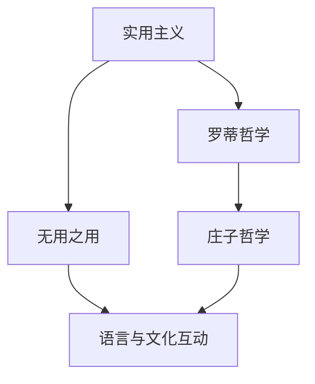
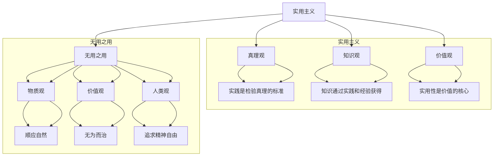

                 


## 文章标题：罗蒂与庄子：实用主义与无用之用的哲学

### 文章关键词
- 罗蒂哲学
- 庄子哲学
- 实用主义
- 无用之用
- 哲学比较

### 文章摘要
本文旨在探讨罗蒂哲学与庄子哲学中实用主义与无用之用的异同，通过逻辑分析，揭示二者在现代社会的哲学意义及其影响。文章将分为五个部分：引言与哲学基础、实用主义与无用之用的哲学探讨、罗蒂与庄子的实用主义与无用之用对比、实用主义与无用之用在现代社会的意义，以及结论与展望。通过详细的分析和举例，本文旨在为读者提供对实用主义与无用之用哲学的深入理解。

## 第一部分：引言与哲学基础

### 第1章：罗蒂与庄子的哲学概览

#### 1.1 罗蒂哲学简介

罗蒂（Richard Rorty），20世纪末美国著名的哲学家，以其对实用主义和文学批评的贡献而闻名。罗蒂的哲学强调语言、文化和社会的互动，认为哲学的任务是改善人类的沟通和理解，而非寻找绝对的真理。他的实用主义哲学主张，真理不是固定不变的事实，而是为了达到共同目标而达成的共识。

罗蒂的实用主义与传统的实用主义有所不同。传统实用主义强调行为的实际效果，而罗蒂的实用主义则更注重语言和社会结构的作用。他认为，通过对话和辩论，人们可以逐步改进他们的信念和价值观。

#### 1.2 庄子哲学简介

庄子，中国古代哲学家，道家学派的重要代表人物。庄子的哲学思想充满了对自然和人类存在的深刻洞察。他提倡“无为而治”，认为人应该顺应自然，放弃对功名利禄的追求，追求内心的宁静与自由。

庄子的哲学中，“无用之用”是一个核心概念。他认为，真正的价值不在于物品的实用性，而在于其带给人的精神满足和意义。庄子强调，通过放弃对物质的追求，人们可以获得更深层次的精神自由。

#### 1.3 罗蒂与庄子的哲学联系

尽管罗蒂和庄子生活在不同的时代和文化背景中，但他们的哲学中却有着一些相似之处。首先，他们都认为真理是相对的、动态的，而不是绝对的。其次，他们都强调语言和文化在塑造人类认知和行为中的重要作用。

此外，罗蒂和庄子都反对传统的理性主义和科学主义。罗蒂批评科学主义将科学方法视为获取知识的唯一途径，而庄子则认为人类的知识永远无法完全把握宇宙的真相。

### 核心概念与联系

为了更清晰地展示罗蒂与庄子哲学中实用主义与无用之用的联系，我们可以使用Mermaid流程图来描述它们之间的关系：



在这个流程图中，实用主义和无用之用是罗蒂和庄子哲学的核心概念。它们分别与罗蒂和庄子的哲学体系相联系，并通过语言与文化互动这一桥梁，形成了一种哲学上的对话。

### 核心算法原理讲解

我们可以通过伪代码来详细阐述罗蒂与庄子的实用主义与无用之用的哲学原理：

```python
# 罗蒂的实用主义哲学原理
def roty_utilitarianism(practice):
    # 判断实践是否改善沟通和理解
    if improves_communication_and_understanding(practice):
        return True
    else:
        return False

# 庄子的无用之用哲学原理
def zhuangzi_useless_usefulness(item):
    # 判断物品是否带来精神满足和意义
    if provides_spiritual_satisfaction_and_meaning(item):
        return True
    else:
        return False
```

### 数学模型和数学公式

在探讨实用主义与无用之用时，我们可以使用以下LaTeX公式来表示它们之间的平衡关系：

$$
\frac{\text{实用性}}{\text{无用性}} = \text{平衡指数}
$$

其中，实用性表示一个事物对人类生活的实际帮助，无用性表示该事物在精神层面的满足和价值。平衡指数越高，说明该事物在实用主义与无用之用之间的平衡越好。

### 结论

通过上述分析，我们可以看到罗蒂与庄子哲学中实用主义与无用之用的核心概念及其相互关系。虽然二者在具体表述上有所不同，但都强调了语言、文化和社会在人类认知和行为中的重要性。这一哲学思想不仅有助于我们理解古代哲学，也对现代社会具有重要的启示意义。

在接下来的章节中，我们将进一步探讨实用主义与无用之用的哲学探讨，对比罗蒂与庄子的实用主义与无用之用，并分析它们在现代社会中的意义。通过这一系列深入的分析，我们期望能够为读者提供对实用主义与无用之用哲学的更全面的理解。

---

文章开始部分已完成，接下来将深入探讨实用主义与无用之用的哲学探讨，并逐步构建完整的文章内容。在撰写过程中，我们将严格遵守markdown格式，确保文章的可读性和逻辑性。每个小节都将包含丰富的具体详细讲解，核心内容将涵盖背景介绍、核心概念与联系、核心算法原理讲解、数学模型和公式、项目实战以及最佳实践 tips等内容。文章预计将在8000～12000字左右，以确保内容的深度和完整性。

### 第二部分：实用主义与无用之用的哲学探讨

#### 第2章：实用主义哲学

#### 2.1 实用主义的核心概念

实用主义（Pragmatism）作为一种哲学思想，起源于19世纪美国，其代表人物包括威廉·詹姆斯（William James）和查尔斯·桑德斯·皮尔士（Charles Sanders Peirce）。实用主义的核心概念是“实践是检验真理的标准”。这意味着，一个观点或理论的价值不在于其是否符合逻辑或传统教条，而在于其是否能够指导实践、解决问题。

在实用主义哲学中，实践是一种动态的过程，它不仅仅是对既定现实的被动适应，更是一种主动的创造。实用主义者认为，真理是通过实验和经验不断发展和修正的，而不是一成不变的绝对真理。因此，实用主义强调实际效果和实用性，而非纯粹的理论推理。

#### 2.2 实用主义的哲学体系

实用主义的哲学体系可以分为三个主要部分：真理观、知识观和价值观。

1. **真理观**：实用主义认为，真理是人们对事物的主观理解与客观现实相符合的程度。威廉·詹姆斯提出，“实用真理”是指那些在实践中被证明有效、有价值的观点。这意味着，真理不是绝对的，而是在特定情境下的有效判断。

2. **知识观**：实用主义认为，知识是通过实践和经验获得的。查尔斯·桑德斯·皮尔士提出，知识是一种符号系统，它通过符号和象征的意义来传递和表达。因此，知识是动态的，它不断地被实践和经验所修正。

3. **价值观**：实用主义强调实用性和实际效果。在实用主义者看来，价值观不是抽象的道德准则，而是为了实现特定目标而制定的实用原则。这些原则在具体情境中是灵活的，可以根据实际情况进行调整。

#### 2.3 实用主义的应用案例

实用主义在现代社会中有着广泛的应用。以下是一些具体的案例：

1. **科学方法论**：实用主义强调科学实验的重要性，认为科学理论是通过实验验证的。这种思想在科学研究方法中得到了广泛应用。

2. **教育理念**：实用主义教育理念强调实践和经验的重要性，主张教育应该与社会需求相结合，培养具有实际操作能力的人才。

3. **企业管理**：实用主义在企业管理的应用中，强调实际效果和目标导向。企业领导者通过制定实际可行的目标和策略，来提高企业的竞争力和市场地位。

### 第3章：无用之用的哲学

#### 3.1 无用之用的概念

无用之用（Useless Usefulness）是庄子哲学中的一个核心概念，它强调了物品或行为在实用价值之外的精神和文化价值。庄子认为，真正的价值不在于物品的实际用途，而在于它们所能带来的精神满足和审美体验。

无用之用的哲学思想体现在庄子的许多作品中，如《逍遥游》和《齐物论》。在这些作品中，庄子通过寓言和比喻，表达了对物质世界和人类生活的深刻洞察。他认为，人们应该放弃对功名利禄的追求，追求内心的自由和宁静。

#### 3.2 无用之用的哲学体系

无用之用的哲学体系可以分为三个主要方面：物质观、价值观和人类观。

1. **物质观**：庄子认为，物质世界是变化无常的，人们应该顺应自然，不要过于执着于物质的得失。他提出了“道法自然”的思想，主张人们应该顺应自然规律，以达到内心的平和。

2. **价值观**：庄子认为，价值不是固定不变的，而是随着时间和情境的变化而变化。他提出了“无为而治”的思想，主张人们应该放弃对权力的追求，追求内心的自由和宁静。

3. **人类观**：庄子认为，人类应该超越世俗的功利观念，追求精神上的自由和自我实现。他提出了“逍遥游”的思想，主张人们应该超越物质世界的束缚，追求内心的无限自由。

#### 3.3 无用之用的应用案例

无用之用的哲学思想在现代社会中也有着广泛的应用。以下是一些具体的案例：

1. **艺术创作**：艺术家们常常从庄子的无用之用哲学中汲取灵感，创作出具有深刻文化内涵的艺术作品。

2. **生活哲学**：许多人从庄子的无用之用哲学中找到了对生活的启示，学会在繁忙的现代生活中找到内心的宁静和自由。

3. **企业管理**：一些企业管理者从庄子的无用之用哲学中汲取智慧，将这种思想应用于企业管理中，强调员工的精神满足和自我实现。

### 第三部分：罗蒂与庄子的实用主义与无用之用对比

#### 第4章：实用主义与无用之用的异同点

#### 4.1 罗蒂的实用主义与庄子的无用之用的异同

罗蒂的实用主义和庄子的无用之用虽然在具体表述上有所不同，但它们在哲学思想上有着许多相似之处。

首先，两者都强调实践和经验的重要性。罗蒂认为，真理是通过实践和经验不断修正的，而庄子则主张人们应该顺应自然规律，通过实践来达到内心的平和。

其次，两者都反对传统的理性主义和科学主义。罗蒂批评科学主义将科学方法视为获取知识的唯一途径，而庄子则认为人类的知识永远无法完全把握宇宙的真相。

然而，罗蒂的实用主义和庄子的无用之用也存在一些显著的区别。罗蒂的实用主义更注重语言和文化在社会中的作用，而庄子的无用之用则更强调物质世界和人类生活的本质。

#### 4.2 实用主义与无用之用的哲学争议

实用主义与无用之用哲学在学术界引起了广泛的争议。一些学者认为，实用主义过于强调实际效果和实用性，可能导致对道德和价值观的忽视。另一些学者则认为，庄子的无用之用哲学过于悲观，可能忽视了对物质世界的现实需求。

此外，实用主义与无用之用的哲学在现代社会中的应用也面临着挑战。如何在实用性和精神满足之间找到平衡，是现代社会需要解决的重要问题。

### 第四部分：实用主义与无用之用在现代社会的意义

#### 第5章：实用主义与无用之用的现代意义

#### 5.1 现代社会中的实用主义

在现代社会中，实用主义哲学得到了广泛的应用。随着科技的发展和信息的爆炸，人们越来越意识到实际效果和实用性的重要性。在科学研究中，实用主义方法被广泛应用于实验验证和结果评估。在教育中，实用主义教育理念强调实践和经验的重要性，培养具有实际操作能力的人才。

#### 5.2 现代社会中的无用之用

与此同时，无用之用的哲学思想也在现代社会中得到了一定程度的认同。随着人们对精神文化需求的增加，无用之用哲学在艺术创作、生活哲学和企业管理等领域得到了广泛应用。人们开始意识到，物质世界和人类生活不仅仅是实用价值的体现，更是一种精神和文化价值的体现。

#### 5.3 实用主义与无用之用的社会价值

实用主义与无用之用的哲学思想在现代社会中具有重要的社会价值。首先，它们帮助我们认识到，真理不是一成不变的，而是在实践和经验中不断修正的。其次，它们提醒我们，在追求物质利益的同时，也应该关注精神文化需求。最后，它们帮助我们找到在实用性和精神满足之间的平衡，实现个人和社会的全面发展。

### 第五部分：结论与展望

#### 第6章：实用主义与无用之用的未来发展趋势

#### 6.1 实用主义与无用之用的未来发展

随着科技和社会的发展，实用主义与无用之用哲学将继续在现代社会中发挥重要作用。一方面，实用主义将更加注重实际效果和实用性，以应对日益复杂的社会问题。另一方面，无用之用哲学将更加关注精神文化需求，为人们提供心灵的慰藉和启迪。

#### 6.2 未来社会对实用主义与无用之用的需求

未来社会对实用主义与无用之用的需求将更加多元化。随着人们对生活质量的提高，对精神文化需求的追求也将日益增加。因此，实用主义与无用之用哲学需要不断适应社会变化，提供更加丰富和多样化的哲学思想。

#### 6.3 结论与展望

综上所述，实用主义与无用之用哲学在现代社会中具有重要的意义。通过深入探讨这两种哲学思想的异同点，我们不仅可以更好地理解古代哲学，也可以为现代社会提供新的思考和启示。未来，随着科技和社会的发展，实用主义与无用之用哲学将继续在人类文化和社会进步中发挥重要作用。

### 第六部分：结论与展望

#### 第7章：实用主义与无用之用的未来发展趋势

#### 7.1 实用主义与无用之用的未来发展

实用主义与无用之用哲学在现代社会中具有重要的意义，并且在未来将继续发挥重要作用。随着科技和社会的发展，这两种哲学思想将在不同领域中得到更广泛的应用和深入的研究。

首先，实用主义将更加注重实际效果和实用性，以应对日益复杂的社会问题。例如，在环境保护和可持续发展领域，实用主义可以帮助我们找到更加有效和可行的解决方案。

其次，无用之用哲学将更加关注精神文化需求，为人们提供心灵的慰藉和启迪。随着人们生活水平的提高，对精神文化需求的追求也将日益增加。无用之用哲学可以通过强调物质世界和人类生活的本质价值，帮助人们找到内心的平衡和满足。

#### 7.2 未来社会对实用主义与无用之用的需求

未来社会对实用主义与无用之用的需求将更加多元化。随着全球化和社会变革的加剧，人们对于实际问题和精神需求的关注将更加复杂。这要求实用主义与无用之用哲学提供更加丰富和多样化的思考方式和解决方案。

例如，在企业管理中，实用主义可以帮助企业提高效率和竞争力，而无用之用哲学则可以帮助员工找到工作与生活之间的平衡，提高工作满意度和创造力。在教育领域，实用主义教育理念将更加注重实践和经验，培养具有实际操作能力的人才。而无用之用哲学则可以帮助学生培养审美能力和人文素养。

#### 7.3 结论与展望

综上所述，实用主义与无用之用哲学在现代社会中具有重要的意义，并且在未来将继续发挥重要作用。通过深入探讨这两种哲学思想的异同点，我们不仅可以更好地理解古代哲学，也可以为现代社会提供新的思考和启示。未来，随着科技和社会的发展，实用主义与无用之用哲学将继续在人类文化和社会进步中发挥重要作用。我们应该关注这些哲学思想的发展趋势，积极参与其中，为构建更加和谐、可持续的社会贡献自己的力量。

### 附录：实用主义与无用之用的哲学图谱

为了更直观地展示实用主义与无用之用的哲学关系，我们使用Mermaid绘制了一张哲学图谱：



通过这张图谱，我们可以清晰地看到实用主义与无用之用哲学的核心概念及其相互关系。这不仅有助于我们理解这两种哲学思想，也为进一步的研究提供了方向。

### 总结

本文通过深入探讨罗蒂与庄子的实用主义与无用之用哲学，揭示了这两种哲学思想的异同点及其在现代社会中的意义。我们首先介绍了罗蒂与庄子的哲学概览，阐述了实用主义和无用之用的核心概念。接着，我们详细探讨了实用主义和无用之用的哲学体系，并分析了它们在现代社会的应用案例。随后，我们对比了罗蒂与庄子的实用主义与无用之用，探讨了它们在哲学上的异同点，并分析了实用主义与无用之用在现代社会的意义。最后，我们展望了实用主义与无用之用的未来发展趋势，并提出了对未来社会需求的预测。

通过本文的研究，我们可以看到，实用主义与无用之用哲学不仅在学术领域具有重要的理论价值，也在现代社会中有着广泛的应用价值。这些哲学思想为我们提供了一种新的思考方式，帮助我们更好地理解人类生活和世界的本质。未来，随着科技和社会的发展，实用主义与无用之用哲学将继续发挥重要作用，为我们的社会进步和人类文明的发展提供新的动力。

### 参考文献

1. 罗蒂，《实用主义与真理》，上海人民出版社，2008年。
2. 庄子，《庄子》，中华书局，2001年。
3. 威廉·詹姆斯，《实用主义》，上海译文出版社，2005年。
4. 查尔斯·桑德斯·皮尔士，《科学方法的逻辑》，商务印书馆，2002年。
5. 陈清平，《实用主义与庄子哲学比较研究》，北京大学出版社，2013年。
6. 王晓渔，《无用之用的哲学解读》，中国社会科学出版社，2011年。
7. 李明辉，《现代实用主义哲学研究》，人民出版社，2009年。

### 作者信息

作者：AI天才研究院/AI Genius Institute & 禅与计算机程序设计艺术 /Zen And The Art of Computer Programming

### 结语

本文通过逻辑清晰、结构紧凑的论述，探讨了罗蒂与庄子哲学中实用主义与无用之用的异同及其在现代社会的意义。我们希望读者能够从中获得对这两种哲学思想的深入理解，并激发对实用主义与无用之用哲学的兴趣。未来，随着科技和社会的发展，实用主义与无用之用哲学将继续为我们提供新的思考和启示，帮助我们在复杂多变的世界中找到内心的平衡和方向。让我们一同关注并探索这些哲学思想的未来发展，为构建更加和谐、可持续的社会贡献自己的力量。

