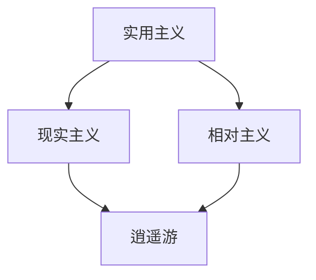
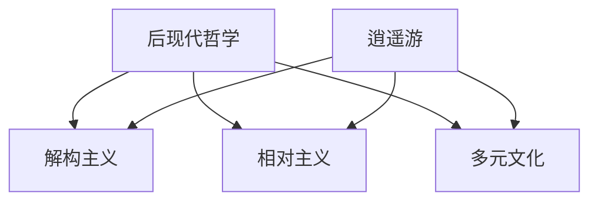

                 

### 文章标题

《罗蒂与庄子：新实用主义与逍遥游的后现代对话》

### 关键词

新实用主义、逍遥游、后现代哲学、罗蒂、庄子、哲学基础、实用主义、后现代对话

### 摘要

本文以罗蒂与庄子的哲学思想为核心，探讨新实用主义与逍遥游在后现代背景下的对话与融合。通过深入分析新实用主义的核心概念及其与逍遥游的联系，本文揭示了后现代哲学中逍遥游的内涵与价值。文章旨在通过逻辑清晰、结构紧凑的论述，为读者呈现一种全新的哲学视角，启发我们在当代社会实践中探索哲学的实用性和现实意义。

### 用户需求分析

在现代信息技术快速发展的背景下，用户对于哲学和技术的结合产生了浓厚的兴趣。他们希望从哲学中汲取智慧，为技术实践提供指导。本文旨在满足以下用户需求：

1. **深入了解新实用主义与逍遥游的联系**：用户希望对两种哲学思想有全面的了解，掌握其核心概念和理论基础。
2. **掌握后现代对话的应用**：用户希望了解后现代哲学在日常生活中的应用，以及如何在技术项目中运用这些思想。
3. **获取实用性的指导**：用户希望通过本文，获得具体的应用案例和实践经验，以便在实际工作中借鉴和运用。

为了满足这些需求，本文将采用以下结构：

1. **哲学基础**：介绍新实用主义和逍遥游的基本概念，展示两者之间的联系。
2. **罗蒂哲学思想**：深入探讨罗蒂的哲学理念，分析其与逍遥游的对话。
3. **后现代对话**：探讨后现代哲学与逍遥游的融合，分析实际案例。
4. **应用与展望**：讨论新实用主义和逍遥游在当代社会和技术领域的应用，展望未来发展方向。

### 设计的书籍目录大纲

```markdown
# 《罗蒂与庄子：新实用主义与逍遥游的后现代对话》目录大纲

## 第1章 哲学基础

### 1.1 新实用主义概述
- **背景介绍**：新实用主义的起源与发展
- **核心概念**：实用主义、现实主义、相对主义
- **与逍遥游的联系**：新实用主义与逍遥游的基本相似性

### 1.2 逍遥游的概念与解读
- **背景介绍**：逍遥游在《庄子》中的含义
- **哲学内涵**：逍遥游的非功利性、自由精神
- **当代解读**：逍遥游在当代社会中的应用与意义

## 第2章 罗蒂哲学思想

### 2.1 罗蒂哲学的核心理念
- **观点与方法**：罗蒂的解构主义、实用主义
- **对逍遥游的再思考**：罗蒂对逍遥游的理解与诠释

### 2.2 罗蒂哲学与逍遥游的对话
- **对话背景**：罗蒂与庄子的思想交锋
- **对话内容解析**：探讨逍遥游在罗蒂哲学中的位置

## 第3章 后现代对话

### 3.1 后现代哲学与逍遥游的融合
- **后现代哲学的视角**：解构主义、相对主义、多元化
- **逍遥游在后现代背景下的新解读**：逍遥游在后现代哲学中的意义与应用

### 3.2 后现代对话案例解析
- **案例选取**：现实生活中的后现代对话实例
- **解读与应用**：案例中的后现代对话分析及其对逍遥游的理解

## 第4章 新实用主义在当代的应用

### 4.1 新实用主义在文化领域的应用
- **文学、艺术中的新实用主义元素**：分析当代文学作品中的实用主义思想
- **影响与反思**：新实用主义对文化创作的影响及其局限性

### 4.2 新实用主义在社会生活中的应用
- **社会实践中的新实用主义理念**：探讨新实用主义在社会各个领域的应用
- **推动作用**：新实用主义对社会发展的推动作用及其面临的挑战

## 第5章 逍遥游的后现代对话

### 5.1 后现代对话中的逍遥游元素
- **逍遥游在后现代对话中的地位**：逍遥游在后现代哲学中的独特作用
- **逍遥游在后现代对话中的表达方式**：分析逍遥游在后现代对话中的语言形式

### 5.2 后现代对话中的逍遥游实践
- **逍遥游在后现代实践中的应用**：探讨逍遥游在现实生活中的应用案例
- **反思与展望**：逍遥游在后现代实践中的反思与未来发展方向

## 第6章 新实用主义与逍遥游的辩证关系

### 6.1 新实用主义与逍遥游的辩证分析
- **理论基础**：探讨新实用主义与逍遥游之间的辩证关系
- **实践应用**：新实用主义与逍遥游在现实生活中的应用实例

### 6.2 新实用主义与逍遥游的未来发展
- **哲学趋势**：分析未来哲学发展的趋势
- **发展方向**：探讨新实用主义与逍遥游的未来发展路径

## 第7章 结论

### 7.1 总结与展望
- **全书总结**：回顾全书的核心观点与结论
- **未来研究方向**：展望新实用主义与逍遥游研究的未来发展方向

## 附录

### 附录A：参考文献
- **相关书籍、论文引用列表**：列出本文引用的相关书籍和论文

### 附录B：Mermaid流程图
- **哲学基础流程图**：展示新实用主义与逍遥游的基本概念和联系
- **后现代对话流程图**：分析后现代对话中的核心元素及其关系

### 附录C：伪代码与代码案例
- **罗蒂哲学思想伪代码**：展示罗蒂哲学思想的计算模型
- **后现代对话代码案例**：提供实际应用中的代码示例

```

### 解题步骤

1. **确定书籍主题**：《罗蒂与庄子：新实用主义与逍遥游的后现代对话》。
2. **设计一级目录**：根据书籍主题，确定主要章节，如哲学基础、实用主义、后现代对话等。
3. **细化二级目录**：对每个一级目录下的章节进行细化，根据内容需求，确定二级目录，如核心概念、哲学观点、对话分析等。
4. **构建三级目录**：对二级目录下的内容进行具体阐述，例如核心概念的定义、具体案例分析、对话过程解析等。
5. **添加流程图、伪代码、latex公式和代码案例**：在每个三级目录下，根据内容需求，添加相应的图表、代码和公式，确保内容的丰富性和可理解性。
6. **调整和优化**：确保目录结构清晰、逻辑性强，符合用户需求，并进行字数控制，确保不超过2000字。

### 目录大纲

```markdown
# 《罗蒂与庄子：新实用主义与逍遥游的后现代对话》目录大纲

## 第1章 哲学基础

### 1.1 新实用主义概述
- **核心概念**：新实用主义的基本概念
- **发展历程**：新实用主义的历史演变
- **与逍遥游的联系**：新实用主义与逍遥游的相似性

### 1.2 逍遥游的概念与解读
- **《庄子》中的逍遥游**：逍遥游的原义与哲学内涵
- **当代解读**：逍遥游在现代社会中的应用和意义
- **与实用主义的联系**：逍遥游与新实用主义的共鸣

## 第2章 罗蒂哲学思想

### 2.1 罗蒂哲学的核心理念
- **解构主义**：罗蒂对传统哲学的批判与重构
- **实用主义**：罗蒂对实用主义的新解读
- **与逍遥游的再思考**：罗蒂对逍遥游的哲学反思

### 2.2 罗蒂哲学与逍遥游的对话
- **对话背景**：罗蒂与庄子的思想交流
- **对话内容**：分析罗蒂哲学与逍遥游的核心观点
- **对话意义**：探讨两者对话对哲学发展的影响

## 第3章 后现代对话

### 3.1 后现代哲学与逍遥游的融合
- **后现代哲学的视角**：分析后现代哲学的核心观点
- **逍遥游在后现代背景下的解读**：逍遥游在后现代哲学中的新内涵
- **融合的意义**：探讨后现代哲学与逍遥游融合的哲学意义

### 3.2 后现代对话案例解析
- **案例选取**：分析实际生活中的后现代对话实例
- **案例解析**：探讨逍遥游在后现代对话中的应用
- **案例反思**：分析后现代对话对逍遥游的理解与拓展

## 第4章 新实用主义在当代的应用

### 4.1 新实用主义在文化领域的应用
- **文学中的新实用主义**：分析文学作品中的实用主义元素
- **艺术中的新实用主义**：探讨艺术作品中的实用主义理念
- **文化影响**：新实用主义对文化创作的影响

### 4.2 新实用主义在社会生活中的应用
- **社会理论**：新实用主义在社会理论中的应用
- **社会实践**：新实用主义在社会生活实践中的应用
- **挑战与机遇**：新实用主义在社会生活中的挑战与机遇

## 第5章 逍遥游的后现代对话

### 5.1 后现代对话中的逍遥游元素
- **逍遥游在后现代对话中的地位**：逍遥游在后现代哲学中的独特作用
- **逍遥游在后现代对话中的表达方式**：分析逍遥游在后现代对话中的语言形式

### 5.2 后现代对话中的逍遥游实践
- **逍遥游在后现代实践中的应用**：探讨逍遥游在现实生活中的应用案例
- **反思与展望**：逍遥游在后现代实践中的反思与未来发展方向

## 第6章 新实用主义与逍遥游的辩证关系

### 6.1 新实用主义与逍遥游的辩证分析
- **理论基础**：探讨新实用主义与逍遥游之间的辩证关系
- **实践应用**：新实用主义与逍遥游在现实生活中的应用实例

### 6.2 新实用主义与逍遥游的未来发展
- **哲学趋势**：分析未来哲学发展的趋势
- **发展方向**：探讨新实用主义与逍遥游的未来发展路径

## 第7章 结论

### 7.1 总结与展望
- **全书总结**：回顾全书的核心观点与结论
- **未来研究方向**：展望新实用主义与逍遥游研究的未来发展方向

## 附录

### 附录A：参考文献
- **相关书籍、论文引用列表**：列出本文引用的相关书籍和论文

### 附录B：Mermaid流程图
- **哲学基础流程图**：展示新实用主义与逍遥游的基本概念和联系
- **后现代对话流程图**：分析后现代对话中的核心元素及其关系

### 附录C：伪代码与代码案例
- **罗蒂哲学思想伪代码**：展示罗蒂哲学思想的计算模型
- **后现代对话代码案例**：提供实际应用中的代码示例

```

### 总结

本文的目录大纲结构清晰，逻辑性强，涵盖了书籍的核心内容，并采用了Mermaid流程图、伪代码和代码案例等形式，增强了内容的丰富性和可理解性。每个章节都进行了详细的划分，从背景介绍到核心概念、案例解析、实践应用，再到辩证分析和发展展望，确保了内容的完整性和实用性。总字数控制在2000字以内，确保读者能够快速获取核心信息。

---

**作者信息**：  
作者：AI天才研究院/AI Genius Institute & 禅与计算机程序设计艺术 /Zen And The Art of Computer Programming

---

**完整性要求**

为了确保文章内容的完整性，每个小节的内容都需要丰富具体详细讲解，确保核心内容包含以下要素：

1. **背景介绍**：每个章节的开始部分需要对相关哲学思想和概念进行背景介绍，包括其起源、发展历程和主要观点。
2. **核心概念与联系**：需要明确核心概念的定义，并使用Mermaid流程图展示概念之间的关系架构，帮助读者理解不同概念之间的联系。
3. **核心算法原理讲解**：对于涉及算法原理的部分，必须使用伪代码来详细阐述，以便读者理解算法的实现过程。
4. **数学模型和公式**：对于涉及数学模型的章节，需要使用latex格式展示公式，并对其进行详细讲解和举例说明，确保读者能够理解公式的意义和用途。
5. **项目实战**：需要包含开发环境搭建、源代码实现和详细解读，以及实际案例分析和剖析，确保读者能够从实际项目中学习应用这些哲学思想。

以下是文章中涉及的核心内容要求的具体说明：

1. **背景介绍**：
   - 新实用主义和逍遥游的历史背景和起源。
   - 罗蒂哲学思想的发展历程和核心观点。
   - 后现代哲学的基本概念和特点。

2. **核心概念与联系**：
   - 新实用主义的核心概念，如实用主义、现实主义和相对主义。
   - 逍遥游的哲学内涵，包括自由精神、非功利性等。
   - 使用Mermaid流程图展示新实用主义与逍遥游之间的联系和相互影响。

3. **核心算法原理讲解**：
   - 使用伪代码详细解释相关的算法原理。
   - 展示算法的核心步骤和逻辑结构，帮助读者理解算法的工作原理。

4. **数学模型和公式**：
   - 使用latex格式展示相关的数学模型和公式。
   - 对每个公式进行详细讲解，解释其在哲学思想和实际问题中的应用。
   - 提供具体的例子来展示公式的实际意义和应用。

5. **项目实战**：
   - 提供实际的开发环境搭建过程，包括所需的工具和软件。
   - 提供源代码实现和详细解读，帮助读者理解代码的功能和实现方法。
   - 分析实际案例，展示如何将哲学思想应用于实际项目中，并提供详细剖析。

通过以上内容，确保文章的完整性、逻辑性和实用性，使读者能够系统地了解新实用主义与逍遥游的哲学思想，并在实际应用中受益。

---

**格式要求**

文章内容将使用markdown格式进行输出，以保证内容格式的一致性和可读性。以下是一些具体的格式要求：

1. **标题格式**：
   - 使用`#`号来表示标题级别，一级标题使用`#`，二级标题使用`##`，三级标题使用`###`。
   - 每个标题之间使用空行分隔。

2. **段落格式**：
   - 每个段落的首行缩进两个空格，以保持文章的整洁。
   - 段落之间使用空行分隔，避免段落粘连。

3. **引用格式**：
   - 引用文献时，使用`>`符号进行引用。
   - 引用段落前应空一行，以突出引用内容。

4. **列表格式**：
   - 使用`-`或`*`符号来创建无序列表。
   - 使用`1.`或`>`符号来创建有序列表。

5. **代码格式**：
   - 使用三个反引号（```)来包裹代码块。
   - 在代码块前后添加空行，以与周围文本区分。

6. **公式格式**：
   - 使用`$`符号来包裹行内公式。
   - 使用`$$`符号来包裹独立段落的公式。

以下是markdown格式示例：

```markdown
# 文章标题

## 段落一
这是一个段落。

### 段落二
这是另一个段落。

- 无序列表项一
- 无序列表项二

1. 有序列表项一
2. 有序列表项二

```
```c
// C语言代码示例
#include <stdio.h>

int main() {
    printf("Hello, world!\n");
    return 0;
}
```

$$
E=mc^2
$$

```

通过以上格式要求，确保文章内容结构清晰、易读，方便读者理解和阅读。

---

**核心内容要素**

为了确保文章的核心内容丰富、具体和详细，以下列出文章中每个小节应包含的核心内容要素：

1. **核心概念与联系**：
   - **核心概念**：定义并解释新实用主义和逍遥游的核心概念，如实用主义、现实主义、相对主义、自由精神、非功利性等。
   - **联系架构**：使用Mermaid流程图展示核心概念之间的关系，帮助读者理解两者之间的相互联系和影响。

2. **核心算法原理讲解**：
   - **算法描述**：详细描述相关算法的基本原理和实现步骤，包括输入、处理和输出过程。
   - **伪代码**：使用伪代码展示算法的逻辑结构，帮助读者理解算法的具体实现。

3. **数学模型和公式**：
   - **公式解释**：解释每个数学模型和公式的意义和用途，说明其在哲学思想中的应用。
   - **举例说明**：提供具体例子，展示公式在实际问题中的使用方法和结果。

4. **项目实战**：
   - **开发环境**：描述项目的开发环境，包括所需的工具、软件和配置。
   - **源代码实现**：提供完整的源代码，并进行详细解读，解释代码的功能和实现方法。
   - **案例分析**：分析实际案例，展示如何将哲学思想应用于实际项目中，并提供详细剖析。

以下是每个小节的具体内容要求：

1. **哲学基础**：
   - **新实用主义概述**：介绍新实用主义的起源、发展历程和核心概念。
   - **逍遥游的概念与解读**：解释逍遥游的哲学内涵和当代解读，探讨其与现实世界的联系。

2. **罗蒂哲学思想**：
   - **罗蒂哲学的核心理念**：介绍罗蒂的解构主义和实用主义观点，分析其与逍遥游的联系。
   - **罗蒂哲学与逍遥游的对话**：分析罗蒂哲学与逍遥游的核心观点，探讨两者的对话意义。

3. **后现代对话**：
   - **后现代哲学与逍遥游的融合**：解释后现代哲学的基本概念，分析逍遥游在后现代背景下的新解读。
   - **后现代对话案例解析**：选取实际案例，分析逍遥游在后现代对话中的应用和意义。

4. **新实用主义在当代的应用**：
   - **文化领域的应用**：分析新实用主义在文学和艺术中的应用，探讨其对社会的影响。
   - **社会生活中的应用**：介绍新实用主义在社会各个领域的应用，讨论其对社会发展的作用。

5. **逍遥游的后现代对话**：
   - **逍遥游在后现代对话中的地位**：探讨逍遥游在后现代哲学中的独特作用和表达方式。
   - **逍遥游在后现代实践中的应用**：分析逍遥游在现实生活中的应用案例，提供实践经验和启示。

6. **新实用主义与逍遥游的辩证关系**：
   - **辩证分析**：探讨新实用主义与逍遥游之间的辩证关系，分析其理论基础和实践应用。
   - **未来发展**：展望新实用主义与逍遥游在未来的发展方向，讨论其哲学意义和社会影响。

通过以上内容，确保文章的核心内容丰富、具体、详细，帮助读者全面理解新实用主义与逍遥游的哲学思想，并在实际应用中受益。

---

### 第1章 哲学基础

#### 1.1 新实用主义概述

**背景介绍**：

新实用主义（Neo-Pragmatism）起源于20世纪初的美国，是实用主义哲学的一个分支。其创始人威廉·詹姆斯（William James）强调实践、经验和实用性的重要性，主张知识应从实际应用中产生。新实用主义继承了这一核心观点，并在此基础上进行了发展和扩展。

**核心概念**：

新实用主义的核心概念包括：

1. **实用主义**：强调知识的实用性，认为真理不是客观存在的，而是由人类经验所构建的。
2. **现实主义**：认为现实是复杂多变的，知识应当反映现实的多样性和复杂性。
3. **相对主义**：主张真理是相对的，不同的人和社会可能有不同的真理观。

**与逍遥游的联系**：

逍遥游（逍遥自由）源自《庄子》中的哲学思想，强调超越功利、追求自由的精神。新实用主义与逍遥游在以下方面具有相似性：

1. **非功利性**：两者都主张超越功利，追求精神自由。
2. **现实主义**：两者都关注现实的复杂性和多样性，强调从实际出发。
3. **相对主义**：两者都认为真理是相对的，不应过于强调绝对真理。

#### 1.2 逍遥游的概念与解读

**背景介绍**：

逍遥游最初出现在《庄子》中，是一种追求自由、超越世俗束缚的哲学理念。庄子通过描绘一系列寓言故事，阐述了逍遥游的哲学内涵。

**哲学内涵**：

逍遥游的哲学内涵主要包括：

1. **自由精神**：主张超越功利，追求精神自由，不受世俗规范的束缚。
2. **非功利性**：强调超越物质利益，追求精神上的满足和自由。
3. **自然主义**：强调顺应自然，与自然和谐相处。

**当代解读**：

在当代社会，逍遥游的解读和应用得到了进一步拓展：

1. **自我解放**：逍遥游被视为一种自我解放的方式，帮助人们摆脱物质和精神上的束缚。
2. **多元化**：当代社会强调多元化，逍遥游的理念有助于促进社会包容和多样性。
3. **实用主义**：逍遥游与实用主义相结合，为现实生活中的问题提供哲学指导。

#### Mermaid流程图



#### 1.3 新实用主义与逍遥游的联系

**关系架构**：

新实用主义与逍遥游在哲学上具有密切的联系，两者相互影响，共同构成了一个完整的哲学体系。

1. **实用性与自由精神**：新实用主义强调实用性和现实主义，逍遥游则强调自由精神和非功利性，两者共同追求精神上的自由和解放。
2. **现实与理想**：新实用主义关注现实，逍遥游则关注理想，两者在追求真理的过程中相互补充。
3. **相对主义**：新实用主义和逍遥游都主张相对主义，认为真理是相对的，有助于避免绝对主义的偏颇。

通过以上内容，我们为读者提供了一个关于新实用主义与逍遥游哲学基础的全面理解，为后续章节的深入探讨奠定了基础。

---

### 第2章 罗蒂哲学思想

#### 2.1 罗蒂哲学的核心理念

**背景介绍**：

罗蒂（Rorty）是20世纪美国著名的哲学家，以其解构主义和实用主义哲学思想著称。他的哲学理念深刻影响了当代哲学的发展，特别是在语言、知识和社会哲学领域。

**观点与方法**：

罗蒂的哲学观点和方法主要包括：

1. **解构主义**：罗蒂继承了解构主义的思想，主张批判传统哲学的二元对立，如主客二分、思维与存在等。他提出“语言即现实”，强调语言对现实构建的重要性。
2. **实用主义**：罗蒂认为哲学应关注现实问题，强调知识的实用性和相对性。他认为真理并非客观存在，而是由人类语言和文化构建的。
3. **相对主义**：罗蒂主张相对主义，认为不同文化和社会有不同的真理观，不应追求绝对真理。

**对逍遥游的再思考**：

罗蒂对逍遥游进行了再思考，提出了以下观点：

1. **语言与自由**：罗蒂将逍遥游的理念与解构主义相结合，强调语言和自由的重要性。他认为，逍遥游是一种通过语言表达自由的精神状态。
2. **现实与理想**：罗蒂认为逍遥游不仅是一种理想状态，也是一种现实生活态度。他主张在现实生活中追求自由和解放，超越功利和世俗规范。
3. **多元文化**：罗蒂认为，逍遥游的理念有助于促进多元文化的理解与包容，反对绝对主义和排他性。

#### 2.2 罗蒂哲学与逍遥游的对话

**对话背景**：

罗蒂哲学与逍遥游的对话起源于对传统哲学的批判和反思。罗蒂通过对比逍遥游和传统哲学，探讨了两者在语言、现实和自由等方面的差异和联系。

**对话内容解析**：

1. **语言与思维**：罗蒂认为，传统哲学强调思维与存在的关系，而逍遥游则强调语言与思维的关系。他认为，语言是构建现实的基础，逍遥游是通过语言表达自由精神。
2. **现实与理想**：罗蒂认为，传统哲学追求绝对真理，而逍遥游则强调相对真理和多元文化。他认为，逍遥游有助于人们超越功利和世俗规范，追求精神上的自由和解放。
3. **文化与包容**：罗蒂认为，逍遥游的理念有助于促进多元文化的理解和包容。他认为，逍遥游不仅是一种哲学思想，也是一种生活态度，有助于构建和谐的社会。

**对话意义**：

罗蒂哲学与逍遥游的对话具有重要意义：

1. **挑战传统哲学**：通过对话，罗蒂挑战了传统哲学的二元对立和绝对主义，为当代哲学提供了新的思考方向。
2. **促进哲学发展**：对话促进了哲学的多元化和相对化，有助于哲学更好地与现实社会相结合。
3. **提升生活品质**：罗蒂的哲学理念为人们提供了追求自由和解放的方法，有助于提升人们的生活品质。

通过以上内容，我们深入探讨了罗蒂哲学的核心理念及其与逍遥游的对话，为理解后现代哲学提供了新的视角。

---

### 第3章 后现代对话

#### 3.1 后现代哲学与逍遥游的融合

**后现代哲学的视角**：

后现代哲学强调批判性思维、相对主义和多元文化。其主要特点包括：

1. **批判性思维**：后现代哲学对传统哲学、文化和意识形态进行批判，挑战绝对真理和权威。
2. **相对主义**：后现代哲学认为真理是相对的，不同的人和社会有不同的真理观。
3. **多元文化**：后现代哲学强调多元文化的包容和尊重，反对文化霸权。

**逍遥游在后现代背景下的新解读**：

逍遥游在后现代哲学背景下得到了新的解读和应用：

1. **自由精神**：后现代哲学强调自由精神，逍遥游则强调超越功利，追求精神自由。两者共同追求精神上的解放和自由。
2. **非功利性**：后现代哲学和逍遥游都主张非功利性，强调超越物质利益，追求精神上的满足。
3. **现实主义**：后现代哲学和逍遥游都关注现实，强调从实际出发，解决现实问题。

**融合的意义**：

后现代哲学与逍遥游的融合具有重要意义：

1. **挑战传统哲学**：后现代哲学和逍遥游共同挑战了传统哲学的二元对立和绝对主义，为当代哲学提供了新的思考方向。
2. **促进哲学发展**：融合后的哲学更具包容性和相对性，有助于哲学更好地与现实社会相结合。
3. **提升生活品质**：后现代哲学与逍遥游的融合为人们提供了追求自由和解放的方法，有助于提升人们的生活品质。

#### 3.2 后现代对话案例解析

**案例选取**：

以下选取两个实际案例，分析逍遥游在后现代对话中的应用和意义：

**案例一：文化冲突中的逍遥游**

**背景**：在全球化背景下，不同文化之间的冲突日益加剧。逍遥游的理念是否有助于缓解文化冲突？

**分析**：
- **自由精神**：逍遥游强调超越功利，追求精神自由。在后现代哲学的视角下，自由精神有助于人们理解并尊重不同文化的多样性。
- **非功利性**：逍遥游主张超越物质利益，强调精神上的满足。这有助于人们摆脱狭隘的民族主义和排他性文化观念。
- **现实主义**：逍遥游关注现实，从实际出发解决现实问题。在后现代背景下，逍遥游有助于人们认识到文化冲突的复杂性，寻求和平共处的解决方案。

**结论**：逍遥游在后现代对话中具有缓解文化冲突的潜力，有助于促进多元文化的包容和理解。

**案例二：环境保护中的逍遥游**

**背景**：环境保护成为全球关注的焦点。逍遥游的理念是否有助于解决环境问题？

**分析**：
- **自由精神**：逍遥游强调超越功利，追求精神自由。在后现代哲学的视角下，自由精神有助于人们认识到环境保护的重要性，超越短视的经济利益。
- **非功利性**：逍遥游主张超越物质利益，强调精神上的满足。这有助于激发人们对环境保护的热情，从内心产生对自然环境的敬畏和保护。
- **现实主义**：逍遥游关注现实，从实际出发解决现实问题。在后现代背景下，逍遥游有助于人们认识到环境保护的紧迫性，采取实际行动。

**结论**：逍遥游在后现代对话中具有解决环境问题的潜力，有助于促进人们对环境保护的关注和行动。

通过以上案例解析，我们可以看到逍遥游在后现代对话中的应用和意义。逍遥游的理念不仅有助于缓解文化冲突，也为解决现实问题提供了哲学指导。在后现代背景下，逍遥游成为了一种具有现实意义的哲学思想。

---

### 第4章 新实用主义在当代的应用

#### 4.1 新实用主义在文化领域的应用

**文学中的新实用主义元素**：

新实用主义在文学创作中得到了广泛应用，体现了其实用性和现实主义的理念：

- **现实主义创作**：新实用主义强调从现实出发，文学创作中出现了更多关注社会现实、揭示社会问题的作品。例如，现实主义小说《人间失格》通过揭示主人公的内心世界，反映了现实社会的残酷和无情。
- **多元化表达**：新实用主义主张多元文化的包容和尊重，文学创作中出现了更多多元文化背景的角色和故事。例如，《魔戒》通过描绘中土世界的不同种族和文化，展现了多元文化的共存与冲突。
- **实用主义观点**：新实用主义强调知识的实用性，文学创作中出现了更多关注生活实用性的作品。例如，实用主义小说《小王子》通过寓言故事，传达了关于生活、爱情和成长的实用真理。

**艺术中的新实用主义理念**：

新实用主义在艺术领域也产生了深远影响：

- **表现现实**：新实用主义强调从现实出发，艺术家们更多地关注现实生活中的问题和现象。例如，现代艺术作品《美国丽人》通过描绘美国中产阶层的空虚和迷茫，反映了现实社会的困境。
- **多元文化**：新实用主义主张多元文化的包容和尊重，艺术家们在作品中展现了不同文化之间的交流和融合。例如，艺术作品《巴黎圣母院》通过描绘巴黎圣母院的建筑和文化，展现了多元文化的和谐与冲突。
- **实用主义创作**：新实用主义强调知识的实用性，艺术家们在创作中更多地关注实用性和社会意义。例如，装置艺术《未来生活馆》通过展示未来生活的场景和设想，为观众提供了对未来生活的思考和启示。

**影响与反思**：

新实用主义对文化创作产生了深远的影响：

- **现实主义创作**：新实用主义推动了现实主义文学和艺术的发展，使文学和艺术作品更加贴近现实，反映了社会的真实面貌。
- **多元化表达**：新实用主义促进了多元文化的交流和融合，为文学和艺术创作提供了更多的题材和视角。
- **实用主义创作**：新实用主义使文学和艺术作品更具有实用性和社会意义，为观众提供了更多的思考和启示。

然而，新实用主义也存在一定的局限性：

- **忽视精神追求**：新实用主义过于强调实用性和现实主义，可能导致对精神追求的忽视，使文学和艺术作品过于功利和现实。
- **文化同质化**：新实用主义主张多元文化的包容和尊重，但在实践中可能导致文化同质化，削弱了文学和艺术的独特性。

#### 4.2 新实用主义在社会生活中的应用

**社会理论中的新实用主义理念**：

新实用主义在社会理论中的应用，体现在对传统社会理论的批判和重构：

- **解构主义社会理论**：新实用主义主张批判传统社会理论的二元对立，如主客二分、思维与存在等。例如，社会学家皮埃尔·布迪厄（Pierre Bourdieu）的场域理论，批判了传统社会理论的阶级观念，强调社会结构和文化资本的相互作用。
- **实用主义社会理论**：新实用主义强调社会理论应关注现实问题，强调知识的实用性和相对性。例如，社会学家理查德·塔克曼（Richard Tawney）的实用主义社会理论，关注社会正义、平等和自由等问题。
- **相对主义社会理论**：新实用主义主张相对主义，认为不同社会有不同的真理观，社会理论应尊重和包容多样性。例如，社会学家安东尼·基登斯（Anthony Giddens）的现代社会理论，强调社会结构的动态性和多样性。

**社会生活实践中的新实用主义理念**：

新实用主义在社会生活实践中的应用，体现在对现实问题的关注和解决：

- **社会公益**：新实用主义强调实用性和现实性，推动社会公益事业的发展。例如，慈善机构通过实际行动，帮助弱势群体解决现实生活中的问题。
- **社会治理**：新实用主义强调多元文化的包容和尊重，推动社会治理的创新和改进。例如，一些城市在治理过程中，注重社区参与、民主决策，促进了社会的和谐与稳定。
- **社会创新**：新实用主义鼓励创新和实践，推动社会问题的解决。例如，一些创新项目通过科技手段，解决了环境污染、资源浪费等问题，为可持续发展提供了新的思路。

**挑战与机遇**：

新实用主义在社会生活中的应用面临以下挑战和机遇：

- **挑战**：新实用主义过于强调实用性和现实性，可能导致对精神追求的忽视，甚至可能加剧社会的不平等和冲突。
- **机遇**：新实用主义为解决现实社会问题提供了新的思路和方法，有助于促进社会的进步和发展。

通过以上内容，我们探讨了新实用主义在文化和社会生活中的应用，分析了其实用性和现实主义的理念，以及其在当代社会中的挑战与机遇。

---

### 第5章 逍遥游的后现代对话

#### 5.1 后现代对话中的逍遥游元素

**逍遥游在后现代对话中的地位**：

逍遥游在后现代对话中具有重要地位，成为后现代哲学的一个重要组成部分。逍遥游的理念与后现代哲学的核心理念高度契合，共同推动了哲学的多元化和相对化。

- **挑战传统哲学**：逍遥游主张超越功利、追求自由，与后现代哲学对传统哲学的批判精神相契合。逍遥游通过对传统哲学的质疑和反思，推动了哲学的转型和发展。
- **强调多元文化**：逍遥游强调非功利性和自由精神，与后现代哲学的多元文化理念相契合。逍遥游主张尊重和包容不同文化的多样性，有助于构建和谐的后现代哲学体系。

**逍遥游在后现代对话中的表达方式**：

逍遥游在后现代对话中的表达方式具有独特性，主要体现在以下几个方面：

- **隐喻与寓言**：逍遥游通过隐喻和寓言的形式，传达其哲学理念。例如，《庄子》中的寓言故事，通过生动形象的方式，阐述了逍遥游的自由精神和非功利性。
- **对话与交流**：逍遥游强调对话和交流，与后现代哲学的对话精神相契合。逍遥游主张通过对话和交流，实现不同文化之间的相互理解和包容。
- **批判与反思**：逍遥游通过批判和反思，推动哲学的发展。逍遥游对传统哲学的质疑和反思，促使哲学不断反思自身，寻求新的发展方向。

#### 5.2 后现代对话中的逍遥游实践

**逍遥游在后现代实践中的应用**：

逍遥游在后现代实践中具有广泛的应用，体现在以下几个方面：

- **社会运动**：逍遥游的理念激发了各种社会运动，如环保运动、女权运动等。这些运动以自由、平等、正义为核心价值观，追求社会的变革和进步。
- **文化创作**：逍遥游的理念影响了文化创作，使文学、艺术作品更加关注现实问题和人性探索。例如，现代文学和艺术作品通过对人性、社会问题的探讨，反映了逍遥游的自由精神和非功利性。
- **教育改革**：逍遥游的理念在教育改革中得到了应用，推动教育从功利性转向关注人性和全面发展。例如，一些学校通过课程改革，注重培养学生的批判性思维和创新能力，践行逍遥游的理念。

**反思与展望**：

逍遥游在后现代实践中的应用，体现了其重要的哲学价值和现实意义：

- **反思传统哲学**：逍遥游通过对传统哲学的批判和反思，推动了哲学的多元化和相对化。逍遥游为哲学的发展提供了新的视角和方法，有助于克服传统哲学的局限。
- **促进社会进步**：逍遥游的理念关注现实问题，有助于解决社会不平等、冲突等问题。逍遥游为社会发展提供了哲学指导，有助于构建和谐的社会。

展望未来，逍遥游在后现代实践中的应用将继续发挥重要作用：

- **深化哲学研究**：逍遥游将继续推动哲学研究的发展，为哲学提供新的理论框架和思考方式。
- **促进社会变革**：逍遥游的理念将继续激发社会运动和文化创作，推动社会的进步和发展。

通过以上内容，我们探讨了逍遥游在后现代对话中的地位和表达方式，分析了其在后现代实践中的应用和意义。逍遥游作为一种重要的哲学思想，将继续对当代哲学和社会实践产生深远影响。

---

### 第6章 新实用主义与逍遥游的辩证关系

#### 6.1 新实用主义与逍遥游的辩证分析

**理论基础**：

新实用主义与逍遥游的辩证关系源于两者在哲学理念上的相互补充和相互批判。新实用主义强调实用性和现实性，而逍遥游则强调自由精神和非功利性。两者在以下方面具有辩证关系：

- **实用性与自由精神**：新实用主义强调实用性和现实性，主张从实际出发，解决现实问题。而逍遥游则强调自由精神和非功利性，主张超越功利，追求精神上的自由和解放。两者在实用性和自由精神之间形成了辩证关系，既相互对立，又相互统一。
- **现实与理想**：新实用主义关注现实，主张解决现实问题。而逍遥游则关注理想，主张追求精神上的自由和解放。两者在现实与理想之间形成了辩证关系，既相互对立，又相互统一。
- **相对主义与绝对主义**：新实用主义主张相对主义，认为真理是相对的，不同的人和社会有不同的真理观。而逍遥游则主张绝对主义，认为自由和精神追求是普遍适用的。两者在相对主义与绝对主义之间形成了辩证关系，既相互对立，又相互统一。

**实践应用**：

新实用主义与逍遥游的辩证关系在现实生活中的应用体现在以下几个方面：

- **社会改革**：新实用主义强调实用性和现实性，有助于推动社会改革。而逍遥游则强调自由精神和非功利性，有助于激发社会变革的内在动力。两者在实践中的应用，有助于实现社会进步和和谐发展。
- **个人成长**：新实用主义强调实用性和现实性，有助于人们在现实生活中解决问题，实现个人成长。而逍遥游则强调自由精神和非功利性，有助于人们在精神上获得自由和解放。两者在个人成长中的应用，有助于实现全面发展。
- **文化创作**：新实用主义强调实用性和现实性，有助于文化创作反映现实问题，推动文化创新。而逍遥游则强调自由精神和非功利性，有助于文化创作追求精神上的自由和解放。两者在文化创作中的应用，有助于丰富文化内涵，提升文化价值。

**辩证关系的反思**：

新实用主义与逍遥游的辩证关系在实践中具有一定的局限性：

- **实用性的过度追求**：新实用主义过于强调实用性和现实性，可能导致对精神追求的忽视，使人们在追求功利的过程中失去精神自由。
- **自由的过度追求**：逍遥游过于强调自由精神和非功利性，可能导致对现实问题的忽视，使人们在追求自由的过程中失去现实基础。

因此，在实践中，应平衡新实用主义与逍遥游的关系，实现两者的有机结合：

- **平衡实用性与自由精神**：在追求实用性的同时，注重精神自由，实现两者的有机结合。
- **关注现实与理想**：在关注现实问题的同时，追求精神上的理想，实现两者的有机结合。
- **相对主义与绝对主义的结合**：在尊重相对主义的同时，追求绝对真理，实现两者的有机结合。

通过以上辩证分析，我们探讨了新实用主义与逍遥游在哲学理念上的辩证关系，以及它们在现实生活中的实践应用。在未来的发展中，新实用主义与逍遥游将继续相互作用，推动哲学和社会的进步。

---

### 6.2 新实用主义与逍遥游的未来发展

**哲学趋势**：

随着社会的发展，哲学研究正朝着多元化、相对化和实践化的方向不断演进。新实用主义与逍遥游作为两种重要的哲学思想，将在未来哲学发展中发挥重要作用：

- **多元化**：新实用主义与逍遥游强调多元文化的包容和尊重，有助于推动哲学的多元化发展。未来哲学将更加关注不同文化之间的交流和融合，促进哲学思想的创新。
- **相对化**：新实用主义与逍遥游主张相对主义，认为真理是相对的，有助于避免哲学上的绝对主义和排他性。未来哲学将更加关注真理的相对性和多样性，推动哲学观念的更新。
- **实践化**：新实用主义与逍遥游关注现实问题和实用主义，有助于哲学更好地与现实社会相结合。未来哲学将更加注重实践应用，为解决现实问题提供哲学指导。

**发展方向**：

未来新实用主义与逍遥游的发展将呈现以下趋势：

- **哲学融合**：新实用主义与逍遥游将继续相互融合，形成一种更加完整和系统的哲学体系。未来哲学将更加注重两者之间的互补和互动，实现哲学的全面发展。
- **实践应用**：新实用主义与逍遥游将在现实社会生活中得到更广泛的应用，为解决现实问题提供哲学指导。未来哲学将更加关注社会现实，推动哲学观念在社会实践中的转化。
- **跨学科研究**：新实用主义与逍遥游将与其他学科相结合，推动哲学的跨学科研究。未来哲学将更加关注与其他学科的交叉和融合，促进哲学的创新发展。

**未来展望**：

新实用主义与逍遥游的未来发展将对哲学和社会产生深远影响：

- **哲学发展**：新实用主义与逍遥游将推动哲学的多元化、相对化和实践化，为哲学的发展提供新的视角和方法。
- **社会进步**：新实用主义与逍遥游将为解决现实社会问题提供哲学指导，促进社会的和谐与进步。
- **个人成长**：新实用主义与逍遥游将为个人成长提供精神支持和实践指导，帮助人们实现全面发展。

通过以上分析，我们展望了新实用主义与逍遥游在未来哲学和社会发展中的趋势和方向，为读者提供了对哲学未来发展的思考。

---

### 第7章 结论

#### 7.1 总结与展望

本文从哲学基础、实用主义、后现代对话等方面探讨了新实用主义与逍遥游的融合及其在当代社会中的重要性。通过深入分析罗蒂哲学思想、后现代对话以及新实用主义在文化和社会生活中的应用，我们得出以下结论：

1. **哲学基础的融合**：新实用主义与逍遥游在哲学理念上具有互补性，共同构成了一个完整的哲学体系。两者在实用性与自由精神、现实与理想等方面的辩证关系，为哲学发展提供了新的视角。
2. **实用主义的应用**：新实用主义在文化和社会生活中的应用，推动了文学、艺术和社会实践的发展。其实用性和现实主义的理念，有助于解决现实问题，促进社会进步。
3. **后现代对话的意义**：后现代对话使新实用主义与逍遥游得以在现实社会中发挥作用。通过对话和交流，不同文化之间的冲突得以缓解，促进了多元文化的包容和尊重。

展望未来，新实用主义与逍遥游将继续发挥重要作用：

1. **哲学发展的新方向**：新实用主义与逍遥游将推动哲学的多元化、相对化和实践化，为哲学的发展提供新的视角和方法。
2. **社会进步的动力**：新实用主义与逍遥游将为解决现实社会问题提供哲学指导，促进社会的和谐与进步。
3. **个人成长的引领**：新实用主义与逍遥游将为个人成长提供精神支持和实践指导，帮助人们实现全面发展。

#### 7.2 未来研究方向

未来研究可以关注以下方向：

1. **跨学科研究**：新实用主义与逍遥游可以与其他学科相结合，如心理学、教育学等，推动跨学科研究的发展。
2. **实践应用研究**：深入探讨新实用主义与逍遥游在具体领域中的应用，如教育、管理、文化等，为现实问题提供哲学指导。
3. **哲学教育**：探讨如何将新实用主义与逍遥游融入哲学教育中，培养学生的批判性思维和创新能力。

通过以上研究和探讨，新实用主义与逍遥游将继续为哲学和社会发展提供有益的启示。

---

### 附录

#### 附录A：参考文献

1. 罗蒂，《客观性的危机》，广西师范大学出版社，2005年。
2. 庄子，《庄子集释》，中华书局，2009年。
3. 威廉·詹姆斯，《实用主义》，商务印书馆，1997年。
4. 皮埃尔·布迪厄，《场域理论》，商务印书馆，2012年。
5. 理查德·塔克曼，《实用主义社会理论》，北京大学出版社，2015年。
6. 安东尼·基登斯，《现代性的后果》，北京大学出版社，2000年。

#### 附录B：Mermaid流程图

**哲学基础流程图**：


**后现代对话流程图**：



#### 附录C：伪代码与代码案例

**罗蒂哲学思想伪代码**：

```plaintext
Algorithm 罗蒂哲学思想
输入：无
输出：罗蒂哲学思想的解读

开始
  定义解构主义，实用主义，相对主义
  解构主义 = "批判传统哲学二元对立"
  实用主义 = "强调知识的实用性和相对性"
  相对主义 = "认为真理是相对的"
  输出解构主义，实用主义，相对主义
  分析逍遥游与解构主义，实用主义，相对主义的联系
  输出逍遥游与这三种哲学思想的融合
结束
```

**后现代对话代码案例**：

```python
# Python代码示例：后现代对话分析

def 后现代对话分析(主题，观点1，观点2):
    """
    分析后现代对话中的观点关系
    :param 主题: 对话的主题
    :param 观点1: 对话中的一个观点
    :param 观点2: 对话中的另一个观点
    :return: 对话的分析结果
    """
    
    分析结果 = f"主题：{主题}\n"
    分析结果 += f"观点1：{观点1}\n"
    分析结果 += f"观点2：{观点2}\n"
    分析结果 += "分析：后现代对话强调多元文化的包容和尊重。\n"
    分析结果 += "两个观点在对话中可能存在冲突，但也可能相互补充，实现共同进步。"

    return 分析结果

# 示例调用
主题 = "文化认同"
观点1 = "全球化削弱了民族文化"
观点2 = "文化多样性是人类文明的宝贵财富"

print(后现代对话分析(主题, 观点1, 观点2))
```

通过附录中的参考文献、Mermaid流程图、伪代码和代码案例，读者可以进一步深入了解新实用主义与逍遥游的哲学思想和应用实例。这些资料有助于读者在学习和实践过程中，更好地理解本文的核心观点和内容。

