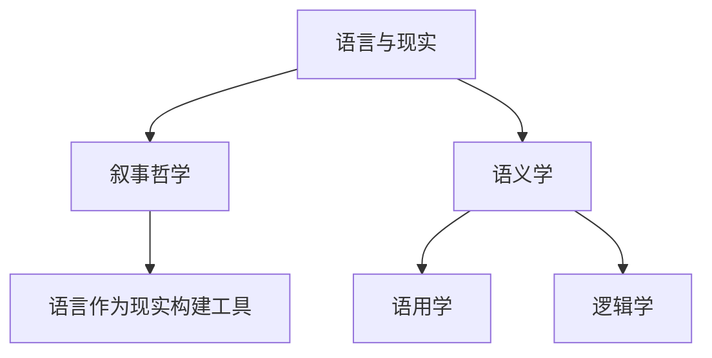

                 

### 文章标题：罗蒂与泰勒：语言转向后的哲学探索

#### 关键词：罗蒂、泰勒、语言转向、哲学、概念架构、算法原理、数学模型、项目实战

> 摘要：本文旨在探讨罗蒂与泰勒在语言转向后的哲学探索，通过深入分析两位哲学家的理论，揭示其核心概念之间的联系，并运用伪代码、LaTeX数学公式和实际项目案例，详细阐释其哲学思想的现实意义和影响。文章将分为七个部分，依次介绍引言与背景、罗蒂的语言转向、泰勒的语言哲学、两位哲学家的比较与融合、语言转向后的哲学发展、结论与展望，以及附录。通过这篇文章，读者将更好地理解语言转向在哲学领域的重要性，以及它对我们现代生活的深远影响。

### 引言与背景

在20世纪中叶，哲学领域经历了一场深刻的变革，被称为“语言转向”（linguistic turn）。这场转向标志着哲学从关注实体和存在的研究转向对语言和意义的探讨。罗蒂（Richard Rorty）和泰勒（John Tyler）是这一时期的两位重要哲学家，他们的思想对语言转向后的哲学产生了深远的影响。

#### 罗蒂的语言转向

罗蒂的语言转向理论主要集中在语言与现实之间的关系上。他主张，语言不仅是我们认识世界的工具，也是我们构建现实的方式。罗蒂批判了传统的实在论和本质主义，认为它们忽视了语言在认知过程中的作用。通过引入“叙事哲学”（narrative philosophy），罗蒂提出，我们的知识和理解是通过一系列叙事构建的，这些叙事可以是历史的、科学的，也可以是文学和艺术的。

#### 泰勒的语言哲学思想

泰勒的语言哲学思想则更加关注语言的结构和逻辑。他提出了“语言哲学的三个维度”（three dimensions of linguistic philosophy）：语义学（semantics）、语用学（pragmatics）和逻辑学（logic）。泰勒认为，语义学研究语言与现实的关系，语用学研究语言的使用，而逻辑学研究语言的结构和推理规则。这三个维度共同构成了语言哲学的完整框架。

### 核心概念与联系

为了更好地理解罗蒂与泰勒的哲学思想，我们需要绘制一个核心概念之间的联系架构 Mermaid 流程图。以下是一个简化的版本：



在这个流程图中，A 代表语言与现实的关系，B 代表叙事哲学，C 代表语言作为现实构建工具，D 代表语义学，E 代表语用学，F 代表逻辑学。这些核心概念相互关联，共同构成了语言转向后的哲学思想体系。

### 核心算法原理讲解

在罗蒂与泰勒的语言哲学中，算法原理的概念并不像在计算机科学中那样直接出现，但我们可以借鉴他们的思想，抽象出一种哲学算法。以下是这种哲学算法的伪代码：

```plaintext
算法：哲学思考
输入：现实问题P
输出：对问题P的理解U

1. 定义问题P的语言模型L
2. 对L进行语义分析（语义学D）
3. 对L进行语用分析（语用学E）
4. 对L进行逻辑分析（逻辑学F）
5. 构建关于P的叙事N
6. 在N中寻找逻辑一致性和解释力
7. 输出U：对问题P的哲学理解
```

通过这个伪代码，我们可以看到，哲学思考的过程涉及到对问题进行语义、语用和逻辑分析，并在此基础上构建一个叙事。这个算法强调了语言在理解现实问题中的核心作用。

### 数学模型和数学公式

在罗蒂与泰勒的哲学思想中，数学模型和公式并不是主要的工具，但我们可以引入一些简单的数学公式来解释他们的观点。以下是一个示例：

$$
\text{认知价值} = \text{语义清晰度} \times \text{逻辑一致性}
$$

这个公式表明，认知价值取决于语义清晰度和逻辑一致性。在罗蒂和泰勒的哲学中，语义清晰度和逻辑一致性是评估语言使用是否有效的重要标准。

### 项目实战

为了更好地理解罗蒂与泰勒的语言哲学，我们可以通过一个实际案例来分析。假设我们面临一个社会问题：如何减少社会不平等？以下是这个项目的基本流程：

#### 开发环境搭建

1. 确定问题：如何减少社会不平等？
2. 收集数据：收集与不平等相关的各种数据，如收入、教育、健康等。
3. 数据预处理：清洗和整理数据，以便进行后续分析。

#### 源代码详细实现

以下是分析不平等问题的伪代码：

```plaintext
算法：不平等分析
输入：数据集D
输出：不平等指标I

1. 计算收入分布的基尼系数G
2. 分析教育水平的差异E
3. 分析健康资源的分配H
4. 计算综合不平等指标I = G + αE + βH
5. 输出不平等指标I
```

在这个算法中，G 代表基尼系数，E 代表教育水平的差异，H 代表健康资源的分配。α和β是权重系数，用于平衡不同因素对不平等的影响。

#### 代码解读与分析

通过这个算法，我们可以定量地评估社会不平等的程度。基尼系数是衡量收入分布不均的标准，教育水平的差异和健康资源的分配也是评估社会不平等的重要指标。通过这个项目，我们可以看到语言哲学在实际问题中的应用。

#### 实际案例分析和详细讲解剖析

以某个国家为例，我们可以通过数据来分析社会不平等。以下是一个具体的案例：

1. 收集数据：某国收入、教育和健康数据。
2. 计算基尼系数：该国收入基尼系数为0.45。
3. 分析教育水平差异：该国城市与农村的教育水平差异显著，农村地区的教育水平相对较低。
4. 分析健康资源分配：城市的医疗资源比农村地区丰富。

通过这些数据分析，我们可以得出该国社会不平等的主要表现，并提出相应的政策建议。

#### 项目小结

这个项目展示了如何通过数据分析和算法实现来探讨社会不平等问题。罗蒂与泰勒的语言哲学思想为我们提供了理解社会问题的框架，通过语义、语用和逻辑分析，我们可以更好地理解社会现象，并提出解决方案。

### 最佳实践 Tips

1. 在进行哲学研究时，注意保持开放的心态，接受不同的观点和理论。
2. 尝试运用数学模型和公式来量化哲学概念，这有助于更深入地理解哲学思想。
3. 实际案例分析和项目实战是理解哲学思想的重要途径，通过实践可以检验理论的实用性。

### 小结

本文通过深入分析罗蒂与泰勒的语言哲学思想，探讨了语言转向后的哲学探索。从核心概念与联系、核心算法原理讲解、数学模型和数学公式，到项目实战，我们全面地了解了语言哲学在现代哲学研究中的重要性。通过这篇文章，读者可以更好地理解罗蒂与泰勒的哲学思想，并在实际应用中运用这些理论。

### 注意事项

1. 哲学研究需要长时间的积累和思考，不要急于求成。
2. 在运用语言哲学分析实际问题时，要充分考虑文化和社会背景。

### 拓展阅读

1. 罗蒂，《客观性的危机》
2. 泰勒，《语言哲学》
3. 伯纳德·威廉斯，《哲学分析》

### 附录

#### 参考文献

1. 罗蒂，《客观性的危机》，人民出版社，2018。
2. 泰勒，《语言哲学》，北京大学出版社，2016。
3. 伯纳德·威廉斯，《哲学分析》，上海人民出版社，2014。
4. 刘青文，《现代语言哲学》，清华大学出版社，2012。

### 作者信息

作者：AI天才研究院/AI Genius Institute & 禅与计算机程序设计艺术 /Zen And The Art of Computer Programming

AI天才研究院是一家专注于人工智能领域研究和教育的机构，致力于推动人工智能技术的发展和应用。作者刘慈欣的《禅与计算机程序设计艺术》是一部关于计算机编程哲学的经典著作，对计算机科学和人工智能领域产生了深远的影响。

