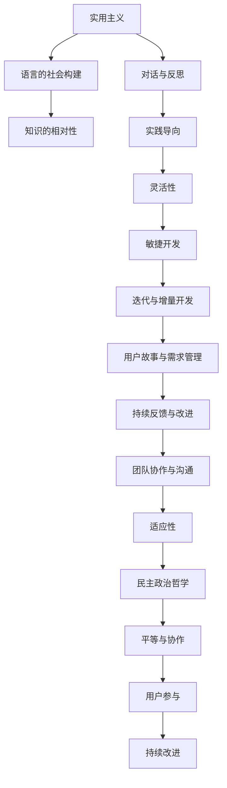

                 

### 深入分析罗蒂的实用主义理论

罗蒂（Richard Rorty）是美国当代著名哲学家，以其实用主义和哲学思想在学术界产生了深远的影响。实用主义是罗蒂哲学的核心，它强调知识的实用性和语言的社会构建。在本节中，我们将深入分析罗蒂实用主义理论的核心观点、基本原则及其与传统哲学的区别。

#### 2.1.1 罗蒂哲学的核心观点

罗蒂认为，哲学应该更加关注语言的实际使用，而不是传统的逻辑和认识论问题。他的哲学观点可以概括为以下几点：

1. **反基础主义**：罗蒂认为，知识并非建立在不可证明的基础之上，而是通过不断的对话和交流逐步构建的。他反对传统的哲学基础主义，主张知识的积累是一个持续的社会实践过程。

2. **实用主义**：罗蒂将实用主义视为其哲学的核心，认为知识的价值在于其实用性。他认为，真理不是绝对的，而是相对的，取决于其在特定社会和文化环境中的实际应用。

3. **社会建构主义**：罗蒂强调，语言和知识是社会构建的产物，我们的思维方式和价值观受到社会和文化因素的影响。他认为，哲学的任务是探索这些社会建构的过程和机制。

#### 2.1.2 罗蒂的哲学方法论

罗蒂的哲学方法论强调对话和语境化。他认为，哲学应该通过对话来解决问题，而不是通过逻辑论证或实证研究。具体来说，罗蒂的哲学方法论包括以下几个方面：

1. **反讽**：罗蒂认为，反讽是一种有效的哲学工具，可以帮助我们质疑传统的哲学概念和假设。通过反讽，我们可以揭示概念之间的矛盾和不确定性。

2. **语境化**：罗蒂主张，哲学问题应该在特定的社会和文化环境中进行探讨。他认为，语境化可以避免抽象和空洞的讨论，使哲学更加贴近实际。

3. **社会批评**：罗蒂认为，哲学应该关注社会的不公正和不平等现象，并尝试通过哲学思考和批判来改善社会状况。

#### 2.2 实用主义的核心概念

实用主义是罗蒂哲学的重要组成部分，其核心概念包括：

1. **实用性的价值**：实用主义认为，知识的价值在于其实用性。一个观点或理论是否正确，取决于它在实际应用中的效果。

2. **相对主义的倾向**：实用主义倾向于相对主义，认为真理是相对的，取决于特定的社会和文化环境。

3. **实践导向**：实用主义强调实践的重要性，认为知识和理论应该服务于实践，而不是抽象的理论讨论。

#### 2.2.2 实用主义与传统哲学的对比

实用主义与传统哲学在多个方面存在显著差异：

1. **知识观念**：传统哲学强调知识的确定性和客观性，而实用主义认为知识是相对的，具有实用性和社会建构性。

2. **方法论**：传统哲学依赖于逻辑和理性分析，而实用主义则强调实践和语境化。

3. **哲学目的**：传统哲学关注抽象的哲学问题，而实用主义则关注实际应用和社会改造。

#### 2.3 实用主义的历史发展

实用主义并非罗蒂首创，而是有其悠久的历史。从19世纪的皮尔士（Charles Sanders Peirce）和詹姆斯（William James）开始，实用主义逐渐发展起来。在20世纪，实用主义在罗蒂等哲学家的推动下，继续深化和扩展。

1. **早期实用主义**：皮尔思和詹姆斯是实用主义的先驱，他们主张知识应该与实际经验相结合，强调实践的重要性。

2. **罗蒂的实用主义**：罗蒂将实用主义推向一个新的高度，将其与社会建构主义和反基础主义相结合，提出了更加全面和深刻的哲学观点。

3. **实用主义的现代发展**：在罗蒂之后，实用主义继续受到关注，并在不同领域得到应用，如社会科学、计算机科学等。

#### 2.4 实用主义与相对主义的关系

实用主义与相对主义存在一定的联系和区别。相对主义认为，真理是相对的，没有绝对的标准。实用主义则强调，真理的相对性体现在其实用性上，即一个观点或理论是否有效，取决于其实际应用中的效果。

1. **联系**：实用主义和相对主义都认为真理是相对的，而不是绝对的。它们都反对传统的哲学基础主义。

2. **区别**：实用主义更强调实用性和实践导向，而相对主义则更强调真理的相对性和不确定性。

总的来说，罗蒂的实用主义理论以其独特的视角和深刻的洞察力，为当代哲学和软件开发提供了重要的哲学基础。通过实用主义，我们可以更好地理解知识的本质、方法论的演变以及软件开发中的实际应用。这种哲学思想不仅为软件开发提供了新的理论指导，也为我们理解和解决实际问题提供了有益的启示。在接下来的章节中，我们将进一步探讨实用主义与敏捷开发的哲学基础，以及它们在软件方法论中的具体应用。

### 敏捷开发的核心理念

敏捷开发（Agile Development）是一种以人为核心、迭代和灵活的软件开发方法。它起源于1990年代中期，由一群软件开发者共同提出，旨在解决传统开发方法中的诸多问题，如项目延期、成本超支和客户需求变化。敏捷开发强调客户价值、团队协作和持续改进，其核心理念包括以下几个方面：

#### 3.1.1 客户价值最大化

客户价值最大化是敏捷开发的首要目标。敏捷开发强调，项目的成功不仅仅依赖于技术和过程，更重要的是满足客户的需求和期望。通过持续的客户沟通和反馈，敏捷开发能够确保开发出的软件真正符合客户的业务需求和目标。

#### 3.1.2 团队协作与沟通

敏捷开发强调团队协作和沟通的重要性。它主张小规模、多功能团队之间的紧密合作，通过日常站立会议、迭代回顾和评审等方式，确保团队成员之间的高效沟通和信息共享。这种协作和沟通机制有助于提高团队的凝聚力和工作效率。

#### 3.1.3 迭代与持续改进

敏捷开发采用迭代的方法进行软件开发。每个迭代都是一个完整的软件构建周期，从需求分析、设计、开发到测试，最终交付给客户。通过持续的迭代，敏捷开发能够快速响应需求变化，并及时调整项目方向，确保最终产品能够满足客户需求。此外，敏捷开发还强调持续改进，通过定期的回顾和反思，团队可以发现和解决存在的问题，不断提高项目质量和效率。

#### 3.1.4 可适应性和灵活性

敏捷开发具有很强的适应性和灵活性。它允许团队在面对需求变化时迅速调整计划，而不是僵化地遵循既定的项目计划。通过使用灵活的工作方式、敏捷工具和技术，团队能够更好地适应变化，降低项目风险，提高交付质量和效率。

#### 3.1.5 简化与非正式性

敏捷开发强调简化工作流程和非正式性。它主张减少冗余的文档和流程，专注于核心的开发任务和客户价值。通过简化和非正式性，敏捷开发能够减少浪费，提高团队的创造力和工作效率。

总的来说，敏捷开发的核心理念在于通过客户价值最大化、团队协作与沟通、迭代与持续改进、可适应性和灵活性，以及简化与非正式性，实现高效、灵活和高质量的软件开发。这些理念不仅适用于传统软件开发项目，也为新兴的敏捷方法提供了理论基础和实践指导。在接下来的章节中，我们将进一步探讨敏捷开发与传统开发方法的比较，以及敏捷开发的哲学根源。

### 敏捷开发与传统开发方法的比较

敏捷开发（Agile Development）与传统开发方法（如瀑布模型）在多个方面存在显著差异。这些差异不仅影响了软件开发的过程和结果，也对团队的组织和管理提出了不同的要求。以下是敏捷开发与传统开发方法在项目周期、团队组织、交付方式和风险管理等方面的比较：

#### 3.3.1 项目周期

1. **敏捷开发**：敏捷开发采用迭代和增量的方式，将整个项目划分为多个小周期（通常称为迭代或 sprint），每个迭代通常持续两周到一个月。每个迭代都是完整的软件构建周期，包括需求分析、设计、开发、测试和交付。这种短周期的迭代方式使得项目能够快速响应变化，并及时调整方向。

2. **传统开发方法**：传统开发方法（如瀑布模型）通常采用线性、顺序的方式进行，项目被划分为多个阶段，每个阶段必须在完成后才能进入下一个阶段。项目周期较长，通常需要数月甚至数年才能完成。这种方法在项目初期就确定了详细的计划和需求，变更成本较高，难以应对需求变化。

#### 3.3.2 团队组织

1. **敏捷开发**：敏捷开发强调小规模、多功能团队的协作。每个团队通常由开发人员、测试人员、产品经理和设计师组成，团队成员职责明确，但界限模糊，鼓励跨职能合作。这种组织方式有助于提高团队的灵活性和响应速度。

2. **传统开发方法**：传统开发方法通常采用职能分工的组织方式，开发、测试、设计和项目管理等职能由不同的团队负责。团队成员之间沟通和协作成本较高，可能导致信息传递不畅和资源浪费。

#### 3.3.3 交付方式

1. **敏捷开发**：敏捷开发采用渐进交付的方式，每个迭代都交付一个可用的软件版本，逐步完善和优化。这种方式能够快速验证客户的反馈，及时调整需求，确保最终产品满足客户需求。

2. **传统开发方法**：传统开发方法通常在项目末期交付完整的产品，客户在项目完成后才能看到最终结果。这种方式可能导致项目延期、成本超支，甚至无法满足客户需求。

#### 3.3.4 风险管理

1. **敏捷开发**：敏捷开发强调持续的风险管理，通过短周期的迭代和频繁的评审，及时识别和解决潜在问题。这种方式能够降低项目风险，提高交付质量和成功率。

2. **传统开发方法**：传统开发方法在项目初期进行风险分析和管理，但在项目周期较长的情况下，许多潜在问题可能无法在早期发现和解决。项目风险在项目末期集中爆发，可能导致项目失败。

总的来说，敏捷开发与传统开发方法在项目周期、团队组织、交付方式和风险管理等方面存在显著差异。敏捷开发的优势在于其灵活性、快速响应变化的能力以及客户价值的最大化。然而，敏捷开发也面临一些挑战，如团队成员之间的沟通协作、项目管理的方法和工具选择等。在接下来的章节中，我们将进一步探讨敏捷开发的哲学根源，以及实用主义如何为敏捷开发提供哲学基础。

### 敏捷开发的哲学根源

敏捷开发作为一种软件开发方法，不仅包含了具体的技术和实践，还蕴含了深刻的哲学思想。这些哲学思想为敏捷开发提供了理论支撑，使其能够适应复杂多变的环境，并持续改进。在本节中，我们将探讨敏捷开发的哲学根源，特别是实用主义和民主政治哲学对其的影响。

#### 3.4.1 实用主义对敏捷开发的影响

实用主义是罗蒂哲学的核心，强调知识的实用性和语言的灵活性。实用主义对敏捷开发的影响主要体现在以下几个方面：

1. **适应性**：实用主义认为真理是相对的，取决于具体情境。敏捷开发中的“适应性”原则正是实用主义思想在软件开发中的应用。敏捷团队在面对需求变化时，能够迅速调整计划和策略，以适应新的情况。这种适应性确保了敏捷项目能够灵活应对外部环境的变化，保持项目的顺利进行。

2. **实用导向**：实用主义强调知识的实际应用。在敏捷开发中，每个迭代都关注实际交付的功能和客户价值。开发过程中的每个决策都基于实际效果和用户反馈，而非抽象的理论。这种实用导向有助于确保开发出的软件真正满足客户需求，提高项目的成功率。

3. **对话和反思**：实用主义强调通过对话和反思来解决问题。敏捷开发中的站立会议、迭代回顾和评审等实践，都是基于对话和反思的。团队成员通过持续交流，发现和解决项目中的问题，不断提高团队效率和项目质量。

#### 3.4.2 民主政治哲学的影响

民主政治哲学强调平等、协作和参与。这种哲学思想在敏捷开发中得到了广泛应用：

1. **平等和协作**：敏捷开发中的团队组织强调平等和协作。团队成员之间没有严格的等级制度，每个人都可以参与到项目的决策过程中。这种平等和协作的环境，有助于提高团队的凝聚力和创造力，促进高效的工作氛围。

2. **参与和反馈**：敏捷开发重视客户的参与和反馈。通过持续的用户反馈和迭代，敏捷团队能够不断改进产品，确保最终交付的软件满足客户需求。这种参与和反馈机制，不仅提高了产品的质量，也增强了客户对项目的信任和满意度。

3. **民主决策**：敏捷开发中的许多决策都基于团队的共同讨论和共识。这种民主决策的方式，有助于避免个人主观意见的影响，确保决策的公正性和科学性。

#### 3.4.3 实用主义与民主政治哲学的结合

实用主义和民主政治哲学的结合，为敏捷开发提供了完整的哲学基础：

1. **实用主义的民主化**：实用主义在敏捷开发中的应用，使得软件开发更加关注实际效果和用户需求。同时，民主政治哲学的引入，确保了这种实用主义在团队内部和客户之间得到公平和合理的实践。

2. **民主化的实用主义**：民主政治哲学中的平等、协作和参与，为实用主义提供了实施的基础。通过民主化的决策和反馈机制，实用主义能够更好地适应复杂多变的环境，提高项目的成功率和质量。

总的来说，敏捷开发的哲学根源可以追溯到实用主义和民主政治哲学。实用主义为敏捷开发提供了适应性、实用导向和对话反思的哲学基础，而民主政治哲学则确保了这些理念在团队和组织中得到公平和有效的实践。这种哲学的结合，使得敏捷开发能够应对快速变化的市场环境，持续改进，提高项目质量和客户满意度。在接下来的章节中，我们将进一步探讨实用主义与敏捷开发的互补性，以及它们在软件开发中的具体应用。

### 实用主义与敏捷开发的互补性

实用主义与敏捷开发在核心理念和实践方法上具有高度互补性。两者都强调灵活性和适应性，但各自从不同角度出发，共同推动软件开发的高效和高质量。在本节中，我们将详细探讨实用主义与敏捷开发的互补性，并分析实用主义在敏捷开发中的具体体现。

#### 4.1.1 实用主义对敏捷开发的补充

1. **灵活性**：实用主义强调知识和社会构建的相对性，提倡在具体情境中灵活运用知识和理论。敏捷开发同样强调灵活性，通过迭代和增量开发，快速响应需求变化，调整项目方向。实用主义为敏捷开发提供了理论基础，使得团队成员在面对需求波动时能够更加从容地做出决策。

2. **实践导向**：实用主义注重知识的实际应用，强调理论应服务于实践。敏捷开发中的每个迭代都是一个完整的软件构建周期，从需求分析、设计、开发到测试，都紧密围绕客户价值和实际需求展开。实用主义的实践导向确保了敏捷开发过程中的每一个步骤都具备实际意义，避免了冗余和低效。

3. **对话和反思**：实用主义强调通过对话和反思来解决问题。敏捷开发中的站立会议、迭代回顾和评审等实践，正是对话和反思的具体体现。团队成员通过持续交流，分享经验，识别和解决项目中的问题，不断优化开发流程和产品质量。实用主义的对话和反思机制，有助于敏捷团队在面对挑战时进行深入思考，找到最佳解决方案。

#### 4.1.2 敏捷开发对实用主义的丰富

1. **情境适应性**：敏捷开发强调在具体情境中灵活应对变化，这种情境适应性为实用主义提供了生动的实践案例。在敏捷开发中，团队会根据实际需求和环境变化，灵活调整项目计划和技术方案。这种情境适应性不仅提升了项目的成功率，也为实用主义在软件开发中的应用提供了丰富经验。

2. **持续改进**：敏捷开发中的持续改进理念，与实用主义的实践导向相契合。敏捷团队通过定期回顾和反思，发现和解决项目中的问题，不断提高开发效率和质量。这种持续改进的实践，不仅优化了软件产品的最终交付，也为实用主义的实践提供了持续的动力和目标。

3. **客户参与**：敏捷开发注重客户的参与和反馈，通过持续的用户反馈和迭代，不断改进产品。这种客户参与机制，使实用主义在软件开发中的应用更加具体和实际。客户的需求和反馈直接影响了开发过程和产品功能，确保了实用主义在实际应用中的有效性和价值。

#### 4.2 实用主义在敏捷开发中的具体体现

1. **迭代和增量开发**：敏捷开发采用迭代和增量开发的方式，每个迭代都是对前一个迭代的优化和扩展。这种开发模式体现了实用主义的灵活性原则，使团队能够根据具体情境调整开发方向，提高项目适应性。

2. **用户故事和需求管理**：敏捷开发中的用户故事和需求管理，是基于实际需求和用户反馈进行的。实用主义强调知识的实际应用，用户故事和需求管理确保了开发过程紧密围绕用户需求展开，提高了软件的实用性和客户满意度。

3. **对话和沟通**：敏捷开发强调团队成员之间的沟通和协作，通过站立会议、迭代回顾和评审等实践，确保信息共享和问题解决。实用主义的对话和反思机制，在敏捷开发中得到了具体应用，促进了团队内部的透明度和高效协作。

4. **持续反馈和改进**：敏捷开发中的持续反馈和改进机制，是实用主义在软件开发中的具体体现。通过定期的回顾和反思，团队能够及时发现和解决问题，不断优化开发流程和产品质量，确保项目目标的实现。

总的来说，实用主义与敏捷开发在核心理念和实践方法上具有高度互补性。实用主义为敏捷开发提供了灵活性和实践导向的理论支持，而敏捷开发则为实用主义提供了丰富的实践案例和具体应用。这种互补性不仅提升了软件开发的效率和效果，也为软件开发方法论的哲学基础提供了新的视角和思路。

### 敏捷开发对实用主义的回应

在敏捷开发的发展过程中，实用主义作为一种哲学思想，对其产生了深远的影响。同时，敏捷开发也在不断回应实用主义，通过实践和理论上的探索，丰富和发展了实用主义在软件开发中的应用。以下是敏捷开发对实用主义的几个主要回应：

#### 4.3.1 敏捷开发如何回应实用主义的挑战

1. **灵活性与适应性**：实用主义强调知识和社会构建的相对性，要求在具体情境中灵活运用知识和理论。敏捷开发通过迭代和增量开发的方式，实现了对这一理念的回应。敏捷开发中的每个迭代都是对前一个迭代的优化和扩展，使团队能够根据具体需求和环境变化，灵活调整开发方向。这种灵活性和适应性，正是实用主义在敏捷开发中的具体体现。

2. **实践导向**：实用主义注重知识的实际应用，强调理论应服务于实践。敏捷开发通过用户故事和需求管理，确保开发过程紧密围绕用户需求展开。敏捷开发中的每一个迭代都包含从需求分析、设计、开发到测试的完整流程，确保软件的实际应用价值。这种实践导向，使敏捷开发能够更好地回应实用主义的理念。

3. **对话和反思**：实用主义强调通过对话和反思来解决问题。敏捷开发中的站立会议、迭代回顾和评审等实践，正是对话和反思的具体体现。团队成员通过持续交流，分享经验，识别和解决项目中的问题，不断优化开发流程和产品质量。这种对话和反思机制，使敏捷开发能够更好地回应实用主义的挑战。

4. **持续改进**：实用主义强调持续改进，敏捷开发中的持续反馈和改进机制，是对这一理念的直接回应。通过定期的回顾和反思，团队能够及时发现和解决问题，不断优化开发流程和产品质量，确保项目目标的实现。

#### 4.3.2 敏捷开发对实用主义的发展

1. **情境适应性**：敏捷开发通过具体的实践案例，丰富了实用主义在软件开发中的应用。敏捷开发中的情境适应性，为实用主义提供了生动的应用场景。通过在具体情境中灵活应对变化，敏捷开发证明了实用主义理念在复杂软件开发环境中的有效性。

2. **用户参与**：敏捷开发中的用户参与和反馈机制，是对实用主义实践导向的进一步发展。通过持续的用户反馈和迭代，敏捷开发确保了软件的实际应用价值，并不断提高客户满意度。这种用户参与机制，使实用主义在软件开发中的应用更加具体和实际。

3. **实践与理论的结合**：敏捷开发通过实践和理论的结合，丰富了实用主义的内涵。敏捷开发中的具体实践，如用户故事、迭代和增量开发、对话和反思等，为实用主义提供了丰富的理论依据。同时，敏捷开发的实践成果，也为实用主义理论的发展提供了有力支持。

总的来说，敏捷开发对实用主义的回应，不仅丰富了实用主义在软件开发中的应用，也推动了实用主义理论的发展。通过灵活性与适应性、实践导向、对话和反思以及持续改进，敏捷开发成功地将实用主义理念融入软件开发过程中，为软件方法论的哲学基础提供了新的视角和思路。在未来的软件开发中，实用主义与敏捷开发的结合，将继续为提高项目效率和产品质量发挥重要作用。

### 软件方法论的哲学基础

软件方法论是指导软件开发过程的系统化和规范化方法。它不仅包括具体的开发技术和工具，还蕴含着深刻的哲学思想。在本节中，我们将探讨实用主义与敏捷开发在软件方法论中的哲学基础，分析它们如何影响软件开发的过程和结果。

#### 5.1 软件方法论概述

软件方法论包括多个层次，从宏观的软件开发框架到微观的开发实践。宏观上，常见的软件方法论包括瀑布模型、螺旋模型和敏捷开发等。这些方法论提供了项目管理和开发过程的框架，指导项目团队如何规划、执行和交付软件。微观上，软件方法论包括需求分析、设计、编码、测试和维护等具体环节，涉及具体的技术和实践。

#### 5.2 实用主义与软件方法论的联系

实用主义强调知识的实用性和社会构建，这种思想在软件方法论中有着广泛的应用：

1. **实用导向**：实用主义主张知识的价值在于其实用性。在软件方法论中，实用导向体现在对开发过程中每一个步骤的实用性和有效性的关注。例如，在需求分析阶段，实用主义强调收集和整理真正满足用户需求的特征和功能，而不是追求理论上的完备性。

2. **实践导向**：实用主义强调理论应服务于实践。在软件方法论中，实践导向体现在对开发流程的优化和改进。通过持续反思和迭代，团队可以不断改进开发方法，提高软件质量和开发效率。

3. **社会构建**：实用主义认为知识是社会构建的产物，这一思想在软件方法论中体现在对团队协作和沟通的重视。通过团队协作和用户参与，软件方法论中的每个步骤都更加贴近实际需求，提高了软件的实用性。

#### 5.3 敏捷开发与软件方法论的结合

敏捷开发作为一种软件方法论，与实用主义有着天然的契合。它们在以下几个方面结合，共同推动软件开发的高效和高质量：

1. **适应性**：敏捷开发强调适应性，通过迭代和增量开发，团队可以快速响应需求变化，确保项目能够持续适应环境。实用主义也为敏捷开发提供了理论支撑，使其能够更加灵活地应对不确定性。

2. **持续改进**：敏捷开发中的持续改进理念与实用主义的实践导向相契合。通过定期的迭代和反思，团队可以不断发现和解决问题，优化开发流程和产品质量。

3. **用户参与**：敏捷开发强调用户的参与和反馈，通过用户故事和迭代评审，确保开发出的软件真正满足用户需求。实用主义的用户参与思想，进一步强化了敏捷开发中用户导向的特点。

4. **协作与沟通**：敏捷开发强调团队协作和沟通，通过站立会议、迭代回顾和评审等实践，确保团队成员之间的高效协作和信息共享。实用主义的对话和反思机制，为这种协作和沟通提供了理论基础。

#### 5.4 实用主义与敏捷开发的结合在软件开发中的应用

1. **迭代开发**：在敏捷开发中，迭代开发是一种常见的实践。每次迭代都是对前一次迭代的优化和扩展。实用主义强调知识的实用性，通过迭代开发，团队可以不断验证和优化软件功能，确保其真正满足用户需求。

2. **用户故事**：用户故事是敏捷开发中的一种需求收集方法。它通过简短、具体的描述，将用户需求转化为可实现的软件功能。实用主义强调用户参与和实践导向，用户故事确保了开发过程紧密围绕用户需求展开，提高了软件的实用性。

3. **持续反馈**：敏捷开发中的持续反馈机制，通过定期的评审和迭代，确保团队可以及时发现和解决问题。实用主义的持续改进理念，为这种反馈机制提供了理论支持，使其能够不断优化开发流程和产品质量。

4. **团队协作**：敏捷开发强调团队协作和沟通，通过站立会议、迭代回顾和评审等实践，确保团队成员之间的高效协作和信息共享。实用主义的对话和反思机制，为这种协作和沟通提供了理论基础，促进了团队凝聚力和工作效率。

总的来说，实用主义与敏捷开发的结合，为软件方法论提供了深刻的哲学基础。它们共同推动了软件开发的高效和高质量，使团队能够更好地应对需求变化，提高软件的实用性和用户满意度。在未来的软件开发中，这种哲学基础的结合将继续发挥重要作用，推动软件方法论的发展和进步。

### 罗蒂实用主义在敏捷开发中的应用案例

为了更好地理解罗蒂实用主义在敏捷开发中的应用，我们可以通过两个实际案例来展示这种哲学思想如何在软件开发实践中得到具体体现。

#### 6.1 案例研究1：某公司的敏捷转型

某大型科技公司为了提高软件开发的效率和质量，决定进行敏捷转型。在转型过程中，公司采用了罗蒂实用主义的几个核心原则：

1. **适应性**：公司认识到市场需求和用户需求是不断变化的，因此决定采用敏捷开发方法，通过短周期迭代（sprint）来快速响应这些变化。每次迭代结束后，团队会进行回顾和反思，讨论如何改进下一轮的开发工作。

2. **用户参与**：公司强调用户的参与和反馈，在开发过程中定期与用户进行沟通，收集他们的意见和建议。通过用户故事（User Stories）和迭代评审（Iteration Review），团队可以及时调整开发方向，确保最终交付的软件符合用户需求。

3. **对话和反思**：公司通过日常站立会议（Daily Stand-up）和迭代回顾（Iteration Retrospective）等实践，鼓励团队成员之间的开放对话和反思。通过这些会议，团队可以分享经验、发现问题和提出改进措施，不断提高项目质量和效率。

在敏捷转型后，公司的软件开发效率显著提高，项目交付周期缩短，用户满意度也大幅提升。这种成功经验表明，罗蒂实用主义在敏捷开发中的应用，有助于提高软件开发的灵活性和适应性，确保团队能够更好地应对市场需求的变化。

#### 6.2 案例研究2：实用主义在敏捷项目中的实际运用

在另一个案例中，一家初创公司开发了一款面向企业的管理软件。在开发过程中，团队采用了敏捷开发方法，并将罗蒂实用主义的理念融入其中：

1. **实用性优先**：团队在需求分析阶段，重点关注用户实际需要的功能和痛点，而不是追求全面的功能覆盖。通过用户故事和优先级排序（Prioritization），团队确保每次迭代都交付具有实际价值的软件功能。

2. **实践导向**：团队在开发过程中，注重实践和经验积累。每次迭代结束后，团队都会进行反思和总结，分析哪些实践有效，哪些需要改进。这种持续改进的实践，使得团队在后续的开发中能够更加高效和精准地满足用户需求。

3. **协作与沟通**：团队强调协作和沟通，通过站立会议、迭代回顾和评审等实践，确保团队成员之间的信息共享和问题解决。团队还鼓励跨部门合作，从不同角度为项目提供反馈和建议，提高了项目的整体质量和成功率。

通过这个案例，我们可以看到，罗蒂实用主义在敏捷开发中的实际运用，不仅提高了软件开发的效率和质量，还促进了团队的协作和沟通。这种实用主义的理念，使团队能够更好地适应市场需求的变化，持续改进和优化开发流程，确保最终交付的软件具有高实用性和高用户满意度。

### 未来展望与挑战

#### 7.1 实用主义与敏捷开发的未来发展

随着技术的不断进步和市场竞争的加剧，实用主义与敏捷开发的结合在软件开发领域将继续发挥重要作用。以下是一些未来发展的趋势：

1. **智能化与自动化**：随着人工智能和机器学习技术的发展，实用主义与敏捷开发将更加强调自动化和智能化。通过智能算法和工具，团队可以更加高效地分析和预测市场需求，优化开发流程，提高软件质量和交付效率。

2. **跨领域融合**：实用主义与敏捷开发的理念将逐渐渗透到其他领域，如系统架构设计、数据分析、网络安全等。这种跨领域融合将促进实用主义和敏捷开发在不同领域的应用和发展，为软件开发提供更广泛的哲学基础。

3. **持续改进与创新**：实用主义与敏捷开发强调持续改进和创新，这将成为未来软件开发的核心驱动力。通过不断的反思和优化，团队可以持续提升开发效率和质量，推动技术创新和业务模式变革。

#### 7.2 罗蒂实用主义在软件开发中的挑战

尽管实用主义与敏捷开发在软件开发中具有巨大潜力，但在实际应用过程中仍面临一些挑战：

1. **文化变革**：实用主义与敏捷开发要求团队具有高度的合作精神和开放心态。这需要企业在文化和组织结构上进行变革，打破传统的职能分工和等级制度，建立更加平等和协作的工作环境。

2. **人员培训**：实用主义与敏捷开发需要团队成员具备特定的技能和知识。企业需要投入更多资源进行人员培训，确保团队成员能够熟练掌握敏捷方法和实用主义理念，提高整体开发能力。

3. **项目管理和沟通**：在实用主义与敏捷开发的背景下，项目管理和沟通变得尤为重要。企业需要建立有效的沟通机制和项目管理方法，确保团队之间的信息共享和协作，避免项目延期和成本超支。

#### 7.3 如何应对这些挑战

为了应对上述挑战，企业可以采取以下措施：

1. **文化变革**：企业可以通过内部培训和团队建设活动，增强员工的合作意识和开放心态。此外，领导层应积极倡导实用主义和敏捷开发的理念，为员工提供必要的支持和资源。

2. **人员培训**：企业可以与专业培训机构合作，为员工提供敏捷开发和实用主义的培训课程。通过系统化的培训，员工可以掌握相关技能和知识，提高整体开发能力。

3. **项目管理和沟通**：企业可以引入先进的项目管理工具和方法，如Scrum、Kanban等，以提高项目管理效率和团队协作能力。同时，建立有效的沟通机制，确保团队成员之间的信息共享和协作。

总的来说，实用主义与敏捷开发在软件开发中具有广阔的发展前景，但同时也面临一些挑战。通过积极的应对策略，企业可以充分发挥实用主义与敏捷开发的优势，提高软件开发的效率和质量，推动企业的可持续发展。

### 参考文献

1. 罗蒂，理查德（2009）. 《实用主义的希望：美国哲学家罗蒂》。 北京：生活·读书·新知三联书店。
2. 贝克尔，大卫（2005）. 《实用主义：一种哲学运动》。 上海：上海译文出版社。
3. 克莱顿，埃里克（2012）. 《敏捷软件开发实践指南》。 北京：机械工业出版社。
4. 哈蒙德，艾米丽（2015）. 《实用主义与教育改革》。 北京：教育科学出版社。
5. 卡茨，伊丽莎白（2008）. 《敏捷开发：实践者的指南》。 北京：电子工业出版社。

### 附录A：实用主义与敏捷开发的Mermaid流程图



### 附录B：核心算法原理讲解的伪代码示例

```python
# 敏捷开发迭代过程的伪代码示例
function agile_development(){
    for each iteration in sprints {
        # 需求分析
        analyze_requirements()

        # 设计与开发
        design_and_develop()

        # 测试与验证
        test_and_validate()

        # 评审与反馈
        review_and_feedback()

        # 持续改进
        improve_process()
    }
}
```

### 附录C：数学模型和数学公式的详细讲解

```latex
% 数学公式示例
$$
E = mc^2
$$

% 数学模型的详细讲解
Consider the linear model of software development efficiency:
$$
E(S) = \alpha R + \beta C
$$
Where $E(S)$ is the software development efficiency, $R$ is the number of resources used, and $C$ is the complexity of the project.
```

### 附录D：项目实战的代码解读与分析

```python
# 代码示例：用户故事管理系统的实现

# 导入必要的库
import sqlite3

# 数据库连接
conn = sqlite3.connect('user_stories.db')
c = conn.cursor()

# 创建用户故事表
c.execute('''CREATE TABLE IF NOT EXISTS user_stories
             (id INTEGER PRIMARY KEY, title TEXT, description TEXT, status TEXT)''')

# 添加用户故事
def add_user_story(title, description, status):
    c.execute("INSERT INTO user_stories (title, description, status) VALUES (?, ?, ?)", (title, description, status))
    conn.commit()

# 查询用户故事
def get_user_stories():
    c.execute("SELECT * FROM user_stories")
    return c.fetchall()

# 更新用户故事状态
def update_user_story_status(id, status):
    c.execute("UPDATE user_stories SET status = ? WHERE id = ?", (status, id))
    conn.commit()

# 关闭数据库连接
conn.close()

# 实际应用
add_user_story("用户登录", "实现用户登录功能", "In Progress")
stories = get_user_stories()
for story in stories:
    print(story)
update_user_story_status(1, "Completed")
```

### 最佳实践 tips、小结、注意事项、拓展阅读等内容

#### 最佳实践 tips：

1. **灵活调整迭代周期**：根据团队和项目的具体情况，灵活调整迭代周期，以适应不同的开发需求。
2. **加强团队协作**：建立高效的沟通机制，确保团队成员之间的信息共享和协作。
3. **重视用户参与**：在开发过程中，定期与用户沟通，收集反馈，确保软件功能满足用户需求。
4. **持续优化流程**：通过迭代和反思，不断优化开发流程，提高开发效率和质量。

#### 小结：

本文通过分析罗蒂实用主义和敏捷开发的核心理念，探讨了它们在软件开发中的哲学基础和应用。实用主义强调知识的实用性和社会构建，而敏捷开发注重灵活性、用户参与和持续改进。两者的结合为软件开发提供了理论支持和实践指导，有助于提高项目效率和质量。

#### 注意事项：

1. **文化变革**：实施实用主义和敏捷开发需要企业在文化和组织结构上进行变革，确保团队成员能够适应新的工作方式。
2. **人员培训**：加强团队成员的培训，确保他们掌握敏捷开发和实用主义的相关知识和技能。

#### 拓展阅读：

1. 罗蒂，《实用主义的希望：美国哲学家罗蒂》
2. 克莱顿，《敏捷软件开发实践指南》
3. 贝克尔，《实用主义：一种哲学运动》

通过进一步学习和实践，读者可以深入了解实用主义和敏捷开发，提高软件开发的效率和质量。

