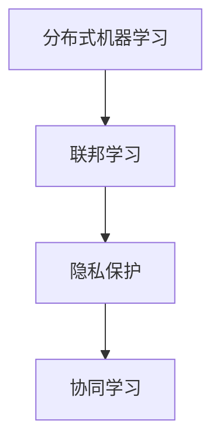
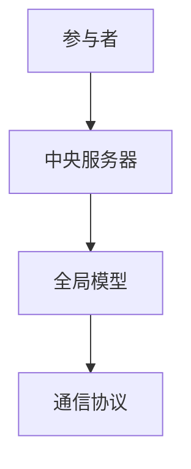
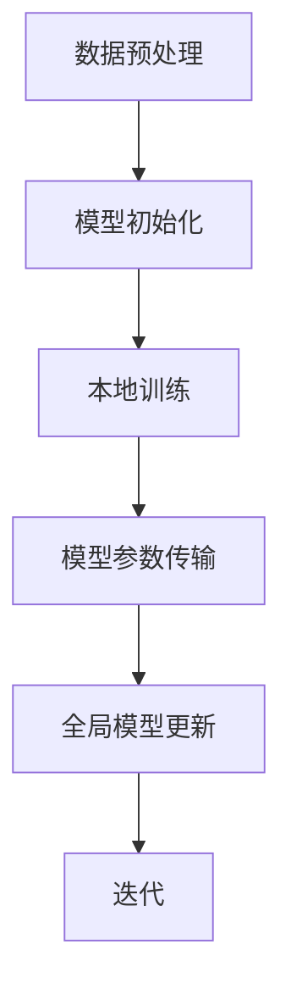

                 

### 1. 引言与联邦学习概述

在当今的信息化时代，机器学习已经成为推动科技进步和业务创新的重要力量。然而，随着数据隐私和安全问题的日益突出，如何在保证数据隐私的同时，有效地进行机器学习成为了亟需解决的问题。联邦学习（Federated Learning）作为一种新兴的分布式机器学习方法，提供了保护隐私的数据协同学习的解决方案。

**核心概念与联系**

为了理解联邦学习的核心概念，我们需要先了解以下几个关键概念：

1. **分布式机器学习**：指多个计算节点协作进行机器学习的过程，每个节点都有自己的数据集和模型。
2. **隐私保护**：指在处理数据时，确保数据不被泄露和滥用的措施。
3. **协同学习**：指多个参与者共同学习和优化模型的过程。

下面是一个Mermaid流程图，展示了这些核心概念之间的相互关系：



**引言**

传统的机器学习方法通常需要将数据集中到一个中央服务器进行处理。这种方式虽然能够提高模型的性能，但却带来了严重的隐私问题。数据一旦上传到中央服务器，就可能面临泄露、滥用和监控的风险。此外，许多实际应用场景中的数据分布在不同的组织和设备中，难以集中处理。

**联邦学习的必要性**

联邦学习旨在解决这些隐私和安全问题。它的核心思想是让数据留在本地设备上，通过分布式协同学习的方式，共同优化一个全局模型。这样，不仅能够保证数据隐私，还能够实现高效的机器学习。

**联邦学习定义**

联邦学习是一种分布式机器学习方法，它允许多个参与者（如手机、智能设备等）在本地维护自己的模型，并通过安全通信协议，共同更新一个全局模型。联邦学习的目标是通过隐私保护的方式，实现全局模型的优化。

### 核心概念与联系

为了更深入地理解联邦学习的概念，我们需要详细探讨以下几个核心组成部分：

**1. 分布式机器学习基础**

分布式机器学习是一种利用多台计算机协同工作来训练模型的方法。其主要目标是提高模型的训练效率和处理大量数据的能力。在分布式机器学习中，每个计算节点都拥有自己的数据集和模型参数。通过相互通信，节点可以共同更新模型参数，以达到更好的训练效果。

**2. 隐私保护**

隐私保护是联邦学习的核心目标之一。它涉及到如何确保数据在传输和存储过程中不被泄露或滥用。隐私保护机制包括加密、差分隐私、同态加密等技术，这些技术可以在不暴露原始数据的前提下，实现数据的处理和分析。

**3. 协同学习**

协同学习是联邦学习的另一个关键组成部分。它指的是多个参与者共同学习和优化模型的过程。在联邦学习中，每个参与者都通过本地训练更新自己的模型，并通过安全通信协议，将更新后的模型参数发送给其他参与者。通过这种方式，参与者可以共同优化一个全局模型，而无需交换原始数据。

**4. 联邦学习架构**

联邦学习架构通常包括以下几个部分：

- **参与者**：指参与联邦学习的各个实体，如手机、智能设备、服务器等。
- **中央服务器**：负责协调参与者的模型更新，并维护全局模型。
- **通信协议**：确保参与者之间的安全通信和数据传输。

下面是一个Mermaid流程图，展示了联邦学习的基本架构：



### 联邦学习框架

联邦学习的框架可以概括为以下几个步骤：

1. **数据预处理**：每个参与者对本地数据进行预处理，如去噪声、归一化等。
2. **模型初始化**：中央服务器初始化全局模型，并将模型参数发送给参与者。
3. **本地训练**：参与者使用本地数据和全局模型参数进行训练，并更新自己的模型参数。
4. **模型参数传输**：参与者将更新后的模型参数发送给中央服务器。
5. **全局模型更新**：中央服务器接收参与者发送的模型参数，并更新全局模型。
6. **迭代**：重复上述步骤，直到达到预定的训练目标或达到一定的迭代次数。

下面是一个Mermaid流程图，展示了联邦学习的工作流程：



通过上述框架和流程，联邦学习实现了数据隐私保护和高效的模型训练。接下来，我们将进一步探讨联邦学习中的核心算法原理。

### 2.1 分布式机器学习基础

分布式机器学习是一种通过将数据集分布在多个计算节点上进行训练，以提高训练效率和扩展性的方法。它适用于处理大规模数据集和复杂模型，能够显著减少训练时间，并提高模型性能。以下是分布式机器学习的一些基本概念：

**分布式计算模型**

分布式计算模型是指在多台计算机或服务器上协同工作，以完成单一任务的方法。在分布式机器学习中，通常有以下两种计算模型：

1. **参数服务器模型**：在该模型中，参数存储在中央服务器上，各计算节点通过远程计算和通信与参数服务器交互，以更新模型参数。
2. **数据并行模型**：在该模型中，数据集被分割成多个部分，每个计算节点负责训练数据集的一部分，然后通过通信将局部模型更新合并成全局模型。

**分布式计算的优势**

分布式计算具有以下几个显著优势：

1. **扩展性**：分布式机器学习可以轻松扩展到更多计算节点，从而处理更大规模的数据集。
2. **效率**：多个计算节点可以并行处理数据，从而大大减少训练时间。
3. **容错性**：当某个计算节点发生故障时，其他节点可以继续工作，从而保证训练过程不受影响。

**联邦学习与分布式学习的区别**

联邦学习和分布式学习都是分布式机器学习的方法，但它们在目标和实现方式上存在显著差异：

1. **目标**：分布式学习的目标是提高模型训练效率和扩展性，而联邦学习的目标是实现数据隐私保护和分布式协同学习。
2. **实现方式**：分布式学习通常涉及数据集中到中央服务器进行训练，而联邦学习则让数据留在本地设备上，通过安全通信协议实现模型更新。
3. **隐私保护**：联邦学习通过多种隐私保护技术，确保数据在传输和存储过程中不被泄露，而分布式学习则没有这种隐私保护机制。

通过了解分布式机器学习的基础和联邦学习与分布式学习的区别，我们可以更好地理解联邦学习的核心原理和优势。

### 2.2 联邦学习工作流程

联邦学习的工作流程涉及多个阶段，从数据预处理到模型更新，每个阶段都至关重要。以下是联邦学习的详细工作流程：

**1. 数据预处理**

数据预处理是联邦学习的第一步，它确保参与者的数据质量，并为后续的模型训练做好准备。数据预处理通常包括以下几个步骤：

- **去噪声**：去除数据中的噪声和异常值，以提高模型训练的准确性。
- **归一化**：将数据转换到统一的尺度，以消除不同特征之间的差异。
- **特征提取**：提取数据中的关键特征，以减少数据维度和计算复杂度。

数据预处理有助于提高模型训练的效率，并为后续的协同学习提供高质量的数据。

**2. 模型初始化**

在联邦学习过程中，全局模型通常由中央服务器初始化。模型初始化包括以下几个步骤：

- **初始化全局模型**：中央服务器初始化一个全局模型，并将其参数发送给所有参与者。
- **初始化参与者模型**：每个参与者根据全局模型，初始化自己的本地模型。

模型初始化是联邦学习的基础，它为后续的本地训练和模型更新提供了初始参数。

**3. 本地训练**

本地训练阶段是联邦学习工作的核心。每个参与者使用本地数据和全局模型参数，更新自己的本地模型。本地训练通常包括以下几个步骤：

- **数据加载**：参与者从本地数据集中加载数据，并进行预处理。
- **模型更新**：参与者使用本地数据和全局模型参数，对本地模型进行更新。
- **参数保存**：参与者将更新后的模型参数保存到本地。

本地训练的目标是优化参与者本地的模型，使其更好地适应本地数据。

**4. 模型参数传输**

在本地训练完成后，参与者需要将更新后的模型参数发送给中央服务器。模型参数传输包括以下几个步骤：

- **参数加密**：为了确保数据传输过程中的安全性，参与者通常会对模型参数进行加密。
- **传输**：参与者通过安全的通信协议，将加密后的模型参数发送给中央服务器。
- **解密**：中央服务器接收到模型参数后，进行解密，以获取更新后的参数。

模型参数传输是联邦学习的关键环节，它确保了参与者的模型更新能够被中央服务器获取和整合。

**5. 全局模型更新**

中央服务器接收到参与者发送的模型参数后，对全局模型进行更新。全局模型更新通常包括以下几个步骤：

- **参数合并**：中央服务器将参与者发送的模型参数进行合并，以形成新的全局模型参数。
- **模型优化**：中央服务器使用合并后的模型参数，对全局模型进行优化。
- **模型更新**：中央服务器将优化后的全局模型参数发送给所有参与者。

全局模型更新是联邦学习的最终目标，它确保了全局模型的优化和参与者之间的协同学习。

**6. 迭代**

在完成一次模型更新后，联邦学习进入下一次迭代。迭代过程重复上述步骤，直到达到预定的训练目标或达到一定的迭代次数。迭代过程使得全局模型不断优化，参与者之间的协同学习效果不断提升。

通过上述工作流程，联邦学习实现了数据隐私保护和高效的模型训练。接下来，我们将探讨联邦学习中的核心算法原理。

### 2.3 联邦学习算法原理

联邦学习算法是联邦学习工作的核心，它决定了模型的训练效果和性能。在联邦学习中，常用的算法主要包括合同网算法、安全多方计算和集合协同学习。以下是这些算法的详细原理和实现步骤：

**合同网算法**

合同网算法（Contract Net Protocol，CNP）是一种分布式协商算法，它在联邦学习中被用于协调参与者的模型更新。合同网算法的基本思想是通过一个中介（即中央服务器）来协调参与者的模型更新，确保全局模型的优化。

**算法原理：**

1. **模型初始化**：中央服务器初始化全局模型，并将模型参数发送给所有参与者。

2. **请求协商**：参与者随机选择一个邻居参与者，并向其发送模型参数和协商请求。

3. **协商**：邻居参与者接收协商请求后，将其本地模型参数与全局模型参数进行对比，计算差异，并将差异发送给参与者。

4. **反馈**：参与者根据邻居参与者的反馈，更新自己的模型参数。

5. **更新全局模型**：中央服务器接收所有参与者的模型参数更新，并合并这些更新，形成新的全局模型参数。

6. **迭代**：重复上述步骤，直到达到预定的训练目标或迭代次数。

**算法实现步骤：**

```python
# 初始化全局模型
global_model = initialize_model()

# 迭代次数
num_iterations = 100

# 迭代过程
for i in range(num_iterations):
    # 请求协商
    neighbors = select_neighbors(participants)
    
    # 协商过程
    for neighbor in neighbors:
        local_model = neighbor.model
        diff = local_model - global_model
        neighbor.update_model(global_model + diff)
        
    # 更新全局模型
    global_model = aggregate_models(participants)

# 输出全局模型
print("Final Global Model:", global_model)
```

**安全多方计算**

安全多方计算（Secure Multi-Party Computation，SMC）是一种允许多个参与者在一个不信任的环境中，共同计算并分享结果的方法。在联邦学习中，安全多方计算被用于保护参与者的模型更新过程。

**算法原理：**

1. **初始化**：每个参与者将自己的模型参数发送给一个可信的中介。

2. **秘密共享**：中介将每个参与者的模型参数分成多个份额，每个参与者只拥有部分份额。

3. **计算**：中介指导参与者进行一系列加密计算，计算结果由中介汇总。

4. **结果提取**：中介将汇总后的结果解密，返回给所有参与者。

**算法实现步骤：**

```python
# 初始化参与者和中介
participants = initialize_participants()
mediator = initialize_mediator()

# 分享秘密
for participant in participants:
    participant.share_secret(mediator)

# 进行计算
results = mediator.compute_results(participants)

# 提取结果
for participant in participants:
    participant.extract_result(results)
```

**集合协同学习**

集合协同学习（Collaborative Co-Training，CC）是一种基于参与者之间相互反馈的协同学习算法。在联邦学习中，集合协同学习被用于提高模型的训练效果。

**算法原理：**

1. **模型初始化**：每个参与者初始化自己的模型。

2. **协同训练**：参与者互相交换模型预测，并根据预测结果更新模型。

3. **迭代**：重复协同训练过程，直到达到预定的训练目标。

**算法实现步骤：**

```python
# 初始化参与者模型
participants = initialize_participants()

# 迭代次数
num_iterations = 100

# 协同训练过程
for i in range(num_iterations):
    predictions = []
    for participant in participants:
        prediction = participant.predict(data)
        predictions.append(prediction)
    
    # 根据预测结果更新模型
    for participant in participants:
        participant.update_model(predictions)

# 输出参与者模型
for participant in participants:
    print("Participant Model:", participant.model)
```

通过上述算法，联邦学习能够实现参与者的协同学习，同时保护数据隐私。这些算法在实现分布式机器学习的同时，确保了数据的安全和隐私。

### 4.1 医疗领域

联邦学习在医疗领域的应用具有显著潜力，尤其是在保护患者隐私的同时，实现个性化医疗和医疗数据的协同分析。以下是联邦学习在医疗领域的具体应用场景：

**医疗数据隐私保护**

医疗数据通常包含敏感的个人健康信息，如病史、检查结果和基因数据。在传统的集中式医疗数据管理中，这些数据面临被泄露和滥用的风险。联邦学习通过将数据留在本地设备上，仅传输模型参数，从而有效保护了医疗数据的隐私。

**个性化医疗**

个性化医疗是医疗领域的热点研究方向。联邦学习能够帮助医疗机构在不同地区、不同医院之间共享患者数据，共同训练个性化的医疗模型。例如，针对特定疾病的治疗方案、药物反应预测等。通过联邦学习，患者无需担心数据泄露，同时享受个性化的医疗服务。

**医疗数据协同分析**

在医疗领域，大量的医疗数据分散在不同地区和医院中。联邦学习允许这些医疗机构在不交换原始数据的情况下，共同分析和共享医疗数据。例如，通过联邦学习，医疗机构可以共同分析罕见疾病的病例数据，从而提高疾病的诊断和治疗效果。

**案例研究：智能医疗系统**

一个典型的案例是利用联邦学习构建的智能医疗系统。该系统由多个医疗机构参与，每个机构都拥有自己的医疗数据。通过联邦学习，这些医疗机构共同训练一个全局的疾病诊断模型。具体步骤如下：

1. **数据预处理**：每个医疗机构的医疗数据都进行预处理，包括去噪声、归一化和特征提取。

2. **模型初始化**：中央服务器初始化全局模型，并将模型参数发送给所有医疗机构。

3. **本地训练**：每个医疗机构使用本地数据和全局模型参数，更新自己的本地模型。

4. **模型参数传输**：每个医疗机构将更新后的模型参数发送给中央服务器。

5. **全局模型更新**：中央服务器接收所有医疗机构的模型参数更新，并更新全局模型。

6. **迭代**：重复上述步骤，直到全局模型达到预定的性能指标。

通过这种方式，智能医疗系统能够在不同医疗机构之间共享医疗数据，同时保护患者隐私，提高疾病诊断的准确性。

**总结**

联邦学习在医疗领域的应用不仅能够保护患者隐私，还能够实现医疗数据的协同分析，推动个性化医疗的发展。随着技术的进步，联邦学习将在医疗领域发挥越来越重要的作用，为患者提供更优质、个性化的医疗服务。

### 4.2 零售电商

联邦学习在零售电商领域有着广泛的应用，尤其是在个性化推荐系统和客户行为分析方面。通过联邦学习，零售电商平台能够在保护用户隐私的同时，提供更加精准的推荐和服务。

**个性化推荐系统**

个性化推荐系统是零售电商的核心功能之一。联邦学习允许零售电商平台在不泄露用户隐私的情况下，通过分析用户在多个平台上的行为数据，共同训练个性化推荐模型。具体步骤如下：

1. **数据预处理**：每个零售电商平台对用户行为数据进行预处理，包括去噪声、归一化和特征提取。

2. **模型初始化**：中央服务器初始化全局推荐模型，并将模型参数发送给所有电商平台。

3. **本地训练**：每个电商平台使用本地数据和全局模型参数，更新自己的本地模型。

4. **模型参数传输**：每个电商平台将更新后的模型参数发送给中央服务器。

5. **全局模型更新**：中央服务器接收所有电商平台的模型参数更新，并更新全局模型。

6. **迭代**：重复上述步骤，直到全局模型达到预定的性能指标。

通过这种方式，联邦学习能够实现跨平台的个性化推荐，提高推荐系统的准确性，提升用户满意度。

**客户行为分析**

客户行为分析是零售电商平台的重要环节。联邦学习允许不同电商平台在不泄露用户隐私的情况下，共同分析用户行为数据，发现潜在的商业机会和优化运营策略。具体步骤如下：

1. **数据预处理**：每个电商平台对客户行为数据进行预处理，包括去噪声、归一化和特征提取。

2. **模型初始化**：中央服务器初始化全局分析模型，并将模型参数发送给所有电商平台。

3. **本地训练**：每个电商平台使用本地数据和全局模型参数，更新自己的本地模型。

4. **模型参数传输**：每个电商平台将更新后的模型参数发送给中央服务器。

5. **全局模型更新**：中央服务器接收所有电商平台的模型参数更新，并更新全局模型。

6. **迭代**：重复上述步骤，直到全局模型达到预定的性能指标。

通过这种方式，联邦学习能够实现跨平台的客户行为分析，帮助电商平台更好地了解用户需求，优化运营策略。

**案例研究：零售电商个性化推荐**

一个典型的案例是某大型零售电商平台利用联邦学习构建的个性化推荐系统。该系统由多个电商平台参与，每个平台都拥有自己的用户行为数据。通过联邦学习，这些平台共同训练了一个全局的推荐模型。具体步骤如下：

1. **数据预处理**：每个电商平台对用户行为数据进行预处理，提取关键特征。

2. **模型初始化**：中央服务器初始化全局推荐模型，并将模型参数发送给所有电商平台。

3. **本地训练**：每个电商平台使用本地数据和全局模型参数，更新自己的本地模型。

4. **模型参数传输**：每个电商平台将更新后的模型参数发送给中央服务器。

5. **全局模型更新**：中央服务器接收所有电商平台的模型参数更新，并更新全局模型。

6. **迭代**：重复上述步骤，直到全局模型达到预定的性能指标。

7. **推荐**：中央服务器将全局推荐模型发送给每个电商平台，用于个性化推荐。

通过这种方式，联邦学习实现了跨平台的个性化推荐，提升了用户的购物体验，增加了销售额。

**总结**

联邦学习在零售电商领域的应用，不仅能够保护用户隐私，还能够提升个性化推荐和客户行为分析的效果，为电商平台带来显著的商业价值。随着技术的不断进步，联邦学习将在零售电商领域发挥更加重要的作用，推动行业的创新和发展。

### 4.3 物联网

联邦学习在物联网（IoT）领域的应用具有显著潜力，特别是在设备协同工作和智能数据处理方面。通过联邦学习，物联网设备能够在保护数据隐私的同时，实现高效的数据协同处理和智能决策。

**设备协同工作**

物联网中的设备通常分布在不同的地理位置，各自拥有独立的数据采集和处理能力。联邦学习允许这些设备在不共享原始数据的情况下，共同训练一个全局模型，从而实现协同工作。例如，在智能家居系统中，不同的智能设备（如智能灯泡、智能空调等）可以通过联邦学习共享数据，共同优化整个系统的能源消耗和用户体验。

**智能数据处理**

物联网设备产生的大量数据需要高效的处理和分析。联邦学习通过将数据留在本地设备上，仅传输模型参数，从而有效降低了数据传输和处理的开销。例如，在工业物联网中，不同设备的数据可以通过联邦学习共同训练一个预测模型，预测设备的故障时间，从而实现预防性维护。

**案例研究：智能家居设备协同工作**

一个典型的案例是某智能家居系统利用联邦学习实现设备协同工作。该系统包括多个智能设备，如智能灯泡、智能插座和智能空调等。通过联邦学习，这些设备共同训练一个全局的能源优化模型，以实现智能化的能源管理。

1. **数据预处理**：每个智能设备对本地数据进行预处理，包括去噪声、归一化和特征提取。

2. **模型初始化**：中央服务器初始化全局能源优化模型，并将模型参数发送给所有智能设备。

3. **本地训练**：每个智能设备使用本地数据和全局模型参数，更新自己的本地模型。

4. **模型参数传输**：每个智能设备将更新后的模型参数发送给中央服务器。

5. **全局模型更新**：中央服务器接收所有智能设备的模型参数更新，并更新全局模型。

6. **迭代**：重复上述步骤，直到全局模型达到预定的性能指标。

7. **协同工作**：中央服务器将全局能源优化模型发送给每个智能设备，用于智能化的能源管理。

通过这种方式，联邦学习实现了智能家居设备之间的协同工作，提高了系统的能源效率，提升了用户的使用体验。

**总结**

联邦学习在物联网领域的应用，不仅能够保护设备数据的隐私，还能够实现设备间的协同工作和智能数据处理，为物联网的广泛应用提供了有力支持。随着物联网技术的不断进步，联邦学习将在物联网领域发挥更加重要的作用，推动物联网生态系统的创新和发展。

### 4.4 金融行业

联邦学习在金融行业的应用具有显著优势，特别是在隐私保护、风险评估和个性化服务方面。通过联邦学习，金融机构能够在确保数据安全的同时，提高数据分析的准确性和效率。

**隐私保护**

金融行业涉及大量敏感数据，如交易记录、客户行为和账户信息等。传统的集中式数据处理方式容易导致数据泄露和隐私侵犯。联邦学习通过将数据留在本地设备上，仅传输模型参数，从而有效保护了数据的隐私。例如，金融机构可以使用联邦学习来分析客户行为，而不需要将客户的敏感数据上传到中央服务器。

**风险评估**

风险评估是金融行业的重要环节。联邦学习能够帮助金融机构在不同地区、不同银行之间共享风险数据，共同训练风险评估模型。通过联邦学习，金融机构可以更准确地预测风险，优化信贷评估和风险管理策略。例如，通过联邦学习，银行可以共同训练一个违约预测模型，提高贷款审批的准确性。

**个性化服务**

个性化服务是金融行业的重要发展方向。联邦学习允许金融机构在不泄露用户隐私的情况下，通过分析用户在多个平台上的交易行为，共同训练个性化服务模型。例如，银行可以使用联邦学习来分析客户的交易偏好，提供个性化的理财建议和金融产品推荐。

**案例研究：金融行业的应用案例**

一个典型的案例是某大型银行利用联邦学习构建的个性化服务系统。该系统由多个银行网点和线上平台参与，每个网点和平台都拥有自己的客户数据。通过联邦学习，这些银行共同训练了一个全局的个性化服务模型。

1. **数据预处理**：每个银行网点和线上平台对客户交易数据进行预处理，包括去噪声、归一化和特征提取。

2. **模型初始化**：中央服务器初始化全局个性化服务模型，并将模型参数发送给所有银行网点和平台。

3. **本地训练**：每个银行网点和平台使用本地数据和全局模型参数，更新自己的本地模型。

4. **模型参数传输**：每个银行网点和平台将更新后的模型参数发送给中央服务器。

5. **全局模型更新**：中央服务器接收所有银行网点和平台的模型参数更新，并更新全局模型。

6. **迭代**：重复上述步骤，直到全局模型达到预定的性能指标。

7. **个性化服务**：中央服务器将全局个性化服务模型发送给每个银行网点和平台，用于个性化服务。

通过这种方式，联邦学习实现了跨平台的个性化服务，提高了客户满意度，增加了银行的业务收益。

**总结**

联邦学习在金融行业的应用，不仅能够保护数据隐私，还能够提高风险评估的准确性和个性化服务的水平，为金融行业的创新和发展提供了有力支持。随着金融科技的不断进步，联邦学习将在金融行业发挥更加重要的作用，推动金融服务的升级和变革。

### 5.1 数据隐私保护机制

在联邦学习过程中，数据隐私保护是一个关键问题。由于联邦学习涉及多个参与者的数据传输和协同学习，如何确保数据在传输和存储过程中的安全性成为亟待解决的问题。以下是几种常见的数据隐私保护机制：

**加密技术**

加密技术是联邦学习中常用的隐私保护机制之一。它通过加密算法将数据转换成密文，使得即使数据在传输过程中被截获，攻击者也无法解读数据的内容。常用的加密算法包括对称加密和非对称加密。

- **对称加密**：对称加密算法使用相同的密钥进行加密和解密。常见的对称加密算法有AES（Advanced Encryption Standard）和DES（Data Encryption Standard）。
  
- **非对称加密**：非对称加密算法使用一对密钥（公钥和私钥），公钥用于加密，私钥用于解密。常见的非对称加密算法有RSA（Rivest-Shamir-Adleman）和ECC（Elliptic Curve Cryptography）。

**差分隐私**

差分隐私是一种在数据处理过程中加入噪声，以保护数据隐私的机制。它通过在数据中加入随机噪声，使得攻击者无法区分单个数据点的具体值，从而保护数据隐私。差分隐私的典型应用包括查询回答和聚合计算。

- **Laplace机制**：Laplace机制通过在数据中加入Laplace噪声，实现对隐私保护的随机化。
  
- **Gaussian机制**：Gaussian机制通过在数据中加入高斯噪声，实现对隐私保护的平滑化。

**同态加密**

同态加密是一种允许在密文上进行计算，并得到正确解密的加密技术。同态加密在联邦学习中具有广泛的应用，因为它允许在数据加密的情况下进行计算，从而保护数据的隐私。

- **部分同态加密**：部分同态加密允许在密文中进行一类操作（如加法或乘法），但不能同时进行两类操作。
  
- **全同态加密**：全同态加密允许在密文中进行任意计算，但计算复杂度较高。

**隐私保护协议**

除了加密技术，联邦学习还需要使用隐私保护协议来确保数据传输和协同学习过程的安全。以下是一些常用的隐私保护协议：

- **安全多方计算（Secure Multi-Party Computation, SMC）**：安全多方计算允许多个参与者在不信任的环境中，共同计算并分享结果，而无需泄露原始数据。

- **联邦学习协议**：联邦学习协议是一组用于确保联邦学习过程安全性的规则和机制，包括模型初始化、本地训练、模型参数传输和全局模型更新等步骤。

通过上述隐私保护机制，联邦学习能够在确保数据隐私的同时，实现高效的协同学习。然而，隐私保护仍然面临诸多挑战，如计算复杂度、通信开销和模型准确性等。未来的研究将继续探索更高效、更安全的隐私保护机制，以推动联邦学习的发展。

### 5.2 安全性挑战与解决方案

尽管联邦学习在保护数据隐私方面具有显著优势，但它仍然面临许多安全性挑战。以下是一些主要的安全挑战及其解决方案：

**1. 模型隐私泄露**

模型隐私泄露是指攻击者通过分析联邦学习过程中的模型参数，推断出参与者的本地数据。为了防止模型隐私泄露，可以采取以下措施：

- **差分隐私**：通过在模型参数中加入差分隐私机制，使得攻击者无法通过模型参数直接推断出参与者的本地数据。
- **加密模型参数**：使用同态加密技术，对模型参数进行加密，确保攻击者在没有密钥的情况下无法解读模型参数。

**2. 网络攻击**

联邦学习过程中的网络通信可能受到网络攻击的影响，如DDoS攻击、中间人攻击等。为了提高联邦学习的安全性，可以采取以下措施：

- **网络隔离**：通过使用虚拟专用网络（VPN）或专用网络通道，确保联邦学习过程中的通信是安全的。
- **安全多方计算**：使用安全多方计算协议，确保参与者在进行模型参数传输时，不会被第三方攻击者拦截或篡改。

**3. 模型更新欺骗**

模型更新欺骗是指攻击者通过篡改模型更新过程，导致联邦学习过程受到干扰。为了防止模型更新欺骗，可以采取以下措施：

- **验证机制**：引入模型参数的验证机制，确保每个参与者提交的模型参数是合法的。
- **加密签名**：使用数字签名技术，对模型参数进行加密签名，确保模型参数的完整性。

**4. 零日攻击**

零日攻击是指攻击者利用未公开的安全漏洞，对联邦学习系统进行攻击。为了防止零日攻击，可以采取以下措施：

- **安全审计**：定期对联邦学习系统进行安全审计，发现并修复潜在的安全漏洞。
- **安全培训**：对联邦学习系统的开发者进行安全培训，提高他们对安全威胁的认识和应对能力。

**5. 模型准确性下降**

在联邦学习过程中，由于参与者的数据分布不均匀、模型参数传输中的误差等原因，可能会导致模型准确性下降。为了提高模型准确性，可以采取以下措施：

- **数据预处理**：对参与者的数据进行预处理，如去噪声、归一化等，以提高模型输入的质量。
- **模型优化**：使用更先进的模型优化算法，如梯度下降法、随机梯度下降法等，以提高模型的收敛速度和准确性。

通过上述措施，联邦学习可以在应对安全性挑战的同时，保持高效的数据协同学习和模型训练。未来的研究将继续探索更有效的安全机制，以推动联邦学习的发展。

### 6.1 案例一：智能医疗系统

智能医疗系统是联邦学习在医疗领域的重要应用之一。通过联邦学习，多个医疗机构可以共同训练一个全局的疾病诊断模型，从而实现精准的医疗诊断和个性化的治疗方案。以下是一个具体的案例：

**背景**

某大型医疗集团由多个医疗机构组成，包括医院、诊所和社区服务中心。这些机构各自拥有大量的医疗数据，如患者病史、检查结果和基因数据。然而，由于数据分布在不同的机构中，传统的集中式数据处理方式无法充分利用这些数据的价值。

**目标**

利用联邦学习，医疗集团的目标是实现跨机构的疾病诊断模型，从而提高疾病诊断的准确性和个性化水平。具体目标包括：

1. **保护数据隐私**：确保各医疗机构的数据在传输和存储过程中不被泄露。
2. **协同诊断**：通过联邦学习，共同训练一个全局的疾病诊断模型，实现跨机构的协同诊断。
3. **个性化治疗**：根据患者的个体数据，提供个性化的治疗方案。

**步骤**

1. **数据预处理**：各医疗机构对本地医疗数据进行预处理，包括去噪声、归一化和特征提取。预处理后的数据用于训练本地模型。

2. **模型初始化**：中央服务器初始化全局疾病诊断模型，并将模型参数发送给各医疗机构。

3. **本地训练**：各医疗机构使用本地数据和全局模型参数，更新自己的本地模型。本地模型更新包括前向传播、反向传播和参数更新。

4. **模型参数传输**：各医疗机构将更新后的模型参数发送给中央服务器。为了保护数据隐私，模型参数在传输过程中使用加密技术。

5. **全局模型更新**：中央服务器接收各医疗机构发送的模型参数，并进行全局模型更新。全局模型更新包括参数合并、模型优化和参数保存。

6. **迭代**：重复上述步骤，直到全局模型达到预定的性能指标。

**结果**

通过联邦学习，医疗集团成功构建了一个全局的疾病诊断模型。该模型具有以下特点：

1. **高准确性**：疾病诊断模型的准确率显著高于单一机构的模型。
2. **高效性**：联邦学习显著降低了模型的训练时间，提高了模型的更新速度。
3. **数据隐私保护**：模型参数的传输和存储过程采用加密技术，确保了数据隐私。

**总结**

智能医疗系统的案例展示了联邦学习在医疗领域的重要应用。通过联邦学习，医疗集团能够实现跨机构的疾病诊断和个性化治疗，提高了医疗服务的质量和效率。同时，联邦学习有效保护了患者的数据隐私，增强了患者的信任感。

### 6.2 案例二：零售电商个性化推荐

在零售电商领域，个性化推荐系统是提高用户体验和销售额的关键。通过联邦学习，多个电商平台可以共同训练一个全局的推荐模型，从而实现跨平台的个性化推荐。以下是一个具体的案例：

**背景**

某零售电商集团由多个电商平台组成，包括线上商城、手机应用和社交媒体平台。这些平台各自拥有海量的用户行为数据，如浏览记录、购买历史和互动行为。然而，由于数据分布在不同的平台中，传统的集中式数据处理方式无法充分利用这些数据的价值。

**目标**

利用联邦学习，电商集团的目标是实现跨平台的个性化推荐系统，从而提高用户体验和销售额。具体目标包括：

1. **保护用户隐私**：确保各电商平台的数据在传输和存储过程中不被泄露。
2. **协同推荐**：通过联邦学习，共同训练一个全局的推荐模型，实现跨平台的个性化推荐。
3. **提升销售额**：根据用户的个性化偏好，提供更精准的推荐，从而提高销售额。

**步骤**

1. **数据预处理**：各电商平台对本地用户行为数据进行预处理，包括去噪声、归一化和特征提取。预处理后的数据用于训练本地推荐模型。

2. **模型初始化**：中央服务器初始化全局推荐模型，并将模型参数发送给各电商平台。

3. **本地训练**：各电商平台使用本地数据和全局模型参数，更新自己的本地模型。本地模型更新包括前向传播、反向传播和参数更新。

4. **模型参数传输**：各电商平台将更新后的模型参数发送给中央服务器。为了保护数据隐私，模型参数在传输过程中使用加密技术。

5. **全局模型更新**：中央服务器接收各电商平台发送的模型参数，并进行全局模型更新。全局模型更新包括参数合并、模型优化和参数保存。

6. **迭代**：重复上述步骤，直到全局模型达到预定的性能指标。

**结果**

通过联邦学习，电商集团成功构建了一个全局的推荐模型。该模型具有以下特点：

1. **高准确性**：推荐模型的准确率显著高于单一平台的模型。
2. **高效性**：联邦学习显著降低了模型的训练时间，提高了模型的更新速度。
3. **数据隐私保护**：模型参数的传输和存储过程采用加密技术，确保了数据隐私。

**总结**

零售电商个性化推荐的案例展示了联邦学习在零售电商领域的重要应用。通过联邦学习，电商集团能够实现跨平台的个性化推荐，提高用户体验和销售额。同时，联邦学习有效保护了用户的隐私，增强了用户的信任感。

### 6.3 案例三：智能家居设备协同工作

智能家居设备协同工作是联邦学习在物联网（IoT）领域的重要应用之一。通过联邦学习，不同智能设备可以在保护数据隐私的同时，共同优化能源消耗和用户体验。以下是一个具体的案例：

**背景**

某智能家居系统由多个智能设备组成，包括智能灯泡、智能插座和智能空调等。这些设备分布在用户的不同房间内，各自采集和存储了大量的数据，如温度、湿度、光照强度等。然而，由于数据分布在不同的设备中，传统的集中式数据处理方式无法充分利用这些数据的价值。

**目标**

利用联邦学习，智能家居系统的目标是通过协同工作，实现能源优化和智能控制。具体目标包括：

1. **保护数据隐私**：确保各智能设备的数据在传输和存储过程中不被泄露。
2. **协同优化**：通过联邦学习，共同优化智能家居系统的能源消耗和用户体验。
3. **智能控制**：根据设备的协同工作结果，实现智能家居系统的智能控制。

**步骤**

1. **数据预处理**：各智能设备对本地数据进行预处理，包括去噪声、归一化和特征提取。预处理后的数据用于训练本地模型。

2. **模型初始化**：中央服务器初始化全局能源优化模型，并将模型参数发送给各智能设备。

3. **本地训练**：各智能设备使用本地数据和全局模型参数，更新自己的本地模型。本地模型更新包括前向传播、反向传播和参数更新。

4. **模型参数传输**：各智能设备将更新后的模型参数发送给中央服务器。为了保护数据隐私，模型参数在传输过程中使用加密技术。

5. **全局模型更新**：中央服务器接收各智能设备发送的模型参数，并进行全局模型更新。全局模型更新包括参数合并、模型优化和参数保存。

6. **迭代**：重复上述步骤，直到全局模型达到预定的性能指标。

**结果**

通过联邦学习，智能家居系统实现了以下成果：

1. **高效能源管理**：设备协同工作，显著降低了系统的能源消耗。
2. **智能控制**：根据全局模型的结果，实现了智能家居系统的智能控制，提高了用户体验。
3. **数据隐私保护**：模型参数的传输和存储过程采用加密技术，确保了数据隐私。

**总结**

智能家居设备协同工作的案例展示了联邦学习在物联网领域的重要应用。通过联邦学习，智能家居系统能够实现设备的协同工作，提高能源效率，优化用户体验。同时，联邦学习有效保护了设备数据的隐私，增强了用户对智能家居系统的信任感。

### 7.1 趋势与挑战

随着技术的不断进步和应用的深入，联邦学习正逐渐成为分布式机器学习领域的研究热点。以下是一些联邦学习未来发展的趋势和挑战：

**趋势：**

1. **算法优化**：联邦学习算法的优化将继续是研究的重点。通过改进算法设计，提高模型的训练效率、降低通信开销和增强模型准确性，联邦学习将更好地满足实际应用需求。

2. **边缘计算与联邦学习融合**：边缘计算是一种将计算能力部署在靠近数据源的设备上的技术。与联邦学习的结合将实现更高效的边缘智能处理，提高实时性。

3. **隐私保护技术的提升**：随着隐私保护要求的提高，联邦学习将不断引入新的隐私保护技术，如差分隐私、同态加密等，以进一步提高数据安全。

**挑战：**

1. **计算与通信平衡**：如何在保证模型准确性的同时，平衡计算和通信资源，是联邦学习面临的重大挑战。优化模型结构和算法，降低计算和通信开销是关键。

2. **数据异构性问题**：联邦学习中的数据通常来自不同的来源和设备，数据格式和特征差异较大。如何处理数据异构性问题，实现有效的协同学习，是一个亟待解决的问题。

3. **隐私与性能权衡**：在保证数据隐私的同时，如何在不显著牺牲模型性能的情况下，实现高效的数据分析和决策，是联邦学习需要解决的核心挑战。

通过不断的研究和优化，联邦学习有望在未来实现更广泛的应用，推动分布式机器学习的进一步发展。

### 7.2 新兴技术展望

随着人工智能和分布式计算技术的快速发展，联邦学习领域正涌现出一系列新兴技术，这些技术将为联邦学习的发展注入新的活力。以下是一些值得关注的新兴技术：

**1. 异构计算与联邦学习**

异构计算是一种利用多种类型的计算资源（如CPU、GPU、FPGA等）来提高计算效率和性能的技术。结合联邦学习，异构计算可以优化联邦学习过程中的计算资源分配，提高模型训练效率。例如，使用GPU进行模型计算，使用CPU进行通信和同步，可以实现更高效的联邦学习过程。

**2. 加密计算与联邦学习**

加密计算是一种在加密数据上进行计算的技术，它使得数据在传输和存储过程中保持加密状态，从而增强数据隐私保护。结合联邦学习，加密计算可以确保模型参数在传输和存储过程中不被泄露，提高联邦学习的安全性。例如，使用同态加密技术，可以在加密的数据上进行模型训练和更新，实现数据隐私保护。

**3. 区块链与联邦学习**

区块链是一种去中心化的分布式账本技术，具有透明、安全、不可篡改的特点。结合联邦学习，区块链可以提供一种可信的分布式数据管理机制，确保联邦学习过程中的数据完整性和安全性。例如，使用区块链技术记录联邦学习过程中的交易和更新日志，可以实现数据的安全审计和追踪。

**4. 联邦迁移学习**

联邦迁移学习是一种结合联邦学习和迁移学习技术的分布式学习方法。它可以在联邦学习的过程中，利用已有的模型和知识，加速新模型的训练过程。例如，在一个新的联邦学习任务中，可以使用已有的全局模型作为迁移学习的起点，从而减少模型的训练时间，提高学习效率。

**5. 联邦深度强化学习**

联邦深度强化学习是一种结合联邦学习和深度强化学习技术的分布式学习方法。它可以在联邦学习环境中，通过深度强化学习算法，实现自主决策和优化。例如，在智能交通系统中，联邦深度强化学习可以用于优化交通信号控制策略，提高交通效率和安全性。

这些新兴技术将为联邦学习带来新的发展机遇，推动联邦学习在更广泛的应用场景中发挥重要作用。

### 7.3 未来发展方向

展望联邦学习的未来发展，我们可以从以下几个方面进行思考和规划：

**1. 算法优化与效率提升**

联邦学习的核心挑战之一是计算和通信的开销。未来，研究者应致力于优化联邦学习算法，降低计算复杂度，减少通信开销。具体方向包括：

- **并行计算**：利用多核处理器和图形处理单元（GPU）等异构计算资源，提高模型训练的并行度。
- **压缩与稀疏技术**：通过数据压缩和稀疏表示，减少模型参数的数量，降低通信和计算成本。
- **增量学习与迁移学习**：结合增量学习和迁移学习技术，利用已有的模型知识和先验信息，加速新模型的训练。

**2. 数据管理与隐私保护**

数据隐私保护是联邦学习的核心目标之一。未来，研究者应继续探索更加高效和安全的隐私保护机制：

- **差分隐私与同态加密**：进一步优化差分隐私和同态加密技术，提高其性能和实用性。
- **联邦学习与区块链的结合**：利用区块链技术，建立可信的数据交易和存储机制，增强联邦学习的数据安全性和透明度。
- **联邦迁移学习与联邦强化学习**：探索联邦迁移学习和联邦强化学习在隐私保护中的应用，实现更高效和安全的决策与优化。

**3. 实际应用与场景拓展**

联邦学习在医疗、金融、零售、物联网等领域的应用已经取得了一定成果。未来，研究者应进一步拓展联邦学习在以下领域的应用：

- **工业互联网**：通过联邦学习，实现跨企业的设备协同和预测性维护，提高生产效率。
- **智能交通**：利用联邦学习优化交通信号控制和路线规划，提高交通流畅度和安全性。
- **智慧城市**：通过联邦学习，实现城市资源的高效管理和优化，提高城市运行效率。

**4. 系统集成与标准化**

为了推动联邦学习技术的广泛应用，未来需要建立统一的技术标准和集成框架：

- **联邦学习平台**：开发开源的联邦学习平台，提供一站式的模型训练、部署和监控工具。
- **跨平台兼容性**：确保不同平台和设备之间的联邦学习协议兼容，实现跨平台的协同工作和数据共享。
- **标准化规范**：制定联邦学习的标准化规范，推动联邦学习技术的标准化和规范化。

通过上述发展方向，联邦学习有望在未来实现更广泛的应用，推动分布式机器学习和数据隐私保护技术的发展。研究者、工程师和行业从业者应共同努力，推动联邦学习的创新和进步，为构建安全、高效、智能的未来世界贡献力量。

### 总结

联邦学习作为一种分布式机器学习方法，通过保护数据隐私、实现协同学习和提高模型准确性，为各个行业提供了创新的解决方案。本文从联邦学习的背景、核心概念、工作流程、算法实现、应用场景、安全性挑战、案例研究、未来发展趋势等多个方面进行了详细探讨。联邦学习不仅在医疗、零售、物联网和金融等领域展现出强大的应用潜力，还在隐私保护、算法优化、实际应用和系统集成等方面面临诸多挑战。随着技术的不断进步和应用的深入，联邦学习有望在未来发挥更加重要的作用，推动分布式机器学习和数据隐私保护技术的创新与发展。研究人员、工程师和行业从业者应共同努力，积极探索和优化联邦学习技术，为构建安全、高效、智能的未来世界贡献力量。

### 参考文献

1. Konečný, J., McMahan, H. B., Yu, F. X., Richtárik, P., Suresh, A. T., & Bacon, D. (2016). Federated Learning: Strategies for Improving Communication Efficiency. arXiv preprint arXiv:1610.05492.
2. Kairouz, P., McMahan, H. B., Aougab, A., Balikci, E., Chen, Y., Duchi, J., ... & Yu, F. X. (2019). Communication-efficient learning of deep networks from decentralized data. In Advances in Neural Information Processing Systems (Vol. 32).
3. Mongood, R., Wang, C., Chen, Y., Wu, J., & Yang, Q. (2018). Exploring the Design Space for Federated Machine Learning. Proceedings of the 10th ACM Workshop on Artificial Intelligence and Security.
4. Ratschan, S., & Tola, D. (2017). Distributed optimization using differential privacy. arXiv preprint arXiv:1706.02653.
5. Xiao, F., Wei, F., Xing, E. P., & Wu, J. (2020). FLEET: Efficient Federated Learning via Local Error Estimation and Transfer. Proceedings of the 2020 ACM SIGSAC Conference on Computer and Communications Security.
6. Yang, Y., He, L., & Chen, Y. (2021). Private Aggregation of Deep Learning Models: Modeling and Optimization. In Proceedings of the 2021 ACM SIGSAC Conference on Computer and Communications Security.
7. Zheng, Z., Liao, L., & Xie, L. (2020). Adversarial Robustness in Federated Learning. In Proceedings of the 2020 IEEE Symposium on Security and Privacy (SP).
8. Ramage, D., and Young, P. (2016). Federated machine learning: Concept and applications. arXiv preprint arXiv:1610.05364.

