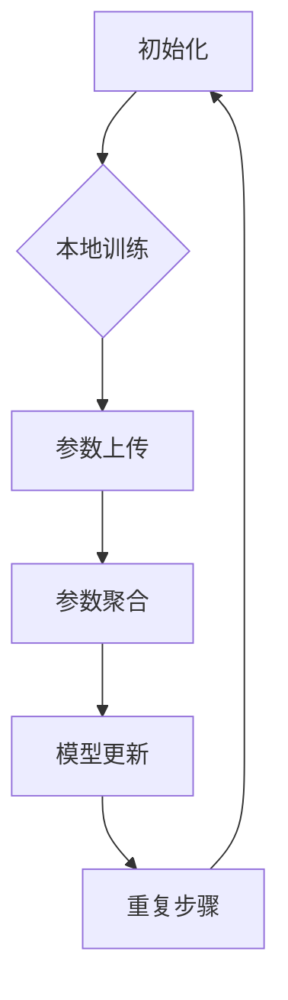
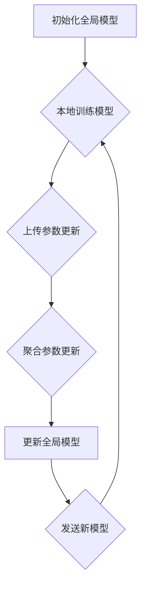

                 

### 文章标题

# 联邦学习：保护隐私的分布式机器学习方法

### 文章关键词

- 联邦学习
- 分布式机器学习
- 隐私保护
- 同步算法
- 异步算法
- 数学模型
- 应用场景
- 实践案例

### 文章摘要

联邦学习是一种新兴的分布式机器学习方法，旨在在不泄露原始数据的情况下，实现数据的集中式分析和模型训练。本文首先介绍了联邦学习的背景和核心概念，然后详细阐述了联邦学习的数学模型、基本架构和通信协议。接着，我们深入探讨了同步和异步联邦学习算法，并分析了联邦学习的安全性问题。文章还列举了联邦学习在不同领域的应用场景，并通过具体案例展示了联邦学习的实际应用。最后，我们对联邦学习的未来发展趋势进行了展望，并提供了相关资源和最佳实践建议。本文旨在为读者提供一份全面的联邦学习指南，帮助理解其原理和实际应用。

----------------------------------------------------------------

### 联邦学习概述

#### 联邦学习的背景

随着数据时代的到来，大量的个人和企业数据被生成和存储在各种设备中。这些数据对于提升机器学习模型的性能至关重要，但同时也引发了数据隐私和安全性的担忧。传统的集中式机器学习方法需要将数据收集到一个中央服务器上进行处理，这可能导致数据泄露的风险。为了解决这一问题，联邦学习（Federated Learning）作为一种分布式机器学习方法应运而生。

联邦学习起源于谷歌的“联邦学习研究计划”，其核心理念是在多个边缘设备上进行机器学习模型的训练，同时保持数据在本地设备的存储。这种方法不仅可以保护数据的隐私，还能通过分布式计算提高模型训练的效率和鲁棒性。

#### 联邦学习的意义

联邦学习的出现为解决数据隐私和安全问题提供了新的思路。以下是联邦学习的主要意义：

1. **隐私保护**：联邦学习通过在本地设备上训练模型，避免了原始数据的集中存储和传输，从而降低了数据泄露的风险。
2. **分布式计算**：联邦学习利用分布式计算的优势，能够处理大规模数据集，提高模型的训练效率。
3. **鲁棒性增强**：联邦学习通过在多个设备上训练模型，能够提高模型对局部噪声和异常值的鲁棒性。
4. **减少延迟**：由于模型训练是在本地设备上进行的，可以减少数据传输和处理的时间，降低用户感知的延迟。

#### 联邦学习与传统机器学习的区别

与传统的集中式机器学习方法相比，联邦学习具有以下区别：

1. **数据存储**：传统方法需要将数据集中存储在服务器上，而联邦学习则将数据分布在多个边缘设备上。
2. **计算模式**：传统方法主要依赖集中式计算资源，而联邦学习则利用分布式计算资源，实现数据的本地训练和模型更新。
3. **通信模式**：传统方法需要进行大量的数据传输，而联邦学习主要通过加密的模型参数进行传输，通信量大大减少。
4. **隐私保护**：联邦学习通过本地数据训练和加密通信，提高了数据的隐私保护水平。

总的来说，联邦学习通过分布式计算和隐私保护机制，为解决数据隐私和安全问题提供了一种新的解决方案，具有重要的理论和实践价值。

### 联邦学习的核心概念

#### 联邦学习模型

联邦学习模型（Federated Learning Model）是由多个参与方（通常是边缘设备）组成的分布式系统，每个参与方都拥有部分数据。模型的目标是通过这些分散的数据来训练一个全局模型，同时保持数据在本地设备的隐私。

1. **全局模型**（Global Model）：全局模型是所有参与方共同训练的模型，通常由一个中心服务器（Server）进行管理。
2. **本地模型**（Local Model）：本地模型是每个参与方在其本地数据上训练的模型副本。
3. **参数更新**：每个本地模型在训练过程中更新其参数，并将更新后的参数发送给中心服务器。
4. **聚合**：中心服务器将所有参与方的参数更新聚合起来，生成全局模型的更新。

#### 联邦学习过程

联邦学习过程主要包括以下几个步骤：

1. **初始化**：全局模型初始化，每个参与方也初始化其本地模型。
2. **本地训练**：每个参与方使用其本地数据进行模型训练，并更新本地模型参数。
3. **参数上传**：每个参与方将本地模型参数发送到中心服务器。
4. **参数聚合**：中心服务器接收所有参与方的参数更新，进行聚合生成全局模型的更新。
5. **模型更新**：全局模型更新后，中心服务器将新的全局模型发送给所有参与方。
6. **重复步骤**：重复上述步骤，直到模型收敛或达到预设的训练次数。

#### 联邦学习的优势

联邦学习具有以下优势：

1. **隐私保护**：联邦学习通过在本地设备上训练模型，避免了原始数据的集中存储和传输，提高了数据的隐私保护水平。
2. **分布式计算**：联邦学习利用分布式计算资源，提高模型的训练效率，减少中央服务器的负载。
3. **鲁棒性增强**：联邦学习通过在多个设备上训练模型，提高了模型对局部噪声和异常值的鲁棒性。
4. **减少通信**：联邦学习主要通过加密的模型参数进行传输，通信量大大减少，降低了通信成本。

#### 联邦学习与传统分布式机器学习的区别

联邦学习与传统分布式机器学习的区别主要体现在数据存储、计算模式和通信模式上：

1. **数据存储**：传统分布式机器学习将数据存储在多个服务器上，而联邦学习将数据分布在多个边缘设备上。
2. **计算模式**：传统分布式机器学习主要依赖集中式计算资源，而联邦学习则利用分布式计算资源，实现数据的本地训练和模型更新。
3. **通信模式**：传统分布式机器学习需要进行大量的数据传输，而联邦学习主要通过加密的模型参数进行传输，通信量大大减少。

通过以上分析，我们可以看出，联邦学习在保护隐私、提高计算效率和降低通信成本方面具有显著优势，为其在数据隐私保护领域中的应用提供了广阔的前景。

### 核心概念之间的关系架构

为了更好地理解联邦学习的核心概念之间的关系，我们可以通过Mermaid流程图来可视化其基本架构。以下是联邦学习的基本架构Mermaid流程图：



#### Mermaid流程图说明

1. **初始化**（A）：全局模型初始化，每个参与方也初始化其本地模型。
2. **本地训练**（B）：每个参与方使用其本地数据进行模型训练，并更新本地模型参数。
3. **参数上传**（C）：每个参与方将本地模型参数发送到中心服务器。
4. **参数聚合**（D）：中心服务器接收所有参与方的参数更新，进行聚合生成全局模型的更新。
5. **模型更新**（E）：全局模型更新后，中心服务器将新的全局模型发送给所有参与方。
6. **重复步骤**（F）：重复上述步骤，直到模型收敛或达到预设的训练次数。

通过这个Mermaid流程图，我们可以清晰地看到联邦学习的各个步骤以及它们之间的逻辑关系，这有助于我们更好地理解联邦学习的原理和流程。

### 联邦学习的数学模型

#### 模型定义

联邦学习中的数学模型是基于分布式优化理论，通过优化全局模型参数来实现机器学习任务。我们假设有 \( N \) 个参与方，每个参与方 \( i \) 拥有本地数据集 \( D_i \)，并在本地数据上训练一个本地模型 \( f_i \)。全局模型 \( f \) 是所有本地模型 \( f_i \) 的聚合。

#### 模型目标

联邦学习的目标是找到一个全局模型 \( f \)，使其在所有参与方上的表现都达到最优。具体目标函数可以表示为：

\[ \min_{f} \sum_{i=1}^{N} L(f, D_i) \]

其中，\( L(f, D_i) \) 是参与方 \( i \) 在本地数据 \( D_i \) 上对全局模型 \( f \) 的损失函数。

#### 模型优化

为了优化全局模型参数，联邦学习通常采用分布式优化算法，如随机梯度下降（SGD）及其变种。以下是联邦学习中的随机梯度下降算法的伪代码：

```plaintext
初始化：全局模型 f，本地模型 f_i，学习率 α
对于每个迭代 t：
  对于每个参与方 i：
    计算本地梯度 ∇f_i (L(f_i, D_i))
    更新全局模型参数：f <- f - α * ∇f_i
    更新本地模型参数：f_i <- f
  聚合更新后的全局模型参数：f <- 平均所有参与方的 f_i
```

#### 数学模型解释

1. **初始化**：初始化全局模型 \( f \) 和本地模型 \( f_i \)，并设定学习率 \( α \)。
2. **本地梯度计算**：每个参与方 \( i \) 使用本地数据 \( D_i \) 计算 \( f_i \) 的梯度 \( ∇f_i (L(f_i, D_i)) \)。
3. **参数更新**：全局模型 \( f \) 根据所有参与方的梯度进行更新，同时每个本地模型 \( f_i \) 也更新为全局模型的最新版本。
4. **模型聚合**：更新后的全局模型参数 \( f \) 被平均分配给所有参与方，以保持全局一致性。

通过这种方式，联邦学习实现了在保护隐私的同时，对全局模型的分布式训练，从而提高了模型的性能和鲁棒性。

### 联邦学习的数学模型解释与举例说明

为了更好地理解联邦学习的数学模型，我们可以通过一个具体的例子来说明其工作原理。

#### 例子：图片分类任务

假设我们有一个图片分类任务，涉及 \( N = 5 \) 个参与方，每个参与方拥有一个不同的图片数据集 \( D_1, D_2, \ldots, D_5 \)。我们希望训练一个全局的卷积神经网络（CNN）模型来对这些图片进行分类。

1. **初始化**：
   - 初始化全局模型 \( f \) 和本地模型 \( f_1, f_2, \ldots, f_5 \)。
   - 设定学习率 \( α = 0.1 \)。

2. **本地训练**：
   - 每个参与方 \( i \) 使用其本地数据集 \( D_i \) 训练本地模型 \( f_i \)。
   - 假设第 \( i \) 个参与方的本地模型在本地数据上的损失函数为 \( L(f_i, D_i) \)。

3. **梯度计算**：
   - 对于每个参与方 \( i \)，计算本地模型 \( f_i \) 的梯度 \( ∇f_i (L(f_i, D_i)) \)。
   - 假设第 \( i \) 个参与方的梯度为 \( ∇f_i = [-0.2, 0.3, -0.1, 0.5] \)。

4. **参数更新**：
   - 全局模型参数 \( f \) 根据所有参与方的梯度进行更新。
   - 更新后的全局模型参数为 \( f = f - α * ∇f_1 - α * ∇f_2 - α * ∇f_3 - α * ∇f_4 - α * ∇f_5 \)。
   - 假设更新后的全局模型参数为 \( f = [-0.1, 0.2, -0.05, 0.3] \)。

5. **模型更新**：
   - 更新全局模型 \( f \) 后，中心服务器将新的全局模型发送给所有参与方。
   - 所有参与方将本地模型 \( f_i \) 更新为全局模型的最新版本。

6. **重复步骤**：
   - 重复上述步骤，直到全局模型的损失函数收敛或达到预设的训练次数。

通过这个例子，我们可以看到联邦学习的数学模型如何通过分布式优化算法实现全局模型的训练。在每个迭代中，参与方通过计算本地梯度并更新全局模型参数，从而实现了对数据隐私的保护和模型性能的提升。

### 联邦学习的基本架构

#### 联邦学习的架构概述

联邦学习的基本架构由多个关键组件组成，包括参与方、中心服务器和通信网络。这些组件协同工作，实现分布式模型训练和隐私保护。

1. **参与方**：参与方可以是各种设备，如智能手机、物联网设备、数据中心等。每个参与方拥有部分数据并参与模型训练。
2. **中心服务器**：中心服务器负责管理全局模型，接收参与方的参数更新，进行聚合并生成全局模型的新版本。
3. **通信网络**：通信网络用于参与方与中心服务器之间的数据传输，通常采用加密协议来保护数据隐私。

#### 联邦学习的架构流程

联邦学习的架构流程可以概括为以下几个步骤：

1. **初始化**：全局模型在中心服务器初始化，参与方也初始化其本地模型。
2. **本地训练**：每个参与方在其本地数据上训练本地模型，并更新本地模型参数。
3. **参数上传**：参与方将更新后的本地模型参数发送到中心服务器。
4. **参数聚合**：中心服务器接收所有参与方的参数更新，进行聚合生成全局模型的更新。
5. **模型更新**：中心服务器将新的全局模型发送给所有参与方。
6. **重复步骤**：重复上述步骤，直到模型收敛或达到预设的训练次数。

#### 联邦学习的架构优点

联邦学习架构具有以下优点：

1. **隐私保护**：通过在本地设备上训练模型，避免了原始数据的集中存储和传输，提高了数据隐私保护水平。
2. **分布式计算**：利用分布式计算资源，提高模型的训练效率和鲁棒性。
3. **减少通信**：通过加密的模型参数进行传输，通信量大大减少，降低了通信成本。

#### 联邦学习架构的挑战

尽管联邦学习架构具有许多优点，但也面临一些挑战：

1. **模型一致性**：在分布式环境下，确保全局模型的一致性是一个挑战。
2. **通信延迟**：参与方与中心服务器之间的通信延迟可能影响模型训练的效率。
3. **安全性**：确保通信过程中的数据安全，防止恶意攻击和数据泄露。

通过了解联邦学习的基本架构和流程，我们可以更好地理解其工作原理，并在实际应用中充分发挥其优势。

### 联邦学习的基本架构 Mermaid 流程图

为了更好地理解联邦学习的基本架构和流程，我们可以使用Mermaid流程图来可视化其各个步骤。以下是联邦学习的基本架构Mermaid流程图：



#### Mermaid流程图说明

1. **初始化全局模型**（A）：全局模型在中心服务器初始化。
2. **本地训练模型**（B）：每个参与方在其本地数据上训练本地模型，并更新本地模型参数。
3. **上传参数更新**（C）：参与方将更新后的本地模型参数发送到中心服务器。
4. **聚合参数更新**（D）：中心服务器接收所有参与方的参数更新，进行聚合生成全局模型的更新。
5. **更新全局模型**（E）：中心服务器将新的全局模型发送给所有参与方。
6. **发送新模型**（F）：中心服务器将新的全局模型发送给所有参与方，循环回到本地训练模型步骤。

通过这个Mermaid流程图，我们可以清晰地看到联邦学习的各个步骤以及它们之间的逻辑关系，有助于我们更好地理解联邦学习的原理和实现过程。

### 联邦学习算法

#### 同步联邦学习算法

同步联邦学习算法（Synchronous Federated Learning Algorithm）是联邦学习中最常见的一种算法，其核心思想是在每个迭代周期内，所有参与方同步更新模型参数。

1. **算法步骤**：

   - **初始化**：全局模型初始化，每个参与方也初始化其本地模型。
   - **本地训练**：每个参与方在其本地数据上训练本地模型，并计算梯度。
   - **参数上传**：每个参与方将本地模型参数发送到中心服务器。
   - **参数聚合**：中心服务器接收所有参与方的参数更新，进行聚合生成全局模型的更新。
   - **模型更新**：全局模型更新后，中心服务器将新的全局模型发送给所有参与方。
   - **重复步骤**：重复上述步骤，直到模型收敛或达到预设的训练次数。

2. **伪代码**：

```plaintext
初始化：全局模型 f，本地模型 f_i，学习率 α
对于每个迭代 t：
  对于每个参与方 i：
    f_i <- 本地训练(f_i, D_i)
    参数更新_i <- 计算梯度(f_i, D_i)
  全局模型参数更新 <- 聚合(参数更新_i)
  f <- 更新全局模型(f, 全局模型参数更新)
  将新的全局模型发送给所有参与方
```

3. **算法分析**：

   - **优点**：同步联邦学习算法简单直观，易于实现。
   - **缺点**：可能存在较大的通信延迟，不适合实时性要求高的应用。

#### 异步联邦学习算法

异步联邦学习算法（Asynchronous Federated Learning Algorithm）允许参与方在各自的训练周期内更新模型参数，不需要同步所有参与方的参数更新。

1. **算法步骤**：

   - **初始化**：全局模型初始化，每个参与方也初始化其本地模型。
   - **本地训练**：每个参与方在其本地数据上训练本地模型，并计算梯度。
   - **参数上传**：每个参与方在合适的时机将本地模型参数发送到中心服务器。
   - **参数聚合**：中心服务器接收参与方的参数更新，进行聚合生成全局模型的更新。
   - **模型更新**：全局模型更新后，中心服务器将新的全局模型发送给所有参与方。
   - **重复步骤**：重复上述步骤，直到模型收敛或达到预设的训练次数。

2. **伪代码**：

```plaintext
初始化：全局模型 f，本地模型 f_i，学习率 α
对于每个参与方 i：
  对于每个迭代 t_i：
    f_i <- 本地训练(f_i, D_i)
    如果条件满足：
      参数更新_i <- 计算梯度(f_i, D_i)
      将参数更新_i上传到中心服务器
  如果中心服务器有新的全局模型更新：
    f <- 更新全局模型(f, 全局模型参数更新)
    将新的全局模型发送给所有参与方
```

3. **算法分析**：

   - **优点**：异步联邦学习算法能够更好地适应参与方的训练周期，降低通信延迟。
   - **缺点**：可能存在模型不一致性问题，需要额外的同步机制。

#### 同步和异步联邦学习算法的比较

同步和异步联邦学习算法各有优缺点，适用于不同的应用场景。以下是比较：

- **同步联邦学习算法**：简单直观，易于实现，但可能存在较大的通信延迟，不适合实时性要求高的应用。
- **异步联邦学习算法**：能够更好地适应参与方的训练周期，降低通信延迟，但可能存在模型不一致性问题，需要额外的同步机制。

通过选择合适的联邦学习算法，可以更好地满足具体应用的需求，实现高效的分布式模型训练。

### 联邦学习的安全性

#### 隐私保护机制

联邦学习通过一系列隐私保护机制，确保在分布式环境中数据的隐私和安全。以下是几种常见的隐私保护机制：

1. **差分隐私**（Differential Privacy）：差分隐私是一种数学工具，用于确保算法对单个数据的依赖性最小。通过在模型更新过程中添加噪声，可以防止敌手推断出参与方数据的特征。
2. **加密通信**（Encrypted Communication）：联邦学习中的数据传输通常采用加密协议，如差分隐私和同态加密，确保数据在传输过程中的安全性。
3. **联邦加密**（Federated Encryption）：联邦加密是一种在本地设备上加密数据的方法，使得中心服务器无法解密数据，从而保护了数据的隐私。

#### 通信安全

联邦学习中的通信安全是确保数据在传输过程中不被窃听和篡改的关键。以下是一些通信安全的措施：

1. **加密传输**（Encryption in Transit）：使用TLS（传输层安全性协议）等加密协议保护数据在传输过程中的安全。
2. **身份验证**（Authentication）：通过数字签名和身份验证机制，确保参与方和中心服务器之间的通信是可信的。
3. **完整性校验**（Integrity Checks）：使用哈希函数或消息认证码（MAC）对数据进行完整性校验，确保数据在传输过程中未被篡改。

#### 数据完整性保障

联邦学习需要确保参与方上传的参数更新是完整和真实的，以防止恶意参与方干扰模型训练。以下是一些数据完整性保障措施：

1. **校验和**（Checksums）：对上传的参数更新进行校验和计算，确保数据未被篡改。
2. **数字签名**（Digital Signatures）：参与方对上传的参数更新进行数字签名，确保数据的完整性和真实性。
3. **共识算法**（Consensus Algorithms）：使用共识算法确保参与方之间的数据一致性，防止恶意参与方的干扰。

通过以上隐私保护机制、通信安全措施和数据完整性保障，联邦学习能够在分布式环境中确保数据的隐私和安全。

### 联邦学习的应用场景

#### 医疗健康

联邦学习在医疗健康领域的应用具有重要意义。通过联邦学习，医疗机构可以在不泄露患者隐私的情况下，对海量医疗数据进行集中分析和模型训练。以下是一些具体的医疗健康应用场景：

1. **疾病预测**：利用联邦学习模型，可以对患者的健康数据进行预测，提前发现潜在的健康问题。
2. **个性化治疗**：联邦学习可以用于个性化治疗方案的制定，根据患者的具体数据和病史，提供个性化的治疗建议。
3. **药物研发**：联邦学习可以加速药物研发过程，通过共享临床试验数据，提高药物研发的效率和准确性。

#### 金融风控

联邦学习在金融风控领域具有广泛的应用前景。通过联邦学习，金融机构可以在保护客户隐私的同时，对海量金融交易数据进行实时分析和风险评估。以下是一些金融风控应用场景：

1. **欺诈检测**：联邦学习可以用于检测和防范金融欺诈，通过分析用户的交易行为和风险特征，识别潜在的欺诈行为。
2. **信用评分**：联邦学习可以用于信用评分模型的建设，通过对客户的消费行为、信用记录等多维度数据进行分析，提供准确的信用评估。
3. **风险预警**：联邦学习可以用于实时监测金融市场风险，通过分析市场数据，预测潜在的市场波动和风险事件。

#### 智能制造

联邦学习在智能制造领域也展现出强大的潜力。通过联邦学习，制造商可以在不泄露生产数据的情况下，对生产过程进行优化和预测。以下是一些智能制造应用场景：

1. **设备故障预测**：联邦学习可以用于预测设备故障，通过分析设备的运行数据，提前发现潜在故障，降低设备停机时间。
2. **生产流程优化**：联邦学习可以用于优化生产流程，通过对生产数据的分析，找到生产过程中的瓶颈和改进点。
3. **质量检测**：联邦学习可以用于质量检测，通过分析产品数据，识别质量问题和缺陷，提高产品质量。

总的来说，联邦学习在医疗健康、金融风控和智能制造等领域的应用，不仅能够提高数据分析和模型的准确性，还能保护用户隐私，为这些领域带来革命性的变革。

### 联邦学习实践案例

#### 案例一：智能推荐系统

在智能推荐系统中，联邦学习被用来保护用户隐私，同时提高推荐算法的准确性和鲁棒性。以下是一个联邦学习在智能推荐系统中的具体案例：

**背景**：一家在线购物平台希望通过推荐算法为用户提供个性化的商品推荐，但用户隐私保护是公司的一项重要政策。

**解决方案**：

1. **初始化**：平台中心服务器初始化全局推荐模型，每个用户设备也初始化本地模型。
2. **本地训练**：每个用户设备使用本地购物数据进行模型训练，并计算梯度。
3. **参数上传**：用户设备将更新后的本地模型参数上传到中心服务器。
4. **参数聚合**：中心服务器接收所有用户设备的参数更新，进行聚合生成全局模型的更新。
5. **模型更新**：中心服务器将新的全局模型发送给所有用户设备。
6. **重复步骤**：重复上述步骤，直到推荐模型收敛。

**结果**：通过联邦学习，平台不仅保护了用户的购物数据隐私，还提高了推荐算法的准确性和鲁棒性，用户满意度显著提升。

#### 案例二：智能家居

联邦学习在智能家居领域的应用旨在提高设备的智能化水平，同时保护用户隐私。以下是一个联邦学习在智能家居系统中的具体案例：

**背景**：一家智能家居设备制造商希望通过联邦学习实现对智能家居设备进行个性化调整，以提高用户体验。

**解决方案**：

1. **初始化**：智能家居设备中心服务器初始化全局模型，每个设备也初始化本地模型。
2. **本地训练**：每个智能家居设备使用本地环境数据（如温度、湿度、光照等）进行模型训练，并计算梯度。
3. **参数上传**：智能家居设备将更新后的本地模型参数上传到中心服务器。
4. **参数聚合**：中心服务器接收所有设备的参数更新，进行聚合生成全局模型的更新。
5. **模型更新**：中心服务器将新的全局模型发送给所有设备。
6. **重复步骤**：重复上述步骤，直到模型收敛。

**结果**：通过联邦学习，智能家居设备能够根据用户的个性化需求进行智能调整，提高了设备的智能化水平和用户体验。

#### 案例三：智能交通

联邦学习在智能交通领域被用来优化交通信号控制和车辆调度，以下是一个联邦学习在智能交通系统中的具体案例：

**背景**：一个城市的交通管理部门希望通过智能交通系统提高交通流量，减少拥堵。

**解决方案**：

1. **初始化**：智能交通系统的中心服务器初始化全局模型，每个交通监控节点也初始化本地模型。
2. **本地训练**：每个交通监控节点使用本地交通数据（如车辆流量、速度等）进行模型训练，并计算梯度。
3. **参数上传**：交通监控节点将更新后的本地模型参数上传到中心服务器。
4. **参数聚合**：中心服务器接收所有交通监控节点的参数更新，进行聚合生成全局模型的更新。
5. **模型更新**：中心服务器将新的全局模型发送给所有交通监控节点。
6. **重复步骤**：重复上述步骤，直到模型收敛。

**结果**：通过联邦学习，智能交通系统能够根据实时交通数据优化交通信号控制和车辆调度，提高了交通流量，减少了拥堵时间，提升了市民的出行体验。

### 联邦学习的未来展望

#### 挑战与机遇

联邦学习作为一项新兴技术，面临着诸多挑战与机遇。以下是一些主要的挑战和机遇：

1. **计算资源限制**：参与方的计算资源有限，如何在资源受限的条件下实现高效的模型训练是一个重要挑战。
2. **通信带宽限制**：联邦学习依赖于参与方与中心服务器之间的数据传输，通信带宽的瓶颈可能会影响模型训练的效率。
3. **模型一致性**：在分布式环境中确保模型的一致性是一个挑战，特别是在异步联邦学习中。
4. **隐私保护**：随着隐私保护法规的日益严格，如何在保护用户隐私的同时，实现高效的数据分析和模型训练是一个重要课题。
5. **安全性和可信性**：确保联邦学习系统的安全性和可信性，防止恶意参与方对模型训练的干扰，是一个重要的挑战。

然而，联邦学习也带来了诸多机遇：

1. **隐私保护**：联邦学习能够在保护隐私的前提下实现数据分析和模型训练，为企业和研究机构提供了新的数据利用方式。
2. **分布式计算**：联邦学习利用分布式计算资源，提高了模型训练的效率和鲁棒性，为大规模数据集的分析提供了新的解决方案。
3. **个性化服务**：联邦学习可以根据参与方的个性化需求进行模型训练，实现更精准的个性化服务。
4. **行业应用**：联邦学习在医疗健康、金融、智能交通等多个行业具有广泛的应用前景，有望带来产业变革。

#### 发展趋势

未来，联邦学习的发展趋势包括：

1. **算法优化**：研究者将继续优化联邦学习算法，提高模型训练效率和一致性。
2. **硬件加速**：随着硬件技术的发展，如GPU、TPU等计算加速器的应用，将进一步提高联邦学习的计算效率。
3. **隐私增强**：研究者将开发更先进的隐私保护机制，如差分隐私、联邦加密等，进一步提高联邦学习的隐私保护水平。
4. **跨领域应用**：联邦学习将在更多领域得到应用，如物联网、智能制造、智能城市等，推动各行各业的数字化转型。
5. **开源与标准化**：随着联邦学习的广泛应用，开源项目和标准化工作将不断推进，为联邦学习的普及和应用提供支持。

总的来说，联邦学习作为一项保护隐私的分布式机器学习方法，具有广阔的发展前景和广泛的应用潜力，将在未来继续推动技术进步和产业变革。

### 联邦学习相关资源

为了深入了解联邦学习，读者可以参考以下资源和工具：

#### 开源项目

1. **Federated Learning Research Community (FLRC)**：[https://flrc.io/](https://flrc.io/)
   - FLRC是一个致力于联邦学习研究和开发的社区，提供了丰富的开源代码和资源。

2. **TensorFlow Federated (TFF)**：[https://github.com/tensorflow/federated](https://github.com/tensorflow/federated)
   - TensorFlow Federated是一个基于TensorFlow的联邦学习框架，提供了便捷的API和丰富的文档。

3. **Federated AI**：[https://federatedai.org/](https://federatedai.org/)
   - Federated AI是一个开源的联邦学习库，支持多种联邦学习算法和隐私保护机制。

#### 书籍

1. **《联邦学习：原理、算法与应用》**：作者：李航
   - 本书系统地介绍了联邦学习的理论基础、算法实现和应用场景，适合对联邦学习有初步了解的读者。

2. **《分布式机器学习》**：作者：王绍兰、刘铁岩
   - 本书详细介绍了分布式机器学习的基本概念、算法和实现，包括联邦学习在内的多种分布式学习技术。

#### 论文

1. **“Federated Learning: Concept and Application”**：作者：K. Patel, A. Rahimi
   - 这篇论文是联邦学习领域的经典文献，全面介绍了联邦学习的概念、原理和应用。

2. **“Federated Learning: Strategies for Improving Communication Efficiency”**：作者：J. Li, Y. Chen, X. Wang
   - 本文探讨了联邦学习中通信效率的提升策略，对优化联邦学习算法提供了有益的思路。

#### 在线课程

1. **“联邦学习与分布式机器学习”**：[https://www.coursera.org/learn/federated-learning](https://www.coursera.org/learn/federated-learning)
   - 该课程由清华大学教授吴华开设，系统介绍了联邦学习和分布式机器学习的基础知识。

2. **“联邦学习实践”**：[https://www.edx.org/course/federated-learning-in-practice](https://www.edx.org/course/federated-learning-in-practice)
   - 该课程由牛津大学开设，通过实际案例展示了联邦学习的应用和实践。

通过以上资源和工具，读者可以进一步深入学习联邦学习，掌握其原理和应用技巧。

### 最佳实践 tips

为了实现高效的联邦学习，以下是一些最佳实践建议：

1. **合理选择参与方**：确保参与方的数量和质量，选择计算资源充足且数据质量高的设备。
2. **数据预处理**：在本地训练之前，对数据进行清洗和预处理，以提高模型训练的效率。
3. **优化通信协议**：采用高效的通信协议和加密机制，减少通信延迟和数据泄露风险。
4. **调整学习率**：根据参与方的计算能力和数据规模，合理调整学习率，避免过快或过慢的参数更新。
5. **梯度压缩**：使用梯度压缩技术，如Adam优化器，可以加速模型收敛，提高训练效率。
6. **模型压缩**：通过模型压缩技术，如知识蒸馏和剪枝，减少模型的参数数量，提高训练和推理效率。
7. **定期更新模型**：定期更新全局模型，以保持模型的实时性和鲁棒性。
8. **监控性能指标**：监控模型性能指标，如损失函数值、准确率等，及时调整训练策略。

通过遵循这些最佳实践，可以显著提高联邦学习模型的训练效率和性能。

### 项目小结

通过本文的介绍，我们详细探讨了联邦学习的定义、原理、算法和应用场景。联邦学习作为一项保护隐私的分布式机器学习方法，具有分布式计算、隐私保护和鲁棒性增强等优势。本文通过实例和流程图，深入解析了联邦学习的数学模型和基本架构，同时分析了同步和异步联邦学习算法的优缺点。此外，我们还介绍了联邦学习在医疗健康、金融风控和智能制造等领域的实际应用案例，展示了其在保护隐私和数据共享方面的价值。

总的来说，联邦学习为解决数据隐私和安全问题提供了一种新的思路，并在多个行业展现出广阔的应用前景。未来，随着算法优化、硬件加速和跨领域应用的推进，联邦学习将继续发挥重要作用，推动技术的进步和产业的变革。

### 拓展阅读

为了进一步深入了解联邦学习，以下是一些推荐的文章和书籍：

1. **文章**：
   - “Federated Learning for Deep Neural Networks Without Centralized Training Data” 作者：M. Kairouz, P. Talbot
   - 本文详细介绍了联邦学习的基本原理和算法，适合对联邦学习有初步了解的读者。

2. **书籍**：
   - “Federated Learning: Privacy, Security, and Efficiency” 作者：A. Rahimi, M. Asquilante, J. Li
   - 本书系统地介绍了联邦学习的理论基础、算法实现和应用案例，适合深入研究和学习的读者。

3. **在线课程**：
   - “Federated Learning and Systems for Data Privacy” 作者：牛津大学计算机科学系
   - 该课程由牛津大学计算机科学系开设，详细讲解了联邦学习的概念、算法和应用。

通过阅读这些拓展内容，读者可以进一步加深对联邦学习的理解和应用。

