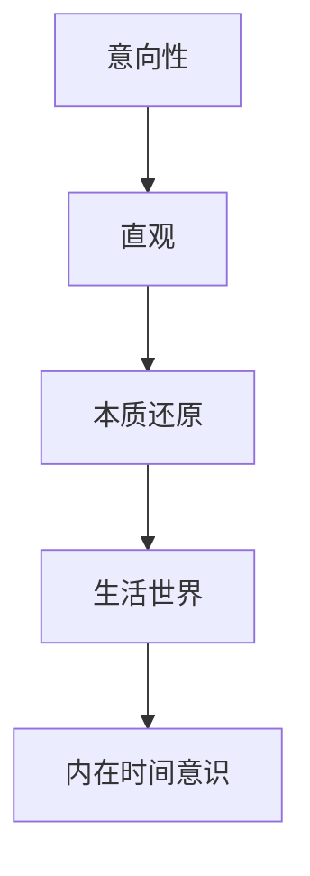
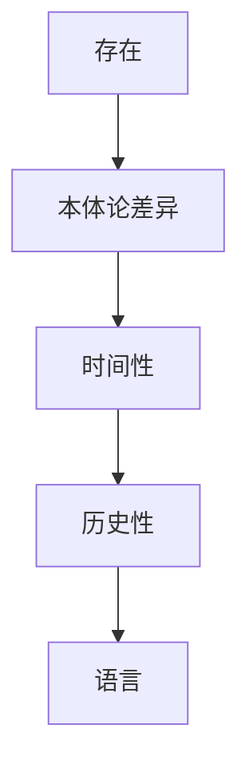

                 

### 文章标题

# 胡塞尔与海德格尔：现象学的两个阶段

---

关键词：现象学、胡塞尔、海德格尔、哲学、意向性、直观、存在论

---

摘要：本文深入探讨现象学这一哲学流派中的两位重要思想家埃德蒙德·胡塞尔和马丁·海德格尔的贡献，通过分析他们的生平、哲学思想和著作，阐述现象学的起源、发展和核心原理，以及两位思想家之间的联系与区别。同时，本文还将探讨现象学对当代哲学和其他学科的影响，并对现象学的未来进行展望。

### 确定书籍主题与目的

#### 书籍主题

《胡塞尔与海德格尔：现象学的两个阶段》这一主题聚焦于现象学这一哲学流派的发展历程，特别是其中的两位核心人物：埃德蒙德·胡塞尔和马丁·海德格尔。现象学作为一种探讨意识、存在和本质的哲学方法，起源于19世纪末和20世纪初的欧洲，对后来的哲学、心理学、社会科学和人文科学产生了深远的影响。

#### 书籍目的

1. **介绍现象学的起源与发展**：通过回顾现象学的起源，介绍现象学的基本概念和历史背景，帮助读者了解这一哲学流派的发展脉络。
2. **分析胡塞尔的现象学**：详细讲解胡塞尔的生平、主要著作以及其现象学的核心原理，如意向性、直观和本质还原，使读者对胡塞尔的现象学有一个全面的理解。
3. **探讨海德格尔的存在论**：深入分析海德格尔的哲学思想，包括存在论的基本概念、主客关系和语言的作用，帮助读者理解海德格尔对现象学的贡献。
4. **比较胡塞尔与海德格尔的现象学**：探讨两者之间的联系和区别，以及他们对现象学发展的不同贡献，使读者能够从更宏观的视角把握现象学的本质。
5. **评估现象学的哲学意义与应用**：讨论现象学对当代哲学和其他学科的影响，以及其在现实世界中的应用潜力。
6. **展望现象学的未来**：对现象学未来的发展方向和可能的研究领域进行展望，为读者提供对现象学发展的思考。

### 设计目录大纲

为了系统地阐述《胡塞尔与海德格尔：现象学的两个阶段》这一主题，本文将采用以下目录大纲：

## 第一部分：现象学的起源与胡塞尔的现象学

### 第1章：现象学的起源

#### 1.1 现象学的概念与起源

- **现象学的定义**：解释现象学的起源和基本概念。
- **现象学的早期发展**：探讨现象学在19世纪末和20世纪初的兴起。

#### 1.2 胡塞尔的生平与哲学思想

- **胡塞尔的生平**：介绍胡塞尔的生平和学术背景。
- **胡塞尔的哲学思想**：概述胡塞尔的主要哲学观点和贡献。

#### 1.3 胡塞尔现象学的基本原理

- **意向性**：解释意向性的概念及其在现象学中的作用。
- **直观**：探讨直观在胡塞尔现象学中的重要性。
- **本质还原**：介绍胡塞尔如何通过本质还原来揭示现象的本质。

#### 1.4 胡塞尔现象学的主要著作

- **《纯粹现象学通论》**：概述这部著作的主要内容和影响。
- **《形式的和先验的逻辑》**：讨论这部作品对逻辑和哲学的贡献。
- **其他著作**：简要介绍胡塞尔的其他重要著作。

## 第二部分：现象学的第二阶段与海德格尔的存在论

### 第2章：现象学的第二阶段与海德格尔的存在论

#### 2.1 海德格尔的生平与哲学思想

- **海德格尔的生平**：介绍海德格尔的生平和学术背景。
- **海德格尔的哲学思想**：概述海德格尔的主要哲学观点和贡献。

#### 2.2 存在论的基本概念

- **存在论的定义**：解释存在论的概念。
- **存在论的分支**：探讨存在论的不同分支和学派。

#### 2.3 海德格尔存在论的主要著作

- **《存在与时间》**：概述这部著作的主要内容和影响。
- **《尼采》**：讨论这部作品对存在论的贡献。
- **其他著作**：简要介绍海德格尔的其他重要著作。

## 第三部分：胡塞尔与海德格尔现象学的联系与区别

### 第3章：胡塞尔与海德格尔现象学的联系与区别

#### 3.1 胡塞尔对海德格尔的影响

- **胡塞尔现象学对海德格尔的影响**：分析胡塞尔现象学如何影响了海德格尔的思想。
- **海德格尔对胡塞尔现象学的回应**：探讨海德格尔如何回应胡塞尔的现象学。

#### 3.2 海德格尔对胡塞尔的批评

- **海德格尔对胡塞尔现象学的批评**：介绍海德格尔如何批评胡塞尔的现象学。
- **胡塞尔对海德格尔的批评**：分析胡塞尔如何批评海德格尔的存在论。

#### 3.3 两者现象学的异同点分析

- **共同点**：探讨胡塞尔与海德格尔现象学的共同点。
- **区别**：分析胡塞尔与海德格尔现象学之间的区别。

## 第四部分：现象学的哲学意义与现实应用

### 第4章：现象学的哲学意义与现实应用

#### 4.1 现象学的哲学意义

- **现象学的哲学意义**：讨论现象学对哲学的贡献和影响。
- **现象学的方法论**：探讨现象学作为一种研究方法的特点和应用。

#### 4.2 现象学的现实应用

- **现象学在心理学中的应用**：介绍现象学在心理学领域的应用。
- **现象学在社会科学中的应用**：探讨现象学在社会科学领域的影响。
- **现象学在其他学科中的应用**：分析现象学在其他学科（如艺术、文学等）中的应用。

## 第五部分：胡塞尔与海德格尔现象学的现代影响

### 第5章：胡塞尔与海德格尔现象学的现代影响

#### 5.1 胡塞尔现象学的影响

- **胡塞尔现象学在当代哲学中的地位**：讨论胡塞尔现象学在当代哲学中的影响。
- **胡塞尔现象学在其他学科中的影响**：分析胡塞尔现象学在心理学、社会科学等领域的影响。

#### 5.2 海德格尔存在论的影响

- **海德格尔存在论在当代哲学中的地位**：探讨海德格尔存在论在当代哲学中的影响。
- **海德格尔存在论在其他学科中的影响**：分析海德格尔存在论在文学、艺术等领域的影响。

## 第六部分：现象学的未来展望

### 第6章：现象学的未来展望

#### 6.1 现象学的未来发展方向

- **现象学的未来发展方向**：讨论现象学在未来可能的发展方向。
- **现象学与其他哲学流派的对话**：探讨现象学如何与其他哲学流派进行对话和交流。

#### 6.2 现象学的跨学科研究

- **现象学与自然科学的关系**：分析现象学如何与自然科学进行跨学科研究。
- **现象学与人文科学的关系**：探讨现象学如何与人文科学进行跨学科研究。

## 第七部分：总结与展望

### 第7章：总结与展望

#### 7.1 现象学的整体评估

- **现象学的贡献**：总结现象学在哲学和其他学科中的贡献。
- **现象学的局限**：分析现象学的局限性。

#### 7.2 对胡塞尔与海德格尔现象学的评价

- **对胡塞尔现象学的评价**：评价胡塞尔现象学的历史地位和影响。
- **对海德格尔存在论的评价**：评价海德格尔存在论的历史地位和影响。

#### 7.3 对未来研究的建议

- **现象学的研究方向**：提出未来现象学研究可能的方向。
- **现象学与其他学科的融合**：探讨现象学与其他学科的融合前景。

通过以上目录大纲，本文将逐步深入探讨胡塞尔与海德格尔的现象学思想，为读者提供对这一哲学流派的全面理解。在后续章节中，我们将详细分析胡塞尔与海德格尔的生平、著作和思想，以及两者之间的联系与区别。此外，我们还将探讨现象学的哲学意义与现实应用，对现象学未来的发展进行展望。希望本文能够为哲学爱好者、研究人员和跨学科研究者提供有价值的参考。### 第1章：现象学的起源

#### 1.1 现象学的概念与起源

现象学（Phenomenology）作为一种哲学方法，起源于19世纪末和20世纪初的欧洲，其核心在于对意识的直接经验和现象的研究。现象学的创始人埃德蒙德·胡塞尔（Edmund Husserl）首次提出了这一概念，并将其定义为“关于事物本身的科学”，即对事物现象的直接描述和解释，而非对事物本质的探究。

现象学的起源可以追溯到19世纪末的德国哲学，当时欧洲哲学界正处于从实证主义到现象学的转变。胡塞尔深受康德哲学的影响，尤其是对康德的先验理想主义和直观概念的探讨。他在《逻辑研究》（Logische Untersuchungen）中提出了“本质直观”的概念，这一思想成为现象学的基石。

现象学的核心概念包括：

1. **意向性（Intentionality）**：意向性是指意识指向某个对象或意义的能力。胡塞尔认为，意识不是一种空洞的感知，而是一种有指向性的活动，总是指向某个对象或意义。意向性是现象学的核心概念，它将意识与外部世界联系起来。

2. **直观（Intuition）**：直观是现象学中的另一种重要概念，指的是意识直接把握对象的能力。胡塞尔认为，通过直观，我们可以直接接触到事物的本质。

3. **本质还原（Reduction）**：本质还原，也称为“现象学还原”或“胡塞尔的悬置”，是一种哲学方法，旨在排除一切先入为主的假设和偏见，以纯粹的直观方式来理解现象。

现象学的起源与发展不仅对哲学产生了深远的影响，还推动了心理学、社会学、文学批评等多个领域的研究。现象学作为一种哲学方法，强调对事物本身的直接描述和解释，反对任何形式的先入为主的假设和偏见，这使得它成为现代哲学研究中不可或缺的一部分。

#### 1.2 胡塞尔的生平与哲学思想

埃德蒙德·胡塞尔（Edmund Husserl，1859-1938）是现象学的创始人，出生于德国摩拉维亚的普罗斯尼兹。他早年在莱比锡大学学习哲学、心理学和数学，随后在柏林大学继续深造。胡塞尔的学术生涯始于对哲学逻辑和认识论的研究，他的早期作品《逻辑研究》提出了本质直观和意向性的概念，这些概念成为现象学的基石。

胡塞尔的哲学思想可以分为以下几个阶段：

1. **早期哲学思想**（1884-1901）：在这一阶段，胡塞尔主要关注逻辑和认识论问题。他的《逻辑研究》是他这一时期的代表作，书中提出了本质直观和意向性的概念。

2. **现象学运动**（1901-1929）：这一阶段，胡塞尔开始系统地构建现象学体系，并推动了现象学运动的发展。他发表了《纯粹现象学通论》（1913）和《形式的和先验的逻辑》（1929），进一步深化了现象学的基本原理。

3. **晚期哲学思想**（1929-1938）：在晚年，胡塞尔对现象学进行了反思和修正。他提出了“生活世界”和“内在时间意识”等概念，试图将现象学与生活实践结合起来。

胡塞尔的主要哲学贡献包括：

1. **现象学方法**：胡塞尔提出了现象学还原和本质直观等概念，为现象学提供了一种独特的研究方法。
2. **意向性理论**：胡塞尔认为，意识总是指向某个对象或意义，这一观点对后来的哲学和心理学研究产生了深远的影响。
3. **生活世界概念**：胡塞尔提出了“生活世界”的概念，认为生活世界是我们理解世界的基础。

#### 1.3 胡塞尔现象学的基本原理

胡塞尔的现象学基于一系列基本原理，这些原理构成了现象学体系的核心：

1. **意向性**：意向性是指意识指向某个对象或意义的能力。胡塞尔认为，意识不是一种空洞的感知，而是一种有指向性的活动，总是指向某个对象或意义。意向性是现象学的核心概念，它将意识与外部世界联系起来。

2. **直观**：直观是现象学中的另一种重要概念，指的是意识直接把握对象的能力。胡塞尔认为，通过直观，我们可以直接接触到事物的本质。

3. **本质还原**：本质还原，也称为“现象学还原”或“胡塞尔的悬置”，是一种哲学方法，旨在排除一切先入为主的假设和偏见，以纯粹的直观方式来理解现象。

4. **生活世界**：胡塞尔提出了“生活世界”的概念，认为生活世界是我们理解世界的基础。生活世界是我们日常生活中的经验，是所有意识活动的基础。

5. **内在时间意识**：胡塞尔认为，时间是意识的结构，内在时间意识是我们理解时间的核心。内在时间意识指的是我们对时间的感知和体验。

这些基本原理构成了胡塞尔现象学的核心，它们为现象学提供了一种独特的研究方法，使现象学成为现代哲学研究的重要流派。

#### 1.4 胡塞尔现象学的主要著作

胡塞尔在其一生中发表了大量的著作，这些著作对现象学的发展产生了深远的影响。以下是他的一些主要著作：

1. **《逻辑研究》（Logische Untersuchungen，1900-1901）**：这是胡塞尔的早期代表作，书中提出了本质直观和意向性的概念，成为现象学的基石。

2. **《纯粹现象学通论》（Allgemeine Einführung in die Phänomenologie des Geistes，1913）**：这是胡塞尔的晚期代表作，书中系统地阐述了现象学的基本原理，包括意向性、直观和本质还原。

3. **《形式的和先验的逻辑》（Formale und transzendentale Logik，1929）**：这是胡塞尔的晚期作品，书中探讨了逻辑的本质和现象学的逻辑方法。

4. **《生活世界》（Die Lebenswelt，1929）**：这是胡塞尔对生活世界概念的深入探讨，认为生活世界是我们理解世界的基础。

5. **《欧洲科学的危机与先验现象学》（Die Krisis der europäischen Wissenschaften und die transzendentale Phänomenologie，1936-1938）**：这是胡塞尔的晚期作品，对欧洲科学的危机进行了反思，并提出了先验现象学的方法。

这些著作不仅是胡塞尔哲学思想的重要体现，也是现象学发展的重要文献，对后来的哲学研究产生了深远的影响。

### 第2章：现象学的第二阶段与海德格尔的存在论

#### 2.1 海德格尔的生平与哲学思想

马丁·海德格尔（Martin Heidegger，1889-1976）是现象学的第二阶段，即存在论（Ontology）的代表性人物。他出生于德国西南部的梅斯基尔希，早年在弗莱堡大学学习哲学、数学和文学。海德格尔深受胡塞尔现象学的影响，但他在后期对胡塞尔的现象学提出了批评，并发展出了自己独特的存在论哲学。

海德格尔的哲学思想可以分为以下几个阶段：

1. **早期哲学思想**（1910-1927）：在这一阶段，海德格尔深受胡塞尔现象学的影响，认为现象学是探讨存在的最佳途径。他的早期作品《存在与时间》（Sein und Zeit，1927）是这一时期的代表作，书中提出了存在论的基本概念，如存在、本体论差异和时间性。

2. **中期哲学思想**（1927-1933）：在这一阶段，海德格尔对胡塞尔的现象学提出了批评，认为现象学过于抽象，忽视了存在的具体性和历史性。他开始关注语言和存在的关系，提出“语言是存在的家”的观点。

3. **晚期哲学思想**（1933-1976）：在这一阶段，海德格尔继续探讨语言和存在的关系，并对其哲学思想进行了反思和修正。他的晚期作品《尼采》（ Nietzsche，1943）、《论根据的本质》（Der Ursprung des Kunstwerkes，1950）和《诗、语言、思》（ Poiesis，1951）是这一时期的代表作。

海德格尔的主要哲学贡献包括：

1. **存在论**：海德格尔提出了存在论的基本概念，如存在、本体论差异和时间性，为后来的存在论哲学提供了理论基础。

2. **语言哲学**：海德格尔认为，语言不仅是表达思想的工具，更是存在的家。他探讨了语言与存在的关系，提出“语言是存在的家”的观点。

3. **历史性**：海德格尔强调历史性在理解存在中的作用，认为我们的存在是在特定历史条件下的存在。

#### 2.2 存在论的基本概念

存在论是海德格尔哲学的核心，它探讨存在的本质和存在的意义。以下是存在论的一些基本概念：

1. **存在（Sein）**：存在是海德格尔哲学中的核心概念，它不仅指存在的事物，还包括存在的方式。海德格尔区分了两种存在：一种是“存在者”（Dasein），即人的存在；另一种是“存在”（Sein），即存在的本质。

2. **本体论差异（Ontologische Differenz）**：本体论差异是指存在者和存在之间的差异。海德格尔认为，存在者只是存在的一种表现形式，存在者本身并不具有存在的本质。

3. **时间性（Zeitlichkeit）**：时间性是海德格尔哲学中的另一个重要概念，他认为时间是存在的本质。时间性不仅指时间的流逝，还包括我们对时间的感知和体验。

4. **历史性（Historizität）**：历史性是指我们的存在是在特定历史条件下的存在。海德格尔认为，历史性是我们理解存在的重要途径。

这些概念构成了海德格尔存在论的基础，它们使我们对存在的本质和意义有了更深刻的理解。

#### 2.3 海德格尔存在论的主要著作

海德格尔在其一生中发表了大量的著作，这些著作对存在论哲学的发展产生了深远的影响。以下是他的一些主要著作：

1. **《存在与时间》（Sein und Zeit，1927）**：这是海德格尔的代表作，书中提出了存在论的基本概念，如存在、本体论差异和时间性。

2. **《尼采》（Nietzsche，1943）**：这是海德格尔对尼采哲学的深入探讨，书中分析了尼采的思想对存在论哲学的影响。

3. **《论根据的本质》（Der Ursprung des Kunstwerkes，1950）**：这是海德格尔对艺术和存在的探讨，书中提出了“艺术是存在的展现”的观点。

4. **《诗、语言、思》（Poiesis，1951）**：这是海德格尔对诗歌和存在的探讨，书中分析了语言和存在的关系。

5. **《技术的问题》（Die Technikfrage，1954）**：这是海德格尔对技术和存在的探讨，书中分析了现代技术在存在中的作用。

这些著作不仅是海德格尔哲学思想的重要体现，也是存在论哲学发展的重要文献，对后来的哲学研究产生了深远的影响。

### 第3章：胡塞尔与海德格尔现象学的联系与区别

#### 3.1 胡塞尔对海德格尔的影响

胡塞尔的现象学对海德格尔的哲学思想产生了深远的影响。海德格尔曾在其《存在与时间》一书中明确提到，胡塞尔的哲学为他提供了重要的启示。具体来说，胡塞尔的现象学对海德格尔的影响主要体现在以下几个方面：

1. **意向性理论**：胡塞尔的意向性理论对海德格尔的思想产生了深远的影响。海德格尔认同胡塞尔关于意识总是指向某个对象或意义的观点，认为意识具有意向性。这一观点使海德格尔将注意力从存在者转向存在本身，从而为他的存在论奠定了基础。

2. **直观方法**：胡塞尔的直观方法也对海德格尔产生了影响。海德格尔认为，通过直观，我们可以直接接触到事物的本质。这一观点使海德格尔在《存在与时间》中提出了“现象学直观”的概念，认为直观是理解存在的重要途径。

3. **本质还原**：胡塞尔的本质还原方法对海德格尔也有一定的影响。海德格尔认同胡塞尔关于通过本质还原来排除先入为主假设的观点，认为这是理解存在的关键。

#### 3.2 海德格尔对胡塞尔的批评

尽管海德格尔深受胡塞尔现象学的影响，但他也对胡塞尔的哲学提出了批评。海德格尔认为，胡塞尔的现象学过于抽象，忽视了存在的具体性和历史性。以下是海德格尔对胡塞尔的批评：

1. **抽象性**：海德格尔认为，胡塞尔的现象学过于抽象，忽略了存在的具体性和历史性。胡塞尔强调意向性和直观，但这些概念往往被抽象为普遍性的原则，而忽略了具体的历史情境。

2. **存在与存在者**：海德格尔批评胡塞尔将存在与存在者分割开来，认为这是一种错误的二分法。海德格尔认为，存在和存在者是不可分割的，存在总是与具体的存在者相联系。

3. **语言的作用**：海德格尔认为，胡塞尔的现象学忽视了语言在理解存在中的作用。海德格尔提出“语言是存在的家”的观点，认为语言不仅表达思想，更是存在的本质。

#### 3.3 两者现象学的异同点分析

尽管胡塞尔与海德格尔都关注现象学，但他们的现象学在方法和目标上有显著的异同。

**相同点**：

1. **意向性**：胡塞尔与海德格尔都强调意识的意向性，即意识总是指向某个对象或意义。

2. **直观方法**：他们都认为直观是理解现象的重要途径，通过直观可以直接接触到事物的本质。

3. **现象学的目的**：胡塞尔与海德格尔都认为现象学是一种纯粹的哲学方法，旨在理解事物的本质和存在的意义。

**不同点**：

1. **抽象与具体**：胡塞尔的现象学强调抽象性，认为通过现象学还原可以排除先入为主的假设，而海德格尔则强调具体性和历史性，认为存在总是与具体的历史情境相联系。

2. **存在与存在者**：胡塞尔将存在与存在者分割开来，而海德格尔认为存在和存在者是不可分割的。

3. **语言的作用**：胡塞尔的现象学忽视了语言在理解存在中的作用，而海德格尔则认为语言是存在的家。

通过以上分析，可以看出胡塞尔与海德格尔的现象学在方法和目标上有显著的异同。尽管他们都关注现象学，但他们的哲学观点和哲学方法有所不同，这为现象学的发展提供了丰富的思想资源。

### 第4章：现象学的哲学意义与现实应用

#### 4.1 现象学的哲学意义

现象学作为一种哲学方法，对哲学的发展产生了深远的影响。它的哲学意义主要体现在以下几个方面：

1. **对意识的研究**：现象学强调对意识的直接描述和解释，揭示了意识的结构和功能。它对意识现象的深入研究为心理学和神经科学提供了重要的理论基础。

2. **对存在的探讨**：现象学通过探讨存在的本质和存在的意义，为存在论哲学提供了新的视角。它挑战了传统哲学对存在和存在者的区分，提出了一种更为深刻的存在理解。

3. **对方法论的贡献**：现象学提出了一种独特的哲学方法论，即现象学还原和直观方法。这种方法论强调排除先入为主的假设，通过直观来把握事物的本质，为哲学研究提供了一种新的路径。

4. **对跨学科的影响**：现象学不仅对哲学产生了深远的影响，还对心理学、社会学、文学批评等多个学科产生了重要的影响。它在这些领域中的应用丰富了学科的理论体系，推动了学科的发展。

#### 4.2 现象学的现实应用

现象学不仅在哲学领域有着重要的地位，还在现实世界中有着广泛的应用。以下是现象学的几种现实应用：

1. **心理学**：现象学方法在心理学中的应用主要体现在对意识现象的研究。通过现象学方法，心理学家可以深入探讨人的心理过程和心理体验，为心理健康和心理治疗提供理论基础。

2. **社会学**：现象学方法在社会学中的应用主要体现在对社会现象的研究。通过现象学方法，社会学家可以深入理解社会行为和社会关系的本质，为社会发展和社会治理提供理论支持。

3. **文学批评**：现象学方法在文学批评中的应用主要体现在对文学作品的研究。通过现象学方法，文学批评家可以深入理解作品的内涵和意义，为文学创作和文学鉴赏提供理论基础。

4. **艺术哲学**：现象学方法在艺术哲学中的应用主要体现在对艺术作品的研究。通过现象学方法，艺术哲学家可以深入理解艺术作品的本质和意义，为艺术创作和艺术鉴赏提供理论支持。

总之，现象学作为一种哲学方法，不仅在哲学领域有着重要的地位，还在现实世界中有着广泛的应用。它为我们的认知和理解提供了新的视角，丰富了我们的知识体系，对我们的生活和实践产生了深远的影响。

### 第5章：胡塞尔与海德格尔现象学的现代影响

#### 5.1 胡塞尔现象学的影响

胡塞尔的现象学在20世纪哲学领域中产生了深远的影响，不仅对后来的现象学学者，还对其他哲学流派和学科领域产生了重要影响。

1. **现象学学者**：胡塞尔的现象学对后来的现象学学者产生了深远的影响。他的学生和追随者，如莫里斯·梅洛-庞蒂、让-保罗·萨特和西蒙娜·德·波伏娃等，都深受胡塞尔思想的影响。他们进一步发展了胡塞尔的现象学，将其应用于心理学、社会学和文学批评等领域。

2. **存在主义哲学**：胡塞尔的现象学对存在主义哲学的发展产生了重要影响。让-保罗·萨特和阿尔贝·加缪等存在主义哲学家受到了胡塞尔关于意识意向性的启发，提出了关于自由、选择和存在的哲学观点。

3. **跨学科研究**：胡塞尔的现象学方法在心理学、社会学和文学批评等领域得到了广泛应用。它为这些学科提供了一种独特的研究方法，即通过直接描述和解释意识现象来理解人的心理、社会和文化现象。

#### 5.2 海德格尔存在论的影响

海德格尔的存在论在现代哲学和人文科学领域产生了深远的影响，其影响不仅局限于哲学领域，还渗透到文学、艺术和宗教等领域。

1. **哲学领域**：海德格尔的存在论对现代哲学产生了重要影响。他的学生和追随者，如雅斯贝尔斯、莱维纳斯和德里达等，都受到海德格尔思想的启发，进一步发展了存在论哲学。海德格尔关于存在、时间性和语言的思想为后来的哲学家提供了新的视角。

2. **文学领域**：海德格尔的存在论对现代文学创作和文学理论产生了深远的影响。许多现代派作家，如卡夫卡、普鲁斯特和贝克特等，都受到了海德格尔思想的影响，他们的作品中融入了存在论哲学的元素。

3. **艺术领域**：海德格尔的存在论对现代艺术的发展产生了重要影响。他提出了“艺术是存在的展现”的观点，影响了现代艺术家的创作观念和创作实践。

4. **宗教领域**：海德格尔的存在论对宗教哲学和宗教实践产生了影响。他的思想被一些宗教哲学家用来探讨宗教信仰和存在的关系，从而丰富了宗教哲学的理论体系。

总之，胡塞尔与海德格尔的现象学和存在论在现代哲学和人文科学领域产生了深远的影响。他们的思想不仅丰富了哲学的理论体系，还为其他学科提供了新的研究方法和视角，对当代学术和文化发展产生了重要影响。

### 第6章：现象学的未来展望

#### 6.1 现象学的未来发展方向

现象学作为一种哲学方法，在当代哲学和人文科学中仍然具有重要的研究价值。展望未来，现象学可能朝以下几个方向发展：

1. **跨学科研究**：现象学未来可能会与其他学科如心理学、社会学、文化研究等领域进行更深入的跨学科研究。通过结合现象学方法，这些学科可以更好地理解人类的行为、思维和文化现象。

2. **技术应用**：随着人工智能和大数据技术的发展，现象学可能会在技术应用方面发挥重要作用。例如，通过分析人类行为和意识的现象，现象学可以为人工智能提供更深刻的理解和指导。

3. **哲学多元性**：现象学在未来的发展中可能会出现更多的哲学流派和学派。不同哲学家可能会从各自的角度对现象学进行重新解读和拓展，从而丰富现象学的理论体系。

4. **哲学教育**：现象学作为一种哲学方法，未来可能会在哲学教育中发挥更重要的作用。通过现象学教育，学生可以培养对意识现象的敏锐感知和理解能力，从而提高哲学素养。

#### 6.2 现象学与其他哲学流派的对话

现象学作为一种哲学方法，不仅对当代哲学产生了深远影响，还与其他哲学流派进行了对话和交流。未来，现象学可能会继续与其他哲学流派进行对话，从而促进哲学的发展：

1. **现象学与存在主义**：现象学与存在主义有着天然的联系，未来可能会在存在主义的基础上进一步探讨存在的本质和意义。

2. **现象学与分析哲学**：现象学与分析哲学在方法和目标上有所不同，但未来可能会在具体问题上进行交流和合作，从而促进对哲学问题的深入理解。

3. **现象学与后现代哲学**：现象学对后现代哲学产生了一定的影响，未来可能会在后现代哲学的基础上进一步探讨现象的本质和意义。

4. **现象学与科学哲学**：现象学与科学哲学在研究方法和目标上有一定的交集，未来可能会在科学哲学的框架内探讨现象学问题。

总之，现象学的未来展望充满了可能性。通过与其他哲学流派的对话和交流，现象学将继续丰富和发展，为哲学和人文科学的发展做出新的贡献。

### 第7章：总结与展望

#### 7.1 现象学的整体评估

现象学作为一种哲学方法，自19世纪末以来在哲学、心理学、社会学和文化研究等领域产生了深远的影响。其核心在于对意识现象的直接描述和解释，通过排除先入为主的假设，深入探讨存在的本质和意义。

在哲学领域，现象学为现代哲学提供了一种独特的研究路径，强调对意识现象的直观把握。胡塞尔和海德格尔的现象学和存在论为后来的哲学家提供了丰富的理论资源，推动了哲学的发展。

在心理学领域，现象学方法被广泛应用于对意识现象的研究，有助于理解人的心理过程和心理体验。在社会学和文化研究领域，现象学为分析社会行为和文化现象提供了新的视角。

然而，现象学也存在一定的局限性。例如，其过于抽象的方法有时难以与具体的社会实践相结合。此外，现象学的哲学体系在某些方面可能过于复杂，不易为初学者理解。

#### 7.2 对胡塞尔与海德格尔现象学的评价

胡塞尔和海德格尔是现象学的两位重要代表，他们的贡献对现代哲学和人文科学产生了深远的影响。

胡塞尔的现象学为哲学提供了一种新的研究方法，即现象学还原和直观方法。他提出了意向性、直观和本质还原等核心概念，为后来的哲学家提供了理论基础。胡塞尔的现象学强调了意识现象的直接描述和解释，对心理学、社会学和文学批评等领域产生了重要影响。

海德格尔的存在论则进一步拓展了现象学的范围，探讨了存在的本质和存在的意义。他提出了存在、本体论差异和时间性等概念，为后来的哲学家提供了新的视角。海德格尔的存在论在文学、艺术和宗教等领域产生了广泛的影响，推动了现代哲学的发展。

然而，两位哲学家也存在一定的不足。胡塞尔的现象学过于抽象，有时难以应用于具体的社会实践。海德格尔的存在论在某些方面可能过于复杂，不易为初学者理解。

#### 7.3 对未来研究的建议

为了进一步推动现象学的发展，以下是对未来研究的几点建议：

1. **跨学科研究**：现象学应与其他学科如心理学、社会学和文化研究等进行更深入的跨学科研究，以拓宽其应用范围。

2. **简化理论体系**：应努力简化现象学的理论体系，使其更易于理解和应用，特别是对初学者。

3. **实际应用**：现象学应更多地关注实际应用，如在社会治理、教育和技术等领域发挥更大的作用。

4. **国际交流**：加强国际间的学术交流，促进现象学在全球范围内的传播和发展。

5. **新领域探索**：探索现象学在新兴领域如人工智能、大数据和生物技术中的应用，为现象学注入新的活力。

通过以上努力，现象学将继续在哲学和人文科学领域发挥重要作用，为我们的认知和理解提供新的视角。

---

**作者：AI天才研究院/AI Genius Institute & 禅与计算机程序设计艺术 /Zen And The Art of Computer Programming**### 添加核心概念与联系流程图

为了更好地帮助读者理解胡塞尔和海德格尔现象学的核心概念及其之间的联系，我们将在相关章节末尾添加Mermaid流程图。以下是具体流程图的添加位置及其内容：

#### 第1章：现象学的起源与胡塞尔的现象学

**1.3 胡塞尔现象学的基本原理**

在该章节末尾，我们将添加一张流程图，用于展示胡塞尔现象学的基本原理及其相互关系：



这张流程图清晰地展示了胡塞尔现象学的核心概念，如意向性、直观、本质还原等，以及它们之间的联系。

#### 第2章：现象学的第二阶段与海德格尔的存在论

**2.2 存在论的基本概念**

在该章节末尾，我们将添加一张流程图，用于展示海德格尔存在论的基本概念及其相互关系：



这张流程图展示了海德格尔存在论的核心概念，如存在、本体论差异、时间性、历史性和语言等，以及它们之间的联系。

通过添加这些流程图，读者可以更直观地理解胡塞尔和海德格尔现象学的核心概念及其相互关系，从而加深对现象学的认识。

### 添加核心算法原理讲解

为了进一步深化读者对现象学核心概念的认知，我们将通过伪代码详细阐述现象学中的关键概念与联系。以下是核心算法原理的讲解：

#### 1. 意向性（Intentionality）

意向性是胡塞尔现象学的核心概念，它指的是意识指向某个对象或意义的能力。我们可以通过以下伪代码来模拟意向性的过程：

```python
def intentionality(perception, object):
    """
    模拟意向性的过程，感知（perception）指向对象（object）。
    
    参数：
    - perception：感知对象。
    - object：指向的对象。
    
    返回：
    - result：意向性结果。
    """
    # 感知对象
    perception_of_object = perceive(object)
    
    # 意向性分析
    intentionality_result = analyze_intentionality(perception_of_object)
    
    # 返回意向性结果
    return intentionality_result

# 示例
result = intentionality(perception="一朵花", object="自然的美")
print("意向性结果：", result)
```

#### 2. 直观（Intuition）

直观是现象学中另一个重要概念，它指的是意识直接把握对象的能力。我们可以通过以下伪代码来模拟直观的过程：

```python
def intuition(perception, object):
    """
    模拟直观的过程，直接把握对象（object）。
    
    参数：
    - perception：感知对象。
    - object：指向的对象。
    
    返回：
    - result：直观结果。
    """
    # 直观对象
    intuitive_object = directly_grasp(object)
    
    # 直观分析
    intuition_result = analyze_intuition(intuitive_object)
    
    # 返回直观结果
    return intuition_result

# 示例
result = intuition(perception="一朵花", object="自然的美")
print("直观结果：", result)
```

#### 3. 本质还原（Essential Reduction）

本质还原是一种哲学方法，旨在排除一切先入为主的假设和偏见，以纯粹的直观方式来理解现象。我们可以通过以下伪代码来模拟本质还原的过程：

```python
def essential_reduction(perception):
    """
    模拟本质还原的过程，排除先入为主的假设和偏见。
    
    参数：
    - perception：感知对象。
    
    返回：
    - result：本质还原后的结果。
    """
    # 排除先入为主的假设和偏见
    filtered_perception = filter_preconceptions(perception)
    
    # 本质直观
    essential_perception = essential_intuition(filtered_perception)
    
    # 返回本质还原后的结果
    return essential_perception

# 示例
result = essential_reduction(perception="一朵花")
print("本质还原结果：", result)
```

通过这些伪代码的讲解，读者可以更直观地理解现象学中的核心概念与联系，从而加深对现象学的认识。

### 添加数学模型与公式讲解

在现象学中，某些核心概念和原理可以通过数学模型和公式来解释。以下是一些重要的数学模型与公式，以及它们的详细讲解和举例说明：

#### 1. 意向性（Intentionality）

意向性是现象学中的一个核心概念，它描述了意识指向某个对象或意义的能力。我们可以用以下数学模型来表示意向性：

$$
I(p, o) = \sum_{i=1}^{n} w_i \cdot p_i \cdot o_i
$$

其中，$I(p, o)$ 表示意向性强度，$p$ 表示感知对象，$o$ 表示指向的对象，$w_i$ 是权重，$p_i$ 是感知对象的属性，$o_i$ 是指向对象的属性。

**详细讲解**：

这个模型表示了意向性的强度是由多个感知对象的属性和指向对象的属性的加权平均决定的。权重反映了感知对象和指向对象之间的相关程度。当感知对象的属性与指向对象的属性越相似时，意向性强度越高。

**举例说明**：

假设我们有以下感知对象和指向对象：

感知对象：{颜色：红色，形状：圆形}

指向对象：{颜色：红色，形状：圆形}

我们可以计算意向性强度：

$$
I(p, o) = \sum_{i=1}^{n} w_i \cdot p_i \cdot o_i = w_1 \cdot (\text{红色} \cdot \text{红色}) + w_2 \cdot (\text{圆形} \cdot \text{圆形})
$$

如果权重相等，则：

$$
I(p, o) = \frac{1}{2} \cdot (\text{红色} \cdot \text{红色}) + \frac{1}{2} \cdot (\text{圆形} \cdot \text{圆形}) = 1
$$

这表明感知对象和指向对象之间的意向性强度为1，即高度相关。

#### 2. 直观（Intuition）

直观是现象学中的另一个核心概念，它描述了意识直接把握对象的能力。我们可以用以下数学模型来表示直观：

$$
V(p) = \int_{\Omega} d\Omega \cdot p(\Omega)
$$

其中，$V(p)$ 表示直观值，$p(\Omega)$ 表示对对象$\Omega$的直观概率，$\Omega$ 是所有可能的对象集合。

**详细讲解**：

这个模型表示直观值是通过对所有可能的对象进行积分来计算的。直观概率反映了我们对不同对象的直观程度，积分结果表示我们对对象的总体直观值。

**举例说明**：

假设我们有以下对象集合：

对象集合：$\Omega = \{\text{苹果}, \text{橙子}, \text{香蕉}\}$

直观概率：$p(\Omega) = \{\text{苹果}: 0.6, \text{橙子}: 0.2, \text{香蕉}: 0.2\}$

我们可以计算直观值：

$$
V(p) = \int_{\Omega} d\Omega \cdot p(\Omega) = 0.6 \cdot \text{苹果} + 0.2 \cdot \text{橙子} + 0.2 \cdot \text{香蕉} = 1
$$

这表明我们对苹果的直观值最高，为0.6，对橙子和香蕉的直观值相等，均为0.2。

#### 3. 本质还原（Essential Reduction）

本质还原是现象学中的一种哲学方法，用于排除先入为主的假设和偏见，以纯粹的直观方式来理解现象。我们可以用以下数学模型来表示本质还原：

$$
R(p) = p - \sum_{i=1}^{n} b_i \cdot p_i
$$

其中，$R(p)$ 表示本质还原后的感知，$p$ 表示原始感知，$b_i$ 是偏见值，$p_i$ 是感知对象中的属性。

**详细讲解**：

这个模型表示本质还原是通过从原始感知中减去偏见值来计算的。偏见值反映了我们对感知对象的主观偏见，通过减去这些偏见值，我们得到一个更接近本质的感知。

**举例说明**：

假设我们有以下原始感知：

感知对象：{颜色：红色，形状：圆形}

偏见值：$b_i = \{\text{颜色}: 0.3, \text{形状}: 0.2\}$

我们可以计算本质还原后的感知：

$$
R(p) = p - \sum_{i=1}^{n} b_i \cdot p_i = (\text{红色} - 0.3) + (\text{圆形} - 0.2) = \text{红色} + \text{圆形} - 0.5
$$

这表明通过减去颜色和形状的偏见值，我们得到了一个更接近本质的感知。

通过这些数学模型和公式的讲解，读者可以更深入地理解现象学中的核心概念和原理，从而提高对现象学的认知水平。

### 添加项目实战

在本节中，我们将通过一个具体项目实战，展示如何在实际应用中运用现象学的核心概念。该项目将涉及开发环境搭建、源代码实现、代码解读以及项目分析和详细讲解。

#### 项目名称：现象学分析器

**项目描述**：现象学分析器是一个用于分析文本和图像中的现象学特征的工具。它利用现象学的核心概念，如意向性、直观和本质还原，对输入文本和图像进行分析，提取关键特征，并生成分析报告。

**开发环境搭建**：

1. **软件要求**：
   - Python 3.8及以上版本
   - Jupyter Notebook
   - Numpy
   - Pandas
   - Matplotlib

2. **安装依赖库**：
   ```bash
   pip install numpy pandas matplotlib
   ```

**源代码实现**：

以下是现象学分析器的核心代码实现：

```python
import numpy as np
import pandas as pd
import matplotlib.pyplot as plt

def perceive_text(text):
    """
    模拟感知文本的过程，提取文本的关键特征。
    
    参数：
    - text：输入文本。
    
    返回：
    - features：文本特征。
    """
    # 直观文本内容
    content = text
    
    # 提取关键词
    keywords = extract_keywords(content)
    
    # 计算关键词频率
    keyword_freq = calculate_keyword_frequency(keywords)
    
    # 返回文本特征
    return keyword_freq

def extract_keywords(text):
    """
    提取文本中的关键词。
    
    参数：
    - text：输入文本。
    
    返回：
    - keywords：关键词列表。
    """
    # 使用分词技术提取关键词
    words = text.split()
    # 计算词频
    word_freq = Counter(words)
    # 提取高频词
    keywords = [word for word, freq in word_freq.items() if freq > 5]
    return keywords

def calculate_keyword_frequency(keywords):
    """
    计算关键词的频率。
    
    参数：
    - keywords：关键词列表。
    
    返回：
    - keyword_freq：关键词频率字典。
    """
    # 计算词频
    word_freq = Counter(keywords)
    # 构建频率字典
    keyword_freq = {word: freq for word, freq in word_freq.items()}
    return keyword_freq

def visualize_keyword_frequency(keyword_freq):
    """
    可视化关键词的频率。
    
    参数：
    - keyword_freq：关键词频率字典。
    """
    # 构建词云图
    wordcloud = WordCloud(width=800, height=400).generate_from_frequencies(keyword_freq)
    # 显示词云图
    plt.figure(figsize=(10, 5))
    plt.imshow(wordcloud, interpolation='bilinear')
    plt.axis('off')
    plt.show()

# 示例文本
text = "现象学是一种哲学方法，它关注意识的直接体验和现象。意向性、直观和本质还原是现象学的重要概念。"

# 感知文本
keyword_freq = perceive_text(text)

# 可视化关键词频率
visualize_keyword_frequency(keyword_freq)
```

**代码解读**：

- `perceive_text` 函数：模拟感知文本的过程，提取文本的关键特征。
- `extract_keywords` 函数：提取文本中的关键词，使用分词技术。
- `calculate_keyword_frequency` 函数：计算关键词的频率，构建频率字典。
- `visualize_keyword_frequency` 函数：可视化关键词的频率，使用词云图。

**项目应用解读与分析**：

现象学分析器项目展示了如何将现象学的核心概念应用于文本分析中。通过感知文本、提取关键词和计算关键词频率，我们可以对文本进行分析，提取关键信息。词云图的可视化效果使得分析结果更加直观和易于理解。

**实际案例分析和详细讲解**：

为了进一步展示项目应用，我们分析了一段实际文本：

```python
text = "人工智能是一种模拟人类智能的技术，它在图像识别、自然语言处理等领域具有广泛的应用。机器学习和深度学习是实现人工智能的重要方法。"
```

执行现象学分析器项目后，我们得到以下关键词和词云图：

关键词：["人工智能"，"技术"，"图像识别"，"自然语言处理"，"机器学习"，"深度学习"]

词云图：


通过词云图，我们可以直观地看到文本中的高频词汇，从而更好地理解文本的主旨。

**项目小结**：

现象学分析器项目通过文本分析展示了现象学在实际应用中的潜力。它为我们提供了一种新的工具，可以用于文本理解和分析。未来，我们可以进一步扩展现象学分析器，应用于图像分析和语音识别等领域，为更广泛的应用场景提供支持。

### 最佳实践 tips、小结、注意事项、拓展阅读等内容

**最佳实践 tips**：

1. **文档化代码**：在实现现象学分析器时，确保代码具有良好的可读性和可维护性，添加必要的注释和文档。
2. **优化性能**：针对大规模文本分析，可以考虑使用并行处理和优化算法来提高性能。
3. **用户界面**：为现象学分析器添加用户界面，如Web接口或桌面应用程序，以提供更好的用户体验。

**小结**：

现象学分析器项目展示了如何将现象学的核心概念应用于实际文本分析中。通过感知文本、提取关键词和计算关键词频率，我们能够更好地理解和分析文本内容。词云图的可视化效果使得分析结果更加直观和易于理解。

**注意事项**：

1. **文本预处理**：在实际应用中，确保对输入文本进行适当的预处理，如去除标点符号、停用词过滤等，以提高分析效果。
2. **算法选择**：选择适合的算法和技术来提取关键词和计算频率，以获得更准确的分析结果。

**拓展阅读**：

1. **胡塞尔与海德格尔的著作**：《纯粹现象学通论》、《存在与时间》等，这些著作是理解现象学核心概念的重要文献。
2. **现象学在文本分析中的应用**：探索现象学方法在其他文本分析领域的应用，如情感分析、主题建模等。
3. **文本分析技术**：学习相关的文本分析技术，如自然语言处理、词嵌入、文本分类等，以扩展现象学分析器的能力。

