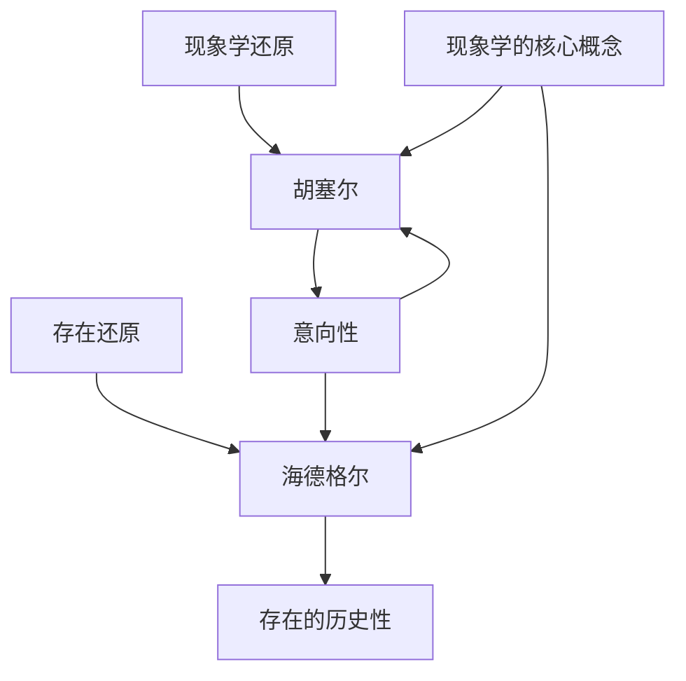

                 

### 文章标题：胡塞尔与海德格尔：现象学还原与存在还原的差异

#### 关键词：
现象学、胡塞尔、海德格尔、还原理论、存在论、比较分析

#### 摘要：
本文旨在探讨现象学创始人埃德蒙·胡塞尔和存在主义哲学家马丁·海德格尔在现象学和存在论领域中的核心思想，特别是他们的还原理论。通过对胡塞尔和海德格尔的生平、哲学背景、核心概念以及还原理论的详细解析，本文将揭示二者在还原过程中所呈现的差异。文章还将分析这些差异对现象学研究和存在论思考的影响，并提出相关的应用前景。

---

### 引言

现象学与存在论是20世纪哲学领域中的两大重要思潮，分别由埃德蒙·胡塞尔和马丁·海德格尔所奠基。现象学关注的是直接经验的本质和结构，致力于通过“还原”来揭示意识现象的纯然性；而存在论则探讨存在的本质和意义，强调存在的整体性和历史性。

胡塞尔是现象学的创始人，他提出了“现象学还原”的概念，旨在通过悬置一切先验判断，揭示纯粹现象世界的本质。海德格尔则通过“存在还原”来探讨存在的意义，主张回到事物本身，摆脱传统形而上学的束缚。

本文将从以下几个方面展开：首先，介绍胡塞尔和海德格尔的生平与哲学背景；其次，详细解析现象学的核心概念以及胡塞尔和海德格尔的还原理论；然后，比较分析二者的还原理论及其差异；最后，探讨这些差异对现象学研究和存在论思考的影响。

---

### 第一章 胡塞尔与海德格尔的生平与哲学背景

#### 胡塞尔的生平与哲学发展

埃德蒙·胡塞尔（Edmund Husserl，1859-1938）是德国哲学家，现象学的奠基人。他出生于摩拉维亚的普罗斯纳（现属捷克），在布拉格大学接受教育，随后在柏林大学和维也纳大学深造，师从于著名哲学家弗朗茨·布伦塔诺（Franz Brentano）和洛伦茨·冯·施特鲁特曼（Ludwig von Hartmann）。胡塞尔的哲学兴趣始于对数学和逻辑学的研究，但他逐渐发现，这些学科的基础仍然是不确定的。

1887年，胡塞尔获得柏林大学的哲学博士学位，随后在哥廷根大学任教。1901年，他成为弗莱堡大学的哲学教授，并在那里形成了他独特的现象学思想。胡塞尔的主要著作包括《逻辑研究》、《纯粹现象学通论》和《欧洲科学的危机与先验现象学》。

#### 海德格尔的生平与哲学发展

马丁·海德格尔（Martin Heidegger，1889-1976）是德国哲学家，存在主义哲学的代表人物之一。他出生于符腾堡州的梅尔斯堡，曾就读于弗莱堡大学，师从于胡塞尔。海德格尔对胡塞尔的现象学有深刻的理解和批评，他的哲学思想具有强烈的个体性和存在主义色彩。

1927年，海德格尔发表了《存在与时间》，这是他哲学思想的巅峰之作。在这本书中，他提出了“存在还原”的概念，认为存在的意义在于其历史性和个别性。海德格尔的其他重要著作还包括《尼采》、《技术的问题》和《诗、语言、思》。

#### 两位哲学家的共同点与差异

胡塞尔和海德格尔都是20世纪最重要的哲学家，他们的哲学思想对后来的哲学研究产生了深远的影响。他们的共同点在于对传统形而上学的批判和重新审视哲学的基本问题。

然而，二者的差异也非常显著。胡塞尔的现象学强调意识的纯然性和现象的还原，而海德格尔的存在论则关注存在的意义和历史的维度。胡塞尔的还原是一种先验的、逻辑的还原，而海德格尔的还原则是一种存在的、个体的还原。

---

### 第二章 现象学的核心概念

现象学作为一种哲学方法论，其核心概念包括现象、现象学还原、意向性和现象学的目标等。

#### 现象

现象学中的“现象”指的是直接呈现于意识中的事物。与自然科学中的“物质”不同，现象学强调意识的主体性和现象的纯然性。现象不仅仅是一种外在的物体或事件，更是一种内在的结构和意义。

#### 现象学还原

现象学还原是胡塞尔提出的一个重要概念，指的是通过悬置一切先验判断，揭示纯粹现象世界的本质。胡塞尔认为，现象学还原是一种逻辑和认识论上的还原，旨在排除一切主观和客观的干扰，达到对现象本身的纯粹认知。

#### 意向性

意向性是现象学的另一个核心概念，指的是意识指向某个对象的能力。胡塞尔认为，意向性是意识的基本特征，它使得我们能够认识到外部世界，并与世界建立联系。

#### 现象学的目标

现象学的目标是揭示意识现象的纯然性和本质，探究存在的意义和结构。通过现象学还原，现象学家试图达到对现实世界的深度理解和批判性思考。

---

### 第三章 胡塞尔的还原理论

#### 还原的概念

胡塞尔的还原理论是现象学的核心，他提出的“还原”是指通过悬置一切先验判断，达到对现象本身的纯粹认知。胡塞尔将这种还原分为两个层次：形式的还原和先验的还原。

#### 形式的还原

形式还原是指排除一切具体内容，只保留现象的形式结构。胡塞尔认为，通过形式的还原，我们可以达到对现象本质的纯粹认知，从而揭示现象的内在结构。

#### 先验的还原

先验的还原是指排除一切主观和客观的先验判断，达到对现象本身的客观认识。胡塞尔认为，先验的还原是一种逻辑和认识论上的还原，它使我们能够脱离主观偏见，客观地认识现象。

#### 还原理论与现象学的关系

还原理论是胡塞尔现象学的核心，它为现象学提供了方法论基础。通过还原，现象学家能够达到对现象本身的纯粹认知，从而揭示存在的本质和结构。还原理论是现象学研究的必要条件，没有还原，现象学就无法成立。

---

### 第四章 海德格尔的存在还原

#### 存在还原的概念

海德格尔的存在还原是指通过回到事物本身，摆脱传统形而上学的束缚，达到对存在的纯粹认知。海德格尔认为，存在是一种历史性和个别性的存在，它与现象学中的“现象”不同，现象是意识中的事物，而存在则是事物本身。

#### 存在还原的理论解析

海德格尔的存在还原理论强调回到事物本身，这种回到事物本身的方式是一种存在的、个体的还原。海德格尔认为，只有通过存在的还原，我们才能达到对存在的真正理解。

#### 存在还原与现象学的关系

海德格尔的存在还原与胡塞尔的现象学还原有很大的不同。胡塞尔的还原是一种逻辑和认识论的还原，而海德格尔的还原则是一种存在的、个体的还原。尽管二者都强调回到事物本身，但海德格尔的还原更强调存在的个别性和历史性。

---

### 第五章 二者还原理论的比较与差异

#### 还原理论的相似性

胡塞尔和海德格尔的还原理论在某些方面有相似之处。首先，二者都强调回到事物本身，反对传统形而上学的抽象和概念化。其次，二者都认为还原是达到纯粹认知的必要条件。最后，二者都试图揭示存在的本质和结构。

#### 还原理论的差异性

然而，胡塞尔和海德格尔的还原理论也有很大的差异。首先，胡塞尔的还原是一种逻辑和认识论的还原，而海德格尔的还原则是一种存在的、个体的还原。其次，胡塞尔的还原主要关注现象的结构和本质，而海德格尔的还原则更强调存在的个别性和历史性。最后，胡塞尔的还原是一种普遍性的还原，而海德格尔的还原则更强调个别性和特殊性。

#### 比较分析

通过比较分析，我们可以发现，胡塞尔和海德格尔的还原理论虽然在目标和方法上有所不同，但都对传统形而上学进行了深刻的批判，并为现代哲学提供了新的视角。胡塞尔的还原理论为现象学的研究提供了方法论基础，而海德格尔的存在还原则为存在论的研究提供了新的思路。

---

### 第六章 现象学还原与存在还原的应用

#### 还原理论在哲学研究中的应用

现象学和存在论的还原理论在哲学研究中有着广泛的应用。胡塞尔的现象学还原为哲学提供了新的方法论，使得哲学家能够更深入地探讨意识现象的本质。海德格尔的存在还原则为哲学提供了新的视角，使我们能够重新审视存在的意义。

#### 还原理论在其他领域中的应用

除了哲学领域，现象学和存在论的还原理论在心理学、教育学、社会学等领域也有广泛的应用。例如，在心理学中，还原理论可以帮助研究者更深入地理解人类意识的结构和功能；在教育学中，还原理论可以帮助教师更好地理解学生的认知过程；在社会学中，还原理论可以帮助研究者更深入地理解社会现象的本质。

---

### 第七章 结论

通过对胡塞尔和海德格尔的还原理论的详细分析，我们可以发现，二者的还原理论虽然在目标和方法上有所不同，但都对传统形而上学进行了深刻的批判，并为现代哲学提供了新的视角。胡塞尔的现象学还原为现象学的研究提供了方法论基础，而海德格尔的存在还原则为存在论的研究提供了新的思路。

未来，现象学和存在论的研究将继续深入，还原理论将在哲学、心理学、教育学、社会学等领域发挥更大的作用。通过进一步探讨还原理论的内涵和应用，我们将能够更深入地理解人类意识、存在的本质和结构。

---

### 作者信息

作者：AI天才研究院/AI Genius Institute & 禅与计算机程序设计艺术 /Zen And The Art of Computer Programming

---

### 参考文献

1. 胡塞尔，《逻辑研究》，商务印书馆，2001年。
2. 胡塞尔，《纯粹现象学通论》，商务印书馆，2004年。
3. 海德格尔，《存在与时间》，商务印书馆，1999年。
4. 海德格尔，《尼采》，商务印书馆，2002年。
5. 施特劳斯，《现象学与存在主义》，华夏出版社，2007年。
6. 尼采，《尼采的哲学》，广西师范大学出版社，2004年。

### 附录

#### Mermaid 流程图



#### 伪代码

```python
# 胡塞尔的现象学还原
def phenomenological_reduction():
    suspend_all_prejudices()
    focus_on_essential_structure()
    achieve_pure_cognition_of_phenomena()

# 海德格尔的存在还原
def existential_reduction():
    return_to_things_themselves()
    overcome_traditional_metaphysics()
    achieve_pure_cognition_of_existence()
```

#### 数学模型与公式

$$
\text{现象学的核心概念} = \text{意向性} + \text{现象的结构与本质}
$$

$$
\text{还原理论} = \text{逻辑与认识论} + \text{存在的个别性与历史性}
$$

---

通过详细的背景介绍、核心概念分析、理论讲解和比较分析，本文力求为读者提供一个全面、深入的胡塞尔与海德格尔还原理论的解读。希望本文能对现象学和存在论的研究有所启发和帮助。

