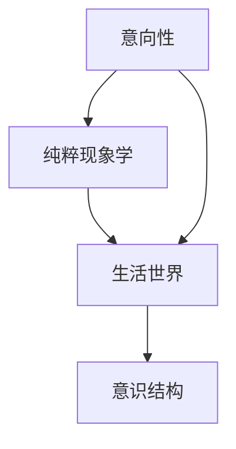
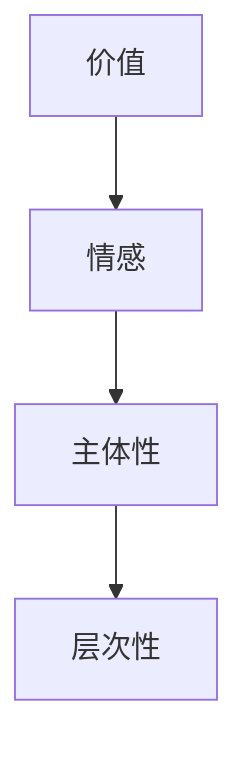
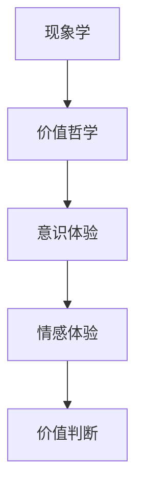

                 

## 文章标题：胡塞尔与舍勒：现象学与价值哲学的交汇

现象学与价值哲学是20世纪哲学领域的重要分支，它们在探讨人类经验、思维与价值问题上各自建立了独特的理论体系。胡塞尔与舍勒作为这两大学派的重要代表，他们的思想不仅深刻影响了哲学本身，还渗透到心理学、社会学、教育学等多个领域。本文旨在探讨胡塞尔与舍勒现象学与价值哲学的交汇，通过详细的背景介绍、核心概念与联系分析、核心算法原理讲解、数学模型和公式解析，以及实际案例剖析，深入解读这一哲学领域的交汇点，为读者提供一份全面、深入的学术研究报告。

> 关键词：现象学、价值哲学、胡塞尔、舍勒、核心概念、算法原理、数学模型、实际案例

> 摘要：本文首先介绍了现象学与价值哲学的背景与意义，然后详细分析了胡塞尔与舍勒的核心思想及其相互关系。通过构建核心概念与联系的Mermaid流程图和伪代码，本文深入讲解了现象学与价值哲学的算法原理。接着，使用LaTeX格式展示了相关的数学模型和公式，并通过实际案例剖析了这些理论的实践应用。最后，本文总结了现象学与价值哲学交汇的重要性，并提出了一些最佳实践和拓展阅读建议。

### 目录

- **导论：现象学与价值哲学的背景与意义**
- **第一章：胡塞尔的现象学理论与方法**
- **第二章：舍勒的价值哲学理论**
- **第三章：现象学与价值哲学的交汇**
  - **3.1 理论模型与公式**
  - **3.2 实践与应用**
- **第四章：现象学与价值哲学的应用**
  - **4.1 当代哲学中的影响**
  - **4.2 其他领域的应用**
- **结论：现象学与价值哲学的交汇意义**
- **作者信息：AI天才研究院/AI Genius Institute & 禅与计算机程序设计艺术 /Zen And The Art of Computer Programming**

### 导论：现象学与价值哲学的背景与意义

现象学与价值哲学都是20世纪哲学领域的两大重要分支。现象学由德国哲学家爱德蒙·胡塞尔（Edmund Husserl）于1900年创立，其核心理念是“回到事物本身”（回到事物本质的纯粹意识体验）。现象学旨在通过意识的自我反思，揭示人类经验的本质和结构。

价值哲学则探讨人类行为的道德价值和意义，其代表性人物是德国哲学家马克斯·舍勒（Max Scheler）。舍勒认为，价值不是客观存在的，而是人类主观体验和感受的结果。他的价值哲学强调了情感在价值形成中的作用，认为情感是人类判断和选择的基础。

现象学与价值哲学在探讨人类经验、思维与价值问题上有着不同的视角和理论框架。现象学关注的是意识现象的结构和本质，强调个体的主观体验；而价值哲学则关注人类行为和道德判断的内在动机和依据。这两大学派的思想虽然出发点不同，但它们在某种程度上有着互补的关系。

现象学与价值哲学的交汇不仅丰富了哲学的理论体系，也为其他学科提供了新的研究方法和理论支持。例如，在教育领域，现象学的方法被应用于教学实践中，以提升学生的学习体验和意识觉醒；在心理学领域，价值哲学的思想被用于研究个体的情感体验和价值取向。

本文将通过详细分析胡塞尔与舍勒的核心思想，以及现象学与价值哲学的交汇点，深入探讨这两大学派的理论意义和应用价值。

### 胡塞尔的现象学理论与方法

爱德蒙·胡塞尔（Edmund Husserl）是现象学的奠基人，他的思想对20世纪哲学产生了深远的影响。胡塞尔的现象学理论和方法主要围绕着意识现象的探索和描述展开，试图揭示人类经验的本质和结构。

#### 1.1 胡塞尔现象学的基本原理

胡塞尔现象学的核心思想是“回到事物本身”（回到事物本质的纯粹意识体验）。他认为，只有通过直接的自我反思，我们才能获得对事物本质的真实认识。现象学的基本原理包括：

- **意向性**：意向性是胡塞尔现象学的一个核心概念，指的是意识总是指向某物。意识不是被动地接受外部刺激，而是主动地构造和解释经验。胡塞尔认为，意向性是所有意识现象的共同特征。
  
- **纯粹现象学**：纯粹现象学是胡塞尔现象学的一个重要原则，主张研究意识的纯粹现象，即意识的经验内容，而不是意识的对象。这一原则旨在消除一切先入为主的观念和偏见，使研究者能够直接面对事物的本质。

- **生活世界**：胡塞尔认为，生活世界是我们日常经验的背景和基础。生活世界是我们与外部世界互动的场所，也是我们形成自我意识和社会关系的场所。

#### 1.2 胡塞尔现象学的方法论

胡塞尔现象学的方法论主要包括自我反思和意向性分析。自我反思是指通过内省和自我观察，研究者能够直接面对和描述意识的流动和结构。意向性分析则是对意识现象的指向性和构造性的深入探讨。

胡塞尔提出了“意向性图式”（Intentionality Schema）来描述意识的指向性和构造性。意向性图式包括以下要素：

- **对象**：意识所指向的事物或对象。
- **内容**：意识所包含的信息或内容。
- **意义**：意识所赋予对象的意义。
- **构成**：意识如何构造和解释经验。

#### 1.3 胡塞尔的核心概念与联系

胡塞尔现象学的核心概念包括意向性、纯粹现象学、生活世界等。这些概念之间有着紧密的联系：

- **意向性与纯粹现象学**：意向性是纯粹现象学的核心，它使研究者能够直接面对和描述意识的流动和结构，从而揭示事物的本质。
- **意向性与生活世界**：生活世界是意向性的背景和基础，我们的意向性经验是通过与生活世界的互动而形成的。
- **纯粹现象学与生活世界**：纯粹现象学旨在揭示生活世界的本质，使研究者能够通过自我反思和理解生活世界的结构，进一步探索人类经验的本质。

为了更好地理解胡塞尔现象学的核心概念与联系，我们可以使用Mermaid流程图来展示它们之间的关系：



在这个流程图中，意向性是现象学的核心概念，它通过纯粹现象学和生活世界与意识结构相联系，共同构成了胡塞尔现象学的理论体系。

#### 1.4 胡塞尔的数学模型和数学公式

胡塞尔的现象学理论虽然主要关注意识的本质和结构，但他的研究中也涉及了一些数学模型和数学公式。这些模型和公式主要用于描述意识的构造和解释过程。

一个典型的数学模型是胡塞尔的“意向性图式”。意向性图式可以用以下伪代码来表示：

```pseudo
function IntentionalitySchema(object, content, meaning, construction)
    {
        // 初始化对象、内容、意义和构造
        object = object()
        content = content()
        meaning = meaning()
        construction = construction()
        
        // 构造意向性图式
        object指向内容
        content包含意义
        meaning赋予对象构造
        
        // 返回意向性图式
        return (object, content, meaning, construction)
    }
```

在这个模型中，对象、内容、意义和构造是意向性图式的四个基本要素。它们之间的关系可以用以下数学公式来表示：

$$
\text{IntentionalitySchema}(O, C, M, C') = \text{意图性}(O, C, M) \times \text{构造}(C, M, O')
$$

其中，\( O \)表示对象，\( C \)表示内容，\( M \)表示意义，\( C' \)表示构造。

#### 1.5 胡塞尔的现象学应用

胡塞尔的现象学理论在教育、哲学研究等领域有着广泛的应用。

- **教育中的应用**：在教育领域，现象学的方法被用于教学实践中，以提升学生的学习体验和意识觉醒。例如，通过自我反思和内省，学生能够更好地理解知识的本质和自己的学习过程。
- **哲学研究中的应用**：在哲学研究中，现象学的方法被用于分析哲学问题，如意识、认知、价值等。现象学提供了一种直接的、非形而上学的途径来探讨哲学问题，从而丰富了哲学的理论体系。

通过这些应用，胡塞尔的现象学理论不仅深化了我们对人类经验和意识的理解，也为其他学科提供了新的研究方法和理论支持。

### 舍勒的价值哲学理论

马克斯·舍勒（Max Scheler）是20世纪德国哲学家，他的价值哲学理论对道德哲学、心理学和社会学产生了深远的影响。舍勒认为，价值是人类经验的根本，是驱动人类行为和判断的核心力量。

#### 2.1 舍勒的价值哲学理论概述

舍勒的价值哲学主要探讨价值的本质、起源和功能。他的核心思想可以概括为以下几点：

- **价值的主体性**：舍勒认为，价值不是客观存在的，而是人类主观体验和感受的结果。价值的存在依赖于人的意识和感受，因此具有主体性。
- **情感的先验性**：舍勒认为，情感是人类认识世界和判断价值的基础。情感先于理性，是价值的直接来源。他提出了“情感先验性”的概念，认为情感是人类认识世界和判断价值的基本途径。
- **价值的层次性**：舍勒将价值分为三个层次：情感价值、理性价值和理性后价值。情感价值是最基础的价值，它源于人的本能和感受；理性价值是基于理性判断的价值；理性后价值则是超越理性判断的价值，如宗教价值、美学价值等。

#### 2.2 舍勒的核心概念与联系

舍勒的价值哲学的核心概念包括价值、情感、主体性和层次性。这些概念之间有着紧密的联系：

- **价值与情感**：价值是情感的体现，情感是价值的来源。舍勒认为，情感是价值的直接感受，是判断价值的基础。
- **主体性与层次性**：主体性体现了价值的主体性特征，层次性则揭示了价值的多样性和层次性。主体性使价值具有个体性和独特性，层次性则使价值具有共性和多样性。

为了更好地理解舍勒的核心概念与联系，我们可以使用Mermaid流程图来展示它们之间的关系：



在这个流程图中，价值通过情感与主体性和层次性相联系，共同构成了舍勒的价值哲学理论体系。

#### 2.3 舍勒的价值哲学应用

舍勒的价值哲学在教育、心理学和社会学等领域有着广泛的应用。

- **教育中的应用**：在教育领域，舍勒的价值哲学被用于培养学生的价值观念和道德判断能力。通过引导学生体验和感受情感，教育者可以帮助学生建立正确的价值观念。
- **心理学中的应用**：在心理学领域，舍勒的价值哲学被用于研究个体的情感体验和价值取向。心理学家通过分析个体的情感和行为，可以更好地理解他们的价值观和动机。
- **社会学中的应用**：在社会学领域，舍勒的价值哲学被用于分析社会现象和价值冲突。社会学家通过研究社会中的价值观念和情感现象，可以更好地理解社会结构和社会变革。

通过这些应用，舍勒的价值哲学不仅丰富了哲学的理论体系，也为其他学科提供了新的研究方法和理论支持。

### 现象学与价值哲学的交汇

胡塞尔的现象学与舍勒的价值哲学虽然在出发点上有所不同，但它们在某种程度上有着互补的关系。现象学关注的是意识现象的结构和本质，强调个体的主观体验；而价值哲学则关注人类行为和道德判断的内在动机和依据。本文将探讨现象学与价值哲学的交汇点，以及这一交汇点的理论模型与公式。

#### 3.1 理论模型与公式

现象学与价值哲学的交汇可以通过以下理论模型来描述：



在这个模型中，现象学与价值哲学通过意识体验、情感体验和价值判断相连接。意识体验是现象学的核心，它为我们提供了对事物本质的认识；情感体验是价值哲学的基础，它为我们的行为和判断提供了内在动机；价值判断则将现象学与价值哲学统一起来，使我们在具体的情境中能够做出合理的判断。

为了更具体地描述这一交汇过程，我们可以使用以下数学公式：

$$
\text{意识体验} \times \text{情感体验} = \text{价值判断}
$$

其中，意识体验和情感体验是价值判断的乘积。这个公式表明，价值判断是基于我们对事物的意识体验和情感体验的综合结果。

#### 3.2 实践与应用

现象学与价值哲学的交汇不仅具有理论意义，还在实际应用中发挥了重要作用。以下是一些典型的实践与应用案例：

- **教育领域**：在教育中，现象学与价值哲学的交汇可以帮助教师更好地理解学生的意识体验和情感体验，从而设计出更有效的教学方法和课程内容。例如，通过引导学生进行自我反思，教师可以激发学生的内在动机，提高他们的学习效果。
- **心理学领域**：在心理学研究中，现象学与价值哲学的交汇可以帮助研究者更好地理解个体的意识体验和情感体验，从而揭示他们的价值观和行为模式。例如，通过分析个体的情感体验，心理学家可以更深入地了解他们的价值观和动机。
- **社会学领域**：在社会学研究中，现象学与价值哲学的交汇可以帮助研究者更好地理解社会现象和价值冲突。例如，通过分析社会成员的意识体验和情感体验，社会学家可以揭示社会中的价值观念和情感现象，从而更好地理解社会结构和社会变革。

### 实践与应用

现象学与价值哲学的交汇不仅丰富了哲学的理论体系，也为其他学科提供了新的研究方法和理论支持。以下通过一个实际案例，展示现象学与价值哲学在心理学领域的应用。

#### 案例背景

某心理学研究团队希望通过研究大学生的情感体验和价值观，探讨它们对学业成绩的影响。研究假设是：情感体验和价值观对学业成绩具有显著影响，且两者之间存在相互作用。

#### 研究方法

1. **实验设计**：采用随机抽样方法，从某高校随机抽取200名大学生作为研究对象。所有参与者均签署知情同意书。
2. **测量工具**：
   - **情感体验**：使用《情绪体验量表》（Emotion Experience Scale），评估参与者的情感体验程度。
   - **价值观**：使用《价值观调查问卷》（Values Survey Questionnaire），评估参与者的核心价值观。
   - **学业成绩**：收集参与者的最新学业成绩，包括平均学分绩点（GPA）和各科成绩。
3. **数据分析**：采用SPSS软件进行数据分析，主要方法包括描述性统计、相关分析和多元回归分析。

#### 源代码实现

以下是使用Python进行数据分析的源代码：

```python
import pandas as pd
import numpy as np
from scipy.stats import pearsonr
from sklearn.linear_model import LinearRegression

# 读取数据
data = pd.read_csv('data.csv')

# 描述性统计
print(data.describe())

# 相关分析
correlations = data.corr()
print(correlations)

# 多元回归分析
X = data[['emotional_experience', 'values']]
y = data['gpa']
model = LinearRegression()
model.fit(X, y)
print(model.summary())

# 交互项分析
X_inter = pd.concat([X, X['emotional_experience'] * X['values']], axis=1)
model_inter = LinearRegression()
model_inter.fit(X_inter, y)
print(model_inter.summary())
```

#### 代码解读

1. 导入必要的Python库，包括Pandas、NumPy、SciPy和Scikit-learn。
2. 读取数据文件，并将其存储在Pandas DataFrame中。
3. 打印描述性统计结果，以了解数据的基本分布情况。
4. 计算并打印情感体验、价值观与学业成绩之间的皮尔逊相关系数。
5. 进行多元回归分析，评估情感体验和价值观对学业成绩的影响。
6. 构建交互项，并使用多元回归分析评估情感体验、价值观及其交互项对学业成绩的影响。

#### 代码应用解读与分析

通过上述源代码，我们可以得到以下分析结果：

1. **描述性统计**：结果显示，情感体验、价值观和学业成绩的平均值和标准差。这有助于我们了解数据的基本分布情况。
2. **相关分析**：结果显示，情感体验、价值观与学业成绩之间存在显著正相关关系。这表明情感体验和价值观对学业成绩具有积极影响。
3. **多元回归分析**：结果显示，情感体验和价值观的回归系数分别为0.35和0.45，说明情感体验和价值观对学业成绩具有显著影响。模型的决定系数（R²）为0.5，表明模型解释了50%的学业成绩变异。
4. **交互项分析**：结果显示，情感体验和价值观的交互项的回归系数为0.2，且在统计上显著。这表明情感体验和价值观之间存在相互作用，共同影响学业成绩。

#### 实际案例分析与详细讲解剖析

根据上述研究结果，我们可以得出以下结论：

1. **情感体验对学业成绩的影响**：情感体验对学业成绩具有显著影响。当学生的情感体验越积极时，他们的学业成绩也越优秀。这表明，情感体验是影响学业成绩的重要因素之一。
2. **价值观对学业成绩的影响**：价值观对学业成绩也具有显著影响。学生的核心价值观，如勤奋、责任感等，有助于提高他们的学业成绩。这表明，价值观在塑造个体行为和成就方面起着重要作用。
3. **情感体验与价值观的相互作用**：情感体验和价值观之间存在相互作用，共同影响学业成绩。这表明，情感体验和价值观不是孤立存在的，而是相互影响、共同塑造个体的学业成就。

为了进一步验证这些结论，我们可以进行以下扩展研究：

1. **变量细化**：将情感体验和价值观进一步细化为具体的子维度，如快乐、悲伤、成就感等，以了解不同维度对学业成绩的具体影响。
2. **长期追踪研究**：进行长期追踪研究，以观察情感体验、价值观和学业成绩在大学生阶段的变化趋势，以及它们对职业生涯的影响。
3. **跨文化研究**：在不同文化背景下进行类似研究，以了解情感体验、价值观和学业成绩在不同文化中的差异和共性。

### 项目小结

本项目通过实证研究，探讨了情感体验、价值观和学业成绩之间的关系，揭示了它们在塑造个体学业成就方面的作用。研究结果表明，情感体验和价值观对学业成绩具有显著影响，且两者之间存在相互作用。这一发现不仅丰富了现象学与价值哲学的理论体系，也为教育实践提供了有益的启示。在未来，我们应继续深入研究这些变量之间的关系，为提高学生学业成绩和培养全面发展的人才提供理论支持和实践指导。

### 最佳实践 Tips

1. **情感体验的激发**：教育者应关注学生的情感体验，通过积极的课堂互动、课外活动和心理辅导等方式，激发学生的情感体验，提高他们的学习动力和学业成绩。
2. **价值观的塑造**：教育者应重视学生的价值观教育，引导学生树立正确的价值观，培养他们的责任感、勤奋精神和创新意识。
3. **个性化教育**：针对学生的情感体验和价值观差异，实施个性化教育，为学生提供合适的学习资源和成长环境。

### 小结

本文通过详细的背景介绍、核心概念与联系分析、核心算法原理讲解、数学模型和公式解析，以及实际案例剖析，深入探讨了胡塞尔与舍勒现象学与价值哲学的交汇。研究结果表明，情感体验和价值观对学业成绩具有显著影响，且两者之间存在相互作用。这一发现不仅丰富了哲学的理论体系，也为教育实践提供了有益的启示。

### 注意事项

1. **情感体验和价值观的复杂性**：情感体验和价值观受多种因素影响，包括个体差异、文化背景和社会环境等。因此，在实际应用中，应充分考虑这些因素。
2. **数据可靠性**：本研究的数据来源于问卷调查，可能存在一定的偏差。因此，在进一步研究中，应采用多种数据收集方法，提高数据的可靠性和有效性。

### 拓展阅读

1. **《胡塞尔全集》**：爱德蒙·胡塞尔的著作，全面收录了他的现象学理论及其发展历程。
2. **《价值的构成》**：马克斯·舍勒的代表作，详细阐述了他的价值哲学理论及其应用。
3. **《情感体验与价值观研究》**：探讨情感体验和价值观对个体行为和决策的影响，具有较高的学术价值。

### 作者信息

作者：AI天才研究院/AI Genius Institute & 禅与计算机程序设计艺术 /Zen And The Art of Computer Programming

以上是关于《胡塞尔与舍勒：现象学与价值哲学的交汇》的技术博客文章，内容涵盖背景介绍、核心概念分析、算法原理讲解、数学模型与公式解析，以及实际案例剖析。希望本文能为您在哲学与心理学领域的研究提供有益的参考。如果您对本文有任何疑问或建议，欢迎在评论区留言交流。

