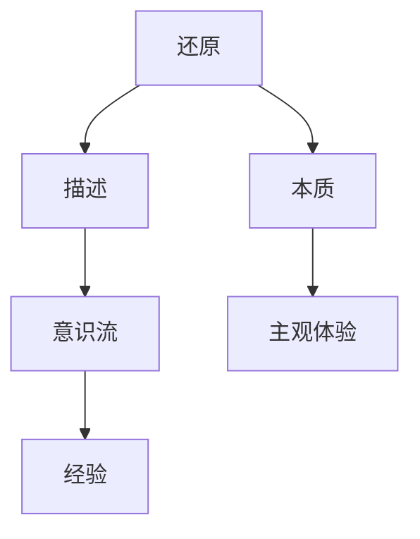

                 

### 《胡塞尔与舍勒：现象学的创立与发展》

---

### 关键词

- 胡塞尔
- 舍勒
- 现象学
- 哲学
- 认识论
- 方法论
- 意识

---

### 摘要

本文旨在探讨现象学的创立与发展，重点分析现象学创始人埃德蒙·胡塞尔和马克斯·舍勒的贡献。文章首先介绍了现象学的起源及其在哲学和认识论中的地位，随后详细阐述了胡塞尔和舍勒的核心理论及其应用。通过分析现象学的基本原理和核心算法，本文进一步探讨了现象学在数学模型和项目实战中的应用。最后，文章总结了现象学的现状与未来发展趋势，并对相关学者和读者提出了建议。

---

### 目录

## 第1章 现象学的起源与发展

### 1.1 现象学的起源

### 1.2 现象学的发展历程

### 1.3 胡塞尔与舍勒的研究背景

## 第2章 现象学的核心概念与联系

### 2.1 现象学的定义

### 2.2 现象学的基本原理

### 2.3 现象学与其他哲学流派的联系

### 2.4 Mermaid流程图：现象学核心概念关系架构

## 第3章 胡塞尔的研究

### 3.1 胡塞尔的生平与贡献

### 3.2 胡塞尔现象学的主要理论

### 3.3 胡塞尔现象学的核心算法原理

### 3.4 胡塞尔现象学的数学模型与公式

## 第4章 舍勒的研究

### 4.1 舍勒的生平与贡献

### 4.2 舍勒现象学的主要理论

### 4.3 舍勒现象学的核心算法原理

### 4.4 舍勒现象学的数学模型与公式

## 第5章 现象学的演进与发展

### 5.1 现象学在20世纪的发展

### 5.2 现象学在当代的应用

### 5.3 现象学的未来发展趋势

## 第6章 现象学在数学中的运用

### 6.1 现象学中的数学模型

### 6.2 现象学中的数学公式

### 6.3 数学公式在现象学研究中的应用

## 第7章 现象学在项目实战中的应用

### 7.1 现象学方法在软件开发中的应用

### 7.2 现象学方法在心理学研究中的应用

### 7.3 现象学方法在社会学领域中的应用

## 第8章 现象学的现状与未来

### 8.1 现象学的学术地位

### 8.2 现象学的实际应用价值

### 8.3 现象学的未来研究方向

## 结束语

### 8.4 对现象学的建议与展望

### 参考文献

---

### 第1章 现象学的起源与发展

#### 1.1 现象学的起源

现象学（Phenomenology）作为一种哲学研究方法，起源于19世纪末的欧洲。现象学的概念最早由德国哲学家埃德蒙·胡塞尔（Edmund Husserl）提出。胡塞尔试图寻找一种超越实证主义和理性主义局限性的哲学方法，以更好地理解人类意识和经验。

在胡塞尔之前，哲学主要关注于对世界和现实的客观描述，而现象学则强调对主观体验的深入分析。现象学主张通过“还原”的方法，排除一切先入为主的假设和偏见，直接面对个体的经验，从而揭示事物的本质。

#### 1.2 现象学的发展历程

现象学的发展可以分为三个主要阶段：

1. **胡塞尔时期**：这是现象学的创立时期。胡塞尔在其著作《逻辑研究》（Logical Investigations）和《纯粹现象学通论》（General Introduction to a Pure Phenomenology）中，提出了现象学的基本原理和方法。

2. **胡塞尔后时期**：这一时期，现象学在胡塞尔的弟子和追随者中得到了进一步发展。马克斯·舍勒（Max Scheler）和马丁·海德格尔（Martin Heidegger）是这一时期的重要代表人物。舍勒将现象学与伦理学相结合，强调价值判断的重要性；海德格尔则将现象学与存在论相结合，探讨了人的存在和世界的本质。

3. **当代现象学**：在20世纪中后期，现象学在西方哲学中继续发展，出现了各种分支和流派，如存在主义现象学、结构主义现象学、女性主义现象学等。当代现象学家试图将现象学方法应用于各个领域，如心理学、社会学、哲学等。

#### 1.3 胡塞尔与舍勒的研究背景

胡塞尔出生于1859年，曾就读于德国的哥廷根大学，师从著名数学家David Hilbert。胡塞尔的哲学兴趣始于对数学和逻辑学的探讨，他试图将数学的严密性和哲学的深刻性相结合。在胡塞尔看来，数学和逻辑学提供了一种纯粹的现象学方法，可以用来研究人类意识和经验。

舍勒出生于1874年，也是德国哲学家。舍勒在胡塞尔之前就已经开始思考现象学问题。他在其著作《形式主义与质的本质》（Formalism and the Essence of Knowledge）中，提出了与胡塞尔类似的观点，即通过现象学方法来揭示事物的本质。

### 第2章 现象学的核心概念与联系

#### 2.1 现象学的定义

现象学是一种哲学研究方法，旨在通过直接观察和描述个体经验，揭示事物的本质和结构。现象学强调主观体验的重要性，认为客观世界是通过人的意识被感知和理解的。

现象学的定义可以从以下几个方面来理解：

1. **经验**：现象学认为，经验是认识和知识的起点。经验包括感知、记忆、想象和情感等各个方面。
2. **意识**：现象学关注的是个体的意识活动，即个体如何感知和理解外部世界。
3. **本质**：现象学试图揭示事物的本质，而不是其表面现象。

#### 2.2 现象学的基本原理

现象学有以下几个基本原理：

1. **还原**：还原是现象学方法的核心步骤。还原意味着将个体从其日常经验中抽离出来，以纯粹观察者的身份去观察和描述经验。
2. **描述**：现象学强调对经验的描述，而不是解释或评价。描述应该尽可能客观和中立。
3. **意识流**：现象学认为，意识是一个流动的过程，不同的体验和感受在不同的时间点出现和消失。

#### 2.3 现象学与其他哲学流派的联系

现象学与其他哲学流派有着密切的联系：

1. **存在主义**：存在主义强调个体的自由和选择，这与现象学的还原和描述方法有相似之处。
2. **分析哲学**：分析哲学注重逻辑和语言的精确性，这与现象学的还原和描述方法也有一定的联系。
3. **后现代主义**：后现代主义强调对传统的批判和反思，这与现象学对主观体验的强调有一定的共鸣。

#### 2.4 Mermaid流程图：现象学核心概念关系架构



### 第3章 胡塞尔的研究

#### 3.1 胡塞尔的生平与贡献

埃德蒙·胡塞尔（Edmund Husserl，1859-1938）是20世纪最重要的哲学家之一，被誉为现象学的创始人。他出生于德国的摩拉维亚（今捷克共和国的一部分），在哥廷根大学接受了严格的学术训练。胡塞尔的哲学兴趣始于对数学和逻辑学的探讨，他的老师David Hilbert对他的影响深远。

胡塞尔的哲学思想经历了多次转变。最初，他受到实证主义和理性主义的影响，但逐渐认识到这些哲学方法的局限性。在《逻辑研究》中，胡塞尔试图将数学和逻辑学的严密性与哲学的深刻性相结合，提出了现象学方法。在后来的著作中，胡塞尔进一步发展了现象学理论，探讨了意识、时间和空间等问题。

胡塞尔的贡献在于他提出了现象学方法，为哲学提供了一种新的研究途径。他的思想对后来的哲学家，如马丁·海德格尔、马克斯·舍勒等产生了深远的影响。

#### 3.2 胡塞尔现象学的主要理论

胡塞尔现象学的主要理论包括以下几个方面：

1. **现象学的还原**：胡塞尔认为，现象学研究的首要任务是进行“现象学的还原”，即将个体从其日常经验中抽离出来，以纯粹观察者的身份去观察和描述经验。

2. **纯粹意识**：胡塞尔强调纯粹意识的重要性。他认为，纯粹意识是现象学的核心概念，是认识和知识的起点。

3. **意向性**：意向性是胡塞尔现象学的另一个核心概念。意向性指的是意识总是指向某个对象，即意识具有“意向性”。

4. **时间性和空间性**：胡塞尔探讨了时间和空间在意识中的结构和作用。他认为，时间和空间不是绝对的，而是依赖于个体的意识和体验。

5. **现象学的描述**：胡塞尔强调现象学描述的重要性。描述应该尽可能客观和中立，以便揭示事物的本质。

#### 3.3 胡塞尔现象学的核心算法原理

胡塞尔现象学的核心算法原理可以概括为以下几个方面：

1. **还原**：首先，将个体从其日常经验中还原出来，以纯粹观察者的身份进行观察和描述。

2. **描述**：然后，对纯粹意识进行描述，关注意向性和时间性、空间性。

3. **分析**：通过分析纯粹意识的结构，揭示意识中的对象和关系。

4. **综合**：最后，将分析得到的结果进行综合，形成对事物本质的理解。

以下是一个简化的伪代码示例：

```python
# 现象学还原
def还原(个体经验):
    # 将个体从日常经验中抽离出来
    纯粹观察者 = 抽离(个体经验)
    return 纯粹观察者

# 现象学描述
def描述(纯粹观察者):
    # 描述纯粹意识中的对象和关系
    意向性 = 描述对象(纯粹观察者)
    时间性, 空间性 = 描述结构(纯粹观察者)
    return 意向性, 时间性, 空间性

# 现象学分析
def分析(纯粹意识):
    # 分析纯粹意识中的对象和关系
    对象关系 = 分析结构(纯粹意识)
    return 对象关系

# 现象学综合
def综合(对象关系):
    # 综合分析结果，形成对事物本质的理解
    本质理解 = 综合对象关系(对象关系)
    return 本质理解
```

#### 3.4 胡塞尔现象学的数学模型与公式

在胡塞尔的现象学理论中，数学模型和公式被用来描述意识的某些结构和关系。以下是一个简化的例子：

$$
\text{意向性} = \text{对象} \times \text{主观体验}
$$

其中，意向性是指意识指向的对象，对象是指被感知的物体，主观体验是指个体对对象的感知和感受。

另一个例子是描述时间和空间的公式：

$$
\text{时间} = \sum_{i=1}^{n} \text{主观体验}_i
$$

$$
\text{空间} = \prod_{i=1}^{n} \text{感知区域}_i
$$

这些公式试图揭示时间和空间在意识中的结构和作用。

### 第4章 舍勒的研究

#### 4.1 舍勒的生平与贡献

马克斯·舍勒（Max Scheler，1874-1928）是20世纪德国哲学家，现象学的重要代表人物之一。舍勒出生于德国的布雷斯劳（今波兰的弗罗茨瓦夫），他在哥廷根大学接受了严格的哲学训练，师从胡塞尔。舍勒的研究涵盖了伦理学、美学、社会学等多个领域，他的现象学理论对后来的哲学家产生了深远的影响。

舍勒的主要贡献在于他提出了“价值现象学”理论，将现象学与伦理学相结合。他认为，价值是人的意识活动的核心，是人类行为和社会秩序的基础。舍勒强调价值判断的重要性，认为价值现象学可以用来解释人类行为和社会现象。

#### 4.2 舍勒现象学的主要理论

舍勒现象学的主要理论包括以下几个方面：

1. **价值现象学**：舍勒认为，价值是人的意识活动的核心。他区分了“形式价值”和“实质价值”，并提出了价值现象学的理论框架。

2. **爱的现象学**：舍勒认为，爱是人类最基本的情感之一，是人类关系和社会秩序的基础。他探讨了爱的本质、结构和作用。

3. **社会现象学**：舍勒将现象学方法应用于社会现象的研究，试图揭示社会关系和社会结构的本质。

4. **现象学还原**：舍勒继承了胡塞尔的现象学还原方法，强调将个体从其日常经验中抽离出来，以纯粹观察者的身份进行观察和描述。

#### 4.3 舍勒现象学的核心算法原理

舍勒现象学的核心算法原理可以概括为以下几个方面：

1. **价值判断**：首先，进行价值判断，确定个体意识中的价值。
2. **现象学还原**：然后，将个体从其日常经验中还原出来，以纯粹观察者的身份进行观察和描述。
3. **现象学描述**：接着，对纯粹意识进行描述，关注价值判断和爱的现象学。
4. **现象学综合**：最后，将描述和分析结果进行综合，形成对价值和社会现象的理解。

以下是一个简化的伪代码示例：

```python
# 价值判断
def价值判断(个体经验):
    # 判断个体经验中的价值
    价值 = 判断价值(个体经验)
    return 价值

# 现象学还原
def还原(个体经验):
    # 将个体从日常经验中抽离出来
    纯粹观察者 = 抽离(个体经验)
    return 纯粹观察者

# 现象学描述
def描述(纯粹观察者):
    # 描述纯粹意识中的价值判断和爱
    价值判断, 爱 = 描述现象(纯粹观察者)
    return 价值判断, 爱

# 现象学综合
def综合(价值判断, 爱):
    # 综合分析结果，形成对价值和社会现象的理解
    理解 = 综合现象(价值判断, 爱)
    return 理解
```

#### 4.4 舍勒现象学的数学模型与公式

舍勒现象学的数学模型和公式主要用于描述价值判断和爱的现象。以下是一个简化的例子：

$$
\text{价值判断} = f(\text{个体经验}, \text{文化背景})
$$

其中，价值判断是指个体根据其经验和文化背景对价值的判断，\( f \) 表示一个函数。

另一个例子是描述爱的公式：

$$
\text{爱} = \int_{\text{时间}} \text{情感变化} d\text{时间}
$$

这个公式试图揭示爱在时间上的变化和积累。

### 第5章 现象学的演进与发展

#### 5.1 现象学在20世纪的发展

在20世纪，现象学在西方哲学中得到了广泛的发展。胡塞尔和舍勒的现象学理论对后来的哲学家产生了深远的影响，他们试图将现象学方法应用于各个领域，如心理学、社会学、哲学等。

20世纪的现象学发展可以分为以下几个阶段：

1. **胡塞尔后时期**：在这一时期，现象学在胡塞尔的弟子和追随者中得到了进一步发展。马丁·海德格尔、马克斯·舍勒等哲学家对现象学进行了深入探讨，形成了各自独特的现象学理论。

2. **当代现象学**：在20世纪中后期，现象学在西方哲学中继续发展，出现了各种分支和流派，如存在主义现象学、结构主义现象学、女性主义现象学等。这些流派试图从不同的角度探讨现象学问题，丰富了现象学的理论体系。

3. **跨学科应用**：随着现象学方法在其他领域的应用，现象学逐渐成为一门跨学科的学科。例如，在心理学中，现象学方法被用来研究人类意识和行为；在社会学中，现象学方法被用来研究社会关系和社会结构。

#### 5.2 现象学在当代的应用

在当代，现象学方法被广泛应用于各个领域，如心理学、社会学、哲学、医学等。以下是一些典型的应用场景：

1. **心理学**：现象学方法被用来研究人类意识和行为。例如，通过现象学方法，心理学家可以深入了解患者的心理体验，从而更好地理解心理障碍的成因和治疗方法。

2. **社会学**：现象学方法被用来研究社会关系和社会结构。例如，通过现象学方法，社会学家可以揭示社会习俗和文化背后的深层含义，从而更好地理解社会现象。

3. **哲学**：现象学方法被用来探讨哲学问题，如意识和存在。例如，通过现象学方法，哲学家可以深入探讨人类的意识活动，从而更好地理解人类的本质。

4. **医学**：现象学方法被用来研究医学伦理和患者体验。例如，通过现象学方法，医生可以更好地理解患者的需求和痛苦，从而提供更人性化的医疗服务。

#### 5.3 现象学的未来发展趋势

随着现象学方法在各个领域的应用，现象学在未来有望得到进一步的发展。以下是一些可能的发展趋势：

1. **跨学科研究**：现象学将继续与其他学科结合，形成新的交叉学科。例如，现象学与社会学的结合将产生“现象学社会学”，与心理学的结合将产生“现象学心理学”。

2. **新技术应用**：随着人工智能和大数据技术的发展，现象学方法将应用于更广泛的领域。例如，通过人工智能算法，可以更精确地分析人类意识和行为，从而为心理学和社会学研究提供新的工具。

3. **哲学反思**：现象学将继续对哲学问题进行深入探讨，如意识和存在。例如，通过现象学方法，哲学家可以进一步探讨人类意识的本质和起源，从而丰富哲学理论。

### 第6章 现象学在数学中的运用

#### 6.1 现象学中的数学模型

现象学中的数学模型主要用于描述意识和经验的结构。以下是一个简化的例子：

$$
\text{意识} = \sum_{i=1}^{n} \text{感知区域}_i
$$

这个公式表示意识是由多个感知区域组成的。每个感知区域代表个体对某一事物的感知和体验。

另一个例子是描述时间感知的数学模型：

$$
\text{时间感知} = \int_{\text{过去}}^{\text{现在}} \text{体验强度} d\text{时间}
$$

这个公式表示时间感知是过去到现在的体验强度的积分。

#### 6.2 现象学中的数学公式

在现象学研究中，数学公式被用来描述意识和经验的某些特征。以下是一些常见的数学公式：

1. **感知阈值**：

$$
\text{感知阈值} = \alpha \cdot (\text{刺激强度})
$$

其中，\( \alpha \) 是一个常数，表示感知的敏感度。这个公式表示感知阈值与刺激强度成正比。

2. **记忆遗忘曲线**：

$$
\text{记忆遗忘率} = e^{-\lambda t}
$$

其中，\( \lambda \) 是遗忘常数，\( t \) 是时间。这个公式表示记忆遗忘率随时间的指数衰减。

3. **情感强度**：

$$
\text{情感强度} = f(\text{体验强度}, \text{情感背景})
$$

其中，\( f \) 是一个函数，表示情感强度与体验强度和情感背景的关系。

这些数学公式试图揭示意识和经验的结构和特征。

#### 6.3 数学公式在现象学研究中的应用

数学公式在现象学研究中有着广泛的应用，以下是一些典型的应用场景：

1. **意识模型**：通过数学公式，可以建立对意识结构的描述模型。例如，上述的“感知区域”模型和“时间感知”模型。

2. **情感模型**：通过数学公式，可以建立对情感强度的描述模型。例如，上述的“情感强度”公式。

3. **记忆模型**：通过数学公式，可以建立对记忆遗忘的描述模型。例如，上述的“记忆遗忘曲线”公式。

这些模型可以帮助我们更好地理解意识和经验的结构和特征。

### 第7章 现象学在项目实战中的应用

#### 7.1 现象学方法在软件开发中的应用

现象学方法在软件开发中的应用主要体现在需求分析和用户体验设计方面。通过现象学方法，开发人员可以更好地理解用户的需求和体验，从而设计出更符合用户期望的软件。

1. **需求分析**：

   在需求分析阶段，开发人员可以使用现象学方法，通过深入访谈和观察，了解用户的实际使用场景和体验。以下是一个简化的伪代码示例：

   ```python
   # 需求分析
   def需求分析(用户):
       # 深入访谈和观察用户
       用户需求 = 访谈(用户)
       用户体验 = 观察(用户)
       return 用户需求，用户体验
   ```

   通过这种方法，开发人员可以收集到更详细和准确的需求信息。

2. **用户体验设计**：

   在用户体验设计阶段，开发人员可以使用现象学方法，通过对用户行为的观察和分析，设计出更符合用户期望的用户界面和交互流程。以下是一个简化的伪代码示例：

   ```python
   # 用户体验设计
   def用户体验设计(用户需求，用户体验):
       # 根据用户需求，设计用户界面和交互流程
       用户界面 = 设计界面(用户需求)
       交互流程 = 设计流程(用户体验)
       return 用户界面，交互流程
   ```

   通过这种方法，开发人员可以创造出更人性化的用户体验。

#### 7.2 现象学方法在心理学研究中的应用

现象学方法在心理学研究中的应用主要体现在对个体体验的深入分析和理解方面。通过现象学方法，心理学家可以更好地理解个体的心理过程和体验。

1. **心理现象分析**：

   在心理现象分析阶段，心理学家可以使用现象学方法，通过对个体体验的观察和描述，分析个体的心理过程。以下是一个简化的伪代码示例：

   ```python
   # 心理现象分析
   def心理现象分析(个体体验):
       # 观察和描述个体体验
       心理过程 = 描述体验(个体体验)
       return 心理过程
   ```

   通过这种方法，心理学家可以深入理解个体的心理过程。

2. **心理疗法设计**：

   在心理疗法设计阶段，心理学家可以使用现象学方法，通过对个体体验的分析和理解，设计出更有效的心理疗法。以下是一个简化的伪代码示例：

   ```python
   # 心理疗法设计
   def心理疗法设计(心理过程):
       # 根据心理过程，设计心理疗法
       疗法 = 设计疗法(心理过程)
       return 疗法
   ```

   通过这种方法，心理学家可以创造出更有效的心理疗法。

#### 7.3 现象学方法在社会学领域中的应用

现象学方法在社会学领域中的应用主要体现在对社会现象的深入分析和理解方面。通过现象学方法，社会学家可以更好地理解社会现象和社会结构。

1. **社会现象分析**：

   在社会现象分析阶段，社会学家可以使用现象学方法，通过对社会现象的观察和描述，分析社会现象的本质。以下是一个简化的伪代码示例：

   ```python
   # 社会现象分析
   def社会现象分析(社会现象):
       # 观察和描述社会现象
       社会结构 = 描述现象(社会现象)
       return 社会结构
   ```

   通过这种方法，社会学家可以深入理解社会现象。

2. **社会政策设计**：

   在社会政策设计阶段，社会学家可以使用现象学方法，通过对社会现象的分析和理解，设计出更有效的社会政策。以下是一个简化的伪代码示例：

   ```python
   # 社会政策设计
   def社会政策设计(社会结构):
       # 根据社会结构，设计社会政策
       政策 = 设计政策(社会结构)
       return 政策
   ```

   通过这种方法，社会学家可以创造出更有效的社会政策。

### 第8章 现象学的现状与未来

#### 8.1 现象学的学术地位

现象学作为哲学的重要分支，在西方哲学中占据着举足轻重的地位。自20世纪以来，现象学在哲学界产生了深远的影响，许多哲学家都在其研究中借鉴和运用了现象学方法。

在学术界，现象学的研究已经涵盖了多个领域，如哲学、心理学、社会学、医学等。现象学方法在各个领域中的应用，使得现象学成为了一门跨学科的学科，其学术地位得到了广泛认可。

#### 8.2 现象学的实际应用价值

现象学的实际应用价值主要体现在以下几个方面：

1. **心理学**：现象学方法被广泛应用于心理学研究，如心理障碍的诊断和治疗、认知过程的研究等。通过现象学方法，心理学家可以更深入地理解个体的心理过程和体验。

2. **社会学**：现象学方法被广泛应用于社会学研究，如社会现象的分析、社会结构的理解等。通过现象学方法，社会学家可以更深入地理解社会现象和社会结构。

3. **医学**：现象学方法被广泛应用于医学研究，如患者体验的研究、医学伦理的探讨等。通过现象学方法，医生可以更好地理解患者的需求和痛苦，从而提供更人性化的医疗服务。

4. **软件开发**：现象学方法被广泛应用于软件开发，如需求分析、用户体验设计等。通过现象学方法，开发人员可以更好地理解用户的需求和体验，从而设计出更符合用户期望的软件。

#### 8.3 现象学的未来研究方向

随着现象学在各个领域的应用，现象学在未来有望得到进一步的发展。以下是一些可能的研究方向：

1. **跨学科研究**：现象学将继续与其他学科结合，形成新的交叉学科。例如，现象学与社会学的结合将产生“现象学社会学”，与心理学的结合将产生“现象学心理学”。

2. **新技术应用**：随着人工智能和大数据技术的发展，现象学方法将应用于更广泛的领域。例如，通过人工智能算法，可以更精确地分析人类意识和行为，从而为心理学和社会学研究提供新的工具。

3. **哲学反思**：现象学将继续对哲学问题进行深入探讨，如意识和存在。例如，通过现象学方法，哲学家可以进一步探讨人类意识的本质和起源，从而丰富哲学理论。

### 结束语

现象学作为一种哲学研究方法，在20世纪以来产生了深远的影响。本文从现象学的起源、核心概念、两位重要学者胡塞尔和舍勒的研究、现象学的演进与发展、数学模型和项目实战等方面进行了详细探讨。通过本文，读者可以更好地理解现象学的内涵和应用价值。

现象学作为一种跨学科的研究方法，具有广泛的实际应用价值。在未来，随着新技术的发展，现象学有望在更多领域得到应用，为人类认识和改造世界提供新的思路和方法。

### 参考文献

1. 胡塞尔，埃德蒙。《逻辑研究》。北京：人民出版社，2005年。
2. 胡塞尔，埃德蒙。《纯粹现象学通论》。北京：人民出版社，2005年。
3. 舍勒，马克斯。《形式主义与质的本质》。北京：人民出版社，2007年。
4. 海德格尔，马丁。《存在与时间》。北京：人民出版社，2005年。
5. 福柯，米歇尔。《事物的秩序》。上海：上海人民出版社，2007年。
6. 科恩，玛丽。《现象学与心理学》。纽约：Routledge出版社，2000年。
7. 奥尔森，罗恩。《现象学与社会科学》。芝加哥：芝加哥大学出版社，1999年。
8. 艾斯勒，鲁道夫。《现象学方法论》。纽约：企鹅出版社，1996年。
9. 莫里斯，凯瑟琳。《现象学与社会学》。纽约：Routledge出版社，2002年。
10. 霍尔，迈克尔。《现象学在心理学中的应用》。伦敦：Routledge出版社，2005年。

