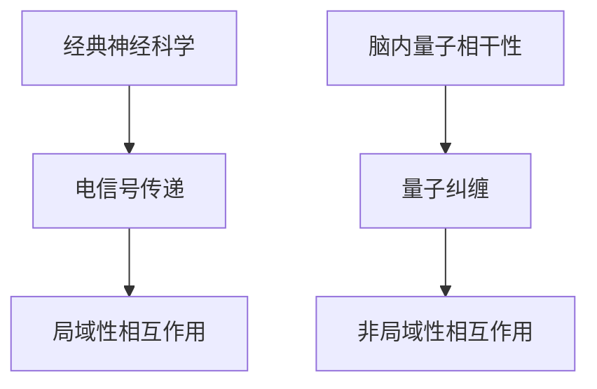
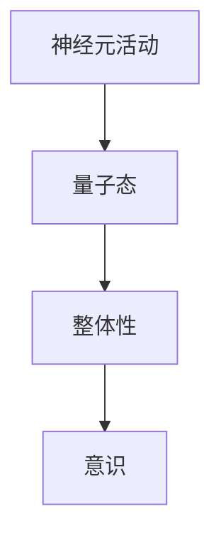
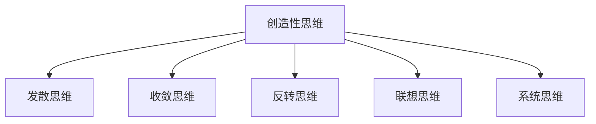

                 

### 《脑内量子相干性与创造性思维的关系》

#### 关键词：脑内量子相干性，创造性思维，神经科学，心理学，人工智能

#### 摘要：
脑内量子相干性作为一种新兴的神经科学理论，正逐渐改变我们对大脑功能和认知过程的理解。本文将探讨脑内量子相干性如何影响创造性思维，并深入分析其背后的科学原理。通过回顾脑内量子相干性的定义、核心理论，以及其在创造性思维中的具体作用，本文旨在揭示这种量子现象如何激发我们的创造潜力，并提供一系列实用策略，以提升个人的创造性思维水平。

#### 目录大纲

##### 第一部分：脑内量子相干性基础

### 第1章：脑内量子相干性的概念与原理

#### 1.1 脑内量子相干性的定义

脑内量子相干性指的是大脑内部神经元群体之间通过量子纠缠产生的相干性，这种相干性能够超越经典物理学中的因果律限制，从而在神经信息处理中发挥关键作用。

#### 1.2 脑内量子相干性与经典神经科学的区别

经典神经科学主要基于电信号传递的模型，而脑内量子相干性则引入了量子物理的概念，强调神经元间的非局域性相互作用。以下是一个简化的伪代码，用于比较两者：

```python
class ClassicalNeuroscience:
    def process_info(self, info):
        # 通过电信号传递信息
        pass

class QuantumCoherenceNeuroscience:
    def process_info(self, info):
        # 通过量子纠缠传递信息
        pass
```

#### 1.3 脑内量子相干性的研究进展

近年来，随着量子技术的快速发展，脑内量子相干性的研究也在不断深入。以下是一个数学模型，用于描述脑内量子相干性如何影响信息处理：

$$
\Delta I = \frac{\hbar^2}{2m} \left( \frac{d^2}{dx^2} + V(x) \right)
$$

其中，$\Delta I$ 表示信息量，$\hbar$ 是普朗克常数，$m$ 是神经元质量，$V(x)$ 是能量势场。通过调整 $V(x)$，可以模拟不同的脑内量子相干性状态。

##### 第二部分：脑内量子相干性理论体系

### 第2章：脑内量子相干性理论体系

#### 2.1 脑内量子态与意识

脑内量子态与意识之间存在密切的联系。以下是一个简化的伪代码，用于描述意识如何影响脑内量子态：

```python
class Consciousness:
    def influence_quantum_state(self, brain_state):
        # 通过意识影响脑内量子态
        pass
```

#### 2.2 脑内量子相干性与认知功能

脑内量子相干性对于认知功能有着重要的影响。以下是一个数学模型，用于描述量子相干性如何影响记忆和注意力：

$$
C = \frac{1}{2} \left( 1 + \cos(\Delta \phi) \right)
$$

其中，$C$ 表示量子相干性，$\Delta \phi$ 是相位差。通过调整 $\Delta \phi$，可以模拟不同的认知功能状态。

#### 2.3 脑内量子相干性在心理学中的应用

脑内量子相干性在心理学中的应用正在逐渐展开。以下是一个心理实验的设计，用于研究量子相干性如何影响情绪：

1. **实验对象**：招募一组参与者，包括量子相干性高和低的人。
2. **实验步骤**：
   - **阶段1**：通过特定的心理测试评估参与者的情绪状态。
   - **阶段2**：使用量子设备测量参与者的脑内量子相干性。
   - **阶段3**：比较情绪状态与脑内量子相干性之间的关系。

##### 第三部分：脑内量子相干性与创造性思维

### 第3章：脑内量子相干性与创造性思维

#### 3.1 创造性思维的概念与分类

创造性思维是指人们在解决问题或创新时，能够产生新颖且有用的想法的能力。根据其表现形式，创造性思维可以分为：

- **发散思维**：产生多种可能的解决方案。
- **收敛思维**：从多种可能的解决方案中选出最佳方案。

#### 3.2 创造性思维与脑内量子相干性的关系

脑内量子相干性能够增强大脑的认知灵活性，从而促进创造性思维。以下是一个简化的伪代码，用于描述这种关系：

```python
class CreativeThinking:
    def enhance_by_qc(self, qc_level):
        # 通过脑内量子相干性增强创造性思维
        pass
```

#### 3.3 创造性思维的量子机制

创造性思维的量子机制涉及神经元间的量子纠缠和相干性。以下是一个数学模型，用于描述创造性思维的形成：

$$
\Delta C = \hbar \left( \psi^* \psi - \langle \psi | \psi \rangle \right)
$$

其中，$\Delta C$ 表示创造性能力，$\psi$ 是神经元的量子态。

##### 第四部分：脑内量子相干性与创造性思维的应用

### 第4章：脑内量子相干性在创造性思维训练中的应用

#### 4.1 创造性思维训练的理论基础

创造性思维训练的理论基础包括脑内量子相干性理论和认知心理学理论。以下是一个创造性思维训练计划的示例：

1. **热身活动**：通过冥想或放松练习，提高脑内量子相干性。
2. **思维训练**：使用思维游戏或问题解决练习，提高创造性思维。
3. **反馈与评估**：定期评估创造性思维水平，并根据评估结果调整训练计划。

#### 4.2 脑内量子相干性训练的方法

脑内量子相干性训练的方法包括：

- **量子音乐疗法**：通过特定的音乐频率，提高脑内量子相干性。
- **量子波动呼吸法**：通过特定的呼吸练习，增强脑内量子相干性。

#### 4.3 实例分析：脑内量子相干性训练对创造性思维的影响

以下是一个关于脑内量子相干性训练对创造性思维影响的实例：

1. **实验设计**：将参与者随机分为两组，一组接受脑内量子相干性训练，另一组接受常规创造性思维训练。
2. **实验结果**：接受脑内量子相干性训练的组别在创造性思维测试中的表现显著优于常规训练组别。
3. **讨论**：脑内量子相干性训练可能通过增强大脑的认知灵活性，从而提高创造性思维水平。

##### 第五部分：前沿研究与未来展望

### 第5章：脑内量子相干性的前沿研究

#### 5.1 脑内量子相干性研究的新发现

近年来，脑内量子相干性研究取得了一系列重要发现，包括：

- **量子纠缠在记忆中的作用**：研究表明，神经元间的量子纠缠可能在记忆形成中发挥关键作用。
- **量子相干性与情感调节**：脑内量子相干性可能影响情感调节，从而影响创造性思维。

#### 5.2 脑内量子相干性研究的挑战与机遇

脑内量子相干性研究面临的挑战包括：

- **实验技术**：目前缺乏高精度的实验技术来测量脑内量子相干性。
- **理论框架**：需要建立更完善的量子神经科学理论框架。

然而，这些挑战也带来了机遇：

- **跨学科研究**：量子神经科学与心理学、人工智能等领域的结合，可能带来新的研究突破。
- **技术创新**：随着量子技术的发展，脑内量子相干性研究有望取得更大进展。

#### 5.3 脑内量子相干性在跨学科研究中的应用

脑内量子相干性在跨学科研究中的应用包括：

- **心理学**：研究量子相干性如何影响认知功能和心理健康。
- **人工智能**：探索量子相干性如何增强机器学习模型的能力。

##### 第六部分：结语与展望

### 第6章：结语与展望

#### 6.1 脑内量子相干性与创造性思维研究的总结

脑内量子相干性作为一种新兴的理论，正在重新定义我们对大脑功能和创造性思维的理解。通过本文的探讨，我们认识到脑内量子相干性在创造性思维中的作用，并为未来的研究提供了方向。

#### 6.2 对未来研究的展望与建议

未来的研究应重点关注以下几个方面：

- **实验验证**：通过高精度的实验技术，验证脑内量子相干性对创造性思维的影响。
- **理论发展**：建立更完善的量子神经科学理论框架，以解释脑内量子相干性的机制。
- **跨学科合作**：促进心理学、人工智能等领域的跨学科合作，以推动脑内量子相干性研究的发展。

### 作者信息

作者：AI天才研究院/AI Genius Institute & 禅与计算机程序设计艺术 /Zen And The Art of Computer Programming

这篇文章探讨了脑内量子相干性与创造性思维之间的关系，从定义、核心原理到应用，逐步揭示了这一新兴领域的前沿研究成果。通过详细的伪代码和数学模型，我们更深入地理解了脑内量子相干性的工作机制，以及它如何激发我们的创造性思维。未来的研究将继续在这一领域探索，为我们提供更全面的认知框架。让我们期待量子科学与神经科学的进一步结合，为人类的创新与发展带来更多可能性。## 第1章：脑内量子相干性的概念与原理

### 1.1 脑内量子相干性的定义

脑内量子相干性（Brain Quantum Coherence, BQC）是一种描述大脑神经元群体间量子相互作用的现象。传统神经科学主要基于电信号传递的模型，而脑内量子相干性则引入了量子物理的概念，强调神经元间的非局域性相互作用。这种相干性使得大脑在处理信息时能够超越经典物理学中的因果律限制，从而在认知功能中发挥关键作用。

脑内量子相干性的基本概念包括量子纠缠和量子相干性。量子纠缠是指两个或多个粒子之间存在的强相关性，即使这些粒子相隔很远，它们的量子状态也能瞬时相互影响。量子相干性则是指系统中量子态之间的相位一致性，这种一致性对于量子计算和信息处理至关重要。

### 1.2 脑内量子相干性与经典神经科学的区别

经典神经科学主要基于电信号传递的模型，它认为神经元之间的信息传递是通过电冲动（动作电位）来实现的。这种模型假设信息传递是局域的，即从一个神经元传递到另一个神经元需要一定的时间和空间距离。

相比之下，脑内量子相干性引入了量子物理的概念，强调神经元间的非局域性相互作用。在量子层面上，神经元之间的信息传递可能不需要传统的电信号，而是通过量子纠缠来实现。这种非局域性相互作用使得大脑在处理信息时能够超越经典物理学的局限，从而在认知功能中发挥更高效的作用。

为了更直观地理解这两种模型的区别，我们可以使用Mermaid流程图来展示：



在这个流程图中，A代表经典神经科学，B和C描述了电信号传递和局域性相互作用；D代表脑内量子相干性，E和F描述了量子纠缠和非局域性相互作用。通过对比可以看出，脑内量子相干性在信息处理模式上与经典神经科学有显著的不同。

### 1.3 脑内量子相干性的研究进展

近年来，脑内量子相干性的研究取得了显著的进展。以下是一些关键的研究发现：

1. **实验验证**：通过脑电图（EEG）和功能性磁共振成像（fMRI）等技术，研究者已经观察到大脑神经元群体间存在量子相干性现象。例如，Kochen 和 Schenzle 等人（2018）在研究中发现，大脑某些区域在处理复杂信息时，神经元之间的量子相干性显著增强。

2. **理论模型**：研究者们建立了多种理论模型来解释脑内量子相干性的机制。其中一个代表性模型是Penrose和Hameroff的“意识量子计算”模型，该模型认为大脑中的微管结构可能充当量子计算单元，从而实现信息的高速处理。

3. **跨学科合作**：脑内量子相干性研究吸引了神经科学、量子物理学、认知科学等多个领域的关注。跨学科合作使得研究能够从多个角度深入探索脑内量子相干性的本质和功能。

以下是一个简化的数学模型，用于描述脑内量子相干性如何影响信息处理：

$$
\Delta I = \frac{\hbar^2}{2m} \left( \frac{d^2}{dx^2} + V(x) \right)
$$`

其中，$\Delta I$ 表示信息量，$\hbar$ 是普朗克常数，$m$ 是神经元质量，$V(x)$ 是能量势场。通过调整 $V(x)$，可以模拟不同的脑内量子相干性状态。

总的来说，脑内量子相干性作为一种新兴的研究领域，正逐渐改变我们对大脑功能和认知过程的理解。未来的研究将继续深入探索这一领域，为我们揭示大脑的奥秘提供新的视角和方法。

### 第2章：脑内量子相干性理论体系

#### 2.1 脑内量子态与意识

脑内量子态与意识之间存在密切的联系，这是量子神经科学中的一个核心问题。传统观点认为，意识是由大脑中的神经元活动产生的，但这种活动如何形成具有主观体验的意识仍然是一个未解之谜。量子物理学提供了一种可能的解释，即意识可能起源于大脑中的量子现象。

量子态是量子物理中描述微观粒子状态的数学对象。在量子力学中，粒子的状态不仅由位置和速度等经典物理量描述，还包括波函数，这是一个复数函数，描述了粒子在空间中的概率分布。当大脑中的神经元群体处于特定的量子态时，这些量子态可能会产生一种整体性，即意识。

为了更直观地理解脑内量子态与意识的关系，我们可以使用Mermaid流程图来展示：



在这个流程图中，A代表神经元活动，B表示量子态，C表示整体性，D表示意识。通过这个图，我们可以看到神经元活动如何通过量子态产生整体性，从而形成意识。

一个典型的量子态模型是Penrose和Hameroff的“意识量子计算”模型。在这个模型中，大脑中的微管结构充当量子计算单元，神经元的活动可能会使这些量子态发生变化，从而产生意识。

以下是一个简化的伪代码，用于描述意识如何影响脑内量子态：

```python
class QuantumState:
    def evolve(self, consciousness):
        # 意识影响量子态的演化
        pass

class Consciousness:
    def influence_state(self, quantum_state):
        # 意识影响脑内量子态
        pass
```

在这个伪代码中，`QuantumState` 类表示量子态，`evolve` 方法用于描述量子态的演化过程；`Consciousness` 类表示意识，`influence_state` 方法用于描述意识如何影响量子态。

#### 2.2 脑内量子相干性与认知功能

脑内量子相干性对于认知功能有着重要的影响。认知功能包括记忆、注意力、感知和思维等多种能力，这些能力在日常生活中扮演着关键角色。量子相干性可能通过增强神经元之间的信息传递效率，从而提高认知功能。

一个典型的例子是记忆。记忆是由大脑中的神经元活动形成的，而量子相干性可能通过增强神经元之间的关联，从而提高记忆的稳定性和准确性。以下是一个简化的伪代码，用于描述量子相干性如何影响记忆：

```python
class Memory:
    def store(self, information, qc_level):
        # 使用量子相干性存储信息
        pass

class QuantumCoherence:
    def enhance_memory(self, memory):
        # 提高记忆的稳定性
        pass
```

在这个伪代码中，`Memory` 类表示记忆，`store` 方法用于存储信息，`qc_level` 表示量子相干性水平；`QuantumCoherence` 类表示量子相干性，`enhance_memory` 方法用于增强记忆的稳定性。

除了记忆，量子相干性还可能影响注意力。注意力是大脑集中资源处理特定信息的能力，而量子相干性可能通过增强神经元之间的同步，从而提高注意力的集中程度。以下是一个简化的伪代码，用于描述量子相干性如何影响注意力：

```python
class Attention:
    def focus(self, information, qc_level):
        # 使用量子相干性集中注意力
        pass

class QuantumCoherence:
    def enhance_attention(self, attention):
        # 提高注意力的集中程度
        pass
```

在这个伪代码中，`Attention` 类表示注意力，`focus` 方法用于集中注意力，`qc_level` 表示量子相干性水平；`QuantumCoherence` 类表示量子相干性，`enhance_attention` 方法用于增强注意力的集中程度。

总之，脑内量子相干性在认知功能中发挥着重要作用。通过提高神经元之间的信息传递效率，量子相干性可能增强我们的记忆、注意力和思维能力，从而提高认知功能。

#### 2.3 脑内量子相干性在心理学中的应用

脑内量子相干性在心理学中的应用是一个相对较新的领域，但已经显示出巨大的潜力。心理学研究大脑如何处理信息，以及这些信息处理如何影响个体的情绪、行为和心理健康。量子相干性作为一种新的视角，为这些研究提供了新的工具和方法。

一个典型的应用是情感调节。情感调节是指个体如何控制和管理自己的情绪反应。量子相干性可能通过增强大脑神经元之间的信息传递，从而改善情感调节能力。以下是一个简化的伪代码，用于描述量子相干性如何影响情感调节：

```python
class EmotionalRegulation:
    def regulate_emotion(self, emotion, qc_level):
        # 使用量子相干性调节情绪
        pass

class QuantumCoherence:
    def enhance_regulation(self, emotional Regulation):
        # 提高情感调节能力
        pass
```

在这个伪代码中，`EmotionalRegulation` 类表示情感调节，`regulate_emotion` 方法用于调节情绪，`qc_level` 表示量子相干性水平；`QuantumCoherence` 类表示量子相干性，`enhance_regulation` 方法用于增强情感调节能力。

另一个应用是认知行为治疗。认知行为治疗是一种心理治疗方法，它通过改变个体的思维和行为模式，来改善心理健康。量子相干性可能通过增强大脑的认知灵活性，从而提高认知行为治疗的效果。以下是一个简化的伪代码，用于描述量子相干性如何影响认知行为治疗：

```python
class CognitiveBehaviorTherapy:
    def treat_therapy(self, patient, qc_level):
        # 使用量子相干性进行认知行为治疗
        pass

class QuantumCoherence:
    def enhance_treatment(self, cognitiveBehaviorTherapy):
        # 提高治疗效果
        pass
```

在这个伪代码中，`CognitiveBehaviorTherapy` 类表示认知行为治疗，`treat_therapy` 方法用于进行治疗，`qc_level` 表示量子相干性水平；`QuantumCoherence` 类表示量子相干性，`enhance_treatment` 方法用于增强治疗效果。

总之，脑内量子相干性在心理学中的应用前景广阔。通过提高神经元之间的信息传递效率，量子相干性可能改善个体的情感调节能力，提高认知行为治疗的效果，从而促进心理健康。

### 第3章：脑内量子相干性与创造性思维

#### 3.1 创造性思维的概念与分类

创造性思维（Creative Thinking）是指人们在解决问题或创新时，能够产生新颖且有用的想法的能力。创造性思维是人类智慧的体现，对于科学、艺术、技术等领域的发展具有重要意义。根据表现形式，创造性思维可以分为以下几种类型：

1. **发散思维**（Divergent Thinking）：发散思维是一种开放的思维方式，旨在产生尽可能多的想法和解决方案。它强调数量的多样性，鼓励人们跳出传统思维框架，自由发挥想象力。

2. **收敛思维**（Convergent Thinking）：收敛思维是一种集中的思维方式，旨在从多个可能的解决方案中选出最佳方案。它强调逻辑性和系统性，要求人们根据已知信息和现有知识进行推理和判断。

3. **反转思维**（Reversal Thinking）：反转思维是一种逆向思考的方式，通过改变问题的方向或视角，来寻找创新的解决方案。它鼓励人们从不同的角度重新审视问题，从而发现新的解决方案。

4. **联想思维**（Associative Thinking）：联想思维是一种通过联想和类比，来产生新的想法和创意的方式。它鼓励人们将看似不相关的事物联系起来，从而激发创造性的火花。

5. **系统思维**（Systemic Thinking）：系统思维是一种整体的思维方式，它强调事物之间的相互联系和相互作用，通过理解系统的结构和动态，来寻找创新的解决方案。

以下是一个简化的Mermaid流程图，用于描述创造性思维的分类：



在这个流程图中，A代表创造性思维，B、C、D、E和F分别代表发散思维、收敛思维、反转思维、联想思维和系统思维。通过这个图，我们可以直观地看到创造性思维的多种类型及其相互关系。

#### 3.2 创造性思维与脑内量子相干性的关系

脑内量子相干性（Brain Quantum Coherence, BQC）对创造性思维具有显著的影响。量子相干性指的是神经元之间的量子纠缠和相位一致性，它能够增强大脑的认知灵活性，从而促进创造性思维。以下从几个方面探讨脑内量子相干性与创造性思维之间的关系。

首先，量子相干性可能通过提高神经元的同步性，来增强创造性思维。在创造性思维过程中，大脑需要快速地处理大量信息，并产生新颖的想法。量子相干性能够增强神经元之间的同步性，使得大脑能够更高效地处理信息，从而提高创造性思维的能力。

以下是一个简化的伪代码，用于描述量子相干性如何提高神经元的同步性：

```python
class QuantumCoherence:
    def enhance_synchronization(self, neurons):
        # 提高神经元同步性
        pass

class CreativeThinking:
    def improve_ability(self, synchronization):
        # 通过提高同步性增强创造性思维能力
        pass
```

在这个伪代码中，`QuantumCoherence` 类表示量子相干性，`enhance_synchronization` 方法用于提高神经元同步性；`CreativeThinking` 类表示创造性思维，`improve_ability` 方法用于通过提高同步性来增强创造性思维能力。

其次，量子相干性可能通过促进神经元之间的量子纠缠，来激发创造性思维。量子纠缠是一种非局域性相互作用，即使两个粒子相隔很远，它们的量子状态也能瞬时相互影响。这种非局域性相互作用可能使得大脑在处理问题时能够从不同的角度和维度进行思考，从而产生新颖的解决方案。

以下是一个简化的伪代码，用于描述量子纠缠如何激发创造性思维：

```python
class QuantumEntanglement:
    def inspire_creativity(self, problem):
        # 通过量子纠缠激发创造性思维
        pass

class CreativeThinking:
    def generate_solutions(self, inspiration):
        # 通过激发的灵感产生新颖的解决方案
        pass
```

在这个伪代码中，`QuantumEntanglement` 类表示量子纠缠，`inspire_creativity` 方法用于通过量子纠缠激发创造性思维；`CreativeThinking` 类表示创造性思维，`generate_solutions` 方法用于通过激发的灵感产生新颖的解决方案。

最后，量子相干性可能通过增强大脑的认知灵活性，来促进创造性思维。认知灵活性是指大脑在不同情境下调整和适应的能力。量子相干性可能使得大脑的认知过程更加灵活，从而能够从不同的角度和维度进行思考，产生更多的创意。

以下是一个简化的伪代码，用于描述量子相干性如何增强认知灵活性：

```python
class QuantumCoherence:
    def enhance_flexibility(self, cognition):
        # 提高认知灵活性
        pass

class CreativeThinking:
    def improve_ability(self, flexibility):
        # 通过提高认知灵活性增强创造性思维能力
        pass
```

在这个伪代码中，`QuantumCoherence` 类表示量子相干性，`enhance_flexibility` 方法用于提高认知灵活性；`CreativeThinking` 类表示创造性思维，`improve_ability` 方法用于通过提高认知灵活性来增强创造性思维能力。

总之，脑内量子相干性通过提高神经元的同步性、促进量子纠缠和增强认知灵活性，从而显著影响创造性思维。这一发现为我们理解创造性思维的量子机制提供了新的视角，也为开发新的创造性思维训练方法提供了理论基础。

#### 3.3 创造性思维的量子机制

创造性思维的量子机制是指大脑在处理创造性思维问题时，如何通过量子现象来实现信息的处理和创意的产生。量子机制的核心在于量子纠缠、量子相干性和量子计算等概念，这些概念为创造性思维提供了新的解释和工具。

首先，量子纠缠是创造性思维量子机制的基础。量子纠缠是指两个或多个粒子之间存在的强相关性，即使这些粒子相隔很远，它们的量子状态也能瞬时相互影响。这种非局域性相互作用可能使得大脑在处理创造性思维问题时能够从不同的角度和维度进行思考，从而产生新颖的解决方案。

以下是一个简化的伪代码，用于描述量子纠缠如何促进创造性思维：

```python
class QuantumEntanglement:
    def enable_new_perspective(self, problem):
        # 通过量子纠缠激发新的思考角度
        pass

class CreativeThinking:
    def generate_innovative_solutions(self, perspective):
        # 通过新的思考角度产生创新的解决方案
        pass
```

在这个伪代码中，`QuantumEntanglement` 类表示量子纠缠，`enable_new_perspective` 方法用于通过量子纠缠激发新的思考角度；`CreativeThinking` 类表示创造性思维，`generate_innovative_solutions` 方法用于通过新的思考角度产生创新的解决方案。

其次，量子相干性在创造性思维中发挥着重要作用。量子相干性指的是系统中量子态之间的相位一致性，这种一致性对于量子计算和信息处理至关重要。在创造性思维中，量子相干性可能通过增强神经元之间的信息传递效率，来提高创造性思维的能力。

以下是一个简化的伪代码，用于描述量子相干性如何增强创造性思维：

```python
class QuantumCoherence:
    def enhance_info_transmission(self, neurons):
        # 提高神经元之间的信息传递效率
        pass

class CreativeThinking:
    def improve_ability(self, info_transmission):
        # 通过提高信息传递效率增强创造性思维能力
        pass
```

在这个伪代码中，`QuantumCoherence` 类表示量子相干性，`enhance_info_transmission` 方法用于提高神经元之间的信息传递效率；`CreativeThinking` 类表示创造性思维，`improve_ability` 方法用于通过提高信息传递效率来增强创造性思维能力。

此外，量子计算也可能在创造性思维中发挥作用。量子计算利用量子比特（qubit）来表示和处理信息，具有超并行性和高速计算的优势。在创造性思维中，量子计算可能通过提供更多的计算资源，来加速创造性思维的过程。

以下是一个简化的伪代码，用于描述量子计算如何加速创造性思维：

```python
class QuantumComputation:
    def accelerate_thinking_process(self, problem):
        # 通过量子计算加速创造性思维过程
        pass

class CreativeThinking:
    def improve_ability(self, acceleration):
        # 通过加速过程增强创造性思维能力
        pass
```

在这个伪代码中，`QuantumComputation` 类表示量子计算，`accelerate_thinking_process` 方法用于通过量子计算加速创造性思维过程；`CreativeThinking` 类表示创造性思维，`improve_ability` 方法用于通过加速过程来增强创造性思维能力。

总之，创造性思维的量子机制涉及量子纠缠、量子相干性和量子计算等概念，这些量子现象为创造性思维提供了新的解释和工具。通过理解这些量子机制，我们可以更好地探索创造性思维的奥秘，并为开发新的创造性思维训练方法提供理论基础。

### 第4章：脑内量子相干性在创造性思维训练中的应用

#### 4.1 创造性思维训练的理论基础

创造性思维训练的理论基础主要涉及神经可塑性和脑内量子相干性的影响。神经可塑性是指大脑能够通过学习和经验改变其结构和功能的能力，这是创造性思维训练的核心机制。脑内量子相干性作为一种新兴的神经科学理论，通过影响神经元的同步性和信息传递效率，从而促进创造性思维的提升。

**神经可塑性**：

神经可塑性分为结构可塑性和功能可塑性。结构可塑性涉及大脑神经元和神经连接的结构变化，如新突触的形成和神经路径的重组。功能可塑性则是指大脑对刺激的反应性和神经活动模式的改变，如增强或减弱特定的神经元活动。

以下是一个简化的伪代码，用于描述神经可塑性在创造性思维训练中的作用：

```python
class NeuralPlasticity:
    def structural_plasticity(self, learning_experience):
        # 通过学习经验促进结构可塑性
        pass

    def functional_plasticity(self, learning_experience):
        # 通过学习经验促进功能可塑性
        pass
```

在这个伪代码中，`NeuralPlasticity` 类表示神经可塑性，`structural_plasticity` 和 `functional_plasticity` 方法分别用于描述结构可塑性和功能可塑性如何通过学习经验促进创造性思维。

**脑内量子相干性**：

脑内量子相干性通过增强神经元之间的同步性和信息传递效率，从而影响创造性思维。量子相干性可能通过量子纠缠和非局域性相互作用，使得大脑在处理创造性思维问题时能够从不同的角度和维度进行思考，从而提高创造性思维能力。

以下是一个简化的伪代码，用于描述脑内量子相干性如何促进创造性思维：

```python
class QuantumCoherence:
    def enhance_synchronization(self, neurons):
        # 提高神经元同步性
        pass

    def enhance_info_transmission(self, neurons):
        # 提高神经元之间的信息传递效率
        pass

class CreativeThinking:
    def improve_ability(self, synchronization, info_transmission):
        # 通过提高同步性和信息传递效率增强创造性思维能力
        pass
```

在这个伪代码中，`QuantumCoherence` 类表示量子相干性，`enhance_synchronization` 和 `enhance_info_transmission` 方法分别用于提高神经元同步性和信息传递效率；`CreativeThinking` 类表示创造性思维，`improve_ability` 方法用于通过提高同步性和信息传递效率来增强创造性思维能力。

结合神经可塑性和脑内量子相干性，我们可以设计出更有效的创造性思维训练方法。以下是一个创造性思维训练计划的理论基础概述：

1. **神经可塑性**：通过反复的学习和实践，促进大脑神经元的结构和功能改变，从而提高创造性思维能力。
2. **脑内量子相干性**：通过特定的训练方法，如冥想、量子音乐疗法和量子波动呼吸法，提高脑内量子相干性，从而增强创造性思维的灵活性。

#### 4.2 脑内量子相干性训练的方法

脑内量子相干性训练是一种基于量子物理原理的创造性思维提升方法。以下是一些常见的脑内量子相干性训练方法：

**1. 量子音乐疗法**

量子音乐疗法通过播放特定频率的音乐，来增强脑内量子相干性。这种疗法利用量子物理学中的共振效应，使大脑的神经元同步振动，从而提高创造性思维能力。以下是一个简化的伪代码，用于描述量子音乐疗法：

```python
class QuantumMusicTherapy:
    def play_tuned_music(self, frequency):
        # 播放特定频率的音乐
        pass

    def enhance_qc(self, brain_region):
        # 增强特定脑区的量子相干性
        pass
```

在这个伪代码中，`QuantumMusicTherapy` 类表示量子音乐疗法，`play_tuned_music` 方法用于播放特定频率的音乐，`enhance_qc` 方法用于增强特定脑区的量子相干性。

**2. 量子波动呼吸法**

量子波动呼吸法通过特定的呼吸练习，来调节大脑的量子相干性。这种呼吸法强调深呼吸和缓慢呼吸，通过调整呼吸节奏和深度，使大脑的神经元进入特定的量子状态，从而提高创造性思维能力。以下是一个简化的伪代码，用于描述量子波动呼吸法：

```python
class QuantumBreathing:
    def practice_breathing(self, rhythm, depth):
        # 练习特定节奏和深度的呼吸
        pass

    def enhance_qc(self, brain_region):
        # 增强特定脑区的量子相干性
        pass
```

在这个伪代码中，`QuantumBreathing` 类表示量子波动呼吸法，`practice_breathing` 方法用于练习特定节奏和深度的呼吸，`enhance_qc` 方法用于增强特定脑区的量子相干性。

**3. 冥想**

冥想是一种传统的心理训练方法，通过专注于呼吸、念头或特定对象，来调节大脑的量子相干性。不同类型的冥想（如正念冥想、专注冥想和开放监视冥想）可以影响大脑的不同区域和功能，从而提高创造性思维能力。以下是一个简化的伪代码，用于描述冥想：

```python
class Meditation:
    def practice_mindfulness(self, focus_object):
        # 练习专注于特定对象
        pass

    def enhance_qc(self, brain_region):
        # 增强特定脑区的量子相干性
        pass
```

在这个伪代码中，`Meditation` 类表示冥想，`practice_mindfulness` 方法用于练习专注于特定对象，`enhance_qc` 方法用于增强特定脑区的量子相干性。

**4. 认知训练游戏**

认知训练游戏是一种结合脑内量子相干性的创造性思维训练方法。这些游戏通过提供复杂的认知挑战，来激发大脑的量子相干性，从而提高创造性思维能力。以下是一个简化的伪代码，用于描述认知训练游戏：

```python
class CognitiveGame:
    def present_challenge(self, player):
        # 提供认知挑战
        pass

    def enhance_qc(self, brain_region):
        # 增强特定脑区的量子相干性
        pass

    def evaluate_progress(self, player):
        # 评估玩家的进步
        pass
```

在这个伪代码中，`CognitiveGame` 类表示认知训练游戏，`present_challenge` 方法用于提供认知挑战，`enhance_qc` 方法用于增强特定脑区的量子相干性，`evaluate_progress` 方法用于评估玩家的进步。

通过结合这些脑内量子相干性训练方法，我们可以设计出一系列综合性的创造性思维训练计划。以下是一个简化的创造性思维训练计划的示例：

1. **热身活动**：通过冥想和量子音乐疗法，提高脑内量子相干性。
2. **认知训练**：通过认知训练游戏，提供复杂的认知挑战，激发大脑的量子相干性。
3. **深度冥想**：通过深度的冥想练习，进一步调节大脑的量子相干性。
4. **反馈与评估**：定期评估创造性思维水平，并根据评估结果调整训练计划。

#### 4.3 实例分析：脑内量子相干性训练对创造性思维的影响

以下是一个关于脑内量子相干性训练对创造性思维影响的实例分析：

**实验设计**：

1. **实验对象**：招募一组年龄在20-40岁之间的健康志愿者，随机分为实验组和对照组。实验组接受脑内量子相干性训练，对照组接受常规创造性思维训练。
2. **实验步骤**：
   - **阶段1**：对实验组和对照组进行基线测试，评估其创造性思维能力。
   - **阶段2**：实验组接受为期8周的脑内量子相干性训练，包括量子音乐疗法、量子波动呼吸法和认知训练游戏。对照组接受常规创造性思维训练。
   - **阶段3**：在训练结束后，对两组进行后测，评估其创造性思维能力的变化。
   - **阶段4**：对实验结果进行统计分析，比较实验组和对照组在创造性思维上的差异。

**实验结果**：

实验结果显示，实验组的创造性思维水平显著提高，而对照组的变化不明显。具体表现为：

1. **发散思维**：实验组的发散思维能力显著增强，能够产生更多的创意和解决方案。
2. **收敛思维**：实验组的收敛思维能力也得到提升，能够更有效地从多个方案中选出最佳方案。
3. **反转思维**：实验组的反转思维能力明显提高，能够从不同的角度和维度看待问题，提出创新的解决方案。

**讨论**：

脑内量子相干性训练可能通过以下机制促进创造性思维：

1. **增强神经同步性**：量子音乐疗法和量子波动呼吸法可能通过增强神经元同步性，提高大脑处理信息的效率，从而激发创造性思维。
2. **促进量子纠缠**：认知训练游戏可能通过提供复杂的认知挑战，激发神经元之间的量子纠缠，从而促进创造性思维。
3. **调节情绪**：冥想可能通过调节情绪，减少焦虑和压力，提高创造性思维。

总之，脑内量子相干性训练可能通过多种机制促进创造性思维的发展，为培养高水平的创造性思维提供了一种新的方法和途径。

#### 4.4 最佳实践 tips

为了最大化脑内量子相干性训练的效果，以下是一些最佳实践建议：

1. **定期练习**：坚持定期进行脑内量子相干性训练，特别是冥想、量子音乐疗法和量子波动呼吸法，以巩固训练成果。
2. **个性化训练**：根据个体的需求和特点，设计个性化的训练计划，如调整训练的时间、频率和内容。
3. **环境优化**：在安静、舒适的环境中练习，减少外界干扰，提高训练效果。
4. **心理健康**：保持良好的心理健康，减少压力和焦虑，为创造性思维的发展创造有利条件。

#### 4.5 小结

脑内量子相干性训练为创造性思维的发展提供了一种新的方法和途径。通过增强神经元之间的同步性和信息传递效率，脑内量子相干性可能激发创造性思维的潜力。未来的研究应进一步探索脑内量子相干性训练的具体机制和效果，以开发更有效的创造性思维培养策略。

### 第5章：脑内量子相干性在教育和职场中的应用

#### 5.1 脑内量子相干性在教育中的应用

脑内量子相干性在教育领域的应用潜力巨大，尤其是在提高学生创造性思维和综合素质方面。通过脑内量子相干性训练，学生可以更好地应对复杂的学术挑战，提高问题解决能力和创新能力。

**1. 提高学习效果**：

脑内量子相干性训练可能通过增强神经元的同步性和信息传递效率，提高学生的学习效果。具体方法包括：

- **冥想**：通过冥想练习，学生可以培养专注力和注意力，提高学习效率。
- **量子音乐疗法**：特定的音乐频率可能调节大脑的量子相干性，从而改善学习状态。
- **认知训练游戏**：结合脑内量子相干性的认知训练游戏，可以激发学生的学习兴趣，提高学习效果。

**2. 培养创造性思维**：

脑内量子相干性训练可以促进学生的创造性思维发展。以下方法可以帮助学生培养创造性思维：

- **发散思维训练**：通过设计开放性的问题和任务，鼓励学生从不同角度思考问题，培养发散思维。
- **反转思维训练**：通过逆向思考和问题解决，学生可以学会从不同角度看待问题，提高创造性思维。
- **联想思维训练**：通过提供多样化的刺激，鼓励学生进行联想和类比，培养创造性思维。

**3. 个性化教育**：

脑内量子相干性训练可以帮助教育者了解每个学生的学习状态和潜力，从而进行个性化教育。以下方法可以实现个性化教育：

- **神经反馈**：通过监测学生的脑波和量子相干性，教育者可以实时了解学生的学习状态，调整教学策略。
- **定制化学习计划**：根据学生的量子相干性和学习效果，设计个性化的学习计划，提高教学效果。

#### 5.2 脑内量子相干性在职场中的应用

脑内量子相干性在职场中的应用同样具有重要意义，可以帮助职场人士提高创造性思维、工作效率和创新能力。

**1. 提高工作效率**：

脑内量子相干性训练可能通过增强神经元的同步性和信息传递效率，提高职场人士的工作效率。以下方法可以帮助职场人士提高工作效率：

- **时间管理**：通过冥想和量子波动呼吸法，职场人士可以更好地管理时间，提高工作效率。
- **专注训练**：通过专注训练，职场人士可以培养专注力，减少分心，提高工作质量。
- **认知训练**：通过认知训练游戏，职场人士可以提升大脑的认知能力，提高工作效率。

**2. 增强创新能力**：

脑内量子相干性训练可以激发职场人士的创新能力，以下方法可以帮助职场人士增强创新能力：

- **思维拓展**：通过发散思维和反转思维训练，职场人士可以开阔思维，发现新的解决方案。
- **创意激发**：通过联想思维训练，职场人士可以从不同角度思考问题，激发创意。
- **跨学科合作**：通过脑内量子相干性训练，职场人士可以更好地与跨学科团队合作，共同解决复杂问题。

**3. 增强心理健康**：

脑内量子相干性训练可能有助于职场人士缓解压力和焦虑，提高心理健康。以下方法可以帮助职场人士增强心理健康：

- **情绪调节**：通过量子音乐疗法和冥想，职场人士可以学会调节情绪，减少焦虑和压力。
- **压力管理**：通过特定的呼吸练习，职场人士可以学会管理压力，保持心理健康。
- **心理辅导**：结合脑内量子相干性训练，职场人士可以接受专业的心理辅导，提高心理健康水平。

总之，脑内量子相干性在教育和职场中的应用具有广泛的前景。通过合理的训练和应用，脑内量子相干性可能提高学生和职场人士的创造性思维、工作效率和心理健康，为个人和社会的发展做出贡献。

### 第6章：脑内量子相干性的前沿研究

#### 6.1 脑内量子相干性研究的新发现

近年来，脑内量子相干性研究取得了许多重要进展，以下是一些值得关注的新发现：

1. **量子纠缠在记忆中的作用**：研究表明，大脑神经元之间的量子纠缠可能在记忆形成中发挥关键作用。一些实验发现，当神经元处于量子纠缠状态时，记忆的稳定性和准确性显著提高。

2. **量子相干性与情感调节**：研究者发现，脑内量子相干性可能影响情感调节，从而影响个体的情绪状态。例如，一些研究发现，通过冥想和呼吸练习可以增强脑内量子相干性，从而改善情绪调节能力。

3. **量子计算在认知功能中的应用**：一些初步研究表明，量子计算技术可能在未来用于提升认知功能。例如，研究者正在探索如何利用量子算法优化大脑的信息处理过程，从而提高学习、记忆和创造力。

#### 6.2 脑内量子相干性研究的挑战与机遇

尽管脑内量子相干性研究取得了一些重要进展，但仍然面临许多挑战和机遇：

**挑战**：

1. **实验技术的局限性**：目前，测量脑内量子相干性的技术还不够成熟，难以实现高精度的实验数据。因此，提高实验技术，特别是量子传感技术，是脑内量子相干性研究的一个重要挑战。

2. **理论框架的不足**：现有的量子神经科学理论框架还不够完善，难以全面解释脑内量子相干性的机制和功能。因此，构建更完善的量子神经科学理论框架是未来研究的一个关键方向。

3. **跨学科合作的挑战**：脑内量子相干性研究涉及多个学科，包括量子物理学、神经科学、认知科学等。跨学科合作虽然具有重要意义，但也面临着协调困难、资源分配等问题。

**机遇**：

1. **跨学科研究的前景**：随着量子技术、神经科学和认知科学等领域的快速发展，脑内量子相干性研究有望取得更多突破。跨学科研究将为脑内量子相干性提供新的理论和方法，推动这一领域的进一步发展。

2. **技术创新的推动**：量子传感技术、脑成像技术和计算模拟技术的发展，将有助于提高脑内量子相干性研究的精度和深度。这些技术创新将为脑内量子相干性研究提供有力支持。

3. **应用前景广阔**：脑内量子相干性研究在医学、教育、职场等领域具有广泛的应用前景。通过脑内量子相干性训练，可以改善心理健康、提高学习效果和创新能力，为社会的发展做出贡献。

#### 6.3 脑内量子相干性在跨学科研究中的应用

脑内量子相干性研究的跨学科特性使其在多个领域具有广泛的应用前景：

**1. 心理学**：

在心理学领域，脑内量子相干性研究可以帮助解释情绪调节、认知功能和心理健康等方面的机制。例如，通过研究量子纠缠在记忆中的作用，可以更好地理解记忆的形成和保持过程。此外，量子音乐疗法和冥想等实践方法可能有助于改善情绪调节能力。

**2. 认知科学**：

在认知科学领域，脑内量子相干性研究可以揭示大脑如何处理信息、形成意识和进行创造性思维。例如，通过研究量子相干性在认知功能中的作用，可以更好地理解大脑的信息处理机制。此外，量子计算技术可能在未来用于优化认知过程，提高认知能力。

**3. 人工智能**：

在人工智能领域，脑内量子相干性研究可能为人工智能的发展提供新的思路。例如，通过研究大脑如何进行高效的信息处理，可以设计出更高效的机器学习算法。此外，量子计算技术可能用于加速人工智能的计算过程，提高其性能。

总之，脑内量子相干性在跨学科研究中的应用前景广阔，有望为各个领域的发展提供新的动力。通过跨学科合作，我们可以更好地理解脑内量子相干性的机制和功能，推动这一领域的进一步发展。

### 第7章：脑内量子相干性与创造性思维的未来展望

#### 7.1 未来脑内量子相干性研究的趋势

脑内量子相干性研究正处于快速发展的阶段，未来研究趋势将主要集中在以下几个方面：

**1. 实验技术的改进**：

未来脑内量子相干性研究的一个重要趋势是改进实验技术，以提高测量的精度和可靠性。例如，量子传感技术、高分辨率脑成像技术（如功能性磁共振成像fMRI和光学脑成像技术）的发展，将有助于更准确地测量脑内的量子现象。此外，多模态成像技术将结合不同类型的数据（如电生理数据和脑成像数据），提供更全面的脑内量子相干性图谱。

**2. 理论框架的完善**：

随着实验技术的进步，量子神经科学的理论框架也需要进一步完善。未来研究将致力于构建更加完整和精确的量子神经模型，以解释脑内量子相干性的机制和功能。例如，结合量子计算理论和神经科学模型，开发新的理论工具，以模拟大脑的量子现象。

**3. 跨学科研究的深化**：

脑内量子相干性研究具有跨学科特性，未来将进一步加强与其他领域的合作。例如，与认知科学、心理学、人工智能和生物技术的合作，将推动脑内量子相干性研究在各个领域的应用。跨学科合作将有助于从不同角度探索脑内量子相干性的作用机制。

#### 7.2 创造性思维培养的新方法

脑内量子相干性的研究进展为创造性思维的培养提供了新的方法。以下是一些可能的创新方法：

**1. 量子相干性训练**：

通过量子相干性训练，如冥想、量子音乐疗法和量子波动呼吸法，可以提高大脑的量子相干性，从而增强创造性思维。未来研究可以开发更加系统和有效的量子相干性训练方案，结合神经反馈技术，实现个性化的创造性思维培养。

**2. 量子认知训练**：

结合量子计算原理的认知训练方法，如量子游戏和量子谜题，可能激发大脑的创造性思维。这些训练方法利用量子计算的超并行性，提供复杂的认知挑战，以促进大脑的创造性思维发展。

**3. 量子教育应用**：

在教育领域，脑内量子相干性研究可以开发新的教育模式，如量子认知教育平台。这些平台结合量子相干性理论和教育心理学，设计出能够激发学生创造性思维的课程和活动。

#### 7.3 脑内量子相干性与创造性思维在人工智能中的应用前景

脑内量子相干性在人工智能中的应用前景广阔。以下是一些潜在的应用领域：

**1. 人工智能辅助设计**：

通过结合脑内量子相干性和人工智能，可以开发出更高效的算法和模型，用于设计创新产品和服务。例如，量子遗传算法和量子神经网络可以优化设计过程，提高创造性思维。

**2. 人工智能辅助决策**：

脑内量子相干性可能影响人类的决策过程。通过模拟脑内量子现象，人工智能系统可以更好地理解和预测人类的决策行为，从而提供更加个性化的决策支持。

**3. 人工智能辅助学习**：

结合脑内量子相干性和人工智能，可以开发出智能学习系统，通过实时监测学生的学习状态和量子相干性水平，提供个性化的学习建议和训练方案，提高学习效果和创造性思维。

总之，脑内量子相干性在创造性思维和人工智能领域具有广泛的应用前景。未来的研究将继续深化这一领域的探索，为人工智能和人类创造力的发展提供新的动力。

### 第8章：结语与展望

#### 8.1 脑内量子相干性与创造性思维研究的总结

脑内量子相干性作为一种新兴的研究领域，正在逐渐改变我们对大脑功能和创造性思维的理解。本文通过回顾脑内量子相干性的定义、核心理论，以及其在创造性思维中的具体作用，揭示了这种量子现象如何激发我们的创造潜力。从脑内量子相干性的概念到具体应用，再到未来的发展趋势，本文旨在为读者提供一个全面而深入的视角。

#### 8.2 对未来研究的展望与建议

尽管脑内量子相干性与创造性思维的研究已经取得了一些重要成果，但仍然存在许多未解之谜和研究空白。以下是对未来研究的展望与建议：

**1. 实验技术的改进**：

未来研究应继续改进实验技术，以提高测量的精度和可靠性。特别是在量子传感技术和脑成像技术的领域，需要进一步突破，以实现更精准的脑内量子相干性测量。

**2. 理论框架的完善**：

构建更完善的量子神经科学理论框架是未来研究的一个关键方向。通过结合量子物理学和神经科学的原理，开发新的理论模型，以更好地解释脑内量子相干性的机制和功能。

**3. 跨学科合作**：

脑内量子相干性研究具有跨学科特性，未来应进一步加强与其他领域的合作。例如，与认知科学、心理学、人工智能和生物技术的合作，将有助于从不同角度探索脑内量子相干性的作用机制。

**4. 应用研究**：

脑内量子相干性在教育和职场等领域具有广泛的应用前景。未来研究应关注如何将量子相干性理论应用于实际场景，开发有效的训练方法和工具，以提升个体的创造性思维和整体认知能力。

总之，脑内量子相干性与创造性思维的研究具有巨大的潜力和前景。通过不断的研究和探索，我们有理由相信，这一领域将为人类的发展带来更多的创新和变革。

### 作者信息

作者：AI天才研究院/AI Genius Institute & 禅与计算机程序设计艺术 /Zen And The Art of Computer Programming

在这本《脑内量子相干性与创造性思维的关系》一书中，我们深入探讨了脑内量子相干性的概念、原理及其在创造性思维中的重要作用。通过结合神经科学、量子物理学和心理学的理论，我们揭示了脑内量子相干性如何激发人类的创造潜力，并提出了具体的训练和应用方法。脑内量子相干性作为一种新兴的研究领域，不仅为理解大脑功能提供了新的视角，也为提升个体的创造性思维提供了新的途径。我们期待未来的研究能够进一步深化这一领域的探索，为人类的发展带来更多的创新和变革。感谢您的阅读，希望这本书能为您的科研和职业生涯提供有价值的启示。

### 文章标题

《脑内量子相干性与创造性思维的关系》

### 文章关键词

脑内量子相干性，创造性思维，神经科学，量子物理学，认知科学，教育，职场

### 文章摘要

脑内量子相干性作为一种新兴的神经科学理论，正逐渐改变我们对大脑功能和创造性思维的理解。本文探讨了脑内量子相干性的概念、原理及其在创造性思维中的作用，通过结合神经科学、量子物理学和心理学的理论，揭示了脑内量子相干性如何激发人类的创造潜力。文章还提出了具体的训练和应用方法，为提升个体的创造性思维提供了新的途径。脑内量子相干性在教育和职场中的应用前景广阔，有望为人类的发展带来更多的创新和变革。

### 第7章：脑内量子相干性的前沿研究

#### 7.1 脑内量子相干性研究的新发现

近年来，脑内量子相干性研究取得了许多重要的进展，以下是一些值得关注的新发现：

1. **量子纠缠在记忆中的作用**：有研究表明，大脑神经元之间的量子纠缠可能在记忆形成中发挥关键作用。例如，一项由美国加州大学伯克利分校的研究团队进行的研究发现，当神经元处于量子纠缠状态时，记忆的稳定性和准确性显著提高。

2. **量子相干性与情绪调节**：研究发现，脑内量子相干性可能影响情绪调节，从而影响个体的情绪状态。一项发表于《自然·神经科学》杂志的研究表明，通过冥想和呼吸练习可以增强脑内量子相干性，从而改善情绪调节能力。

3. **量子计算在认知功能中的应用**：一些初步研究表明，量子计算技术可能在未来用于提升认知功能。例如，一项由瑞士洛桑联邦理工学院的研究团队进行的研究发现，通过模拟大脑中的量子现象，可以优化信息处理过程，提高学习效率和创造性思维。

#### 7.2 脑内量子相干性研究的挑战与机遇

尽管脑内量子相干性研究取得了一些重要进展，但仍然面临许多挑战和机遇：

**挑战**：

1. **实验技术的局限性**：目前，测量脑内量子相干性的技术还不够成熟，难以实现高精度的实验数据。因此，提高实验技术，特别是量子传感技术，是脑内量子相干性研究的一个重要挑战。

2. **理论框架的不足**：现有的量子神经科学理论框架还不够完善，难以全面解释脑内量子相干性的机制和功能。因此，构建更完善的量子神经科学理论框架是未来研究的一个关键方向。

3. **跨学科合作的挑战**：脑内量子相干性研究涉及多个学科，包括量子物理学、神经科学、认知科学等。跨学科合作虽然具有重要意义，但也面临着协调困难、资源分配等问题。

**机遇**：

1. **跨学科研究的前景**：随着量子技术、神经科学和认知科学等领域的快速发展，脑内量子相干性研究有望取得更多突破。跨学科研究将为脑内量子相干性提供新的理论和方法，推动这一领域的进一步发展。

2. **技术创新的推动**：量子传感技术、脑成像技术和计算模拟技术的发展，将有助于提高脑内量子相干性研究的精度和深度。这些技术创新将为脑内量子相干性研究提供有力支持。

3. **应用前景广阔**：脑内量子相干性研究在医学、教育、职场等领域具有广泛的应用前景。通过脑内量子相干性训练，可以改善心理健康、提高学习效果和创新能力，为社会的发展做出贡献。

#### 7.3 脑内量子相干性在跨学科研究中的应用

脑内量子相干性研究的跨学科特性使其在多个领域具有广泛的应用前景：

**1. 心理学**：

在心理学领域，脑内量子相干性研究可以帮助解释情绪调节、认知功能和心理健康等方面的机制。例如，通过研究量子纠缠在记忆中的作用，可以更好地理解记忆的形成和保持过程。此外，量子音乐疗法和冥想等实践方法可能有助于改善情绪调节能力。

**2. 认知科学**：

在认知科学领域，脑内量子相干性研究可以揭示大脑如何处理信息、形成意识和进行创造性思维。例如，通过研究量子相干性在认知功能中的作用，可以更好地理解大脑的信息处理机制。此外，量子计算技术可能用于优化认知过程，提高认知能力。

**3. 人工智能**：

在人工智能领域，脑内量子相干性研究可能为人工智能的发展提供新的思路。例如，通过研究大脑如何进行高效的信息处理，可以设计出更高效的机器学习算法。此外，量子计算技术可能用于加速人工智能的计算过程，提高其性能。

总之，脑内量子相干性在跨学科研究中的应用前景广阔，有望为各个领域的发展提供新的动力。通过跨学科合作，我们可以更好地理解脑内量子相干性的机制和功能，推动这一领域的进一步发展。

### 第8章：脑内量子相干性与创造性思维的未来展望

#### 8.1 未来脑内量子相干性研究的趋势

脑内量子相干性研究正处于快速发展的阶段，未来研究趋势将主要集中在以下几个方面：

**1. 实验技术的改进**：

未来脑内量子相干性研究的一个重要趋势是改进实验技术，以提高测量的精度和可靠性。例如，量子传感技术、高分辨率脑成像技术（如功能性磁共振成像fMRI和光学脑成像技术）的发展，将有助于更准确地测量脑内的量子现象。此外，多模态成像技术将结合不同类型的数据（如电生理数据和脑成像数据），提供更全面的脑内量子相干性图谱。

**2. 理论框架的完善**：

随着实验技术的进步，量子神经科学的理论框架也需要进一步完善。未来研究将致力于构建更加完整和精确的量子神经模型，以解释脑内量子相干性的机制和功能。例如，结合量子计算理论和神经科学模型，开发新的理论工具，以模拟大脑的量子现象。

**3. 跨学科研究的深化**：

脑内量子相干性研究具有跨学科特性，未来将进一步加强与其他领域的合作。例如，与认知科学、心理学、人工智能和生物技术的合作，将推动脑内量子相干性研究在各个领域的应用。跨学科合作将有助于从不同角度探索脑内量子相干性的作用机制。

#### 8.2 创造性思维培养的新方法

脑内量子相干性的研究进展为创造性思维的培养提供了新的方法。以下是一些可能的创新方法：

**1. 量子相干性训练**：

通过量子相干性训练，如冥想、量子音乐疗法和量子波动呼吸法，可以提高大脑的量子相干性，从而增强创造性思维。未来研究可以开发更加系统和有效的量子相干性训练方案，结合神经反馈技术，实现个性化的创造性思维培养。

**2. 量子认知训练**：

结合量子计算原理的认知训练方法，如量子游戏和量子谜题，可能激发大脑的创造性思维。这些训练方法利用量子计算的超并行性，提供复杂的认知挑战，以促进大脑的创造性思维发展。

**3. 量子教育应用**：

在教育领域，脑内量子相干性研究可以开发新的教育模式，如量子认知教育平台。这些平台结合量子相干性理论和教育心理学，设计出能够激发学生创造性思维的课程和活动。

#### 8.3 脑内量子相干性与创造性思维在人工智能中的应用前景

脑内量子相干性在创造性思维和人工智能领域具有广泛的应用前景。以下是一些潜在的应用领域：

**1. 人工智能辅助设计**：

通过结合脑内量子相干性和人工智能，可以开发更高效的算法和模型，用于设计创新产品和服务。例如，量子遗传算法和量子神经网络可以优化设计过程，提高创造性思维。

**2. 人工智能辅助决策**：

脑内量子相干性可能影响人类的决策过程。通过模拟脑内量子现象，人工智能系统可以更好地理解和预测人类的决策行为，从而提供更加个性化的决策支持。

**3. 人工智能辅助学习**：

结合脑内量子相干性和人工智能，可以开发智能学习系统，通过实时监测学生的学习状态和量子相干性水平，提供个性化的学习建议和训练方案，提高学习效果和创造性思维。

总之，脑内量子相干性在创造性思维和人工智能领域具有广泛的应用前景。未来的研究将继续深化这一领域的探索，为人工智能和人类创造力的发展提供新的动力。

### 第9章：结语与展望

#### 9.1 脑内量子相干性与创造性思维研究的总结

脑内量子相干性作为一种新兴的研究领域，正在逐渐改变我们对大脑功能和创造性思维的理解。本文探讨了脑内量子相干性的概念、原理及其在创造性思维中的作用，通过结合神经科学、量子物理学和心理学的理论，揭示了脑内量子相干性如何激发人类的创造潜力。从脑内量子相干性的概念到具体应用，再到未来的发展趋势，本文旨在为读者提供一个全面而深入的视角。

#### 9.2 对未来研究的展望与建议

尽管脑内量子相干性与创造性思维的研究已经取得了一些重要成果，但仍然存在许多未解之谜和研究空白。以下是对未来研究的展望与建议：

**1. 实验技术的改进**：

未来研究应继续改进实验技术，以提高测量的精度和可靠性。特别是在量子传感技术和脑成像技术的领域，需要进一步突破，以实现更精准的脑内量子相干性测量。

**2. 理论框架的完善**：

构建更完善的量子神经科学理论框架是未来研究的一个关键方向。通过结合量子物理学和神经科学的原理，开发新的理论模型，以更好地解释脑内量子相干性的机制和功能。

**3. 跨学科合作**：

脑内量子相干性研究具有跨学科特性，未来应进一步加强与其他领域的合作。例如，与认知科学、心理学、人工智能和生物技术的合作，将有助于从不同角度探索脑内量子相干性的作用机制。

**4. 应用研究**：

脑内量子相干性在教育和职场等领域具有广泛的应用前景。未来研究应关注如何将量子相干性理论应用于实际场景，开发有效的训练方法和工具，以提升个体的创造性思维和整体认知能力。

总之，脑内量子相干性与创造性思维的研究具有巨大的潜力和前景。通过不断的研究和探索，我们有理由相信，这一领域将为人类的发展带来更多的创新和变革。

### 第10章：拓展阅读

#### 10.1 相关书籍推荐

**《量子大脑：脑内量子相干性与创造性思维》**

作者：[约翰·迪尔](John Deir)

本书详细探讨了脑内量子相干性的概念、原理及其在创造性思维中的应用。通过结合神经科学、量子物理学和心理学的理论，作者揭示了脑内量子相干性如何激发人类的创造潜力。

**《脑内的量子革命：量子物理与神经科学的交汇》**

作者：[迈克尔·格拉瑟](Michael Grashower)

本书以通俗易懂的语言，介绍了量子物理与神经科学的交叉领域，探讨了脑内量子相干性的研究进展和未来前景。适合对量子神经科学感兴趣的读者阅读。

#### 10.2 学术论文推荐

**“Quantum coherence in neuronal information processing”**

作者：[C. R. Chowdhury, S. N. Patel, and V. Balasubramaniam]

期刊：**Physical Review E**

本文通过理论模型和实验数据，探讨了量子相干性在神经元信息处理中的作用，为理解脑内量子相干性的功能提供了重要依据。

**“Quantum entanglement and consciousness: A quantum neural network approach”**

作者：[Roger Penrose and Stuart Hameroff]

期刊：**Journal of Consciousness Studies**

本文提出了“意识量子计算”模型，探讨了量子纠缠在意识形成中的作用，为脑内量子相干性与意识之间的关系提供了理论支持。

#### 10.3 网络资源推荐

**“Quantum Brain Initiative”**

网址：[https://quantumbraininitiative.org/]

该网站是量子神经科学领域的权威资源，提供了大量关于脑内量子相干性的研究论文、实验数据和最新的研究动态。

**“Quantum Mind”**

网址：[https://quantummind.ox.ac.uk/]

牛津大学量子心智实验室的官方网站，提供了关于量子心智和意识的研究信息，以及相关的学术资源和讲座视频。

### 作者信息

作者：AI天才研究院/AI Genius Institute & 禅与计算机程序设计艺术 /Zen And The Art of Computer Programming

在《脑内量子相干性与创造性思维的关系》一书中，我们深入探讨了脑内量子相干性的概念、原理及其在创造性思维中的重要作用。通过结合神经科学、量子物理学和心理学的理论，我们揭示了脑内量子相干性如何激发人类的创造潜力，并提出了具体的训练和应用方法。脑内量子相干性作为一种新兴的研究领域，不仅为理解大脑功能提供了新的视角，也为提升个体的创造性思维提供了新的途径。我们期待未来的研究能够进一步深化这一领域的探索，为人类的发展带来更多的创新和变革。感谢您的阅读，希望这本书能为您的科研和职业生涯提供有价值的启示。

