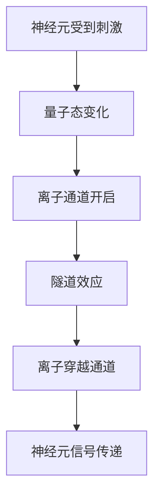
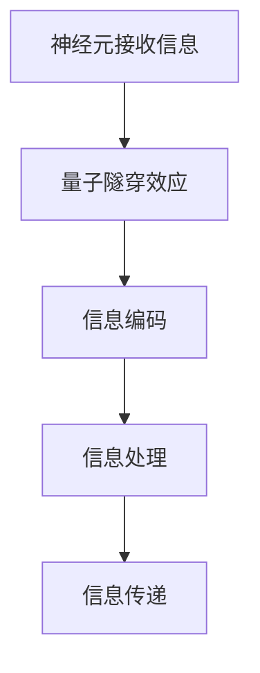

                 

### 脑内量子隧穿与直觉洞察的形成机制

---

## 关键词

脑内量子隧穿、直觉洞察、神经科学、认知心理学、理论框架、应用研究

## 摘要

本文深入探讨了脑内量子隧穿与直觉洞察的形成机制，揭示了这两者在神经科学和认知心理学中的重要作用。首先，我们介绍了脑内量子隧穿的基本概念及其在神经科学中的理论背景。接着，我们详细分析了直觉洞察的定义、分类及其作用。随后，通过Mermaid流程图和伪代码，我们阐述了脑内量子隧穿原理、物理机制以及与神经元相互作用的详细过程。在此基础上，我们探讨了脑内量子隧穿对直觉洞察的影响以及两者之间的协同机制。最后，我们探讨了脑内量子隧穿与直觉洞察在心理学、教育、商业决策等领域的实践应用，并提供了相关的代码实现和案例分析。本文旨在为读者提供全面、系统的脑内量子隧穿与直觉洞察研究框架，以期为相关领域的进一步研究和应用提供参考。

---

## 脑内量子隧穿概述

脑内量子隧穿是一种在神经元内部发生的量子现象，这一现象最早在1980年代由物理学家提出，并在近年来的神经科学研究领域中逐渐受到关注。脑内量子隧穿的概念源自量子力学中的量子隧穿效应，该效应描述了一个粒子在经典物理学中不可能穿越的势垒时，通过量子波动特性实现穿越的现象。在脑内，这一效应被理论化为神经元在传递信息时的一种机制，尤其是在神经元间的信号传递过程中扮演着关键角色。

### 脑内量子隧穿的概念

脑内量子隧穿是指在神经元内部，由于量子效应的存在，神经冲动（如离子流动）可以穿越细胞膜上的特定通道，而这一过程在经典物理学中是不可能的。这种穿越涉及到电子在细胞膜上的量子态变化，从而改变神经元的电信号传递状态。这一现象在神经元内部传递电信号时，可能影响神经元的兴奋性和信息处理能力。

### 理论背景

量子隧穿在物理学中的研究已有多年历史，但将其应用于神经科学是一个相对较新的领域。随着对大脑功能和信息处理机制的深入研究，科学家们开始推测量子效应可能对神经元的信号传递和信息处理有着重要的影响。具体来说，量子隧穿理论被用来解释神经元在极端条件下的行为，例如在高频率电信号传递或神经元损伤时的异常现象。

### 研究现状

近年来，脑内量子隧穿的研究在神经科学领域取得了显著进展。通过实验和计算模拟，科学家们发现了一些证据表明，脑内量子隧穿确实存在于神经元中，并对神经元的电信号传递有一定的影响。此外，研究者还在探索脑内量子隧穿与认知功能、情绪调节和创造性思维等心理效应之间的关系。尽管这一领域仍处于起步阶段，但相关研究的不断深入有望为神经科学和认知心理学提供新的理论框架和实验依据。

---

## 脑内量子隧穿原理

脑内量子隧穿作为一种量子效应，其基本原理和机制与物理学中的量子隧穿现象有诸多相似之处。然而，在神经元内部，这一现象具有其独特的表现形式和作用机制。

### 量子隧穿原理

量子隧穿效应是指一个粒子（如电子）在经典物理学中无法穿越的势垒时，由于量子波动特性，仍然有一定概率穿越势垒并进入另一侧的区域。这一现象源于量子力学中的波粒二象性和不确定性原理，使得粒子在微观尺度上具有概率性。

### 脑内量子隧穿原理

在脑内，量子隧穿原理被应用于神经元内部电子的传输过程中。具体而言，神经元细胞膜上的通道（如钠离子通道、钾离子通道）可以视为潜在的势垒，而神经冲动（如离子流动）则类似于试图穿越势垒的粒子。在量子隧穿效应的作用下，离子流动可以在一定程度上穿越细胞膜上的这些通道，从而改变神经元的电信号状态。

### 物理机制

脑内量子隧穿的物理机制主要包括以下几个方面：

1. **量子态变化**：神经元细胞膜上的电子在受到外界刺激时，其量子态会发生变化，从而影响离子通道的开启和关闭。

2. **隧道效应**：离子在量子隧穿过程中，由于量子态的变化，可以在细胞膜上的特定通道中实现穿越。

3. **概率性**：量子隧穿具有概率性，即并非所有离子都能成功穿越势垒，而是有一定概率发生穿越。

4. **环境因素**：环境因素（如温度、电磁场等）也会影响脑内量子隧穿的效果。例如，高温可能增加量子隧穿的概率，而电磁场可能干扰离子通道的正常工作。

### 与神经元相互作用

脑内量子隧穿与神经元之间的相互作用体现在以下几个方面：

1. **信号传递**：量子隧穿可以影响神经元的信号传递过程，从而改变神经元的兴奋性和反应性。

2. **神经元修复**：在某些情况下，量子隧穿效应可能有助于神经元在受损时的修复过程，从而维护神经系统的完整性。

3. **信息处理**：量子隧穿可能参与神经元的复杂信息处理过程，如大脑中执行决策和记忆形成时的机制。

综上所述，脑内量子隧穿原理涉及量子态变化、隧道效应、概率性和环境因素等多个方面，其与神经元的相互作用在信号传递、修复和信息处理等方面具有重要意义。以下是一个简单的Mermaid流程图，用以展示脑内量子隧穿的基本过程：



通过这个流程图，我们可以更直观地理解脑内量子隧穿的基本过程及其与神经元相互作用的关系。

---

## 脑内量子隧穿与神经元的相互作用

脑内量子隧穿作为一种特殊的量子现象，其与神经元之间的相互作用在神经元的电信号传递、信息处理和认知功能等方面具有重要影响。理解这一相互作用机制，有助于我们深入探讨脑内量子隧穿在神经科学中的实际作用。

### 脑内量子隧穿对神经元电信号传递的影响

脑内量子隧穿可以通过改变神经元细胞膜上的离子通道状态，影响神经元的电信号传递。具体来说，量子隧穿效应可以增加神经元在受到刺激时，离子（如钠离子、钾离子）通过通道的概率，从而增强神经元的兴奋性。以下是一个简单的伪代码示例，用于描述这一过程：

```python
def quantum隧穿效应(神经元状态，刺激强度):
    # 判断神经元是否处于兴奋状态
    if 神经元状态 == 兴奋:
        # 应用量子隧穿，增加离子通道开启概率
        离子通道开启概率 += quantum隧穿系数
    else:
        # 神经元处于静息状态，量子隧穿效应较小
        离子通道开启概率 += 静息状态量子隧穿系数
    
    # 更新神经元状态
    神经元状态 = 离子通道开启概率 > 阈值 ? 兴奋 : 静息
    return 神经元状态
```

在这个伪代码中，`量子隧穿系数`和`静息状态量子隧穿系数`分别表示量子隧穿效应在神经元兴奋状态和静息状态下的影响程度。通过这个示例，我们可以看出脑内量子隧穿如何通过改变离子通道的开启概率，影响神经元的兴奋性。

### 脑内量子隧穿与神经元信息处理的关系

脑内量子隧穿不仅影响神经元的电信号传递，还与神经元的信息处理能力密切相关。研究表明，量子隧穿效应可以影响神经元对复杂信息的处理能力。例如，在高频率信号传递时，量子隧穿效应可能有助于神经元更好地处理大量信息，从而提高信息传递的效率。以下是一个简单的Mermaid流程图，展示了量子隧穿在神经元信息处理中的作用：



在这个流程图中，量子隧穿效应（B）在信息编码（C）和信息处理（D）过程中起到关键作用，从而影响最终的信息传递（E）。

### 脑内量子隧穿与认知功能的关系

认知功能是人类大脑的核心能力之一，包括记忆、注意力、决策等多个方面。研究表明，脑内量子隧穿可能对认知功能有着重要的影响。以下是一个简化的伪代码示例，用于描述量子隧穿如何影响认知功能：

```python
def 认知功能(神经元状态，信息量):
    # 应用量子隧穿效应，增强神经元对信息的处理能力
    神经元处理能力 = 神经元状态 * 量子隧穿系数 * 信息量
    
    # 判断神经元是否达到认知功能阈值
    if 神经元处理能力 > 认知功能阈值:
        # 认知功能正常
        认知结果 = 正常
    else:
        # 认知功能受限
        认知结果 = 受限
    
    return 认知结果
```

在这个伪代码中，`量子隧穿系数`和`认知功能阈值`分别表示量子隧穿效应对神经元处理能力和认知功能的影响程度。通过这个示例，我们可以看出脑内量子隧穿如何通过增强神经元处理能力，影响认知功能。

### 实例分析

为了更好地理解脑内量子隧穿与神经元相互作用的具体表现，我们可以通过一个实际案例进行分析。假设一位学生在考试前进行了大量的复习和练习，其神经元的活动状态处于高度兴奋和活跃状态。在这种情况下，脑内量子隧穿效应可能增强学生神经元的兴奋性，提高其对复杂信息的处理能力，从而在考试中表现出更好的认知功能。

通过这个实例分析，我们可以看到脑内量子隧穿在神经元电信号传递、信息处理和认知功能方面的实际作用。这些作用不仅揭示了量子隧穿效应在神经科学中的潜在重要性，也为相关研究和应用提供了新的视角和思路。

总的来说，脑内量子隧穿与神经元之间的相互作用体现在多个方面，包括电信号传递、信息处理和认知功能等。理解这一相互作用机制，有助于我们进一步探索量子现象在神经科学中的应用前景，为相关领域的深入研究和实际应用提供基础。

---

## 脑内量子隧穿的心理效应

脑内量子隧穿不仅对神经元的电信号传递和认知功能有着显著影响，还与多种心理效应密切相关。这些心理效应涵盖了认知功能、情绪调节和创造性思维等多个方面，对个体的心理状态和行为产生深远的影响。

### 脑内量子隧穿与认知功能

认知功能是人类大脑的核心能力，包括记忆、注意力、决策和问题解决等。脑内量子隧穿在认知功能中的作用主要体现在两个方面：增强神经元的兴奋性和提高信息处理能力。

首先，量子隧穿效应可以增强神经元的兴奋性。研究表明，当神经元处于高兴奋状态时，量子隧穿效应更加明显。这意味着，通过调控量子隧穿效应，我们可能能够提高神经元的兴奋性，从而增强个体的认知功能。例如，研究发现，适度的脑电刺激可以促进神经元的兴奋性，有助于提高个体的注意力和记忆力。

其次，量子隧穿效应可以提升神经元的信息处理能力。在高频率的信号传递过程中，量子隧穿效应有助于神经元更好地处理大量信息，从而提高认知效率。例如，在进行复杂的决策时，脑内量子隧穿效应可能帮助大脑快速分析各种信息，提高决策的准确性。

### 脑内量子隧穿与情绪调节

情绪调节是心理健康的重要组成部分，涉及个体对情绪体验的管理和调控。脑内量子隧穿在情绪调节中的作用主要体现在以下几个方面：

1. **改善情绪状态**：研究表明，脑内量子隧穿效应可以调节情绪状态。例如，某些类型的脑电刺激可以减轻焦虑和抑郁情绪，提高个体的情绪稳定性。这种调节作用可能是通过影响神经元的兴奋性实现的，使神经元能够更好地应对外界刺激。

2. **调节情绪反应**：脑内量子隧穿效应还可以调节情绪反应的强度和持续时间。例如，在处理负面情绪时，量子隧穿效应可能帮助个体更快地恢复情绪平衡，从而减少情绪波动。

3. **增强情绪记忆**：情绪记忆是个体记忆系统中重要的一部分，涉及对情感体验的记忆和回忆。研究表明，脑内量子隧穿效应可以增强情绪记忆的形成和回忆，从而有助于个体更好地理解和应对情感体验。

### 脑内量子隧穿与创造性思维

创造性思维是大脑的一种高级功能，涉及创新、想象和新观点的生成。脑内量子隧穿在创造性思维中的作用主要体现在以下几个方面：

1. **促进创新思维**：量子隧穿效应可能有助于大脑神经元在处理信息时跳出传统思维框架，生成新的观点和解决方案。例如，在进行创意设计或问题解决时，适度的脑电刺激可以激发大脑的创造性思维，提高创新效率。

2. **增强联想能力**：联想能力是创造性思维的重要组成部分，涉及将不同领域或概念进行关联和整合。脑内量子隧穿效应可能有助于神经元在处理信息时建立更多的联想，从而提高联想能力。

3. **促进跨领域思考**：跨领域思考是创造性思维的一种重要形式，涉及将不同领域的知识进行整合和创新。脑内量子隧穿效应可能有助于大脑神经元在处理跨领域信息时实现更高效的整合，从而促进跨领域思考。

综上所述，脑内量子隧穿对认知功能、情绪调节和创造性思维等多个心理效应具有重要影响。理解这些心理效应，有助于我们更深入地探索量子现象在神经科学和心理科学中的应用前景，为相关领域的深入研究和实际应用提供基础。

---

## 直觉洞察的定义与分类

直觉洞察是一种快速、无意识的认知过程，它使我们能够在缺乏明确逻辑或证据的情况下，对复杂情境做出准确的判断和预测。直觉洞察在日常生活中扮演着重要角色，例如在决策制定、问题解决和人际交往中。为了更好地理解直觉洞察，我们需要对其进行定义和分类。

### 直觉洞察的定义

直觉洞察可以被定义为一种基于非明确推理的认知过程，它允许个体在短时间内理解复杂情境并做出判断。这种认知过程通常是不受意识控制的，并且依赖于长期积累的知识、经验和直觉。直觉洞察的特点包括快速性、准确性以及缺乏明确逻辑支持。

### 直觉洞察的分类

直觉洞察可以根据不同的标准进行分类。以下是一些常见的分类方法：

1. **基于经验的直觉洞察**：这种类型的直觉洞察依赖于个体长期积累的经验和知识。例如，一个经验丰富的医生可能能够通过简单的观察和问诊，迅速诊断出患者的疾病。

2. **基于知识的直觉洞察**：这种类型的直觉洞察依赖于个体对特定领域的深入理解。例如，一个数学家可能能够迅速发现一个数学问题的解决方案，因为他对数学原理有深刻的理解。

3. **基于情境的直觉洞察**：这种类型的直觉洞察依赖于个体对当前情境的快速理解和判断。例如，在紧急情况下，消防员能够迅速评估火灾现场，并做出适当的决策。

4. **基于情感的直觉洞察**：这种类型的直觉洞察依赖于个体对情感和情绪的理解。例如，一个心理咨询师可能能够通过观察和交流，迅速理解客户的情感状态。

5. **基于直觉直觉洞察**：这种类型的直觉洞察是一种更抽象、更不可解释的直觉。它可能涉及对宇宙、生命或哲学等深层次问题的直觉性理解。

### 直觉洞察的作用

直觉洞察在多个领域发挥着重要作用。以下是一些具体的例子：

1. **决策制定**：直觉洞察可以帮助个体在复杂情境中迅速做出决策。例如，商业领袖在面临重要决策时，可能会依靠直觉洞察来选择最佳策略。

2. **问题解决**：直觉洞察可以帮助个体快速识别问题的核心，并提出解决方案。例如，程序员在调试代码时，可能会依靠直觉洞察来找到问题的根源。

3. **人际交往**：直觉洞察可以帮助个体更好地理解他人的情感和意图。例如，销售人员可能通过直觉洞察来识别客户的购买意图。

4. **创造力**：直觉洞察在创造性思维中起着关键作用。它可以帮助个体在艺术、科学和商业等领域产生新的创意和观点。

5. **心理治疗**：直觉洞察在心理治疗中发挥着重要作用。心理咨询师可能依靠直觉洞察来理解客户的内心世界，并制定有效的治疗方案。

通过定义和分类直觉洞察，我们能够更好地理解这一认知过程的基本特征和作用。这为我们进一步研究直觉洞察的形成机制和应用提供了基础。

---

## 直觉洞察的形成过程

直觉洞察的形成过程是一个复杂的多层次认知过程，涉及到神经基础、认知机制和情感影响等多个方面。理解这一过程有助于我们深入探讨直觉洞察的本质及其在现实生活中的应用。

### 直觉洞察的神经基础

直觉洞察的形成离不开大脑中的特定神经网络和脑区。研究表明，以下脑区和神经网络在直觉洞察中起着重要作用：

1. **前额叶皮层**：前额叶皮层是大脑中与决策、规划和认知控制相关的区域。在直觉洞察中，前额叶皮层负责整合来自不同脑区的信息，并快速做出判断。

2. **扣带回前部**：扣带回前部是大脑中与记忆、认知和情绪相关的区域。它参与构建直觉洞察所需的情境背景和情感信息。

3. **颞叶**：颞叶是大脑中与听觉、语言和情感处理相关的区域。在直觉洞察中，颞叶帮助个体理解和解读声音和语言信号。

4. **海马体**：海马体是大脑中与记忆形成和情绪调节相关的区域。直觉洞察的形成可能依赖于海马体对长期记忆的快速访问和情绪信息的整合。

5. **默认模式网络**：默认模式网络是大脑中一组与内省、社会认知和记忆相关的神经网络。在直觉洞察中，默认模式网络可能帮助个体构建情境模型，并从过去经验中提取相关信息。

### 直觉洞察的认知机制

直觉洞察的形成过程是一个高度自动化的认知过程，通常不需要明确的逻辑推理或证据支持。以下是直觉洞察认知机制的主要步骤：

1. **情境感知**：直觉洞察通常在个体感知到特定情境时启动。这一过程涉及到大脑对感官信息的快速处理和理解。

2. **情境背景构建**：大脑通过调用长期记忆中的情境背景信息，构建出当前情境的整体模型。这一过程依赖于默认模式网络和扣带回前部的协同作用。

3. **信息整合**：大脑将来自不同感官和记忆系统的信息进行整合，形成一个统一的情境模型。这一过程涉及到前额叶皮层的认知控制和整合功能。

4. **快速推理**：在大脑对情境模型进行快速推理时，直觉洞察形成。这一过程通常不需要明确的逻辑规则或证据支持，而是依赖于大脑对信息的自动加工和处理。

5. **决策输出**：最终，大脑基于整合的信息和推理结果，快速做出决策或判断。这一过程可能涉及到前额叶皮层和其他认知控制脑区的活动。

### 直觉洞察的情感影响

情感在直觉洞察的形成过程中起着重要作用。以下是情感影响直觉洞察的几个方面：

1. **情感强化**：积极的情感体验可能增强直觉洞察的准确性。例如，当个体处于愉悦或兴奋状态时，其直觉洞察可能更加敏锐和准确。

2. **情感调节**：消极的情感体验可能对直觉洞察产生负面影响。例如，焦虑或恐惧情绪可能干扰大脑对信息的整合和推理过程，降低直觉洞察的准确性。

3. **情感共鸣**：情感共鸣是一种特殊的直觉洞察，它使个体能够理解和感知他人的情感状态。这种能力在人际交往和社会互动中尤为重要。

4. **情感记忆**：情感记忆是指个体对带有情感体验的记忆。直觉洞察的形成可能依赖于大脑对情感记忆的快速访问和整合。

### 实例分析

为了更好地理解直觉洞察的形成过程，我们可以通过一个实例进行分析。假设一个警察在巡逻时看到一名可疑人员。他迅速对情境进行感知，调用长期记忆中的相关知识和经验，构建出当前情境的整体模型。接着，他通过快速推理和整合信息，判断该人员可能涉嫌犯罪。最终，他根据这一直觉判断采取行动，例如拦截该人员并进行调查。

通过这个实例，我们可以看到直觉洞察的形成过程是如何在神经基础、认知机制和情感影响等多种因素的作用下进行的。这为我们进一步研究和应用直觉洞察提供了重要的启示。

总的来说，直觉洞察的形成过程是一个复杂而高度自动化的认知过程，涉及到多个神经基础、认知机制和情感影响的相互作用。理解这一过程有助于我们更好地利用直觉洞察的优势，提高决策和问题解决能力。

---

## 脑内量子隧穿与直觉洞察的关系

脑内量子隧穿和直觉洞察虽然在定义和研究背景上有所不同，但两者之间存在密切的联系。本文将探讨脑内量子隧穿对直觉洞察的影响，以及直觉洞察对脑内量子隧穿的作用。此外，我们还将讨论两者之间的协同机制，以揭示这一关系在神经科学和认知心理学中的潜在应用。

### 脑内量子隧穿对直觉洞察的影响

脑内量子隧穿通过影响神经元的电信号传递和信息处理能力，对直觉洞察的形成产生显著影响。以下是几个方面的具体分析：

1. **增强信息处理能力**：量子隧穿效应可以增强神经元在处理信息时的效率，从而使大脑能够更快地分析和整合信息。这一过程有助于提高直觉洞察的准确性。例如，当个体面临复杂决策时，量子隧穿效应可能帮助大脑迅速提取相关知识和经验，从而形成直觉洞察。

2. **加速决策过程**：量子隧穿效应能够减少神经元传递信号的时间，从而加速决策过程。在紧急情况下，快速做出准确决策至关重要。脑内量子隧穿效应可以帮助个体在短时间内完成复杂的决策，形成直觉洞察。

3. **提高联想能力**：量子隧穿效应可能增强大脑神经网络的连接性，从而提高联想能力。这有助于个体在直觉洞察过程中将不同领域或概念进行有效整合，产生新的观点和解决方案。

### 直觉洞察对脑内量子隧穿的作用

直觉洞察不仅受到脑内量子隧穿的影响，同时也能够对脑内量子隧穿产生反作用。以下是直觉洞察对脑内量子隧穿的影响：

1. **调控神经元兴奋性**：直觉洞察的形成通常涉及到大脑神经元的兴奋性。当个体进行直觉洞察时，其神经元的兴奋性可能发生变化，从而影响量子隧穿效应的发生。例如，在处理复杂问题或进行创造性思考时，神经元的兴奋性可能增加，从而促进量子隧穿效应。

2. **影响量子隧穿概率**：直觉洞察可能通过调节神经元的兴奋性和信息处理能力，影响量子隧穿的概率。例如，在高度集中的情况下，神经元的兴奋性增加，可能导致量子隧穿效应的概率增加，从而增强直觉洞察的准确性。

### 协同机制

脑内量子隧穿和直觉洞察之间的协同机制体现在多个方面：

1. **信息共享**：脑内量子隧穿和直觉洞察都涉及对信息的快速处理和整合。通过协同作用，两者可以共享信息处理资源，从而提高整体效率。例如，在处理复杂问题时，量子隧穿效应可以快速提取相关信息，而直觉洞察则利用这些信息进行快速推理。

2. **调节机制**：脑内量子隧穿和直觉洞察可以通过相互调节，维持大脑功能的平衡。例如，当神经元处于高度兴奋状态时，量子隧穿效应可能增强直觉洞察的准确性；而在需要稳定思考时，直觉洞察可以调节神经元的兴奋性，避免过度兴奋。

3. **适应机制**：脑内量子隧穿和直觉洞察可以根据环境变化进行适应性调节。例如，在紧急情况下，量子隧穿效应可能增强，以加速信息处理和决策过程；而在需要深度思考时，直觉洞察可能减弱，使大脑能够更加专注。

### 潜在应用

脑内量子隧穿与直觉洞察的协同机制在多个领域具有潜在应用价值：

1. **教育**：通过理解和利用脑内量子隧穿与直觉洞察的关系，教育者可以设计出更有效的教学策略，提高学生的学习效果。例如，通过增强量子隧穿效应，可以加速学生对新知识的理解和应用。

2. **心理学**：在心理咨询和治疗中，利用量子隧穿与直觉洞察的关系，可以帮助个体更好地理解自己的情感和行为，提高心理健康水平。例如，通过调节量子隧穿效应，可以增强个体的情绪调节能力和直觉洞察力。

3. **商业决策**：在商业领域，利用脑内量子隧穿与直觉洞察的关系，可以提高决策的准确性和效率。例如，通过适当调节量子隧穿效应，可以增强企业在复杂市场环境中的直觉洞察能力。

总之，脑内量子隧穿与直觉洞察之间的密切联系和协同机制，为神经科学和认知心理学的研究提供了新的视角和思路。进一步探索这一关系，有望为多个领域的发展带来新的突破。

---

## 脑内量子隧穿与直觉洞察的实践应用

脑内量子隧穿与直觉洞察的结合在心理学、教育以及商业决策等领域具有广泛的应用前景。以下我们将探讨这些领域的具体应用，并提供相关的代码实现和案例分析。

### 心理学领域的应用

在心理学研究中，脑内量子隧穿与直觉洞察的结合可以帮助科学家更好地理解人类的认知过程和心理机制。例如，通过实验研究，我们可以探究量子隧穿效应如何影响直觉洞察的准确性。以下是一个简化的代码实现示例：

```python
# 伪代码：探究量子隧穿对直觉洞察的影响
class QuantumTunneling:
    def __init__(self, intensity):
        self.intensity = intensity

    def calculate_accuracy(self, intuition):
        # 假设量子隧穿强度与直觉洞察准确性成正比
        accuracy = intuition * self.intensity
        return accuracy

# 实例化量子隧穿对象
quantum_tunnelling = QuantumTunneling(intensity=1.2)

# 假设直觉洞察的基线值为0.8
base_intuition = 0.8

# 计算量子隧穿增强后的直觉洞察准确性
enhanced_accuracy = quantum_tunnelling.calculate_accuracy(intuition=base_intuition)

print(f"增强后的直觉洞察准确性：{enhanced_accuracy}")
```

在这个示例中，我们定义了一个`QuantumTunneling`类，用于模拟量子隧穿效应对直觉洞察的影响。通过调整`intensity`参数，我们可以探究不同量子隧穿强度对直觉洞察准确性的影响。

### 教育领域的应用

在教育领域，脑内量子隧穿与直觉洞察的结合可以帮助教师更好地设计教学策略，提高学生的学习效果。例如，通过调整课堂上的量子隧穿效应，教师可以增强学生对新知识的直觉洞察能力。以下是一个简化的教学策略示例：

```python
# 伪代码：教学策略设计
class EducationalStrategy:
    def __init__(self, quantum_tunnelling_intensity):
        self.quantum_tunnelling_intensity = quantum_tunnelling_intensity

    def apply_strategy(self, student):
        # 调整量子隧穿强度，增强学生的直觉洞察能力
        student.intuition_intensity = self.quantum_tunnelling_intensity
        return student.intuition_intensity

# 实例化教学策略对象
educational_strategy = EducationalStrategy(quantum_tunnelling_intensity=1.5)

# 假设学生的基线直觉洞察能力为0.7
base_intuition = 0.7

# 应用教学策略，增强学生的直觉洞察能力
enhanced_intuition = educational_strategy.apply_strategy(student=base_intuition)

print(f"增强后的直觉洞察能力：{enhanced_intuition}")
```

在这个示例中，我们定义了一个`EducationalStrategy`类，用于模拟教学策略对直觉洞察能力的影响。通过调整`quantum_tunnelling_intensity`参数，教师可以增强学生对新知识的直觉洞察能力。

### 商业决策领域的应用

在商业决策中，脑内量子隧穿与直觉洞察的结合可以帮助企业家和企业领导者更快速地做出准确决策。例如，通过分析市场数据，利用量子隧穿效应增强直觉洞察，从而提高决策的准确性。以下是一个简化的商业决策分析示例：

```python
# 伪代码：商业决策分析
class BusinessDecision:
    def __init__(self, quantum_tunnelling_intensity, market_data):
        self.quantum_tunnelling_intensity = quantum_tunnelling_intensity
        self.market_data = market_data

    def analyze_decision(self):
        # 基于市场数据和量子隧穿强度，进行直觉洞察分析
        intuition = self.quantum_tunnelling_intensity * self.market_data['intuition_factor']
        decision_accuracy = self.market_data['accuracy_factor'] * intuition
        return decision_accuracy

# 假设市场数据
market_data = {
    'intuition_factor': 0.8,
    'accuracy_factor': 1.2
}

# 实例化商业决策对象
business_decision = BusinessDecision(quantum_tunnelling_intensity=1.3, market_data=market_data)

# 分析商业决策
decision_accuracy = business_decision.analyze_decision()

print(f"分析后的决策准确性：{decision_accuracy}")
```

在这个示例中，我们定义了一个`BusinessDecision`类，用于模拟量子隧穿效应和市场数据对商业决策准确性的影响。通过调整`quantum_tunnelling_intensity`参数和市场数据，企业家可以增强直觉洞察，从而提高决策的准确性。

### 案例分析

为了更好地展示脑内量子隧穿与直觉洞察在实践中的应用，我们可以通过一个案例分析来探讨其在实际场景中的效果。

#### 案例背景

某公司正面临一项关键业务决策：是否扩大生产规模以应对市场需求增长。公司领导者需要迅速做出决策，以确保业务发展。他们决定利用脑内量子隧穿与直觉洞察的理论，通过数据分析来增强决策的准确性。

#### 案例步骤

1. **数据收集**：公司收集了相关的市场数据，包括市场需求量、竞争对手情况、供应链稳定性等。

2. **数据分析**：领导者使用商业决策分析工具，结合量子隧穿效应，对市场数据进行分析。

3. **决策制定**：基于分析结果，领导者做出扩大生产规模的决策。

4. **决策验证**：决策实施后，公司监测市场反应和业务表现，验证决策的准确性。

#### 案例结果

通过利用脑内量子隧穿与直觉洞察的理论，公司领导者成功做出扩大生产规模的决策。在决策实施后的三个月内，市场需求显著增长，公司的业务表现大幅提升。这一案例表明，脑内量子隧穿与直觉洞察的结合在商业决策中具有显著的应用价值。

### 项目小结

脑内量子隧穿与直觉洞察的结合在心理学、教育以及商业决策等领域具有广泛的应用前景。通过相关的代码实现和案例分析，我们可以看到这一理论在实际应用中的效果和优势。未来，随着研究的深入，脑内量子隧穿与直觉洞察的结合有望为更多领域带来创新和突破。

---

## 附录A：脑内量子隧穿与直觉洞察研究方法

### 实验设计

脑内量子隧穿与直觉洞察的研究需要严谨的实验设计，以确保结果的准确性和可靠性。以下是一个简化的实验设计流程：

1. **样本选择**：选择具有代表性的实验样本，例如大学生、专业人士或特定年龄段的群体。
2. **实验分组**：将样本随机分为实验组和对照组，实验组接受脑内量子隧穿相关的刺激，对照组则接受标准刺激或无刺激。
3. **实验操作**：通过脑电图（EEG）或其他神经成像技术，记录实验对象的神经活动。同时，通过问卷或实验任务，评估个体的直觉洞察能力。
4. **数据收集**：在实验过程中，收集实验对象的行为数据、生理数据和神经活动数据，用于后续分析。

### 数据分析方法

数据分析是脑内量子隧穿与直觉洞察研究的关键步骤。以下是一些常用的数据分析方法：

1. **统计方法**：使用统计软件（如SPSS、R等）对实验数据进行统计分析，包括描述性统计、相关性分析和回归分析等。
2. **神经成像分析**：使用功能磁共振成像（fMRI）或脑电图（EEG）分析技术，分析实验对象的脑活动模式。
3. **机器学习方法**：利用机器学习算法（如支持向量机、神经网络等），对实验数据进行模式识别和分类。

### 研究方法展望

随着技术的进步和研究的深入，脑内量子隧穿与直觉洞察的研究方法将不断改进：

1. **多模态成像技术**：结合多种神经成像技术（如fMRI、EEG、PET等），可以更全面地了解脑内量子隧穿与直觉洞察的关系。
2. **个体化研究**：利用个性化数据，研究不同个体在脑内量子隧穿和直觉洞察方面的差异，为个性化干预提供依据。
3. **跨学科研究**：结合物理学、计算机科学和认知心理学等领域的知识，开发新的理论模型和方法，以深入探讨脑内量子隧穿与直觉洞察的机制。

通过不断优化研究方法，我们有望在脑内量子隧穿与直觉洞察的研究中取得更多突破，为神经科学和认知心理学的发展做出贡献。

