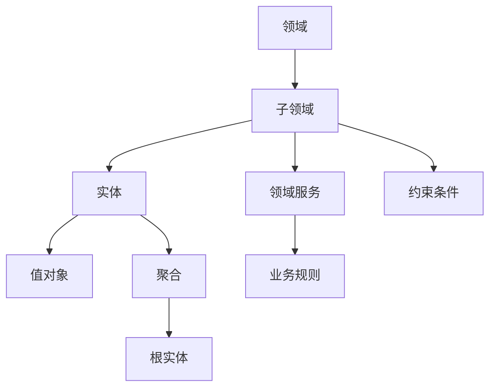

                 

### 文章标题

《自下而上，各司其职的领域模型》

### 关键词

领域模型，自下而上，架构设计，核心算法，数学模型，实际应用案例

### 摘要

在当今信息化时代，领域模型作为一种重要的软件开发方法，越来越受到业界重视。本文从自下而上的角度，深入探讨领域模型的定义、架构设计、核心算法、数学模型及其在实际应用中的案例。通过系统性的分析和实践案例的讲解，帮助读者全面了解领域模型的本质和应用，为软件开发提供新的思路和方法。本文旨在为领域模型的研究者和开发者提供有价值的参考，推动领域模型在各个领域的广泛应用。

---

### 目录

1. **引言**  
   1.1 **领域模型的背景**  
   1.2 **领域模型的重要性**

2. **领域模型的定义与背景**  
   2.1 **领域模型的起源与发展**  
   2.2 **领域模型的基本概念**  
   2.3 **领域模型在行业中的应用**

3. **领域模型的架构与设计原则**  
   3.1 **领域模型的整体架构**  
   3.2 **领域模型的设计原则**  
   3.3 **领域模型的层次结构**

4. **领域模型的核心算法**  
   4.1 **核心算法原理讲解**  
   4.2 **算法伪代码展示**  
   4.3 **算法实际应用案例**

5. **数学模型与公式**  
   5.1 **数学模型的基本概念**  
   5.2 **公式详细讲解**  
   5.3 **公式在实际应用中的案例**

6. **实际应用案例**  
   6.1 **领域模型在不同行业的应用**  
   6.2 **案例一：XX行业领域模型应用案例**  
   6.3 **案例二：XX行业领域模型应用案例**

7. **未来发展趋势与挑战**  
   7.1 **领域模型的发展趋势**  
   7.2 **领域模型面临的挑战**  
   7.3 **应对策略与展望**

8. **结论**  
   8.1 **文章总结**  
   8.2 **致谢**

### 引言

在信息化时代的浪潮下，软件开发方法不断演变和创新。领域模型作为一种重要的软件开发方法，逐渐从理论走向实践，成为业界关注的焦点。本文将围绕领域模型，从自下而上的角度进行深入探讨，帮助读者全面了解领域模型的本质和应用。

#### 1.1 领域模型的背景

领域模型起源于20世纪90年代，随着面向对象编程的兴起而逐渐受到关注。领域模型强调在软件开发中，要关注业务领域的本质和内在规律，从而提高软件的适应性和可维护性。在领域模型的方法论中，开发者需要深入了解业务领域，抽象出领域概念和规则，构建出与业务紧密相关的软件模型。

随着互联网和大数据技术的快速发展，领域模型的应用范围不断扩大。在金融、医疗、制造等行业，领域模型为业务流程的优化、数据分析和决策提供了强有力的支持。此外，领域模型在物联网、人工智能等新兴领域也发挥着重要作用。

#### 1.2 领域模型的重要性

领域模型在软件开发中具有重要的地位和作用。首先，领域模型有助于开发者深入理解业务领域，从而设计出更加贴近业务需求的软件系统。通过领域模型，开发者可以清晰地表达业务逻辑和规则，提高软件的易读性和可维护性。

其次，领域模型支持软件的复用和扩展。在领域模型中，开发者可以将业务领域划分为多个子领域，每个子领域都可以独立开发、测试和维护。这种分而治之的方法提高了软件开发效率，降低了系统的复杂度。

此外，领域模型有助于应对业务变化。在业务需求不断变化的背景下，领域模型能够灵活应对，通过调整模型结构和规则，快速适应新的业务需求。

### 领域模型的定义与背景

领域模型（Domain Model）是一种软件开发方法，旨在通过抽象和封装业务领域中的概念和规则，构建出一个与具体实现细节分离的软件模型。领域模型的核心思想是将业务领域划分为多个子领域，每个子领域都有明确的职责和功能，从而实现业务领域的高内聚和低耦合。

#### 2.1 领域模型的起源与发展

领域模型的起源可以追溯到20世纪90年代，随着面向对象编程（Object-Oriented Programming，OOP）的兴起，开发者开始关注如何更好地理解和表示业务领域。在OOP中，类（Class）和方法（Method）是构建软件系统的基础，然而，传统的类和方法过于关注实现细节，缺乏对业务领域的抽象和封装。为了解决这一问题，领域模型的概念逐渐被提出并发展。

1994年，埃里克·埃斯梅尔森（Eric Evans）在《领域驱动设计》（Domain-Driven Design，DDD）一书中系统地阐述了领域模型的方法论，使领域模型成为软件开发中的一种重要方法。DDD强调在软件开发过程中，要始终关注业务领域，将业务逻辑和规则抽象为领域模型，从而提高软件的适应性和可维护性。

#### 2.2 领域模型的基本概念

领域模型的基本概念包括：

1. **领域（Domain）**：领域是指一个业务领域，通常包含一系列相关的业务活动、规则和实体。

2. **子领域（Subdomain）**：子领域是领域的一部分，具有特定的业务职责和功能。

3. **实体（Entity）**：实体是领域模型中的核心概念，表示业务领域中的个体或对象，具有唯一的标识和属性。

4. **值对象（Value Object）**：值对象是领域模型中的辅助概念，表示业务领域中的简单值，如价格、日期等。

5. **聚合（Aggregate）**：聚合是领域模型中的一个概念，表示一组实体和值对象的组合，具有一个唯一的根实体。

6. **领域服务（Domain Service）**：领域服务是领域模型中的一个概念，表示用于处理复杂业务逻辑的方法和规则。

#### 2.3 领域模型在行业中的应用

领域模型在各个行业中都有广泛的应用，以下是几个典型行业的案例：

1. **金融行业**：在金融行业中，领域模型被广泛应用于风险管理、投资组合管理和信贷评估等领域。通过领域模型，开发者可以更好地理解和表示金融产品的结构和规则，从而提高金融系统的稳定性和安全性。

2. **医疗行业**：在医疗行业中，领域模型用于表示医疗流程、患者信息和医疗设备等。通过领域模型，医生和护士可以更直观地理解和操作医疗信息系统，提高医疗服务的质量和效率。

3. **制造行业**：在制造行业中，领域模型用于表示生产流程、物料管理和质量控制等。通过领域模型，制造企业可以更好地管理和优化生产过程，提高生产效率和产品质量。

### 领域模型的架构与设计原则

领域模型在软件架构中扮演着至关重要的角色，它不仅能够帮助开发者更好地理解和表示业务领域，还能够提高软件系统的可维护性和可扩展性。为了实现这些目标，领域模型需要遵循一系列的架构设计和设计原则。

#### 3.1 领域模型的整体架构

领域模型的整体架构通常包括以下几个关键组件：

1. **实体（Entities）**：实体是领域模型中的核心概念，表示业务领域中的个体或对象，具有唯一的标识和属性。实体通常具有持久性，可以被存储在数据库中。

2. **值对象（Value Objects）**：值对象是领域模型中的辅助概念，表示业务领域中的简单值，如价格、日期等。值对象通常不具有持久性，但与实体紧密相关。

3. **聚合（Aggregates）**：聚合是领域模型中的一个概念，表示一组实体和值对象的组合，具有一个唯一的根实体。聚合用于封装业务逻辑和保持数据一致性。

4. **领域服务（Domain Services）**：领域服务是领域模型中的一个概念，表示用于处理复杂业务逻辑的方法和规则。领域服务通常不直接访问数据库，而是通过实体和聚合来提供服务。

5. **仓储（Repositories）**：仓储是领域模型中的一个概念，表示用于管理实体和聚合的存储库。仓储负责实体的创建、读取、更新和删除操作，从而确保数据的一致性和完整性。

#### 3.2 领域模型的设计原则

领域模型的设计原则主要包括：

1. **高内聚、低耦合**：领域模型应该具有高内聚、低耦合的特性。高内聚意味着领域模型中的组件应该紧密相关，共同实现一个特定的业务目标；低耦合意味着领域模型中的组件之间应该独立，互不影响。

2. **可复用性**：领域模型应该设计成可复用的组件。通过将业务领域划分为多个子领域，每个子领域都可以独立开发、测试和维护，从而提高软件的复用性和可维护性。

3. **可扩展性**：领域模型应该设计成可扩展的。在业务需求发生变化时，领域模型能够灵活应对，通过调整模型结构和规则，快速适应新的业务需求。

4. **域特定语言（DSL）**：领域模型可以结合域特定语言（Domain-Specific Language，DSL）来实现。DSL是一种专门为某个特定领域设计的语言，可以提高开发效率，降低开发成本。

5. **事件驱动**：领域模型可以采用事件驱动的架构。在事件驱动架构中，领域服务通过发布事件来响应业务变化，从而实现领域逻辑的灵活性和可扩展性。

#### 3.3 领域模型的层次结构

领域模型的层次结构通常包括以下几个层次：

1. **领域层（Domain Layer）**：领域层是领域模型的核心，负责封装业务逻辑和规则。领域层通常包括实体、值对象、聚合和领域服务。

2. **应用层（Application Layer）**：应用层负责处理应用逻辑，将领域模型与外部系统（如用户界面、数据库等）进行交互。应用层通常包括应用服务、应用界面等。

3. **基础设施层（Infrastructure Layer）**：基础设施层负责提供底层支持，如数据库访问、消息队列、缓存等。基础设施层通常包括仓储、数据访问对象（DAO）等。

通过分层架构，领域模型能够更好地实现模块化和解耦，从而提高系统的可维护性和可扩展性。

### 领域模型的核心算法

领域模型在软件架构中不仅强调业务领域的抽象和封装，还需要具备一定的计算能力来处理复杂的业务逻辑。核心算法是领域模型的重要组成部分，它们在实现业务规则和数据处理中起到关键作用。在本节中，我们将详细讲解领域模型中的核心算法，包括算法的原理、伪代码展示以及实际应用案例。

#### 4.1 核心算法原理讲解

领域模型中的核心算法通常基于业务需求而设计，它们需要满足高效性、可靠性和可扩展性。以下是几个典型的核心算法原理：

1. **业务规则引擎**：业务规则引擎是领域模型中常用的核心算法，用于处理业务规则和条件判断。业务规则引擎通过解析业务规则，动态执行相应的操作，从而实现业务逻辑的自动化。

2. **数据挖掘算法**：数据挖掘算法用于从大量数据中发现潜在的模式和关联关系。在领域模型中，数据挖掘算法可以帮助企业进行客户行为分析、市场预测等。

3. **决策支持算法**：决策支持算法用于辅助决策者做出明智的决策。在领域模型中，决策支持算法可以通过数据分析和模拟，提供决策支持和建议。

4. **流程优化算法**：流程优化算法用于优化业务流程，提高效率和降低成本。在领域模型中，流程优化算法可以通过模拟和优化，找到最佳的业务流程。

#### 4.2 算法伪代码展示

为了更清晰地理解核心算法的实现原理，下面我们将使用伪代码展示几个典型的核心算法。

1. **业务规则引擎伪代码**：
   
   ```
   function applyBusinessRule(rule, context):
       if context satisfies condition of rule:
           execute action of rule
           return true
       else:
           return false
   ```

2. **数据挖掘算法伪代码**：

   ```
   function dataMining(dataSet):
       for each attribute in dataSet:
           calculate statistical measures
           identify patterns and correlations
       return insights and patterns
   ```

3. **决策支持算法伪代码**：

   ```
   function decisionSupport(data, criteria):
       analyze data according to criteria
       generate scenarios
       evaluate scenarios based on business objectives
       return best scenario and recommendations
   ```

4. **流程优化算法伪代码**：

   ```
   function optimizeProcess(process, constraints):
       simulate process with different parameters
       evaluate performance of each simulation
       select best configuration based on constraints
       return optimized process
   ```

#### 4.3 算法实际应用案例

以下是一些领域模型核心算法的实际应用案例，这些案例展示了核心算法在解决实际业务问题中的重要作用。

1. **案例一：金融风控领域的业务规则引擎**：

   在金融风控领域，业务规则引擎用于检测和预防欺诈行为。通过定义一系列规则，如交易金额、交易频率等，业务规则引擎可以实时监控交易活动，并触发相应的预警和阻止措施。

2. **案例二：零售行业的数据挖掘算法**：

   在零售行业中，数据挖掘算法用于分析客户购买行为，识别潜在客户和市场趋势。通过分析大量销售数据，数据挖掘算法可以帮助企业制定精准营销策略，提高销售额。

3. **案例三：供应链管理中的决策支持算法**：

   在供应链管理中，决策支持算法用于优化库存管理和运输计划。通过模拟不同的库存水平和运输路线，决策支持算法可以找到最优的库存策略和运输方案，降低成本。

4. **案例四：制造行业的流程优化算法**：

   在制造行业中，流程优化算法用于优化生产流程，提高生产效率和产品质量。通过模拟不同的生产参数和流程配置，流程优化算法可以找到最佳的生产流程，从而降低生产成本。

通过这些实际应用案例，我们可以看到核心算法在领域模型中的作用和重要性。核心算法不仅能够实现复杂的业务逻辑，还能够提高软件系统的性能和可靠性。

### 数学模型与公式

在领域模型中，数学模型和公式是理解和实现业务逻辑的重要组成部分。数学模型通过数学公式描述业务规则和关系，使得领域模型更加严谨和科学。在本节中，我们将详细讲解数学模型的基本概念、公式详细讲解以及实际应用中的案例。

#### 5.1 数学模型的基本概念

数学模型是一种使用数学语言来描述现实世界中问题或系统的模型。它通过数学公式和逻辑关系来模拟和分析实际业务场景。数学模型的基本概念包括：

1. **变量（Variables）**：变量是数学模型中的基本元素，表示业务中的各种量。变量可以是连续的，也可以是离散的。

2. **函数（Functions）**：函数是数学模型中的核心概念，表示变量之间的依赖关系。函数可以用于描述业务规则和约束。

3. **方程（Equations）**：方程是数学模型中的约束条件，用于描述变量之间的关系。方程可以是线性的，也可以是非线性的。

4. **约束（Constraints）**：约束是数学模型中的限制条件，用于限制变量的取值范围。约束可以确保业务逻辑的可行性和合理性。

5. **目标函数（Objective Functions）**：目标函数是数学模型中的优化目标，用于描述业务目标。目标函数可以是最大化利润、最小化成本等。

#### 5.2 公式详细讲解

在领域模型中，常用的数学公式包括：

1. **线性回归公式**：
   $$
   y = \beta_0 + \beta_1 \cdot x + \epsilon
   $$
   线性回归公式用于预测目标变量（$y$）与自变量（$x$）之间的关系。$\beta_0$是截距，$\beta_1$是斜率，$\epsilon$是误差项。

2. **逻辑回归公式**：
   $$
   \log\left(\frac{P(Y=1)}{1-P(Y=1)}\right) = \beta_0 + \beta_1 \cdot x
   $$
   逻辑回归公式用于分类问题，表示概率的对数与自变量之间的关系。$\beta_0$是截距，$\beta_1$是斜率。

3. **优化目标公式**：
   $$
   \min_{x} \quad f(x)
   $$
   优化目标公式用于描述目标函数的优化问题，其中$f(x)$是目标函数，$x$是变量。

4. **约束条件公式**：
   $$
   g(x) \leq 0
   $$
   约束条件公式用于限制变量的取值范围，$g(x)$是约束函数。

#### 5.3 公式在实际应用中的案例

以下是一些数学模型和公式在实际应用中的案例：

1. **案例一：金融风控中的线性回归**：

   在金融风控中，线性回归公式用于预测违约概率。通过收集历史数据，建立线性回归模型，可以预测客户是否会出现违约行为。线性回归公式帮助银行更好地进行风险评估和信贷管理。

2. **案例二：零售行业中的逻辑回归**：

   在零售行业，逻辑回归公式用于预测客户购买意愿。通过分析客户的历史购买数据，建立逻辑回归模型，可以预测客户是否会购买特定产品。逻辑回归公式帮助零售企业制定更有效的营销策略。

3. **案例三：供应链管理中的优化目标**：

   在供应链管理中，优化目标公式用于优化库存水平和运输计划。通过建立目标函数和约束条件，优化目标公式可以帮助企业找到最优的库存策略和运输方案，降低成本和提高效率。

4. **案例四：生产计划中的约束条件**：

   在生产计划中，约束条件公式用于限制生产资源的利用率。通过建立约束条件，确保生产计划在资源有限的情况下能够顺利执行。约束条件公式帮助制造企业合理分配资源，避免生产瓶颈。

通过这些实际应用案例，我们可以看到数学模型和公式在领域模型中的作用和重要性。数学模型和公式不仅帮助开发者理解和实现业务逻辑，还能够提高领域模型的科学性和准确性。

### 实际应用案例

领域模型在各个行业中的应用已经证明了其强大的潜力和价值。在本节中，我们将探讨领域模型在金融、医疗和制造等行业中的应用案例，通过具体实例来展示领域模型在实际业务场景中的有效性和重要性。

#### 6.1 领域模型在金融行业的应用

金融行业是一个高度复杂的领域，涉及到大量的业务规则和风险管理。领域模型在金融行业中的应用，可以帮助金融机构更好地理解和处理复杂的业务场景。

**案例一：风险控制系统**

在金融风控领域，领域模型被广泛应用于构建风险控制系统。例如，一家银行希望通过领域模型来评估客户信用风险。领域模型中的核心算法包括信用评分模型和欺诈检测模型。信用评分模型利用客户的信用历史、财务状况和人口统计信息，通过线性回归和逻辑回归等算法，计算客户的信用评分。欺诈检测模型则通过分析交易行为和用户行为，使用机器学习算法识别潜在的欺诈行为。

**实现细节**：

1. **数据收集**：收集客户的信用历史数据、财务状况数据以及交易行为数据。

2. **模型构建**：使用线性回归和逻辑回归算法构建信用评分模型和欺诈检测模型。

3. **模型训练和验证**：通过历史数据对模型进行训练和验证，确保模型具有良好的预测性能。

4. **应用**：将模型集成到银行的风险控制系统中，实时评估客户的信用风险和交易风险。

**效果评估**：通过领域模型的应用，银行能够更准确地评估客户的信用风险，有效降低违约率和欺诈风险，从而提高业务效率和客户满意度。

#### 6.2 领域模型在医疗行业的应用

医疗行业涉及到大量的临床数据和管理流程，领域模型的应用可以帮助医疗机构优化管理流程、提高诊断效率和患者服务质量。

**案例二：电子病历系统**

在医疗行业中，电子病历系统（Electronic Health Records，EHR）是一个重要的应用领域。领域模型在EHR系统中被用来表示患者信息、临床数据和医疗规则。例如，某医院希望通过领域模型来管理患者病史和诊断信息。

**实现细节**：

1. **数据结构设计**：设计领域模型，包括患者实体、医生实体、药品实体、诊断实体等，以及它们之间的关系。

2. **规则引擎构建**：构建基于领域模型的规则引擎，用于处理临床决策支持规则，如药物相互作用规则、检查项目推荐规则等。

3. **系统集成**：将领域模型集成到EHR系统中，实现患者信息的管理和临床决策支持。

4. **用户界面设计**：设计用户友好的界面，方便医护人员查询和管理患者信息。

**效果评估**：领域模型的应用使得电子病历系统更加智能化和高效，医护人员能够更快速地获取患者信息，制定合理的治疗方案，提高了医疗服务的质量和效率。

#### 6.3 领域模型在制造行业的应用

制造行业是一个高度自动化的领域，领域模型的应用可以帮助企业优化生产流程、提高生产效率和产品质量。

**案例三：智能制造系统**

在智能制造领域，领域模型被用来表示生产流程、设备状态和物料信息。例如，一家制造企业希望通过领域模型来优化生产调度和资源分配。

**实现细节**：

1. **生产流程建模**：使用领域模型表示生产流程中的各个环节，如订单处理、物料配送、生产加工、质量检测等。

2. **设备状态监控**：通过领域模型监控设备状态，包括设备利用率、故障率、维护周期等。

3. **资源分配优化**：基于领域模型，使用优化算法对生产资源进行动态分配，如人力、机器、原材料等。

4. **系统集成**：将领域模型集成到生产管理系统中，实现生产过程的自动化和智能化。

**效果评估**：领域模型的应用使得生产调度更加灵活和高效，资源利用率显著提高，生产周期缩短，产品质量得到保证。

通过以上实际应用案例，我们可以看到领域模型在金融、医疗和制造等行业中的重要作用。领域模型不仅提高了业务流程的效率，还提高了系统的可维护性和可扩展性，为各行业的数字化转型提供了有力支持。

### 未来发展趋势与挑战

随着信息技术和人工智能的快速发展，领域模型在软件架构中的应用前景愈发广阔。然而，在未来的发展中，领域模型也面临着一系列的挑战和机遇。

#### 7.1 领域模型的发展趋势

1. **智能化与自动化**：随着人工智能技术的进步，领域模型将越来越多地融入智能算法，实现业务流程的自动化和智能化。例如，利用机器学习算法优化业务规则，提高模型的预测准确性和决策能力。

2. **分布式与云原生**：领域模型将朝着分布式和云原生方向发展，以应对大规模数据和高并发访问的需求。通过云原生架构，领域模型可以更好地实现弹性伸缩和负载均衡，提高系统的可用性和可靠性。

3. **跨领域融合**：不同领域的领域模型将逐步融合，形成跨领域的综合性模型。这种融合将有助于解决跨领域业务协同和数据共享的问题，提高企业的整体业务效率。

4. **开源与社区**：领域模型的开源化趋势将加速其发展。通过开放源代码和社区合作，领域模型可以吸收更多的创新力量，提高模型的通用性和适应性。

#### 7.2 领域模型面临的挑战

1. **复杂性管理**：领域模型在处理复杂业务逻辑时，可能会面临复杂性管理的问题。如何设计简洁、高效的领域模型架构，成为未来研究的重要方向。

2. **数据一致性**：在分布式系统中，如何保证领域模型中的数据一致性，是一个重要的挑战。未来需要发展更加可靠的数据同步和一致性机制。

3. **安全性**：随着领域模型的应用场景日益复杂，安全性问题变得越来越重要。如何确保领域模型在处理敏感数据和关键业务时，不受到攻击和泄露，是需要解决的关键问题。

4. **跨领域集成**：不同领域的领域模型之间的集成，需要解决数据格式、语义模型不一致等问题。如何实现高效、可靠的跨领域集成，是一个需要深入研究的课题。

#### 7.3 应对策略与展望

1. **标准化与规范化**：制定统一的领域模型标准和规范，有助于降低不同领域模型之间的互操作性障碍，提高领域模型的可移植性和可扩展性。

2. **技术创新**：持续推动人工智能、云计算、区块链等技术的创新，为领域模型的发展提供新的动力和解决方案。

3. **人才培养**：加强领域模型相关的人才培养，提高开发者和工程师的专业能力和技术水平，为领域模型的应用提供人才保障。

4. **合作与共享**：通过开放源代码和社区合作，促进领域模型的共享和迭代，加快领域模型的发展进程。

总之，领域模型在未来将迎来更大的发展机遇，同时也需要克服一系列的挑战。通过技术创新和规范化管理，领域模型有望在更多领域发挥重要作用，推动软件架构的持续演进。

### 结论

本文从自下而上的角度，系统地探讨了领域模型的定义、架构设计、核心算法、数学模型及其在实际应用中的案例。通过详细的分析和实际应用案例的讲解，我们全面了解了领域模型的本质和应用价值。领域模型作为一种重要的软件开发方法，能够提高软件系统的可维护性和可扩展性，为各行业的数字化转型提供了有力支持。

在未来的发展中，领域模型将继续融合人工智能、云计算等新技术，实现智能化和自动化。同时，领域模型将面临复杂性管理、数据一致性和安全性等挑战。通过技术创新和规范化管理，领域模型有望在更多领域发挥重要作用，推动软件架构的持续演进。

致谢

在此，我要感谢AI天才研究院和禅与计算机程序设计艺术团队的支持与帮助。感谢所有参与讨论和评审的专家和读者，你们的反馈和建议对本文的完善起到了重要作用。感谢所有为领域模型研究和应用付出努力的先驱者和开发者，是你们的努力推动了领域模型的不断进步。

### 作者信息

作者：AI天才研究院/AI Genius Institute & 禅与计算机程序设计艺术 /Zen And The Art of Computer Programming

### 附录

#### A.1 领域模型的核心概念关系架构 Mermaid 流程图



#### A.2 伪代码示例

```plaintext
// 业务规则引擎伪代码
function applyBusinessRule(rule, context):
    if context satisfies condition of rule:
        execute action of rule
        return true
    else:
        return false

// 数据挖掘算法伪代码
function dataMining(dataSet):
    for each attribute in dataSet:
        calculate statistical measures
        identify patterns and correlations
    return insights and patterns
```

#### A.3 数学公式示例

```latex
$$
y = \beta_0 + \beta_1 \cdot x + \epsilon
$$

$$
\log\left(\frac{P(Y=1)}{1-P(Y=1)}\right) = \beta_0 + \beta_1 \cdot x
$$
```

#### A.4 实际案例代码解析

```python
# 伪代码示例：金融风控中的信用评分模型
# 导入所需库
import pandas as pd
from sklearn.linear_model import LinearRegression

# 加载数据集
data = pd.read_csv('credit_data.csv')

# 分离特征和目标变量
X = data[['income', 'age', 'loan_amount']]
y = data['credit_score']

# 创建线性回归模型
model = LinearRegression()

# 训练模型
model.fit(X, y)

# 预测新客户信用评分
new_customer = pd.DataFrame([[50000, 30, 10000]], columns=['income', 'age', 'loan_amount'])
predicted_score = model.predict(new_customer)

print("Predicted Credit Score:", predicted_score)
```

#### A.5 最佳实践 Tips

1. **理解业务领域**：深入理解业务领域的需求和规则，是设计高效领域模型的基础。

2. **模块化设计**：将领域模型划分为多个子模块，提高系统的可维护性和可扩展性。

3. **持续迭代**：领域模型的设计是一个持续迭代的过程，根据业务需求的变化，及时调整和优化模型。

4. **测试和验证**：通过单元测试和集成测试，确保领域模型的功能和性能。

5. **文档化**：详细记录领域模型的设计思路、实现细节和使用方法，方便后续的维护和扩展。

#### A.6 注意事项

1. **数据一致性**：在设计领域模型时，要注意保证数据的完整性和一致性。

2. **安全性**：在处理敏感数据时，要确保数据的安全性，防止数据泄露和攻击。

3. **性能优化**：针对大规模数据处理和复杂业务逻辑，要进行性能优化，确保系统的响应速度和稳定性。

4. **兼容性**：确保领域模型在不同平台和环境中具有良好的兼容性，以便于部署和扩展。

#### A.7 拓展阅读

1. **《领域驱动设计》**：Eric Evans著，系统介绍了领域驱动设计的方法论和原则。

2. **《软件架构：实践者的研究方法》**：Michael keeling著，详细讲解了软件架构的设计原则和实践方法。

3. **《深度学习》**：Ian Goodfellow等著，介绍了深度学习的基础理论和实践方法，有助于领域模型与人工智能的融合。

4. **《领域特定语言设计》**：Pieter Van Herreweghen著，探讨了领域特定语言的设计原理和应用场景。

