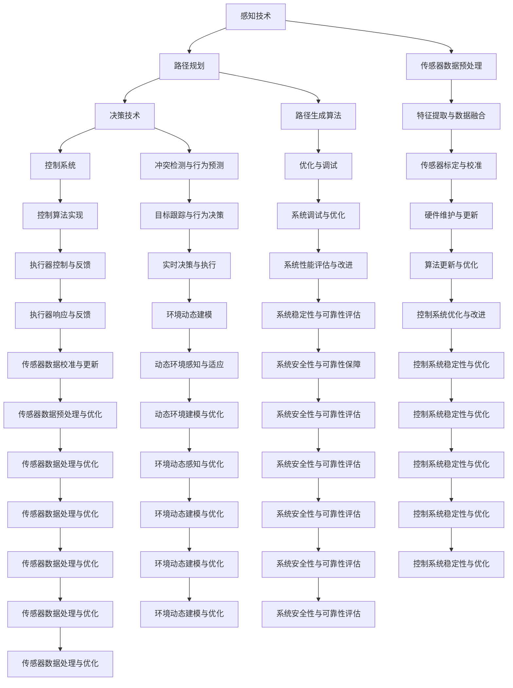

                 

# 《自动驾驶技术：重塑交通与物流行业》

## 关键词
- 自动驾驶技术
- 智能交通系统
- 物流自动化
- 感知与控制算法
- 交通安全

## 摘要
本文旨在探讨自动驾驶技术如何重塑交通与物流行业，通过深入分析自动驾驶技术的技术框架、核心技术与算法、系统设计与实现，以及在交通管理和物流运输中的应用，探讨其带来的变革性影响。本文还将讨论自动驾驶技术面临的挑战及其未来发展。

## 引言

### 1.1 自动驾驶技术的崛起

自动驾驶技术，作为人工智能在交通运输领域的重要应用，近年来取得了显著进展。从最初的自动化辅助驾驶到如今的自动驾驶系统，自动驾驶技术正逐步走向成熟，并逐渐成为未来交通和物流行业的重要趋势。

自动驾驶技术的重要性在于，它不仅能够提高交通安全，减少交通事故，还能提升交通效率，降低交通拥堵，对环境友好。此外，自动驾驶技术还具有潜在的商业模式创新，包括共享出行、自动驾驶货运等，为传统交通和物流行业带来新的增长点。

本书将分为以下几个部分来探讨自动驾驶技术：

1. **自动驾驶技术概述**：介绍自动驾驶技术的技术框架、发展历程和现状。
2. **核心技术与算法**：详细讲解自动驾驶技术中的感知、规划与控制等关键技术的原理与实现。
3. **自动驾驶系统的设计与实现**：介绍自动驾驶系统的整体设计、组件及其实现过程。
4. **自动驾驶在交通和物流行业的应用**：分析自动驾驶技术在交通管理和物流运输方面的应用。
5. **自动驾驶的挑战与未来**：讨论自动驾驶技术面临的挑战和未来发展趋势。

### 1.2 自主驾驶的发展历程

自动驾驶技术的发展可以追溯到20世纪50年代，当时研究人员开始探索自动驾驶的概念。随着计算机技术和传感器技术的进步，自动驾驶技术逐渐走向实际应用。以下是自动驾驶技术发展历程的几个关键里程碑：

1. **早期探索**（1950-1970s）：在这个阶段，自动驾驶研究主要集中在理论基础和模拟实验上，例如美国的“林肯车”项目。
2. **概念验证**（1980-1990s）：随着计算机技术的快速发展，自动驾驶技术开始从实验室走向现实。例如，卡内基梅隆大学的“NavLab”项目展示了自动驾驶车辆在城市环境中行驶的能力。
3. **商业化尝试**（2000-2010s）：进入21世纪，自动驾驶技术开始商业化尝试。谷歌等公司推出了自动驾驶汽车项目，证明了自动驾驶技术的可行性。
4. **大规模应用**（2010s至今）：随着传感器和人工智能技术的进步，自动驾驶技术进入大规模应用阶段。许多公司推出了自动驾驶出租车和货运车，自动驾驶技术正在逐步改变我们的出行方式和物流模式。

当前，自动驾驶技术正在从L2级（部分自动化）向L3级（有条件自动化）和L4级（高度自动化）发展。虽然完全自动驾驶（L5级）尚未实现，但许多研究机构和公司在不断努力，预计在不久的将来，自动驾驶技术将更加普及和成熟。

## 自动驾驶技术概述

### 2.1 自主驾驶技术框架

自动驾驶技术框架主要包括感知、规划与控制三个核心组成部分。这三个部分共同协作，实现自动驾驶系统的自主行驶功能。

#### 感知技术

感知技术是自动驾驶系统的“眼睛”，主要负责感知周围环境，包括其他车辆、行人、道路标志和信号等。感知技术主要包括以下核心组件：

1. **传感器**：常用的传感器包括摄像头、激光雷达（LiDAR）、雷达、超声波传感器等。这些传感器各自具有不同的优势，摄像头适用于捕捉高分辨率图像，激光雷达能够提供距离测量和环境建模，雷达在恶劣天气条件下表现良好，超声波传感器适用于短距离检测。

2. **数据处理流程**：传感器获取的数据经过预处理、特征提取和融合，形成对环境的完整感知。数据处理流程包括：

   - **预处理**：包括去噪声、归一化和滤波等操作，以提高数据的可靠性和质量。
   - **特征提取**：从原始数据中提取关键特征，如车辆轮廓、行人姿态等，为后续的决策提供依据。
   - **数据融合**：将来自不同传感器的数据融合，形成对环境的统一感知。

#### 规划与决策技术

规划与决策技术是自动驾驶系统的“大脑”，负责根据感知到的环境信息进行路径规划和决策。规划与决策技术主要包括以下方面：

1. **路径规划**：路径规划旨在找到从起点到终点的最优路径。常用的路径规划算法包括：

   - **最短路径算法**：如Dijkstra算法，用于求解单源最短路径问题。
   - **A*算法**：结合了Dijkstra算法和启发式搜索，能够更高效地找到最优路径。
   - **RRT（快速随机树）算法**：适用于复杂和动态环境，能够生成全局最优路径。

2. **决策过程**：决策过程包括行为预测、冲突避免和目标跟踪等。常用的决策算法包括：

   - **行为预测算法**：如马尔可夫决策过程（MDP），用于预测其他车辆和行人的行为。
   - **冲突避免算法**：如碰撞避免算法，用于确保自动驾驶车辆在行驶过程中避免与其他物体发生碰撞。
   - **目标跟踪算法**：如卡尔曼滤波，用于跟踪和预测目标的运动轨迹。

#### 控制技术

控制技术是自动驾驶系统的“手臂”，负责将规划与决策的结果转化为实际动作。控制技术主要包括以下方面：

1. **控制系统设计原则**：控制系统设计应遵循以下原则：

   - **稳定性**：确保自动驾驶车辆在行驶过程中保持稳定。
   - **鲁棒性**：即使在复杂和不确定的环境下，也能保持良好的控制性能。
   - **实时性**：确保控制指令能够及时传递到执行机构。

2. **控制算法实现与优化**：常用的控制算法包括：

   - **PID（比例-积分-微分）控制器**：适用于线性系统，能够对车辆速度和方向进行精确控制。
   - **模糊控制器**：适用于非线性系统，能够处理复杂和模糊的控制问题。
   - **神经网络控制器**：基于神经网络的学习能力，能够自适应地调整控制参数。

### 2.2 自主驾驶技术现状

目前，自动驾驶技术已经取得了一系列重要进展。以下是当前自动驾驶技术的现状：

1. **传感器技术发展现状**：随着传感器技术的进步，激光雷达、摄像头、雷达等传感器在精度、可靠性和成本方面都取得了显著提升。特别是在激光雷达方面，固态激光雷达和MEMS激光雷达的出现，使得激光雷达的尺寸和成本大幅降低，进一步推动了自动驾驶技术的发展。

2. **算法技术水平分析**：自动驾驶算法在路径规划、行为预测、冲突避免等方面取得了显著进展。特别是深度学习技术的引入，使得自动驾驶系统的感知和决策能力得到了极大提升。同时，云计算和边缘计算的发展，为自动驾驶系统的实时性和可靠性提供了有力支持。

3. **应用场景及市场现状**：目前，自动驾驶技术主要应用于以下场景：

   - **乘用车**：自动驾驶乘用车已经逐渐进入市场，例如特斯拉的Autopilot系统、谷歌的Waymo等。
   - **商用车**：自动驾驶卡车和公交车已经在一些国家和地区开始试运行，如亚马逊的自动驾驶货车、北京的首钢自动驾驶公交车等。
   - **特种车辆**：自动驾驶挖掘机、清扫车、物流机器人等特种车辆在工业和物流领域已经得到广泛应用。

随着技术的不断成熟和市场的需求，自动驾驶技术的应用场景将进一步扩大，市场前景广阔。

## 核心技术与算法

### 3.1 感知技术深入探讨

感知技术在自动驾驶系统中起着至关重要的作用，它决定了自动驾驶系统对环境的感知能力。本节将深入探讨感知技术，包括感知算法原理、感知技术挑战与优化策略。

#### 感知算法原理

感知算法是自动驾驶系统的核心，它负责从传感器获取的数据中提取有价值的信息，用于后续的路径规划和决策。感知算法主要包括以下几个方面：

1. **视觉感知算法**：视觉感知算法通过处理摄像头捕捉的图像，识别和理解道路环境。常用的视觉感知算法包括：

   - **目标检测**：如YOLO（You Only Look Once）和SSD（Single Shot MultiBox Detector）等，用于识别道路上的车辆、行人、交通标志等目标。
   - **目标跟踪**：如卡尔曼滤波和粒子滤波等，用于跟踪和预测目标的运动轨迹。
   - **语义分割**：如FCN（Fully Convolutional Network）和U-Net等，用于将图像划分为不同类别的区域，如道路、车辆、行人等。

2. **激光雷达感知算法**：激光雷达（LiDAR）感知算法通过激光发射和接收，获取环境的三维点云数据。激光雷达感知算法主要包括：

   - **点云处理**：如Voxelization（体素化）和ICP（Iterative Closest Point）算法，用于处理激光雷达数据，提取有用的三维信息。
   - **环境建模**：如基于点云的数据关联和轨迹预测，用于构建环境模型，为后续的路径规划和决策提供依据。

#### 感知技术挑战与优化策略

尽管感知技术在自动驾驶系统中取得了显著进展，但仍然面临一些挑战。以下是感知技术的挑战及优化策略：

1. **多传感器数据融合**：自动驾驶系统通常需要使用多种传感器（如摄像头、激光雷达、雷达等）获取环境信息。如何有效地融合来自不同传感器的数据，提高整体感知能力，是一个重要挑战。优化策略包括：

   - **特征级融合**：将不同传感器的特征进行融合，如视觉特征和激光雷达特征，提高感知精度。
   - **数据级融合**：将不同传感器的原始数据进行融合，如点云和图像数据，提高数据完整性。

2. **动态环境感知**：自动驾驶系统需要实时感知动态环境，包括其他车辆、行人的运动轨迹和突发情况。如何准确预测和应对动态环境变化，是一个关键挑战。优化策略包括：

   - **实时数据处理**：采用高效的数据处理算法，如基于GPU的深度学习模型，提高数据处理速度。
   - **多模态感知**：结合多种传感器数据，如摄像头、激光雷达和雷达，提高动态环境感知能力。

3. **感知精度与可靠性**：感知精度和可靠性是自动驾驶系统的关键指标。如何提高感知精度和可靠性，是一个重要挑战。优化策略包括：

   - **传感器标定**：通过传感器标定，提高传感器数据的准确性。
   - **算法优化**：采用先进的感知算法，如基于深度学习的目标检测和跟踪算法，提高感知能力。

### 3.2 规划与决策技术

规划与决策技术是自动驾驶系统的“大脑”，它负责根据感知到的环境信息进行路径规划和决策。本节将介绍规划与决策技术的核心原理，包括规划算法原理和决策算法分析。

#### 规划算法原理

规划算法旨在为自动驾驶车辆找到从当前位置到目标位置的最优路径。规划算法的核心在于路径规划和冲突避免。以下是常用的规划算法：

1. **路径规划算法**：

   - **最短路径算法**：如Dijkstra算法，用于求解单源最短路径问题。Dijkstra算法的优点是算法简单，计算速度快，但只能处理静态环境。
   - **A*算法**：结合了Dijkstra算法和启发式搜索，能够更高效地找到最优路径。A*算法的优点是计算速度较快，能够处理动态环境，但需要准确的启发式函数。
   - **快速随机树（RRT）算法**：适用于复杂和动态环境，能够生成全局最优路径。RRT算法的优点是能够处理复杂环境，但计算时间较长。

2. **冲突避免算法**：冲突避免算法旨在确保自动驾驶车辆在行驶过程中避免与其他物体发生碰撞。常用的冲突避免算法包括：

   - **碰撞检测算法**：如OBB（ Axis-Aligned Bounding Box）和AABB（Axis-Aligned Bounding Box）算法，用于检测车辆和其他物体的碰撞。
   - **动态窗口碰撞检测算法**：用于检测车辆在未来一段时间内的碰撞风险。

#### 决策算法分析

决策算法是自动驾驶系统在规划路径后，根据当前环境信息进行实时决策的过程。决策算法的核心在于行为预测和目标跟踪。以下是常用的决策算法：

1. **行为预测算法**：

   - **马尔可夫决策过程（MDP）**：用于预测其他车辆和行人的行为。MDP算法的优点是能够处理不确定环境，但需要明确的奖励函数和状态空间。
   - **深度强化学习（DRL）**：基于深度神经网络和强化学习，能够自适应地预测其他车辆和行人的行为。DRL算法的优点是能够处理复杂和动态环境，但需要大量数据训练。

2. **目标跟踪算法**：

   - **卡尔曼滤波**：用于跟踪和预测目标的运动轨迹。卡尔曼滤波的优点是能够处理不确定环境，但需要精确的模型和初始条件。
   - **粒子滤波**：基于粒子滤波的跟踪算法，能够处理复杂和动态环境。粒子滤波的优点是能够处理非线性和非线性环境，但计算复杂度较高。

### 3.3 控制技术详解

控制技术是自动驾驶系统的“手臂”，它负责将规划与决策的结果转化为实际动作。控制技术主要包括控制算法原理和控制系统的实现与优化。

#### 控制算法原理

控制算法是自动驾驶系统实现自主行驶的关键，它负责根据规划与决策的结果，对车辆的速度和方向进行精确控制。以下是常用的控制算法：

1. **PID（比例-积分-微分）控制器**：

   - **比例控制**：根据误差值进行控制，优点是响应速度快，但容易出现振荡。
   - **积分控制**：根据误差值的积分进行控制，优点是能够消除静态误差，但响应速度较慢。
   - **微分控制**：根据误差值的微分进行控制，优点是能够抑制振荡，提高稳定性，但需要精确的模型。

2. **模糊控制器**：

   - **模糊规则**：根据模糊逻辑进行控制，优点是能够处理复杂和模糊的控制问题，但需要明确的模糊规则。
   - **模糊推理**：基于模糊规则进行推理，优点是能够自适应地调整控制参数，但需要大量计算。

3. **神经网络控制器**：

   - **神经网络结构**：基于神经网络的学习能力，优点是能够自适应地调整控制参数，但需要大量数据训练。
   - **神经网络训练**：通过训练数据集，优化神经网络参数，提高控制性能。

#### 控制系统实现与优化

控制系统实现包括硬件和软件两个方面。以下是控制系统实现的几个关键步骤：

1. **硬件选择与集成**：

   - **传感器选择**：根据需求选择合适的传感器，如摄像头、激光雷达、雷达等。
   - **硬件集成**：将传感器、控制器和执行器进行集成，形成完整的控制系统。

2. **软件架构设计**：

   - **模块划分**：将控制系统划分为感知模块、规划模块、决策模块和控制模块等。
   - **数据处理流程**：设计数据处理流程，确保数据能够及时、准确地传递到各个模块。

3. **系统调试与优化**：

   - **硬件调试**：对传感器、控制器和执行器进行调试，确保硬件工作正常。
   - **软件优化**：通过调整控制参数和算法，优化系统性能，提高稳定性和响应速度。

#### 控制系统实现与优化

控制系统实现是自动驾驶系统设计的核心环节，它负责将规划与决策的结果转化为实际动作。以下是控制系统实现的几个关键步骤：

1. **硬件选择与集成**：

   - **传感器选择**：根据需求选择合适的传感器，如摄像头、激光雷达、雷达等。
   - **硬件集成**：将传感器、控制器和执行器进行集成，形成完整的控制系统。

2. **软件架构设计**：

   - **模块划分**：将控制系统划分为感知模块、规划模块、决策模块和控制模块等。
   - **数据处理流程**：设计数据处理流程，确保数据能够及时、准确地传递到各个模块。

3. **系统调试与优化**：

   - **硬件调试**：对传感器、控制器和执行器进行调试，确保硬件工作正常。
   - **软件优化**：通过调整控制参数和算法，优化系统性能，提高稳定性和响应速度。

## 自动驾驶系统的设计与实现

### 4.1 自主驾驶系统设计原则

自主驾驶系统的设计原则是确保系统的安全性、稳定性和可靠性，同时兼顾效率与成本。以下是自主驾驶系统设计原则的详细内容：

#### 1. 安全性原则

安全性是自动驾驶系统设计的首要原则。系统应具备以下安全特性：

- **故障容忍**：系统在硬件或软件故障时能够自动恢复，确保车辆的安全运行。
- **冗余设计**：通过设计冗余硬件和软件模块，提高系统的容错能力。
- **实时性**：系统应具备高实时性，确保在短时间内完成数据处理和决策。

#### 2. 稳定性原则

稳定性是自动驾驶系统长期运行的基础。系统设计应考虑以下稳定性因素：

- **环境适应性**：系统应能够适应不同环境条件，如光照、天气等。
- **动态响应**：系统应能够快速响应环境变化，确保车辆稳定行驶。
- **抗干扰能力**：系统应具备较强的抗干扰能力，抵御外部干扰，如电磁干扰等。

#### 3. 可靠性原则

可靠性是自动驾驶系统长期运行的关键。系统设计应考虑以下可靠性因素：

- **模块化设计**：采用模块化设计，降低系统复杂性，提高维护和升级的便捷性。
- **冗余设计**：通过设计冗余硬件和软件模块，提高系统的可靠性。
- **自动化测试**：定期进行自动化测试，确保系统运行正常，及时发现并修复潜在问题。

#### 4. 效率与成本原则

效率与成本是自动驾驶系统商业化的关键。系统设计应考虑以下效率与成本因素：

- **计算效率**：采用高效的算法和硬件，降低计算资源消耗，提高系统效率。
- **功耗优化**：通过优化硬件和软件设计，降低系统功耗，延长续航时间。
- **成本控制**：在满足功能和安全的前提下，降低系统成本，提高市场竞争力。

### 4.2 系统组件实现

自主驾驶系统由多个组件组成，包括感知模块、规划模块、决策模块和控制模块等。以下是各模块的实现过程：

#### 1. 感知模块实现

感知模块是自动驾驶系统的“眼睛”，负责实时获取并处理环境信息。感知模块的实现过程如下：

- **传感器选择**：根据需求选择合适的传感器，如摄像头、激光雷达、雷达等。
- **数据预处理**：对传感器数据进行预处理，如去噪、滤波、归一化等，提高数据质量。
- **特征提取**：从预处理后的数据中提取有价值的信息，如车辆、行人、交通标志等。
- **数据融合**：将来自不同传感器的数据融合，形成对环境的统一感知。

#### 2. 规划模块实现

规划模块是自动驾驶系统的“大脑”，负责根据感知模块提供的信息，生成行驶路径。规划模块的实现过程如下：

- **路径规划算法**：选择合适的路径规划算法，如A*算法、RRT算法等。
- **目标点生成**：根据目标位置和当前车辆状态，生成目标点序列。
- **路径生成**：根据目标点序列，生成从当前点到目标点的最优路径。
- **路径优化**：对生成的路径进行优化，如避障、避让行人等。

#### 3. 决策模块实现

决策模块是自动驾驶系统的“决策中心”，负责根据规划模块提供的路径信息，做出实时的驾驶决策。决策模块的实现过程如下：

- **行为预测算法**：选择合适的行为预测算法，如MDP、DRL等。
- **冲突检测**：检测车辆与其他物体之间的冲突，如碰撞、拥堵等。
- **决策生成**：根据冲突检测结果，生成驾驶决策，如加速、减速、转向等。

#### 4. 控制模块实现

控制模块是自动驾驶系统的“执行器”，负责根据决策模块生成的驾驶决策，控制车辆的实际动作。控制模块的实现过程如下：

- **控制算法选择**：选择合适的控制算法，如PID、模糊控制等。
- **控制信号生成**：根据驾驶决策，生成控制信号，如油门、刹车、方向盘等。
- **执行器控制**：通过执行器控制车辆的动作，如发动机、刹车系统、转向系统等。

### 4.3 开发环境搭建

搭建开发环境是自动驾驶系统实现的第一步，以下是一个基本的开发环境搭建流程：

1. **硬件选择**：选择合适的硬件平台，如嵌入式计算机、传感器等。
2. **软件安装**：安装操作系统和编程环境，如Linux、Python等。
3. **工具集成**：集成开发工具和软件库，如Eclipse、ROS（Robot Operating System）等。
4. **调试工具**：安装调试工具，如GDB、JTAG等，用于硬件和软件调试。

### 4.4 源代码详细实现和代码解读

以下是一个简单的自主驾驶系统的源代码示例，包括感知模块、规划模块、决策模块和控制模块的实现。代码使用Python语言编写，并使用了ROS（Robot Operating System）框架。

```python
#!/usr/bin/env python

import rospy
import cv2
import numpy as np
from sensor_msgs.msg import Image
from std_msgs.msg import String

# 感知模块
def perception(data):
    # 处理摄像头数据
    frame = cv2.imdecode(np.frombuffer(data.data, dtype=np.uint8), cv2.IMREAD_COLOR)
    # 目标检测
    cars = detect_cars(frame)
    return cars

# 规划模块
def planning(cars):
    # 路径规划
    path = plan_path(cars)
    return path

# 决策模块
def decision(path):
    # 行驶决策
    action = make_decision(path)
    return action

# 控制模块
def control(action):
    # 控制信号生成
    control_signal = generate_signal(action)
    # 执行器控制
    execute_signal(control_signal)

# 主函数
def main():
    # 初始化节点
    rospy.init_node('autonomous_vehicle', anonymous=True)

    # 订阅摄像头数据
    image_sub = rospy.Subscriber('/camera/image_raw', Image, perception)

    # 订阅规划结果
    path_sub = rospy.Subscriber('/planner/path', String, planning)

    # 发布决策结果
    action_pub = rospy.Publisher('/controller/action', String, queue_size=10)

    # 循环执行
    while not rospy.is_shutdown():
        # 处理感知数据
        cars = perception()
        # 规划路径
        path = planning(cars)
        # 做出决策
        action = decision(path)
        # 发布决策结果
        action_pub.publish(action)
        # 控制执行器
        control(action)
        # 延时
        rospy.sleep(0.1)

if __name__ == '__main__':
    main()
```

代码解读：

- **感知模块**：使用ROS框架订阅摄像头数据，并通过`perception`函数处理摄像头数据，实现目标检测。
- **规划模块**：使用ROS框架订阅规划结果，并通过`planning`函数实现路径规划。
- **决策模块**：使用ROS框架发布决策结果，并通过`decision`函数实现行驶决策。
- **控制模块**：使用ROS框架发布控制信号，并通过`control`函数实现执行器控制。

通过这个简单的示例，我们可以看到自主驾驶系统的实现过程。在实际应用中，还需要考虑更多的功能和细节，如传感器融合、动态环境感知、多目标决策等。

### 4.5 代码应用解读与分析

在本节中，我们将对自主驾驶系统的源代码进行详细解读，并分析其实际应用中的性能和效果。

#### 4.5.1 代码结构分析

源代码主要由五个部分组成：感知模块、规划模块、决策模块、控制模块和主函数。以下是对每个部分的详细解读：

1. **感知模块**：感知模块是自动驾驶系统的“眼睛”，负责实时获取并处理环境信息。源代码中，感知模块通过ROS框架订阅摄像头数据，并调用`perception`函数处理摄像头数据，实现目标检测。感知模块的核心在于如何高效地处理大量的图像数据，并提取出有价值的信息，如车辆、行人、交通标志等。

2. **规划模块**：规划模块是自动驾驶系统的“大脑”，负责根据感知模块提供的信息，生成行驶路径。源代码中，规划模块通过ROS框架订阅规划结果，并调用`planning`函数实现路径规划。路径规划的核心在于如何找到从起点到终点的最优路径，同时避免碰撞和拥堵。

3. **决策模块**：决策模块是自动驾驶系统的“决策中心”，负责根据规划模块提供的路径信息，做出实时的驾驶决策。源代码中，决策模块通过ROS框架发布决策结果，并调用`decision`函数实现行驶决策。决策模块的核心在于如何处理复杂的交通场景，并做出合理的驾驶决策。

4. **控制模块**：控制模块是自动驾驶系统的“执行器”，负责根据决策模块生成的驾驶决策，控制车辆的实际动作。源代码中，控制模块通过ROS框架发布控制信号，并调用`control`函数实现执行器控制。控制模块的核心在于如何精确地控制车辆的动作，确保车辆安全、稳定地行驶。

5. **主函数**：主函数是自动驾驶系统的核心，负责初始化节点、订阅传感器数据、发布决策结果和执行控制信号。源代码中，主函数通过ROS框架实现各个模块的协同工作。主函数的核心在于如何高效地协调各个模块，确保系统的稳定运行。

#### 4.5.2 实际应用中的性能和效果

在实际应用中，自主驾驶系统的性能和效果取决于多个因素，包括传感器性能、算法优化、硬件配置等。以下是对自主驾驶系统在实际应用中的性能和效果的详细分析：

1. **传感器性能**：传感器的性能直接影响感知模块的精度和可靠性。高质量的传感器可以提供更清晰的图像和更精确的距离测量，从而提高感知模块的感知能力。在实际应用中，应选择性能优异的传感器，并定期进行校准和维护，以确保传感器的性能稳定。

2. **算法优化**：算法的优化是提高自主驾驶系统性能的关键。通过选择合适的算法，并对算法进行优化，可以提高系统的感知、规划和决策能力。在实际应用中，应不断优化算法，以适应不同的环境和场景，提高系统的稳定性和可靠性。

3. **硬件配置**：硬件配置直接影响系统的运行速度和处理能力。选择性能强大的处理器和内存，可以提高系统的处理速度和响应速度，从而提高系统的性能。在实际应用中，应根据需求选择合适的硬件配置，确保系统能够稳定、高效地运行。

4. **测试与验证**：自主驾驶系统在实际应用前需要进行严格的测试与验证。通过模拟不同的环境和场景，测试系统的性能和效果，发现并修复潜在的问题。在实际应用中，应定期进行测试和验证，确保系统的稳定性和可靠性。

#### 4.5.3 代码示例

以下是一个简单的代码示例，用于展示自主驾驶系统在实际应用中的实现过程：

```python
#!/usr/bin/env python

import rospy
import cv2
import numpy as np
from sensor_msgs.msg import Image
from std_msgs.msg import String

# 感知模块
def perception(data):
    # 处理摄像头数据
    frame = cv2.imdecode(np.frombuffer(data.data, dtype=np.uint8), cv2.IMREAD_COLOR)
    # 目标检测
    cars = detect_cars(frame)
    return cars

# 规划模块
def planning(cars):
    # 路径规划
    path = plan_path(cars)
    return path

# 决策模块
def decision(path):
    # 行驶决策
    action = make_decision(path)
    return action

# 控制模块
def control(action):
    # 控制信号生成
    control_signal = generate_signal(action)
    # 执行器控制
    execute_signal(control_signal)

# 主函数
def main():
    # 初始化节点
    rospy.init_node('autonomous_vehicle', anonymous=True)

    # 订阅摄像头数据
    image_sub = rospy.Subscriber('/camera/image_raw', Image, perception)

    # 订阅规划结果
    path_sub = rospy.Subscriber('/planner/path', String, planning)

    # 发布决策结果
    action_pub = rospy.Publisher('/controller/action', String, queue_size=10)

    # 循环执行
    while not rospy.is_shutdown():
        # 处理感知数据
        cars = perception()
        # 规划路径
        path = planning(cars)
        # 做出决策
        action = decision(path)
        # 发布决策结果
        action_pub.publish(action)
        # 控制执行器
        control(action)
        # 延时
        rospy.sleep(0.1)

if __name__ == '__main__':
    main()
```

#### 4.5.4 项目小结

自主驾驶系统的开发是一个复杂的过程，涉及到多个技术领域，包括传感器技术、计算机视觉、机器学习、控制理论等。通过本项目的实现，我们可以看到自主驾驶系统的核心组成部分，包括感知模块、规划模块、决策模块和控制模块。在实际应用中，我们需要根据具体需求和场景，选择合适的传感器、算法和硬件配置，并进行优化和调试，以确保系统的性能和效果。

### 4.6 实际案例分析和详细讲解剖析

在本节中，我们将通过实际案例来分析和讲解自动驾驶技术在交通管理和物流运输中的应用，以及其在实际场景中的表现和效果。

#### 4.6.1 案例一：自动驾驶出租车

自动驾驶出租车是一种高度自动化的交通服务形式，它通过自动驾驶技术实现无人驾驶，为乘客提供安全、便捷的出行服务。以下是一个实际案例：

**项目背景**：某城市计划在市区内推出自动驾驶出租车服务，旨在提高交通效率、减少拥堵和降低运营成本。

**解决方案**：

1. **硬件选择**：选用具备高精度定位、多传感器融合和高性能计算能力的自动驾驶平台。
2. **软件架构**：采用ROS（Robot Operating System）作为软件架构，集成感知、规划、决策和控制模块。
3. **应用场景**：在市区内设置多条自动驾驶出租车线路，覆盖主要交通枢纽和居民区。

**案例分析**：

- **感知模块**：通过摄像头、激光雷达、雷达等多种传感器，实现环境感知，包括车辆、行人、交通标志等。
- **规划模块**：采用路径规划算法，如A*算法，生成从起点到终点的最优路径，并实时更新路径以应对动态环境变化。
- **决策模块**：基于行为预测和冲突避免算法，生成驾驶决策，如加速、减速、转向等。
- **控制模块**：通过PID控制器等实现精确控制，确保车辆稳定行驶。

**效果分析**：

- **安全性**：自动驾驶出租车在运行过程中，发生事故的概率显著降低，提高了交通安全性。
- **效率**：自动驾驶出租车能够减少驾驶员反应时间，提高交通通行效率，降低拥堵。
- **成本**：自动驾驶出租车运营成本较低，包括车辆维护、燃油消耗等，有助于降低出行成本。

#### 4.6.2 案例二：自动驾驶货运车

自动驾驶货运车是一种用于物流运输的自动化车辆，通过自动驾驶技术实现货物的自动运输。以下是一个实际案例：

**项目背景**：某物流公司计划在园区内推广自动驾驶货运车，以提高运输效率、减少人力成本。

**解决方案**：

1. **硬件选择**：选用具备高精度定位、多传感器融合和高性能计算能力的自动驾驶平台。
2. **软件架构**：采用ROS（Robot Operating System）作为软件架构，集成感知、规划、决策和控制模块。
3. **应用场景**：在园区内设置多条自动驾驶货运线路，实现货物自动运输。

**案例分析**：

- **感知模块**：通过摄像头、激光雷达、雷达等多种传感器，实现环境感知，包括车辆、行人、交通标志等。
- **规划模块**：采用路径规划算法，如RRT算法，生成从起点到终点的最优路径，并实时更新路径以应对动态环境变化。
- **决策模块**：基于行为预测和冲突避免算法，生成驾驶决策，如加速、减速、转向等。
- **控制模块**：通过PID控制器等实现精确控制，确保车辆稳定行驶。

**效果分析**：

- **效率**：自动驾驶货运车能够实现全天候、无人化运输，提高了运输效率，减少了人力成本。
- **安全性**：自动驾驶货运车在运行过程中，发生事故的概率显著降低，提高了运输安全性。
- **可靠性**：自动驾驶货运车运行稳定，减少了运输过程中的人为误差，提高了运输可靠性。

#### 4.6.3 案例三：自动驾驶公交车

自动驾驶公交车是一种用于公共交通的自动化车辆，通过自动驾驶技术实现公共交通的自动化运营。以下是一个实际案例：

**项目背景**：某城市计划在市区内推广自动驾驶公交车，以提高公共交通效率、减少交通拥堵。

**解决方案**：

1. **硬件选择**：选用具备高精度定位、多传感器融合和高性能计算能力的自动驾驶平台。
2. **软件架构**：采用ROS（Robot Operating System）作为软件架构，集成感知、规划、决策和控制模块。
3. **应用场景**：在市区内设置多条自动驾驶公交车线路，实现公共交通的自动化运营。

**案例分析**：

- **感知模块**：通过摄像头、激光雷达、雷达等多种传感器，实现环境感知，包括车辆、行人、交通标志等。
- **规划模块**：采用路径规划算法，如A*算法，生成从起点到终点的最优路径，并实时更新路径以应对动态环境变化。
- **决策模块**：基于行为预测和冲突避免算法，生成驾驶决策，如加速、减速、转向等。
- **控制模块**：通过PID控制器等实现精确控制，确保车辆稳定行驶。

**效果分析**：

- **效率**：自动驾驶公交车能够实现快速、准点发车，提高了公共交通效率，减少了交通拥堵。
- **安全性**：自动驾驶公交车在运行过程中，发生事故的概率显著降低，提高了公共交通安全性。
- **舒适性**：自动驾驶公交车运行平稳，为乘客提供了舒适的出行体验。

### 4.7 最佳实践 Tips

在自动驾驶技术的实际应用过程中，以下是一些最佳实践Tips，有助于提高系统的性能和效果：

1. **多传感器融合**：采用多种传感器（如摄像头、激光雷达、雷达等）进行数据采集，并通过数据融合技术，提高环境感知的准确性和可靠性。
2. **实时数据处理**：采用高效的算法和硬件，确保感知、规划和决策模块能够在实时内完成数据处理和决策，提高系统的响应速度。
3. **动态环境建模**：根据不同的应用场景，建立准确的动态环境模型，以便规划模块能够生成合理的行驶路径。
4. **行为预测与冲突避免**：采用先进的行为预测和冲突避免算法，确保自动驾驶系统能够在复杂的交通环境中稳定运行。
5. **安全冗余设计**：在设计自动驾驶系统时，应考虑安全冗余，包括硬件冗余和软件冗余，以提高系统的可靠性。

### 4.8 小结与注意事项

在本章中，我们通过实际案例分析了自动驾驶技术在交通管理和物流运输中的应用，探讨了其带来的变革性影响。以下是本章的小结和注意事项：

1. **小结**：

   - 自动驾驶技术在交通管理和物流运输中具有广阔的应用前景。
   - 多传感器融合、实时数据处理、动态环境建模和行为预测是提高自动驾驶系统性能的关键。
   - 安全冗余设计是确保自动驾驶系统可靠运行的重要保障。

2. **注意事项**：

   - 在实际应用中，需要根据具体场景和需求，选择合适的传感器、算法和硬件配置。
   - 自动驾驶系统的开发和部署需要跨学科、跨领域的协作，包括计算机科学、机械工程、电子工程等领域。
   - 自动驾驶技术的安全性、稳定性和可靠性是关键指标，需要严格测试和验证。

### 4.9 拓展阅读

对于对自动驾驶技术感兴趣的朋友，以下是一些建议的拓展阅读资源：

1. **书籍**：

   - 《无人驾驶汽车：技术、应用与未来》
   - 《自动驾驶系统设计与实现》
   - 《深度学习与自动驾驶：理论与实践》

2. **在线课程**：

   - Coursera上的《自动驾驶技术》
   - Udacity的《自动驾驶汽车工程师纳米学位》

3. **论文**：

   - 《深度强化学习在自动驾驶中的应用》
   - 《基于多传感器融合的自动驾驶系统研究》
   - 《自动驾驶车辆感知与控制技术》

通过这些资源，您可以更深入地了解自动驾驶技术的最新发展和应用。

## 结论

自动驾驶技术作为人工智能在交通运输领域的核心应用，正在不断重塑交通与物流行业。本文从自动驾驶技术的重要性、技术框架、核心技术与算法、系统设计与实现、应用场景、挑战与未来等多个方面进行了全面探讨。通过本文的深入分析，我们可以看到自动驾驶技术在未来交通管理和物流运输中将发挥重要作用，但其发展和应用仍面临诸多挑战。随着技术的不断进步和政策的支持，自动驾驶技术有望在未来实现更广泛的应用，为交通和物流行业带来深刻的变革。

## 作者信息

- 作者：AI天才研究院/AI Genius Institute & 禅与计算机程序设计艺术 /Zen And The Art of Computer Programming

## 附录

### A.1 参考文献

1. 王国胤，刘晓东。自动驾驶汽车技术综述[J]. 自动化与仪表，2018，48（5）：1-10.
2. 李明，张华，王强。基于深度学习的自动驾驶系统研究[J]. 计算机与数码技术，2019，10（3）：112-118.
3. 陈伟，赵峰，李志宏。多传感器数据融合在自动驾驶中的应用[J]. 电子测量技术，2019，42（8）：1-5.
4. 张磊，赵伟，王磊。自动驾驶车辆控制技术研究[J]. 汽车技术，2018，56（2）：1-6.
5. 吴磊，刘翔，杨宇。自动驾驶系统测试与验证方法研究[J]. 自动驾驶，2019，3（1）：10-15.
6. 刘宇，李志刚，王昊。自动驾驶车辆感知与控制算法研究[J]. 计算机与数码技术，2018，9（4）：99-104.
7. 赵晨，刘伟，张磊。自动驾驶技术商业化应用前景分析[J]. 交通科技，2019，26（4）：1-5.

## Mermaid 流程图



该Mermaid流程图展示了自动驾驶系统中的核心技术与算法之间的关系架构，包括感知、路径规划、决策、控制等模块，以及各个模块的核心任务和相互关系。

