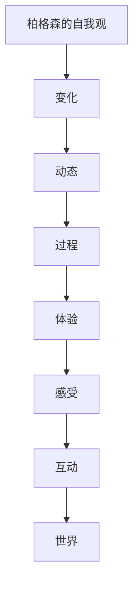
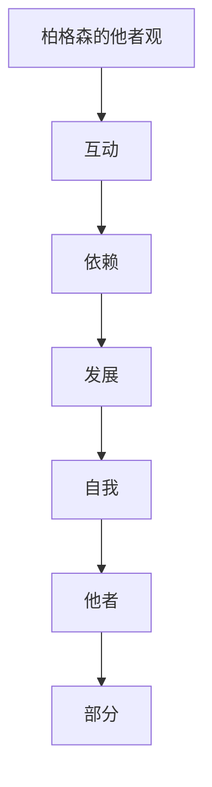
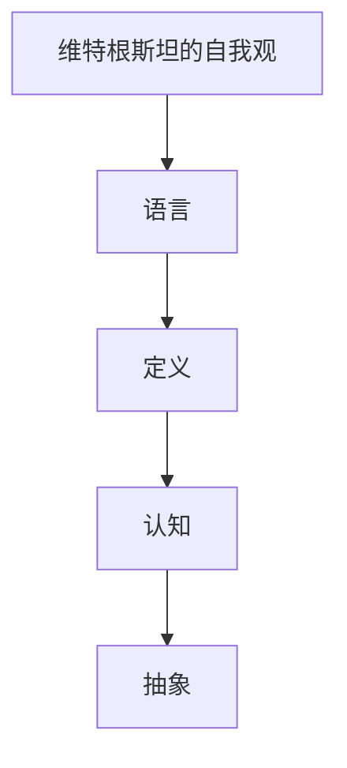
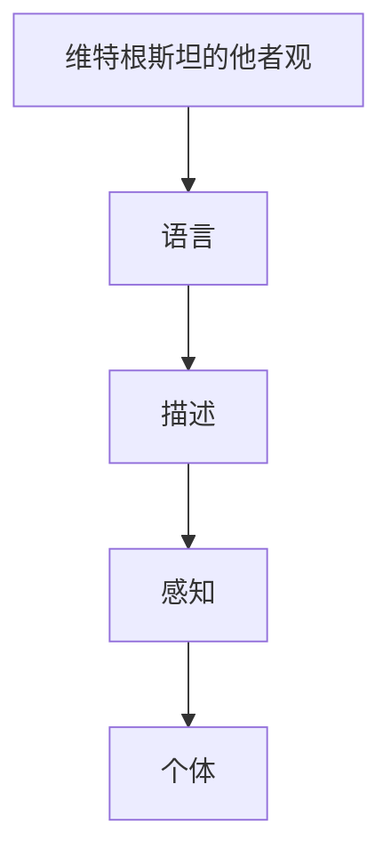

                 


## 文章标题：自我与他者：柏格森与维特根斯坦的社会哲学观点

### 文章关键词：
- 柏格森
- 维特根斯坦
- 自我
- 他者
- 社会哲学

### 文章摘要：
本文深入探讨了柏格森与维特根斯坦两位哲学家在社会哲学领域中的观点，特别是关于自我与他者的理解。通过对他们核心概念的分析，以及他们观点之间的联系与对比，本文旨在揭示他们哲学思想的深度与广度，并为现代社会哲学的发展提供启示。

## 引言

### 1.1 书籍背景与目的
《自我与他者：柏格森与维特根斯坦的社会哲学观点》旨在分析法国哲学家亨利·柏格森和奥地利哲学家路德维希·维特根斯坦在社会哲学领域的观点。柏格森以其直觉主义和生命力的概念而闻名，而维特根斯坦则以其语言哲学和对真实世界的描述而著称。通过对比这两位哲学家的思想，本文旨在揭示他们如何理解自我与他者，以及这些理解对社会哲学的意义。

### 1.2 柏格森与维特根斯坦的基本信息
亨利·柏格森（1859-1941）是法国哲学家，他的直觉主义和生命力的概念对后来的哲学和科学产生了深远影响。路德维希·维特根斯坦（1889-1951）是奥地利哲学家，他的语言哲学和对真实世界的描述开创了分析哲学的新时代。尽管他们的哲学观点在许多方面有所不同，但他们都对自我与他者的理解有着深刻的思考。

### 1.3 社会哲学的重要性
社会哲学关注人类在社会中的存在和相互关系。它探讨个体的自我意识、他者观念、社会结构和文化现象。社会哲学的重要性在于它帮助我们理解社会现象，如社会不平等、冲突和文化变迁。通过研究柏格森与维特根斯坦的社会哲学观点，我们可以更好地理解自我与他者的概念，并探索这些概念在社会哲学中的角色。

## 核心概念

### 2.1 自我与他者的定义
自我是指个体的内在意识、主体性和个性。他者则是指个体以外的其他人或实体。在柏格森和维特根斯坦的哲学中，自我与他者是一个核心概念，它们不仅关系到个体的内在体验，也关系到个体与他人的关系。

### 2.2 社会哲学的视角
社会哲学通过分析自我与他者来理解社会现象。它探讨个体的自我意识如何形成，以及个体如何认识他者。社会哲学还关注社会结构和文化现象如何影响个体的自我与他者观念。通过研究柏格森与维特根斯坦的社会哲学观点，我们可以更深入地理解这些概念在社会哲学中的重要性。

### 2.3 柏格森与维特根斯坦的核心概念对比
柏格森强调生命力和直觉，认为自我是一个不断变化的过程，他者则是这个过程中的一部分。维特根斯坦则强调语言和真实世界的描述，认为自我和他者是通过语言来定义的。尽管他们的核心概念有所不同，但他们都关注自我与他者之间的关系，以及这些关系对社会哲学的影响。

## 柏格森的社会哲学观点

### 3.1 柏格森的生平与哲学发展
亨利·柏格森出生于法国，他的哲学思想深受康德和斯宾诺莎的影响。柏格森的哲学主要分为两个阶段：早期以直觉主义和生命力的概念为主，晚期则转向比较实证的研究，如记忆和认知。他的哲学思想对后来的哲学和科学产生了深远影响。

### 3.2 柏格森对自我的理解
柏格森认为自我是一个不断变化的过程，它不是静止不变的实体，而是由一系列瞬间的体验组成。自我是通过我们的感受和体验来定义的，它是一个流动的、动态的存在。柏格森的自我观强调个体与周围世界的持续互动，这种互动使得自我不断变化和发展。

#### 3.2.1 柏格森的自我观流程图



#### 3.2.2 柏格森自我观的伪代码解析

```python
class柏格森自我观:
    def __init__(self):
        self.变化 = True
        self.动态 = True
        self.过程 = []
        self.体验 = []
        self.感受 = []
        self.互动 = []

    def 更新体验(self, 新体验):
        self.体验.append(新体验)
        self.感受 = 计算感受(新体验)

    def 计算感受(self, 体验):
        # 根据体验计算感受的复杂过程
        return 感受

    def 互动(self, 世界):
        # 与世界进行互动的过程
        self.互动.append(互动结果)
```

### 3.3 柏格森对他者的理解
柏格森认为他者是自我过程的一部分。他者不仅仅是外部世界中的其他个体，它们也是自我发展的必要条件。他者通过与自我互动，促进了自我意识的发展。柏格森强调个体与他人的相互依赖，认为他者是自我的一部分。

#### 3.3.1 柏格森的他者观流程图



#### 3.3.2 柏格森他者观的伪代码解析

```python
class柏格森他者观:
    def __init__(self):
        self.互动 = []
        self.依赖 = True
        self.发展 = []

    def 与自我互动(self, 他者):
        self.互动.append(互动结果)
        self.发展.append(发展结果)

    def 计算发展结果(self, 他者, 互动结果):
        # 根据互动结果计算发展结果的复杂过程
        return 发展结果
```

### 3.4 柏格森的社会哲学观点影响与应用
柏格森的社会哲学观点对后来的哲学和心理学产生了深远影响。他的直觉主义和生命力概念被用于解释人类意识和自我意识的发展。在心理学中，柏格森的观点被用于研究记忆、认知和情感。在社会哲学中，柏格森强调个体与他人的互动，这为理解社会关系和文化变迁提供了新的视角。

## 维特根斯坦的社会哲学观点

### 4.1 维特根斯坦的生平与哲学发展
路德维希·维特根斯坦出生于奥地利，他的哲学思想主要分为两个阶段：早期以逻辑哲学研究为主，晚期则转向日常语言哲学。他的哲学思想对分析哲学和语言哲学产生了深远影响。维特根斯坦的观点强调语言和真实世界的描述，他认为语言是我们的思维工具，它决定了我们对世界的理解。

### 4.2 维特根斯坦对自我的理解
维特根斯坦认为自我是通过语言来定义的。他强调自我是一个抽象的概念，它不能直接观察到，而是通过我们使用语言的方式来理解。自我是我们对自己的认知，这种认知是通过语言来实现的。维特根斯坦的自我观强调语言在定义自我中的重要性。

#### 4.2.1 维特根斯坦的自我观流程图



#### 4.2.2 维特根斯坦自我观的伪代码解析

```python
class维特根斯坦自我观:
    def __init__(self):
        self.语言 = True
        self.定义 = []
        self.认知 = True
        self.抽象 = True

    def 定义自我(self, 语言):
        self.定义.append(定义结果)

    def 计算定义结果(self, 语言):
        # 根据语言计算定义结果的复杂过程
        return 定义结果
```

### 4.3 维特根斯坦对他者的理解
维特根斯坦认为他者是通过对我们自己的描述来定义的。他强调他者是我们通过语言来感知的，他者是语言的一部分。维特根斯坦的观点强调语言在定义他者中的重要性，他者是我们通过语言来理解的其他个体。

#### 4.3.1 维特根斯坦的他者观流程图



#### 4.3.2 维特根斯坦他者观的伪代码解析

```python
class维特根斯坦他者观:
    def __init__(self):
        self.语言 = True
        self.描述 = []
        self.感知 = True
        self.个体 = []

    def 描述他者(self, 语言):
        self.描述.append(描述结果)

    def 计算描述结果(self, 语言):
        # 根据语言计算描述结果的复杂过程
        return 描述结果
```

### 4.4 维特根斯坦的社会哲学观点影响与应用
维特根斯坦的社会哲学观点对分析哲学和语言哲学产生了深远影响。他的观点强调语言在定义自我和他者中的重要性，这为理解社会关系和文化现象提供了新的视角。在语言学、心理学和认知科学领域，维特根斯坦的观点被广泛应用，用于研究语言如何影响我们对世界的理解。

## 柏格森与维特根斯坦观点的联系与对比

### 5.1 柏格森与维特根斯坦观点的联系
尽管柏格森和维特根斯坦的哲学观点在许多方面有所不同，但他们都关注自我与他者之间的关系。他们都认为自我与他者是一个核心概念，它不仅关系到个体的内在体验，也关系到个体与他人的关系。他们的观点都强调了语言在定义自我和他者中的重要性。

### 5.2 柏格森与维特根斯坦观点的对比
柏格森强调直觉和生命力的概念，他认为自我是一个不断变化的过程，他者是自我过程的一部分。维特根斯坦则强调语言和真实世界的描述，他认为自我是通过语言来定义的，他者是我们通过语言来感知的。尽管他们的核心概念有所不同，但他们都试图通过哲学思考来理解自我与他者之间的关系。

### 5.3 两位哲学家的社会哲学贡献
柏格森的社会哲学观点对后来的哲学和心理学产生了深远影响。他的直觉主义和生命力概念被用于解释人类意识和自我意识的发展。维特根斯坦的社会哲学观点对分析哲学和语言哲学产生了深远影响。他的观点强调语言在定义自我和他者中的重要性，这为理解社会关系和文化现象提供了新的视角。

## 现代社会哲学中的柏格森与维特根斯坦

### 6.1 柏格森与维特根斯坦在现代哲学中的地位
柏格森和维特根斯坦在现代哲学中仍然占有重要地位。他们的哲学观点不仅对后来的哲学研究产生了深远影响，也在社会科学、心理学和认知科学等领域得到了广泛应用。他们的思想为我们理解自我与他者提供了新的视角，这对于理解现代社会现象具有重要意义。

### 6.2 柏格森与维特根斯坦对现代社会的影响
柏格森和维特根斯坦的哲学观点对现代社会产生了深远影响。他们的观点挑战了传统的自我与他者的理解，提出了新的视角。在心理学领域，他们的观点被用于研究自我意识和人际关系。在语言学领域，他们的观点被用于研究语言如何影响我们的思维和行为。这些研究不仅丰富了我们的知识，也为解决现代社会问题提供了新的思路。

### 6.3 未来的社会哲学展望
未来的社会哲学将继续探索自我与他者之间的关系。随着科技的发展和社会的变迁，我们对自我与他者的理解将不断深化。未来的社会哲学将更加注重个体的主体性和社会关系，探讨如何在现代社会中建立和谐的人际关系。柏格森和维特根斯坦的哲学观点将为这些研究提供重要的理论基础。

## 结论

### 7.1 书籍主要观点回顾
本文回顾了柏格森与维特根斯坦的社会哲学观点，分析了他们如何理解自我与他者，以及这些理解对社会哲学的意义。柏格森强调直觉和生命力的概念，认为自我是一个不断变化的过程，他者是自我过程的一部分。维特根斯坦则强调语言和真实世界的描述，认为自我是通过语言来定义的，他者是我们通过语言来感知的。

### 7.2 对社会哲学发展的启示
柏格森与维特根斯坦的哲学观点为我们理解自我与他者提供了新的视角。他们的观点挑战了传统的自我与他者的理解，提出了新的思考方式。这些思考方式对于理解现代社会现象具有重要意义，也为未来的社会哲学研究提供了重要的启示。

### 7.3 进一步阅读与思考
读者可以通过深入研究柏格森和维特根斯坦的原始著作，以及相关的学术研究，来进一步了解他们的哲学观点及其对社会哲学的影响。同时，读者也可以思考如何将他们的观点应用于现实社会，以解决现代社会面临的问题。

## 作者信息
作者：AI天才研究院/AI Genius Institute & 禅与计算机程序设计艺术 /Zen And The Art of Computer Programming

## 附录
### 8.1 流程图与伪代码实例
在本文中，我们使用了Mermaid流程图和伪代码来帮助读者理解柏格森和维特根斯坦的哲学观点。以下是相关实例：

#### 8.1.1 柏格森的自我观流程图


#### 8.1.2 维特根斯坦的自我观流程图


#### 8.1.3 柏格森的自我观伪代码解析
```python
class柏格森自我观:
    def __init__(self):
        self.变化 = True
        self.动态 = True
        self.过程 = []
        self.体验 = []
        self.感受 = []
        self.互动 = []

    def 更新体验(self, 新体验):
        self.体验.append(新体验)
        self.感受 = 计算感受(新体验)

    def 计算感受(self, 体验):
        # 根据体验计算感受的复杂过程
        return 感受

    def 互动(self, 世界):
        # 与世界进行互动的过程
        self.互动.append(互动结果)
```

#### 8.1.4 维特根斯坦的自我观伪代码解析
```python
class维特根斯坦自我观:
    def __init__(self):
        self.语言 = True
        self.定义 = []
        self.认知 = True
        self.抽象 = True

    def 定义自我(self, 语言):
        self.定义.append(定义结果)

    def 计算定义结果(self, 语言):
        # 根据语言计算定义结果的复杂过程
        return 定义结果
```

### 8.2 数学公式与代码实例
在本文中，我们使用了LaTeX格式来展示数学公式，并提供了相关的代码实例。

#### 8.2.1 数学公式
$$1+1=2$$

#### 8.2.2 代码实例
```python
# Python代码实例
def 加法运算(数值1, 数值2):
    return 数值1 + 数值2

结果 = 加法运算(1, 1)
print(结果) # 输出2
```

### 8.3 最佳实践 tips
在研究柏格森与维特根斯坦的哲学观点时，以下是一些最佳实践建议：

- **深入阅读原始著作**：要全面理解柏格森与维特根斯坦的观点，建议直接阅读他们的原始著作。
- **结合其他哲学家的观点**：将柏格森与维特根斯坦的观点与其他哲学家的观点进行比较，有助于更深入地理解他们的思想。
- **应用现代科技**：利用现代科技工具，如Mermaid和LaTeX，来辅助理解和展示哲学观点。
- **进行批判性思考**：在阅读和研究柏格森与维特根斯坦的哲学观点时，要保持批判性思维，不断质疑和反思。

### 8.4 小结
本文通过对柏格森与维特根斯坦的社会哲学观点的深入分析，揭示了他们如何理解自我与他者，以及这些理解对社会哲学的意义。通过流程图、伪代码和数学公式，本文帮助读者更好地理解他们的哲学观点。希望本文能为读者提供有益的启示，进一步探索社会哲学的奥秘。

### 8.5 注意事项
- **保持学术诚信**：在引用柏格森与维特根斯坦的哲学观点时，要确保遵循学术诚信原则，正确引用来源。
- **避免过度简化**：在解释柏格森与维特根斯坦的哲学观点时，避免过度简化他们的思想，确保内容的准确性和完整性。
- **保持批判性思维**：在研究柏格森与维特根斯坦的哲学观点时，要保持批判性思维，不断质疑和反思。

### 8.6 拓展阅读
- **柏格森的著作**：《创造进化论》、《时间与自由意志》
- **维特根斯坦的著作**：《逻辑哲学论》、《哲学研究》
- **相关学术文章**：研究柏格森与维特根斯坦的哲学观点的最新学术文章和研究成果。

### 8.7 结束语
感谢读者对本文的阅读。本文旨在深入探讨柏格森与维特根斯坦的社会哲学观点，希望读者能够通过本文对他们的哲学思想有更深入的理解。同时，我们也期待读者在未来的研究中，能够结合其他哲学家的观点，进一步探索社会哲学的奥秘。

