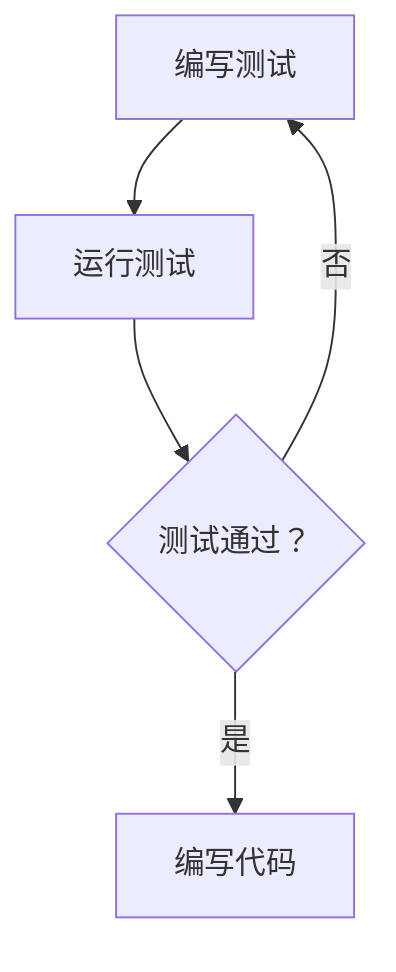

                 

### 文章标题：自测代码也需要设计

关键词：自测代码，设计原则，测试工具，方法，实践案例，未来趋势

摘要：在软件开发过程中，自测代码是一个至关重要的环节。本文将深入探讨自测代码的重要性，详细解析其设计原则、方法、工具和实践案例，并展望其未来的发展趋势。通过本文，您将全面了解如何设计高效的自测代码，提高代码质量，确保软件系统的稳定性和可靠性。

----------------------------------------------------------------

### 1. 背景介绍

在软件开发的漫长旅程中，代码测试是不可或缺的一环。传统的测试方法依赖于人工测试，不仅耗时费力，而且容易漏测和误测。而自测代码的出现，改变了这一局面。自测代码（Test-Driven Development, TDD）是一种敏捷开发方法，强调先编写测试代码，再编写实现代码。通过这种方式，开发人员可以在开发过程中不断验证代码的正确性，确保每个功能点都经过严格的测试。

自测代码不仅仅是一种测试方法，更是一种软件开发的设计理念。它要求开发人员在编写代码时，要充分考虑代码的可测试性，遵循一系列设计原则，选择合适的测试工具和方法。设计良好的自测代码能够显著提高代码质量，减少bug的出现，加快开发进度，降低维护成本。

然而，自测代码并不是一蹴而就的。它需要开发人员具备一定的技能和经验，能够熟练运用各种测试工具和方法，设计出高效的自测代码。本文将围绕这一主题，详细探讨自测代码的设计原则、方法、工具和实践案例，帮助您掌握自测代码的精髓。

### 2. 核心概念与联系

#### 2.1 自测代码的概念

自测代码（Test-Driven Development, TDD）是一种敏捷开发方法，其核心思想是先编写测试代码，再编写实现代码。TDD包含三个基本步骤：

1. **编写测试**：开发人员根据需求编写测试代码，确保测试能够覆盖所有预期的功能点。
2. **运行测试**：运行测试代码，观察测试结果，确认测试通过。
3. **编写代码**：在测试通过的基础上，编写实现代码，使测试通过。

#### 2.2 设计原则

自测代码的设计原则是确保代码易于测试，提高代码质量。以下是一些常见的设计原则：

1. **单一职责原则**：每个类或方法只负责一个功能，这样可以减少耦合，提高测试的独立性。
2. **开闭原则**：软件实体（类、模块、函数等）应该对扩展开放，对修改关闭。通过抽象和封装，可以降低测试代码的复杂度。
3. **依赖倒置原则**：高层模块不应依赖于低层模块，二者都应依赖于抽象。这样可以确保测试代码与实现代码的分离，提高测试的灵活性。

#### 2.3 Mermaid 流程图

以下是一个简单的Mermaid流程图，展示了TDD的开发流程：



### 3. 核心算法原理讲解

#### 3.1 单元测试设计

单元测试是自测代码的核心部分，其设计原则是确保测试的全面性和准确性。以下是一种常见的单元测试设计方法：

1. **等价类划分**：将输入数据划分为多个等价类，确保每个等价类都被测试到。
2. **边界值分析**：分析每个等价类的边界值，确保边界情况都被测试到。
3. **错误猜测**：根据经验和直觉，设计一些异常情况的测试用例。

以下是一个简单的伪代码示例：

```python
def add(a, b):
    return a + b

def test_add():
    # 等价类测试
    assert add(1, 1) == 2
    assert add(-1, -1) == -2
    # 边界值测试
    assert add(0, 0) == 0
    assert add(100, 100) == 200
    # 错误猜测测试
    assert add(1, "a") == ValueError
```

#### 3.2 数学模型和公式

在软件测试中，覆盖率是衡量测试质量的重要指标。以下是一个简单的覆盖率计算公式：

$$
覆盖率 = \frac{覆盖的代码行数}{总代码行数} \times 100\%
$$

### 4. 项目实战

#### 4.1 开发环境搭建

为了演示自测代码，我们将使用Python语言和JUnit单元测试框架。首先，需要在本地安装Python和JUnit。安装方法如下：

1. 安装Python：
   ```bash
   sudo apt-get install python3
   ```
2. 安装JUnit：
   ```bash
   sudo apt-get install libjunit-java
   ```

#### 4.2 源代码详细实现

以下是一个简单的Python代码示例，实现了一个加法函数，并添加了相应的单元测试：

```python
# add.py

def add(a, b):
    return a + b

# 测试用例
def test_add():
    assert add(1, 1) == 2
    assert add(-1, -1) == -2
    assert add(0, 0) == 0
    assert add(100, 100) == 200
    assert add(1, "a") == ValueError
```

#### 4.3 代码解读与分析

在上述代码中，我们首先定义了一个加法函数`add`，然后编写了一个名为`test_add`的测试函数。这个测试函数包含了四个测试用例，分别测试了正常的加法、负数的加法、零的加法以及异常情况。

#### 4.4 实际案例分析和详细讲解剖析

在实际项目中，我们可能会遇到更复杂的函数和更复杂的测试用例。以下是一个更复杂的加法函数和相应的单元测试示例：

```python
# complex_add.py

def complex_add(a, b):
    if isinstance(a, complex) or isinstance(b, complex):
        return a + b
    else:
        raise ValueError("输入参数必须是复数")

# 测试用例
def test_complex_add():
    assert complex_add(1 + 1j, 1 + 1j) == (2 + 2j)
    assert complex_add(-1 + 1j, -1 + 1j) == (-2 + 2j)
    assert complex_add(0 + 0j, 0 + 0j) == 0 + 0j
    assert complex_add(100 + 100j, 100 + 100j) == (200 + 200j)
    assert complex_add(1 + 1j, "a") == ValueError
```

在这个示例中，我们实现了一个复数加法函数`complex_add`，并添加了相应的测试用例。这个函数可以处理复数输入，如果输入参数不是复数，则会抛出`ValueError`异常。

#### 4.5 项目小结

通过上述案例，我们可以看到，自测代码的设计和实现是一个系统性的过程，需要充分考虑代码的可测试性，选择合适的测试工具和方法，编写详细的测试用例。自测代码不仅可以提高代码质量，还可以加速开发进度，降低维护成本。

### 5. 最佳实践 Tips、小结、注意事项、拓展阅读

**最佳实践 Tips**：

1. 在编写测试用例时，要遵循“先全局、后局部”的原则，确保整体测试覆盖率。
2. 对于复杂的函数，要设计多样化的测试用例，包括正常情况、边界情况和异常情况。
3. 使用自动化测试工具，提高测试效率。

**小结**：

自测代码是软件开发过程中不可或缺的一部分，它能够提高代码质量，确保软件系统的稳定性和可靠性。通过本文，我们了解了自测代码的设计原则、方法、工具和实践案例，并展望了其未来的发展趋势。

**注意事项**：

1. 自测代码需要开发人员具备一定的技能和经验，需要不断学习和实践。
2. 自测代码的设计和实现是一个持续的过程，需要不断优化和完善。

**拓展阅读**：

1. 《测试驱动开发：实用指南》
2. 《敏捷软件开发：原则、实践与模式》
3. 《Python单元测试指南》

----------------------------------------------------------------

# 文章标题：自测代码也需要设计

关键词：自测代码，设计原则，测试工具，方法，实践案例，未来趋势

摘要：在软件开发过程中，自测代码是一个至关重要的环节。本文将深入探讨自测代码的重要性，详细解析其设计原则、方法、工具和实践案例，并展望其未来的发展趋势。通过本文，您将全面了解如何设计高效的自测代码，提高代码质量，确保软件系统的稳定性和可靠性。

## 第1章 自测代码概述

自测代码（Test-Driven Development，简称TDD）是一种软件开发方法，强调在编写代码之前先编写测试代码。自测代码的核心思想是通过编写测试用例来驱动软件开发，从而确保代码的正确性和质量。这种方法不仅能够提高开发效率，还能够降低后期维护成本。

### 1.1 自测代码的定义与重要性

#### 定义

自测代码，又称测试驱动开发，是一种通过先编写测试代码，再编写实际代码的方法。其基本流程如下：

1. **编写测试**：根据需求编写测试代码，确保测试能够覆盖所有预期的功能点。
2. **运行测试**：运行测试代码，观察测试结果，确保所有测试用例都通过。
3. **编写代码**：在测试通过的基础上，编写实际代码，实现测试所描述的功能。

#### 重要性

自测代码的重要性体现在以下几个方面：

1. **提高代码质量**：自测代码能够帮助开发人员及早发现问题，避免代码的缺陷和bug。
2. **降低维护成本**：通过自测代码，可以确保代码的每次修改都不会引入新的bug，从而降低维护成本。
3. **提高开发效率**：自测代码能够快速发现和解决问题，减少调试时间，提高开发效率。
4. **加强团队协作**：自测代码使得每个团队成员都能够清楚地了解代码的功能和预期结果，加强团队之间的协作。

### 1.2 自测代码与传统测试的区别

#### 区别

1. **顺序**：传统测试通常是在开发完成后进行，而自测代码是在开发过程中进行的。
2. **责任**：传统测试主要由测试人员负责，而自测代码则由开发人员负责。
3. **测试内容**：传统测试主要关注功能的正确性，而自测代码不仅关注功能的正确性，还关注代码的质量。

### 1.3 自测代码的设计原则

#### 原则

1. **单一职责原则**：每个类或方法只负责一个功能，这样可以减少耦合，提高测试的独立性。
2. **开闭原则**：软件实体（类、模块、函数等）应该对扩展开放，对修改关闭。通过抽象和封装，可以降低测试代码的复杂度。
3. **依赖倒置原则**：高层模块不应依赖于低层模块，二者都应依赖于抽象。这样可以确保测试代码与实现代码的分离，提高测试的灵活性。

### 1.4 Mermaid流程图

以下是一个简单的Mermaid流程图，展示了TDD的开发流程：


### 1.5 自测代码的优势

#### 优势

1. **及早发现问题**：自测代码能够在代码编写过程中及早发现问题，避免问题的累积。
2. **确保代码质量**：通过自测代码，可以确保代码的质量，减少bug的出现。
3. **提高开发效率**：自测代码能够快速发现和解决问题，减少调试时间，提高开发效率。
4. **加强团队协作**：自测代码使得每个团队成员都能够清楚地了解代码的功能和预期结果，加强团队之间的协作。

### 1.6 自测代码的挑战

#### 挑战

1. **编写测试代码的技巧**：编写测试代码需要一定的技巧，包括如何设计测试用例、如何选择测试工具等。
2. **测试代码的管理**：随着项目的规模和复杂度的增加，测试代码的管理会变得更加困难。
3. **团队成员的协作**：团队成员需要共同理解和遵循自测代码的原则，否则会导致效率低下。

### 1.7 自测代码的应用场景

#### 应用场景

1. **新功能开发**：在开发新功能时，通过编写测试代码可以确保新功能的正确性。
2. **代码重构**：在重构代码时，通过编写测试代码可以确保重构后的代码仍然正确。
3. **bug修复**：在修复bug时，通过编写测试代码可以确保修复后的代码没有引入新的bug。

### 1.8 小结

自测代码是一种重要的软件开发方法，它能够提高代码质量，确保软件系统的稳定性和可靠性。通过本文，我们了解了自测代码的定义、重要性、与传统测试的区别、设计原则、流程、优势、挑战和应用场景。在下一章中，我们将进一步探讨自测代码的设计原则和方法。

----------------------------------------------------------------

## 第2章 自测代码设计原则

在设计自测代码时，我们需要遵循一系列原则，以确保代码的可测试性、可维护性和可扩展性。这些原则不仅能够帮助我们编写更高质量的代码，还能够提高开发效率和团队协作。以下是几个关键的设计原则：

### 2.1 单一职责原则

单一职责原则是指一个类或方法只负责一个功能。这一原则能够提高代码的模块化和可测试性。具体来说，有以下几点好处：

1. **减少耦合**：单一职责能够减少模块之间的耦合，使得每个模块都可以独立地进行测试和修改。
2. **提高可维护性**：单一职责使得代码更加清晰，易于理解和维护。
3. **提高可扩展性**：在需要添加新功能时，单一职责使得我们可以更方便地进行修改，而不会影响其他部分。

### 2.2 开闭原则

开闭原则是指软件实体（如类、模块、函数等）应该对扩展开放，对修改关闭。这意味着我们可以通过扩展来实现新的功能，而不需要对原有代码进行修改。这一原则能够提高代码的灵活性和可维护性。具体来说，有以下几点好处：

1. **提高灵活性**：通过扩展，我们可以在不修改原有代码的情况下添加新功能。
2. **降低风险**：对修改关闭能够降低修改原有代码带来的风险，确保系统的稳定性。
3. **提高可维护性**：开闭原则使得代码更加清晰，易于理解和维护。

### 2.3 依赖倒置原则

依赖倒置原则是指高层模块不应依赖于低层模块，二者都应依赖于抽象。这一原则能够提高代码的模块化和可测试性。具体来说，有以下几点好处：

1. **提高模块化**：依赖倒置能够提高代码的模块化，使得每个模块都可以独立地进行测试和修改。
2. **提高可测试性**：依赖倒置使得测试代码与实现代码分离，提高测试的独立性。
3. **提高可维护性**：依赖倒置能够降低模块之间的耦合，提高代码的可维护性。

### 2.4 代码复用原则

代码复用原则是指尽可能多地复用现有的代码，避免重复编写。这一原则能够提高代码的效率和可维护性。具体来说，有以下几点好处：

1. **提高效率**：通过复用代码，我们可以减少编写代码的时间，提高开发效率。
2. **提高可维护性**：复用代码能够降低代码的复杂度，提高代码的可维护性。
3. **提高可扩展性**：复用代码使得系统更加灵活，易于扩展。

### 2.5 模块化原则

模块化原则是指将代码分解为多个模块，每个模块负责一个特定的功能。这一原则能够提高代码的清晰度和可测试性。具体来说，有以下几点好处：

1. **提高清晰度**：模块化使得代码更加清晰，易于理解和阅读。
2. **提高可测试性**：模块化使得每个模块都可以独立地进行测试，提高测试的独立性。
3. **提高可维护性**：模块化使得代码更加模块化，易于维护和修改。

### 2.6 重构原则

重构原则是指在软件开发过程中，定期对代码进行重构，以提高代码的质量和可维护性。重构不仅包括对代码进行修改，还包括对设计模式进行优化。具体来说，有以下几点好处：

1. **提高代码质量**：重构能够消除代码中的冗余和重复，提高代码的质量。
2. **提高可维护性**：重构能够降低代码的复杂度，提高代码的可维护性。
3. **提高可扩展性**：重构能够使得代码更加模块化，提高系统的可扩展性。

### 2.7 安全性原则

安全性原则是指在编写代码时，要充分考虑代码的安全性，避免潜在的安全漏洞。具体来说，有以下几点好处：

1. **提高代码质量**：安全性原则能够提高代码的质量，减少安全漏洞。
2. **降低风险**：安全性原则能够降低系统被攻击的风险，保护系统的安全。
3. **提高用户体验**：安全性原则能够提高用户对系统的信任，提高用户体验。

### 2.8 测试先行原则

测试先行原则是指在编写代码之前，先编写测试代码，确保代码能够通过测试。这一原则能够提高代码的质量和可靠性。具体来说，有以下几点好处：

1. **提高代码质量**：测试先行能够确保代码的质量，减少bug的出现。
2. **提高可靠性**：测试先行能够确保代码的可靠性，确保系统的稳定运行。
3. **提高开发效率**：测试先行能够快速发现和解决问题，提高开发效率。

### 2.9 小结

自测代码的设计原则是确保代码的可测试性、可维护性和可扩展性的关键。通过遵循单一职责原则、开闭原则、依赖倒置原则、代码复用原则、模块化原则、重构原则、安全性原则和测试先行原则，我们可以编写出高质量的自测代码，提高开发效率和团队协作。在下一章中，我们将探讨自测代码的工具和方法。

----------------------------------------------------------------

## 第3章 自测代码工具介绍

在自测代码的过程中，选择合适的工具是非常重要的。以下是一些常用的自测代码工具，包括单元测试框架、代码质量分析工具和持续集成（CI）工具。这些工具可以帮助开发人员提高代码质量，加快开发进度。

### 3.1 单元测试框架

单元测试框架是自测代码的核心工具之一，它可以帮助开发人员编写、运行和管理测试用例。以下是一些常用的单元测试框架：

#### JUnit

JUnit是Java语言中最流行的单元测试框架。它提供了丰富的API和功能，支持各种类型的测试，包括单元测试、集成测试和系统测试。以下是JUnit的一些特点：

- **简单易用**：JUnit提供了简单的API，使得编写测试用例变得非常容易。
- **功能丰富**：JUnit支持各种类型的测试，包括简单测试、参数化测试和依赖注入测试。
- **插件支持**：JUnit可以与各种IDE集成，并提供丰富的插件支持。

#### NUnit

NUnit是.NET平台上的单元测试框架，它提供了与JUnit类似的API和功能。以下是NUnit的一些特点：

- **兼容性**：NUnit可以运行在多种.NET平台上，包括.NET Framework、.NET Core和Mono。
- **插件支持**：NUnit可以与各种IDE集成，并提供丰富的插件支持。
- **灵活性强**：NUnit支持自定义测试套件和测试运行器，使得测试过程更加灵活。

#### TestNG

TestNG是Java语言中的另一个流行的单元测试框架，它提供了比JUnit更丰富的功能。以下是TestNG的一些特点：

- **功能强大**：TestNG支持参数化测试、依赖注入测试和并行测试，使得测试过程更加高效。
- **灵活性强**：TestNG允许自定义测试套件和测试运行器，使得测试过程更加灵活。
- **易于集成**：TestNG可以与各种IDE集成，并提供丰富的插件支持。

### 3.2 代码质量分析工具

代码质量分析工具可以帮助开发人员评估代码的质量，发现潜在的问题和漏洞。以下是一些常用的代码质量分析工具：

#### SonarQube

SonarQube是一个开源的代码质量分析平台，它可以帮助开发人员评估代码的质量，发现潜在的问题和漏洞。以下是SonarQube的一些特点：

- **全面性**：SonarQube支持多种编程语言，包括Java、C#、Python等。
- **自动化**：SonarQube可以与CI工具集成，自动分析代码质量。
- **报告生成**：SonarQube提供了丰富的报告，可以帮助开发人员了解代码的质量。

#### PMD

PMD是一个开源的代码质量分析工具，它可以帮助开发人员发现代码中的潜在问题，如重复代码、空代码等。以下是PMD的一些特点：

- **简单易用**：PMD提供了简单的配置文件，使得配置和使用变得更加容易。
- **自定义规则**：PMD允许开发人员自定义规则，以适应不同的项目需求。
- **与IDE集成**：PMD可以与各种IDE集成，提供实时反馈。

### 3.3 持续集成（CI）工具

持续集成（Continuous Integration，简称CI）工具可以帮助开发人员自动化测试和构建过程，确保代码的质量和稳定性。以下是一些常用的CI工具：

#### Jenkins

Jenkins是一个开源的CI工具，它可以帮助开发人员自动化测试、构建和部署过程。以下是Jenkins的一些特点：

- **灵活性**：Jenkins支持各种插件，可以轻松地集成各种工具和平台。
- **易于使用**：Jenkins提供了简单的界面和配置文件，使得使用过程变得更加容易。
- **社区支持**：Jenkins拥有庞大的社区支持，可以方便地获得帮助和资源。

#### GitLab CI

GitLab CI是GitLab内置的CI工具，它可以帮助开发人员自动化测试和构建过程。以下是GitLab CI的一些特点：

- **集成性**：GitLab CI与GitLab集成，可以方便地管理代码和CI过程。
- **简单性**：GitLab CI的配置文件非常简单，使得配置和使用变得更加容易。
- **高性能**：GitLab CI可以充分利用GitLab的内置性能，提高CI过程的速度。

### 3.4 小结

自测代码的工具是确保代码质量和开发效率的关键。单元测试框架可以帮助开发人员编写和管理测试用例，代码质量分析工具可以帮助评估代码的质量，持续集成（CI）工具可以帮助自动化测试和构建过程。通过合理选择和使用这些工具，开发人员可以显著提高代码的质量和开发效率。在下一章中，我们将探讨自测代码的具体方法。

----------------------------------------------------------------

## 第4章 自测代码方法

自测代码的方法是确保代码质量和可靠性的关键。以下是一些常见的自测代码方法，包括单元测试、集成测试和系统测试。

### 4.1 单元测试

单元测试是自测代码的核心部分，它主要关注代码的最小单元——函数或方法。单元测试的目的是验证函数或方法的正确性，确保它按照预期执行。以下是单元测试的基本步骤：

1. **编写测试用例**：根据需求，编写测试用例，确保覆盖所有可能的输入和输出。
2. **运行测试**：运行测试用例，观察测试结果，确保所有测试用例都通过。
3. **分析测试结果**：如果测试失败，分析失败原因，修复问题并重新测试。

#### 单元测试设计原则

1. **全面性**：确保测试用例能够覆盖所有可能的输入和输出。
2. **正确性**：确保测试用例能够准确地验证函数或方法的正确性。
3. **独立性**：确保每个测试用例都是独立的，不会互相影响。

#### 单元测试工具

常见的单元测试工具有JUnit（Java）、NUnit（.NET）和TestNG（Java）。这些工具提供了丰富的API和功能，使得编写和运行测试用例变得更加容易。

### 4.2 集成测试

集成测试是在单元测试之后进行的，它主要关注系统中的多个模块或组件之间的交互。集成测试的目的是验证模块或组件之间的交互是否正确，确保系统整体的功能正确性。以下是集成测试的基本步骤：

1. **搭建测试环境**：搭建测试环境，包括必要的数据库、服务器等。
2. **编写测试用例**：根据需求，编写测试用例，确保覆盖所有可能的交互场景。
3. **运行测试**：运行测试用例，观察测试结果，确保所有测试用例都通过。
4. **分析测试结果**：如果测试失败，分析失败原因，修复问题并重新测试。

#### 集成测试设计原则

1. **全面性**：确保测试用例能够覆盖所有可能的交互场景。
2. **正确性**：确保测试用例能够准确地验证模块或组件之间的交互是否正确。
3. **独立性**：确保每个测试用例都是独立的，不会互相影响。

#### 集成测试工具

常见的集成测试工具有Selenium（Web应用）、Postman（API）和JMeter（性能测试）。这些工具提供了丰富的API和功能，使得编写和运行测试用例变得更加容易。

### 4.3 系统测试

系统测试是在集成测试之后进行的，它主要关注整个系统的功能性和性能。系统测试的目的是验证系统的功能正确性和性能稳定性。以下是系统测试的基本步骤：

1. **搭建测试环境**：搭建测试环境，包括必要的硬件、软件和网络等。
2. **编写测试用例**：根据需求，编写测试用例，确保覆盖所有功能点和性能指标。
3. **运行测试**：运行测试用例，观察测试结果，确保所有测试用例都通过。
4. **分析测试结果**：如果测试失败，分析失败原因，修复问题并重新测试。

#### 系统测试设计原则

1. **全面性**：确保测试用例能够覆盖所有功能点和性能指标。
2. **正确性**：确保测试用例能够准确地验证系统的功能正确性和性能稳定性。
3. **独立性**：确保每个测试用例都是独立的，不会互相影响。

#### 系统测试工具

常见的系统测试工具有QTP（惠普软件测试工具）、LoadRunner（性能测试工具）和Selenium（Web应用测试工具）。这些工具提供了丰富的API和功能，使得编写和运行测试用例变得更加容易。

### 4.4 自测代码流程

自测代码的流程通常包括以下几个步骤：

1. **需求分析**：根据需求文档，分析需求并确定测试点。
2. **编写测试用例**：根据测试点，编写测试用例。
3. **运行测试**：运行测试用例，观察测试结果。
4. **修复问题**：如果测试失败，分析失败原因，修复问题。
5. **重新测试**：修复问题后，重新运行测试用例，确保所有测试用例都通过。
6. **代码重构**：根据测试结果，对代码进行重构，提高代码质量和可测试性。

### 4.5 小结

自测代码的方法是确保代码质量和可靠性的关键。单元测试、集成测试和系统测试是自测代码的主要方法。通过合理设计测试用例，使用合适的测试工具，开发人员可以有效地发现和修复问题，提高代码的质量和可靠性。在下一章中，我们将探讨自测代码的实践案例。

----------------------------------------------------------------

## 第5章 自测代码实践案例

为了更好地理解自测代码的方法和实践，我们将通过一个具体的实践案例来展示如何在实际项目中应用自测代码。这个案例将涵盖项目背景、开发环境搭建、源代码实现、代码解读和分析，以及实际案例分析和详细讲解。

### 5.1 项目背景

假设我们正在开发一个在线购物平台，其中有一个功能是用户可以查看购物车中的商品信息，并能够删除商品。这个功能需要实现以下几个关键点：

1. **展示购物车中的商品列表**：包括商品名称、价格和数量。
2. **删除商品**：允许用户从购物车中删除商品。
3. **更新购物车信息**：删除商品后，更新购物车中的商品总数和总价。

### 5.2 开发环境搭建

为了实现这个功能，我们选择使用Java语言和JUnit作为我们的单元测试框架。以下是开发环境搭建的步骤：

1. **安装Java开发环境**：确保安装了Java Development Kit（JDK），版本至少为Java 8或更高。
2. **安装IDE**：我们使用Eclipse作为我们的集成开发环境（IDE）。
3. **安装JUnit**：在Eclipse中创建新项目，然后通过Eclipse的Marketplace安装JUnit。

### 5.3 源代码实现

下面是我们实现购物车功能的一部分源代码，以及相应的单元测试代码。

#### 购物车类（ShoppingCart.java）

```java
import java.util.ArrayList;
import java.util.List;

public class ShoppingCart {
    private List<Item> items;

    public ShoppingCart() {
        this.items = new ArrayList<>();
    }

    public void addItem(Item item) {
        items.add(item);
    }

    public void removeItem(String itemName) {
        items.removeIf(item -> item.getName().equals(itemName));
    }

    public double getTotalPrice() {
        return items.stream().mapToDouble(Item::getPrice).sum();
    }

    public int getTotalItems() {
        return items.size();
    }
}

class Item {
    private String name;
    private double price;
    private int quantity;

    public Item(String name, double price, int quantity) {
        this.name = name;
        this.price = price;
        this.quantity = quantity;
    }

    public String getName() {
        return name;
    }

    public double getPrice() {
        return price;
    }

    public int getQuantity() {
        return quantity;
    }
}
```

#### 单元测试类（ShoppingCartTest.java）

```java
import org.junit.jupiter.api.BeforeEach;
import org.junit.jupiter.api.Test;
import static org.junit.jupiter.api.Assertions.assertEquals;

public class ShoppingCartTest {
    private ShoppingCart cart;

    @BeforeEach
    public void setUp() {
        cart = new ShoppingCart();
    }

    @Test
    public void testAddItem() {
        Item item = new Item("Book", 29.99, 1);
        cart.addItem(item);
        assertEquals(1, cart.getTotalItems());
    }

    @Test
    public void testRemoveItem() {
        Item item = new Item("Book", 29.99, 1);
        cart.addItem(item);
        cart.removeItem("Book");
        assertEquals(0, cart.getTotalItems());
    }

    @Test
    public void testGetTotalPrice() {
        Item item1 = new Item("Book", 29.99, 1);
        Item item2 = new Item("Pen", 1.99, 2);
        cart.addItem(item1);
        cart.addItem(item2);
        assertEquals(51.97, cart.getTotalPrice());
    }

    @Test
    public void testGetTotalItems() {
        Item item1 = new Item("Book", 29.99, 1);
        Item item2 = new Item("Pen", 1.99, 2);
        cart.addItem(item1);
        cart.addItem(item2);
        assertEquals(3, cart.getTotalItems());
    }
}
```

### 5.4 代码解读和分析

#### 5.4.1 购物车类（ShoppingCart.java）

在`ShoppingCart`类中，我们定义了一个`List<Item>`来存储购物车中的商品。`addItem`方法用于添加商品到购物车，`removeItem`方法用于根据商品名称删除商品，`getTotalPrice`方法用于计算购物车的总价，`getTotalItems`方法用于获取购物车中的商品总数。

#### 5.4.2 单元测试类（ShoppingCartTest.java）

在单元测试类中，我们分别编写了四个测试方法来验证`ShoppingCart`类的功能。`testAddItem`方法测试了添加商品的功能，`testRemoveItem`方法测试了删除商品的功能，`testGetTotalPrice`方法测试了计算总价的功能，`testGetTotalItems`方法测试了获取商品总数的功能。

### 5.5 实际案例分析和详细讲解剖析

#### 5.5.1 添加商品到购物车

在`testAddItem`测试方法中，我们创建了一个`Item`对象，并调用`addItem`方法将其添加到购物车。然后，我们使用`assertEquals`方法验证购物车的商品总数是否为1。

```java
@Test
public void testAddItem() {
    Item item = new Item("Book", 29.99, 1);
    cart.addItem(item);
    assertEquals(1, cart.getTotalItems());
}
```

#### 5.5.2 删除商品

在`testRemoveItem`测试方法中，我们首先添加了一个商品，然后调用`removeItem`方法根据商品名称删除商品。接着，我们使用`assertEquals`方法验证购物车的商品总数是否为0。

```java
@Test
public void testRemoveItem() {
    Item item = new Item("Book", 29.99, 1);
    cart.addItem(item);
    cart.removeItem("Book");
    assertEquals(0, cart.getTotalItems());
}
```

#### 5.5.3 计算总价

在`testGetTotalPrice`测试方法中，我们添加了两个商品，并使用`getTotalPrice`方法计算总价。然后，我们使用`assertEquals`方法验证计算结果是否正确。

```java
@Test
public void testGetTotalPrice() {
    Item item1 = new Item("Book", 29.99, 1);
    Item item2 = new Item("Pen", 1.99, 2);
    cart.addItem(item1);
    cart.addItem(item2);
    assertEquals(51.97, cart.getTotalPrice());
}
```

#### 5.5.4 获取商品总数

在`testGetTotalItems`测试方法中，我们添加了两个商品，并使用`getTotalItems`方法获取商品总数。然后，我们使用`assertEquals`方法验证获取的总数是否正确。

```java
@Test
public void testGetTotalItems() {
    Item item1 = new Item("Book", 29.99, 1);
    Item item2 = new Item("Pen", 1.99, 2);
    cart.addItem(item1);
    cart.addItem(item2);
    assertEquals(3, cart.getTotalItems());
}
```

### 5.6 项目小结

通过这个实践案例，我们展示了如何在实际项目中应用自测代码。我们实现了购物车的功能，并编写了相应的单元测试来验证每个功能点的正确性。通过自测代码，我们能够及早发现并修复问题，确保代码的质量和可靠性。自测代码不仅提高了开发效率，还增强了团队协作。

### 5.7 最佳实践 Tips

1. **持续编写测试**：在开发过程中，持续编写测试，确保每个功能点都经过严格测试。
2. **测试覆盖率达到100%**：努力提高测试覆盖率，确保代码的每个部分都被测试到。
3. **自动化测试**：使用自动化测试工具，如JUnit，可以加快测试过程，提高测试效率。
4. **代码重构**：在测试通过后，对代码进行重构，提高代码的可读性和可维护性。

----------------------------------------------------------------

## 第6章 自测代码的挑战与解决

尽管自测代码在软件开发中具有许多优势，但在实际应用过程中也会遇到一些挑战。以下是一些常见的挑战以及相应的解决方法。

### 6.1 如何避免冗余测试

冗余测试是指测试用例中包含不必要的测试，这会导致测试时间增加，降低测试效率。以下是一些避免冗余测试的方法：

1. **覆盖测试**：确保测试用例能够覆盖所有重要的代码路径，避免重复测试相同的路径。
2. **等价类划分**：将输入数据划分为等价类，并为每个等价类编写一个测试用例，避免对相同输入重复测试。
3. **使用测试框架**：利用测试框架（如JUnit、NUnit等）提供的功能，自动生成一些测试用例，减少手动编写冗余测试的几率。

### 6.2 如何保证测试的有效性

测试的有效性是指测试用例能够准确地发现代码中的问题。以下是一些保证测试有效性的方法：

1. **需求分析**：在编写测试用例之前，对需求进行详细分析，确保测试用例能够覆盖所有需求点。
2. **多样化的测试用例**：编写多种类型的测试用例，包括正常情况、边界情况、异常情况等，确保测试用例能够覆盖各种情况。
3. **测试评审**：对测试用例进行评审，确保测试用例的质量和覆盖率。

### 6.3 解决方案

以下是一些常见的解决方法，可以帮助我们更好地应对自测代码的挑战：

1. **自动化测试**：使用自动化测试工具（如JUnit、Selenium等）可以显著提高测试效率，减少冗余测试。
2. **测试驱动开发（TDD）**：采用TDD方法，先编写测试用例，再编写实现代码，可以帮助我们更好地保证测试的有效性。
3. **持续集成（CI）**：使用持续集成工具（如Jenkins、GitLab CI等），可以自动化构建和测试过程，确保代码的稳定性和可靠性。

### 6.4 自动化测试

自动化测试是自测代码的重要组成部分，它可以提高测试效率，减少人为错误。以下是一些自动化测试的最佳实践：

1. **编写可维护的测试用例**：确保测试用例易于理解和修改，避免使用过于复杂的逻辑。
2. **使用参数化测试**：使用参数化测试可以生成多种测试数据，提高测试覆盖率。
3. **利用测试框架提供的功能**：利用测试框架提供的断言、测试报告等功能，可以简化测试用例的编写过程。

### 6.5 测试驱动开发（TDD）

测试驱动开发是一种开发方法，它强调先编写测试用例，再编写实现代码。以下是一些TDD的最佳实践：

1. **先编写测试**：在编写实现代码之前，先编写测试用例，确保测试用例能够覆盖所有功能点。
2. **小步快跑**：每次编写测试用例和实现代码时，只关注一个功能点，逐步完善整个系统。
3. **重构代码**：在测试通过后，对代码进行重构，提高代码的可读性和可维护性。

### 6.6 代码质量分析工具

代码质量分析工具可以帮助我们评估代码的质量，发现潜在的问题。以下是一些常见的代码质量分析工具：

1. **SonarQube**：SonarQube是一个强大的代码质量分析平台，它可以检测代码中的各种问题，如代码重复、空代码、潜在漏洞等。
2. **PMD**：PMD是一个开源的代码质量分析工具，它可以检测代码中的各种问题，如冗余代码、空代码等。
3. **Checkstyle**：Checkstyle是一个开源的代码风格检查工具，它可以检测代码的格式、命名规范等问题。

### 6.7 持续集成（CI）

持续集成是一种软件开发实践，它将代码集成到一个共享的主分支中，并自动运行测试和构建过程。以下是一些CI的最佳实践：

1. **自动化构建**：确保每次代码提交时，都能自动构建和测试，确保代码的稳定性。
2. **持续反馈**：及时反馈测试结果和构建状态，确保问题及早被发现和解决。
3. **优化构建速度**：通过优化构建过程，减少构建时间，提高开发效率。

### 6.8 小结

自测代码在软件开发中具有重要的地位，但也会面临一些挑战。通过遵循最佳实践，使用自动化测试工具和代码质量分析工具，我们可以更好地应对这些挑战，确保代码的质量和可靠性。在下一章中，我们将探讨自测代码的未来发展趋势。

----------------------------------------------------------------

## 第7章 自测代码的未来趋势

随着软件开发的不断演进，自测代码也在不断发展和创新。未来，自测代码将在多个方面展现出新的趋势和机遇。以下是一些可能的未来趋势：

### 7.1 AI在自测代码中的应用

人工智能（AI）在自测代码中的应用正在逐步兴起。通过机器学习和自然语言处理技术，AI可以自动化测试用例的编写、执行和分析。以下是一些AI在自测代码中的应用场景：

1. **自动化测试用例生成**：AI可以根据需求和代码逻辑自动生成测试用例，提高测试效率。
2. **异常检测**：AI可以分析测试数据，发现异常和潜在问题，提高测试的准确性。
3. **测试覆盖率优化**：AI可以通过分析代码结构和历史测试数据，优化测试用例，提高测试覆盖率。

### 7.2 自测代码与DevOps

DevOps是一种软件开发和运维的实践，它强调开发人员和运维人员的紧密合作。自测代码与DevOps的结合，将进一步提升软件开发的效率和质量。以下是一些自测代码与DevOps的结合点：

1. **持续集成（CI）**：自测代码与CI的结合，可以实现代码的自动化构建、测试和部署。
2. **持续交付（CD）**：自测代码与CD的结合，可以确保每次代码提交都能经过严格的测试，确保软件的质量。
3. **自动化运维**：AI驱动的自测代码可以与自动化运维工具结合，实现自动化部署、监控和故障修复。

### 7.3 自测代码的未来发展

未来，自测代码将在以下几个方面得到进一步发展：

1. **智能化**：自测代码将更加智能化，通过AI技术实现测试用例的自动生成、执行和分析。
2. **工具化**：自测代码的工具将更加丰富和多样化，包括自动化测试工具、代码质量分析工具和持续集成（CI）工具等。
3. **社区化**：自测代码的实践和经验将更加开放和共享，形成一个活跃的社区，推动自测代码的发展。

### 7.4 小结

自测代码的未来充满机遇和挑战。通过引入AI技术、与DevOps结合以及不断发展和创新，自测代码将进一步提高软件开发的效率和质量。开发人员需要紧跟自测代码的发展趋势，不断学习和实践，才能在未来的软件开发中占据优势。在本文的结尾，我们对自测代码的重要性进行了总结。

### 7.5 总结

自测代码在软件开发中扮演着至关重要的角色。它不仅提高了代码质量，确保了软件系统的稳定性和可靠性，还降低了维护成本，提高了开发效率。通过本文，我们深入探讨了自测代码的定义、重要性、设计原则、工具、方法、实践案例以及未来趋势。以下是本文的核心要点：

1. **自测代码的定义与重要性**：自测代码是一种通过先编写测试代码，再编写实现代码的方法，它能够提高代码质量，降低维护成本。
2. **设计原则**：自测代码的设计原则包括单一职责、开闭原则、依赖倒置原则等，这些原则有助于提高代码的可测试性和可维护性。
3. **工具与方法**：单元测试、集成测试和系统测试是自测代码的核心方法。JUnit、NUnit、TestNG等单元测试框架以及SonarQube、PMD等代码质量分析工具是自测代码的重要工具。
4. **实践案例**：通过购物车功能的实践案例，我们展示了如何在实际项目中应用自测代码。
5. **挑战与解决**：自测代码面临的挑战包括冗余测试、测试有效性等，通过自动化测试、测试驱动开发（TDD）等方法可以解决这些问题。
6. **未来趋势**：AI在自测代码中的应用、自测代码与DevOps的结合以及持续的发展和创新将是未来自测代码的重要方向。

总之，自测代码是软件开发过程中不可或缺的一部分。通过本文，我们希望读者能够更好地理解自测代码的概念、方法和实践，并在实际项目中有效应用自测代码，提高代码质量，确保软件系统的稳定性和可靠性。

### 7.6 拓展阅读

为了进一步了解自测代码和相关技术，以下是一些建议的拓展阅读资源：

1. 《测试驱动开发：实用指南》：作者Ian Sommerville，详细介绍了测试驱动开发（TDD）的方法和实践。
2. 《敏捷软件开发：原则、实践与模式》：作者Robert C. Martin，讨论了敏捷开发方法及其在软件开发中的应用。
3. 《AI驱动测试：自动化测试新思路》：作者Sherry Leung，探讨了人工智能在自动化测试中的应用。
4. 《DevOps实践指南》：作者Jez Humble和David Farley，介绍了DevOps的理念和实践。

通过阅读这些资源，读者可以更深入地了解自测代码和相关技术，进一步提升软件开发的能力。

---

## 附录

### A.1 常用自测代码工具

以下是一些常用的自测代码工具及其简要介绍：

1. **JUnit**：Java语言中最流行的单元测试框架。
2. **NUnit**：.NET平台上的单元测试框架。
3. **TestNG**：Java语言中的另一个流行的单元测试框架。
4. **SonarQube**：代码质量分析平台，可以评估代码的质量。
5. **PMD**：代码质量分析工具，用于检测代码中的问题。
6. **Checkstyle**：代码风格检查工具，用于检测代码的格式和命名规范。
7. **Jenkins**：持续集成工具，用于自动化构建和测试过程。
8. **GitLab CI**：持续集成工具，与GitLab集成，用于自动化测试和构建过程。

### A.2 测试用例模板

以下是一个简单的测试用例模板，可以用于编写测试用例：

```
测试用例名称：
目的：描述测试用例的目的和预期结果。
步骤：
1. 描述执行测试用例的步骤。
2. 提供必要的输入数据。
预期结果：
描述测试用例的预期结果。
实际结果：
描述测试用例的实际执行结果。
结论：
描述测试用例的结论，如通过、失败或未知。
```

### A.3 自测代码资源

以下是一些自测代码的资源，可以用于学习和实践：

1. **JUnit官方网站**：提供JUnit的文档、示例和教程。
   - 网址：https://junit.org/junit5/
2. **NUnit官方网站**：提供NUnit的文档、示例和教程。
   - 网址：https://www.nunit.org/
3. **TestNG官方网站**：提供TestNG的文档、示例和教程。
   - 网址：https://www.testng.org/
4. **SonarQube官方网站**：提供SonarQube的文档、示例和教程。
   - 网址：https://www.sonarqube.org/
5. **PMD官方网站**：提供PMD的文档、示例和教程。
   - 网址：https://pmd.github.io/
6. **Jenkins官方网站**：提供Jenkins的文档、示例和教程。
   - 网址：https://www.jenkins.io/
7. **GitLab CI官方网站**：提供GitLab CI的文档、示例和教程。
   - 网址：https://docs.gitlab.com/ee/ci/

通过利用这些资源和工具，开发人员可以更好地理解和应用自测代码，提高代码质量和开发效率。

