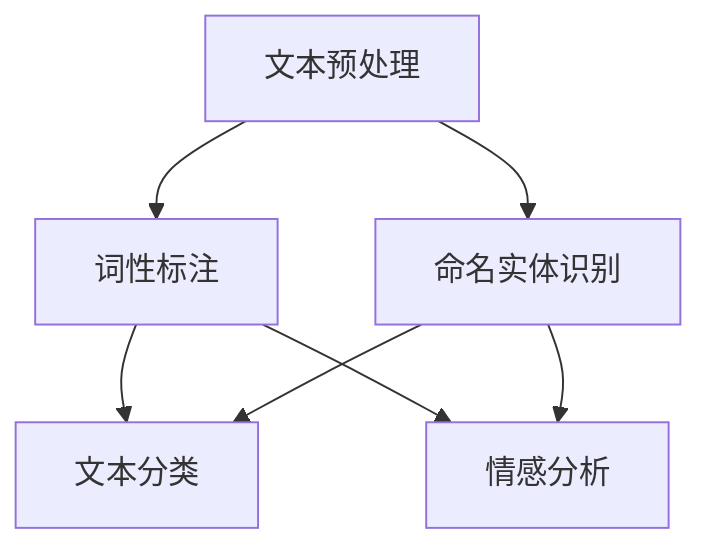
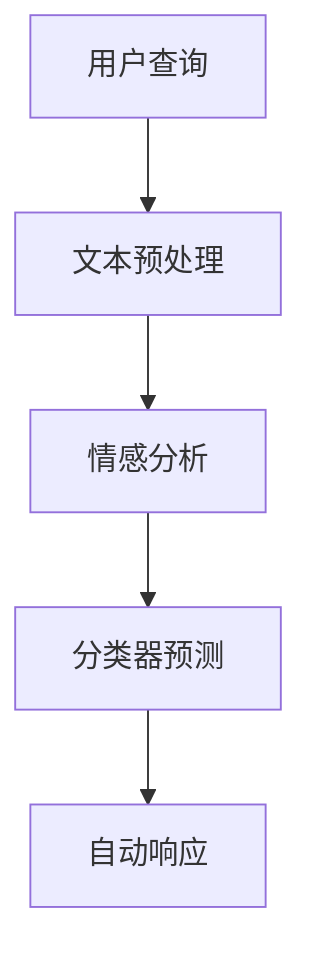
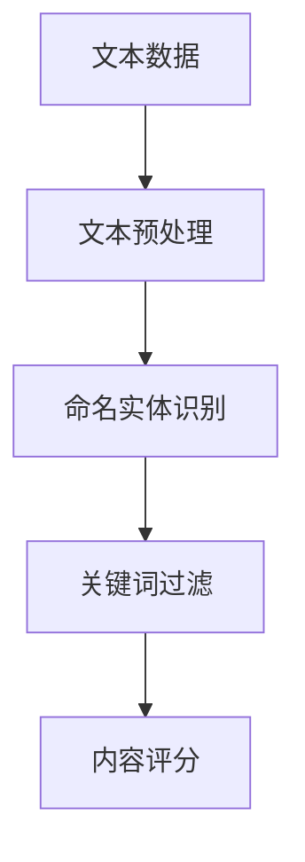
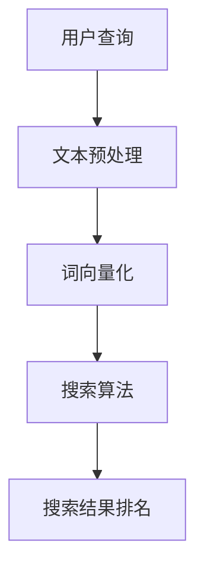

                 


## 一、文章标题：自然语言处理（NLP）在产品中的应用

### 关键词：

自然语言处理，NLP，产品应用，文本分析，人工智能

### 摘要：

本文将深入探讨自然语言处理（NLP）在现代产品开发中的应用。我们将从NLP的基本概念出发，分析其在文本预处理、情感分析、命名实体识别等领域的核心算法原理，并展示如何将这些技术应用于实际产品开发中，如客户服务、内容审核和搜索引擎等。通过本文的阅读，读者将获得对NLP技术及其产品应用的整体认识和具体实践指导。

## 二、引言

### 2.1 NLP的发展背景

自然语言处理（NLP）是人工智能（AI）的一个重要分支，它旨在使计算机能够理解和处理人类语言。NLP的发展历程可以追溯到20世纪50年代，当时人工智能的先驱们开始尝试让计算机模拟人类的语言能力。然而，早期的研究大多以规则驱动，试图通过编写复杂的语法规则来处理语言。然而，这种方法在处理自然语言的实际复杂性时显得力不从心，导致了许多失败。

### 2.2 NLP在现代产品中的重要性

随着互联网和大数据技术的发展，自然语言处理在产品中的应用变得越来越广泛。无论是智能客服、个性化推荐系统，还是内容审核、语言翻译，NLP技术都扮演着至关重要的角色。通过NLP，产品能够更好地理解用户需求、提高用户体验，从而提升市场竞争力。

## 三、自然语言处理的核心概念与联系

### 3.1 文本预处理

在NLP中，文本预处理是一个至关重要的步骤。它包括去除停用词、标记化、分词、词干提取等操作。这些操作有助于简化文本数据，使其更适合后续的分析和处理。

### 3.2 词性标注与命名实体识别

词性标注和命名实体识别是NLP中重要的任务。词性标注用于识别单词在句子中的语法功能，而命名实体识别则用于识别人名、地点、组织等具有特定意义的实体。

### 3.3 文本分类与情感分析

文本分类和情感分析是NLP中的核心任务。文本分类用于将文本数据分类到预定义的类别中，而情感分析则用于判断文本的情感倾向。

### 3.4 Mermaid流程图：NLP任务关系



## 四、核心NLP算法原理讲解

### 4.1 基于机器学习的文本分类算法

文本分类是NLP中的一个基础任务。基于机器学习的文本分类算法通常使用特征工程来提取文本的特征，然后使用分类器进行分类。以下是一个简单的文本分类算法的伪代码：

```python
def text_classification(document, model):
    # 特征提取
    features = extract_features(document)
    # 预测类别
    predicted_category = model.predict(features)
    return predicted_category
```

### 4.2 情感分析算法

情感分析旨在判断文本的情感倾向。常见的情感分析算法包括基于词典的方法和基于机器学习的方法。以下是一个基于机器学习的情感分析算法的伪代码：

```python
def sentiment_analysis(document, model):
    # 特征提取
    features = extract_features(document)
    # 预测情感
    predicted_sentiment = model.predict(features)
    return predicted_sentiment
```

### 4.3 命名实体识别算法

命名实体识别用于识别文本中的特定实体，如人名、地点、组织等。以下是一个简单的命名实体识别算法的伪代码：

```python
def named_entity_recognition(document, model):
    # 特征提取
    features = extract_features(document)
    # 识别实体
    entities = model.predict(features)
    return entities
```

## 五、NLP在产品中的应用

### 5.1 客户服务

在客户服务中，NLP技术可以用于自动处理用户查询，提高响应速度和准确性。以下是一个客户服务应用的例子：



### 5.2 内容审核

内容审核是确保产品内容合规的重要环节。NLP技术可以用于自动检测和过滤不良内容。以下是一个内容审核应用的例子：



### 5.3 搜索引擎

NLP技术可以提高搜索引擎的搜索精度和用户体验。以下是一个搜索引擎应用的例子：



## 六、总结与未来展望

自然语言处理（NLP）在产品中的应用已经取得了显著进展。从文本预处理到情感分析，从客户服务到内容审核，NLP技术正在改变着产品的面貌。然而，NLP技术仍面临着许多挑战，如多语言处理、跨领域语义理解等。未来的研究将致力于解决这些难题，使NLP在更广泛的应用场景中发挥更大的作用。

## 七、拓展阅读

- [1] Jurafsky, D., & Martin, J. H. (2008). *Speech and Language Processing*.
- [2] Manning, C. D., Raghavan, P., & Schütze, H. (2008). *Introduction to Information Retrieval*.
- [3] Liu, B. (2013). *Handbook of Natural Language Processing*.

## 八、作者信息

作者：AI天才研究院/AI Genius Institute & 禅与计算机程序设计艺术 /Zen And The Art of Computer Programming

---

通过以上步骤，我们完成了文章的初步撰写。接下来，我们将对文章进行进一步的编辑和优化，确保内容准确、逻辑清晰，同时满足格式要求。在后续步骤中，我们还将添加具体的数学模型、代码示例和实际案例，以增强文章的实用性和可读性。

