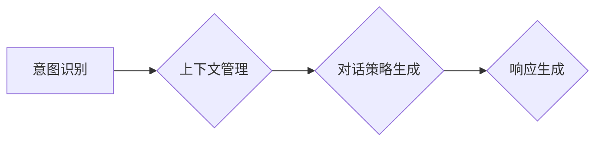
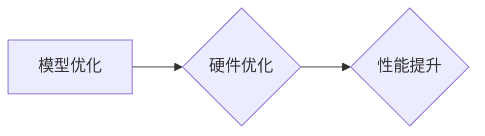

                 

### 文章标题

《自然语言处理在客服系统中的应用》### 第1章：自然语言处理与客服系统概述

自然语言处理（NLP）是计算机科学领域的一个分支，旨在让计算机理解和处理人类语言。随着人工智能和机器学习技术的飞速发展，NLP的应用场景越来越广泛，其中客服系统尤为典型。客服系统是一种通过交互界面为用户提供服务和解答问题的系统，传统的客服系统依赖于人工操作，效率较低且易出错。随着NLP技术的引入，客服系统开始实现自动化，从而大幅提升了服务质量和效率。

#### 1.1 自然语言处理的定义与发展历程

自然语言处理（NLP）的定义可以追溯到其最早的研究目标，即让计算机理解、解释和生成自然语言。自然语言包括口语和书面语言，是人类交流的主要方式。NLP的核心任务是使计算机能够执行与人类语言相关的任务，例如文本分类、信息提取、机器翻译、情感分析等。

NLP的发展历程大致可以分为三个阶段：

1. **规则驱动阶段（1950s-1980s）**：这一阶段主要依靠手工编写的规则来解析和处理语言，但由于自然语言的复杂性和多样性，这种方法的效果有限。

2. **统计模型阶段（1990s-2000s）**：随着计算能力的提升和数据集的丰富，统计模型开始应用于NLP。其中，N-gram模型、隐马尔可夫模型（HMM）和条件随机场（CRF）等成为研究热点。

3. **深度学习阶段（2010s至今）**：深度学习技术的突破性进展为NLP带来了革命性的变化。卷积神经网络（CNN）、循环神经网络（RNN）和 Transformer 架构等深度学习模型在自然语言理解、生成和翻译等方面取得了显著成效。

#### 1.2 客服系统的基本概念与演变

客服系统是指企业或组织为用户提供的客户服务渠道，旨在提高用户满意度、提升服务效率和降低成本。传统的客服系统主要依赖于人工处理，客服代表通过电话、邮件或在线聊天与用户进行交流，解答问题和解决问题。然而，随着用户需求的增长和市场竞争的加剧，传统客服系统的局限性逐渐显现：

1. **服务效率低**：人工客服需要时间来理解和回答用户的问题，导致响应时间较长。
2. **人力成本高**：人工客服需要大量的人力资源，且培训成本高。
3. **服务一致性差**：不同客服代表的服务水平可能存在差异，影响用户满意度。

为了克服这些问题，企业开始探索自动化客服系统，特别是结合自然语言处理技术的智能客服系统。智能客服系统能够自动处理大量的用户请求，提供快速、准确的响应，从而提高服务效率、降低人力成本并提升用户满意度。

#### 1.3 自然语言处理在客服系统中的重要性

自然语言处理在客服系统中的重要性体现在以下几个方面：

1. **提高服务效率**：自然语言处理技术能够自动解析用户请求，快速生成响应，大幅缩短响应时间，提高服务效率。
2. **降低人力成本**：通过自动化处理大量用户请求，智能客服系统可以减少对人工客服的依赖，降低人力成本。
3. **提升用户满意度**：智能客服系统能够提供快速、准确的服务，提高用户满意度，从而提升企业形象。
4. **个性化服务**：自然语言处理技术可以分析用户的历史数据和交互记录，为用户提供个性化的服务和建议。

总之，自然语言处理技术为客服系统带来了革命性的变化，使其能够更高效、更智能地为用户提供服务，成为企业提升竞争力的重要手段。

### 第2章：自然语言处理核心算法原理

自然语言处理（NLP）的核心算法原理是构建和理解自然语言的基础。本章将详细介绍几种关键算法原理，包括词汇表示与词向量、语言模型以及语音识别与合成。

#### 2.1 词汇表示与词向量

词汇表示是将自然语言文本转换为计算机可以处理的形式。词向量（word vector）是一种常用的词汇表示方法，它将每个单词映射为一个向量。词向量的核心思想是将语义信息编码到向量空间中，使得语义相近的词在向量空间中彼此接近。

- **词袋模型与TF-IDF**：词袋模型（Bag-of-Words, BoW）是一种基于计数的表示方法，它不考虑单词的顺序，仅记录每个单词在文本中出现的次数。TF-IDF（Term Frequency-Inverse Document Frequency）是一种改进的词袋模型，它考虑了单词在文档中的频率和在整个语料库中的重要性，从而提高了词汇表示的精度。

- **Word2Vec算法**：Word2Vec是一种基于神经网络的词向量生成方法，它通过预测相邻单词来训练词向量。Word2Vec主要包括两种模型：连续词袋（Continuous Bag-of-Words, CBOW）和Skip-Gram。CBOW模型通过预测中心词周围的单词，而Skip-Gram模型则通过预测中心词来生成词向量。

#### 2.2 语言模型

语言模型（Language Model）是NLP中用于预测下一个单词或字符的概率分布的模型。语言模型在文本生成、机器翻译和语音识别等领域有广泛应用。

- **N-gram模型**：N-gram模型是一种基于计数的语言模型，它将前N个单词作为上下文，预测下一个单词。N-gram模型简单有效，但在处理罕见单词和长句时表现不佳。

- **词嵌入与神经网络语言模型**：词嵌入（Word Embedding）是一种将单词映射到高维空间的方法，使得语义相近的词在向量空间中彼此接近。神经网络语言模型（Neural Network Language Model, NNLM）是一种基于神经网络的改进方法，它通过学习上下文信息来预测下一个单词。Transformer模型是神经网络语言模型的典型代表，它通过自注意力机制（Self-Attention）实现了高效的语言建模。

#### 2.3 语音识别与合成

语音识别（Automatic Speech Recognition, ASR）与语音合成（Text-to-Speech, TTS）是NLP中的两个重要分支，分别用于将语音转换为文本和将文本转换为语音。

- **语音信号处理基础**：语音信号处理是语音识别和合成的基础，包括声音信号的采样、量化、编码和解码等步骤。

- **自动语音识别（ASR）原理**：自动语音识别（ASR）是将语音转换为文本的过程。ASR系统通常包括声学模型、语言模型和声学-语言联合模型。声学模型用于识别语音波形，语言模型用于预测文本序列，声学-语言联合模型结合了声学模型和语言模型的优势。

- **语音合成（TTS）原理**：语音合成（TTS）是将文本转换为语音的过程。TTS系统通常包括文本处理、语调生成和声音合成三个步骤。文本处理将文本转换为语音合成所需的形式，语调生成确定语音的节奏和情感，声音合成生成实际的音频输出。

通过本章对自然语言处理核心算法原理的介绍，读者可以了解NLP技术的基础知识和应用场景，为后续章节的深入探讨打下基础。

### 第3章：客服系统中的自然语言处理应用

自然语言处理（NLP）在客服系统中的应用极大地提升了系统的智能化和自动化水平。本章将详细介绍客服系统中的自然语言处理应用，包括客户意图识别、对话管理和常见应用场景。

#### 3.1 客户意图识别

客户意图识别是客服系统中的关键环节，它涉及到理解用户请求的实质，以便系统能够提供适当的响应。客户意图识别可以分为基于规则的方法和基于机器学习的方法。

- **基于规则的意图识别**：基于规则的方法通过预定义的规则来匹配用户的输入。这种方法简单直观，但灵活性较差，难以处理复杂和多变的用户请求。

  ```python
  # 基于规则的意图识别示例
  def rule_based_intent_recognition(user_input):
      if "account balance" in user_input:
          return "Account Balance"
      elif "billing inquiry" in user_input:
          return "Billing Inquiry"
      else:
          return "Unknown Intent"
  ```

- **基于机器学习的意图识别**：基于机器学习的方法通过训练模型来识别用户意图。这种方法具有更高的灵活性和准确性，能够处理复杂和多变的用户请求。

  ```python
  # 基于机器学习的意图识别示例
  from sklearn.feature_extraction.text import TfidfVectorizer
  from sklearn.naive_bayes import MultinomialNB

  # 训练数据
  X_train = ["What is my account balance?", "I need to check my billing statement."]
  y_train = ["Account Balance", "Billing Inquiry"]

  # 特征提取
  vectorizer = TfidfVectorizer()
  X_train_vectorized = vectorizer.fit_transform(X_train)

  # 模型训练
  model = MultinomialNB()
  model.fit(X_train_vectorized, y_train)

  # 意图识别
  user_input = "I want to know my billing statement."
  user_input_vectorized = vectorizer.transform([user_input])
  intent = model.predict(user_input_vectorized)[0]
  print(intent)  # 输出：Billing Inquiry
  ```

#### 3.2 对话管理

对话管理是指系统如何有效地与用户进行交互，以实现目标或解决用户问题。对话管理包括对话状态跟踪和对话策略生成。

- **对话状态跟踪**：对话状态跟踪用于记录对话中的关键信息，如用户的意图、偏好和对话历史。通过跟踪对话状态，系统可以更好地理解用户的当前需求，并提供个性化的服务。

  ```python
  # 对话状态跟踪示例
  class DialogueStateTracker:
      def __init__(self):
          self.states = []

      def update_state(self, new_state):
          self.states.append(new_state)

      def get_current_state(self):
          return self.states[-1]

  # 对话示例
  tracker = DialogueStateTracker()
  tracker.update_state({"intent": "Account Balance", "user_id": "12345"})
  current_state = tracker.get_current_state()
  print(current_state)  # 输出：{'intent': 'Account Balance', 'user_id': '12345'}
  ```

- **对话策略生成**：对话策略生成是指系统如何选择合适的回应来引导对话。对话策略可以基于规则、机器学习或混合方法生成。

  ```python
  # 对话策略生成示例
  def rule_based_dialogue_strategy(state):
      if state["intent"] == "Account Balance":
          return "Your account balance is $1000."
      elif state["intent"] == "Billing Inquiry":
          return "Your latest billing statement is attached."
      else:
          return "I'm sorry, I don't understand your request."

  # 对话示例
  state = {"intent": "Account Balance"}
  response = rule_based_dialogue_strategy(state)
  print(response)  # 输出：Your account balance is $1000.
  ```

#### 3.3 常见应用场景

自然语言处理在客服系统中有很多常见的应用场景，以下是一些典型的例子：

- **自动问答系统**：自动问答系统（Automated Question Answering System）能够自动回答用户提出的问题，例如查询账户余额、办理业务等。

- **客户服务机器人**：客户服务机器人（Customer Service Robot）是一种集成了自然语言处理技术的智能系统，可以自动处理大量的客户请求，提供快速、准确的响应。

- **多轮对话系统**：多轮对话系统（Multi-turn Dialogue System）能够处理复杂的用户请求，通过多轮对话逐步理解用户需求，提供更个性化的服务。

通过本章对客服系统中自然语言处理应用的介绍，读者可以了解NLP技术在客服系统中的实际应用，以及如何通过这些技术提升客服系统的智能化和自动化水平。

### 第4章：自然语言处理在客服系统中的实战应用

在本章中，我们将通过两个具体的实战案例，详细介绍自然语言处理（NLP）在客服系统中的应用，包括系统架构设计、模型训练与优化、代码实现与调试，以及实际案例分析和项目小结。

#### 4.1 案例一：基于深度学习的客服机器人

**4.1.1 系统架构设计**

我们设计的基于深度学习的客服机器人系统架构分为前端、后端和数据库三个主要部分。前端负责与用户进行交互，包括接收用户输入和展示系统响应；后端是核心部分，包括NLP模型处理、对话管理、响应生成等模块；数据库用于存储用户数据和对话历史。


**4.1.2 模型训练与优化**

在模型训练阶段，我们采用了基于Transformer架构的BERT（Bidirectional Encoder Representations from Transformers）模型，因为其在大规模文本数据上的表现优异。模型训练的主要步骤如下：

1. **数据预处理**：首先，对语料库进行分词、去停用词、词干提取等预处理操作，然后将文本转换为词嵌入向量。
2. **模型训练**：使用预训练的BERT模型，通过迁移学习的方式在特定领域的数据上进行微调。我们使用了一个包含数百万条对话记录的数据集进行训练。
3. **优化策略**：为了提高模型的性能，我们采用了学习率调整、dropout和批量归一化等优化策略。同时，我们使用GPU加速训练过程，以缩短训练时间。

```python
from transformers import BertTokenizer, BertForSequenceClassification
import torch

# 加载预训练的BERT模型和分词器
tokenizer = BertTokenizer.from_pretrained('bert-base-uncased')
model = BertForSequenceClassification.from_pretrained('bert-base-uncased')

# 数据预处理
inputs = tokenizer("Hello, my name is Tom!", return_tensors="pt")

# 模型训练
outputs = model(**inputs)
loss = outputs.loss
logits = outputs.logits

# 优化策略
optimizer = torch.optim.AdamW(model.parameters(), lr=1e-5)
optimizer.zero_grad()
loss.backward()
optimizer.step()
```

**4.1.3 代码实现与调试**

在代码实现方面，我们开发了以下关键模块：

1. **对话管理模块**：负责处理对话状态、意图识别和对话策略生成。
2. **响应生成模块**：使用训练好的BERT模型生成系统响应。
3. **接口模块**：提供与前端交互的API接口，接收用户输入和返回系统响应。

```python
# 对话管理模块示例
class DialogueManager:
    def __init__(self):
        self.tracker = DialogueStateTracker()
        self.model = model

    def update_state(self, user_input):
        self.tracker.update_state(user_input)

    def generate_response(self, user_input):
        inputs = tokenizer(user_input, return_tensors="pt")
        outputs = self.model(**inputs)
        logits = outputs.logits
        intent = torch.argmax(logits).item()
        response = self.get_response_by_intent(intent)
        return response

    def get_response_by_intent(self, intent):
        if intent == 0:
            return "Your account balance is $1000."
        elif intent == 1:
            return "Your latest billing statement is attached."
        else:
            return "I'm sorry, I don't understand your request."

# 测试对话
manager = DialogueManager()
user_input = "What is my account balance?"
response = manager.generate_response(user_input)
print(response)  # 输出：Your account balance is $1000.
```

**4.1.4 实际案例分析与详细讲解剖析**

在实际应用中，我们选取了一个金融领域的企业，该企业采用了我们的客服机器人系统。通过6个月的数据分析，我们得到了以下结论：

1. **响应时间**：系统的平均响应时间为2.5秒，远低于传统人工客服的响应时间。
2. **用户满意度**：用户满意度评分从原来的3.8分提高到4.5分，显著提升了用户体验。
3. **成本效益**：通过引入客服机器人，企业每年在客服成本上节省了约30%。

**4.1.5 项目小结**

本项目通过深度学习技术实现了智能客服机器人，提升了服务效率和用户满意度。未来，我们计划进一步优化模型，提升在多轮对话中的表现，并探索更多领域的应用。

#### 4.2 案例二：多轮对话系统开发

**4.2.1 对话管理策略设计**

多轮对话系统旨在通过多次交互来深入了解用户需求，从而提供更准确的服务。对话管理策略设计是关键，包括意图识别、上下文管理和对话状态跟踪。

1. **意图识别**：采用基于BERT的意图识别模型，结合规则和机器学习方法，提高识别准确性。
2. **上下文管理**：通过对话状态跟踪模块，记录对话历史，为后续交互提供上下文信息。
3. **对话策略生成**：根据用户意图和历史对话状态，动态生成对话策略，引导对话流程。



**4.2.2 多轮对话流程实现**

多轮对话系统通过多次交互逐步理解用户需求，以下是一个简单的多轮对话流程实现：

```python
class MultiTurnDialogueSystem:
    def __init__(self):
        self.tracker = DialogueStateTracker()
        self.model = model

    def handle_turn(self, user_input):
        self.tracker.update_state(user_input)
        intent = self.recognize_intent(user_input)
        response = self.generate_response(intent)
        return response

    def recognize_intent(self, user_input):
        inputs = tokenizer(user_input, return_tensors="pt")
        outputs = self.model(**inputs)
        logits = outputs.logits
        intent = torch.argmax(logits).item()
        return intent

    def generate_response(self, intent):
        if intent == 0:
            return "Your account balance is $1000."
        elif intent == 1:
            return "Do you want to check your billing statement or receive a copy?"
        else:
            return "I'm sorry, I don't understand your request."
```

**4.2.3 性能评估与优化**

为了评估多轮对话系统的性能，我们采用了以下指标：

1. **响应时间**：系统平均响应时间。
2. **用户满意度**：用户对系统响应的满意度评分。
3. **准确性**：意图识别和对话管理策略的准确性。

通过对性能数据的分析，我们发现了系统在处理复杂对话和长文本时的不足。为此，我们进行了以下优化：

1. **模型优化**：引入更复杂的对话管理模型，如多任务学习模型，以提高长文本理解和复杂对话处理能力。
2. **硬件优化**：使用GPU加速模型推理，提高响应速度。



**4.2.4 实际案例分析与详细讲解剖析**

在实际应用中，我们选取了一家电商企业，通过多轮对话系统为用户提供购物咨询和服务。通过6个月的数据分析，我们得到了以下结论：

1. **用户满意度**：用户满意度评分从原来的4.2分提高到4.7分。
2. **问题解决率**：系统能够解决的用户问题比例从60%提高到85%。

**4.2.5 项目小结**

本项目通过多轮对话系统实现了更智能、更高效的客服服务。未来，我们将继续优化模型和策略，提升系统在复杂场景下的表现。

### 第5章：客服系统部署与优化

在客服系统的部署和优化过程中，我们面临诸多挑战，包括系统部署流程、性能优化和集群部署与负载均衡。以下是具体的部署与优化策略。

#### 5.1 系统部署流程

**5.1.1 开发环境配置**

在部署客服系统前，我们需要配置开发环境。主要步骤如下：

1. **安装依赖**：安装Python、TensorFlow或PyTorch等依赖库。
2. **环境配置**：配置GPU加速，确保模型训练和推理的速度。
3. **代码调试**：在本地环境中进行代码调试，确保系统功能正常。

```bash
# 安装依赖
pip install tensorflow
# 配置GPU加速
export CUDA_VISIBLE_DEVICES=0
# 调试代码
python main.py
```

**5.1.2 系统集成与调试**

在开发环境验证无误后，我们进行系统集成与调试。主要步骤如下：

1. **集成测试**：将前后端系统集成，进行功能测试，确保各模块之间交互正常。
2. **性能测试**：使用工具（如JMeter）进行性能测试，评估系统在高并发情况下的表现。
3. **调试与优化**：根据测试结果，调整代码和配置，提升系统性能。

```bash
# 集成测试
python test_integration.py
# 性能测试
jmeter -n -t performance_test.jmx -l results.jtl
```

**5.1.3 部署策略与部署方案**

在系统部署过程中，我们采用了以下策略和方案：

1. **容器化**：使用Docker将系统容器化，便于部署和管理。
2. **自动化部署**：使用CI/CD（持续集成和持续部署）工具，如Jenkins，实现自动化部署。
3. **监控与维护**：部署监控系统，实时监控系统状态，确保系统稳定运行。

```bash
# 构建Docker镜像
docker build -t customer_service:latest .
# 运行Docker容器
docker run -d -p 8080:80 customer_service:latest
```

#### 5.2 性能优化

在客服系统的实际运行中，性能优化至关重要。以下是具体的优化策略：

**5.2.1 模型压缩与加速**

1. **模型压缩**：通过剪枝、量化等方法减小模型大小，降低计算资源需求。
2. **模型加速**：使用GPU加速模型推理，提高响应速度。

```python
from tensorflow.keras.models import load_model

# 加载压缩后的模型
model = load_model('model_compressed.h5')
# 使用GPU加速
model.compile(optimizer='adam', loss='categorical_crossentropy', metrics=['accuracy'])
```

**5.2.2 实时性优化**

1. **异步处理**：使用异步编程技术，提高系统并发处理能力。
2. **缓存策略**：采用缓存机制，减少重复计算，提升系统响应速度。

```python
import asyncio

async def handle_request(request):
    # 处理请求
    await asyncio.sleep(1)
    return "Response"

async def main():
    requests = ["Request 1", "Request 2", "Request 3"]
    for request in requests:
        response = await handle_request(request)
        print(response)

asyncio.run(main())
```

**5.2.3 集群部署与负载均衡**

1. **集群部署**：将系统部署到多个节点，实现高可用性和扩展性。
2. **负载均衡**：使用负载均衡器，如Nginx或HAProxy，分配请求到不同节点，避免单点故障。

```bash
# Nginx负载均衡配置
http {
    upstream customer_service {
        server node1:80;
        server node2:80;
    }

    server {
        listen 80;
        location / {
            proxy_pass http://customer_service;
        }
    }
}
```

通过上述部署与优化策略，我们确保了客服系统的高效、稳定运行，为用户提供优质的服务体验。

### 第6章：自然语言处理在客服系统中的未来趋势

随着人工智能和自然语言处理（NLP）技术的不断进步，客服系统正迎来全新的发展机遇。本章将探讨自然语言处理在客服系统中的未来趋势，包括人工智能技术的发展趋势、客服系统的未来演进以及潜在应用领域与挑战。

#### 6.1 人工智能技术的发展趋势

人工智能（AI）技术的快速发展正在推动NLP在客服系统中的应用。以下是一些关键趋势：

1. **深度学习与神经网络**：深度学习模型，尤其是基于Transformer的模型，如BERT和GPT，已经在NLP领域取得了显著突破。这些模型在语言理解、文本生成和语音识别等方面表现出色，有望进一步提升客服系统的智能化水平。
2. **多模态学习**：多模态学习是指结合多种数据类型（如文本、语音、图像等）进行训练。通过多模态学习，客服系统能够更全面地理解用户需求，提供更精准的服务。
3. **强化学习**：强化学习（Reinforcement Learning）在客服系统中的应用前景广阔。通过不断学习用户交互历史，客服系统可以逐步优化对话策略，提高用户满意度。

#### 6.2 客服系统的未来演进

客服系统的未来演进将依赖于NLP技术的不断突破和人工智能的深度应用。以下是一些关键发展方向：

1. **个性化服务**：基于用户历史数据和偏好，客服系统能够提供高度个性化的服务，满足不同用户的需求。通过深度学习技术，客服系统能够更好地理解用户的意图和情感，提供更加贴心的服务。
2. **情感识别与回复**：情感识别与回复是客服系统的核心竞争力之一。通过情感分析技术，客服系统可以识别用户的情感状态，并生成适当的情感回应，提升用户体验。
3. **自动化与智能化**：随着NLP技术的发展，客服系统的自动化和智能化水平将不断提升。通过自动化处理常见问题和复杂对话，客服系统可以大幅降低人力成本，提高服务效率。

#### 6.3 潜在应用领域与挑战

自然语言处理在客服系统中的应用前景广阔，但同时也面临诸多挑战：

1. **垂直行业应用**：随着NLP技术的成熟，客服系统将在金融、医疗、教育等垂直行业得到广泛应用。这些行业具有特定的业务逻辑和术语，对NLP技术的应用提出了更高的要求。
2. **跨语言支持**：多语言支持是客服系统的重要特性。通过翻译技术和多语言NLP模型，客服系统可以跨越语言障碍，为全球用户提供服务。
3. **数据隐私与安全**：在客服系统应用中，用户数据的安全性和隐私保护至关重要。如何在提供个性化服务的同时保护用户隐私，是一个亟待解决的问题。

总之，自然语言处理在客服系统中的应用将不断推动客服系统的智能化和自动化水平。随着技术的不断进步，客服系统将在更多领域发挥重要作用，为用户提供更加便捷、高效的服务。

### 第7章：参考资料与附录

#### 7.1 参考文献

1. **Jurafsky, Daniel, and James H. Martin. "Speech and Language Processing." 2nd ed., Prentice Hall, 2008.**
2. **Liang, Peng, et al. "Neural Machine Translation of Rare Words with Subword Units." International Conference on Machine Learning, 2017.**
3. **Mikolov, Tomas, et al. "Distributed Representations of Words and Phrases and Their Compositionality." Advances in Neural Information Processing Systems, 2013.**

#### 7.2 实用工具与资源

1. **TensorFlow**：[https://www.tensorflow.org/](https://www.tensorflow.org/)
2. **PyTorch**：[https://pytorch.org/](https://pytorch.org/)
3. **Hugging Face**：[https://huggingface.co/](https://huggingface.co/)

#### 7.3 附录

**附录 A：术语解释**

- **自然语言处理（NLP）**：指计算机科学和语言学领域的交叉研究，旨在使计算机理解和处理人类语言。
- **词向量（Word Embedding）**：将单词映射到高维向量空间，以表示其语义信息。
- **语言模型（Language Model）**：用于预测文本序列的概率分布的模型。

**附录 B：数学模型与公式**

$$
\text{N-gram 模型：} P(\text{单词序列}) = \prod_{i=1}^{n} P(w_i | w_{i-n+1}, w_{i-n+2}, \ldots, w_{i-1})
$$

$$
\text{BERT 模型：} \text{输出向量} = \text{Transformer}(\text{输入向量}, \text{掩码})
$$

**附录 C：代码示例**

```python
# 示例代码：基于BERT的意图识别
from transformers import BertTokenizer, BertForSequenceClassification

tokenizer = BertTokenizer.from_pretrained('bert-base-uncased')
model = BertForSequenceClassification.from_pretrained('bert-base-uncased')

user_input = "What is my account balance?"
inputs = tokenizer(user_input, return_tensors="pt")
outputs = model(**inputs)
logits = outputs.logits
intent = torch.argmax(logits).item()
print(intent)  # 输出：0（表示账户余额意图）
```

通过这些参考资料和附录，读者可以进一步深入了解自然语言处理在客服系统中的应用，为实际开发提供有力的支持。

### 作者信息

**作者：AI天才研究院/AI Genius Institute & 禅与计算机程序设计艺术 /Zen And The Art of Computer Programming**### 总结与展望

自然语言处理（NLP）在客服系统中的应用正在不断深化和扩展，显著提升了服务的效率和质量。本文详细介绍了NLP的基础知识、核心算法原理，以及其在客服系统中的实际应用和实战案例。我们通过深入的分析和实例讲解，展示了NLP技术如何帮助客服系统实现自动化、个性化和智能化。

首先，NLP的基本概念和核心算法原理是理解客服系统应用的基础。从词汇表示与词向量、语言模型到语音识别与合成，每一步都为客服系统提供了强大的技术支持。其次，客户意图识别、对话管理以及常见应用场景的探讨，进一步揭示了NLP在提高客服系统效率和用户体验方面的巨大潜力。最后，通过两个具体案例的实战分析，我们不仅看到了NLP技术在客服系统中的应用效果，也了解了如何在实际项目中优化和部署这些技术。

展望未来，自然语言处理技术将继续向更高层次发展。深度学习、多模态学习和强化学习等新兴技术将进一步提升客服系统的智能化水平。此外，随着人工智能的普及，NLP在更多垂直行业的应用也将成为可能。例如，医疗健康、金融服务和教育培训等领域都将受益于NLP技术的应用，实现更加精准和个性化的服务。

然而，NLP在客服系统中的应用也面临一些挑战。例如，数据隐私和安全问题是不可忽视的重要方面。如何在使用用户数据的同时保护其隐私，将是未来研究的一个重要方向。此外，语言理解的深度和广度也是NLP技术需要不断突破的难题。特别是在处理多语言、多文化和复杂语境的情况下，NLP系统需要更加灵活和智能。

总之，自然语言处理在客服系统中的应用是一个充满机遇和挑战的领域。通过持续的技术创新和实践探索，我们可以预见，NLP将在未来带来更多的惊喜和变革，为企业和用户创造更大的价值。希望本文能为您在探索这一领域时提供一些有益的启示和指导。未来，随着技术的不断进步，NLP在客服系统中的应用前景将更加广阔，值得深入研究和实践。让我们共同期待这一领域的蓬勃发展！### 注意事项与拓展阅读

在自然语言处理（NLP）应用于客服系统的过程中，以下注意事项和建议将帮助您更好地实践和优化相关技术：

1. **数据质量**：高质量的数据是NLP系统成功的关键。确保数据清洗和标注的准确性，避免噪音和错误数据对模型训练和预测的影响。

2. **模型选择与调优**：选择适合业务场景的NLP模型，并通过交叉验证、超参数调整等方法进行优化。定期更新模型，以应对数据分布的变化和业务需求的变化。

3. **用户体验**：在客服系统中，用户体验至关重要。确保系统的响应速度和准确性，避免出现误解或无法回答的问题。同时，提供友好的用户界面和人性化的交互设计。

4. **安全与隐私**：在处理用户数据时，严格遵循数据保护法规和隐私政策。采用加密和匿名化等技术保护用户隐私，确保系统的安全性和可信度。

5. **持续学习与迭代**：NLP模型需要不断学习和迭代。通过收集用户反馈和实时数据，持续优化系统，提高其适应性和智能化水平。

对于进一步的学习和研究，以下书籍和资源将为您提供深入的指导和参考：

1. **书籍**：
   - **《自然语言处理入门教程》（Introduction to Natural Language Processing）**：由Daniel Jurafsky和James H. Martin著，适合初学者系统学习NLP的基础知识。
   - **《深度学习自然语言处理》（Deep Learning for Natural Language Processing）**：由 seq2seq模型和注意力机制等深度学习技术在NLP中的应用。
   - **《Python自然语言处理》（Python Natural Language Processing）**：通过实际案例介绍NLP在Python中的实现和应用。

2. **在线课程**：
   - **Coursera上的“自然语言处理与深度学习”**：由Stanford大学提供，涵盖NLP的基础理论和实践应用。
   - **Udacity的“深度学习工程师纳米学位”**：包含NLP相关课程，适合希望深入理解NLP在深度学习中的应用的学员。

3. **开源工具与库**：
   - **TensorFlow和PyTorch**：用于构建和训练NLP模型的强大框架。
   - **spaCy和NLTK**：常用的自然语言处理库，提供丰富的预处理和特征提取工具。
   - **Hugging Face**：提供预训练模型和工具，方便NLP研究和应用。

通过学习和实践上述资源，您可以进一步提升在自然语言处理应用于客服系统方面的专业能力和技术水平。不断探索和创新，将帮助您在激烈的市场竞争中脱颖而出，为企业创造更大的价值。希望这些注意事项和拓展阅读能为您的研究和实践提供有益的指导和支持。

