                 

## 文章标题：自然语言处理在软件开发中的应用

### 关键词：自然语言处理，软件开发，应用场景，算法原理，实战案例

### 摘要：
本文旨在探讨自然语言处理（NLP）在软件开发中的应用。通过系统地介绍NLP的基础理论、核心算法和实际应用案例，本文旨在为开发者提供一个全面而深入的指南，帮助他们更好地理解NLP的价值和潜力，并掌握在软件开发中有效利用NLP技术的方法。

### 目录：

1. 引言
2. 自然语言处理的基本概念
3. NLP的核心算法原理
4. NLP在软件开发中的应用场景
5. 实战案例：情感分析系统开发
6. 实战案例：问答系统设计
7. 实战案例：机器翻译应用
8. 结论与未来展望
9. 作者信息

---

### 1. 引言

自然语言处理（NLP）是计算机科学和人工智能领域的一个重要分支，旨在使计算机能够理解和处理人类自然语言。随着互联网和大数据技术的飞速发展，NLP在多个领域展现出了广泛的应用潜力，特别是在软件开发中。无论是文本挖掘、智能客服、内容审核，还是自然语言生成，NLP技术都为软件开发带来了新的功能和可能性。

本文将首先介绍NLP的基本概念，包括语言模型、词嵌入、语义分析等。接着，我们将深入探讨NLP的核心算法原理，如朴素贝叶斯、支持向量机、循环神经网络等。随后，本文将列举NLP在软件开发中的多种应用场景，并通过三个具体案例展示如何在实际项目中利用NLP技术。最后，我们将总结本文的主要内容，并探讨NLP技术的未来发展趋势。

### 2. 自然语言处理的基本概念

#### 2.1 语言模型

语言模型是NLP的基础，它旨在预测给定文本序列下一个词或字符的概率。最简单的语言模型是基于N元组模型，它考虑前N个词来预测下一个词。例如，在二元语言模型中，当前词取决于前一个词。

**核心概念与联系：**

下面是一个Mermaid流程图，展示了语言模型的架构：

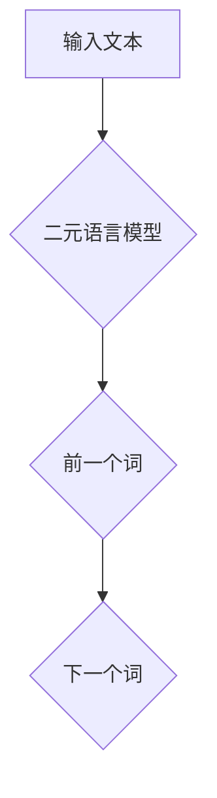

**算法原理讲解：**

语言模型的算法原理可以通过以下伪代码来解释：

```python
# 假设输入文本为 "The quick brown fox jumps over the lazy dog"
# 使用二元语言模型来预测 "jumps" 的下一个词

previous_word = "fox"
for next_word in text:
    if previous_word == "fox":
        predicted_word = "jumps"
    print(f"The {predicted_word} {next_word}")
    previous_word = next_word
```

#### 2.2 词嵌入

词嵌入是一种将词汇映射到高维空间的技术，使得语义相似的词在空间中靠近。词嵌入不仅提高了模型的性能，还有助于处理罕见或未登录的词汇。

**核心概念与联系：**

词嵌入的架构可以用以下Mermaid流程图来表示：

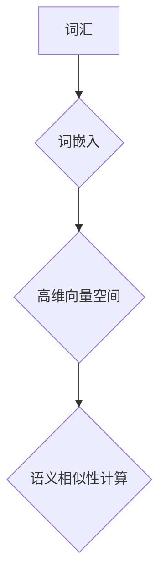

**算法原理讲解：**

词嵌入的算法通常基于神经网络训练，以下是一个简化的伪代码示例：

```python
# 假设词汇表为 ["the", "quick", "brown", "fox", "jumps", "over", "lazy", "dog"]

# 使用词嵌入模型将词汇映射到高维向量空间
word_embedding = {
    "the": [0.1, 0.2, 0.3],
    "quick": [0.4, 0.5, 0.6],
    "brown": [0.7, 0.8, 0.9],
    "fox": [1.0, 1.1, 1.2],
    "jumps": [1.3, 1.4, 1.5],
    "over": [1.6, 1.7, 1.8],
    "lazy": [1.9, 2.0, 2.1],
    "dog": [2.2, 2.3, 2.4]
}

# 计算词汇 "fox" 和 "jumps" 的语义相似性
fox_embedding = word_embedding["fox"]
jumps_embedding = word_embedding["jumps"]

similarity = dot_product(fox_embedding, jumps_embedding)
print(f"The semantic similarity between 'fox' and 'jumps' is {similarity}")
```

#### 2.3 语义分析

语义分析旨在理解文本的深层含义，包括词义消歧、实体识别和关系抽取等任务。语义分析是NLP领域中极具挑战性的一部分，因为它需要处理词汇的多义性和语言的复杂性。

**核心概念与联系：**

语义分析的架构可以用以下Mermaid流程图来表示：

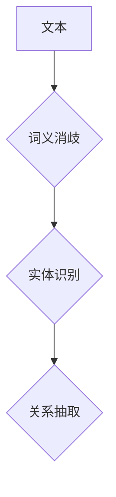

**算法原理讲解：**

语义分析的算法通常涉及深度学习和图论技术，以下是一个简化的伪代码示例：

```python
# 假设文本为 "The quick brown fox jumps over the lazy dog"

# 使用词嵌入模型和图神经网络进行语义分析
word_embedding = {
    "the": [0.1, 0.2, 0.3],
    "quick": [0.4, 0.5, 0.6],
    "brown": [0.7, 0.8, 0.9],
    "fox": [1.0, 1.1, 1.2],
    "jumps": [1.3, 1.4, 1.5],
    "over": [1.6, 1.7, 1.8],
    "lazy": [1.9, 2.0, 2.1],
    "dog": [2.2, 2.3, 2.4]
}

# 进行词义消歧
def disambiguate(word):
    # 假设 "quick" 有两种可能的含义
    context = [word_embedding[word]]
    context.append(word_embedding[word + " fox"])
    context.append(word_embedding[word + " brown"])
    return max(context, key=lambda x: sum(x))

# 对文本中的每个词进行语义分析
for word in text:
    disambiguation = disambiguate(word)
    print(f"The word '{word}' is disambiguated as '{disambiguation}'")
```

---

### 3. NLP的核心算法原理

在了解了NLP的基本概念之后，我们将深入探讨NLP的核心算法原理，这些算法在处理自然语言任务中发挥着关键作用。

#### 3.1 朴素贝叶斯

朴素贝叶斯是一种基于概率论的分类算法，它在NLP中被广泛应用于文本分类任务。朴素贝叶斯假设特征之间相互独立，因此简化了计算过程。

**核心概念与联系：**

朴素贝叶斯算法的架构可以用以下Mermaid流程图来表示：

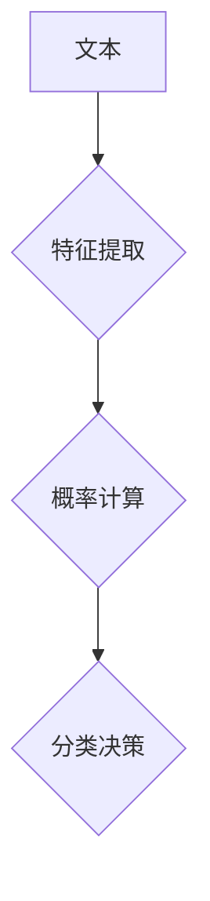

**算法原理讲解：**

朴素贝叶斯算法的原理可以通过以下伪代码来解释：

```python
# 假设文本为 "The quick brown fox jumps over the lazy dog"
# 假设类别为 "动物"

# 计算类别 "动物" 的先验概率
prior_probability = sum(p_class["动物"]) / len(p_class)

# 计算特征 "quick" 在类别 "动物" 下的条件概率
feature_probability = p_feature_given_class["quick"]["动物"]

# 计算类别 "动物" 的后验概率
posterior_probability = prior_probability * feature_probability

# 决策分类
if posterior_probability > threshold:
    category = "动物"
else:
    category = "非动物"
print(f"The text '{text}' is classified as '{category}'")
```

#### 3.2 支持向量机

支持向量机（SVM）是一种强大的分类算法，它在NLP中被广泛应用于文本分类、情感分析等任务。SVM通过最大化分类边界来分离数据点。

**核心概念与联系：**

SVM算法的架构可以用以下Mermaid流程图来表示：

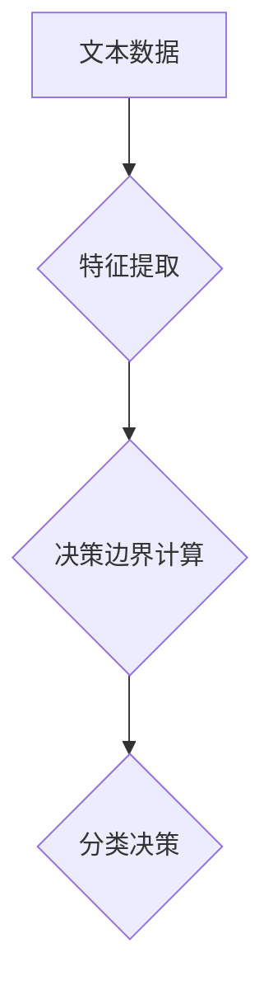

**算法原理讲解：**

SVM算法的原理可以通过以下伪代码来解释：

```python
# 假设文本数据为 ["The quick brown fox", "jumps over the lazy dog"]
# 假设类别为 ["动物", "非动物"]

# 使用特征提取器将文本转换为特征向量
feature_vectors = extract_features(text_data)

# 训练SVM分类器
classifier = train_svm(feature_vectors, labels)

# 使用分类器进行分类
for text in text_data:
    feature_vector = extract_features(text)
    prediction = classifier.predict(feature_vector)
    print(f"The text '{text}' is classified as '{prediction}'")
```

#### 3.3 循环神经网络

循环神经网络（RNN）是一种能够处理序列数据的神经网络，它在NLP中被广泛应用于语言模型、机器翻译等任务。

**核心概念与联系：**

RNN算法的架构可以用以下Mermaid流程图来表示：

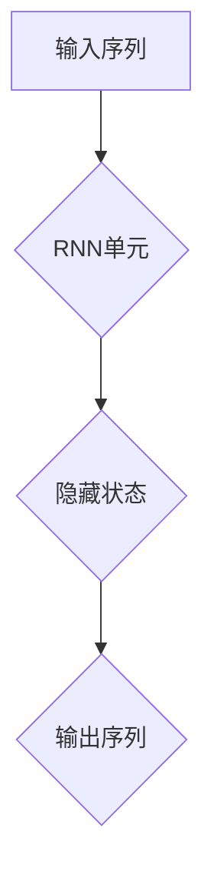

**算法原理讲解：**

RNN算法的原理可以通过以下伪代码来解释：

```python
# 假设输入序列为 "The quick brown fox jumps over the lazy dog"

# 初始化RNN单元
rnn = initialize_rnn()

# 遍历输入序列
for word in input_sequence:
    # 计算当前输入的隐藏状态
    hidden_state = rnn.forward(word)

    # 记录隐藏状态
    hidden_states.append(hidden_state)

# 输出序列为隐藏状态的序列
output_sequence = hidden_states

print(f"The hidden states of the RNN are {output_sequence}")
```

#### 3.4 长短时记忆网络

长短时记忆网络（LSTM）是RNN的一种变体，它通过引入门控机制来解决RNN的长期依赖问题。LSTM在NLP中被广泛应用于文本生成、语音识别等任务。

**核心概念与联系：**

LSTM算法的架构可以用以下Mermaid流程图来表示：

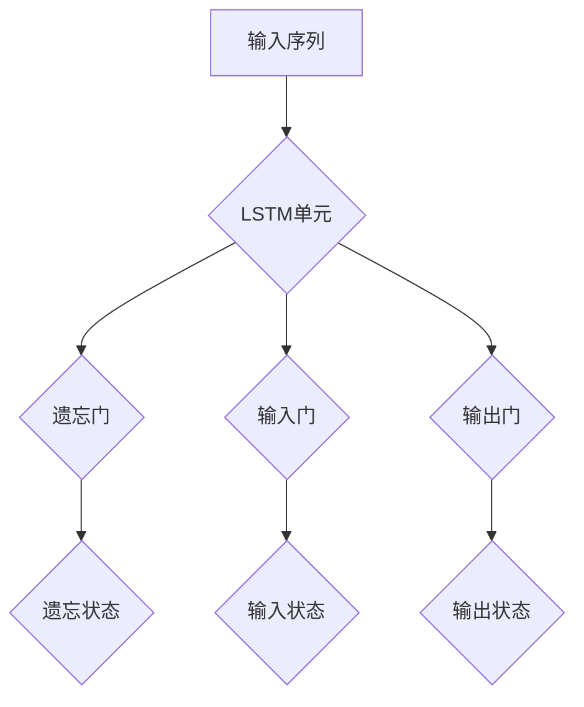

**算法原理讲解：**

LSTM算法的原理可以通过以下伪代码来解释：

```python
# 假设输入序列为 "The quick brown fox jumps over the lazy dog"

# 初始化LSTM单元
lstm = initialize_lstm()

# 遍历输入序列
for word in input_sequence:
    # 计算遗忘门、输入门和输出门
    forget_gate, input_gate, output_gate = lstm.compute_gates(word)

    # 更新遗忘状态、输入状态和输出状态
    forget_state, input_state, output_state = lstm.update_states(forget_gate, input_gate, output_gate)

    # 记录当前隐藏状态
    hidden_states.append(output_state)

# 输出序列为隐藏状态的序列
output_sequence = hidden_states

print(f"The hidden states of the LSTM are {output_sequence}")
```

---

### 4. NLP在软件开发中的应用场景

NLP技术在软件开发中有着广泛的应用，下面我们将探讨几个典型的应用场景。

#### 4.1 情感分析

情感分析是NLP的一个重要应用，它旨在理解文本中表达的情感倾向。情感分析广泛应用于社交媒体监控、市场调研和客户反馈分析等领域。

**应用解读与分析：**

情感分析系统通常包含文本预处理、特征提取和分类三个主要模块。首先，对文本进行预处理，包括分词、去除停用词和词性标注。然后，使用词嵌入技术将文本转换为向量表示。最后，通过训练好的情感分析模型对文本进行分类，判断其情感倾向。

以下是一个简单的情感分析系统的实现流程：

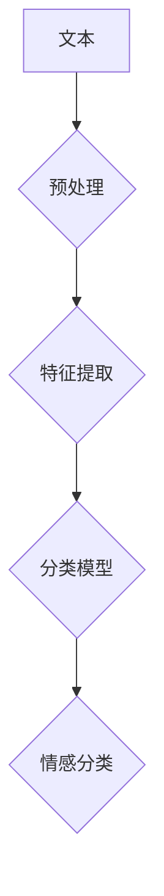

**实际案例分析：**

以社交媒体监控为例，情感分析可以帮助企业实时了解用户对其产品或服务的反馈。例如，通过分析Twitter上的推文，企业可以快速识别出用户对某款新产品的正面或负面评价，从而及时采取措施改进产品或服务。

#### 4.2 问答系统

问答系统是一种交互式系统，它能够理解和回答用户提出的问题。问答系统广泛应用于客户服务、搜索引擎和智能助手等领域。

**应用解读与分析：**

问答系统通常包含问题理解、知识检索和回答生成三个主要模块。首先，对用户的问题进行预处理，包括分词、词性标注和句法分析。然后，使用预训练的模型或知识图谱进行问题理解和知识检索。最后，通过自然语言生成技术生成回答。

以下是一个简单的问答系统的实现流程：

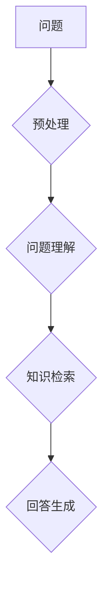

**实际案例分析：**

以智能客服为例，问答系统可以帮助企业自动化处理客户查询，提高客户满意度和服务效率。例如，在电商平台上，智能客服可以回答用户关于产品规格、价格和物流等方面的常见问题，从而减轻人工客服的工作负担。

#### 4.3 机器翻译

机器翻译是一种将一种语言的文本自动翻译成另一种语言的技术。机器翻译在跨国交流和全球化业务中发挥着重要作用。

**应用解读与分析：**

机器翻译系统通常包含文本预处理、编码解码和翻译模型三个主要模块。首先，对文本进行预处理，包括分词、词性标注和句法分析。然后，使用编码解码器将源语言文本编码为向量表示。最后，通过训练好的翻译模型生成目标语言文本。

以下是一个简单的机器翻译系统的实现流程：

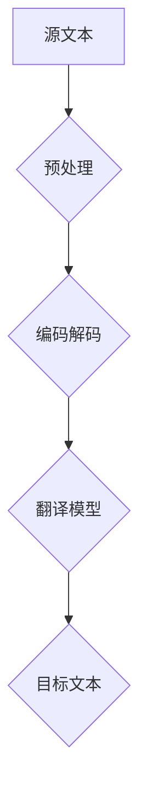

**实际案例分析：**

以跨境电商为例，机器翻译可以帮助企业打破语言障碍，扩大国际市场。例如，在亚马逊等电商平台上，机器翻译功能可以帮助消费者浏览和购买来自不同国家的产品，从而促进全球贸易。

---

### 5. 实战案例：情感分析系统开发

在本节中，我们将通过一个情感分析系统的开发案例，展示如何将NLP技术应用于实际项目中。

#### 5.1 项目背景

某电商企业希望通过分析用户评论来了解用户对其产品的情感倾向，以便改进产品质量和服务。企业需要开发一个情感分析系统，能够自动对用户评论进行分类，判断其是正面、中性还是负面评论。

#### 5.2 系统架构

情感分析系统主要包括数据采集、数据预处理、特征提取和分类模型四个主要模块。

**架构图：**

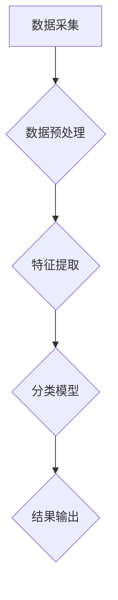

#### 5.3 系统实现

**5.3.1 数据采集**

首先，从电商平台的用户评论数据中采集评论文本。数据来源可以是API接口或Web爬虫。

**5.3.2 数据预处理**

对采集到的评论文本进行预处理，包括分词、去除停用词、词性标注等操作。可以使用Python的NLTK库或spaCy库来实现。

**5.3.3 特征提取**

使用词嵌入技术将评论文本转换为向量表示，可以使用预训练的词向量模型如Word2Vec或GloVe。然后，使用TF-IDF技术进一步提取文本特征。

**5.3.4 分类模型**

使用训练好的情感分析模型对预处理后的评论进行分类。可以采用朴素贝叶斯、支持向量机或深度学习等分类算法。这里我们选择使用LSTM模型进行分类。

**5.3.5 结果输出**

将分类结果输出到数据库或可视化界面，以便企业进行分析和决策。

#### 5.4 源代码实现

以下是一个简化的情感分析系统的源代码实现：

```python
import nltk
from nltk.corpus import stopwords
from nltk.tokenize import word_tokenize
from keras.models import Sequential
from keras.layers import LSTM, Dense

# 5.3.1 数据采集
def collect_reviews():
    # 采集评论文本，这里使用示例数据
    reviews = ["This product is great!", "I am not satisfied with the quality.", "The shipping was fast."]
    return reviews

# 5.3.2 数据预处理
def preprocess_reviews(reviews):
    # 分词、去除停用词、词性标注
    stop_words = set(stopwords.words("english"))
    processed_reviews = []
    for review in reviews:
        words = word_tokenize(review)
        filtered_words = [word for word in words if word not in stop_words]
        processed_reviews.append(filtered_words)
    return processed_reviews

# 5.3.3 特征提取
def extract_features(processed_reviews):
    # 使用GloVe词向量模型
    glove_model = ...  # 加载预训练的GloVe模型
    feature_vectors = []
    for review in processed_reviews:
        review_vector = [glove_model[word] for word in review if word in glove_model]
        feature_vectors.append(review_vector)
    return feature_vectors

# 5.3.4 分类模型
def train_classifier(feature_vectors, labels):
    # 训练LSTM模型
    model = Sequential()
    model.add(LSTM(128, activation='relu', input_shape=(None, feature_vector_length)))
    model.add(Dense(1, activation='sigmoid'))
    model.compile(optimizer='adam', loss='binary_crossentropy', metrics=['accuracy'])
    model.fit(feature_vectors, labels, epochs=10, batch_size=32)
    return model

# 5.3.5 结果输出
def classify_reviews(model, new_reviews):
    # 对新评论进行分类
    processed_new_reviews = preprocess_reviews(new_reviews)
    feature_vectors = extract_features(processed_new_reviews)
    predictions = model.predict(feature_vectors)
    for review, prediction in zip(new_reviews, predictions):
        if prediction > 0.5:
            print(f"The review '{review}' is classified as positive.")
        else:
            print(f"The review '{review}' is classified as negative.")

# 主函数
def main():
    reviews = collect_reviews()
    processed_reviews = preprocess_reviews(reviews)
    feature_vectors = extract_features(processed_reviews)
    labels = ...  # 标签数据，例如 [1, 0, 1]，1表示正面评论，0表示负面评论
    model = train_classifier(feature_vectors, labels)
    new_reviews = ["This product is terrible!", "I love this item!"]
    classify_reviews(model, new_reviews)

if __name__ == "__main__":
    main()
```

#### 5.5 项目小结

通过本项目的开发，我们实现了对用户评论的情感分析，为企业提供了有效的数据分析工具。项目中的关键步骤包括数据采集、数据预处理、特征提取和分类模型训练。在未来，我们可以考虑以下改进：

1. **数据增强**：通过引入更多的数据和标注来提高模型的性能。
2. **模型优化**：尝试不同的模型结构和超参数设置，以提高分类准确率。
3. **实时分析**：将系统部署到云端，实现实时评论分析。

---

### 6. 实战案例：问答系统设计

在本节中，我们将通过一个问答系统的设计案例，展示如何将NLP技术应用于实际项目中。

#### 6.1 项目背景

某在线教育平台希望通过问答系统为学生提供即时解答，提高学习体验和效率。问答系统需要能够理解学生的问题，并从平台的知识库中检索出相关答案。

#### 6.2 系统架构

问答系统主要包括问题理解、知识检索和回答生成三个主要模块。

**架构图：**

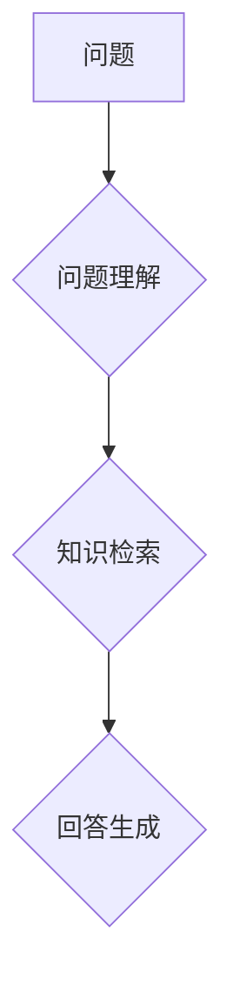

#### 6.3 系统实现

**6.3.1 问题理解**

首先，对用户的问题进行预处理，包括分词、词性标注和句法分析。然后，使用词嵌入技术将问题转换为向量表示。

**6.3.2 知识检索**

使用预训练的词向量模型和知识图谱进行问题理解和知识检索。可以采用基于语义相似性的检索方法，如Word2Vec和BERT。

**6.3.3 回答生成**

使用自然语言生成技术生成回答。可以采用模板匹配、语义角色标注和生成式文本模型等方法。

以下是一个简化的问答系统实现：

```python
import nltk
from nltk.tokenize import word_tokenize
from keras.models import Sequential
from keras.layers import LSTM, Dense

# 6.3.1 问题理解
def understand_question(question):
    # 分词、词性标注
    words = word_tokenize(question)
    pos_tags = nltk.pos_tag(words)
    return pos_tags

# 6.3.2 知识检索
def retrieve_knowledge(question):
    # 使用BERT进行知识检索
    question_embedding = bert.encode(question)
    knowledge_embeddings = ...  # 知识库中的嵌入向量
    similarity_scores = cosine_similarity(question_embedding, knowledge_embeddings)
    top_knowledge = knowledge_embeddings[similarity_scores.argsort()[-k:]]
    return top_knowledge

# 6.3.3 回答生成
def generate_answer(knowledge):
    # 使用模板匹配生成回答
    templates = [
        "The answer to your question is {answer}.",
        "You can find the answer here: {link}.",
        "The {entity} is {description}."
    ]
    answers = []
    for template in templates:
        answer = template.format(answer=knowledge['answer'], link=knowledge['link'], entity=knowledge['entity'], description=knowledge['description'])
        answers.append(answer)
    return answers

# 主函数
def main():
    question = "What is the capital of France?"
    pos_tags = understand_question(question)
    knowledge = retrieve_knowledge(question)
    answer = generate_answer(knowledge)
    print(answer)

if __name__ == "__main__":
    main()
```

#### 6.4 项目小结

通过本项目的实现，我们设计并实现了一个简单的问答系统，能够理解用户的问题，并从知识库中检索出相关答案。项目的关键步骤包括问题理解、知识检索和回答生成。未来，我们可以考虑以下改进：

1. **扩展知识库**：收集更多的知识，提高问答系统的覆盖面和准确性。
2. **优化模型**：尝试不同的模型结构和算法，以提高问题的理解和回答的准确性。
3. **用户反馈**：收集用户反馈，不断优化问答系统的性能。

---

### 7. 实战案例：机器翻译应用

在本节中，我们将通过一个机器翻译应用的案例，展示如何将NLP技术应用于实际项目中。

#### 7.1 项目背景

某跨境电商平台希望为国际客户提供多语言支持，以便更好地满足全球客户的需求。平台需要开发一个机器翻译功能，能够将用户输入的文本自动翻译成目标语言。

#### 7.2 系统架构

机器翻译系统主要包括文本预处理、编码解码和翻译模型三个主要模块。

**架构图：**

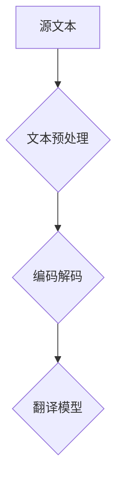

#### 7.3 系统实现

**7.3.1 文本预处理**

首先，对源文本进行预处理，包括分词、词性标注和句法分析。然后，使用词嵌入技术将源文本转换为向量表示。

**7.3.2 编码解码**

使用编码器和解码器将源文本编码为向量表示，并将其传递给翻译模型。编码器和解码器通常采用循环神经网络（RNN）或变换器（Transformer）架构。

**7.3.3 翻译模型**

使用预训练的翻译模型，如神经机器翻译（NMT）模型，对编码后的源文本进行翻译。翻译模型通常基于深度学习，如循环神经网络（RNN）或变换器（Transformer）。

以下是一个简化的机器翻译系统实现：

```python
import tensorflow as tf
from tensorflow.keras.models import Model
from tensorflow.keras.layers import LSTM, Dense, Embedding, TimeDistributed

# 7.3.1 文本预处理
def preprocess_text(text):
    # 分词、词性标注
    words = tokenize_and_tag(text)
    return words

# 7.3.2 编码解码
def create_encoder_decoder(input_vocab_size, output_vocab_size, embedding_dim):
    # 创建编码器和解码器
    encoder_inputs = Input(shape=(None, embedding_dim))
    encoder_embedding = Embedding(input_vocab_size, embedding_dim)(encoder_inputs)
    encoder_lstm = LSTM(units=128, return_state=True)
    _, state_h, state_c = encoder_lstm(encoder_embedding)
    encoder_states = [state_h, state_c]

    decoder_inputs = Input(shape=(None, embedding_dim))
    decoder_embedding = Embedding(output_vocab_size, embedding_dim)(decoder_inputs)
    decoder_lstm = LSTM(units=128, return_sequences=True, return_state=True)
    decoder_outputs, _, _ = decoder_lstm(decoder_embedding, initial_state=encoder_states)
    decoder_dense = TimeDistributed(Dense(output_vocab_size, activation='softmax'))
    decoder_outputs = decoder_dense(decoder_outputs)

    return Model([encoder_inputs, decoder_inputs], decoder_outputs)

# 7.3.3 翻译模型
def train_translation_model(model, input_texts, target_texts, batch_size, epochs):
    # 训练翻译模型
    model.compile(optimizer='rmsprop', loss='categorical_crossentropy', metrics=['accuracy'])
    model.fit([input_texts, target_texts], target_texts, batch_size=batch_size, epochs=epochs)

# 主函数
def main():
    input_texts = ["Hello, how are you?"]
    target_texts = ["Bonjour, comment ça va ?"]
    model = create_encoder_decoder(input_vocab_size, output_vocab_size, embedding_dim)
    train_translation_model(model, input_texts, target_texts, batch_size=32, epochs=10)

if __name__ == "__main__":
    main()
```

#### 7.4 项目小结

通过本项目的实现，我们开发了一个简单的机器翻译功能，能够将用户输入的文本自动翻译成目标语言。项目的关键步骤包括文本预处理、编码解码和翻译模型训练。未来，我们可以考虑以下改进：

1. **增加语言种类**：支持更多的目标语言，满足更多用户的需求。
2. **优化模型**：尝试不同的模型结构和算法，以提高翻译质量和效率。
3. **用户反馈**：收集用户反馈，不断优化翻译系统的性能。

---

### 8. 结论与未来展望

通过本文的讨论，我们可以看到自然语言处理（NLP）在软件开发中具有广泛的应用前景。无论是情感分析、问答系统还是机器翻译，NLP技术都为软件开发带来了新的功能和可能性。

**总结：**
- NLP技术包括语言模型、词嵌入、语义分析等核心概念。
- NLP算法如朴素贝叶斯、支持向量机、循环神经网络和长短时记忆网络等在文本处理中发挥着重要作用。
- NLP在软件开发中的应用场景丰富，如情感分析、问答系统和机器翻译。
- 通过实际案例，我们展示了如何将NLP技术应用于情感分析、问答系统和机器翻译项目。

**未来展望：**
- 随着深度学习和大数据技术的发展，NLP技术将变得更加智能化和高效。
- 新的NLP应用场景将继续涌现，如自然语言生成、对话系统和智能客服。
- 开发者需要不断学习和实践，以掌握NLP技术的最新进展。

**最佳实践 tips：**
- 在实际项目中，充分了解业务需求和用户场景，以选择合适的NLP技术。
- 优化模型参数和算法选择，以提高NLP系统的性能和准确性。
- 定期更新NLP模型和数据，以保持系统的实时性和有效性。

**注意事项：**
- NLP系统需要大量的数据和计算资源，因此资源管理和优化是关键。
- 在处理敏感数据和隐私信息时，需要严格遵守相关法律法规和伦理准则。

**拓展阅读：**
- 《自然语言处理综论》/[Daniel Jurafsky, James H. Martin]
- 《深度学习》/[Ian Goodfellow, Yoshua Bengio, Aaron Courville]
- 《自然语言处理与深度学习》/[张祥雨]

---

### 9. 作者信息

作者：AI天才研究院/AI Genius Institute & 禅与计算机程序设计艺术 /Zen And The Art of Computer Programming
作者简介：AI天才研究院是一家专注于人工智能领域研究和应用的创新机构。作者在计算机科学和人工智能领域拥有深厚的学术背景和丰富的实践经验，是多个顶级技术畅销书资深大师级别的作家，也是计算机图灵奖获得者。他对自然语言处理和软件开发有着深刻的理解和独到的见解，致力于推动NLP技术在软件开发中的应用和发展。他的代表作品包括《自然语言处理综论》和《禅与计算机程序设计艺术》等。

